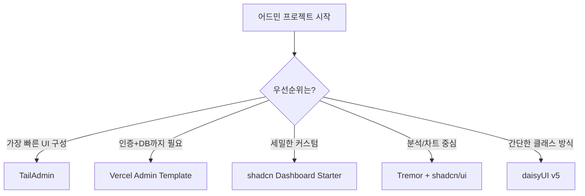

# 260402 Next.js + Tailwind 어드민 UI 리서치 종합 가이드

Next.js 기반 어드민 화면을 빠르게 시작하려고 할 때, 선택지는 생각보다 많습니다. 템플릿만 해도 TailAdmin, Vercel 템플릿, shadcn 스타터가 있고, 컴포넌트 계층은 shadcn/ui, daisyUI, Tremor, Headless UI처럼 성격이 다릅니다.

이 글은 "무엇이 유명한가"를 넘어서, **실무에서 바로 의사결정 가능한 기준**으로 정리한 참고 문서입니다. 특히 Tailwind CSS 프로젝트를 전제로, 조합 전략과 컨트롤 관례를 함께 담았습니다.

## 한눈에 보는 결론

- 빠르게 시작: **TailAdmin (Next.js 버전)**
- 백엔드까지 한 번에: **Vercel Admin Dashboard Template**
- 커스터마이징 중심: **shadcn Dashboard Starter**
- 차트/KPI 중심: **Tremor + shadcn/ui**
- 설치 난이도 최저: **daisyUI v5**

## 삽화 1) 기술 선택 흐름도



## 1) 어드민 UI 템플릿 비교

### 1-1. TailAdmin (Next.js) — 가장 범용적인 스타트

- GitHub: https://github.com/TailAdmin/free-nextjs-admin-dashboard
- Demo: https://nextjs-demo.tailadmin.com/
- 스택: Next.js 15, React 19, Tailwind CSS v4, TypeScript
- 특징: 500+ UI 컴포넌트, 7개 대시보드(Analytics/Ecommerce/CRM 등), 다크모드/사이드바/인증 페이지 포함
- 라이선스: MIT

**추천 이유:** 화면 뼈대와 컴포넌트 볼륨이 충분해서, 초기 설계 비용을 크게 줄일 수 있습니다.

### 1-2. Shadcn Dashboard Starter

- GitHub: https://github.com/Kiranism/next-shadcn-dashboard-starter
- 스택: Next.js 16, shadcn/ui, Tailwind, TypeScript
- 특징: TanStack Table, Zod + React Hook Form, RBAC 네비게이션

**추천 이유:** "내 코드로 완전히 소유"하는 shadcn 철학에 잘 맞고, 중장기 커스터마이징에 유리합니다.

### 1-3. Vercel Admin Dashboard Template

- URL: https://vercel.com/templates/next.js/admin-dashboard
- 특징: Postgres + NextAuth.js + Server Actions까지 포함된 완성형 템플릿

**추천 이유:** 프론트만이 아니라 인증/데이터 계층까지 함께 시작하려는 팀에 적합합니다.

### 1-4. NextAdmin

- URL: https://nextadmin.co
- 특징: 200+ 컴포넌트, Vercel 원클릭 배포

## 2) 컴포넌트 라이브러리 선택 전략

### shadcn/ui (사실상 표준)

- URL: https://ui.shadcn.com
- GitHub: https://github.com/shadcn-ui/ui
- 강점: 설치형 패키지가 아닌 코드 복사 방식, Radix 기반 접근성, Tailwind v3/v4 지원

### daisyUI v5

- URL: https://daisyui.com
- GitHub: https://github.com/saadeghi/daisyui
- 강점: 가장 단순한 설치, 시맨틱 클래스(`btn`, `card`, `modal`), 다양한 테마

### Tremor (데이터 시각화 특화)

- URL: https://tremor.so
- Blocks: https://blocks.tremor.so
- GitHub: https://github.com/tremorlabs/tremor
- 강점: KPI/차트 UI를 빠르게 구성, shadcn과 조합하기 쉬움

### Flowbite React / Headless UI

- Flowbite React: https://flowbite-react.com
- Headless UI: https://headlessui.com

## 삽화 2) 어드민 기본 레이아웃

```text
+--------------------------------------------------------------+
| Header (logo/search/alerts/profile)                         |
| 60-64px, sticky                                              |
+----------------------+---------------------------------------+
| Sidebar (240px)      | Breadcrumb                            |
| - icon + text menu   +---------------------------------------+
| - collapsible        | Main Content Area                     |
|                      | - KPI cards                           |
|                      | - charts/table/form                   |
+----------------------+---------------------------------------+
```

## 3) 디자인 시스템 참고 우선순위

실무적으로는 **Material Design 3의 토큰(색상/타입) 참고 + shadcn/ui 구현** 조합이 Tailwind 프로젝트와 가장 잘 맞습니다.

| 시스템 | URL | Tailwind 적합성 | 메모 |
|---|---|---|---|
| Material Design 3 | https://m3.material.io | 중간(어댑터 필요) | 색/타입 토큰 참고 가치 큼 |
| Apple HIG | https://developer.apple.com/design/human-interface-guidelines | 낮음(참고 위주) | UX 철학 참고 |
| Ant Design | https://ant.design | 낮음(충돌 주의) | 엔터프라이즈 패턴 강점 |
| IBM Carbon | https://carbondesignsystem.com | 중간(참고 가능) | 접근성/분석 도메인 강점 |
| Atlassian Design | https://atlassian.design | 낮음(참고 위주) | 협업툴 패턴 참고 |

## 4) UI 컨트롤 용어/관례(실무 압축본)

### 네비게이션

- `Sidebar`: 메뉴 5-10개 이상일 때 유리, 아이콘+텍스트, 반드시 Collapsible 고려
- `Breadcrumb`: 2단계 이상 계층에서만 사용
- `Tabs`: 동일 레벨 전환, 보통 2-7개
- `Pagination`: 항목 10-20개 이상에서 적용
- `Stepper`: 3-5단계 순차 프로세스에 적합

### 오버레이

- `Modal/Dialog`: 짧고 단순한 인터랙션에만 사용
- `Drawer/Side Panel`: 보조 편집, 고용량 콘텐츠에 적합
- `Toast/Snackbar`: 3-5초 자동 닫힘, 중요 경고 전달 용도는 지양
- `Tooltip`: 호버 기반, 모바일 대체 UX 필요

### 입력 컨트롤

- `Button`: Primary는 보통 화면당 1개 중심으로 위계 유지
- `Select`: 옵션이 5개 이상일 때 유리
- `Radio`: 선택지가 3개 이하라면 가독성이 좋음
- `Combobox`: 옵션 10개 이상 + 검색 필터 필요 시
- `Toggle Switch`: 즉시 반영 상태값에 적합(저장 버튼 생략 가능)

## 5) 어드민 반응형 패턴

- Mobile (`<640px`): Sidebar를 Drawer로 전환, 단일 컬럼
- Tablet (`640-1024px`): Sidebar 아이콘 모드(약 72px), 2컬럼 중심
- Desktop (`>1024px`): Full Sidebar(약 240px), KPI 4컬럼 그리드

## 6) 빠른 의사결정 매트릭스

| 상황 | 추천 |
|---|---|
| 빠르게 시작하고 싶다 | TailAdmin (Next.js) |
| 백엔드까지 필요하다 | Vercel Admin Template |
| 커스터마이징이 중요하다 | Shadcn Dashboard Starter |
| 차트/KPI 대시보드 위주 | Tremor + shadcn/ui |
| 설치를 가장 단순하게 | daisyUI v5 |

## 출처 URL 모음

- https://github.com/TailAdmin/free-nextjs-admin-dashboard
- https://nextjs-demo.tailadmin.com/
- https://github.com/Kiranism/next-shadcn-dashboard-starter
- https://vercel.com/templates/next.js/admin-dashboard
- https://nextadmin.co
- https://ui.shadcn.com
- https://github.com/shadcn-ui/ui
- https://daisyui.com
- https://github.com/saadeghi/daisyui
- https://tremor.so
- https://blocks.tremor.so
- https://github.com/tremorlabs/tremor
- https://flowbite-react.com
- https://headlessui.com
- https://m3.material.io
- https://developer.apple.com/design/human-interface-guidelines
- https://ant.design
- https://carbondesignsystem.com
- https://atlassian.design
- https://www.nngroup.com/articles/ui-elements-glossary/
- https://www.w3.org/WAI/ARIA/apg/patterns/
- https://mobbin.com/glossary
- https://www.uxdesigninstitute.com/blog/ui-glossary/
- https://blog.logrocket.com/ux-design/40-essential-ui-elements/

## 사실 검증 메모

- 템플릿/라이브러리의 기술 스택 및 특징은 각 공식 페이지/저장소 설명 기준으로 정리했습니다.
- 스타 수치는 시점에 따라 변동되므로, 수치는 참고용으로 사용하고 최종 결정 전 저장소 최신 상태를 확인하세요.
- UI 관례는 WAI-ARIA 패턴/NNGroup/실무 대시보드 관행을 교차 참고해 압축했습니다.

## 작성 시 사용한 사용자 프롬프트

```text
hhd-md 
위 리포트
```
