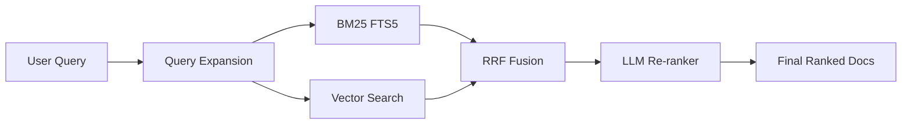
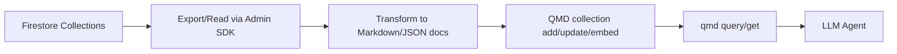

# 260404 QMD Firestore PydanticAI 가이드

## 한눈에 보는 결론

QMD는 로컬 문서 검색을 위한 경량 검색엔진처럼 보이지만, 실제로는 에이전트 워크플로우에서 쓸 수 있는 **하이브리드 RAG 검색 계층**에 가깝다. Firestore의 운영 데이터를 문서화해 QMD에 색인하고, pydantic.ai 에이전트 도구로 연결하면, `데이터 조회 -> 문맥 검색 -> 구조화 응답` 파이프라인을 비교적 짧은 코드로 구성할 수 있다.

| 항목 | 핵심 요약 |
|---|---|
| 포지션 | 로컬 중심 하이브리드 검색(BM25 + Vector + Rerank) |
| 강점 | 에이전트 친화 출력(JSON/files), MCP 제공 |
| 주의점 | 초기 임베딩 비용, 모델 로딩 시간, 데이터 파이프라인 설계 필요 |
| 추천 시나리오 | 내부 지식검색, 회의록/코드베이스 검색, 사내 RAG |

---

## 1) 소개

QMD(Query Markup Documents)는 로컬 파일 기반 문서 검색 도구다. 단순 문자열 검색이 아니라 다음 3단 결합 구조를 사용한다.

$$
S_{final} = \alpha S_{fts} + \beta S_{vec} + \gamma S_{rerank}
$$

실제 내부 조합은 RRF 및 랭크별 블렌딩으로 더 정교하지만, 개념적으로는 위 식처럼 이해하면 된다.



---

## 2) 특징

| 특징 | 설명 | 실무 포인트 |
|---|---|---|
| 하이브리드 검색 | BM25 + Vector + Rerank 결합 | 키워드/의미검색 균형 |
| Query Expansion | 질의 확장으로 recall 보강 | 모호한 질문 대응 유리 |
| MCP 서버 | `query/get/multi_get/status` 제공 | 에이전트 도구 연계 쉬움 |
| SDK 제공 | Node/Bun에서 `createStore()` 가능 | 앱 내 임베딩 가능 |
| Context 관리 | 경로별 의미(context) 부여 | 결과 해석 품질 상승 |
| AST-aware chunking | 코드 파일 함수/클래스 경계 중심 분할 | 코드 검색 품질 개선 |

---

## 3) 장단점

### 장점

| 장점 | 이유 |
|---|---|
| 데이터 통제 용이 | 로컬 인덱스/로컬 모델 중심 운영 가능 |
| 품질-속도 타협 가능 | `search/vsearch/query` 모드 선택 가능 |
| 에이전트 친화성 | JSON/files 출력, MCP로 도구화 쉬움 |
| 적용 범위 넓음 | 문서, 노트, 회의록, 코드베이스까지 커버 |

### 단점

| 단점 | 대응 전략 |
|---|---|
| 초기 임베딩 비용 | 야간 배치 임베딩, 증분 업데이트 |
| 모델 다운로드/로딩 시간 | 상시 프로세스(MCP HTTP daemon) 운용 |
| 다국어 품질 편차 | `QMD_EMBED_MODEL` 교체 후 재임베딩 |
| DB 원문 직접검색 한계 | Firestore -> 문서화 파이프라인 구성 |

---

## 4) 간단 예제

```bash
# 설치
npm install -g @tobilu/qmd

# 컬렉션 등록
qmd collection add ~/notes --name notes

# 임베딩
qmd embed

# 검색
qmd search "project timeline"
qmd vsearch "how to deploy"
qmd query "quarterly planning process"
```

### 결과 해석 미니표

| 점수 구간 | 해석 |
|---|---|
| 0.8 ~ 1.0 | 매우 관련 높음 |
| 0.5 ~ 0.8 | 중간 이상 관련 |
| 0.2 ~ 0.5 | 일부 관련 |
| 0.0 ~ 0.2 | 관련 낮음 |

---

## 5) 실용 예제 (에이전트 연동형)

```bash
# 후보 문서 목록 추출
qmd query "auth error handling" --all --files --min-score 0.4

# JSON 구조로 받아 파이프라인 연결
qmd query "auth error handling" --json -n 20

# 선택 문서 본문 조회
qmd get "docs/api-reference.md" --full
```

실무에서는 보통 다음 순서로 사용한다.

1. `query --files`로 후보 수집
2. 후보를 점수 임계치로 필터링
3. `get`으로 본문 회수
4. LLM 프롬프트 컨텍스트로 삽입

---

## 6) 로컬 개발폴더에서 사용 (HhdStock 기준)

현재 환경에서는 QMD 인덱스가 이미 구성되어 있고, `HhdStock` 관련 컬렉션이 다수 등록되어 있다. 따라서 신규 사용 시에는 아래처럼 최소 명령만으로 운영이 가능하다.

```bash
# 프로젝트 루트 등록
qmd collection add . --name hhdstock

# 변경분 반영
qmd update

# 임베딩 반영
qmd embed

# 검색
qmd query "portfolio rebalancing logic"
```

### 운영 주기 예시

| 주기 | 작업 | 명령 |
|---|---|---|
| 코드 커밋 후 | 인덱스 갱신 | `qmd update` |
| 일 1회 | 임베딩 갱신 | `qmd embed` |
| 질의 시 | 하이브리드 검색 | `qmd query ...` |

---

## 7) Firestore DB 내용을 기반으로 사용

QMD는 파일/문서 인덱싱 중심이므로, Firestore는 아래 변환 파이프라인으로 연결하는 것이 안정적이다.



### Python 스냅샷 예시

```python
from pathlib import Path
from firebase_admin import initialize_app, firestore

initialize_app()  # ADC 권장
db = firestore.client()

out_dir = Path("./firestore_snapshot/orders")
out_dir.mkdir(parents=True, exist_ok=True)

for doc in db.collection("orders").stream():
    data = doc.to_dict()
    body = (
        f"# orders/{doc.id}\n\n"
        f"- source: firestore\n"
        f"- updated_at: {data.get('updated_at')}\n\n"
        "```json\n"
        f"{data}\n"
        "```\n"
    )
    (out_dir / f"{doc.id}.md").write_text(body, encoding="utf-8")
```

이후:

```bash
qmd collection add ./firestore_snapshot --name fs-orders --mask "**/*.md"
qmd update
qmd embed
qmd query "지난달 환불 원인 패턴"
```

### 설계 체크표

| 체크 항목 | 권장 |
|---|---|
| 민감정보 마스킹 | 색인 전 수행 |
| 문서 단위 | 컬렉션/문서ID 기준 파일 분리 |
| 메타데이터 | source, updated_at, tenant 등 헤더화 |
| 증분 처리 | updated_at 기준 증분 내보내기 |

---

## 8) pydantic.ai와 연계해서 사용

pydantic.ai 에이전트에 QMD를 도구로 연결하는 방식은 크게 두 가지다.

| 방식 | 설명 | 추천 상황 |
|---|---|---|
| CLI Tool 래핑 | `subprocess`로 `qmd query/get` 호출 | 빠른 PoC |
| MCP 연결 | QMD MCP 서버를 도구로 연결 | 장기 운영/확장 |

### pydantic.ai + QMD (CLI Tool) 예시

```python
import json
import subprocess
from pydantic import BaseModel
from pydantic_ai import Agent

class Answer(BaseModel):
    summary: str
    evidence_files: list[str]

agent = Agent(
    "openai:gpt-5.2",
    output_type=Answer,
    instructions="질문에 답할 때 먼저 qmd_search 도구로 근거를 찾고, 파일 근거를 포함해 답하라.",
)

@agent.tool
def qmd_search(query: str) -> str:
    cmd = ["qmd", "query", query, "--json", "-n", "8"]
    proc = subprocess.run(cmd, capture_output=True, text=True, check=True)
    return proc.stdout

@agent.tool
def qmd_get(path_or_docid: str) -> str:
    cmd = ["qmd", "get", path_or_docid, "--full"]
    proc = subprocess.run(cmd, capture_output=True, text=True, check=True)
    return proc.stdout
```

### 출력 품질 수식 예시

$$
Quality \approx f(검색정밀도, 문맥충실도, 출력스키마검증)
$$

여기서 pydantic.ai는 출력 스키마 검증을, QMD는 검색 정밀도/문맥 충실도를 담당한다.

---

## 사실 / 추정 / 검증필요

### 사실

- QMD는 로컬 하이브리드 검색(BM25 + Vector + Rerank)과 MCP 도구를 공식 제공한다.
- QMD는 CLI/SDK/MCP 경로를 모두 제공하며, 에이전트 입력에 적합한 출력 포맷을 지원한다.
- Firebase Admin SDK는 서버 환경에서 Firestore 접근을 지원하며, ADC를 권장한다.
- 현재 로컬 환경에서 QMD 인덱스/컬렉션이 이미 생성되어 있다.

### 추정

- Firestore 스냅샷 문서화를 통한 QMD 연계가 운영 안정성과 감사추적 측면에서 유리하다.
- pydantic.ai 도구 계층에서 `query -> get` 2단 retrieval이 답변 품질을 높인다.

### 검증필요

- 실제 데이터 크기에서 임베딩 시간/비용/지연
- 한국어 데이터 비중이 높은 경우 임베딩 모델 교체 효과
- 멀티 테넌트 환경의 권한/필터링 정책

---

## 참고 URL

- QMD GitHub: https://github.com/tobi/qmd
- QMD README(raw): https://raw.githubusercontent.com/tobi/qmd/main/README.md
- Pydantic AI Docs: https://ai.pydantic.dev/
- Firebase Admin SDK Setup: https://firebase.google.com/docs/admin/setup
- Firestore Docs: https://firebase.google.com/docs/firestore
- Firestore Export/Import: https://firebase.google.com/docs/firestore/manage-data/export-import
- Firestore Get Data: https://firebase.google.com/docs/firestore/query-data/get-data

---

## 즉시 실행 가능한 다음 액션

1. Firestore -> Markdown 스냅샷 스크립트에 민감정보 마스킹 규칙 추가
2. `qmd update && qmd embed`를 배치 작업으로 등록
3. pydantic.ai 에이전트에 `qmd_search`, `qmd_get` 도구를 붙여 PoC 검증
4. 품질 측정용 질의셋(20~50개)으로 검색/응답 정확도 점검

---

```text
사용자 프롬프트:
hhd-research
hhd-md

주제 : QMD https://github.com/tobi/qmd

- 소개
- 특징
- 장단점
- 간단예제
- 실용예제
- 로컬개발폴더에서 사용
- firestore DB 의 내용을 기반으로 사용
- pydantic.ai와 연계해서 사용
```
