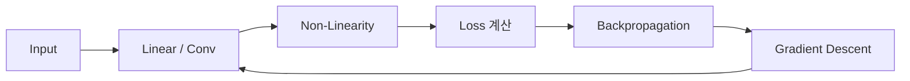
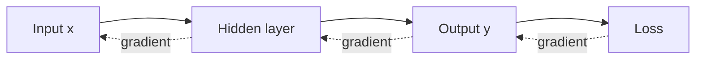
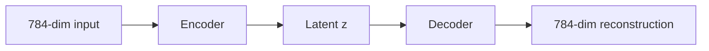

# 260411 딥러닝 핵심 개념 정리

이 문서는 이번 세션에서 나온 질문들을 중복 없이 다시 묶어, 딥러닝 입문자가 한 번에 읽기 좋게 재구성한 노트다. `QMD status`는 확인했고, 문서 내용은 세션 대화를 중심으로 정리했다.

## 1. 큰 흐름 한 장 요약

| 주제 | 핵심 한 줄 |
|---|---|
| MLP | 선형변환 + 비선형함수를 여러 층 쌓은 기본 신경망 |
| ReLU | 계산이 쉽고 gradient vanishing이 덜해서 많이 사용 |
| Bias | 결정경계와 함수를 원점에서 자유롭게 이동시키는 절편 |
| GD / SGD | loss를 줄이는 방향으로 파라미터를 조금씩 업데이트 |
| Backprop | 출력 오차를 뒤에서 앞으로 전파해 각 가중치의 책임을 계산 |
| CNN | 지역 패턴과 가중치 공유를 활용해 이미지에 특히 강함 |
| Word2Vec | 비슷한 문맥에 나오는 단어를 비슷한 벡터로 학습 |
| Autoencoder | 입력을 압축했다가 다시 복원하며 잠재표현을 학습 |
| BatchNorm | 배치 기준으로 값을 안정화해 학습을 쉽게 만드는 기법 |



## 2. 자주 쓰는 약자와 기본 용어

| 약자 | 풀네임 | 뜻 |
|---|---|---|
| MLP | Multi-Layer Perceptron | 다층 퍼셉트론 |
| NLP | Natural Language Processing | 자연어 처리 |
| CNN | Convolutional Neural Network | 합성곱 신경망 |
| GD | Gradient Descent | 경사하강법 |
| SGD | Stochastic Gradient Descent | 확률적 경사하강법 |
| AE | Autoencoder | 오토인코더 |
| latent | latent representation/vector | 잠재표현, 숨겨진 압축 특징 |
| convex | convex function/problem | 볼록한 함수/문제 |

### Convex란?

- 그래프가 한 개의 그릇처럼 생겨 local minimum이 곧 global minimum인 경우를 말한다.
- 딥러닝은 보통 `non-convex` 문제라서 지형이 훨씬 복잡하다.

## 3. 선형, 비선형, Bias

### Non-Linearity가 왜 필요한가?

- 층을 아무리 많이 쌓아도 중간에 비선형 함수가 없으면 전체는 결국 하나의 선형변환이다.
- 즉, 복잡한 곡선 경계와 복잡한 패턴을 배우려면 비선형성이 꼭 필요하다.

$$
y = W_2(W_1x+b_1)+b_2 = (W_2W_1)x + (W_2b_1+b_2)
$$

위 식처럼 비선형 함수가 없으면 여러 층이 있어도 결국 하나의 선형식으로 합쳐진다.

### Bias는 왜 필요한가?

- Bias는 직선의 절편처럼 함수나 결정경계를 위아래, 좌우로 옮기는 역할을 한다.
- Bias가 없으면 많은 결정경계가 원점을 지나야 해서 표현력이 줄어든다.

$$
y = Wx + b
$$

## 4. ReLU가 Sigmoid보다 많이 쓰이는 이유

### ReLU를 많이 쓰는 이유

- Sigmoid는 큰 양수/음수에서 기울기가 거의 0이 되어 깊은 네트워크에서 학습이 느려질 수 있다.
- ReLU는 양수 구간에서 기울기가 1이라 gradient vanishing이 덜하다.
- 계산도 `max(0, x)`라서 단순하고 빠르다.

| 활성화 함수 | 식 | 장점 | 단점 |
|---|---|---|---|
| Sigmoid | $\sigma(x)=\frac{1}{1+e^{-x}}$ | 출력이 0~1, 확률 해석 쉬움 | saturation, vanishing gradient |
| ReLU | $f(x)=\max(0,x)$ | 빠름, 깊은 모델 학습 유리 | dying ReLU 가능 |

### ReLU로 곡선을 어떻게 근사하나?

- ReLU 하나는 꺾인 직선 하나를 만든다.
- 여러 개를 조합하면 구간별 직선(piecewise linear)의 조합이 된다.
- 직선 조각을 많이 붙이면 복잡한 곡선을 가깝게 근사할 수 있다.

```text
부드러운 곡선 ≈ 짧은 직선 조각 여러 개
직선 조각 여러 개 ≈ 여러 ReLU의 조합
```

### Dying ReLU를 쉽게 설명하면

ReLU는

$$
f(x)=\max(0,x)
$$

이라서 입력이 음수면 출력이 0이고, 그 구간의 기울기도 0이다.

- 어떤 뉴런이 계속 음수 입력만 받으면 항상 0만 출력한다.
- 이때 gradient도 0이어서 가중치가 거의 업데이트되지 않는다.
- 그러면 그 뉴런은 이후에도 0만 내는 상태에 갇힐 수 있다.

쉽게 말하면:

- 켜져 있으면 일하는 스위치
- 꺼지면 0만 내는 스위치
- 한 번 너무 세게 꺼져서 계속 음수 쪽에 머무르면 다시 켜질 신호가 잘 안 들어온다

대처법:

- `Leaky ReLU`
- 초기화 개선
- learning rate 조절
- BatchNorm 사용

## 5. MLP를 수식과 행렬 차원으로 보기

입력 3개, 은닉층 4개, 출력 2개인 가장 작은 예를 보자.

```text
입력층(3) -> 은닉층(4) -> 출력층(2)
```

### 차원 정리

| 기호 | 의미 | dim |
|---|---|---|
| $x$ | 입력 벡터 | $(3 \times 1)$ |
| $W_1$ | 입력 -> 은닉층 가중치 | $(4 \times 3)$ |
| $b_1$ | 은닉층 bias | $(4 \times 1)$ |
| $z_1$ | 은닉층 선형결합 | $(4 \times 1)$ |
| $a_1$ | 은닉층 활성값 | $(4 \times 1)$ |
| $W_2$ | 은닉층 -> 출력층 가중치 | $(2 \times 4)$ |
| $b_2$ | 출력층 bias | $(2 \times 1)$ |
| $z_2$ | 출력층 선형결합 | $(2 \times 1)$ |

### 순전파 수식

$$
z_1 = W_1x + b_1
$$

$$
a_1 = \mathrm{ReLU}(z_1)
$$

$$
z_2 = W_2a_1 + b_2
$$

차원 체크:

$$
(4\times3)(3\times1)+(4\times1)=(4\times1)
$$

$$
(2\times4)(4\times1)+(2\times1)=(2\times1)
$$

### 배치 입력으로 보면

입력 샘플 5개를 한 번에 넣는다면:

| 기호 | dim |
|---|---|
| $X$ | $(3 \times 5)$ |
| $Z_1 = W_1X + b_1$ | $(4 \times 5)$ |
| $A_1$ | $(4 \times 5)$ |
| $Z_2 = W_2A_1 + b_2$ | $(2 \times 5)$ |

즉, 각 열이 샘플 하나라고 생각하면 된다.

## 6. Gradient Descent, SGD, Backpropagation

### GD를 아주 쉽게 설명하면

- 산에서 가장 낮은 곳을 찾기 위해 현재 위치에서 가장 가파르게 내려가는 방향으로 조금씩 이동하는 방법이다.

$$
\theta \leftarrow \theta - \eta \nabla L(\theta)
$$

- $\theta$: 파라미터
- $\eta$: learning rate
- $\nabla L(\theta)$: loss의 gradient

### 왜 gradient를 쓰는가?

- 파라미터가 많을 때 모든 방향을 다 시험해볼 수 없기 때문이다.
- gradient는 각 파라미터를 조금 바꾸면 loss가 얼마나 증가/감소하는지 알려준다.
- 그래서 가장 빨리 내려가는 방향을 계산할 수 있다.

### 그래프의 가로축과 세로축

- 가로축: 파라미터 값 또는 파라미터 공간의 한 방향
- 세로축: loss 값
- 실제로는 파라미터가 매우 많아서 고차원 지형이며, 2D 그림은 단순화된 단면이다.

### GD 도중 loss가 잠깐 증가하는 이유

- learning rate가 너무 커서 지나칠 수 있다.
- mini-batch가 샘플 일부만 보고 계산돼 노이즈가 있다.
- momentum, Adam 같은 최적화 기법에서도 순간 증가가 가능하다.

### SGD는 무엇이 다른가?

- GD는 전체 데이터를 한 번에 보고 gradient를 계산한다.
- SGD는 샘플 하나 또는 작은 batch를 보고 근사 gradient를 계산한다.
- 그래서 더 시끄럽지만, local minimum이나 saddle point를 빠져나오는 데 오히려 도움이 될 때가 있다.

### Backpropagation이란?

- 출력의 오차를 뒤에서 앞으로 보내며 각 가중치가 오차에 얼마나 기여했는지 계산하는 절차다.
- 핵심 도구는 chain rule이다.



## 7. Local Minima와 Global Minimum

### 딥러닝이 local minima 문제에도 잘 되는 이유

- 고차원에서는 local minima보다 saddle point가 더 흔한 경우가 많다.
- 완벽한 global minimum이 아니어도 충분히 좋은 해면 성능이 잘 나온다.
- SGD의 노이즈, 좋은 초기화, BatchNorm, 큰 모델 용량 등이 도움을 준다.

### GD가 local minima를 피하나?

- 보장하진 않는다.
- 다만 SGD의 랜덤성이 얕은 local minima나 saddle point 탈출에 도움을 줄 수 있다.

### Global minimum인지 알 수 있나?

- 일반적인 딥러닝에서는 거의 알기 어렵다.
- convex 문제라면 비교적 명확하지만, deep network는 대개 non-convex다.

### 이 문제가 NP-hard인가?

- 일반적인 non-convex 최적화에서 전역최적해를 찾는 문제는 매우 어렵고, 많은 경우 계산적으로 NP-hard로 다뤄진다.
- 즉, 딥러닝에서 GD가 항상 global minimum을 보장하지 않는 것은 자연스러운 일이다.

## 8. 평균, 분산, 표준편차, 정규분포

### 평균

- 데이터의 중심값이다.

$$
\mu = \frac{1}{n}\sum_{i=1}^{n}x_i
$$

### 분산

- 값들이 평균에서 얼마나 퍼져 있는지 나타낸다.

$$
\mathrm{Var}(x) = \frac{1}{n}\sum_{i=1}^{n}(x_i-\mu)^2
$$

### 표준편차

- 분산의 제곱근이다.

$$
\sigma = \sqrt{\mathrm{Var}(x)}
$$

### 정규분포

- 가운데가 높고 양옆이 점점 낮아지는 종(bell) 모양 분포다.
- 평균 근처 값이 많고, 멀리 갈수록 드물다.

### 평균을 빼고 표준편차로 나누면 정규분포가 되나?

아니다.

- 평균은 0이 된다.
- 표준편차는 1이 된다.
- 하지만 데이터의 모양이 자동으로 정규분포가 되지는 않는다.

즉,

$$
x' = \frac{x-\mu}{\sigma}
$$

는 위치와 스케일을 맞추는 변환이지, 분포 모양을 종 모양으로 바꾸는 변환은 아니다.

## 9. Batch Normalization 쉽게 이해하기

BatchNorm은 한 mini-batch 안에서 값의 평균과 분산을 사용해 출력을 안정화한다.

$$
\hat{x} = \frac{x-\mu_B}{\sqrt{\sigma_B^2 + \varepsilon}}
$$

그리고 학습 가능한 스케일과 이동을 다시 준다.

$$
y = \gamma \hat{x} + \beta
$$

### 왜 쓰나?

- 각 층 출력이 너무 크거나 작게 흔들리는 것을 줄인다.
- 학습을 더 안정적으로 만든다.
- learning rate를 크게 써도 잘 버티는 경우가 많다.
- 어느 정도 regularization처럼 작동하기도 한다.

### 핵심 오해 하나

- BatchNorm은 데이터를 정규분포로 "만드는" 것이 목적이 아니다.
- 평균과 스케일을 조정해 학습을 더 쉽게 만드는 것이 핵심이다.

## 10. CNN 핵심 정리

### CNN이 MLP보다 좋은 이유

- 이미지처럼 공간 구조가 있는 데이터에서 지역 패턴을 잘 잡는다.
- 가중치 공유(weight sharing) 때문에 파라미터 수가 훨씬 적다.
- 위치가 조금 바뀌어도 비슷한 특징을 잡기 쉽다.

### 합성곱층 파라미터 수 계산

공식:

$$
\text{params} = (k_h \times k_w \times C_{in} \times C_{out}) + C_{out}
$$

- $k_h, k_w$: 커널 높이/너비
- $C_{in}$: 입력 채널 수
- $C_{out}$: 출력 채널 수(필터 개수)
- 마지막 $C_{out}$는 bias 수

예시 1:

- 입력 채널 3 (RGB)
- 커널 `3x3`
- 출력 채널 64

$$
3 \times 3 \times 3 \times 64 + 64 = 1792
$$

예시 2:

- 입력 채널 64
- 출력 채널 128
- 커널 `3x3`

$$
3 \times 3 \times 64 \times 128 + 128 = 73856
$$

중요한 점:

- 출력 feature map의 가로세로 크기는 파라미터 수에 직접 들어가지 않는다.
- 같은 필터를 모든 위치에 공유하기 때문이다.

### Pooling은 언제 나오나?

- 보통 `Conv -> ReLU -> Pooling` 블록이 중간중간 반복된다.
- 마지막에만 나오는 층이 아니다.
- 다만 네트워크 뒤쪽에서 `Global Average Pooling` 같은 형태가 마지막 근처에 오기도 한다.

### Max Pooling을 쓰는 이유

작은 구역 안에서 가장 큰 값만 남긴다.

```text
예: 2x2 영역
1 0
5 2

MaxPool 결과 = 5
```

왜 좋나?

- 강한 특징 반응 하나를 살린다.
- 특징이 정확히 어디에 있든 "이 근처에 있다"는 사실을 남긴다.
- 계산량을 줄이고 위치 변화에 덜 민감하게 만든다.

쉽게 말하면, 형광펜으로 가장 중요한 문장만 남기는 느낌이다.

### 시퀀스 데이터에도 CNN을 쓸 수 있나?

- 가능하다.
- 1D CNN을 쓰면 시간축, 토큰축을 따라 local pattern을 잡을 수 있다.

## 11. Word2Vec 핵심 정리

### 원리

- 비슷한 문맥에 등장하는 단어는 비슷한 의미를 가진다는 분포 가설(distributional hypothesis)을 이용한다.
- `CBOW`: 주변 단어로 중심 단어 예측
- `Skip-gram`: 중심 단어로 주변 단어 예측

### 왼쪽 파라미터를 임베딩으로 쓰는 이유

- 입력 단어를 내부 dense vector로 바꾸는 행렬이기 때문이다.
- 각 단어의 요약 표현으로 해석하기 좋다.

### 오른쪽 파라미터의 의미

- 출력 측 문맥 점수 계산에 쓰이는 또 다른 단어 표현이다.

### 직관

- `남자`와 `여자`는 보통 비슷한 문맥에 나오므로 가까워질 가능성이 높다.
- `남자`와 `자동차`는 문맥이 더 다르므로 보통 덜 가깝다.

### 간단한 Python 예제

```python
from gensim.models import Word2Vec

sentences = [
    ["i", "like", "deep", "learning"],
    ["i", "like", "nlp"],
    ["deep", "learning", "is", "fun"],
    ["i", "like", "machine", "learning"],
]

model = Word2Vec(
    sentences=sentences,
    vector_size=50,
    window=2,
    min_count=1,
    sg=1,
)

print(model.wv["learning"])
print(model.wv.most_similar("learning"))
```

## 12. Autoencoder 핵심 정리

### 개념

- 입력을 압축(encoder)했다가 다시 복원(decoder)하는 모델이다.
- 중간의 압축된 표현을 latent vector라고 부른다.



### latent란?

- 원본 전체를 그대로 저장한 것이 아니라 핵심 특징만 압축해 담은 내부 표현이다.
- 예를 들어 MNIST에서는 숫자의 굵기, 기울기, 둥근 정도 같은 특징이 latent에 반영될 수 있다.

### latent 차원을 1로 해도 되나?

- 학습은 가능하다.
- 하지만 1차원에 너무 많은 정보를 담아야 해서 복원 품질은 떨어지기 쉽다.

### latent 차원을 늘리면?

| 항목 | 장점 | 단점 |
|---|---|---|
| latent dim 증가 | 정보 보존 증가, 복원 쉬움 | 압축 의미 약화, 단순 복사처럼 될 위험 |

### AE loss를 항상 0으로 만들 수 있나?

- 항상 그렇진 않다.
- 모델 용량과 latent 차원이 충분히 크면 training loss는 매우 작아질 수 있다.
- 하지만 bottleneck이나 regularization이 있으면 0이 아닐 수 있고, 0이어도 일반화가 좋다는 뜻은 아니다.

## 13. MNIST Autoencoder 예제

### Keras 예제

```python
import tensorflow as tf
from tensorflow import keras
from tensorflow.keras import layers

# 1) MNIST 데이터 로드
# x_train, x_test는 28x28 흑백 숫자 이미지다.
# 오토인코더는 입력 자체를 복원하므로 라벨 y는 사용하지 않는다.
(x_train, _), (x_test, _) = keras.datasets.mnist.load_data()

# 2) 0~255 픽셀 값을 0~1 범위로 정규화
x_train = x_train.astype("float32") / 255.0
x_test = x_test.astype("float32") / 255.0

# 3) Dense layer를 쓰기 위해 28x28 이미지를 784차원 벡터로 펼침
x_train = x_train.reshape(-1, 28 * 28)
x_test = x_test.reshape(-1, 28 * 28)

# 4) latent 차원 정의
latent_dim = 32

# 5) 입력층 정의: 길이 784인 벡터 1개
inputs = keras.Input(shape=(784,))

# 6) Encoder: 784 -> 128 -> 32
encoded = layers.Dense(128, activation="relu")(inputs)
encoded = layers.Dense(latent_dim, activation="relu", name="latent")(encoded)

# 7) Decoder: 32 -> 128 -> 784
decoded = layers.Dense(128, activation="relu")(encoded)
outputs = layers.Dense(784, activation="sigmoid")(decoded)

# 8) 전체 autoencoder 모델 생성
autoencoder = keras.Model(inputs, outputs)

# 9) optimizer와 loss 설정
# 입력과 출력이 모두 0~1 범위라 BCE를 사용
autoencoder.compile(optimizer="adam", loss="binary_crossentropy")

# 10) 학습
# 입력 x_train을 넣고, 정답도 x_train 자체로 둔다.
autoencoder.fit(
    x_train,
    x_train,
    epochs=10,
    batch_size=256,
    shuffle=True,
    validation_data=(x_test, x_test)
)

# 11) encoder만 따로 떼어낼 수 있다.
encoder = keras.Model(inputs, encoded)

# 12) 테스트 이미지 일부를 잠재벡터로 변환
latent_vectors = encoder.predict(x_test[:5])

# 13) 복원 결과 확인
reconstructed = autoencoder.predict(x_test[:5])
print(latent_vectors.shape)   # (5, 32)
print(reconstructed.shape)    # (5, 784)
```

### PyTorch 예제

```python
import torch
import torch.nn as nn
import torch.optim as optim
from torchvision import datasets, transforms
from torch.utils.data import DataLoader

# 1) GPU가 있으면 GPU 사용, 없으면 CPU 사용
device = torch.device("cuda" if torch.cuda.is_available() else "cpu")

# 2) ToTensor로 이미지를 0~1 tensor로 바꾸고,
#    view(-1)로 (1,28,28)을 784차원 벡터로 펼친다.
transform = transforms.Compose([
    transforms.ToTensor(),
    transforms.Lambda(lambda x: x.view(-1))
])

# 3) MNIST 데이터셋 로드
train_dataset = datasets.MNIST(root="./data", train=True, download=True, transform=transform)
test_dataset = datasets.MNIST(root="./data", train=False, download=True, transform=transform)

# 4) DataLoader 생성
train_loader = DataLoader(train_dataset, batch_size=256, shuffle=True)
test_loader = DataLoader(test_dataset, batch_size=256, shuffle=False)

# 5) 오토인코더 정의
class AutoEncoder(nn.Module):
    def __init__(self, latent_dim=32):
        super().__init__()
        self.encoder = nn.Sequential(
            nn.Linear(784, 128),
            nn.ReLU(),
            nn.Linear(128, latent_dim),
            nn.ReLU()
        )
        self.decoder = nn.Sequential(
            nn.Linear(latent_dim, 128),
            nn.ReLU(),
            nn.Linear(128, 784),
            nn.Sigmoid()
        )

    def forward(self, x):
        z = self.encoder(x)
        out = self.decoder(z)
        return out

# 6) 모델, 손실함수, optimizer 준비
model = AutoEncoder(latent_dim=32).to(device)
criterion = nn.BCELoss()
optimizer = optim.Adam(model.parameters(), lr=1e-3)

# 7) 학습 반복
for epoch in range(10):
    model.train()
    total_loss = 0.0
    for x, _ in train_loader:
        x = x.to(device)
        optimizer.zero_grad()
        reconstructed = model(x)
        loss = criterion(reconstructed, x)
        loss.backward()
        optimizer.step()
        total_loss += loss.item() * x.size(0)

    avg_loss = total_loss / len(train_loader.dataset)
    print(f"Epoch {epoch+1}, Loss: {avg_loss:.6f}")
```

### batch size와 epoch의 의미

- `batch_size`: 한 번에 몇 개 샘플을 묶어 gradient를 계산할지
- `epochs=10`: 전체 학습 데이터를 10번 반복해서 학습한다는 뜻

예를 들어 데이터가 60,000개이고 batch size가 100이면, 한 epoch당 600번 업데이트한다.

## 14. 대수해, 해석해, 수치해

질문에서 나온 설명은 조금 수정이 필요하다.

| 용어 | 설명 |
|---|---|
| 대수해 | 식 변형으로 closed form으로 표현되는 해 |
| 해석해 | 정확한 수학식 형태의 해라는 넓은 의미로 쓰이는 경우가 많음 |
| 수치해 | 반복 계산으로 근사해서 구한 해 |

즉, "컴퓨터로 근사해서 푸는 해"는 보통 `수치해` 또는 `근사해`라고 부르는 편이 더 정확하다.

## 15. 참고 링크

- ReLU: https://en.wikipedia.org/wiki/Rectifier_(neural_networks)
- Gradient descent: https://en.wikipedia.org/wiki/Gradient_descent
- Backpropagation: https://en.wikipedia.org/wiki/Backpropagation
- Batch normalization: https://arxiv.org/abs/1502.03167
- CNN: https://cs231n.github.io/convolutional-networks/
- Word2Vec: https://arxiv.org/abs/1301.3781
- Autoencoder: https://en.wikipedia.org/wiki/Autoencoder
- MNIST: https://en.wikipedia.org/wiki/MNIST_database

## 16. 호환성 체크

- 수식 블록은 `$$ ... $$` 형식 사용
- 코드블록 언어 태그 추가
- 표는 일반 Markdown 표 사용
- Mermaid 다이어그램 사용; 렌더링이 안 되는 플랫폼이면 텍스트 흐름도로 대체 가능

## 17. 이번 문서 작성에 사용한 사용자 질문 프롬프트

```text
1. 요즘 Sigmoid 보다 ReLU를 많이 쓰는데 그 이유는?
+ Non-Linearity라는 말의 의미와 그 필요성은?
+ ReLU로 어떻게 곡선 함수를 근사하나?
+ ReLU의 문제점은?
+ Bias는 왜 있는걸까?
2. Gradient Descent에 대해서 쉽게 설명한다면?
+ 왜 꼭 Gradient를 써야 할까?
+ 그 그래프에서 가로축과 세로축 각각은 무엇인가?
+ 실제 상황에서는 그 그래프가 어떻게 그려질까?
+ GD 중에 때때로 Loss가 증가하는 이유는?
+ 중학생이 이해할 수 있게 더 쉽게 설명 한다면?
+ Back Propagation에 대해서 쉽게 설명 한다면?
3. Local Minima 문제에도 불구하고 딥러닝이 잘 되는 이유는?
+ GD가 Local Minima 문제를 피하는 방법은?
+ 찾은 해가 Global Minimum인지 아닌지 알 수 있는 방법은?
4. CNN에 대해서 아는대로 얘기하라
+ CNN이 MLP보다 좋은 이유는?
+ 어떤 CNN의 파라메터 개수를 계산해 본다면?
+ 주어진 CNN과 똑같은 MLP를 만들 수 있나?
+ 풀링시에 만약 Max를 사용한다면 그 이유는?
+ 시퀀스 데이터에 CNN을 적용하는 것이 가능할까?
5. Word2Vec의 원리는?
+ 그 그림에서 왼쪽 파라메터들을 임베딩으로 쓰는 이유는?
+ 그 그림에서 오른쪽 파라메터들의 의미는 무엇일까?
+ 남자와 여자가 가까울까? 남자와 자동차가 가까울까?
+ 번역을 Unsupervised로 할 수 있을까?
6. Auto Encoder에 대해서 아는대로 얘기하라
+ MNIST AE를 TF나 Keras등으로 만든다면 몇줄일까?
+ MNIST에 대해서 임베딩 차원을 1로 해도 학습이 될까?
+ 임베딩 차원을 늘렸을 때의 장단점은?
+ AE 학습시 항상 Loss를 0으로 만들수 있을까?

mlp 의 약자?
convex 뜻?
sdg 의 약자?
relu가 기울기가 0일때 dying relu가 되는 쉽고 자세한 설명
gd 가 global minumum 을 찾지 못하는 것도 np-hard?
mlp nlp 의 약자?
CNN 파라미터 수 계산 좀더 자세히, 쉽게
풀링에서 Max를 쓰는 이유 좀더 자세히 , 쉽게
mnist AE를 keras, pytorch 버전으로 각각 예제 알려주세요
latent 뜻?

word2vec 파이썬 예제 알려주세요.
batchnorm 자세히 쉽게 설명
수학식으로 정확히 풀수 있는해는 대수해, 컴퓨터로 근사해서 풀어야 하는해는 해석해, 맞는 설명인가?
max pooling 은 cnn에서 처음에는 convolution layer가 나오다가 막판에 나오는 layer이지요?
왜 마지막에 나오나요?
batch_size, epoches=10 의 의미?
MNIST Autoencoder 예제 아주 자세한 주석을 달아주세요.

평균을 빼고 표준편차로 나눠 정규화
는 평균은 0 이고 정규분포를 하게 되는가?

평균 분산 표준편차 정규분포 자세히 쉽게 설명

mlp 의 간단한 예제를 수식과 행렬로 보여주고
특히 행렬의 dim을 잘 보여주세요

hhd-md

이세션의 모든 내용을
중복 제거 하여
재구성 하여
md 파일로 저장
```

