# 260412 Unity 네트워크 세션 재구성

> 현재 세션에서 다룬 내용을 중복 없이 다시 엮은 정리 문서입니다 ✨  
> 주제는 크게 `Unity 대규모 충돌 처리`, `Profiler 체크 포인트`, `TCP/UDP 패킷 드롭`으로 수렴됩니다 🚀

---

## 0. 한눈에 보는 전체 흐름 🧭

이번 세션의 핵심 결론은 아래처럼 정리할 수 있습니다.

| 주제 | 핵심 결론 | 추천 방향 |
|---|---|---|
| Unity 기본 물리 vs ECS | 단순 대량 충돌은 ECS가 유리, 완전한 물리 품질은 기본 물리가 유리 | 하이브리드 |
| 10,000 유닛 구조 | 원형 충돌 + Spatial Hash + Separation 누적이 현실적 | ECS 군집 충돌 |
| Unity Profiler | Physics, 콜백, Transform sync, GC, Jobs sync point를 분리해서 봐야 함 | 단계별 측정 |
| TCP 패킷 드롭 | 보통 속도 하락 + 재전송 + 혼잡 윈도우 축소 | 손실을 혼잡으로 해석 |
| UDP 패킷 드롭 | 기본 UDP는 감속하지 않고 유실될 수 있음 | 앱 레벨 제어 필요 |

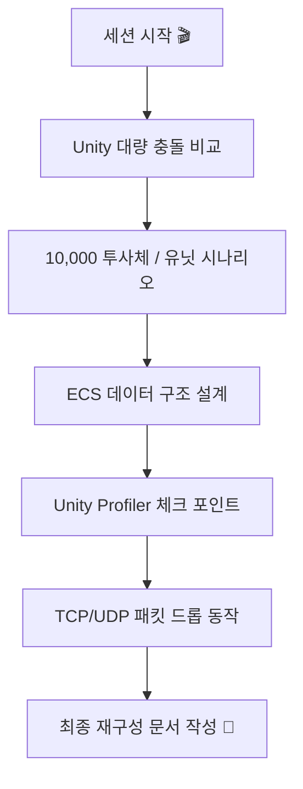

---

## 1. Unity 기본 물리와 ECS 충돌 처리 비교 🎮

처음 논의의 출발점은 이것이었습니다.

- Unity에서 3D 객체가 약 `10,000개`일 때
- 기본 물리엔진의 `Collider/Rigidbody` 기반 충돌 처리와
- `ECS + Burst + Job System`으로 별도 충돌 시스템을 만들었을 때
- 품질, 성능, 구조가 어떻게 달라지는가

### 1-1. 핵심 판단 ✅

- `기본 물리엔진`은 품질과 안정성이 좋습니다 🛡️
- `ECS + Burst + Job System`은 단순 충돌 판정량이 많을수록 매우 빠를 수 있습니다 ⚡
- 하지만 커스텀 ECS 충돌 시스템이 기본 물리 전체를 완전히 대체하는 것은 쉽지 않습니다 😵
- 실전에서는 대부분 `하이브리드`가 가장 현실적입니다 🤝

| 비교 항목 | Unity 기본 물리 | ECS + Burst + Jobs |
|---|---|---|
| 충돌 품질 | 높음 | 구현 수준에 따라 다름 |
| 개발 생산성 | 높음 | 낮을 수 있음 |
| 디버깅 편의 | 좋음 | 구조를 잘 짜야 함 |
| 대량 단순 판정 | 불리할 수 있음 | 매우 유리 |
| 복잡한 상호작용 | 유리 | 직접 구현 부담 큼 |

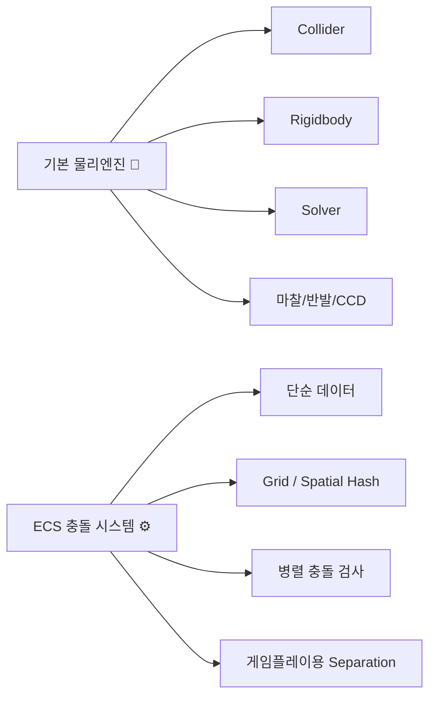

### 1-2. 품질 차이 🌟

- 기본 물리엔진은 충돌 정확도, penetration 해결, solver 안정성, friction, bounce, CCD 같은 기능이 이미 성숙해 있습니다.
- ECS 커스텀은 `내가 구현한 범위까지만` 품질이 나옵니다.
- 따라서 `판정 정확도`는 높게 만들 수 있어도, `완전한 rigidbody 반응 품질`은 기본 물리가 보통 우세합니다.

### 1-3. 성능 차이 🚀

- 단순 `sphere/AABB overlap`, `근접 판정`, `투사체 hit-check`는 ECS가 크게 유리할 수 있습니다.
- 하지만 기본 물리 수준의 기능을 ECS에 모두 넣기 시작하면 성능 격차가 빠르게 줄어듭니다.
- 핵심은 `무엇을 생략할 수 있느냐`입니다.

---

## 2. 10,000 투사체 vs 10,000 유닛 시나리오 분리 🔍

세션에서는 `투사체`와 `유닛`을 분리해서 보는 것이 중요하다고 정리했습니다.

### 2-1. 투사체 10,000개 💥

- 대부분 `명중 판정`이 핵심입니다.
- 반발, 마찰, 복잡한 rigidbody 반응은 보통 불필요합니다.
- 그래서 이 경우는 ECS가 특히 강합니다.

| 항목 | 기본 물리 | ECS 커스텀 |
|---|---|---|
| 구현 난이도 | 낮음 | 중간 |
| 대량 처리 성능 | 상대적으로 불리 | 매우 유리 |
| 고속 이동체 대응 | CCD 비용 큼 | Swept test 직접 설계 가능 |

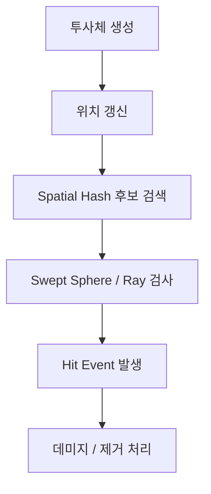

### 2-2. 유닛 10,000개 🧍🧍🧍

- 이쪽은 훨씬 어렵습니다.
- 유닛끼리의 `끼임`, `겹침 해소`, `군집 이동`, `회피`, `지형 대응`, `공격 판정`이 얽혀 있습니다.
- 기본 물리로 전부 처리하면 비용이 커질 수 있고, ECS로 모두 커버하려면 설계가 중요합니다.

| 항목 | 기본 물리 | ECS 커스텀 |
|---|---|---|
| 자연스러운 충돌 | 유리 | 추가 구현 필요 |
| 대량 군집 처리 | 불리할 수 있음 | 유리 |
| 유지보수 | 단순 | 설계 의존 |

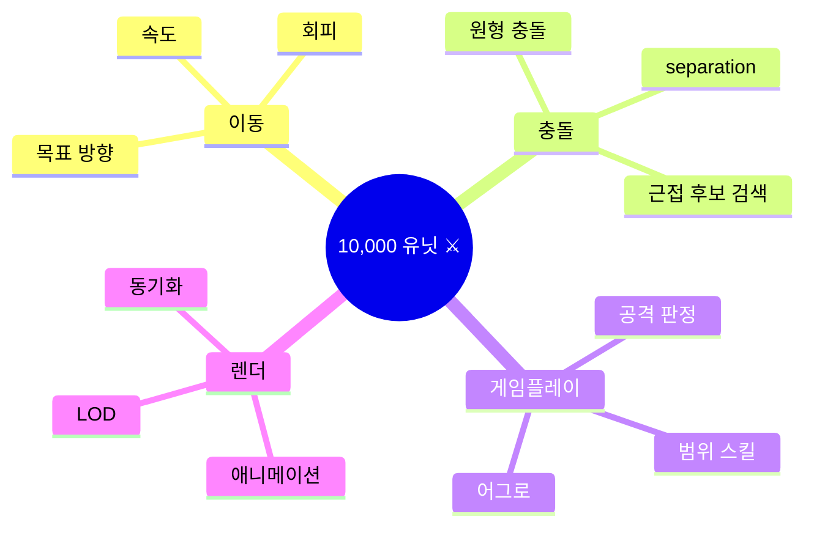

---

## 3. Collider 한계에 대한 현실적인 해석 🧩

세션 중간에는 “기본 물리엔진에서 collider 객체 초과를 경험했다”는 문제의식이 나왔습니다.

여기서 핵심 정리는 다음과 같습니다.

- Unity/PhysX에는 일반적으로 “collider 개수의 명확한 하드 상한”보다
- `동적 객체 수`, `실제 충돌쌍(pair) 수`, `복잡한 Collider 형태`, `CCD`, `콜백 수`, `메모리와 프레임 예산`
- 이 먼저 한계를 만듭니다.

즉 ❗

- `수만 개 static collider`는 가능한 경우가 많고
- `수만 개 dynamic rigidbody + 잦은 충돌`은 매우 부담됩니다.

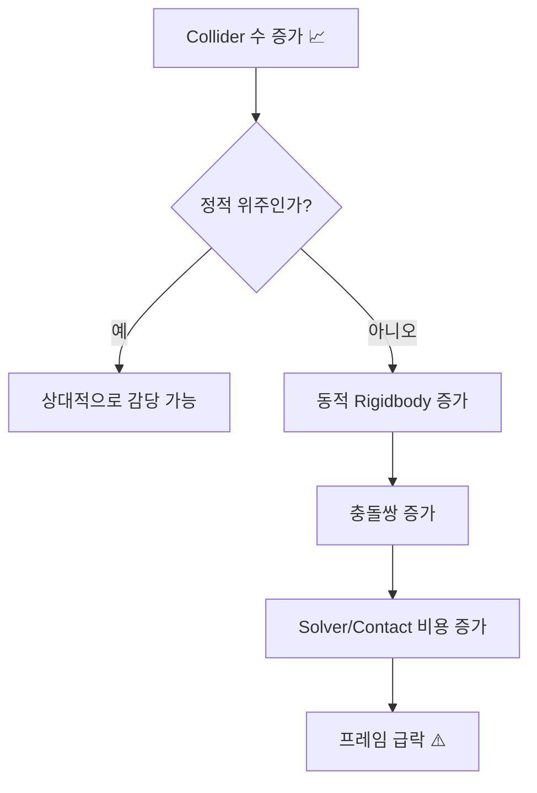

### 3-1. ECS는 객체 수 제한이 없는가? 🤔

- 아닙니다.
- ECS도 결국 `메모리`, `캐시`, `잡 스케줄링`, `후보쌍 수`, `결과 버퍼`, `프레임 예산`에 묶입니다.
- 다만 단순 충돌 문제에서는 기본 물리보다 훨씬 많은 수를 감당하기 쉬운 구조입니다.

---

## 4. 10,000개 기준 대략 프레임타임 감각표 ⏱️

세션에서는 절대값이 아니라 상대 비교용 감각표를 제시했습니다.

| 케이스 | Unity 기본 물리 | ECS + Burst + Jobs | 해석 |
|---|---|---|---|
| 투사체 10,000개 | 8ms ~ 30ms+ | 0.5ms ~ 4ms | ECS가 크게 유리 |
| 유닛 10,000개 단순 separation | 15ms ~ 60ms+ | 2ms ~ 10ms | ECS 유리 |
| 정교한 물리 반응 포함 | 20ms ~ 80ms+ | 비슷하거나 구현 난이도 급증 | 단순 비교 어려움 |

```mermaid
xychart-beta
    title "대략적인 상대 프레임타임 비교"
    x-axis ["투사체10k", "유닛10k", "정교한물리"]
    y-axis "ms" 0 --> 80
    bar [20, 40, 60]
    bar [2, 6, 45]
```

> 위 차트의 첫 번째 막대는 기본 물리의 대표값, 두 번째 막대는 ECS의 대표값을 단순화해 표현한 것입니다 📊

---

## 5. 유닛 10,000개용 ECS 데이터 구조 설계 🏗️

사용자 요청에 따라 유닛 10,000개를 위한 ECS 구조를 별도로 설계했습니다.

핵심 원칙은 아래와 같습니다.

- 충돌 형상은 단순화한다
- 이동 의도와 실제 충돌 처리를 분리한다
- Spatial Hash / Uniform Grid로 후보쌍을 줄인다
- Separation을 누적한 뒤 마지막에 한 번 적용한다
- 물리 데이터와 렌더 데이터를 분리한다

### 5-1. 권장 컴포넌트 🧱

| 컴포넌트 | 역할 |
|---|---|
| `LocalTransform` | 표시용 위치/회전 |
| `UnitVelocity` | 현재 속도 |
| `UnitMoveIntent` | 목표 방향, 목표 속도 |
| `UnitCollider` | 반지름, 높이 |
| `UnitCollisionFilter` | 충돌 레이어/마스크 |
| `UnitCellKey` | 그리드 셀 인덱스 |
| `UnitSeparation` | 이번 프레임 누적 분리 벡터 |
| `UnitState` | 경직, 사망, 넉백 등 |

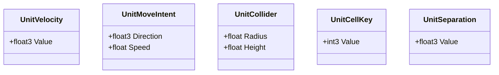

### 5-2. 권장 시스템 파이프라인 ⚙️

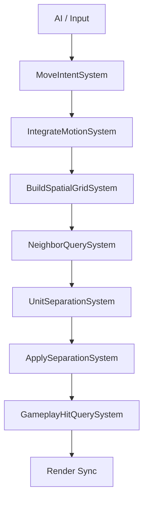

### 5-3. 충돌 형상 단순화 원칙 🎯

- 권장: `2D 바닥 원형 충돌 + 높이 조건`
- 차선: `Sphere`
- 비추천: `복잡한 MeshCollider`, `무거운 Compound Collider`

이유는 간단합니다.

- 군집 유닛 문제는 “진짜 물리”보다 “겹치지 않게 움직이기”가 중요하기 때문입니다.

### 5-4. Separation 처리 방식 🤝

겹침 해소는 보통 아래처럼 단순화합니다.

$$
\|p_1 - p_2\|^2 < (r_1 + r_2)^2
$$

- 겹치면 최소 분리 방향을 구하고
- 양쪽 혹은 한쪽에 분리 벡터를 누적합니다
- 프레임 마지막에 누적 분리를 한 번 적용합니다

이 방식은 rigidbody solver보다 단순하지만, 10,000 유닛 군집에는 훨씬 현실적입니다 💡

---

## 6. Unity Profiler에서 어디를 봐야 하는가 🔬

이 부분은 실제 병목 구간을 찾기 위한 체크리스트로 정리했습니다.

### 6-1. 가장 먼저 열어볼 창 👀

- `CPU Usage`
- `Timeline`
- `Physics`
- `Scripts`
- `Rendering`
- `GC Alloc`

| 항목 | 왜 중요한가 |
|---|---|
| CPU Usage | 프레임 병목의 큰 방향 파악 |
| Timeline | 메인 스레드/워커 스레드 구조 파악 |
| Physics | Physics.Simulate, FixedUpdate 비용 확인 |
| Scripts | 충돌 콜백과 로직 비용 분리 |
| GC Alloc | 프레임 할당 여부 점검 |

### 6-2. 기본 물리 사용 시 체크 포인트 🛠️

- `FixedUpdate.PhysicsFixedUpdate`
- `Physics.Simulate`
- `ScriptRunBehaviourFixedUpdate`
- `OnCollisionEnter/Stay/Exit`
- `OnTriggerEnter/Stay/Exit`
- Transform sync 관련 비용

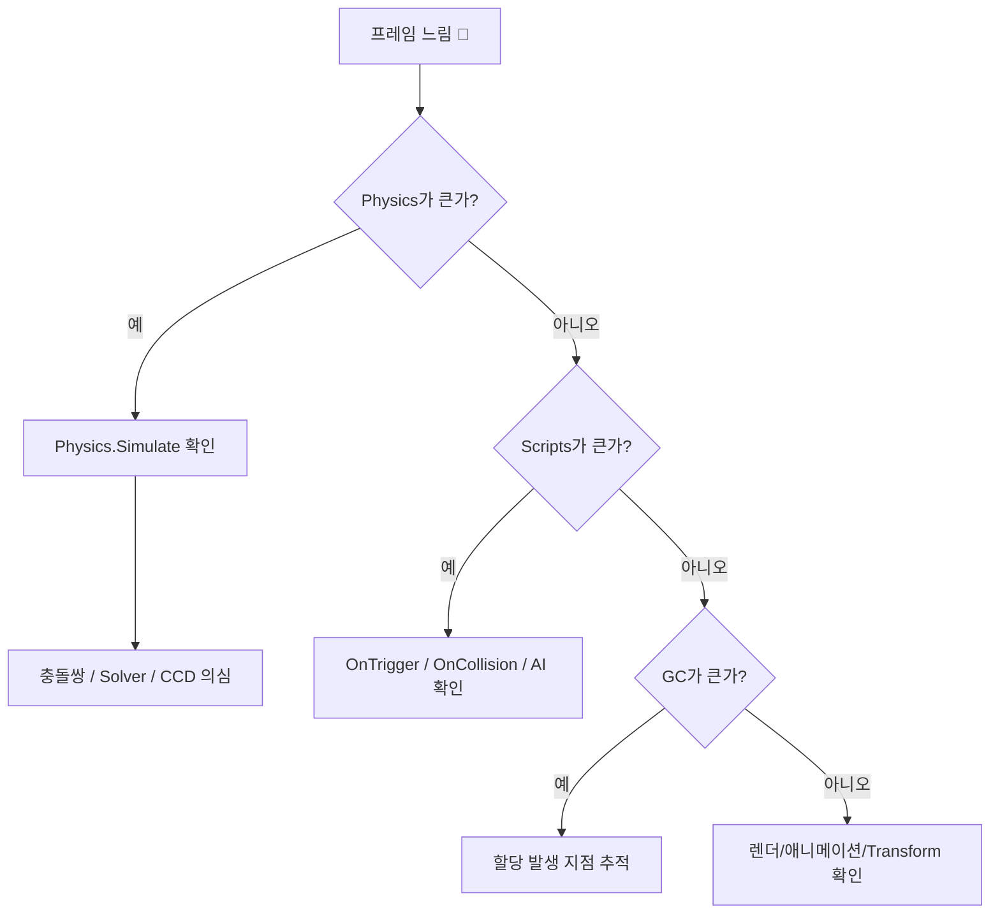

### 6-3. ECS/Jobs/Burst 사용 시 체크 포인트 ⚡

- 시스템별 실행 시간
- `Job` 실행 시간
- `CompleteDependency` 혹은 sync point
- structural changes
- Burst on/off 비교
- worker thread 활용률

| 항목 | 이상 신호 |
|---|---|
| 특정 시스템만 매우 큼 | Grid/Neighbor/Collision 설계 재검토 |
| Jobs는 있는데 메인 스레드가 바쁨 | 병렬화 구조 문제 |
| `Complete` 지점이 많음 | sync point 과다 |
| GC Alloc 발생 | Native/struct 기반 설계 부족 |

### 6-4. 실전 측정 순서 📈

1. `1,000 / 3,000 / 5,000 / 10,000` 단계별 측정
2. `충돌 off`
3. `충돌 on, separation off`
4. `충돌 on, separation on`
5. `이벤트 처리 off`
6. `렌더 최소화`

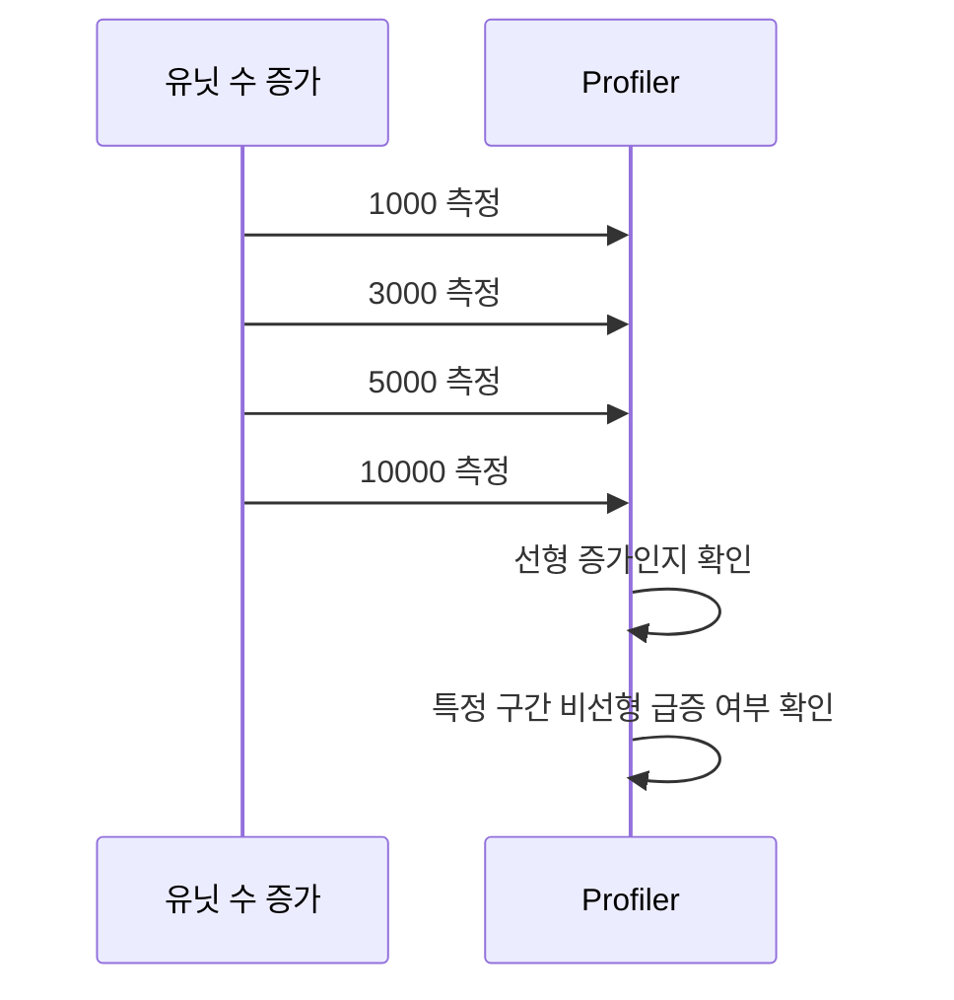

---

## 7. TCP/UDP 패킷 드롭 관련 재구성 🌐

세션 후반에는 네트워크 질문으로 확장되었습니다.

주요 질문은 아래였습니다.

- 라우터가 TCP/UDP 패킷을 강제로 드롭하면 어떻게 되는가?
- 속도가 줄어드는가?
- 반감되는가?
- 어디에서 드롭하는가?
- 솔루션은 무엇이 있는가?

### 7-1. TCP는 어떻게 반응하나 📉

- TCP는 패킷 손실을 보통 `혼잡 신호`로 해석합니다.
- 손실 감지 후 재전송을 수행합니다.
- 동시에 `congestion window(cwnd)`를 줄입니다.
- 그래서 일반적으로 처리량이 감소합니다.

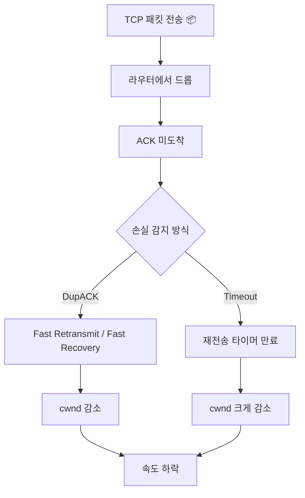

#### 반감되는가?

- `정확히 항상 절반`은 아닙니다.
- 하지만 고전적인 TCP 혼잡제어는 `AIMD` 특성이 있어서
- 손실 시 전송 윈도우가 `대략 절반 수준으로 감소하는 패턴`이 흔합니다.

### 7-2. UDP는 어떻게 다른가 📨

- UDP 자체는 재전송, 혼잡제어, 속도 감속 메커니즘이 없습니다.
- 따라서 드롭되면 그냥 유실될 수 있습니다.
- 속도 감소는 `상위 애플리케이션 프로토콜`이 직접 구현했을 때만 발생합니다.

| 항목 | TCP | UDP |
|---|---|---|
| 재전송 | 있음 | 기본 없음 |
| 혼잡제어 | 있음 | 기본 없음 |
| 손실 시 속도 감소 | 일반적 | 앱 구현에 따라 다름 |
| 손실 시 데이터 유실 | 복구 시도 | 그냥 유실 가능 |

### 7-3. 패킷 드롭이 발생하는 일반적 위치 🧱

- 라우터/스위치 QoS
- 방화벽/ACL
- 커널 qdisc
- NIC/드라이버 큐 오버플로우
- 중간 장비의 policing/shaping
- 테스트용 WAN emulator

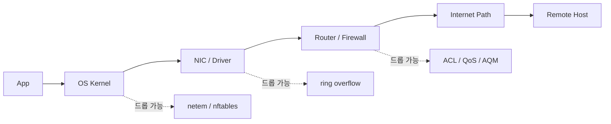

### 7-4. 일반적인 드롭 솔루션 🛠️

- `라우터/방화벽`: ACL, QoS, policing, RED/WRED, ECN
- `리눅스 커널`: `tc netem`, `iptables`, `nftables`
- `중간 장비`: WAN emulator, 트래픽 impairment 장비
- `애플리케이션`: fault injection, circuit breaker, rate control

---

## 8. 세션 전체를 관통하는 실전 결론 🧠

이번 세션의 큰 메시지는 하나로 모아집니다.

### 8-1. Unity 쪽 결론 🎮

- 대량 단순 충돌은 `ECS + Burst + Jobs`가 강합니다.
- 자연스러운 물리 반응은 `기본 물리엔진`이 강합니다.
- 따라서 정답은 자주 `하이브리드`입니다.

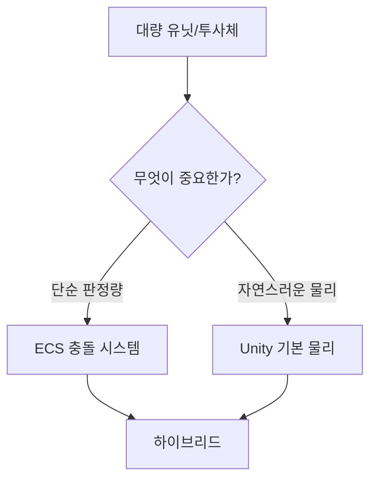

### 8-2. 네트워크 쪽 결론 🌐

- TCP는 손실을 혼잡으로 보고 속도를 낮춥니다.
- UDP는 기본적으로 속도를 안 줄이고 손실만 발생할 수 있습니다.
- 테스트 환경에서는 라우터보다 커널 레벨 `netem`이 실험과 재현에 매우 유용합니다.

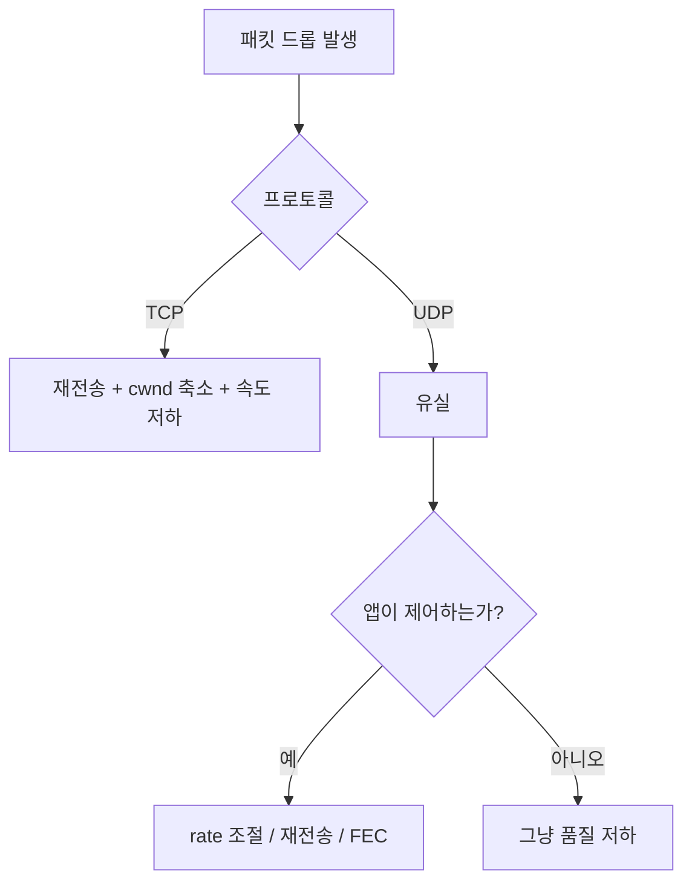

---

## 9. 참고 URL 🔗

이번 세션에서 사실 관계 확인에 사용한 주요 문서는 아래와 같습니다.

- Unity Burst manual: https://docs.unity3d.com/Packages/com.unity.burst@1.8/manual/index.html
- Unity Physics overview: https://docs.unity3d.com/Packages/com.unity.physics@1.4/manual/index.html
- Unity Physics settings / PhysX 관련: https://docs.unity3d.com/Manual/class-PhysicsManager.html
- Unity Physics manual entry: https://docs.unity3d.com/Manual/com.unity.physics.html
- NVIDIA PhysX best practices: https://docs.nvidia.com/gameworks/content/gameworkslibrary/physx/guide/Manual/BestPractices.html
- RFC 5681 TCP Congestion Control: https://datatracker.ietf.org/doc/html/rfc5681
- RFC 8085 UDP Usage Guidelines: https://datatracker.ietf.org/doc/html/rfc8085
- Linux `tc netem`: https://man7.org/linux/man-pages/man8/tc-netem.8.html
- 서울 시간 확인: https://timeapi.io/api/Time/current/zone?timeZone=Asia/Seoul

---

## 10. 호환성 체크 ✅

문서 저장 전 아래 항목을 점검했습니다.

| 항목 | 상태 |
|---|---|
| 수식 렌더링 | 사용 가능 |
| 코드블록 언어 태그 | 점검 완료 |
| 표 구조 | 점검 완료 |
| Mermaid 다이어그램 | 다수 포함 |

변환 규칙 메모 📝

- Mermaid를 지원하지 않는 플랫폼에서는 코드블록을 이미지 또는 텍스트 다이어그램으로 대체하면 됩니다.
- `$...$`, `$$...$$` 수식 렌더링이 안 되는 플랫폼에서는 일반 텍스트 수식으로 바꿔도 의미는 유지됩니다.

---

## 11. 작성에 사용한 사용자 프롬프트 📦

```text
hhd-chat

unity 에서
3d 객체가 10_000개 정도 있을때
unity 기본물리엔진으로 collider로 충돌감지 했을때와
ecs+burst+jobSystem 으로 충돌엔진을 따로 만들었을때 비교
- 품질차이
- 성능차이 
- 구조

hhd-chat

1
2
3
수행

hhd-chat

기본 물리엔진이 collider 의 객체 초과가 되었던 경험이 있습니다.
collider 객체 초과 한계는 얼마인가요?
ecs+burst+jobSystem 은 객체 갯수 제한이 없는가요?
이 속도차이는 대략 어느정도인가요?
이 품질차이는 있는가요?
ecs+... 방식은 정확도가 떨어지나요?
ecs+... 은 simd방식인가요?
unity 기본 물리엔진은 오로지 simd도 안쓰는 cpu 방식인가요?

1 2 4 진행

tcp udp 패킷드롭 관련 질문 

라우터에서 강제로 tcp udp 패킷을 드롭하면 어떻게 되는가?
통신속도가 감속되는가?
어떤방식으로?
반감되는가?
강제로 드롭하는 일반적인 상황?
패킷을 드롭하는 솔루션?
라우터에서 하는방식 os의 커널드라이버에 하는 방식?

1. 유닛 10,000개용 ECS 데이터 구조 설계
3. Unity Profiler에서 어디를 봐야 하는지 체크 포인트
진행

hhd-md

현재 세션의 내용 재구성
중복내용 제거
순서 재구성
이모지 많이 사용
mermaid 다이어그램 많이 사용
```

