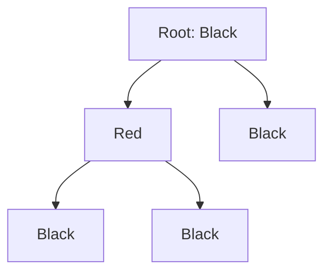

# 260414 RB Tree, B-Tree, B+ Tree 요청 관점 정리

자료구조를 공부할 때 가장 헷갈리는 지점은 "셋 다 트리인데 왜 쓰는 곳이 다를까?"입니다.  
이번 글은 **특징, 장단점, 사례, 간단 개념 예제, 실전 예제** 관점으로 RB Tree, B-Tree, B+ Tree를 한 번에 정리합니다.

---

## 1) RB Tree

### 핵심 특징

- 이진 탐색 트리(BST) 기반 + 색(빨강/검정) 규칙으로 균형을 유지
- 탐색/삽입/삭제의 최악 시간복잡도는 모두 `O(log n)`
- 노드당 자식은 최대 2개, 메모리 기반 자료구조에 적합

| 항목 | 내용 |
|---|---|
| 균형 방식 | 회전(rotation) + recolor |
| fanout | 2 (binary) |
| 강점 | 업데이트가 잦은 정렬 맵/셋 |

수식(높이 상한 직관):

$$
h = O(\log n)
$$



### 장점

- 정렬 상태를 유지하는 동적 컬렉션 구현에 유리
- 삽입/삭제가 잦은 워크로드에서 안정적
- 해시와 달리 범위 탐색(`>=`, `<=`) 지원이 자연스러움

### 단점

- 노드 포인터 추적이 많아 디스크/페이지 기반 저장에는 비효율적
- 구현 난이도(삭제 케이스)가 높음
- B+ Tree 대비 대량 범위 스캔 효율이 낮음

### 사례

- Java `TreeMap` (Red-Black Tree 기반)
- Linux kernel의 rbtree (타이머, 스케줄러, epoll 등)

### 간단 개념 예제

`10 -> 20 -> 30`을 순서대로 넣으면 일반 BST는 한쪽으로 치우칩니다.  
RB Tree는 삽입 후 회전/색 변경으로 높이를 다시 `log n` 수준으로 유지합니다.

### 실전 예제

```java
TreeMap<Integer, String> book = new TreeMap<>();
book.put(30, "C");
book.put(10, "A");
book.put(20, "B"); // 내부적으로 재균형

System.out.println(book.firstKey()); // 10
System.out.println(book.ceilingKey(15)); // 20
```

---

## 2) B-Tree

### 핵심 특징

- 하나의 노드가 여러 키/자식을 가지는 다진 균형 트리
- 페이지(블록) 단위 I/O를 줄이도록 설계됨
- 높이가 매우 낮아져 대용량 저장장치에 유리

| 항목 | 내용 |
|---|---|
| 균형 방식 | split / merge / redistribution |
| fanout | 큼 (페이지 크기에 비례) |
| 강점 | 디스크 기반 인덱스 |

수식(기저 fanout 관점):

$$
\text{search cost} = O(\log_f n)
$$

```mermaid
graph TD
  R[20|40] --> L1[5|10|15]
  R --> L2[25|30|35]
  R --> L3[45|50|55]
```

### 장점

- 높은 fanout으로 트리 높이가 낮아 디스크 접근 횟수 감소
- 대규모 데이터셋에서 예측 가능한 성능
- DB/파일시스템 인덱스의 전통적 표준

### 단점

- 노드 split/merge 로직이 복잡
- 메모리 소규모 데이터에서는 오버헤드가 상대적으로 큼
- 내부/리프 모두 데이터를 둘 경우 범위 스캔 최적화 한계

### 사례

- SQLite의 파일 포맷에서 table/index b-tree 페이지 구조 사용
- 다양한 스토리지 엔진의 기본 인덱스 계열

### 간단 개념 예제

최대 키 3개 노드에서 `[10,20,30]` 상태로 `25`를 넣으면 overflow가 발생합니다.  
이때 노드를 분할하고 중간 키를 부모로 올려 균형을 복원합니다.

### 실전 예제

```sql
CREATE TABLE orders (
  id BIGINT PRIMARY KEY,
  user_id BIGINT,
  created_at DATETIME
);

CREATE INDEX idx_orders_user_created
  ON orders(user_id, created_at);

-- user_id + 시간 범위 필터에서 인덱스 탐색 효율 향상
SELECT *
FROM orders
WHERE user_id = 101
  AND created_at >= '2026-04-01';
```

---

## 3) B+ Tree

### 핵심 특징

- 내부 노드는 탐색용 키 중심, 실제 데이터(또는 레코드 포인터)는 리프 중심
- 리프 노드 간 연결(Linked Leaf)로 범위 조회와 정렬 스캔이 매우 빠름
- 동일 페이지 크기에서 내부 fanout이 더 커지기 쉬움

| 항목 | 내용 |
|---|---|
| 균형 방식 | B-Tree와 유사(split/merge) |
| fanout | 보통 B-Tree보다 더 큼 |
| 강점 | 범위조회, ORDER BY, 순차 스캔 |

수식(범위조회):

$$
\text{range query} = O(\log_f n + k)
$$

```mermaid
graph TD
  R[20|40] --> I1[10|15]
  R --> I2[25|30|35]
  R --> I3[45|50]
  I1 -.leaf link.-> I2
  I2 -.leaf link.-> I3
```

### 장점

- 리프 연속 순회가 쉬워 범위 질의가 매우 효율적
- 내부 노드가 얕아져 검색 I/O 절감
- RDBMS 인덱스에서 사실상 표준 선택지

### 단점

- 리프 링크 유지, 분할/병합 구현 복잡도 존재
- 쓰기 집약 환경에서 페이지 분할 관리 비용이 발생
- 단건 조회만 보면 체감 이점이 크지 않을 수 있음

### 사례

- MySQL InnoDB 인덱스(클러스터드/세컨더리)
- 다수 관계형 DB 및 파일시스템 메타데이터 인덱스

### 간단 개념 예제

리프가 `[1,2,3] <-> [4,5,6] <-> [7,8,9]`로 연결되어 있으면,  
`BETWEEN 4 AND 8` 조회는 4가 있는 리프를 찾은 뒤 링크를 따라 순차적으로 읽습니다.

### 실전 예제

```sql
CREATE TABLE event_log (
  id BIGINT PRIMARY KEY,
  service_id BIGINT,
  event_time DATETIME,
  payload JSON
);

CREATE INDEX idx_event_log_service_time
  ON event_log(service_id, event_time);

SELECT *
FROM event_log
WHERE service_id = 7
  AND event_time BETWEEN '2026-04-01' AND '2026-04-30'
ORDER BY event_time;
```

---

## 4) 빠른 선택 가이드

| 상황 | 추천 |
|---|---|
| 메모리 내 정렬 맵/셋 | RB Tree |
| 디스크 기반 범용 인덱스 | B-Tree 계열 |
| 범위조회/정렬 스캔 중심 DB | B+ Tree |

핵심 요약:

- **RB Tree**: 메모리 구조에서 동적 ordered set/map에 강함
- **B-Tree**: 디스크 페이지 I/O 최소화의 기본 해법
- **B+ Tree**: 실무 DB 인덱스에서 범위조회 최적화의 대표 구조

---

## 참고 URL (근거)

- Red-Black Tree: https://en.wikipedia.org/wiki/Red%E2%80%93black_tree
- Linux rbtree: https://docs.kernel.org/core-api/rbtree.html
- Java TreeMap: https://docs.oracle.com/en/java/javase/21/docs/api/java.base/java/util/TreeMap.html
- B-Tree: https://en.wikipedia.org/wiki/B-tree
- B+ Tree: https://en.wikipedia.org/wiki/B%2B_tree
- MySQL InnoDB 인덱스: https://dev.mysql.com/doc/refman/8.0/en/innodb-index-types.html
- SQLite file format (b-tree pages): https://www.sqlite.org/fileformat2.html

---

```text
hhd-md 
 RB Tree, B-Tree, B+ Tree를 요청하신 관점 정리
```

