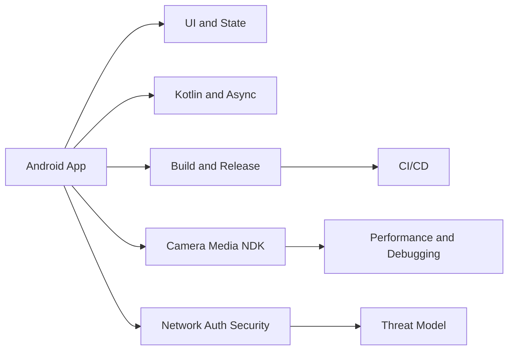
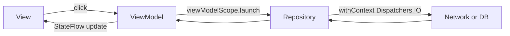
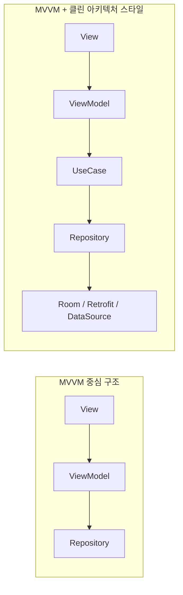
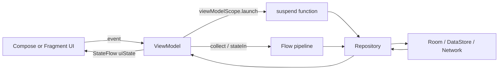
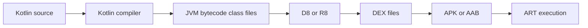

# 260416 안드로이드 개발자 면접 준비 완성본

## 문서 개요

- 대상 독자: `시니어 안드로이드 개발자` 면접 준비자
- 목표 분량: PDF 변환 시 약 `100p` 내외
- 문서 방향: API 암기보다 `설계 판단`, `성능`, `장애 분석`, `보안`, `빌드/배포`, `실전 답변력` 중심
- 작성 방식: `핵심 결론 -> 대표 질문 -> 비교표 -> 실무 함정/반례 -> 검증 필요 -> 근거 URL`
- QMD 사용 여부: 먼저 확인했으나 관련 로컬 문서는 부족해 공식 문서/RFC/라이브러리 문서를 기준으로 작성
- 시간 기준: `2026-04-16 14:19 KST` 인터넷 시간 확인 기준

## 이 문서를 사용하는 방법

- 1회독: 각 장의 `핵심 결론`과 `비교표`만 빠르게 읽어 전체 지도를 잡는다.
- 2회독: 자신의 경험과 연결되는 장부터 `대표 질문`과 `면접 답변 포인트`를 말로 연습한다.
- 3회독: `실무 함정/반례`와 `검증 필요`를 중심으로 꼬리질문 대비를 한다.
- 최종 점검: `27장 종합 모의면접` 질문을 기준으로 답변을 3분, 7분, 15분 길이로 각각 말해본다.

## 페이지 배분

| Part | 범위 | 페이지 |
|---|---|---:|
| Part 0 | 면접 프레임, 시스템 지도 | 3 |
| Part 1 | Android Core / UI | 16 |
| Part 2 | Kotlin / Async | 13 |
| Part 3 | Build / Release / Distribution | 22 |
| Part 4 | Camera / Media / Native | 33 |
| Part 5 | Network / Auth / Security | 11 |
| Part 6 | 종합 모의면접 | 2 |
| 합계 |  | 100 |

## 전체 구조 다이어그램



---

## 1장. 시니어 면접 답변 프레임

### 핵심 결론

- 시니어 면접은 “API를 아는가”보다 `왜 그 선택을 했는가`, `실패를 어떻게 다뤘는가`, `운영에서 무엇을 배웠는가`를 본다.
- 좋은 답변은 보통 `문제 정의 -> 선택지 비교 -> 실제 선택 -> 트레이드오프 -> 검증/운영 결과` 구조를 가진다.
- 기술 설명은 단일 라이브러리 중심이 아니라 `시스템 전체 흐름`으로 이어져야 깊이가 생긴다.
- 시니어는 정답 하나를 말하기보다 `상황에 따라 달라지는 기준`을 제시해야 한다.
- 꼬리질문은 보통 `예외 상황`, `장애`, `보안`, `성능`, `운영 비용`으로 이어지므로 답변을 미리 연결해두는 것이 좋다.

### 대표 질문

- 시니어 안드로이드 개발자에게 기대하는 역량은 주니어/중급과 무엇이 다른가?
  - 답변: `1장. 시니어 면접 답변 프레임` 맥락에서는 문제 정의, 선택 기준, 트레이드오프, 운영 검증 순서로 답하는 것이 좋다. 면접에서는 기술명 나열보다 왜 그 선택이 유효한지 근거를 함께 제시하면 된다.
- 특정 기술 선택을 설명할 때 어떤 기준으로 답해야 설득력이 생기는가?
  - 답변: 요구사항의 수명, 실패 비용, 운영 복잡도를 기준으로 기본값을 정하고 예외 조건에서만 다른 선택을 한다고 답하면 설득력이 높다.
- 면접에서 자신의 실패 사례를 어떻게 기술적으로 구조화해 말할 것인가?
  - 답변: 먼저 증상을 재현해 범위를 고정하고, 레이어별 가설을 2~3개로 줄인 뒤 가장 저비용 검증부터 수행한다. 확인된 원인을 수정한 뒤 재발 방지 지표까지 연결해 마무리한다.

### 비교표

| 수준 | 주로 보는 것 | 좋은 답변 특징 |
|---|---|---|
| 주니어 | 기본기, API 이해 | 정확한 개념 설명 |
| 중급 | 구조 이해, 구현 경험 | 비교와 근거 제시 |
| 시니어 | 설계, 운영, 장애 대응 | 트레이드오프와 검증까지 설명 |

### 면접 답변 포인트

- “저는 기술을 기능이 아니라 운영 단위로 설명합니다. 왜 그 선택을 했고, 무엇이 깨졌고, 다음에는 어떻게 바꿀지를 함께 말합니다.”
- “정답 하나를 고집하기보다 제약조건에 따라 달라지는 선택 기준을 먼저 제시합니다.”
- “실제 운영 경험이 있다면 성능, 장애, 보안, 배포까지 연결해 답변하는 편이 시니어 톤에 맞습니다.”

### 실무 함정 / 반례

- 라이브러리 이름만 많이 나열하고 실제 선택 기준을 설명하지 못하는 답변은 오히려 약하게 보인다.
- ‘최신 기술이라서’ 같은 이유만으로 도입을 설명하면 시니어 설계 판단으로 보이지 않는다.
- 실패 사례를 말할 때 원인/대응/재발 방지 없이 사건만 나열하면 학습 능력이 드러나지 않는다.

### 검증 필요

- 회사별 시니어 정의는 다르므로 실제 지원 회사의 JD와 기술 스택을 함께 맞춰야 한다.
- 모바일 조직 규모에 따라 기대하는 범위가 `앱 아키텍처 중심`인지 `플랫폼/SDK/빌드/보안`까지인지 달라질 수 있다.

### 근거 URL

- https://developer.android.com/topic/architecture
- https://developer.android.com/topic/performance
- https://developer.android.com/topic/security

---

## 2장. 안드로이드 시스템 전체 지도

### 핵심 결론

- 안드로이드 앱은 단순 UI 코드가 아니라 `UI/상태`, `네트워크/인증`, `로컬 저장소`, `빌드/배포`, `카메라/미디어`, `네이티브`, `보안`이 연결된 시스템이다.
- 시니어 면접에서는 한 영역의 개별 지식보다 영역 간 경계를 이해하는지가 중요하다.
- 예를 들어 Camera2 문제는 UI 문제가 아니라 HAL/버퍼/인코더 문제일 수 있고, JWT 문제는 저장소가 아니라 인증 흐름/재시도 폭주 문제일 수 있다.
- 빌드와 배포를 모르면 앱이 왜 깨지는지 설명하기 어렵고, 보안을 모르면 설계를 끝까지 설명하기 어렵다.

### 대표 질문

- 안드로이드 앱을 시스템 관점에서 설명하면 어떤 서브시스템으로 나눌 수 있는가?
  - 답변: `2장. 안드로이드 시스템 전체 지도` 맥락에서는 문제 정의, 선택 기준, 트레이드오프, 운영 검증 순서로 답하는 것이 좋다. 면접에서는 기술명 나열보다 왜 그 선택이 유효한지 근거를 함께 제시하면 된다.
- UI, 미디어, 네트워크, 빌드, 보안은 어디서 서로 연결되는가?
  - 답변: `2장. 안드로이드 시스템 전체 지도` 맥락에서는 문제 정의, 선택 기준, 트레이드오프, 운영 검증 순서로 답하는 것이 좋다. 면접에서는 기술명 나열보다 왜 그 선택이 유효한지 근거를 함께 제시하면 된다.
- 장애 분석 시 어떤 축으로 문제를 분리할 것인가?
  - 답변: `2장. 안드로이드 시스템 전체 지도` 맥락에서는 문제 정의, 선택 기준, 트레이드오프, 운영 검증 순서로 답하는 것이 좋다. 면접에서는 기술명 나열보다 왜 그 선택이 유효한지 근거를 함께 제시하면 된다.

### 비교표

| 영역 | 핵심 책임 | 자주 연결되는 다른 영역 |
|---|---|---|
| UI/상태 | 사용자 상호작용, 화면 렌더링 | Coroutines, Room, Navigation |
| 네트워크/인증 | API 호출, 토큰 관리 | OkHttp, JWT, Security |
| 빌드/배포 | 산출물 생성, 버전/서명 | Gradle, R8, CI/CD |
| 미디어/네이티브 | 카메라, 코덱, JNI | Surface, MediaCodec, NDK |
| 보안 | 저장/전송/무결성 보호 | Keystore, Signing, TLS |

### 면접 답변 포인트

- 문제를 설명할 때 먼저 `어느 레이어 문제인지`를 구분한다고 답하는 것이 중요하다.
- 시스템 경계가 보이는 답변은 보통 “입력, 처리, 저장, 출력, 운영” 다섯 단계로 정리하면 깔끔하다.
- 실제 프로젝트 경험이 있다면 앱 구조도를 머릿속에서 말로 그릴 수 있어야 한다.

### 실무 함정 / 반례

- 모든 문제를 앱 코드에서만 찾으면 HAL, 네트워크, 빌드 설정 문제를 놓친다.
- 팀 경계가 곧 시스템 경계라고 착각하면 원인 파악이 왜곡된다.
- 빌드/배포를 앱 개발 바깥 문제로 보면 릴리즈 장애 대응이 약해진다.

### 검증 필요

- 실제 프로젝트마다 서브시스템 경계는 다르므로 문서의 분류는 일반적 관점으로 받아들여야 한다.
- CameraX, KMP, Compose Multiplatform 등 도입 여부에 따라 시스템 지도는 더 달라질 수 있다.

### 근거 URL

- https://developer.android.com/build
- https://developer.android.com/topic/architecture
- https://developer.android.com/media
- https://developer.android.com/topic/security

---

# Part 1. Android Core / UI

## 3장. Activity

### 핵심 결론

- `Activity`는 화면 단위 진입점이자 `Task`/백스택과 연결되는 앱 컴포넌트다.
- 생명주기는 `onCreate` - `onStart` - `onResume`와 `onPause` - `onStop` - `onDestroy` 흐름으로 이해하되, “가시성”과 “포커스”를 구분해야 한다.
- 콜백별 핵심 역할은 다음처럼 설명하면 면접 답변이 명확해진다.
  - `onCreate`: 초기화 단계. 레이아웃 inflate, DI 주입, 1회성 설정 수행.
  - `onStart`: 화면이 사용자에게 보이기 시작하는 단계(가시성 O, 입력 포커스 X 가능).
  - `onResume`: 포그라운드에서 사용자 입력을 받는 활성 단계(포커스 O).
  - `onPause`: 다른 화면이 덮기 시작할 때 호출. 짧고 빠른 정리(애니메이션/카메라/리스너 일시중지)만 처리.
  - `onStop`: 화면이 더 이상 보이지 않을 때 호출. UI 관련 자원 해제와 상태 저장 마무리.
  - `onDestroy`: Activity 인스턴스 종료 시점. `finish` 또는 재생성으로 호출될 수 있어 “항상 프로세스 종료”로 해석하면 안 된다.
- 구성 변경(`rotation`, `locale`, `multi-window`)에서 `Activity`는 재생성될 수 있으므로 UI 상태와 비즈니스 상태를 분리해야 한다.
- `savedInstanceState`는 소량의 UI 복원용이고, 장기 상태는 `ViewModel`/DB/저장소로 관리하는 것이 맞다.
- `launchMode`, `intent flag`, `taskAffinity`는 예외적 요구사항에만 쓰고, 기본 백스택 동작을 우선 신뢰하는 편이 안전하다.
- 단일 `Activity` + 다중 `Fragment`/Compose Navigation 구조가 많아졌지만, 외부 진입점과 권한/딥링크 처리의 중심은 여전히 `Activity`다.
- 메모리 누수는 `Context` 보관, 등록 해제 누락, 오래 사는 객체가 `Activity`를 참조할 때 주로 발생한다.

### 생명주기 호출 시나리오

- 앱 최초 실행: `onCreate` -> `onStart` -> `onResume`
- 홈키로 앱 이탈: `onPause` -> `onStop` (`onDestroy`는 보통 즉시 호출되지 않음)
- 홈에서 앱 복귀(프로세스 생존): `onRestart` -> `onStart` -> `onResume`
- 홈에서 앱 복귀(백그라운드 중 프로세스 종료): `onCreate` -> `onStart` -> `onResume`
- 면접 답변 한 줄 정리: “처음 진입은 `Create-Start-Resume`, 홈키 이탈은 `Pause-Stop`, 복귀는 `Restart-Start-Resume`, 프로세스가 죽었으면 다시 `Create`부터”

### 대표 질문

- `onStart`와 `onResume`의 차이를 어떻게 설명할 것인가?
  - 답변: `onStart`는 화면이 보이는 상태, `onResume`은 입력 가능한 활성 상태로 구분해서 설명하면 된다. 반투명 화면처럼 보이지만 포커스를 잃는 케이스를 예로 들면 설득력이 높다.
- 구성 변경과 프로세스 종료는 복원 전략이 어떻게 다른가?
  - 답변: 구성 변경은 메모리 내 상태를 `ViewModel` 중심으로 이어가고, 프로세스 종료는 메모리 상태가 사라지므로 `savedInstanceState`와 영속 저장소로 복원해야 한다. 즉 재생성과 재시작을 다른 문제로 다뤄야 한다.
- Single-Activity 구조를 쓰더라도 Activity를 깊게 알아야 하는 이유는 무엇인가?
  - 답변: Single-Activity여도 외부 진입점, 권한 결과, task/back stack, `onNewIntent` 같은 경계 책임은 Activity가 담당한다. 그래서 Activity 이해가 얕으면 운영 이슈를 설명하기 어렵다.
- `launchMode`를 언제 예외적으로 고려할 수 있는가?
  - 답변: 기본 백스택으로 해결되지 않는 중복 인스턴스 문제가 실제로 있을 때만 예외적으로 고려한다. 보통 `singleTop`부터 검토하고, `singleTask`는 task 동작 복잡도가 커서 요구가 명확할 때만 쓴다.

### 비교표

| 항목 | `savedInstanceState` | `ViewModel` | 영속 저장소 |
|---|---|---|---|
| 목적 | UI 임시 복원 | 화면 상태 유지 | 앱 재실행 후 유지 |
| 수명 | 프로세스 생존 범위 제한 | `Activity`/`Fragment` 범위 | 명시적 삭제 전까지 |
| 용량/종류 | 소량 primitive 위주 | 메모리 객체 가능 | 구조화 데이터 |
| 대표 예 | 스크롤 위치 | 필터/폼 상태 | 사용자 데이터 |

### 면접 답변 포인트

- “`onStart`는 보이기 시작, `onResume`은 사용자 입력 가능 상태”라고 구분해 설명한다.
- “구성 변경 대응은 `ViewModel` 중심, 즉시 복원은 `savedInstanceState` 보조”라고 답하면 실무적이다.
- `singleTask`/`singleTop`는 동작 차이보다 “왜 기본 모드를 깨야 하는지”를 먼저 설명하는 것이 좋다.
- 딥링크/푸시 진입 시 `intent` 재전달은 `onNewIntent`까지 포함해 말하면 senior답다.
- 프로세스 종료 후 복원과 단순 회전 재생성을 구분해 설명하면 이해도가 드러난다.

### 실무 함정 / 반례

- `onPause`에서 무거운 작업을 수행해 화면 전환이 끊기는 문제
- `Activity` `Context`를 singleton에 저장해 누수 발생
- `savedInstanceState`에 큰 객체를 넣어 `TransactionTooLargeException` 유발

### 검증 필요

- `launchMode`/task 동작은 OEM 런처와 멀티윈도우 환경에 따라 체감이 달라질 수 있다.
- Activity Result API, predictive back 등 최신 동작은 targetSdk/Android 버전에 따라 확인이 필요하다.

### 근거 URL

- https://developer.android.com/guide/components/activities/intro-activities
- https://developer.android.com/guide/components/activities/activity-lifecycle
- https://developer.android.com/guide/components/intents-filters

---

## 4장. Fragment / Lifecycle

### 핵심 결론

- `Fragment`는 재사용 가능한 UI/상태 호스트지만, 실제 수명은 호스트 `Activity`와 `FragmentManager`에 의해 결정된다.
- `Fragment lifecycle`과 `View lifecycle`은 다르며, ViewBinding/observer는 `viewLifecycleOwner` 기준으로 다뤄야 안전하다.
- `onCreateView` 이후 생성된 View는 `onDestroyView`에서 정리해야 메모리 누수를 줄일 수 있다.
- `childFragmentManager`, 중첩 `Fragment`, 백스택은 화면 구조가 복잡해질수록 디버깅 비용이 커진다.
- `repeatOnLifecycle`/`flowWithLifecycle`를 사용하면 lifecycle-aware collect가 가능하다.
- 화면 간 데이터 전달은 `Fragment Result API`, 공유 `ViewModel`, navigation argument로 일관성 있게 설계하는 것이 좋다.
- `FragmentTransaction.commit()`와 `commitNow()` 차이, 상태 저장 이후 커밋 위험을 이해해야 한다.

### 대표 질문

- Fragment lifecycle과 view lifecycle을 왜 분리해서 설명해야 하는가?
  - 답변: Fragment 인스턴스 수명과 View 수명은 다르기 때문에, View 참조 자원은 `onDestroyView`에서 정리해야 누수를 막을 수 있다. 두 수명을 분리해 설명해야 메모리·이벤트 버그 원인을 정확히 짚을 수 있다.
- `onDestroyView`에서 정리해야 하는 대표 자원은 무엇인가?
  - 답변: 대표적으로 ViewBinding, Adapter, View 참조 listener, View 기준 collector를 정리한다. 핵심은 View가 사라진 뒤에도 참조가 남지 않게 하는 것이다.
- Compose 시대에도 Fragment를 알아야 하는 이유는 무엇인가?
  - 답변: 핵심은 용어 정의보다 운영 관점의 책임과 한계를 함께 설명하는 것이다. 장점만 말하지 말고 실패 조건과 대안까지 짚으면 답변 완성도가 높다.
- Navigation Component와 수동 FragmentTransaction은 어떤 기준으로 선택하는가?
  - 답변: 요구사항의 수명, 실패 비용, 운영 복잡도를 기준으로 기본값을 정하고 예외 조건에서만 다른 선택을 한다고 답하면 설득력이 높다.

### 비교표

| 항목 | Fragment Lifecycle | View Lifecycle |
|---|---|---|
| 시작 시점 | `onAttach`/`onCreate` | `onCreateView` |
| 종료 시점 | `onDestroy`/`onDetach` | `onDestroyView` |
| 주 사용 대상 | 비-UI 상태, 의존성 | binding, adapter, observer |
| 누수 포인트 | host 참조 | View 참조 잔존 |

### 면접 답변 포인트

- “`Fragment`는 lifecycle보다 `viewLifecycleOwner`를 제대로 쓰는지가 실무 품질을 좌우한다”고 답한다.
- observer/adapter/binding 해제를 `onDestroyView`에 두는 이유를 설명할 수 있어야 한다.
- 상태 저장 후 `commit` 예외는 “사용자 경험보다 state consistency가 더 중요할 때만 허용” 관점으로 말하면 좋다.
- Compose 전환기에도 `Fragment`는 navigation host, legacy interop, multi-module 경계에서 여전히 많이 쓴다고 설명한다.
- `setRetainInstance`는 사실상 구식 접근이며 `ViewModel`로 대체한다고 정리한다.

### 실무 함정 / 반례

- `binding`을 `onDestroyView` 이후에도 참조해 메모리 누수 발생
- `lifecycleScope`로 View 관련 Flow를 collect하여 죽은 View에 이벤트 전달
- 중첩 `Fragment` 백스택 설계를 과도하게 복잡하게 만들어 복원 오류 발생

### 검증 필요

- Fragment strict mode, predictive back, navigation interop 등은 AndroidX 버전에 따라 권장 패턴이 달라질 수 있다.
- Compose-only 앱에서는 Fragment 비중이 줄 수 있으나, 레거시/하이브리드 앱에서는 여전히 핵심이다.

### 근거 URL

- https://developer.android.com/guide/fragments
- https://developer.android.com/guide/fragments/lifecycle
- https://developer.android.com/topic/libraries/architecture/lifecycle

---

## 5장. RecyclerView + Glide

### 핵심 결론

- `RecyclerView` 성능의 핵심은 “뷰 재사용”, “diff 기반 갱신”, “불필요한 bind 최소화”다.
- `ListAdapter` + `DiffUtil`은 전체 `notifyDataSetChanged()`보다 훨씬 안정적이고 애니메이션 친화적이다.
- ViewHolder는 “빠른 바인딩”과 “클릭 이벤트 위임”에 집중하고, 비즈니스 로직은 외부로 분리하는 편이 좋다.
- Glide는 이미지 로딩, 캐싱, 디코딩, 사이즈 최적화를 제공하며 스크롤 성능에 큰 영향을 준다.
- 이미지 요청은 View 재사용과 결합되므로 placeholder, cancel, size override 전략이 중요하다.
- `RecyclerView` 내부 중첩 스크롤, 복잡한 item layout, 과도한 bind 연산이 프레임 드랍의 주원인이다.
- stable id, payload update, prefetch를 적절히 쓰면 고밀도 리스트에서 차이가 크다.

### 대표 질문

- `notifyDataSetChanged()`가 왜 문제인가?
  - 답변: 전체 항목을 다시 그려 변경점 추적과 애니메이션 최적화를 포기하게 되기 때문이다. 데이터 규모가 커질수록 프레임 드랍과 깜빡임이 쉽게 발생한다.
- `DiffUtil`과 stable id는 각각 어떤 문제를 푸는가?
  - 답변: `DiffUtil`은 변경된 항목을 계산해 최소 갱신을 만들고, stable id는 동일 아이템의 정체성을 유지해 재사용·애니메이션 안정성을 높인다. 둘은 역할이 겹치기보다 서로 보완적이다.
- Glide에서 이미지 깜빡임과 OOM은 보통 어떤 이유로 생기는가?
  - 답변: 요청 크기와 실제 뷰 크기가 불일치하거나, 재사용된 뷰에 이전 요청이 정리되지 않으면 깜빡임과 메모리 급증이 생긴다. placeholder/size/cancel 전략과 lifecycle 범위 지정이 중요하다.
- RecyclerView와 Compose LazyColumn을 어떻게 비교할 것인가?
  - 답변: 먼저 증상을 재현해 범위를 고정하고, 레이어별 가설을 2~3개로 줄인 뒤 가장 저비용 검증부터 수행한다. 확인된 원인을 수정한 뒤 재발 방지 지표까지 연결해 마무리한다.

### 비교표

| 항목 | `notifyDataSetChanged()` | `DiffUtil/ListAdapter` | Glide |
|---|---|---|---|
| 역할 | 전체 갱신 | 변경점 계산 후 갱신 | 이미지 로딩/캐시 |
| 장점 | 단순함 | 성능, 애니메이션 | 스크롤 최적화 |
| 단점 | 비효율, 깜빡임 | 비교 비용 필요 | 잘못 쓰면 과요청 |
| 추천도 | 낮음 | 높음 | 사실상 표준 |

### 면접 답변 포인트

- “리스트 성능은 adapter보다 item layout과 bind 비용이 더 크게 좌우한다”고 설명한다.
- `DiffUtil.ItemCallback`에서 identity와 content equality를 분리해 말할 수 있어야 한다.
- Glide는 `with(fragment/view)` 범위 선택으로 lifecycle 연동이 가능하다고 답하면 좋다.
- 이미지 깜빡임 대응으로 placeholder, transition, size 일치, payload update를 함께 언급한다.
- Paging 3와 결합 시 RecyclerView는 여전히 대규모 데이터 표시의 표준 도구라고 정리할 수 있다.

### 실무 함정 / 반례

- `onBindViewHolder`에서 매번 무거운 포맷팅/연산 수행
- Glide 요청 크기가 실제 View 크기와 맞지 않아 메모리 낭비
- `position` 캡처 클릭 처리로 잘못된 아이템 참조 발생

### 검증 필요

- 앱의 UI 스택이 Compose 중심이면 RecyclerView 비중은 줄 수 있으나, SDK/레거시 화면에서는 여전히 중요하다.
- Glide vs Coil 선택은 이미지 파이프라인 요구사항, Compose 사용량, 조직 선호도에 따라 달라질 수 있다.

### 근거 URL

- https://developer.android.com/develop/ui/views/layout/recyclerview
- https://developer.android.com/reference/androidx/recyclerview/widget/DiffUtil
- https://github.com/bumptech/glide
- https://bumptech.github.io/glide/

---

## 6장. Room / ORM

### 핵심 결론

- Room은 SQLite 위에 compile-time 검증, entity mapping, DAO abstraction을 제공하는 Android 공식 ORM이다.
- SQL을 숨기는 도구라기보다 “SQL을 안전하게 쓰게 만드는 도구”로 보는 편이 정확하다.
- DAO 반환 타입으로 `Flow`, `suspend`, `PagingSource`를 지원해 현대 Android 아키텍처와 잘 맞는다.
- `@Transaction`은 다중 쿼리 일관성 보장에 유용하지만, 긴 트랜잭션은 락 경합을 유발할 수 있다.
- migration을 명시적으로 관리하지 않으면 운영 데이터 손실 위험이 크다.
- relation 매핑은 편리하지만, 실제 쿼리 비용과 N+1 유사 패턴을 반드시 점검해야 한다.
- 인덱스, 정규화 수준, projection 최적화는 ORM을 써도 여전히 중요하다.

### 대표 질문

- Room을 왜 단순 CRUD 도구가 아니라 아키텍처 도구로 봐야 하는가?
  - 답변: Room은 SQL 검증과 데이터 접근 경계를 표준화해 앱 구조의 안정성을 높인다. 단순 CRUD 도구가 아니라 변경 전파, 테스트, 마이그레이션 전략까지 포함한 아키텍처 도구로 봐야 한다.
- `Flow` DAO와 `suspend` DAO는 언제 각각 적합한가?
  - 답변: `suspend` DAO는 일회성 조회/쓰기, `Flow` DAO는 변경 구독이 필요한 화면에 적합하다. 화면 특성과 데이터 갱신 빈도에 맞춰 혼합 사용하는 것이 일반적이다.
- migration 실패를 어떻게 예방하고 운영에서 검증할 것인가?
  - 답변: 스키마 버전별 migration을 명시하고, 실제 앱 데이터로 마이그레이션 테스트를 CI에 넣어야 한다. 운영 전 샘플 DB 검증과 롤백 계획까지 준비하면 실패 확률을 크게 낮출 수 있다.
- Room의 한계 때문에 다른 저장 기술을 선택하는 경우는 언제인가?
  - 답변: 요구사항의 수명, 실패 비용, 운영 복잡도를 기준으로 기본값을 정하고 예외 조건에서만 다른 선택을 한다고 답하면 설득력이 높다.

### 비교표

| 항목 | Raw SQLite | Room |
|---|---|---|
| 쿼리 작성 | 직접 작성 | SQL 직접 작성 + 어노테이션 |
| 검증 시점 | 런타임 중심 | 컴파일 타임 검증 강화 |
| 생산성 | 낮음 | 높음 |
| 제어 수준 | 매우 높음 | 높음 |
| 추천 상황 | 극한 최적화/레거시 | 대부분의 앱 |

### 면접 답변 포인트

- “Room의 핵심 가치는 runtime 에러를 compile-time 검증으로 앞당기는 것”이라고 설명한다.
- `suspend`와 `Flow` DAO 차이를 일회성 조회 vs 변경 구독 관점으로 답할 수 있어야 한다.
- auto migration은 제한이 있어도, 핵심 스키마 변경은 수동 migration 검증이 필요하다고 말하면 좋다.
- 대량 데이터/복잡 조인에서는 Room도 결국 SQLite 성능 한계를 따르므로 SQL 이해가 중요하다고 답한다.
- 테스트 시 in-memory DB와 migration test를 분리해서 언급하면 실무 감각이 드러난다.

### 실무 함정 / 반례

- migration 누락으로 앱 업데이트 후 DB open 실패
- `SELECT *` 남용으로 불필요한 컬럼 로딩
- 메인 스레드 DB 접근 허용 설정으로 UI 지연 유발

### 검증 필요

- AutoMigration, Paging, KSP 지원 등은 Room 버전 변화에 따라 세부 사용법이 달라질 수 있다.
- Room만으로 모든 로컬 저장 요구를 해결하려 하기보다 DataStore, 파일 저장, SQLDelight 등 대안 비교가 필요할 수 있다.

### 근거 URL

- https://developer.android.com/training/data-storage/room
- https://developer.android.com/reference/androidx/room/package-summary
- https://developer.android.com/training/data-storage/room/migrating-db-versions

---

## 7장. Jetpack Compose

### 핵심 결론

- Compose는 선언형 UI로, 상태 변화에 따라 UI를 다시 기술하는 방식이다.
- 핵심은 “무엇을 그릴지” 선언하는 것이며, 직접 View를 조작하는 명령형 사고를 버려야 한다.
- recomposition은 전체 재실행이 아니라 필요한 범위 재평가이며, state hoisting이 구조 품질을 좌우한다.
- `remember`는 composition 동안만, `rememberSaveable`은 재생성 복원까지 고려한다.
- Compose 성능은 stability, 불필요한 state 읽기, 큰 composable 범위 재구성 최소화에 달려 있다.
- Side effect는 `LaunchedEffect`, `DisposableEffect`, `rememberCoroutineScope` 등 목적별 API를 구분해야 한다.
- 기존 View 시스템과 상호운용 가능하지만, 설계 기준은 가능한 단방향 데이터 흐름(UDF)에 두는 것이 좋다.

### 대표 질문

- Compose의 본질을 XML 제거와 어떻게 구분해 설명할 것인가?
  - 답변: Compose의 본질은 XML 제거가 아니라 상태 중심 선언형 UI 모델 전환이다. 상태가 바뀌면 UI를 다시 기술한다는 사고 전환이 핵심이다.
- recomposition은 왜 발생하며 어떻게 줄일 수 있는가?
  - 답변: state 읽기 지점이 바뀌거나 파라미터가 변경되면 recomposition이 발생한다. 상태 범위를 쪼개고 안정적인 모델을 쓰면 불필요한 재구성을 줄일 수 있다.
- `remember`와 `rememberSaveable`의 차이는 무엇인가?
  - 답변: 핵심은 용어 정의보다 운영 관점의 책임과 한계를 함께 설명하는 것이다. 장점만 말하지 말고 실패 조건과 대안까지 짚으면 답변 완성도가 높다.
- View 시스템과 Compose를 혼합 운영할 때 어떤 경계를 두는가?
  - 답변: `7장. Jetpack Compose` 맥락에서는 문제 정의, 선택 기준, 트레이드오프, 운영 검증 순서로 답하는 것이 좋다. 면접에서는 기술명 나열보다 왜 그 선택이 유효한지 근거를 함께 제시하면 된다.

### 비교표

| 항목 | View System | Compose |
|---|---|---|
| 패러다임 | 명령형 | 선언형 |
| UI 정의 | XML + 코드 | Kotlin 코드 |
| 상태 반영 | 수동 업데이트 | 상태 기반 재구성 |
| 학습 난이도 | 익숙함 | 사고 전환 필요 |

### 면접 답변 포인트

- “Compose는 XML 제거가 본질이 아니라 상태 중심 UI 모델 전환이 본질”이라고 답한다.
- recomposition, remember, state hoisting 차이를 예시와 함께 설명할 수 있어야 한다.
- ViewModel + `collectAsStateWithLifecycle` 조합을 실무 기본 패턴으로 말하면 좋다.
- 성능 질문에는 `derivedStateOf`, `key`, immutable model, lazy list 최적화를 언급한다.
- 테스트는 semantics 기반 UI test가 가능하지만, 지나친 implementation detail 검증은 피해야 한다고 말한다.

### 실무 함정 / 반례

- composable 내부에서 매 recomposition마다 비싼 객체 생성
- `remember`와 `rememberSaveable` 용도를 혼동해 상태 유실
- side effect를 본문에 직접 넣어 중복 호출 발생

### 검증 필요

- Compose compiler, Kotlin 버전, Material 2/3, navigation 라이브러리 조합은 버전별 제약을 확인해야 한다.
- 성능 진단 도구와 best practice는 Android Studio/Compose tooling 발전에 따라 계속 바뀐다.

### 근거 URL

- https://developer.android.com/jetpack/compose
- https://developer.android.com/develop/ui/compose/state
- https://developer.android.com/develop/ui/compose/side-effects

---

## 7-1장. ViewModel

### 핵심 결론

- `ViewModel`은 화면 회전 같은 구성 변경에서 UI 상태를 유지하고, 화면 로직을 UI 렌더링 코드와 분리하는 핵심 도구다.
- 핵심 책임은 `상태 보관`과 `화면 이벤트 처리 조율`이며, 네트워크/DB 세부 구현은 use case/repository로 위임하는 것이 유지보수에 유리하다.
- `SavedStateHandle`을 함께 쓰면 프로세스 재생성 시에도 필요한 상태 키를 복원할 수 있다.
- Activity/Fragment 수명보다 길고 Process 수명보다 짧은 범위라는 점을 이해해야 잘못된 상태 기대를 줄일 수 있다.

### 대표 질문

- ViewModel을 왜 단순 상태 컨테이너 이상으로 봐야 하는가?
  - 답변: ViewModel은 상태 저장뿐 아니라 화면 이벤트를 비동기 작업과 연결하고, 실패/재시도/로딩 상태를 일관된 모델로 노출하는 조정자 역할을 한다. 그래서 UI는 렌더링에 집중하고 비즈니스 분기는 테스트 가능한 계층으로 이동한다.
- ViewModel에 넣어도 되는 것과 넣으면 안 되는 것은 무엇인가?
  - 답변: 화면 상태, 사용자 액션 처리, 도메인 호출 orchestration은 ViewModel에 두고, Android View 참조나 Context 의존 UI 객체는 두지 않는 것이 원칙이다. ViewModel이 Android UI 객체를 직접 잡으면 수명주기와 누수 문제가 생긴다.
- `SavedStateHandle`은 언제 필요하고, Room/DB 복원과는 어떻게 역할이 다른가?
  - 답변: SavedStateHandle은 프로세스 재생성 직후 필요한 소량 상태(탭, 스크롤 위치, 필터)를 빠르게 복구할 때 유용하다. 반면 Room/DB는 앱 재실행 이후에도 남아야 하는 장기 데이터 보관용이라 역할이 다르다.
- 공유 ViewModel은 언제 쓰고 언제 분리해야 하는가?
  - 답변: 동일 흐름의 여러 화면이 같은 상태를 동시에 관찰해야 하면 activity/navGraph 범위 공유 ViewModel이 효과적이다. 하지만 화면 책임이 달라지면 ViewModel을 분리해 결합도를 낮추는 것이 장기 유지보수에 안전하다.

### 비교표

| 항목 | ViewModel | SavedStateHandle | Room/DB |
|---|---|---|---|
| 주 목적 | 화면 상태/이벤트 조율 | 재생성 시 소량 복원 | 영속 데이터 보관 |
| 수명 | 화면 스코프 | ViewModel 수명 내 키-값 | 앱 재실행 이후도 유지 |
| 저장 대상 | 메모리 상태 | primitive/작은 번들 데이터 | 구조화 데이터 |
| 대표 예 | UI state, intent 처리 | 현재 탭, 쿼리 문자열 | 사용자/게시글/캐시 |

### 면접 답변 포인트

- “ViewModel의 핵심은 상태를 오래 들고 있는 게 아니라 UI와 도메인 경계를 안정적으로 나누는 것”이라고 설명한다.
- 화면 상태는 단일 상태 모델로 노출하고, one-off 이벤트는 별도 채널/SharedFlow로 분리한다고 말하면 실무적이다.
- 테스트 전략으로 reducer/intent 처리 테스트와 repository mocking을 같이 언급하면 좋다.

### 실무 함정 / 반례

- ViewModel에 UI 참조(View, Context)를 넣어 수명주기 누수를 만든다.
- 상태를 여러 LiveData/Flow로 분산해 일관성이 깨지고 동기화 버그가 생긴다.
- 프로세스 종료 복원을 ViewModel만으로 해결하려 해 데이터 유실이 발생한다.

### 근거 URL

- https://developer.android.com/topic/libraries/architecture/viewmodel
- https://developer.android.com/topic/libraries/architecture/viewmodel/viewmodel-savedstate

---

## 7-2장. ViewModelScope

### 핵심 결론

- `viewModelScope`는 ViewModel 수명에 결합된 코루틴 스코프로, 화면이 사라지면 자동 취소되어 불필요한 작업 누수를 줄인다.
- 기본 Dispatcher 선택, 예외 전파, 취소 협력성을 함께 설계해야 실제로 안전한 비동기가 된다.
- 화면 이벤트는 `viewModelScope.launch`에서 받고, 병렬 결합은 `coroutineScope/async`로 명시하는 패턴이 예측 가능하다.
- `SupervisorJob` 기반이라 자식 실패를 UI 상태로 변환해 복구 전략을 세우기 쉽다.

### 대표 질문

- `viewModelScope`를 쓰는 가장 큰 이유는 무엇인가?
  - 답변: ViewModel 수명과 코루틴 수명을 맞춰 화면 종료 시 불필요한 작업을 자동 취소하기 위해서다. 이 원칙을 지키면 메모리 누수와 죽은 화면 업데이트를 크게 줄일 수 있다.
- `lifecycleScope`와 `viewModelScope`는 어떻게 구분해서 쓰는가?
  - 답변: lifecycleScope는 View/Fragment 생명주기에 맞춘 UI 수집 작업에, viewModelScope는 화면 비즈니스 로직과 상태 계산 작업에 둔다. 즉 UI 표시 범위와 도메인 처리 범위를 분리하는 기준으로 쓴다.
- `viewModelScope`에서 예외와 취소는 어떻게 다뤄야 하는가?
  - 답변: 취소는 정상 흐름으로 처리하고, 비즈니스 실패는 catch 후 UI 상태로 변환해 사용자에게 명확히 노출한다. 필요 시 supervisorScope로 부분 실패를 고립해 전체 작업 중단을 막는다.
- 장시간 작업이 필요한 경우 `viewModelScope`만으로 충분한가?
  - 답변: 아니고, 앱 종료 이후에도 반드시 완료돼야 하는 작업은 WorkManager 같은 영속 스케줄러로 분리해야 한다. viewModelScope는 화면 수명 범위 작업에 최적화된 스코프다.

### 비교표

| 항목 | viewModelScope | lifecycleScope | WorkManager |
|---|---|---|---|
| 수명 기준 | ViewModel | LifecycleOwner | 시스템 스케줄 |
| 주 용도 | 화면 로직 비동기 | UI 수집/렌더링 | 장기/보장 작업 |
| 화면 종료 시 | 취소 | 취소 | 계속 가능 |
| 대표 예 | 검색, 저장, 로딩 | collect, UI effect | 업로드, 동기화 |

### 면접 답변 포인트

- “스코프 선택은 코드 스타일이 아니라 실패/취소 의미를 결정하는 설계 선택”이라고 답한다.
- `viewModelScope + StateFlow`, `repeatOnLifecycle` 조합을 기본 패턴으로 제시하면 안정적이다.
- CPU/IO 분리(`Dispatchers.Default/IO`)와 구조화된 동시성(`coroutineScope`)을 함께 말하면 깊이가 생긴다.

### 실무 함정 / 반례

- viewModelScope에서 blocking 호출을 직접 실행해 취소가 안 먹는 상태를 만든다.
- 예외를 전역으로 삼켜 사용자 피드백이 없는 실패를 만든다.
- 화면 생명주기와 무관한 장기 작업까지 viewModelScope로 처리해 중단/유실이 발생한다.

### 근거 URL

- https://developer.android.com/topic/libraries/architecture/coroutines
- https://kotlinlang.org/docs/coroutines-overview.html

---

## 7-3장. MVVM

### 핵심 결론

- MVVM의 핵심은 계층 이름이 아니라 `UI는 상태를 렌더링하고, ViewModel은 상태를 만든다`는 책임 분리다.
- Android에서는 View(Activity/Fragment/Compose), ViewModel, Model(use case/repository/data source) 경계를 명확히 두는 것이 유지보수성과 테스트성을 높인다.
- 단방향 데이터 흐름(UDF)을 적용하면 이벤트/상태 추적이 쉬워지고 회귀 버그를 줄일 수 있다.
- MVVM은 만능 구조가 아니며, 팀 규모와 도메인 복잡도에 맞춰 MVI/Clean Architecture 요소를 선택적으로 결합하는 것이 실무적이다.

### 대표 질문

- MVVM을 단순 3계층 템플릿이 아니라 설계 원칙으로 설명하려면 어떻게 말할 것인가?
  - 답변: MVVM은 폴더 구조가 아니라 의존 방향과 책임 분리를 강제하는 규칙으로 설명하는 것이 맞다. View는 렌더링/입력 전달만 하고, ViewModel은 상태 계산과 비즈니스 호출 조율을 담당해야 한다.
- Android에서 MVVM이 무너지는 대표 신호는 무엇인가?
  - 답변: View가 비즈니스 로직을 직접 수행하거나, ViewModel이 Android UI 객체를 직접 참조하면 구조가 빠르게 무너진다. 또 상태와 이벤트를 섞어 관리하면 중복 처리와 복원 버그가 자주 생긴다.
- MVVM과 MVI/UDF는 어떤 관계로 설명하는 것이 현실적인가?
  - 답변: MVVM은 큰 책임 분리 틀이고, MVI/UDF는 상태 전이와 이벤트 처리 규율을 더 엄격히 만든 운영 방식으로 보는 게 현실적이다. 팀이 복잡한 화면을 많이 다루면 MVVM 위에 UDF 규칙을 얹는 조합이 자주 쓰인다.
- Repository/use case 계층은 MVVM에서 왜 필요한가?
  - 답변: ViewModel이 네트워크/DB 세부 구현까지 알게 되면 테스트와 교체 비용이 급격히 증가한다. repository/use case로 도메인 경계를 두면 ViewModel은 화면 의사결정에 집중할 수 있다.

### 비교표

| 항목 | MVVM | MVI/UDF |
|---|---|---|
| 중심 개념 | View-ViewModel 분리 | 상태 전이 규율 강화 |
| 장점 | 도입 쉬움, 생태계 성숙 | 추적성/예측 가능성 높음 |
| 단점 | 규율이 약하면 쉽게 붕괴 | 보일러플레이트 증가 가능 |
| 추천 상황 | 일반 앱 기본 구조 | 복잡 상태/고신뢰 화면 |

### 면접 답변 포인트

- “MVVM 도입 여부보다 상태/이벤트 분리와 의존 방향을 어떻게 지켰는지”를 말하면 설계력이 드러난다.
- 화면이 복잡할수록 상태 모델을 단일 source of truth로 두는 이유를 강조한다.
- 테스트 관점에서 ViewModel 단위 테스트와 repository contract 테스트를 함께 언급하면 좋다.

### 실무 함정 / 반례

- MVVM 이름만 쓰고 ViewModel이 데이터 레이어 구현 세부까지 다 아는 구조
- one-off 이벤트를 상태에 섞어 회전/복귀 시 중복 토스트·중복 내비게이션 발생
- 계층 분리를 과도하게 일반화해 단순 화면까지 과설계하는 문제

### 근거 URL

- https://developer.android.com/topic/architecture
- https://developer.android.com/topic/libraries/architecture/viewmodel

---

## 8장. Kotlin

### 핵심 결론

- Kotlin은 null-safety, 확장 함수, data class, 고차 함수로 Android 생산성과 안정성을 크게 높였다.
- nullable/non-null 타입 시스템은 NPE를 줄이지만, 플랫폼 타입과 `!!` 남용은 여전히 위험하다.
- `sealed class/interface`는 상태 모델링과 `when` exhaustiveness에 강력하다.
- `inline`, `reified`, delegation, scope function은 강력하지만 과용 시 가독성을 해칠 수 있다.
- data class는 UI state/DTO에 적합하지만, domain 의미를 모두 대체하지는 않는다.
- collection API와 immutability 지향은 Compose/Flow 아키텍처와 특히 잘 맞는다.
- senior 관점에서는 “문법 숙련”보다 “언제 단순하게 쓸지”가 더 중요하다.

### 대표 질문

- Kotlin의 null-safety가 왜 완전한 방패는 아닌가?
  - 답변: Kotlin 타입 시스템이 많은 NPE를 막아주지만, Java interop의 platform type과 `!!` 남용 구간은 여전히 위험하다. 그래서 경계 지점에서 방어 코드를 함께 둬야 한다.
- `sealed class`와 `enum class`를 어떻게 구분해 설명할 것인가?
  - 답변: `enum`은 고정된 상수 집합에, `sealed`는 하위 타입별 데이터와 행위를 함께 모델링할 때 적합하다. 상태 전이나 결과 타입은 보통 `sealed`가 더 표현력이 높다.
- `inline`/`reified`는 어떤 비용과 장점을 갖는가?
  - 답변: `8장. Kotlin` 맥락에서는 문제 정의, 선택 기준, 트레이드오프, 운영 검증 순서로 답하는 것이 좋다. 면접에서는 기술명 나열보다 왜 그 선택이 유효한지 근거를 함께 제시하면 된다.
- scope function을 많이 썼다고 좋은 Kotlin 코드가 아닌 이유는 무엇인가?
  - 답변: 핵심은 용어 정의보다 운영 관점의 책임과 한계를 함께 설명하는 것이다. 장점만 말하지 말고 실패 조건과 대안까지 짚으면 답변 완성도가 높다.

### 비교표

| 항목 | `data class` | `sealed class` | `enum class` |
|---|---|---|---|
| 주 용도 | 데이터 보관 | 상태/결과 계층 | 제한된 상수 |
| 하위 타입 | 없음 | 가능 | 불가 |
| 데이터 포함 | 자연스러움 | 가능 | 제한적 |
| 대표 예 | DTO, UI state | Result, UiState | 정적 타입 값 |

### 면접 답변 포인트

- null-safety는 완전한 방패가 아니며 Java interop 지점이 핵심 리스크라고 설명한다.
- `object`, `companion object`, singleton 차이를 JVM 관점과 함께 설명하면 좋다.
- `sealed` vs `enum`은 “계층 구조/데이터 동반 가능 여부”로 비교하면 명확하다.
- scope function은 의도 기준으로 구분한다고 답하면 실무적이다: `let`, `run`, `apply`, `also`, `with`.
- 코루틴과 함께 Kotlin의 장점이 극대화된다고 연결하면 좋다.

### 실무 함정 / 반례

- `!!`를 빠른 해결책으로 남발해 잠복 크래시 유발
- scope function 중첩으로 receiver/context가 불명확해짐
- `equals/hashCode` 의미를 고려하지 않고 mutable data class 사용

### 검증 필요

- value class, context receivers 등은 Kotlin 버전과 안정화 상태에 따라 사용 전략이 달라질 수 있다.
- KMP까지 포함한 Kotlin 설명은 Android 전용 포지션인지 플랫폼 포지션인지에 따라 깊이를 조절해야 한다.

### 근거 URL

- https://kotlinlang.org/docs/home.html
- https://kotlinlang.org/docs/null-safety.html
- https://kotlinlang.org/docs/sealed-classes.html

---

## 9장. Coroutines

### 핵심 결론

- 코루틴은 경량 동시성 도구이며, 스레드가 아니라 “중단 가능한 작업 단위”다.
- 구조화된 동시성(structured concurrency)은 부모-자식 범위에서 취소/예외를 일관되게 관리하게 해준다.
- `suspend`는 비동기 자체가 아니라 “중단 가능 지점 포함 함수”를 의미한다.
- `CoroutineScope` 선택이 설계의 핵심이며, Android에선 `viewModelScope`/`lifecycleScope`가 기본 축이다.
- `async`는 병렬 결과 조합, `launch`는 fire-and-forget 성격으로 구분해 사용한다.
- 취소는 협력적이므로 CPU 작업이나 blocking call은 별도 처리 필요하다.
- 예외 전파는 `coroutineScope`와 `supervisorScope`에서 다르게 작동한다.

### 대표 질문

- `suspend`와 non-blocking은 왜 같은 말이 아닌가?
  - 답변: `9장. Coroutines` 맥락에서는 문제 정의, 선택 기준, 트레이드오프, 운영 검증 순서로 답하는 것이 좋다. 면접에서는 기술명 나열보다 왜 그 선택이 유효한지 근거를 함께 제시하면 된다.
- `launch`와 `async`를 어떤 기준으로 고르는가?
  - 답변: `launch`는 결과가 필요 없는 작업 실행에, `async`는 병렬 결과 조합이 필요할 때 쓴다. `async`를 썼다면 `await` 시점과 예외 전파까지 함께 설계해야 한다.
- `coroutineScope`와 `supervisorScope`는 실패 전파가 어떻게 다른가?
  - 답변: 먼저 증상을 재현해 범위를 고정하고, 레이어별 가설을 2~3개로 줄인 뒤 가장 저비용 검증부터 수행한다. 확인된 원인을 수정한 뒤 재발 방지 지표까지 연결해 마무리한다.
- `GlobalScope`를 왜 기본 선택으로 두면 안 되는가?
  - 답변: 앱 수명 전체와 분리된 작업이 되어 취소·예외·리소스 정리가 어려워지기 때문이다. Android에서는 보통 `viewModelScope`나 `lifecycleScope` 같은 구조화된 스코프를 기본값으로 둔다.

### 비교표

| 항목 | `launch` | `async` |
|---|---|---|
| 반환 | `Job` | `Deferred<T>` |
| 목적 | 작업 실행 | 결과 계산 |
| 예외 처리 | 즉시 전파 성향 | `await()` 시 관찰 |
| 대표 용도 | UI 이벤트 처리 | 병렬 API 호출 |

### 면접 답변 포인트

- “코루틴은 스레드를 대체하는 게 아니라 더 적은 비용으로 비동기를 구조화한다”고 답한다.
- `launch`/`async`, `coroutineScope`/`supervisorScope`, cancellation/exception 차이를 설명할 수 있어야 한다.
- `GlobalScope`는 앱 전체 독립 작업이 아닌 이상 지양한다고 명확히 말하는 편이 좋다.
- blocking I/O를 `Dispatchers.IO`로 넘겨도 라이브러리 자체가 취소 친화적인지는 별개라고 언급하면 깊이가 있다.
- 테스트에서 `runTest`, test dispatcher 사용 경험을 말하면 실무성이 높다.

### 실무 함정 / 반례

- `GlobalScope`로 생명주기와 무관한 작업 실행
- 취소 불가능한 blocking 코드로 인해 코루틴 취소가 먹지 않음
- 예외 전파 규칙을 몰라 sibling coroutine 전체가 취소됨

### 검증 필요

- Main dispatcher 동작, test scheduler, structured concurrency 세부 동작은 kotlinx.coroutines 버전에 따라 보조 API가 달라질 수 있다.
- Java 기반 비동기 라이브러리와 혼합 사용할 경우 취소/예외 모델 차이를 검증해야 한다.

### 근거 URL

- https://kotlinlang.org/docs/coroutines-overview.html
- https://developer.android.com/kotlin/coroutines
- https://kotlinlang.org/docs/cancellation-and-timeouts.html

---

## 10장. Dispatchers / Flow

### 핵심 결론

- `Dispatcher`는 코루틴이 어느 스레드/풀에서 실행될지 결정하고, `Flow`는 비동기 데이터 스트림을 선언적으로 다룬다.
- `Dispatchers.Main`, `IO`, `Default`는 용도가 다르며, 무조건 `IO`로 보내는 습관은 좋지 않다.
- `withContext`는 컨텍스트 전환, `flowOn`은 upstream 실행 컨텍스트 변경이라는 차이를 이해해야 한다.
- `Flow`는 cold stream이 기본이므로 collect될 때 실행된다.
- `StateFlow`는 상태 보관, `SharedFlow`는 이벤트/브로드캐스트에 주로 사용한다.
- backpressure, cancellation, operator chain, lifecycle-aware collect를 함께 고려해야 실무에서 안정적이다.
- Flow는 코루틴 생태계와 자연스럽게 통합되며, Android 최신 권장 패턴의 중심이다.

### 대표 질문

- `Dispatchers.IO`와 `Dispatchers.Default`는 왜 구분해야 하는가?
  - 답변: IO는 블로킹 I/O, Default는 CPU 집약 계산에 맞춰져 있어 스레드 풀 특성이 다르다. 작업 성격과 맞지 않게 쓰면 처리량과 응답성이 모두 나빠질 수 있다.
- `withContext`와 `flowOn`의 차이는 무엇인가?
  - 답변: `withContext`는 현재 코루틴 블록의 실행 컨텍스트를 바꾸고, `flowOn`은 Flow의 upstream 실행 컨텍스트를 바꾼다. 어느 구간이 이동하는지 기준으로 설명하면 혼동이 줄어든다.
- `StateFlow`, `SharedFlow`, `Flow`를 어떤 기준으로 선택하는가?
  - 답변: 지속 상태는 `StateFlow`, 일회성 이벤트/브로드캐스트는 `SharedFlow`가 기본값이다. cold `Flow`는 필요 시 생성되는 스트림이라는 점까지 같이 구분하면 정확하다.
- Flow 수집은 왜 lifecycle-aware 해야 하는가?
  - 답변: 화면이 보이지 않는 구간에서도 수집이 계속되면 중복 처리와 누수가 생길 수 있기 때문이다. `repeatOnLifecycle` 기반으로 수집 범위를 제한하는 것이 안전하다.

### 비교표

| 항목 | `Flow` | `StateFlow` | `SharedFlow` |
|---|---|---|---|
| 성격 | cold | hot | hot |
| 상태 보관 | 없음 | 최신값 1개 | 설정 가능 |
| 초기값 | 불필요 | 필요 | 불필요 |
| 대표 용도 | DB/API 스트림 | UI state | 일회성 이벤트/공유 이벤트 |

### 면접 답변 포인트

- `withContext(IO)`와 `flowOn(IO)` 차이를 실행 위치 기준으로 설명할 수 있어야 한다.
- `StateFlow`와 `LiveData` 비교 시 초기값 필요, null-free 상태 모델링, 코루틴 통합성을 언급하면 좋다.
- cold/hot stream 차이를 `Flow`/`SharedFlow`/`StateFlow` 예시로 답하면 명확하다.
- UI collect는 `repeatOnLifecycle`을 기본으로 설명하는 것이 안전하다.
- Flow operator는 많지만, map/filter/combine/flatMapLatest/debounce 정도를 실무 예시와 함께 말하는 편이 좋다.

### 실무 함정 / 반례

- View 재생성마다 collect가 누적되어 중복 처리 발생
- `StateFlow`로 navigation/toast 같은 일회성 이벤트를 처리해 재전송 문제 발생
- 무거운 operator chain을 Main에서 수행해 UI 지연 유발

### 검증 필요

- `collectAsStateWithLifecycle`, `repeatOnLifecycle` 등 권장 API는 AndroidX lifecycle 버전에 따라 달라질 수 있다.
- Rx와 상호 운용하는 경우 hot/cold semantics를 동일시하지 않도록 실제 동작 검증이 필요하다.

### 근거 URL

- https://kotlinlang.org/docs/coroutine-context-and-dispatchers.html
- https://kotlinlang.org/docs/flow.html
- https://developer.android.com/kotlin/flow
- https://developer.android.com/topic/libraries/architecture/coroutines

---

## 11장. RxKotlin

### 핵심 결론

- RxKotlin은 RxJava를 Kotlin 친화적으로 쓰게 해주는 확장 계층이며, 본질은 여전히 RxJava의 reactive stream 모델이다.
- `Observable`, `Single`, `Maybe`, `Completable`, `Flowable`의 의미 차이를 구분해야 한다.
- 연산자 조합 능력은 강력하지만, 체인이 길어질수록 디버깅과 유지보수 비용이 커질 수 있다.
- Android에선 disposable 관리와 lifecycle 연동이 중요하며, 누락 시 누수와 중복 구독이 발생한다.
- 코루틴/Flow가 최신 기본값이지만, 대규모 레거시나 복잡한 리액티브 파이프라인에서는 Rx가 여전히 유효하다.
- backpressure가 필요한 경우 `Flowable`을 고려해야 하며, 단순 이벤트 스트림에 과도한 타입 선택은 피해야 한다.
- 신규 프로젝트는 Flow 우선, 기존 Rx 자산은 점진적 전환이 실무적으로 합리적이다.

### 대표 질문

- Rx와 Coroutine/Flow를 어떤 축으로 비교할 것인가?
  - 답변: Rx는 연산자 표현력과 레거시 자산이 강점이고, Flow는 Kotlin/Android 표준 통합과 단순성이 강점이다. 팀 숙련도와 기존 코드 자산을 함께 보고 선택해야 한다.
- `subscribeOn`과 `observeOn`은 어떤 차이가 있는가?
  - 답변: `subscribeOn`은 업스트림이 시작되는 스레드를, `observeOn`은 이후 연산/소비 스레드를 바꾼다. 둘을 적절히 배치해야 불필요한 메인 스레드 부하를 피할 수 있다.
- 왜 Rx 체인은 디버깅 비용이 높아지는가?
  - 답변: `11장. RxKotlin` 맥락에서는 문제 정의, 선택 기준, 트레이드오프, 운영 검증 순서로 답하는 것이 좋다. 면접에서는 기술명 나열보다 왜 그 선택이 유효한지 근거를 함께 제시하면 된다.
- 레거시 Rx 코드베이스를 어떻게 점진적으로 전환할 것인가?
  - 답변: 먼저 증상을 재현해 범위를 고정하고, 레이어별 가설을 2~3개로 줄인 뒤 가장 저비용 검증부터 수행한다. 확인된 원인을 수정한 뒤 재발 방지 지표까지 연결해 마무리한다.

### 비교표

| 항목 | RxJava/RxKotlin | Kotlin Flow |
|---|---|---|
| 생태계 성숙도 | 매우 높음 | Android/Kotlin 표준 |
| 연산자 다양성 | 매우 풍부 | 충분하지만 상대적으로 적음 |
| 학습 난이도 | 높음 | 상대적으로 낮음 |
| Android 최신 권장 | 유지보수 중심 | 신규 기본 선택 |

### 면접 답변 포인트

- “Rx는 표현력이 강하지만 학습비용과 디버깅 난도가 높다”고 균형 있게 설명한다.
- `subscribeOn`과 `observeOn` 차이를 스레드 전환 기준으로 답할 수 있어야 한다.
- `CompositeDisposable`과 lifecycle 해제를 같이 언급하면 Android 실무 경험이 드러난다.
- Rx와 Flow 비교 시 취소 모델, backpressure, 표준성, 팀 숙련도를 함께 말하면 좋다.
- 레거시 유지 시 전면 교체보다 boundary부터 Flow로 바꾸는 전략을 말하면 senior답다.

### 실무 함정 / 반례

- `subscribe()` 후 dispose 누락으로 메모리 누수 발생
- `observeOn(AndroidSchedulers.mainThread())` 이전에 무거운 연산 배치 실수
- `Observable`/`Flowable` 구분 없이 사용해 backpressure 문제 방치

### 검증 필요

- RxJava 2/3, RxAndroid, coroutine interop 사용 여부에 따라 구체적 운영 전략은 달라질 수 있다.
- 신규 조직에서는 Rx 경험이 거의 없을 수 있으므로 전환 비용보다 채용/유지보수 비용이 더 중요할 수 있다.

### 근거 URL

- https://github.com/ReactiveX/RxKotlin
- https://github.com/ReactiveX/RxJava
- https://reactivex.io/documentation/operators.html
- https://developer.android.com/kotlin/flow/stateflow-and-sharedflow

---

# Part 3. Build / Release / Distribution

## 12장. Android Build Pipeline와 Gradle/AGP 기본기

### 핵심 결론

- Android 빌드는 `소스/리소스 병합 -> 코드 생성 -> 컴파일 -> DEX 변환 -> 패키징 -> 서명 -> 배포 산출물 생성`의 파이프라인으로 이해하면 된다.
- 실제 오케스트레이션은 Gradle이 담당하고, Android 특화 규칙과 태스크 모델은 AGP(Android Gradle Plugin)가 제공한다.
- `variant(buildType x productFlavor)` 개념을 이해해야 디버그/릴리즈/스테이징 분기, 리소스 오버레이, 의존성 분리를 설명할 수 있다.
- 빌드 성능과 안정성은 코드 자체보다도 `task graph`, 캐시, 증분 빌드, 플러그인 구조의 영향을 크게 받는다.
- 빌드 실패 분석은 에러 로그 한 줄보다 `어느 phase/task에서 실패했는지`를 먼저 구분하는 것이 훨씬 중요하다.
- Android 빌드는 단순 컴파일이 아니라 매니페스트 머지, 리소스 컴파일, bytecode 변환, shrink/obfuscation까지 포함하는 “산출물 조립 시스템”이다.

### 대표 질문

- Gradle과 AGP는 무엇이 다르며 왜 둘 다 알아야 하는가?
  - 답변: Gradle은 범용 빌드 엔진이고, AGP는 Android 도메인 규칙(variant, resource/manifest 처리)을 제공하는 플러그인이다. 둘을 분리해서 알아야 빌드 장애 원인을 정확히 좁힐 수 있다.
- Android 빌드 파이프라인은 어떤 단계로 나뉘는가?
  - 답변: 대개 병합/코드생성/컴파일/DEX/패키징/서명 순으로 본다. 면접에서는 각 단계의 실패 신호를 함께 말하면 실무 감각이 드러난다.
- `variant` 개념이 왜 실무에서 중요한가?
  - 답변: 환경별 설정, 리소스, 의존성, 서명을 조합해 하나의 코드베이스로 여러 산출물을 관리하기 위해서다. 실무에선 배포 안정성과 실험/운영 분리에 직접 연결된다.
- 빌드 실패 시 어떤 순서로 원인을 좁혀가는가?
  - 답변: 실패한 task와 직전 입력 변경을 먼저 확인하고, 같은 환경에서 재현한 뒤 의존성/플러그인/캐시 순으로 좁힌다. 로그 한 줄 해석보다 phase 구분이 우선이다.

### 비교표

| 구분 | 역할 | 면접 키워드 |
|---|---|---|
| Gradle | 빌드 실행 엔진/DSL | task graph, configuration, cache |
| AGP | Android 빌드 규칙 제공 | variant, manifest merge, packaging |
| Variant | 환경별 산출물 조합 | debug/release, flavor |
| AAB/APK | 최종 배포 산출물 | Play 배포, 설치 패키지 |

### 면접 답변 포인트

- “Gradle은 빌드 시스템, AGP는 Android 도메인 규칙을 올려주는 플러그인”이라고 구분해서 답한다.
- “variant 중심으로 생각하면 왜 같은 코드베이스에서 여러 앱/환경을 만들 수 있는지 설명이 된다”고 말하면 좋다.
- “APK/AAB 생성 전 단계에서 리소스/매니페스트 병합과 DEX 변환이 핵심”이라고 짚는다.
- 빌드 이슈 대응 경험은 `--scan`, `--profile`, task 로그 추적으로 설명하면 시니어스럽다.
- “빌드 파이프라인 이해는 성능 최적화, 멀티모듈 설계, CI 안정화의 기반”이라고 연결한다.

### 실무 함정 / 반례

- buildType/flavor 소스셋 우선순위를 혼동해 잘못된 리소스나 설정이 포함되는 경우가 많다.
- 플러그인 추가만 하고 빌드 단계 증가를 관리하지 않으면 CI 시간이 급격히 늘어난다.
- 실패 로그만 보고 원인을 추측하면 안 되고, 어떤 task 입력/출력이 깨졌는지부터 봐야 한다.

### 검증 필요

- AGP/Gradle/JDK 호환성은 버전 변화가 빠르므로 실제 프로젝트의 조합을 항상 확인해야 한다.
- AAB/APK 세부 패키징 동작은 Play 배포, bundletool, minSdk에 따라 체감이 달라질 수 있다.

### 근거 URL

- https://developer.android.com/build
- https://developer.android.com/build/build-variants
- https://developer.android.com/studio/build
- https://docs.gradle.org/current/userguide/build_lifecycle.html

---

## 13장. Gradle 성능 최적화와 멀티모듈 설계

### 핵심 결론

- Gradle 성능은 `configuration time`, `task execution time`, `incrementality`, `cache hit rate`로 나눠서 봐야 한다.
- 성능 개선의 기본은 `configuration cache`, `build cache`, 병렬 실행, 증분 가능 task 유지다.
- 멀티모듈은 “많이 쪼개기”가 아니라 변경 격리, 팀 경계, 빌드 병렬성, 의존성 방향성을 최적화하는 설계다.
- 좋은 모듈 구조는 보통 `app / feature / core / data / domain / test-fixtures`처럼 역할이 분명하다.
- `api` 최소화, 순환참조 제거, 불필요한 annotation processing 축소가 빌드 속도에 직접적 영향을 준다.
- 시니어 관점에서는 모듈 수보다 “왜 이 경계로 나눴는지”가 더 중요하다.

### 대표 질문

- Gradle 빌드가 느릴 때 어디부터 측정할 것인가?
  - 답변: 먼저 configuration/execution 시간을 분리해 측정하고, cache hit와 증분 여부를 확인한다. 체감이 아니라 Build Scan 같은 지표로 병목을 특정하는 게 핵심이다.
- 멀티모듈이 항상 빠른 빌드로 이어지지 않는 이유는 무엇인가?
  - 답변: 핵심은 용어 정의보다 운영 관점의 책임과 한계를 함께 설명하는 것이다. 장점만 말하지 말고 실패 조건과 대안까지 짚으면 답변 완성도가 높다.
- `api`와 `implementation`의 차이가 빌드 성능에 어떤 영향을 주는가?
  - 답변: `api`는 의존성을 하위 모듈에 노출해 재컴파일 파급이 커지고, `implementation`은 노출을 줄여 영향 범위를 줄인다. 그래서 가능한 `implementation` 우선이 빌드 성능에 유리하다.
- configuration cache는 왜 좋아도 항상 바로 켤 수는 없는가?
  - 답변: `13장. Gradle 성능 최적화와 멀티모듈 설계` 맥락에서는 문제 정의, 선택 기준, 트레이드오프, 운영 검증 순서로 답하는 것이 좋다. 면접에서는 기술명 나열보다 왜 그 선택이 유효한지 근거를 함께 제시하면 된다.

### 비교표

| 전략 | 장점 | 단점 |
|---|---|---|
| 단일 모듈 | 단순함, 초기 속도 빠름 | 확장성/병렬성 낮음 |
| 기능별 모듈 | 변경 격리, 팀 분업 유리 | 의존성 관리 복잡 |
| 계층별 모듈 | 역할 명확, 테스트 용이 | 잘못 나누면 feature 응집도 저하 |
| 동적 기능 모듈 | 배포 최적화 가능 | 운영/테스트 복잡도 증가 |

### 면접 답변 포인트

- “성능은 체감이 아니라 측정으로 관리한다”며 Build Scan, profile, CI 추세를 언급한다.
- “멀티모듈의 목적은 재사용보다도 변경 영향도 축소와 팀 생산성 향상”이라고 답하면 좋다.
- feature 모듈화와 core 모듈화의 차이를 설명할 수 있어야 한다.
- 빌드 병목은 종종 KAPT, resource processing, aggregate task에서 발생한다고 짚는다.
- “모듈 분리는 런타임 아키텍처와 1:1이 아닐 수 있다”고 설명하면 현실적이다.

### 실무 함정 / 반례

- 모듈을 너무 잘게 쪼개면 설정 시간과 의존성 관리 비용이 오히려 증가한다.
- `buildSrc`나 공통 스크립트에 무거운 로직을 넣으면 configuration 병목이 생긴다.
- 성능 문제를 코드 문제로만 보고 annotation processor나 resource pipeline 비용을 놓치기 쉽다.

### 검증 필요

- configuration cache 호환성은 사용 중인 커스텀 플러그인과 서드파티 플러그인에 따라 달라진다.
- 모듈 분리 전략은 팀 규모, 저장소 구조, feature ownership에 따라 최적점이 달라질 수 있다.

### 근거 URL

- https://docs.gradle.org/current/userguide/performance.html
- https://docs.gradle.org/current/userguide/configuration_cache.html
- https://docs.gradle.org/current/userguide/build_cache.html
- https://developer.android.com/topic/modularization

---

## 14장. AAR/JAR/lib 패키징과 Maven 버전관리

### 핵심 결론

- `JAR`는 주로 Java/Kotlin bytecode 패키지이고, Android 리소스/매니페스트를 포함하려면 보통 `AAR`가 필요하다.
- Android SDK/사내 공통 모듈 배포에서는 AAR이 일반적이며, 네이티브 `.so` 포함 여부도 중요하다.
- Maven 좌표 `groupId:artifactId:version`은 라이브러리 소비/배포의 기본 식별 체계다.
- 버저닝은 단순 번호 증가가 아니라 호환성 계약이며, 가능하면 Semantic Versioning 원칙을 따르는 것이 좋다.
- 내부 라이브러리 배포에서는 “최신판 유지”보다 재현 가능성과 롤백 가능성이 더 중요하다.
- transitive dependency와 POM 메타데이터를 이해해야 버전 충돌과 의존성 누수를 설명할 수 있다.

### 대표 질문

- JAR와 AAR는 어떤 차이가 있으며 Android에서는 왜 AAR가 자주 필요한가?
  - 답변: JAR은 바이트코드 중심이고, AAR은 리소스/매니페스트/JNI까지 담을 수 있어 Android 라이브러리에 적합하다. UI 리소스나 manifest merge가 필요하면 AAR이 사실상 기본이다.
- 사내 SDK를 어떤 형태로 배포할지 어떻게 결정할 것인가?
  - 답변: 먼저 증상을 재현해 범위를 고정하고, 레이어별 가설을 2~3개로 줄인 뒤 가장 저비용 검증부터 수행한다. 확인된 원인을 수정한 뒤 재발 방지 지표까지 연결해 마무리한다.
- Maven 버전관리에서 `SNAPSHOT`과 release를 어떻게 구분할 것인가?
  - 답변: SNAPSHOT은 변경 가능 버전으로 실험/개발에 쓰고, release는 immutable 버전으로 재현성과 롤백 기준점에 쓴다. 운영 의존성은 release 고정이 원칙이다.
- dependency conflict를 어떻게 통제하고 재현 가능한 빌드를 만들 것인가?
  - 답변: 먼저 증상을 재현해 범위를 고정하고, 레이어별 가설을 2~3개로 줄인 뒤 가장 저비용 검증부터 수행한다. 확인된 원인을 수정한 뒤 재발 방지 지표까지 연결해 마무리한다.

### 비교표

| 패키지 | 포함 가능 요소 | 주 사용처 |
|---|---|---|
| JAR | class, metadata | 순수 JVM 라이브러리 |
| AAR | class, res, manifest, assets, JNI | Android 라이브러리 |
| `.so` | 네이티브 코드 | NDK/고성능 기능 |
| Maven artifact | 배포 단위 식별 | 저장소 배포/의존성 관리 |

### 면접 답변 포인트

- “AAR은 Android 리소스와 매니페스트를 담을 수 있고, JAR은 그 범위가 제한적”이라고 명확히 말한다.
- Maven 저장소는 사내 Nexus/Artifactory/GitHub Packages/로컬 maven 등으로 운영할 수 있다고 설명한다.
- 버전 충돌 대응은 `strict version`, BOM, dependency locking, resolution strategy 같은 키워드로 답할 수 있다.
- 공용 SDK 배포 경험이 있으면 ABI/API 호환성과 deprecation 정책까지 연결해 말하면 좋다.
- “배포는 성공했는데 소비 프로젝트가 깨지는 문제”가 실제로는 가장 흔한 운영 이슈라고 짚는다.

### 실무 함정 / 반례

- AAR 내부 의존성 전이 구조를 이해하지 못하면 소비 앱에서 클래스/리소스 충돌이 난다.
- `1.0.0` 배포 후 breaking change를 넣고 minor만 올리면 하위 호환성 신뢰를 잃는다.
- 내부 저장소에 mutable version(`latest`, 스냅샷 남용)을 쓰면 재현 가능한 빌드가 무너진다.

### 검증 필요

- OkHttp처럼 KMP 기반 artifact는 Maven/Gradle 소비 방식이 다를 수 있어 저장소 정책을 따로 점검해야 한다.
- BOM과 version catalog 사용 전략은 조직의 멀티레포/모노레포 구조에 따라 달라질 수 있다.

### 근거 URL

- https://developer.android.com/studio/projects/android-library
- https://docs.gradle.org/current/userguide/publishing_maven.html
- https://semver.org/
- https://maven.apache.org/guides/introduction/introduction-to-repositories.html

---

## 15장. APT / KAPT / KSP 코드 생성 파이프라인

### 핵심 결론

- annotation processing은 컴파일 시 메타데이터를 읽어 코드를 생성하거나 검증하는 메커니즘이다.
- `APT(Java)` 기반 생태계를 Kotlin에서 쓰기 위해 `KAPT`가 등장했지만, stub 생성과 Java 호환 레이어 때문에 느린 편이다.
- `KSP`는 Kotlin 심볼을 직접 다뤄 KAPT보다 일반적으로 빠르고 Kotlin 친화적이다.
- 신규 프로젝트에서는 가능하면 KSP 우선 검토가 실무적으로 유리하다.
- annotation processor는 생산성을 높이지만 빌드 시간, 디버깅 난이도, generated code 추적 비용을 늘린다.
- 면접에서는 “왜 reflection 대신 code generation을 쓰는가”도 자주 나온다.

### 대표 질문

- APT, KAPT, KSP는 무엇이 다르며 왜 KSP가 주목받는가?
  - 답변: APT는 Java 전통 모델, KAPT는 Kotlin에서 Java processor 호환 계층, KSP는 Kotlin 심볼 직접 처리로 성능과 개발 경험이 유리하다. 신규 프로젝트는 지원 생태계가 허용하면 KSP 우선이 일반적이다.
- code generation은 reflection보다 어떤 점에서 유리한가?
  - 답변: 코드 생성은 런타임 리플렉션 비용을 줄이고 컴파일 시점 타입 검증을 강화할 수 있다. 대신 빌드 시간과 generated code 추적 비용이 늘 수 있다.
- annotation processor 하나가 빌드 속도를 크게 느리게 만드는 이유는 무엇인가?
  - 답변: 핵심은 용어 정의보다 운영 관점의 책임과 한계를 함께 설명하는 것이다. 장점만 말하지 말고 실패 조건과 대안까지 짚으면 답변 완성도가 높다.
- KAPT에서 KSP로 옮길 때 어떤 리스크를 점검해야 하는가?
  - 답변: APT는 Java 전통 모델, KAPT는 Kotlin에서 Java processor 호환 계층, KSP는 Kotlin 심볼 직접 처리로 성능과 개발 경험이 유리하다. 신규 프로젝트는 지원 생태계가 허용하면 KSP 우선이 일반적이다.

### 비교표

| 방식 | 장점 | 단점 |
|---|---|---|
| APT | 전통적 표준, Java 친화적 | Kotlin 직접 지원 약함 |
| KAPT | 기존 processor 재사용 가능 | 느림, stub 비용 |
| KSP | 빠름, Kotlin 친화적 | 라이브러리 지원 여부 확인 필요 |
| Reflection | 구현 단순 | 런타임 비용, 타입 안정성 약함 |

### 면접 답변 포인트

- “KAPT는 기존 Java processor 호환성이 강점, KSP는 성능과 Kotlin 친화성이 강점”이라고 비교한다.
- 대표 사례로 Room, Hilt/Dagger, Moshi, Glide, AutoService 등을 연결해 말하면 이해가 쉽다.
- “코드 생성은 런타임 reflection 비용을 줄이고 타입 안정성을 높일 수 있다”고 설명한다.
- 증분 처리 지원 여부가 빌드 성능에 매우 중요하다고 언급한다.
- migration 경험이 있다면 “processor 지원 여부와 generated API 차이 검증”을 포인트로 말한다.

### 실무 함정 / 반례

- KSP 전환 시 라이브러리별 generated code 차이나 옵션 차이를 검증하지 않으면 런타임 이슈가 생긴다.
- processor를 많이 붙이면 앱 코드보다 빌드 시스템이 더 느려진다.
- generated source 경로와 IDE 인덱싱 문제를 이해하지 못하면 디버깅이 매우 불편해진다.

### 검증 필요

- 일부 생태계는 아직 KAPT 의존성이 남아 있으므로 모듈 전체 전환보다 혼합 전략이 현실적일 수 있다.
- Data Binding, legacy kapt processor, custom processor가 있는 경우 성능 이득이 예상보다 작을 수 있다.

### 근거 URL

- https://kotlinlang.org/docs/kapt.html
- https://kotlinlang.org/docs/ksp-overview.html
- https://docs.oracle.com/javase/8/docs/api/javax/annotation/processing/package-summary.html
- https://developer.android.com/build/migrate-to-ksp

---

## 16장. DEX / Multidex / R8 / ProGuard 최적화

### 핵심 결론

- Android 앱은 JVM bytecode 그대로 배포되지 않고 DEX(Dalvik Executable)로 변환된다.
- 메서드 수가 많아지면 64K 제한과 연관된 multidex 이슈가 발생할 수 있으며, 현대 Android에서는 minSdk와 startup 영향까지 함께 봐야 한다.
- `R8`은 shrink, optimize, obfuscate를 통합 수행하는 현재 표준 도구이고, ProGuard 규칙 문법을 대체로 호환한다.
- 코드 축소는 APK/AAB 크기 감소뿐 아니라 역공학 저항성과 dead code 제거에 유리하지만, reflection/serialization/framework 연동에 주의해야 한다.
- keep rule은 앱 크기 최적화와 기능 보존 사이의 균형점이다.
- 운영에서 실제로는 `릴리즈에서만 나는 ClassNotFound/NoSuchMethod/JSON 파싱 오류` 대응이 핵심 실무다.

### 대표 질문

- DEX는 무엇이며 왜 Android가 별도 실행 포맷을 쓰는가?
  - 답변: Android 런타임(ART/Dalvik)에 최적화된 실행 포맷이 필요하기 때문이다. JVM bytecode를 그대로 배포하지 않고 DEX로 변환해 실행한다.
- multidex는 언제 필요한가? 최신 Android에서도 의미가 있는가?
  - 답변: 메서드 수와 minSdk 조건에서 여전히 의미가 있고, 특히 시작 경로 클래스 배치와 startup 영향까지 같이 봐야 한다. 단순히 64K 숫자만으로 판단하면 부족하다.
- R8과 ProGuard를 동일한 개념으로만 설명하면 왜 부족한가?
  - 답변: R8은 shrink/optimize/obfuscate를 통합 수행하는 현재 기본 도구이고, ProGuard는 규칙 문법/역사적 개념으로 보는 게 정확하다. 면접에선 keep rule 운영이 핵심이라고 말하면 좋다.
- 릴리즈에서만 발생하는 shrink 관련 장애는 어떻게 찾는가?
  - 답변: 먼저 증상을 재현해 범위를 고정하고, 레이어별 가설을 2~3개로 줄인 뒤 가장 저비용 검증부터 수행한다. 확인된 원인을 수정한 뒤 재발 방지 지표까지 연결해 마무리한다.

### 비교표

| 항목 | 목적 | 핵심 주의점 |
|---|---|---|
| DEX | Android 실행 포맷 | 메서드 수, startup 영향 |
| Multidex | 64K 한계 대응 | 초기 로딩, minSdk 고려 |
| R8 | shrink/optimize/obfuscate | keep rule 관리 |
| ProGuard 규칙 | 보존/난독화 정책 기술 | reflection/JNI 고려 |

### 면접 답변 포인트

- “DEX는 Android 런타임용 바이트코드 포맷”이라고 먼저 정의하고, 메서드 수/스타트업/멀티덱스로 연결한다.
- R8 관련 질문에는 “난독화보다 keep rule 관리가 실무 핵심”이라고 답하면 좋다.
- reflection, Gson/Moshi, JNI, WebView JS bridge, DI framework가 shrink 이슈의 단골 사례라고 설명할 수 있다.
- mapping file 관리와 deobfuscation 절차를 함께 말하면 운영 경험이 드러난다.
- 앱 크기 최적화는 단순 shrink보다 리소스/ABI/중복 dependency 제거와 함께 봐야 한다.

### 실무 함정 / 반례

- R8 적용 후 QA에서만 크래시가 나는 경우가 많고, 원인은 대개 누락된 keep rule이다.
- JNI나 reflection 기반 코드 경로를 테스트 환경에서 충분히 커버하지 않으면 릴리즈에서만 깨진다.
- Multidex 문제를 크기 문제로만 보고 startup 경로와 primary dex 구성을 놓치기 쉽다.

### 검증 필요

- AGP/R8 버전에 따라 기본 최적화 동작이 달라질 수 있으므로 오래된 경험을 그대로 일반화하면 안 된다.
- 라이브러리별 consumer rules와 앱 수준 rules 충돌 여부는 실제 릴리즈 빌드에서 확인해야 한다.

### 근거 URL

- https://developer.android.com/build/multidex
- https://developer.android.com/build/shrink-code
- https://source.android.com/docs/core/runtime/dex-format

---

## 17장. Code Signing과 CI/CD 릴리즈 운영

### 핵심 결론

- Code Signing은 앱 무결성과 업데이트 연속성을 보장하는 핵심이며, upload key와 app signing key를 구분해야 한다.
- CI/CD는 “자동 빌드”가 아니라 `재현 가능성, 비밀값 관리, 테스트 게이트, 서명, 배포 추적성`까지 포함한 릴리즈 체계다.
- Android App Bundle 중심 배포에서는 Play App Signing을 이해해야 운영 리스크를 줄일 수 있다.
- 서명키 관리는 사람 의존형이 아니라 시스템 의존형으로 바꿔야 한다.
- 좋은 릴리즈 파이프라인은 빠르면서도, 실패 시 원복과 원인 추적이 쉬워야 한다.

### 대표 질문

- debug signing과 release signing은 어떤 차이가 있는가?
  - 답변: debug는 개발 편의용 기본 키, release는 배포 신뢰와 업데이트 연속성을 보장하는 운영 키다. 키 관리 절차와 접근 통제가 완전히 달라야 한다.
- upload key와 app signing key는 왜 구분되는가?
  - 답변: upload key는 업로드 인증용이고, app signing key는 최종 배포 서명 연속성을 보장하는 핵심 키다. 분리해 두면 유출·교체 사고 시 운영 리스크를 줄일 수 있다.
- CI/CD 파이프라인에서 무엇을 자동화하고 무엇을 수동 승인으로 둘 것인가?
  - 답변: 핵심은 용어 정의보다 운영 관점의 책임과 한계를 함께 설명하는 것이다. 장점만 말하지 말고 실패 조건과 대안까지 짚으면 답변 완성도가 높다.
- 재현 가능한 빌드를 위해 어떤 통제를 두는가?
  - 답변: `17장. Code Signing과 CI/CD 릴리즈 운영` 맥락에서는 문제 정의, 선택 기준, 트레이드오프, 운영 검증 순서로 답하는 것이 좋다. 면접에서는 기술명 나열보다 왜 그 선택이 유효한지 근거를 함께 제시하면 된다.

### 비교표

| 항목 | 역할 | 핵심 주의점 |
|---|---|---|
| Code Signing | 무결성/업데이트 신뢰 | 키 유실/노출 방지 |
| Upload Key | Play 업로드 인증 | 분실 시 재설정 가능 |
| App Signing Key | 최종 배포 서명 | 연속성 보존 중요 |
| CI/CD | 자동 검증/배포 | secret, 재현성, 품질 게이트 |

### 면접 답변 포인트

- 서명은 디버그/릴리즈 차이, 키스토어 보호, Play App Signing까지 묶어서 설명한다.
- CI/CD는 브랜치 전략보다도 secret 관리, reproducible build, fast feedback, release gating이 중요하다고 답한다.
- 빌드 성공과 배포 가능 상태는 다르며, smoke test와 staged rollout을 함께 말하면 현실적이다.
- 서명키는 로컬 PC가 아니라 안전한 비밀 저장소/권한 체계 아래 관리해야 한다고 설명한다.
- 운영에서는 rollback과 artifact 추적성이 매우 중요하다고 강조한다.

### 실무 함정 / 반례

- 릴리즈 키 관리가 사람/로컬 PC 중심이면 퇴사·PC 분실 시 운영 리스크가 커진다.
- CI에서 로컬과 다른 JDK/Gradle/SDK 조합을 쓰면 “내 PC에서는 됨” 문제가 반복된다.
- 자동 배포만 강조하고 품질 게이트를 약하게 두면 롤백 비용이 더 커질 수 있다.

### 검증 필요

- GitHub Actions, GitLab CI, Jenkins 등 사용 도구에 따라 secret 주입과 artifact 보관 방식은 달라진다.
- Play Console 정책과 signing 관련 운영 옵션은 시점에 따라 변경될 수 있다.

### 근거 URL

- https://developer.android.com/studio/publish/app-signing
- https://developer.android.com/studio/build/building-cmdline
- https://docs.github.com/en/actions
- https://docs.gradle.org/current/userguide/gradle_wrapper.html

---

# Part 4. Camera / Media / Native

## 18장. 안드로이드 카메라 스택과 Legacy Camera API

### 핵심 결론

- 안드로이드 카메라는 `앱 -> Framework -> CameraService -> HAL -> 커널 드라이버 -> ISP/Sensor` 계층으로 이해하면 디버깅 축이 잡힌다.
- 면접에서는 API 호출법보다 `누가 버퍼를 소유하고 어디서 지연이 생기는지`를 설명하는 답변이 더 높은 평가를 받는다.
- 프리뷰 지연, 첫 프레임 지연, 프레임 드롭은 대부분 버퍼 큐 적체, 3A 수렴 지연, HAL 구현 차이에서 발생한다.
- Legacy `android.hardware.Camera`는 상태 모델이 단순하지만 수명주기, 스레드, 회전, 버퍼 재사용을 잘못 다루면 매우 불안정하다.
- `setPreviewCallbackWithBuffer()`를 쓰지 않으면 GC 압박과 프레임 유실이 쉽게 발생한다.
- 프리뷰 방향 보정과 실제 센서 방향은 다르므로 `display orientation`과 `JPEG orientation`을 구분해야 한다.

### 대표 질문

- 카메라 스택을 레이어별로 설명하면 어떻게 되는가?
  - 답변: 앱-프레임워크-서비스-HAL-드라이버-센서 계층으로 나누고 각 계층 책임을 설명하면 된다. 병목 위치를 계층별로 분리해 말하면 시니어 답변이 된다.
- 프리뷰 끊김은 보통 어떤 레이어에서 발생하는가?
  - 답변: Surface 소비 지연, 버퍼 큐 적체, 3A 수렴 지연을 우선 의심한다. 로그/트레이스로 생산자-소비자 속도 불균형을 확인하는 순서가 효과적이다.
- Legacy Camera API의 대표적인 구조적 한계는 무엇인가?
  - 답변: 상태 모델이 단순하지만 명시적 세션 제어와 기기 편차 대응이 약해 안정성이 떨어진다. 수명주기/스레드/버퍼 관리 실수에 특히 취약하다.
- 구형 기기 대응을 위해 레거시 코드를 남겨야 할 때 어떤 추상화를 두는가?
  - 답변: `18장. 안드로이드 카메라 스택과 Legacy Camera API` 맥락에서는 문제 정의, 선택 기준, 트레이드오프, 운영 검증 순서로 답하는 것이 좋다. 면접에서는 기술명 나열보다 왜 그 선택이 유효한지 근거를 함께 제시하면 된다.

### 비교표

| 항목 | Legacy Camera API | Camera2 |
|---|---|---|
| 제어 수준 | 낮음 | 높음 |
| 상태 관리 | 암묵적, 취약 | 명시적 세션/요청 |
| 기기 편차 대응 | 어려움 | 상대적으로 유리 |
| 신규 개발 적합성 | 낮음 | 높음 |

### 면접 답변 포인트

- 카메라 스택 계층을 그리고 각 계층의 책임을 말한다: 앱은 요청, Framework는 정책, HAL은 장치 제어, 드라이버는 하드웨어 I/O.
- 프리뷰가 끊기는 원인을 `생산자-소비자 속도 불균형` 관점으로 설명한다.
- Legacy API의 대표 약점으로 수동 상태 관리, 기기별 편차, 낮은 확장성을 든다.
- 메모리 최적화 사례로 preview callback 버퍼 풀 재사용을 설명한다.
- `surfaceCreated/surfaceChanged/surfaceDestroyed`와 Activity 생명주기 정합성을 강조한다.

### 실무 함정 / 반례

- 프리뷰 끊김을 앱 렌더링 문제로만 보고 HAL 버퍼 적체를 놓친다.
- `release()` 누락으로 백그라운드 전환 후 재진입 시 카메라 점유 충돌이 난다.
- 회전 보정을 프리뷰와 저장 이미지에 동일하게 적용해 결과물이 틀어진다.

### 검증 필요

- Camera HAL/HIDL/AIDL 구조와 vendor 구현은 Android 버전과 칩셋에 따라 차이가 난다.
- 일부 저사양/구형 장비에서는 legacy 경로 유지가 현실적일 수 있으므로 minSdk와 기기군을 확인해야 한다.

### 근거 URL

- https://source.android.com/docs/core/camera
- https://source.android.com/docs/core/camera/camera3
- https://developer.android.com/reference/android/hardware/Camera
- https://developer.android.com/media/camera

---

## 19장. Camera2 파이프라인과 요청/세션 모델

### 핵심 결론

- Camera2의 핵심은 `CaptureRequest`, `CaptureResult`, `CameraCaptureSession`, `Surface` 조합으로 파이프라인을 명시적으로 구성하는 것이다.
- 요청이 들어가고 결과가 되돌아오는 비동기 구조를 이해해야 노출/초점/프레임 타이밍 문제를 설명할 수 있다.
- `TEMPLATE_PREVIEW`, `TEMPLATE_RECORD`, `TEMPLATE_STILL_CAPTURE`는 초기값일 뿐이며 실제 성능은 세부 키 조정에 달려 있다.
- `AF/AE/AWB`는 단발 이벤트가 아니라 상태 전이(state machine)로 이해해야 한다.
- 지원 가능한 stream combination을 지키지 않으면 세션 생성 실패나 FPS 저하가 발생한다.
- `CameraCharacteristics`를 읽고 기기 능력을 기반으로 방어 코드를 짜야 한다.

### 대표 질문

- Camera2를 요청 기반 비동기 파이프라인이라고 설명하는 이유는 무엇인가?
  - 답변: 핵심은 용어 정의보다 운영 관점의 책임과 한계를 함께 설명하는 것이다. 장점만 말하지 말고 실패 조건과 대안까지 짚으면 답변 완성도가 높다.
- `CaptureRequest`와 `CaptureResult`는 어떤 관계를 가지는가?
  - 답변: Request는 의도한 설정, Result는 실제 적용/측정 결과로 비동기 피드백 관계다. 둘의 타임라인 차이를 이해해야 3A와 지연 문제를 설명할 수 있다.
- AF/AE/AWB 상태를 UI 로직과 어떻게 분리할 것인가?
  - 답변: 먼저 증상을 재현해 범위를 고정하고, 레이어별 가설을 2~3개로 줄인 뒤 가장 저비용 검증부터 수행한다. 확인된 원인을 수정한 뒤 재발 방지 지표까지 연결해 마무리한다.
- 고해상도 촬영과 프리뷰/녹화를 동시에 안정적으로 구성하려면 무엇을 봐야 하는가?
  - 답변: 핵심은 용어 정의보다 운영 관점의 책임과 한계를 함께 설명하는 것이다. 장점만 말하지 말고 실패 조건과 대안까지 짚으면 답변 완성도가 높다.

### 비교표

| 항목 | Preview Surface | ImageReader | MediaRecorder/Codec Surface |
|---|---|---|---|
| 장점 | 지연 낮음 | CPU 접근 용이 | 인코딩 직접 연결 |
| 단점 | 데이터 분석 어려움 | 버퍼 정체 위험 | 설정 복잡 |
| 주 사용처 | 화면 표시 | 분석, 캡처 | 녹화, 스트리밍 |

### 면접 답변 포인트

- Camera2를 `요청 기반 비동기 파이프라인`이라고 정의한다.
- `ImageReader`를 사용할 때 `acquire`/`close` 누락이 전체 파이프라인 정체를 만든다고 답한다.
- AF/AE/AWB 수렴은 여러 프레임에 걸친 상태 전이라고 설명한다.
- `dumpsys media.camera`, `CameraCharacteristics`, `CaptureFailure`를 통해 지원 범위와 실패 원인을 확인한다고 말한다.
- 실무 디버깅에서는 문제를 `요청 생성`, `세션 구성`, `버퍼 소비`, `HAL 처리` 네 구간으로 나눠 본다고 답한다.

### 실무 함정 / 반례

- `Image.close()` 누락으로 몇 초 후 전체 세션이 멈춘다.
- 지원 가능한 stream combination 확인 없이 Surface를 여러 개 붙여 세션 구성이 실패한다.
- `CaptureResult` 지연을 앱 로직 버그로 오해하고 실제 HAL pipeline depth를 보지 않는다.

### 검증 필요

- hardware level(`LEGACY`, `LIMITED`, `FULL`, `LEVEL_3`)에 따라 기능과 안정성이 크게 달라질 수 있다.
- stream combination 표는 기기와 Android 버전에 따라 해석 차이가 있으므로 실제 기기 검증이 필요하다.

### 근거 URL

- https://developer.android.com/reference/android/hardware/camera2/package-summary
- https://developer.android.com/media/camera/camera2
- https://source.android.com/docs/core/camera/camera3_requests_hal

---

## 20장. Camera2 성능 최적화와 장애 분석

### 핵심 결론

- Camera2 문제는 UI 렌더링보다 `Surface consumer 속도`, `ImageReader maxImages`, `HAL/vendor 구현`, `버퍼 큐 깊이`에서 더 자주 발생한다.
- 첫 프레임 지연, black preview, frame drop은 각각 원인 축이 다르므로 같은 문제로 뭉뚱그리면 안 된다.
- 저사양 기기에서는 기능 수보다 `안정적인 조합 축소`가 더 중요할 수 있다.
- `Perfetto`, `dumpsys media.camera`, `dumpsys SurfaceFlinger`, logcat을 함께 봐야 병목이 좁혀진다.
- defensive coding은 vendor bug를 없애지 못하지만 재현 범위와 사용자 피해를 줄여준다.

### 대표 질문

- black preview는 어떤 순서로 원인을 좁혀갈 것인가?
  - 답변: Surface 연결과 세션 구성, 버퍼 소비 상태를 먼저 확인하고 그다음 HAL/vendor 로그로 좁힌다. 증상별로 단계화해 진단하면 재현 속도가 빨라진다.
- `ImageReader maxImages`가 왜 중요한가?
  - 답변: `maxImages`를 넘기면 producer가 막혀 전체 파이프라인이 정체될 수 있다. `acquire`/`close` 균형을 지켜 backpressure를 제어해야 한다.
- 저사양 기기에서 프리뷰와 녹화를 동시에 안정화하려면 무엇을 포기하거나 줄일 것인가?
  - 답변: 핵심은 용어 정의보다 운영 관점의 책임과 한계를 함께 설명하는 것이다. 장점만 말하지 말고 실패 조건과 대안까지 짚으면 답변 완성도가 높다.
- HAL 문제와 앱 코드 문제는 어떻게 구분할 것인가?
  - 답변: 먼저 증상을 재현해 범위를 고정하고, 레이어별 가설을 2~3개로 줄인 뒤 가장 저비용 검증부터 수행한다. 확인된 원인을 수정한 뒤 재발 방지 지표까지 연결해 마무리한다.

### 비교표

| 증상 | 먼저 볼 지점 | 대표 원인 |
|---|---|---|
| black preview | Surface 연결, 세션 구성 | 잘못된 Surface, 버퍼 정체 |
| frame drop | consumer 속도, FPS 설정 | `ImageReader`, 인코더 병목 |
| first frame latency | camera open, 3A 수렴 | 세션 생성, 노출 수렴 지연 |
| capture 실패 | stream 조합, HAL 에러 | 지원 범위 초과, vendor bug |

### 면접 답변 포인트

- 프리뷰가 끊기면 `생성자-소비자 속도 불균형`, `버퍼 소진`, `잘못된 stream 조합`을 먼저 본다고 답한다.
- `ImageReader`는 CPU 접근이 쉬운 대신 backpressure 위험이 크다고 설명한다.
- 기기별 이슈 대응 시 “기능 축소 + fallback + telemetry” 전략을 말하면 운영 경험이 드러난다.
- 재현이 어려운 카메라 장애일수록 timestamp와 상태 전이를 로그로 남기는 것이 중요하다고 말한다.

### 실무 함정 / 반례

- 평균 FPS만 보고 순간 지터와 특정 상태 전이 실패를 놓친다.
- 카메라 재시작을 남발해 일시적으로만 문제를 가리고 원인을 숨긴다.
- 기기 한두 대에서만 검증하고 vendor issue를 일반화한다.

### 검증 필요

- Perfetto/트레이스 기반 분석 가능 여부는 개발 환경과 기기 권한 상태에 따라 달라질 수 있다.
- camera pipeline depth와 vendor log 노출 수준은 기기 제조사에 따라 차이가 크다.

### 근거 URL

- https://developer.android.com/media/camera/camera2
- https://developer.android.com/topic/performance/tracing
- https://source.android.com/docs/core/camera

---

## 21장. MediaCodec 아키텍처와 인코딩/디코딩 파이프라인

### 핵심 결론

- MediaCodec은 앱 레벨 API지만 실제로는 `앱 -> Java/NDK API -> Stagefright/Codec2 -> OMX 또는 C2 컴포넌트 -> 하드웨어 코덱` 구조로 이해해야 한다.
- `MediaCodec`, `MediaFormat`, `MediaExtractor`, `MediaMuxer` 역할을 분리해서 설명할 수 있어야 한다.
- buffer 기반보다 Surface 기반 파이프라인이 zero-copy와 저지연에 유리한 경우가 많다.
- 동기식 API보다 비동기 콜백이 처리량과 구조 분리에 유리하지만, 콜백 적체와 스레드 설계를 함께 고려해야 한다.
- 인코더 지연은 입력 지연, 내부 재정렬, 출력 drain 지연으로 나뉘며, 각각 대응책이 다르다.
- PTS, EOS, color format, stride, alignment, buffer ownership을 이해하지 못하면 장애 원인을 설명하기 어렵다.

### 대표 질문

- MediaCodec을 단순 인코더/디코더 API 이상으로 설명하면 어떻게 되는가?
  - 답변: MediaCodec은 앱 API이지만 내부적으로 플랫폼 코덱 파이프라인과 하드웨어를 연결하는 전면 인터페이스다. 그래서 버퍼 소유권, PTS, drain 전략까지 포함해 설명해야 정확하다.
- buffer 입력과 Surface 입력은 무엇이 다른가?
  - 답변: ByteBuffer는 세밀 제어에, Surface는 zero-copy와 저지연 경로에 유리하다. 카메라/GL 연계는 Surface 기반이 보통 효율적이다.
- 동기식 API와 비동기식 API는 어떤 기준으로 선택할 수 있는가?
  - 답변: 요구사항의 수명, 실패 비용, 운영 복잡도를 기준으로 기본값을 정하고 예외 조건에서만 다른 선택을 한다고 답하면 설득력이 높다.
- Camera2, OpenGL, MediaCodec을 어떻게 연결해 zero-copy 파이프라인을 만들 수 있는가?
  - 답변: 먼저 증상을 재현해 범위를 고정하고, 레이어별 가설을 2~3개로 줄인 뒤 가장 저비용 검증부터 수행한다. 확인된 원인을 수정한 뒤 재발 방지 지표까지 연결해 마무리한다.

### 비교표

| 항목 | ByteBuffer 입력 | Surface 입력 |
|---|---|---|
| 복사 비용 | 높을 수 있음 | 낮음 |
| 제어 용이성 | 세밀함 | 그래픽/카메라 연계 유리 |
| 저지연 적합성 | 보통 | 높음 |
| 대표 사용처 | 파일/네트워크 프레임 | 카메라, OpenGL, 화면 캡처 |

### 면접 답변 포인트

- MediaCodec을 단순 API가 아니라 플랫폼 미디어 파이프라인의 프론트엔드로 설명한다.
- 저지연 인코딩은 `I/P 구조 단순화`, `낮은 큐 깊이`, `Surface 입력`, `빠른 drain`이 핵심이라고 답한다.
- 동기/비동기 API 차이를 스레드 모델과 백프레셔 관점으로 비교한다.
- 디코딩에서는 출력 Surface 소비 속도가 느리면 디코더도 막힌다고 설명한다.
- 실무 장애 예시로 `INFO_TRY_AGAIN_LATER`, 출력 정체, EOS 처리 누락, codec flush 오용을 든다.

### 실무 함정 / 반례

- 인코더 출력 drain이 늦어 내부 큐가 차는데 입력 문제로 착각한다.
- PTS를 단조 증가로 주지 않아 A/V sync와 프레임 순서가 무너진다.
- 포맷 협상 시 color format만 보고 stride, slice height, crop 정보를 놓친다.

### 검증 필요

- OMX 기반 기기와 Codec2 기반 기기에서 동작 편차가 있을 수 있다.
- 코덱 capability와 low-latency 옵션은 칩셋/벤더마다 다르게 구현될 수 있다.

### 근거 URL

- https://developer.android.com/reference/android/media/MediaCodec
- https://developer.android.com/reference/android/media/MediaFormat
- https://source.android.com/docs/core/media
- https://source.android.com/docs/core/media/codec2

---

## 22장. MediaCodec 고급 이슈: 저지연, 동기화, 장애 분석

### 핵심 결론

- 저지연은 코덱 설정 하나로 끝나지 않고 `카메라/렌더러/인코더/네트워크/디코더/오디오` 전체 체인의 총합 지연으로 봐야 한다.
- 실제 병목은 인코더보다 입력 생산 속도 불안정, 출력 drain 누락, Surface 소비 지연, 스레드 우선순위 문제에서 자주 발생한다.
- B-frame, 큰 GOP, lookahead, 과도한 bitrate control은 지연을 늘린다.
- `flush()`는 강력하지만 오용 시 상태 꼬임과 프레임 손실을 유발하므로 재시작 비용과 비교해야 한다.
- 디버깅은 `PTS`, `큐 진입 시각`, `출력 시각`, `render 시각`을 로그로 남겨 stage별 지연을 수치화해야 한다.
- Vendor codec 이슈는 동일 포맷이라도 칩셋별로 재현 조건이 달라 A/B 장치 비교가 중요하다.
- 저지연 튜닝은 평균 지연보다 `최악 지연`과 `지터`를 줄이는 방향으로 접근해야 한다.

### 대표 질문

- 실시간 스트리밍에서 지연을 줄이려면 코덱 설정과 파이프라인 구조를 어떻게 바꿀 것인가?
  - 답변: GOP/B-frame/큐 깊이를 지연 중심으로 조정하고 stage별 타임스탬프로 병목을 수치화해야 한다. 평균값보다 지터와 tail latency를 기준으로 튜닝하는 것이 핵심이다.
- `flush()`와 재초기화는 어떤 기준으로 선택하는가?
  - 답변: 상태가 회복 가능한 일시 정체면 flush, 코덱 상태 꼬임이나 포맷 전환이면 재초기화를 선택한다. 비용과 프레임 손실을 비교해 기준을 명확히 두는 것이 좋다.
- A/V sync drift는 어떤 단계에서 생기며 어떻게 측정하는가?
  - 답변: 먼저 configuration/execution 시간을 분리해 측정하고, cache hit와 증분 여부를 확인한다. 체감이 아니라 Build Scan 같은 지표로 병목을 특정하는 게 핵심이다.
- 평균 FPS가 정상인데 체감 지연이 큰 상황은 왜 생길 수 있는가?
  - 답변: `22장. MediaCodec 고급 이슈: 저지연, 동기화, 장애 분석` 맥락에서는 문제 정의, 선택 기준, 트레이드오프, 운영 검증 순서로 답하는 것이 좋다. 면접에서는 기술명 나열보다 왜 그 선택이 유효한지 근거를 함께 제시하면 된다.

### 비교표

| 항목 | 처리량 최적화 | 저지연 최적화 |
|---|---|---|
| GOP | 길게 | 짧게 |
| B-frame | 사용 가능 | 보통 비활성화 |
| 큐 깊이 | 깊어도 됨 | 얕게 유지 |
| 목표 | 평균 효율 | 즉시성, 지터 감소 |

### 면접 답변 포인트

- 저지연 문제를 보면 먼저 각 stage의 타임스탬프를 심어 end-to-end latency를 쪼갠다고 답한다.
- 인코더 옵션은 품질보다 지연 우선으로 조정하며 B-frame 제거와 GOP 축소를 검토한다고 말한다.
- `Surface -> MediaCodec` 경로에서 backpressure가 전파된다는 점을 설명한다.
- 드롭 전략을 답할 때 `쌓아두는 것보다 최신 프레임 유지`가 실시간성에 유리하다고 말한다.
- 기기별 코덱 차이는 CTS 통과와 실시간 품질이 동일하지 않다는 점까지 언급하면 좋다.

### 실무 함정 / 반례

- 평균 FPS만 보고 순간 지터와 tail latency를 측정하지 않는다.
- `flush()`로 문제를 덮다가 상태 전이 버그를 만든다.
- 네트워크 지연과 코덱 지연을 분리 측정하지 않아 잘못 튜닝한다.

### 검증 필요

- low-latency 모드/파라미터 지원은 코덱과 벤더에 따라 다르며 일반화가 어렵다.
- 운영 환경의 배터리, thermal throttling, foreground service 제약까지 함께 테스트해야 실제 품질을 알 수 있다.

### 근거 URL

- https://developer.android.com/reference/android/media/MediaCodec
- https://developer.android.com/media/platform/mediacodec
- https://source.android.com/docs/core/media/codec2
- https://developer.android.com/topic/performance/vitals/render

---

## 23장. NDK, JNI, 바인딩 설계와 성능 모델

### 핵심 결론

- NDK/JNI 설계의 핵심은 `경계 비용 최소화`, `소유권 명확화`, `예외/에러 변환 일관화`, `스레드 부착 관리`다.
- JNI는 호출 자체보다 잦은 왕복, 문자열/배열 복사, 로컬 참조 누수가 더 큰 문제를 만든다.
- 바인딩 계층은 얇게 유지하되, 데이터 모델 변환 책임을 어디 둘지 명확히 해야 유지보수가 쉽다.
- `JNIEnv*`는 스레드 로컬이므로 캐시 방식과 스레드 attach/detach 규칙을 정확히 알아야 한다.
- 성능 민감 경로는 coarse-grained API가 유리하며, 작은 JNI 호출 수백 번보다 큰 배치 호출 한 번이 낫다.
- Kotlin/Java와 C++ 사이의 에러 모델 차이를 설계에 반영해야 한다.
- 실무에서는 `직접 바인딩`보다 테스트 가능한 `도메인 인터페이스 + 네이티브 어댑터` 구조가 안전하다.

### 대표 질문

- NDK를 써야 하는 명확한 기준은 무엇인가?
  - 답변: 핫패스 성능, 기존 C/C++ 자산 재사용, 플랫폼 제약 같은 명확한 근거가 있을 때만 선택한다. 측정 없이 도입하면 복잡도만 늘어날 가능성이 크다.
- JNI 성능 병목은 보통 어디서 생기는가?
  - 답변: `23장. NDK, JNI, 바인딩 설계와 성능 모델` 맥락에서는 문제 정의, 선택 기준, 트레이드오프, 운영 검증 순서로 답하는 것이 좋다. 면접에서는 기술명 나열보다 왜 그 선택이 유효한지 근거를 함께 제시하면 된다.
- local ref와 global ref는 어떻게 다르며 어떤 실수가 많은가?
  - 답변: local ref는 JNI 호출 범위 내 임시 참조, global ref는 수동 해제 전까지 유지되는 참조다. global ref 해제 누락과 local ref 과다 생성이 대표 실수다.
- 바인딩 계층을 두껍지 않게 유지하려면 어떤 설계 원칙을 두는가?
  - 답변: `23장. NDK, JNI, 바인딩 설계와 성능 모델` 맥락에서는 문제 정의, 선택 기준, 트레이드오프, 운영 검증 순서로 답하는 것이 좋다. 면접에서는 기술명 나열보다 왜 그 선택이 유효한지 근거를 함께 제시하면 된다.

### 비교표

| 항목 | Java/Kotlin | JNI 경계 | C/C++ |
|---|---|---|---|
| 장점 | 생산성, 안전성 | 플랫폼 연동 | 성능, 기존 라이브러리 활용 |
| 약점 | 저수준 제어 한계 | 비용, 복잡성 | 메모리/동시성 위험 |
| 설계 포인트 | API 명확성 | 호출 수 최소화 | 소유권, RAII |

### 면접 답변 포인트

- JNI 설계 원칙으로 `호출 횟수 줄이기`, `참조 수명 관리`, `예외 처리 표준화`를 먼저 말한다.
- `NewGlobalRef`, `DeleteGlobalRef`, local ref overflow 위험을 설명할 수 있어야 한다.
- native thread에서 JVM 접근 시 attach/detach를 누락하면 누수와 크래시가 난다고 답한다.
- 바인딩 계층은 비즈니스 로직이 아니라 변환과 경계 제어에 집중시킨다고 말한다.
- 성능 측정 없이 NDK로 옮기지 않고, 정말 필요한 hot path만 네이티브화한다고 답하면 좋다.

### 실무 함정 / 반례

- `FindClass`를 임의 스레드에서 호출해 클래스 로더 문제를 만난다.
- local/global ref 수명 관리를 섞어 누수 또는 use-after-free를 만든다.
- 예외 발생 후 `ExceptionCheck` 없이 계속 JNI 호출해 연쇄 오류가 난다.

### 검증 필요

- ART/JVM 구현 차이와 앱 로더 구조에 따라 JNI 클래스 로딩 전략은 조금씩 다를 수 있다.
- NDK로 옮겨도 병목이 메모리 대역폭/알고리즘/입출력이라면 성능 이득이 작을 수 있으므로 프로파일링이 선행돼야 한다.

### 근거 URL

- https://developer.android.com/ndk/guides
- https://developer.android.com/training/articles/perf-jni
- https://developer.android.com/ndk/guides/jni-tips
- https://developer.android.com/ndk/guides/cpp-support

---

## 24장. Android.mk, CMake, 네이티브 패키징과 크래시 디버깅

### 핵심 결론

- 현재 실무 기본값은 CMake이며, `Android.mk/ndk-build`는 레거시 유지보수나 기존 서드파티 통합에서 주로 만난다.
- 빌드 시스템 선택보다 더 중요한 것은 `ABI 전략`, `심볼 보존`, `디버그 심볼 배포`, `재현 가능한 빌드`다.
- 네이티브 패키징은 `.so`를 넣는 문제보다 ABI 분리, minSdk, STL, strip/symbol 관리가 핵심이다.
- 크래시 디버깅은 tombstone, `ndk-stack`, `addr2line`, 심볼 파일 매핑 체계를 갖춰야 속도가 난다.
- 릴리스 빌드에서도 심볼을 별도 보관하지 않으면 운영 크래시 분석이 거의 불가능하다.
- `SIGSEGV`, `SIGABRT`, stack corruption, ODR 문제, ABI mismatch`는 면접 단골이다.
- Java 크래시와 네이티브 크래시를 분리해 보고, 네이티브는 `재현 조건 + ABI + 심볼 + 스레드 상태`를 함께 수집해야 한다.

### 대표 질문

- Android.mk와 CMake는 어떻게 비교 설명할 것인가?
  - 답변: 신규/주류는 CMake, 레거시 유지보수는 Android.mk가 현실적인 기준이다. 선택 이후에는 ABI·심볼·재현성 관리가 더 중요한 운영 포인트다.
- ABI split은 왜 필요하며 앱 크기와 어떤 관련이 있는가?
  - 답변: `24장. Android.mk, CMake, 네이티브 패키징과 크래시 디버깅` 맥락에서는 문제 정의, 선택 기준, 트레이드오프, 운영 검증 순서로 답하는 것이 좋다. 면접에서는 기술명 나열보다 왜 그 선택이 유효한지 근거를 함께 제시하면 된다.
- 운영 중 네이티브 크래시를 어떻게 심볼화하고 분석할 것인가?
  - 답변: 먼저 증상을 재현해 범위를 고정하고, 레이어별 가설을 2~3개로 줄인 뒤 가장 저비용 검증부터 수행한다. 확인된 원인을 수정한 뒤 재발 방지 지표까지 연결해 마무리한다.
- `SIGSEGV`와 `SIGABRT`는 어떤 차이가 있는가?
  - 답변: `SIGSEGV`는 잘못된 메모리 접근 계열, `SIGABRT`는 assert/abort 같은 명시적 중단 계열인 경우가 많다. 둘을 구분하면 원인 추적 방향이 빨라진다.

### 비교표

| 항목 | Android.mk | CMake |
|---|---|---|
| 성격 | 레거시 ndk-build | 현재 표준 |
| 장점 | 기존 프로젝트 자산 | 공식성, 확장성, IDE 연동 |
| 단점 | 현대 생태계와 거리 | 초기 문법 학습 필요 |
| 추천 상황 | 레거시 유지보수 | 신규/주류 프로젝트 |

### 면접 답변 포인트

- CMake를 선호하는 이유로 공식 지원, IDE 연동, 타 플랫폼 공유성을 든다.
- 패키징 시 ABI split과 불필요한 ABI 제외로 앱 크기를 줄인다고 답한다.
- 운영 크래시는 심볼 업로드/보관 체계 없이는 대응이 늦어진다고 말한다.
- `SIGABRT`는 명시적 abort/assert, `SIGSEGV`는 잘못된 메모리 접근 가능성이 높다고 구분해 설명한다.
- tombstone 주소를 심볼화해 함수/라인까지 좁히는 절차를 말하면 실무 감각이 좋다.

### 실무 함정 / 반례

- 릴리스 시 심볼을 버려 운영 tombstone을 해석하지 못한다.
- 빌드한 ABI와 배포된 ABI가 달라 특정 기기에서만 `dlopen` 문제가 난다.
- C++ 런타임/STL 설정 불일치로 시작 직후 네이티브 크래시가 발생한다.

### 검증 필요

- Play Console의 native symbol 업로드 방식과 crash 플랫폼은 사용하는 모니터링 도구에 따라 달라진다.
- 서드파티 네이티브 라이브러리 포함 시 ABI/NDK version 호환성 검증이 추가로 필요하다.

### 근거 URL

- https://developer.android.com/ndk/guides/cmake
- https://developer.android.com/ndk/guides/android_mk
- https://developer.android.com/build/configure-apk-splits
- https://developer.android.com/ndk/guides/abis
- https://source.android.com/docs/core/tests/debug/native-crash

---

# Part 5. Network / Auth / Security

## 25장. JWT와 모바일 인증 아키텍처

### 핵심 결론

- JWT는 “세션 대체 기술”이라기보다 분산 환경에서 검증 비용을 줄이기 위한 토큰 형식으로 이해해야 하며, 모바일에서는 저장 위치·재발급 전략이 더 중요하다.
- 모바일 앱은 보통 `Access Token은 짧게`, `Refresh Token은 더 강하게 보호`하는 구조가 현실적이며, 장기 로그인 요구가 있더라도 Access Token 장수명화는 지양한다.
- JWT의 강점은 서버 간 stateless 검증이지만, 단점은 즉시 폐기(revocation), 권한 변경 반영, 토큰 크기 증가가 어렵다는 점이다.
- 인증 설계의 핵심은 JWT 자체보다 전체 인증 플로우다: 로그인, 토큰 갱신, 만료 처리, 로그아웃, 기기 분실, 계정 잠금, 서버측 무효화까지 함께 설계해야 한다.
- Android에서는 토큰을 일반 SharedPreferences에 저장하기보다 `Jetpack Security`/`Android Keystore` 기반 보호를 우선 고려한다.
- 민감 권한을 JWT 클레임에 과도하게 넣으면 토큰이 커지고 누출 시 피해가 커지므로, 최소 클레임 + 서버 조회 조합이 실무적으로 안정적이다.
- 모바일은 네트워크 불안정과 백그라운드 제약이 크므로, `401 응답 시 단일 갱신(single-flight)` 처리와 재시도 폭주 방지가 필수다.
- 시니어 관점에서는 “JWT를 쓸지”보다 왜 `세션/opaque token/JWT` 중 이 조합을 선택했는지 설명해야 한다.

### 대표 질문

- JWT는 왜 모바일 인증에서 많이 쓰이지만 만능은 아닌가?
  - 답변: JWT는 분산 검증에는 유리하지만 즉시 폐기와 권한 변경 반영에는 약점이 있다. 모바일에선 토큰 형식보다 만료/갱신/저장/무효화 흐름 설계가 더 중요하다.
- Access Token과 Refresh Token을 왜 분리하는가?
  - 답변: Access는 짧게 노출면을 줄이고, Refresh는 더 강하게 보호해 재인증 빈도와 보안을 균형 잡기 위해 분리한다. 둘의 수명·보호 강도를 다르게 두는 것이 핵심이다.
- 모바일 앱에서는 토큰을 어디에 저장하는 것이 가장 현실적인가?
  - 답변: `25장. JWT와 모바일 인증 아키텍처` 맥락에서는 문제 정의, 선택 기준, 트레이드오프, 운영 검증 순서로 답하는 것이 좋다. 면접에서는 기술명 나열보다 왜 그 선택이 유효한지 근거를 함께 제시하면 된다.
- 토큰 갱신 로직에서 race condition을 어떻게 막을 것인가?
  - 답변: 갱신 경로를 단일화해 동시에 하나만 refresh를 수행하게 하고, 나머지 요청은 결과를 대기시킨다. 실패 시에는 재시도 폭주를 막는 백오프와 명확한 로그인 전이를 둔다.
- JWT를 사용해도 권한 변경 반영과 즉시 로그아웃이 어려운 이유는 무엇인가?
  - 답변: 핵심은 용어 정의보다 운영 관점의 책임과 한계를 함께 설명하는 것이다. 장점만 말하지 말고 실패 조건과 대안까지 짚으면 답변 완성도가 높다.

### 비교표

| 항목 | JWT | Opaque Token | 서버 세션 |
|---|---|---|---|
| 서버 검증 비용 | 낮음 | introspection 필요 | 세션 저장소 조회 |
| 즉시 폐기 | 어려움 | 쉬움 | 쉬움 |
| 토큰 크기 | 큼 | 작음 | 쿠키/세션키 수준 |
| 모바일 저장 리스크 | 클레임 노출 가능 | 상대적으로 단순 | 앱보단 웹에 적합 |
| 권한 변경 반영 | 느림 | 빠름 | 빠름 |
| 적합 사례 | MSA, API Gateway | 고보안 API | 웹 중심 상태 관리 |

### 면접 답변 포인트

- “JWT는 자체 포함형 토큰이라 검증은 빠르지만, 즉시 폐기와 권한 변경 전파는 약하므로 모바일에서는 짧은 Access Token과 서버 제어 가능한 Refresh Token 전략을 선호합니다.”
- “앱에는 비밀번호를 저장하지 않고, 토큰도 평문 저장을 피하며 Android Keystore 연계 저장소를 사용해 탈취 난이도를 높입니다.”
- “401 발생 시 모든 요청이 동시에 refresh를 치지 않게 mutex/single-flight를 두고, refresh 실패 시 로그인 화면으로 명확히 전이합니다.”
- “JWT에 역할 정보를 넣을 수는 있지만, 자주 바뀌는 권한은 서버 조회로 보완해야 stale authorization 문제를 줄일 수 있습니다.”
- “보안은 저장소만의 문제가 아니라 전송 구간 TLS, 토큰 만료, 서버측 revoke, 기기 바인딩 여부까지 포함한 아키텍처 문제입니다.”
- “금융·고위험 서비스라면 완전 stateless보다 opaque token + introspection 또는 세션 기반이 운영상 더 나을 수 있습니다.”

### 실무 함정 / 반례

- Refresh Token까지 길게 유효하게 두고 기기 보호 없이 저장해 탈취 시 장기 계정 탈취로 이어지는 설계
- 여러 API가 동시에 401을 받아 중복 refresh 요청 폭주와 토큰 경쟁 상태가 발생하는 구현
- JWT에 과도한 사용자 정보·권한 목록을 넣어 토큰 비대화, stale claim, 정보 노출 범위 확대를 초래하는 설계

### 검증 필요

- OAuth 2.0/OIDC 실제 구현 방식은 서버 제품, gateway, mobile PKCE 사용 여부에 따라 달라질 수 있다.
- 토큰 저장소 선택은 rooted device 대응, biometric gating, offline UX 요구사항을 함께 확인해야 한다.

### 근거 URL

- https://datatracker.ietf.org/doc/html/rfc7519
- https://datatracker.ietf.org/doc/html/rfc8725
- https://datatracker.ietf.org/doc/html/rfc6749
- https://datatracker.ietf.org/doc/html/rfc8252
- https://oauth.net/2/pkce/
- https://developer.android.com/topic/security/data

---

## 26장. HTTP 라이브러리, TCP/WebSocket/gRPC, Android 보안 라이브러리

### 핵심 결론

- Android 네트워크 스택 선택은 “무엇이 더 최신인가”보다 요청 패턴, 양방향성, 스트리밍, 운영 인프라, 디버깅 난이도로 결정해야 한다.
- 일반적인 REST API 통신은 여전히 `OkHttp + Retrofit` 조합이 생산성과 안정성 면에서 가장 실용적이다.
- TCP 소켓 직접 구현은 자유도가 높지만, 재연결·프레이밍·백프레셔·보안·프로토콜 진화 비용을 모두 앱이 떠안는다.
- WebSocket은 실시간 양방향에 강하지만, 연결 유지 비용·네트워크 전환·백그라운드 제한 때문에 무조건 푸시 대체재가 되지 않는다.
- gRPC는 타입 안정성과 계약 중심 개발에 강점이 있으나, 모바일 디버깅 복잡도, 게이트웨이 호환, 앱 크기·학습 비용을 고려해야 한다.
- Android 보안은 특정 라이브러리 도입으로 끝나지 않고 `저장·전송·실행 환경·빌드·운영`을 아우르는 다층 방어가 핵심이다.
- 앱 레벨에서는 `Android Keystore`, `Jetpack Security`, `Network Security Config`가 기본 축이며, 민감 데이터 보호는 암호화와 키 관리를 분리해서 봐야 한다.
- `EncryptedSharedPreferences`는 편리하지만 만능은 아니며, 루팅·후킹·메모리 노출까지 막아주지는 않는다.
- certificate pinning은 고위험 환경에서 효과가 있지만 인증서 교체와 장애 대응 계획까지 함께 설계해야 한다.

### 대표 질문

- 왜 Android 기본 HTTP 스택으로 OkHttp가 자주 선택되는가?
  - 답변: 인터셉터, 연결 재사용, TLS, 로깅, 타임아웃 제어 등 운영 기능이 성숙해 모바일 REST 기본값으로 적합하기 때문이다. Retrofit과 조합 시 생산성도 높다.
- Retrofit과 OkHttp의 역할 차이는 무엇인가?
  - 답변: OkHttp는 실제 HTTP 전송 계층, Retrofit은 API 인터페이스/직렬화 매핑 계층 역할을 맡는다. 둘을 분리해 이해하면 커스터마이징 지점을 명확히 잡을 수 있다.
- TCP, WebSocket, gRPC는 어떤 시나리오에 각각 맞는가?
  - 답변: `26장. HTTP 라이브러리, TCP/WebSocket/gRPC, Android 보안 라이브러리` 맥락에서는 문제 정의, 선택 기준, 트레이드오프, 운영 검증 순서로 답하는 것이 좋다. 면접에서는 기술명 나열보다 왜 그 선택이 유효한지 근거를 함께 제시하면 된다.
- Android Keystore는 무엇을 보호하고 무엇은 보호하지 못하는가?
  - 답변: 키 material 보호와 키 사용 제약은 강하지만, 앱 메모리 평문 노출이나 루팅/후킹까지 완전히 막아주진 않는다. 그래서 저장·전송·런타임 방어를 함께 설계해야 한다.
- certificate pinning을 언제 적용하고 언제 보수적으로 접근할 것인가?
  - 답변: 고위험 도메인에서 MITM 저항성을 높일 때 효과적이지만, 인증서 교체 실패 시 대규모 장애 위험이 있어 운영 역량이 준비된 범위에서 선별 적용하는 것이 좋다.

### 비교표

| 선택지 | 장점 | 단점 | 적합 사례 |
|---|---|---|---|
| Retrofit + OkHttp | 생산성 높음, 생태계 성숙 | 실시간 양방향 한계 | 일반 REST API |
| TCP Socket 직접 | 최대 자유도, 초저수준 제어 | 구현/운영 비용 큼 | 특수 프로토콜, 게임 일부 |
| WebSocket | 양방향 실시간 | 연결 유지/복구 부담 | 채팅, 실시간 협업 |
| gRPC | 강한 계약, 스트리밍, 코드 생성 | 디버깅/인프라 복잡 | 내부 API, 스트리밍 |
| Android Keystore | 키 보호 | 데이터 자체 저장소는 아님 | 토큰/비밀키 보호 |
| Jetpack Security | 앱 데이터 암호화 저장 | 런타임 탈취까지 막진 못함 | 로컬 데이터 보호 |

### 면접 답변 포인트

- “CRUD 중심 모바일 API는 Retrofit/OkHttp가 여전히 표준적이고, 인증·인터셉터·캐싱·로깅 통합이 쉽습니다.”
- “TCP 직접 구현은 가장 유연하지만, 대부분의 서비스에서는 운영 복잡도가 커서 비즈니스 가치 대비 과합니다.”
- “실시간성이 필요하면 우선 FCM, 폴링, SSE 대안까지 비교하고, 진짜 양방향 상호작용이 필요할 때 WebSocket을 선택합니다.”
- “gRPC는 내부 마이크로서비스나 고빈도/스트리밍 구간에는 좋지만, 모바일 공개 API 전체에 도입할 때는 디버깅과 게이트웨이 비용을 꼭 봅니다.”
- “민감 토큰은 Keystore 기반 저장을 우선 검토하고, 단말 탈취를 완전히 막는 게 아니라 탈취 난이도와 재사용 가능성을 낮추는 방향으로 설계합니다.”
- “Network Security Config는 평문 트래픽 차단과 신뢰 정책 관리에 유용하지만, 핀닝은 장애 위험이 있어 고위험 도메인에 선별 적용합니다.”

### 실무 함정 / 반례

- 실시간 요구가 모호한데도 WebSocket을 먼저 도입해 배터리·재연결·서버 상태 관리 비용만 키우는 경우
- gRPC를 성능 이유만으로 선택했지만, 실제 병목은 이미지·DB·렌더링이어서 복잡도만 증가하는 경우
- `EncryptedSharedPreferences`만 쓰면 안전하다고 생각해 루팅/후킹/메모리 공격 모델을 빠뜨리는 경우
- certificate pinning을 넣고 인증서 갱신/백업 핀/장애 대응 절차를 준비하지 않아 대규모 장애를 유발하는 경우

### 검증 필요

- Ktor, Cronet, Volley 등 대안은 조직 스택과 KMP 요구사항에 따라 우선순위가 달라질 수 있다.
- Play Integrity API, rooted device 대응, 핀닝 정책은 서비스 위험도와 운영 역량에 따라 적용 수준이 달라진다.

### 근거 URL

- https://square.github.io/okhttp/
- https://square.github.io/retrofit/
- https://grpc.io/docs/what-is-grpc/introduction/
- https://developer.android.com/topic/connectivity/network-ops
- https://datatracker.ietf.org/doc/html/rfc6455
- https://developer.android.com/training/volley
- https://developer.android.com/topic/security
- https://developer.android.com/topic/security/data
- https://developer.android.com/privacy-and-security/security-config
- https://developer.android.com/reference/android/security/keystore/package-summary

---

# Part 6. 종합 모의면접

## 27장. 교차 주제 시니어 모의면접

### 핵심 결론

- 시니어 면접의 변별력은 단일 기술보다 `기술 간 연결`에서 나온다.
- 좋은 답변은 보통 UI/상태, 비동기, 저장소, 네트워크, 보안, 빌드, 운영을 한 시나리오로 엮는다.
- 카메라/미디어 면접은 성능과 디버깅, 인증/보안 면접은 위협 모델과 운영, 빌드 면접은 재현성과 배포 안정성으로 마무리하면 좋다.
- 모의면접은 “정답 맞히기”가 아니라 `제약조건을 재정의하고 trade-off를 말하는 훈련`이어야 한다.

### 대표 질문

- Camera2 프리뷰와 MediaCodec 녹화를 동시에 붙였더니 특정 기기에서 프레임 드롭이 난다. 어디부터 볼 것인가?
  - 답변: 먼저 Surface 조합과 버퍼 소비 속도를 확인하고, 기기별 capability와 코덱 부하를 분리 측정한다. 이후 기능 축소(fallback)와 telemetry를 붙여 재발을 관리한다.
- JWT 자동 갱신 로직을 OkHttp 인터셉터에 넣었더니 API 폭주 시 race condition이 난다. 어떻게 고칠 것인가?
  - 답변: 갱신 경로를 단일화해 동시에 하나만 refresh를 수행하게 하고, 나머지 요청은 결과를 대기시킨다. 실패 시에는 재시도 폭주를 막는 백오프와 명확한 로그인 전이를 둔다.
- R8 릴리즈 빌드에서만 앱이 죽는다. 어떤 경로로 원인을 추적할 것인가?
  - 답변: `27장. 교차 주제 시니어 모의면접` 맥락에서는 문제 정의, 선택 기준, 트레이드오프, 운영 검증 순서로 답하는 것이 좋다. 면접에서는 기술명 나열보다 왜 그 선택이 유효한지 근거를 함께 제시하면 된다.
- Compose 화면에서 Flow 수집이 중복되어 같은 이벤트가 여러 번 처리된다. 어디를 점검할 것인가?
  - 답변: `27장. 교차 주제 시니어 모의면접` 맥락에서는 문제 정의, 선택 기준, 트레이드오프, 운영 검증 순서로 답하는 것이 좋다. 면접에서는 기술명 나열보다 왜 그 선택이 유효한지 근거를 함께 제시하면 된다.
- JNI 기반 SDK를 AAR로 배포했더니 일부 기기에서 `.so` 로딩 실패가 난다. 어떤 가능성을 볼 것인가?
  - 답변: `27장. 교차 주제 시니어 모의면접` 맥락에서는 문제 정의, 선택 기준, 트레이드오프, 운영 검증 순서로 답하는 것이 좋다. 면접에서는 기술명 나열보다 왜 그 선택이 유효한지 근거를 함께 제시하면 된다.
- 사내 SDK를 AAR로 배포할지 Maven artifact로 배포할지 어떻게 결정할 것인가?
  - 답변: 소비 대상이 단일 저장소/단일 팀이면 AAR 직접 배포도 가능하지만, 다수 앱과 버전 추적이 필요하면 Maven artifact 체계가 운영에 유리하다. 핵심은 재현성·롤백·호환성 관리다.
- 실시간 기능을 위해 WebSocket을 도입하려는데 배터리와 연결 안정성이 걱정된다. 어떤 대안을 비교할 것인가?
  - 답변: `27장. 교차 주제 시니어 모의면접` 맥락에서는 문제 정의, 선택 기준, 트레이드오프, 운영 검증 순서로 답하는 것이 좋다. 면접에서는 기술명 나열보다 왜 그 선택이 유효한지 근거를 함께 제시하면 된다.
- rooted device 환경에서 토큰을 안전하게 보호하기 어렵다. 그럼에도 현실적으로 어떤 방어선을 그을 것인가?
  - 답변: 완전 방어는 어렵지만 Keystore, 짧은 토큰 수명, 이상 징후 탐지, 서버측 재검증으로 피해 범위를 줄일 수 있다. 즉 단말 신뢰를 전제로 하지 않는 다층 방어가 현실적인 전략이다.

### 비교표

| 상황 | 핵심 진단 축 | 좋은 답변의 마무리 |
|---|---|---|
| Camera2 + MediaCodec | buffer queue, Surface, PTS, device profile | 기능 축소/fallback/telemetry |
| JWT 갱신 경쟁 | single-flight, retry policy, interceptor layering | refresh mutex + 명확한 실패 전이 |
| R8 릴리즈 크래시 | keep rule, reflection, mapping, consumer rules | 재현 빌드 + 릴리즈 검증 강화 |
| Compose/Flow 중복 이벤트 | lifecycle, event model, hot stream 설계 | UI state와 one-off event 분리 |
| JNI 로딩 실패 | ABI, packaging, STL, symbol, minSdk | ABI 정책과 배포 검증 개선 |

### 면접 답변 포인트

- 문제를 듣자마자 해결책부터 말하기보다 `현재 구조와 제약`을 먼저 재정의한다.
- 원인 후보를 2~4개 수준으로 압축하고, 가장 싼 검증부터 제시하면 좋다.
- 최종 답변은 “원인 분석 -> 수정 -> 재발 방지” 세 단계로 끝내야 시니어스럽다.
- 운영 경험이 있다면 telemetry, logging, feature flag, rollout 정책까지 함께 언급한다.

### 실무 함정 / 반례

- 모든 질문에 “케이스 바이 케이스”만 반복하고 구체적 기본값을 주지 않는 답변은 약하다.
- 특정 라이브러리 도입을 정답처럼 말하고 운영 비용/디버깅 비용을 빼면 균형이 무너진다.
- 장애 복구보다 원인 분석을 덜 말하면, 급한 불만 끈 경험으로 들릴 수 있다.

### 검증 필요

- 실제 회사 면접은 서비스 도메인에 따라 카메라/미디어보다 결제/오프라인 동기화/대규모 빌드가 더 중요할 수 있다.
- 지원 회사의 제품 특성에 맞춰 모의 질문 가중치를 조정해야 한다.

### 근거 URL

- https://developer.android.com/topic/architecture
- https://developer.android.com/topic/performance
- https://developer.android.com/topic/security
- https://developer.android.com/build

---

## 부록 A. 장별 우선순위 학습 순서

| 우선순위 | 장 | 이유 |
|---|---|---|
| 1 | 9, 10, 12, 16, 25 | 거의 모든 Android 시니어 면접에 공통 등장 |
| 2 | 7, 13, 17, 19, 21, 23 | 설계와 변별력에 직접 연결 |
| 3 | 4, 6, 14, 20, 22, 26 | 꼬리질문과 실무 사례용으로 강함 |
| 4 | 3, 5, 8, 11, 18, 24, 27 | 전체 스토리 완성용 |

## 부록 B. 자주 나오는 비교표 모음

| 비교 주제 | 핵심 한 줄 |
|---|---|
| Activity vs Fragment | 진입점/Task 관리와 화면 조각/수명 관리의 차이 |
| Flow vs Rx | Kotlin 표준 통합 vs 풍부한 연산자와 레거시 자산 |
| AAR vs JAR | Android 리소스/매니페스트/JNI 포함 가능 여부가 핵심 |
| KAPT vs KSP | 호환성 중심 vs 성능/코틀린 친화성 중심 |
| Camera2 vs Legacy Camera | 명시적 세션/요청 모델 vs 단순하지만 취약한 레거시 모델 |
| JWT vs Opaque Token | stateless 검증 vs 폐기/권한 통제가 쉬운 토큰 |
| ByteBuffer vs Surface codec | 세밀 제어 vs zero-copy/저지연 |

## 부록 C. 문서 호환성 체크

- 수식 블록: 본 문서는 별도 수식을 많이 쓰지 않아 Notion 호환성 이슈가 낮다.
- 코드블록: `mermaid`, `kotlin`, 일반 Markdown 표를 사용했다.
- 표: 열 수를 과도하게 늘리지 않고 3~6열 중심으로 구성했다.
- 다이어그램: Mermaid 5개를 포함했고, 나머지는 표 중심으로 작성했다.

## 참고 URL 모음

- Android Developers: https://developer.android.com/
- Android Source: https://source.android.com/
- Kotlin Docs: https://kotlinlang.org/docs/home.html
- Gradle Docs: https://docs.gradle.org/current/userguide/userguide.html
- OkHttp: https://square.github.io/okhttp/
- Retrofit: https://square.github.io/retrofit/
- Glide: https://bumptech.github.io/glide/
- RxJava: https://github.com/ReactiveX/RxJava
- gRPC: https://grpc.io/docs/
- JWT RFC 7519: https://datatracker.ietf.org/doc/html/rfc7519
- JWT BCP RFC 8725: https://datatracker.ietf.org/doc/html/rfc8725

---

## 부록 D. MVVM / ViewModel / ViewModelScope 간단 예제

### 추가 이유

- `7-1장. ViewModel`, `7-2장. ViewModelScope`, `7-3장. MVVM`은 개념 설명 중심이므로, 이 부록은 세 개념을 하나의 실행 흐름으로 묶는 최소 예제로 보완한다.
- 면접에서는 개념 정의만 말하기보다 "버튼 클릭부터 상태 반영까지 실제로 어떻게 흐르는가"를 짧은 코드로 설명하는 답변이 더 설득력 있다.

### 핵심 결론

- `View`는 상태를 렌더링하고 사용자 입력만 전달한다.
- `ViewModel`은 `StateFlow`로 UI 상태를 만들고 `viewModelScope`에서 비동기 작업을 조율한다.
- `Model` 계층인 `Repository`는 실제 데이터 로드 책임을 가지며, 무거운 작업은 `Dispatchers.IO`로 위임한다.
- `viewModelScope`는 `ViewModel`이 clear될 때 자동 취소되므로 화면 종료 후에도 계속 도는 작업 누수를 줄인다.
- 구성 변경에는 `ViewModel`이 강하지만, 프로세스 종료 복원까지 자동 해결하는 것은 아니므로 필요 시 `SavedStateHandle`/영속 저장소를 함께 고려해야 한다.

### 비교표

| 레이어 | 주요 책임 | 여기 두면 좋은 것 | 여기 두면 안 되는 것 |
|---|---|---|---|
| View | 렌더링, 클릭 전달 | 버튼 클릭, 텍스트 표시, 로딩 표시 | 네트워크 호출, 비즈니스 분기 |
| ViewModel | 상태 생성, 이벤트 처리 조율 | `StateFlow`, 로딩/성공/실패 상태, `viewModelScope.launch` | `Activity`, `Fragment`, `View` 참조 |
| Repository | 데이터 접근 추상화 | API/DB 호출, 매핑, `withContext(Dispatchers.IO)` | UI 상태 조합, 토스트/내비게이션 판단 |

### 흐름 다이어그램



### 간단 예제

```kotlin
// import는 IDE 자동완성 기준으로 생략

data class User(val id: Int, val name: String)

class UserRepository {
    suspend fun fetchUser(): User = withContext(Dispatchers.IO) {
        delay(1000) // 네트워크 호출 흉내
        User(id = 1, name = "HHD")
    }
}

data class UserUiState(
    val isLoading: Boolean = false,
    val userName: String = "",
    val errorMessage: String? = null
)

class UserViewModel(
    private val repository: UserRepository
) : ViewModel() {

    private val _uiState = MutableStateFlow(UserUiState())
    val uiState: StateFlow<UserUiState> = _uiState.asStateFlow()

    fun loadUser() {
        viewModelScope.launch {
            _uiState.value = UserUiState(isLoading = true)

            runCatching { repository.fetchUser() }
                .onSuccess { user ->
                    _uiState.value = UserUiState(userName = user.name)
                }
                .onFailure { e ->
                    _uiState.value = UserUiState(
                        errorMessage = e.message ?: "알 수 없는 오류"
                    )
                }
        }
    }
}

class MainActivity : ComponentActivity() {

    private val viewModel by viewModels<UserViewModel> {
        object : ViewModelProvider.Factory {
            @Suppress("UNCHECKED_CAST")
            override fun <T : ViewModel> create(modelClass: Class<T>): T {
                return UserViewModel(UserRepository()) as T
            }
        }
    }

    override fun onCreate(savedInstanceState: Bundle?) {
        super.onCreate(savedInstanceState)

        setContent {
            val uiState by viewModel.uiState.collectAsStateWithLifecycle()

            MaterialTheme {
                Surface(modifier = Modifier.fillMaxSize()) {
                    Column(
                        modifier = Modifier
                            .fillMaxSize()
                            .padding(24.dp),
                        verticalArrangement = Arrangement.Center,
                        horizontalAlignment = Alignment.CenterHorizontally
                    ) {
                        Button(onClick = viewModel::loadUser) {
                            Text("사용자 불러오기")
                        }

                        Spacer(modifier = Modifier.height(16.dp))

                        when {
                            uiState.isLoading -> CircularProgressIndicator()
                            uiState.errorMessage != null -> {
                                Text("에러: ${uiState.errorMessage}")
                            }
                            uiState.userName.isNotBlank() -> {
                                Text("이름: ${uiState.userName}")
                            }
                            else -> {
                                Text("버튼을 눌러 데이터를 불러오세요")
                            }
                        }
                    }
                }
            }
        }
    }
}
```

### 예제 해설

- 버튼 클릭은 `View`에서 발생하지만 실제 비동기 처리 시작은 `ViewModel.loadUser()`가 맡는다.
- `ViewModel`은 `viewModelScope.launch`로 코루틴을 시작하고, 로딩 상태를 먼저 `StateFlow`에 반영한다.
- `Repository.fetchUser()` 내부에서 `withContext(Dispatchers.IO)`를 사용해 무거운 작업을 메인 스레드 밖으로 이동한다.
- 성공/실패 결과는 다시 `UserUiState`로 변환되어 UI에 전달된다.
- 이 구조에서 `View`는 데이터가 어디서 왔는지 모르고, 오직 상태만 렌더링한다.
- 화면이 종료되어 `ViewModel`이 clear되면 `viewModelScope`도 취소되므로, 더 이상 의미 없는 작업이 계속 실행되는 것을 줄일 수 있다.

### 면접 답변 포인트

- "MVVM의 핵심은 View가 상태를 그리고, ViewModel이 상태를 만든다는 책임 분리입니다."
- "Android에서는 `ViewModel + StateFlow + viewModelScope` 조합이 현재 가장 설명하기 쉬운 실무 기본 패턴입니다."
- "`viewModelScope`는 화면 수명 범위의 비동기 작업에 적합하고, 앱 종료 이후에도 완료돼야 하는 작업은 `WorkManager`로 넘겨야 합니다."

### 실무 함정 / 반례

- `ViewModel` 안에 `Activity`, `Fragment`, `View` 참조를 보관해 수명주기 누수를 만든다.
- 일회성 이벤트를 상태에 섞어 회전/복귀 시 중복 토스트나 중복 내비게이션이 발생한다.
- `viewModelScope`에서 blocking 호출을 직접 실행해 취소 협력성이 깨진다.
- 프로세스 종료 복원까지 `ViewModel`만으로 해결하려 해 데이터 유실이 생긴다.

### 검증 필요

- 예제는 개념 설명용 최소 샘플이므로, 실무에서는 `SavedStateHandle`, DI(Hilt), 에러 공통 처리, 테스트 전략까지 함께 설계하는 것이 일반적이다.
- Compose 대신 `XML + Fragment` 구조를 쓰는 팀이라면 View 계층만 달라지고 `ViewModel`/`Repository`/`viewModelScope` 책임 분리는 거의 동일하다.

### 근거 URL

- https://developer.android.com/topic/architecture
- https://developer.android.com/topic/libraries/architecture/viewmodel
- https://developer.android.com/topic/libraries/architecture/coroutines
- https://kotlinlang.org/docs/coroutines-overview.html
- https://raw.githubusercontent.com/androidx/androidx/androidx-main/lifecycle/lifecycle-viewmodel/src/commonMain/kotlin/androidx/lifecycle/ViewModel.kt
- https://raw.githubusercontent.com/androidx/androidx/androidx-main/lifecycle/lifecycle-viewmodel/src/commonMain/kotlin/androidx/lifecycle/viewmodel/internal/CloseableCoroutineScope.kt
- https://raw.githubusercontent.com/android/architecture-samples/main/README.md
- https://raw.githubusercontent.com/android/architecture-samples/main/app/src/main/java/com/example/android/architecture/blueprints/todoapp/tasks/TasksViewModel.kt

---

## 부록 E. MVVM vs 클린 아키텍처

### 추가 이유

- `7-3장. MVVM`은 MVVM 자체의 책임 분리에 집중하고 있으므로, 이 부록은 면접에서 자주 같이 묶여 나오는 `MVVM vs 클린 아키텍처` 질문에 답하기 위한 비교 자료로 보강한다.
- 실무에서는 둘 중 하나만 고르는 경우보다 `UI는 MVVM`, 그 바깥 레이어는 `클린 아키텍처 스타일`로 결합하는 경우가 많아, 개념 차이와 실제 조합 방식을 함께 설명하는 편이 설득력이 높다.

### 소개

- `MVVM`은 주로 프레젠테이션 계층의 구조를 정리하는 패턴이다. `View`는 렌더링과 입력 전달을 담당하고, `ViewModel`은 상태와 화면 로직을 관리하며, `Model`은 데이터와 비즈니스 로직을 담당한다.
- `클린 아키텍처`는 앱 전체를 `presentation`, `domain`, `data` 같은 레이어로 나누고 의존 방향을 안쪽으로 향하게 설계하는 원칙에 가깝다.
- 안드로이드 실무에서는 두 개념이 경쟁 관계라기보다 서로 다른 수준의 개념이다. 그래서 `MVVM`은 화면 구조에, `클린 아키텍처`는 앱 전체 책임 분리에 적용하는 조합이 흔하다.
- `Now in Android` 같은 공식 샘플도 `data/domain/ui` 레이어와 `ViewModel`, `Flow`, `coroutines`를 함께 사용한다. 다만 공식 Android 아키텍처는 엄격한 의미의 다른 `Clean Architecture`와 완전히 동일하진 않다고 명시한다.

### 핵심 결론

- `MVVM`은 UI 상태 관리와 화면 책임 분리에 강하고, `클린 아키텍처`는 도메인 규칙 분리와 의존성 관리에 강하다.
- 소형 앱은 `MVVM + Repository` 정도로도 충분한 경우가 많고, 중대형 앱은 `MVVM + UseCase + Repository + DataSource` 구조가 유지보수에 더 유리하다.
- Kotlin 코루틴은 두 접근 모두와 잘 맞는다. `ViewModel`에서는 `viewModelScope`, `StateFlow`를, 도메인/데이터 계층에서는 `suspend`, `Flow`, `withContext(Dispatchers.IO)`를 주로 사용한다.
- `클린 아키텍처`의 `domain layer`는 항상 필수는 아니다. 비즈니스 규칙이 단순하면 `ViewModel -> Repository` 직접 호출이 더 실용적일 수 있다.
- 면접에서는 “둘 중 무엇이 정답인가”보다 “언제 단순하게 가고, 언제 레이어를 더 나눌지”를 기준과 함께 설명하는 답변이 좋다.

### 특징 비교표

| 항목 | MVVM | 클린 아키텍처 |
|---|---|---|
| 초점 | UI 상태와 화면 로직 | 앱 전체 책임 분리와 의존 방향 |
| 핵심 구성 | `View`, `ViewModel`, `Model` | `Presentation`, `Domain`, `Data` |
| 대표 클래스 | `ViewModel`, `UiState` | `UseCase`, `Repository`, `DataSource` |
| 코루틴 사용 위치 | `viewModelScope`, `StateFlow` | `Flow`, `suspend`, `withContext` |
| 장점 | 단순하고 Jetpack 친화적 | 테스트성과 확장성이 높음 |
| 단점 | ViewModel 비대화 위험 | 보일러플레이트 증가 가능 |
| 추천 규모 | 소형~중형 앱 | 중형~대형 앱 |

### 구조 다이어그램



### 특징

- `MVVM`은 화면 단위의 상태 모델링, 로딩/성공/실패 상태 처리, 사용자 이벤트 전달 구조를 정리하는 데 강하다.
- `클린 아키텍처`는 비즈니스 규칙을 `UseCase`로 분리하고, 데이터 접근을 `Repository`와 `DataSource`로 감싸며, 안쪽 레이어가 바깥 구현 세부사항을 모르게 만드는 데 초점이 있다.
- Android 공식 샘플 관점에선 `ViewModel`이 여러 `Flow`를 받아 `stateIn(viewModelScope, ...)`으로 UI 상태를 노출하는 패턴이 매우 일반적이다.
- 실무에서는 읽기 로직은 `UseCase`에서 조합하고, 쓰기 이벤트는 `ViewModel -> Repository` 또는 `ViewModel -> UseCase`로 처리하는 혼합형도 자주 쓰인다.

### 장단점 비교표

| 구조 | 장점 | 단점 |
|---|---|---|
| MVVM | 구현이 빠르고 학습 난이도가 낮다 | 비즈니스 로직이 `ViewModel`로 몰리기 쉽다 |
| MVVM | AndroidX `ViewModel`, `SavedStateHandle`, `viewModelScope`와 궁합이 좋다 | 팀 규율이 약하면 화면마다 구조 품질 편차가 커진다 |
| 클린 아키텍처 | 도메인 규칙 재사용과 단위 테스트가 쉬워진다 | 작은 앱에는 파일 수와 추상화 비용이 과할 수 있다 |
| 클린 아키텍처 | 데이터 소스 교체와 멀티모듈 확장에 유리하다 | 인터페이스, 매핑, UseCase 남발 시 복잡도만 증가한다 |

### 선택 기준

- 단순 CRUD 화면, 기능 수가 적은 앱, 빠른 출시가 중요한 초기 단계라면 `MVVM + Repository`부터 시작하는 편이 실용적이다.
- 여러 개발자가 동시에 작업하고, 기능 간 도메인 규칙 공유가 많고, 테스트/교체 가능성이 중요하면 `UseCase`와 `Domain layer`를 도입하는 편이 낫다.
- 즉 기본값은 `MVVM`, 복잡도가 올라갈수록 `클린 아키텍처 스타일`을 덧붙이는 방식으로 설명하면 실무 감각이 드러난다.

### 간단 예제

- 이 예제는 `MVVM`만으로도 충분한 작은 화면을 가정한다.
- `ViewModel`이 `Repository`를 직접 호출하고, 코루틴은 `viewModelScope`와 `Dispatchers.IO`를 사용한다.

```kotlin
data class ProfileUiState(
    val isLoading: Boolean = false,
    val name: String = "",
    val errorMessage: String? = null,
)

class ProfileRepository {
    suspend fun loadProfileName(): String = withContext(Dispatchers.IO) {
        delay(300)
        "HHD"
    }
}

class ProfileViewModel(
    private val repository: ProfileRepository,
) : ViewModel() {

    private val _uiState = MutableStateFlow(ProfileUiState())
    val uiState: StateFlow<ProfileUiState> = _uiState.asStateFlow()

    fun loadProfile() {
        viewModelScope.launch {
            _uiState.value = ProfileUiState(isLoading = true)

            runCatching { repository.loadProfileName() }
                .onSuccess { name ->
                    _uiState.value = ProfileUiState(name = name)
                }
                .onFailure { error ->
                    _uiState.value = ProfileUiState(
                        errorMessage = error.message ?: "unknown error",
                    )
                }
        }
    }
}
```

### 간단 예제 해설

- 구조가 짧고 직관적이라 화면 수가 적은 앱에 잘 맞는다.
- 하지만 검증 규칙, 조합 로직, 캐싱 정책이 많아지면 `ViewModel`이 빠르게 커질 수 있다.
- 즉 이 구조는 틀린 것이 아니라, 복잡도가 아직 낮을 때 가장 비용 효율적인 선택이다.

### 실용 예제

- 이 예제는 뉴스 목록과 북마크 상태를 조합하는 좀 더 현실적인 구조다.
- `ViewModel`은 화면 상태만 만들고, 도메인 조합은 `UseCase`로 분리해 `클린 아키텍처 스타일`을 보여준다.

```kotlin
data class Article(
    val id: String,
    val title: String,
)

data class ArticleItem(
    val id: String,
    val title: String,
    val isBookmarked: Boolean,
)

interface ArticleRepository {
    fun observeArticles(): Flow<List<Article>>
}

interface BookmarkRepository {
    fun observeBookmarks(): Flow<Set<String>>
    suspend fun setBookmarked(articleId: String, checked: Boolean)
}

class GetArticleFeedUseCase(
    private val articleRepository: ArticleRepository,
    private val bookmarkRepository: BookmarkRepository,
) {
    operator fun invoke(): Flow<List<ArticleItem>> = combine(
        articleRepository.observeArticles(),
        bookmarkRepository.observeBookmarks(),
    ) { articles, bookmarks ->
        articles.map { article ->
            ArticleItem(
                id = article.id,
                title = article.title,
                isBookmarked = article.id in bookmarks,
            )
        }
    }
}

class ToggleBookmarkUseCase(
    private val bookmarkRepository: BookmarkRepository,
) {
    suspend operator fun invoke(articleId: String, checked: Boolean) {
        bookmarkRepository.setBookmarked(articleId, checked)
    }
}

sealed interface FeedUiState {
    data object Loading : FeedUiState
    data class Success(val items: List<ArticleItem>) : FeedUiState
}

class FeedViewModel(
    getArticleFeedUseCase: GetArticleFeedUseCase,
    private val toggleBookmarkUseCase: ToggleBookmarkUseCase,
) : ViewModel() {

    val uiState: StateFlow<FeedUiState> = getArticleFeedUseCase()
        .map< List<ArticleItem>, FeedUiState> { items -> FeedUiState.Success(items) }
        .stateIn(
            scope = viewModelScope,
            started = SharingStarted.WhileSubscribed(5_000),
            initialValue = FeedUiState.Loading,
        )

    fun toggleBookmark(articleId: String, checked: Boolean) {
        viewModelScope.launch {
            toggleBookmarkUseCase(articleId, checked)
        }
    }
}
```

### 실용 예제 해설

- `GetArticleFeedUseCase`는 기사 목록과 북마크 상태를 조합하는 도메인 규칙을 담는다.
- `FeedViewModel`은 도메인 계산 세부사항을 모르고, 결과를 `StateFlow<FeedUiState>`로 UI에 노출한다.
- 이 구조는 테스트할 때 `UseCase`와 `ViewModel`을 각각 독립적으로 검증하기 쉽다.
- 실제 대형 앱에서는 여기에 `Room`, `Retrofit`, `DataStore`, `SyncWorker`, 멀티모듈 구성이 자연스럽게 결합된다.

### 면접 답변 포인트

- "`MVVM`은 UI 패턴이고, `클린 아키텍처`는 앱 전체 레이어를 다루는 설계 원칙입니다. 둘은 대체재가 아니라 서로 다른 수준의 개념입니다."
- "작은 앱은 `MVVM + Repository`로 시작하고, 도메인 규칙과 협업 복잡도가 커지면 `UseCase`를 추가하는 식으로 확장하는 편이 실무적입니다."
- "Kotlin 코루틴 기준으로 `ViewModel`은 `viewModelScope`, 도메인과 데이터 계층은 `Flow`와 `suspend`를 중심으로 구성하면 설명이 명확합니다."

### 실무 함정 / 반례

- 모든 화면에 무조건 `UseCase`를 도입해 단순 기능까지 과설계한다.
- `클린 아키텍처`를 쓴다고 했지만 실제로는 `ViewModel`이 네트워크, DB, 매핑 세부 구현을 모두 알고 있다.
- `UseCase`가 단순 repository pass-through만 반복해 추상화 이점 없이 파일만 늘어난다.
- 읽기/쓰기 흐름 기준 없이 계층을 섞어 쓰다 보니 팀마다 구조가 달라지고 유지보수성이 오히려 떨어진다.

### 검증 필요

- 공식 Android 아키텍처는 엄격한 의미의 다른 `Clean Architecture`와 완전히 동일하진 않으므로, 면접에서는 정의 논쟁보다 실제 적용 방식을 설명하는 편이 좋다.
- 팀에 따라 `domain layer`를 선택적으로만 두기도 하므로, `UseCase`가 항상 필수라고 단정하면 안 된다.

### 근거 URL

- https://developer.android.com/topic/architecture
- https://raw.githubusercontent.com/android/nowinandroid/main/docs/ArchitectureLearningJourney.md
- https://raw.githubusercontent.com/android/nowinandroid/main/README.md
- https://raw.githubusercontent.com/android/architecture-samples/main/README.md
- https://raw.githubusercontent.com/android/architecture-samples/main/app/src/main/java/com/example/android/architecture/blueprints/todoapp/tasks/TasksViewModel.kt
- https://raw.githubusercontent.com/android/nowinandroid/main/feature/foryou/impl/src/main/kotlin/com/google/samples/apps/nowinandroid/feature/foryou/impl/ForYouViewModel.kt
- https://raw.githubusercontent.com/android/nowinandroid/main/core/domain/src/main/kotlin/com/google/samples/apps/nowinandroid/core/domain/GetFollowableTopicsUseCase.kt
- https://kotlinlang.org/docs/coroutines-overview.html

---

## 부록 F. 안드로이드 코루틴 / Flow 실전 정리

### 추가 이유

- `9장. Coroutines`, `10장. Dispatchers / Flow`는 개념과 면접 답변 포인트 중심이므로, 이 부록은 두 주제를 함께 묶어 Android 실무 관점에서 재정리한다.
- 면접에서는 코루틴과 Flow를 각각 따로 정의하는 답변보다, `언제 suspend를 쓰고 언제 Flow를 쓰는지`, `ViewModel에서 어떻게 상태로 바꾸는지`까지 연결하는 답변이 더 설득력 있다.

### 소개

- 코루틴은 Kotlin의 비동기 실행 모델로, 오래 걸리는 작업을 순차 코드처럼 다룰 수 있게 해준다.
- `Flow`는 코루틴 위에서 동작하는 비동기 데이터 스트림이다. 값이 한 번만 필요한 경우보다, 시간에 따라 값이 계속 바뀌는 상황에서 특히 유용하다.
- Android에서는 보통 `suspend` 함수로 1회성 요청을 처리하고, `Flow`로 DB/설정/검색결과/UI 상태 같은 지속 스트림을 다룬다.
- 최신 Android 샘플은 `ViewModel + viewModelScope + StateFlow` 패턴을 기본값으로 사용하고, 여러 `Flow`를 `map`, `combine`, `stateIn`으로 조합해 화면 상태를 만든다.

### 핵심 결론

- 1회성 비동기 작업은 보통 `suspend` 함수와 `viewModelScope.launch` 조합으로 처리한다.
- 지속적으로 바뀌는 데이터는 `Flow`로 모델링하고, UI에 노출할 최종 상태는 `StateFlow`로 만드는 패턴이 안정적이다.
- 코루틴은 실행과 취소를 구조화하고, `Flow`는 데이터 변환과 조합을 선언적으로 표현한다.
- 무거운 작업은 `withContext(Dispatchers.IO)` 또는 `flowOn(Dispatchers.IO)`로 메인 스레드와 분리해야 한다.
- 안드로이드 실무에서 중요한 것은 API 이름 암기보다 `scope`, `dispatcher`, `cold/hot stream`, `UI state` 경계를 명확히 이해하는 것이다.

### 핵심 개념 비교표

| 항목 | Coroutine | Flow | StateFlow |
|---|---|---|---|
| 주 역할 | 비동기 작업 실행 | 비동기 데이터 스트림 | UI 상태 보관/전파 |
| 대표 키워드 | `suspend`, `launch`, `withContext` | `flow`, `collect`, `map`, `combine` | `value`, `stateIn`, `asStateFlow` |
| 적합한 상황 | 로그인, 저장, 상세 조회 | DB 구독, 검색 결과, 설정 변화 | 화면 상태, 로딩/성공/실패 |
| 기본 성격 | 작업 단위 | cold stream | hot stream |
| Android 실무 위치 | `viewModelScope`, repository | repository, use case, ViewModel | ViewModel -> UI |

### 데이터 흐름 다이어그램



### 특징

- 코루틴은 스레드를 직접 관리하지 않고도 비동기 작업을 취소 가능하고 구조적으로 다룰 수 있게 해준다.
- `Flow`는 값이 들어올 때마다 다시 계산되는 스트림을 선언형으로 만들 수 있어, Android의 reactive UI 구조와 잘 맞는다.
- `Flow`는 기본적으로 collect될 때 시작되는 cold stream이므로 불필요한 작업을 줄이기 쉽다.
- 여러 데이터 소스는 `combine`, 사용자 입력 스트림은 `debounce`, 최신 요청만 유지할 때는 `flatMapLatest`가 자주 쓰인다.
- ViewModel에서는 cold `Flow`를 `stateIn(viewModelScope, ...)`으로 `StateFlow`로 바꿔 UI가 마지막 상태를 바로 읽을 수 있게 하는 패턴이 흔하다.

### 장단점 비교표

| 기술 | 장점 | 단점 |
|---|---|---|
| Coroutine | callback 지옥을 줄이고 코드가 직관적이다 | scope/dispatcher를 잘못 잡으면 취소와 누수 문제가 생긴다 |
| Coroutine | `viewModelScope`, `lifecycleScope`와 생명주기 연동이 쉽다 | blocking 호출을 섞으면 장점이 크게 줄어든다 |
| Flow | 데이터 조합과 변환을 선언적으로 표현하기 좋다 | cold/hot, `StateFlow`, `SharedFlow` 차이를 모르면 혼동이 크다 |
| Flow | Room, DataStore, Compose와 궁합이 좋다 | operator 체인이 길어지면 디버깅과 추적이 어려워질 수 있다 |

### 선택 기준

- 결과가 한 번만 필요하면 `suspend`가 기본값이다.
- 값이 계속 바뀌고 화면이 그 변화를 따라가야 하면 `Flow`가 기본값이다.
- 화면 상태는 `StateFlow`, 일회성 이벤트는 `SharedFlow` 또는 별도 event model로 분리하는 편이 안전하다.
- `withContext`는 특정 코드 블록의 실행 스레드를 바꾸고, `flowOn`은 Flow upstream의 실행 문맥을 바꾼다는 차이를 기억하면 혼동이 줄어든다.

### 간단 예제

- 이 예제는 1회성 네트워크 요청을 코루틴으로 실행하고, 결과를 `StateFlow`로 UI에 전달하는 가장 기본적인 패턴이다.

```kotlin
data class UserUiState(
    val isLoading: Boolean = false,
    val name: String = "",
    val errorMessage: String? = null,
)

class UserRepository {
    suspend fun fetchUserName(): String = withContext(Dispatchers.IO) {
        delay(500)
        "HHD"
    }
}

class UserViewModel(
    private val repository: UserRepository,
) : ViewModel() {

    private val _uiState = MutableStateFlow(UserUiState())
    val uiState: StateFlow<UserUiState> = _uiState.asStateFlow()

    fun loadUser() {
        viewModelScope.launch {
            _uiState.value = UserUiState(isLoading = true)

            runCatching { repository.fetchUserName() }
                .onSuccess { name ->
                    _uiState.value = UserUiState(name = name)
                }
                .onFailure { error ->
                    _uiState.value = UserUiState(
                        errorMessage = error.message ?: "unknown error",
                    )
                }
        }
    }
}
```

### 간단 예제 해설

- `fetchUserName()`은 한 번만 결과를 반환하므로 `Flow`보다 `suspend`가 더 단순하다.
- `viewModelScope.launch`를 사용해 화면 생명주기에 맞춰 요청을 실행한다.
- 결과는 `MutableStateFlow`에 저장되고 UI는 `StateFlow`만 관찰한다.
- 이 패턴은 로그인, 상세 조회, 저장 버튼 처리처럼 one-shot 작업에 적합하다.

### 실용 예제

- 이 예제는 검색창 입력을 `Flow`로 다루고, `debounce`, `distinctUntilChanged`, `flatMapLatest`, `stateIn`을 조합해 실제 앱에서 자주 쓰는 검색 화면 패턴을 보여준다.

```kotlin
data class SearchItem(
    val id: String,
    val title: String,
)

sealed interface SearchUiState {
    data object Idle : SearchUiState
    data object Loading : SearchUiState
    data class Success(val items: List<SearchItem>) : SearchUiState
    data class Error(val message: String) : SearchUiState
}

interface SearchRepository {
    fun search(query: String): Flow<List<SearchItem>>
}

class SearchViewModel(
    private val repository: SearchRepository,
) : ViewModel() {

    private val query = MutableStateFlow("")

    val uiState: StateFlow<SearchUiState> = query
        .debounce(300)
        .map { it.trim() }
        .distinctUntilChanged()
        .flatMapLatest { keyword ->
            if (keyword.isBlank()) {
                flowOf(SearchUiState.Idle)
            } else {
                repository.search(keyword)
                    .map<SearchUiState> { items -> SearchUiState.Success(items) }
                    .onStart { emit(SearchUiState.Loading) }
                    .catch { emit(SearchUiState.Error(it.message ?: "search failed")) }
            }
        }
        .stateIn(
            scope = viewModelScope,
            started = SharingStarted.WhileSubscribed(5_000),
            initialValue = SearchUiState.Idle,
        )

    fun onQueryChanged(value: String) {
        query.value = value
    }
}
```

### 실용 예제 해설

- 사용자가 타이핑할 때마다 바로 요청하지 않고 `debounce(300)`으로 짧게 기다려 불필요한 API 호출을 줄인다.
- 같은 검색어 반복 입력은 `distinctUntilChanged()`로 무시한다.
- `flatMapLatest`는 새 검색어가 들어오면 이전 검색 요청 스트림을 취소하므로, 검색 자동완성 화면에서 특히 유용하다.
- `stateIn(viewModelScope, ...)`으로 UI가 항상 마지막 검색 상태를 읽을 수 있게 한다.
- 이 패턴은 검색, 필터링, 실시간 리스트 갱신, Room 변경 구독 화면에 널리 쓰인다.

### 면접 답변 포인트

- "코루틴은 비동기 작업의 실행 모델이고, Flow는 그 위에서 동작하는 비동기 데이터 스트림입니다."
- "한 번만 필요한 결과는 `suspend`, 계속 바뀌는 값은 `Flow`, 화면 상태는 `StateFlow`로 정리하면 설명이 명확합니다."
- "Android에서는 `ViewModel + viewModelScope + stateIn + StateFlow` 조합이 실무 기본 패턴이라고 말하면 좋습니다."

### 실무 함정 / 반례

- `viewModelScope` 안에서 blocking I/O를 직접 실행해 취소가 잘 되지 않게 만든다.
- `Flow`를 UI에서 lifecycle-aware 하지 않게 collect해 중복 수집이나 죽은 화면 업데이트가 발생한다.
- `StateFlow`로 토스트나 navigation 같은 일회성 이벤트를 처리해 재전송 문제가 생긴다.
- `flatMapMerge`, `flatMapConcat`, `flatMapLatest` 차이를 모른 채 사용해 성능이나 UX가 어색해진다.

### 검증 필요

- 실제 프로젝트에서는 Room, DataStore, Retrofit, WorkManager와 어떻게 연결하는지에 따라 Flow 파이프라인 길이와 책임 분리가 달라질 수 있다.
- 검색, 채팅, 동기화처럼 도메인 특성이 다른 화면은 `debounce`, 재시도, 캐싱, backpressure 대응 전략이 달라질 수 있다.

### 근거 URL

- https://kotlinlang.org/docs/coroutines-overview.html
- https://raw.githubusercontent.com/Kotlin/kotlinx.coroutines/master/README.md
- https://raw.githubusercontent.com/android/nowinandroid/main/docs/ArchitectureLearningJourney.md
- https://raw.githubusercontent.com/android/architecture-samples/main/app/src/main/java/com/example/android/architecture/blueprints/todoapp/tasks/TasksViewModel.kt
- https://raw.githubusercontent.com/android/nowinandroid/main/feature/foryou/impl/src/main/kotlin/com/google/samples/apps/nowinandroid/feature/foryou/impl/ForYouViewModel.kt

---

## 부록 G. 안드로이드 DEX / JVM Bytecode 비교 정리

### 추가 이유

- `16장. DEX / Multidex / R8 / ProGuard 최적화`는 실행 포맷과 운영 이슈 중심이므로, 이 부록은 면접에서 자주 꼬리 질문으로 이어지는 `JVM bytecode vs DEX` 차이를 Kotlin 관점에서 보강한다.
- 실무에서는 source 코드만 봐서는 크기, 메서드 수, shrink 결과를 정확히 설명하기 어렵기 때문에, `Kotlin -> class -> DEX` 파이프라인을 이해하고 말하는 것이 도움이 된다.

### 소개

- 안드로이드에서 `bytecode`라고 할 때는 보통 두 단계를 함께 떠올리면 이해가 쉽다. 먼저 Kotlin 소스는 JVM용 `class` 바이트코드로 컴파일되고, 이후 D8/R8가 이를 Android 실행용 `DEX` 바이트코드로 변환한다.
- 즉 Kotlin 코드는 보통 `Kotlin source -> JVM bytecode (.class) -> D8/R8 -> DEX (.dex)` 흐름을 탄다.
- Kotlin 공식 문서는 `kotlinc`가 class file 또는 jar를 만든다고 설명하고, D8/R8 문서는 D8이 Java bytecode를 DEX로 변환한다고 설명한다.

### 핵심 결론

- `JVM bytecode`는 Kotlin/Java 소스가 먼저 도달하는 중간 산출물이고, `DEX`는 Android 앱이 최종적으로 패키징되고 실행할 때 사용하는 바이트코드 포맷이다.
- Kotlin의 편한 문법은 source 수준에서는 짧아 보여도, 내부적으로는 추가 메서드/클래스를 만들어 `class`와 `DEX` 결과에 모두 영향을 줄 수 있다.
- 따라서 Android 최적화 관점에서는 source 코드만 볼 것이 아니라 `bytecode`와 `DEX` 결과를 함께 봐야 한다.

### 비교표

| 항목 | JVM bytecode (`.class`) | DEX bytecode (`.dex`) |
|---|---|---|
| 주 용도 | JVM 계열 실행과 중간 산출물 | Android 기기 실행용 최종 바이트코드 |
| Kotlin 빌드 흐름상 위치 | `Kotlin -> .class` 단계 | `Kotlin -> .class -> D8/R8 -> .dex` 단계 |
| 실행 주체 | JVM | Android Runtime(ART) |
| 파일 단위 | 클래스별 `.class` 파일 | 여러 클래스가 묶인 `classes.dex` |
| 명령어 모델 | 보통 stack-based로 설명 | 보통 register-based로 설명 |
| 빌드 입력 | Kotlin/Java 소스의 직접 컴파일 결과 | D8/R8가 `.class`를 받아 변환/최적화한 결과 |
| Android 앱 배포 관점 | 중간 산출물 | APK/AAB 내부 핵심 실행 포맷 |
| 메타데이터 구조 | 클래스 단위 constant pool 중심 | 파일 단위 `stringIds`, `typeIds`, `methodIds`, `classDefs` 등 섹션 중심 |
| 실무 분석 포인트 | Kotlin이 어떤 메서드/클래스를 생성했는지 보기 좋음 | 최종 앱 크기, 메서드 수, 멀티덱스 영향 보기 좋음 |

### 변환 파이프라인



### 특징

- `JVM bytecode`는 Kotlin과 Java가 공통으로 도달하는 중간 언어라서 디컴파일, 분석, 테스트 도구가 풍부하다.
- `DEX`는 Android 실행 환경에 맞춰 설계된 포맷으로, 여러 클래스 정보를 하나의 dex 파일 단위로 묶고 id/section 구조로 관리한다.
- AOSP `DexFile` 구현을 보면 `stringIds`, `typeIds`, `protoIds`, `fieldIds`, `methodIds`, `classDefs`, `classData`, `byteData` 같은 구성이 등장한다.
- Kotlin 코드의 `data class`, default argument, top-level function, lambda, coroutine state machine 같은 기능은 `class`와 `DEX` 결과물 수와 크기에 영향을 줄 수 있다.

### 장단점 비교표

| 대상 | 장점 | 단점 |
|---|---|---|
| JVM bytecode | Kotlin/Java 상호운용성과 JVM 도구 활용이 쉽다 | Android에서 직접 배포되는 최종 포맷은 아니다 |
| JVM bytecode | 생성된 synthetic method/class를 이해하기 좋다 | 앱 크기와 메서드 수 영향은 최종 DEX까지 봐야 정확하다 |
| DEX | Android 실행/패키징 기준으로 최종 결과를 확인할 수 있다 | 사람이 직접 읽고 추적하기는 class bytecode보다 불편하다 |
| DEX | D8/R8 최적화와 shrink 결과를 실무적으로 판단하기 좋다 | source 수준의 의도와 1:1 대응이 직관적이지 않을 수 있다 |

### 선택 기준

- Kotlin 문법이 내부적으로 어떤 메서드와 클래스를 만들었는지 보고 싶으면 `JVM bytecode`를 먼저 본다.
- 최종 앱 크기, 메서드 수, `classes.dex` 구성, 멀티덱스 영향까지 보고 싶으면 `DEX`를 본다.
- 즉 디버깅/학습 초기에는 `class` 관점이 이해하기 쉽고, 최적화/배포 판단에서는 `DEX` 관점이 더 중요하다.

### 간단 예제

- 이 예제는 Kotlin 코드가 먼저 JVM bytecode로 컴파일되고 이후 DEX로 변환된다는 점을 설명하기 위한 최소 샘플이다.

```kotlin
class Calculator {
    fun add(a: Int, b: Int): Int = a + b
}
```

### 간단 예제 해설

- 위 코드는 먼저 `Calculator.class` 같은 JVM bytecode 산출물로 컴파일된다.
- 이후 D8이 이를 Android 실행용 DEX로 변환해 `classes.dex`에 포함한다.
- source 수준에선 단순한 메서드 하나지만, Android 앱 배포 시점에서는 최종적으로 DEX 메서드가 된다.

### 실용 예제

- 이 예제는 source는 짧아 보여도 Kotlin 컴파일 결과에서 추가 산출물이 생길 수 있음을 보여준다.

```kotlin
data class Product(
    val id: Long,
    val name: String,
    val price: Int = 0,
)

fun label(product: Product, prefix: String = "상품"): String {
    return "$prefix: ${product.name}"
}
```

### 실용 예제 해설

- `data class Product`는 source에 직접 쓰지 않았더라도 보통 `equals()`, `hashCode()`, `toString()`, `copy()`, `componentN()` 같은 메서드를 생성한다.
- default argument가 있으면 내부적으로 synthetic 메서드가 추가될 수 있다.
- top-level function인 `label()`도 바이트코드 수준에서는 파일 클래스 형태로 배치된다.
- 이런 산출물은 먼저 JVM bytecode 메서드 수에 반영되고, 이후 DEX method 수와 앱 크기에도 영향을 줄 수 있다.
- 대규모 앱에서 이런 패턴이 누적되면 멀티덱스, startup, shrink 결과까지 함께 봐야 한다.

### 면접 답변 포인트

- "안드로이드에서 Kotlin 코드는 보통 JVM bytecode로 먼저 컴파일된 뒤 D8/R8를 거쳐 DEX로 변환됩니다."
- "`JVM bytecode`는 중간 산출물이고, `DEX`는 Android 배포와 실행 기준의 최종 바이트코드라고 설명하면 됩니다."
- "source가 짧다고 해서 최종 DEX도 항상 작은 것은 아니며, Kotlin의 편의 기능이 내부 메서드 수를 늘릴 수 있다고 연결하면 실무 감각이 드러납니다."

### 실무 함정 / 반례

- source 코드만 보고 최종 APK/AAB 크기나 메서드 수를 단정한다.
- `data class`, lambda, default argument, coroutine이 내부적으로 어떤 산출물을 만드는지 무시한다.
- bytecode 분석은 했지만 최종 D8/R8 이후 DEX 결과를 보지 않아 shrink/merge 효과를 놓친다.
- DEX 이슈를 단순히 64K 숫자 문제로만 보고 startup과 primary dex 구성을 함께 보지 않는다.

### 검증 필요

- 실제 생성되는 synthetic method/class 수는 Kotlin 버전, compiler 옵션, R8 최적화 여부에 따라 달라질 수 있다.
- 코루틴, inline, value class, Compose compiler 같은 요소는 bytecode와 DEX 결과에 추가적인 차이를 만들 수 있으므로 프로젝트별 검증이 필요하다.

### 근거 URL

- https://kotlinlang.org/docs/command-line.html
- https://kotlinlang.org/docs/android-overview.html
- https://raw.githubusercontent.com/Col-E/r8/main/README.md
- https://raw.githubusercontent.com/Col-E/r8/main/src/main/java/com/android/tools/r8/D8.java
- https://raw.githubusercontent.com/aosp-mirror/platform_dalvik/master/dx/src/com/android/dx/dex/file/DexFile.java

## 작성 시 사용한 사용자 질문 프롬프트

```text
hhd-research
hhd-md

think ultra hard
페이지수 : pdf 100장 정도

주제 : 안드로이드 개발자 면접 준비 자료

- room, orm
- 라이프사이클
- kotlin
- 코루틴
- jetpack compose
- glide
- recyclerview
- activity
- fragment
- aar
- lib
- apt
- gradle
- rxkotlin
- camera2 api
- regacy camera api
- mediacodec
- coroutine dispatcher
- proguard
- dex
- ndk, binding, android.mk, cmake
- codesign
- jwt
- http library 많이 쓰는걸로
- tcp 라이브러리
- 보안 라이브러리
- 패키지 버전관리, maven
- ci/cd

타깃 난이도 시니어
ndk mediacodec jwt 도 분량 많이

1. 이 배분 기준으로 100p 상세 목차를 장/절 단위까지 확정

전체를 진행

[추가 리서치 프롬프트]
hhd-research

주제 :
android 에서 mvvm, ViewModel, ViewModelScope

요구사항
- 위 주제를 이용한 간단한 예제 작성
- kotlin, 코루틴 도 사용

[추가 문서 편집 요청]
이 리서치 결과를
C:\Users\hhd20\project\hhddoc\260416_1419_android_senior_interview_complete.md
파일 아래에 재구성해서 추가
hhd-md

[추가 리서치 프롬프트]
hhd-research

주제 : 안드로이드 에서 mvvm vs 클린아키텍쳐

요구사항
- 소개
- 특징
- 장단점
- kotlin, 코루틴 사용
- 간단 예제 포함
- 실용 예제 포함

[추가 문서 편집 요청]
이 리서치 결과를
C:\Users\hhd20\project\hhddoc\260416_1419_android_senior_interview_complete.md
파일 아래에 재구성해서 추가
hhd-md

[추가 리서치 프롬프트]
hhd-research

주제 : 안드로이드 코루틴, Flow

요구사항
- kotlin 사용
- 소개
- 특징
- 장단점
- 간단예제
- 실용예제

[추가 문서 편집 요청]
이 리서치 결과를
C:\Users\hhd20\project\hhddoc\260416_1419_android_senior_interview_complete.md
파일 아래에 재구성해서 추가
hhd-md

[추가 리서치 프롬프트]
hhd-research

주제 : 안드로이드 dex, bytecode

요구사항
- kotlin 사용
- 소개
- 특징
- 장단점
- 간단예제
- 실용예제

[추가 후속 요청]
2

[추가 문서 편집 요청]
이 리서치 결과를
C:\Users\hhd20\project\hhddoc\260416_1419_android_senior_interview_complete.md
파일 아래에 재구성해서 추가
hhd-md
```

