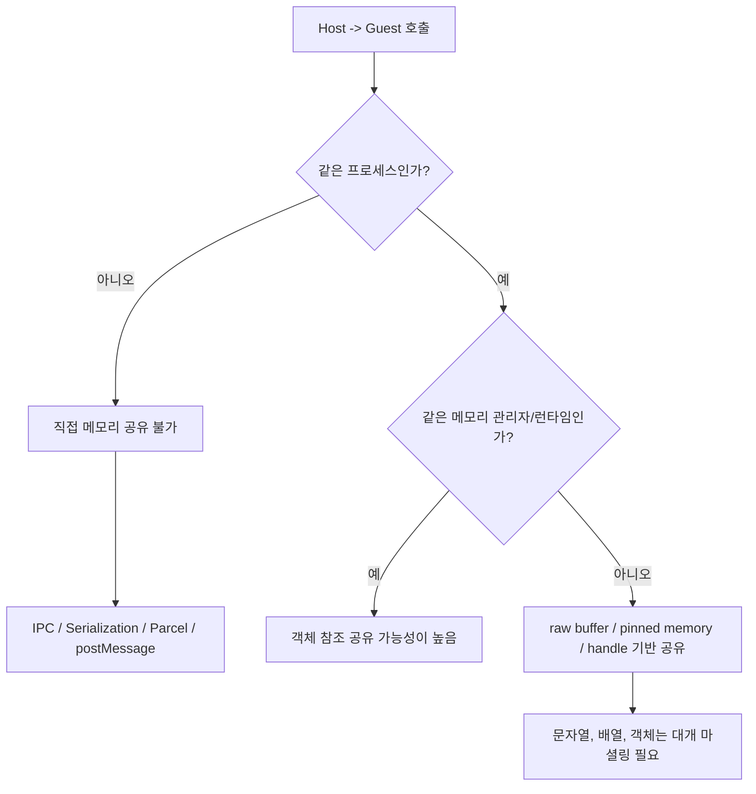
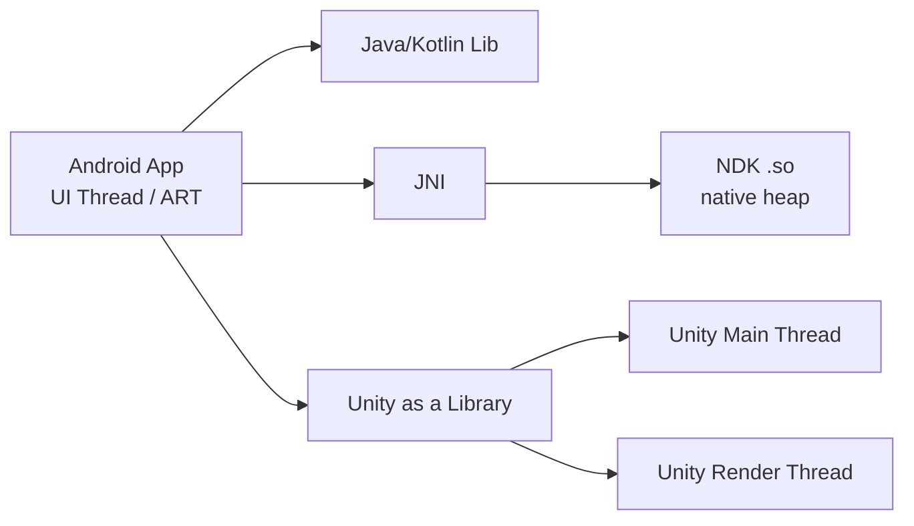
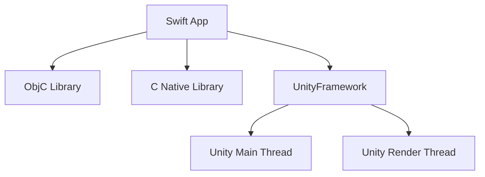
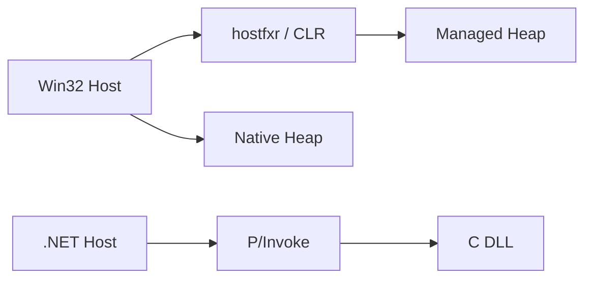
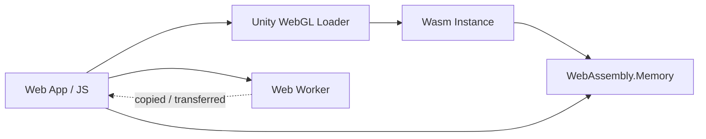

# 260416 크로스플랫폼 바인딩 메모리·스레드·프로세스

## 들어가며

이 문서는 다음 질문에 답하기 위해 작성했다.

- 호스트와 게스트가 같은 프로세스에서 동작하는가?
- 메모리는 누가 생성하고 누가 해제하는가?
- 호스트 스레드와 게스트 스레드가 자동으로 분리되는가?
- 메모리를 직접 공유할 수 있는가?
- 직접 공유가 어렵다면 어떤 마셜링 경로를 써야 하는가?

이번 조사에서 가장 중요한 결론은 하나다.

> 대부분의 "라이브러리 바인딩"은 같은 프로세스 안에서 일어나지만, 메모리 관리 주체와 ABI 경계가 다르기 때문에 체감 동작은 전혀 다르다.

즉, `같은 프로세스`와 `같은 메모리 관리자`는 같은 말이 아니다.

## 1. 먼저 보는 핵심 결론

### 한 줄 요약

- `Java/Kotlin lib`, `ObjC lib`, `.NET lib`처럼 같은 런타임 계열의 라이브러리는 직접 객체 참조 공유가 쉬운 편이다.
- `NDK`, `C native`, `Win32 DLL`, `Unity native plugin`은 같은 프로세스여도 메모리 관리자가 다르므로 소유권 계약이 핵심이다.
- `Unity`가 끼는 순간 `Unity main thread`, `render thread`, `platform main/UI thread`를 따로 생각해야 한다.
- `WebGL`은 브라우저 샌드박스 때문에 네이티브 앱과 완전히 같은 기준으로 보면 안 된다.
- `Unity + iOS`에서는 바인딩 경계면을 `ObjC/C`로 두고, 내부 구현만 `Swift`로 숨기는 구조가 가장 안전하다.

### 비용 모델

$$
\text{Interop Cost} \approx \text{Call Overhead} + \text{Marshalling/Copy} + \text{Thread Handoff} + \text{Ownership Management}
$$

즉, 성능을 결정하는 핵심은 "몇 번 호출하느냐"보다도 "복사와 스레드 전환이 몇 번 일어나느냐"에 가깝다.

### 판단 흐름



## 2. 분석 프레임

### 용어 정의

| 항목 | 의미 |
| --- | --- |
| 직접 공유 | 같은 주소공간에서 zero-copy에 가깝게 같은 메모리 블록을 양쪽이 볼 수 있는 상태 |
| 부분 가능 | raw pointer, pinned buffer, direct buffer처럼 제한된 형태로만 가능 |
| 마셜링 | 문자열/배열/구조체/객체를 ABI에 맞게 복사, 래핑, pinning, handle 변환하는 과정 |
| 자동 별도 스레드 없음 | 바인딩 자체는 호출한 스레드에서 실행되고, 별도 스레드는 런타임이 필요 시 따로 만듦 |

### 케이스를 읽는 방법

- `같은 프로세스`여도 `ART GC`, `Swift/ObjC ARC`, `.NET GC`, `Unity managed/native`, `native heap`은 각각 다르다.
- 따라서 객체를 "공유"할 수 있는지와 raw memory를 "공유"할 수 있는지는 별개로 봐야 한다.
- 아래 표의 `직접 공유`는 보수적으로 해석했다. 즉, 임의 객체 전체가 아니라 `실제로 운영에서 안전하게 공유 가능한 메모리 형태`를 기준으로 판정했다.

## 3. 전체 케이스 요약표

| 호스트 -> 게스트 | 프로세스 | 메모리 생성/관리 주체 | 별도 게스트 스레드 존재? | 직접 메모리 공유 | 직접 공유가 어려울 때 |
| --- | --- | --- | --- | --- | --- |
| Android app -> NDK lib | 기본 동일 | ART GC + native heap | 자동 생성 없음, native가 직접 생성 가능 | 부분 가능 | JNI 마셜링, direct buffer, cross-process면 Binder/AIDL |
| Android app -> Java/Kotlin lib | 기본 동일 | 동일 ART heap | 자동 생성 없음 | 가능 | cross-process면 Binder/Parcel |
| Android app -> Unity lib | 동일 | Android heap + Unity runtime memory | 예, Unity main/render/job thread | 부분 가능 | JNI, UnityPlayer, AndroidJavaObject |
| iOS Swift app -> ObjC lib | 동일 | ARC 중심 | 자동 생성 없음 | 가능 | bridging header / framework import |
| iOS Swift app -> C lib | 동일 | Swift/ARC + C 수동 메모리 | 자동 생성 없음 | 가능(raw pointer 기준) | UnsafePointer / OpaquePointer / Unmanaged |
| iOS Swift app -> Unity lib | 동일 | 앱 메모리 + UnityFramework memory | 예, Unity thread 존재 | 부분 가능 | UnityFramework API, UnitySendMessage, delegate |
| Win32 app -> .NET lib | 동일 | native heap + managed GC heap | 예, CLR GC/thread pool | 부분 가능 | hostfxr, function pointer, custom marshalling |
| .NET app -> C native lib | 동일 | .NET GC + native heap | 자동 생성 없음, native가 직접 생성 가능 | 부분 가능 | P/Invoke / MarshalAs / blittable pinning |
| PC Unity app -> .NET lib | 동일 | 동일 managed world | 자동 생성 없음 | 가능 | 일반 managed call |
| PC Unity app -> C native lib | 동일 | Unity managed/native + plugin native heap | 예, Unity render/native thread 가능 | 부분 가능 | DllImport, Unity native plugin API |
| PC web app -> Unity WebGL lib/app | 브라우저 샌드박스 | JS heap + Wasm linear memory | 예, event loop/worker 모델 | 부분 가능 | .jslib, SendMessage, typed array, postMessage |
| Unity app -> Android AAR lib | 동일(Android) | Unity memory + ART heap + optional native heap | 예, Unity thread + Android UI/worker | 부분 가능 | JNI, AndroidJavaObject, 필요 시 native bridge |
| Unity app -> iOS ObjC lib | 동일(iOS) | Unity managed/native + ARC | 예, Unity thread + iOS main thread | 부분 가능 | DllImport("__Internal"), C/ObjC facade |
| Unity app -> iOS Swift lib | 동일(iOS) | Unity managed/native + Swift ARC | 예 | 부분 가능 | ObjC/C shim + ProductModuleName-Swift.h |
| Unity app -> Win32 lib | 동일(Windows) | Unity managed/native + DLL memory | 예, plugin 자체 thread 가능 | 부분 가능 | DllImport("PluginName") |

## 4. Android 호스트 계열

### 구조 그림



### 세부 표

| 케이스 | 메모리 생성/관리 | 스레드 관점 | 직접 공유 | 마셜링 관점 |
| --- | --- | --- | --- | --- |
| Android app -> NDK lib | Java/Kotlin 객체는 `ART GC`, native 메모리는 `malloc/new` 등 native 측이 관리 | JNI 호출은 기본적으로 호출 스레드에서 수행, native가 만든 스레드는 JVM attach 필요 | `DirectByteBuffer` 같은 형태는 가능, 일반 `byte[]/String`은 복사/핀 가능성 존재 | JNI가 배열/문자열/객체를 ABI에 맞게 변환 |
| Android app -> Java/Kotlin lib | 같은 ART managed heap | 자동 별도 스레드 없음, 앱이 만든 UI/worker 스레드를 그대로 사용 | 같은 런타임이면 객체 참조 공유 가능 | 같은 프로세스면 거의 불필요, 다른 프로세스면 Binder/Parcel |
| Android app -> Unity lib | Unity runtime이 자체 메모리와 scene/object memory를 관리, Android 쪽은 ART가 별도 관리 | Android UI thread와 Unity main/render/job thread가 함께 존재 | C# 객체와 Java 객체를 임의로 직접 공유하긴 어렵고, raw JNI object/reference 수준만 부분 가능 | `AndroidJavaObject`, JNI, UnityPlayer API 사용 |

### 해석

1. `Android -> Java/Kotlin lib`는 가장 단순하다. 사실상 같은 앱 코드의 연장선이다.
2. `Android -> NDK lib`부터는 같은 프로세스여도 메모리 관리자 경계가 생긴다.
3. `Android -> Unity lib`는 가장 헷갈리기 쉽다. 프로세스는 같지만, Unity runtime이 자체 스레드와 메모리 생명주기를 갖기 때문이다.

### 실무 메모

- Android 컴포넌트에 `android:process`를 붙이면 같은 앱이라도 다른 프로세스로 갈 수 있다. 이때부터는 직접 메모리 공유가 아니라 IPC 문제다.
- Unity as a Library는 런타임 인스턴스를 여러 개 올리는 구조가 아니다.
- JNI는 "직접 접근처럼 보이지만 실제로는 copy/pin/release 계약"인 경우가 많다.

## 5. iOS 호스트 계열

### 구조 그림



### 세부 표

| 케이스 | 메모리 생성/관리 | 스레드 관점 | 직접 공유 | 마셜링 관점 |
| --- | --- | --- | --- | --- |
| iOS Swift app -> ObjC lib | 대부분 ARC 기반, Foundation 타입은 자동 브리징 | 자동 별도 스레드 없음, 호출한 스레드에서 실행 | 가능 | bridging header / framework import |
| iOS Swift app -> C lib | Swift 객체는 ARC/값 타입 규칙, C는 명시적 소유권 규칙 | 자동 별도 스레드 없음 | 가능하되 raw pointer 기준 | `UnsafePointer`, `UnsafeMutablePointer`, `OpaquePointer`, `Unmanaged` |
| iOS Swift app -> Unity lib | 앱 메모리와 UnityFramework 메모리가 같은 프로세스에 공존, Unity가 자체 라이프사이클 보유 | Unity thread와 iOS main thread가 공존 | native buffer 수준은 가능, 임의 C# managed object는 불가 | `UnityFramework`, `UnitySendMessage`, delegate/native plugin |

### 해석

- `Swift -> ObjC`는 사실상 Apple이 가장 잘 닦아둔 상호운용 경로다.
- `Swift -> C`는 성능상 유리하지만, 메모리 생명주기를 개발자가 정확히 잡아야 한다.
- `Swift -> UnityFramework`는 같은 프로세스이지만, 앱이 Unity runtime 전체를 하나의 "서브 시스템"으로 품는 구조로 이해하는 편이 맞다.

### Unity as a Library on iOS에서 꼭 기억할 점

| 항목 | 의미 |
| --- | --- |
| `unloadApplication` | 대부분의 메모리를 해제하지만 전부는 아님 |
| `quitApplication` | 메모리를 모두 해제하지만 같은 프로세스에서 다시 실행 불가 |
| runtime instance | 한 프로세스 안에서 여러 Unity runtime 인스턴스를 전제로 설계하면 안 됨 |

## 6. PC / .NET / Win32 호스트 계열

### 세부 표

| 케이스 | 메모리 생성/관리 | 스레드 관점 | 직접 공유 | 마셜링 관점 |
| --- | --- | --- | --- | --- |
| Win32 app -> .NET lib | native heap과 managed GC heap이 같은 프로세스 안에 공존 | CLR이 GC thread, thread pool 등을 자체 운영 가능 | unmanaged/pinned/blittable 기준 부분 가능 | `hostfxr`, delegate, `IntPtr`, custom marshalling |
| .NET app -> C native lib | .NET GC와 native heap 분리 | 기본은 호출 스레드, native가 자체 thread 생성 가능 | blittable/pinned memory는 가능 | `LibraryImport` / `DllImport` / `MarshalAs` |

### 그림



### 해석

- `Win32 -> .NET`은 "네이티브 프로세스 안에 CLR을 심는 구조"다.
- `.NET -> C`는 반대로 "managed 프로세스 안에서 native DLL을 부르는 구조"다.
- 둘 다 프로세스는 같지만, GC heap을 raw pointer로 마음대로 잡고 오래 들고 있으면 위험하다. `pinning` 또는 `unmanaged allocation` 계약이 필요하다.

## 7. Unity 호스트 계열

### 세부 표

| 케이스 | 메모리 생성/관리 | 스레드 관점 | 직접 공유 | 마셜링 관점 |
| --- | --- | --- | --- | --- |
| PC Unity app -> .NET lib | 같은 managed runtime/assembly world | 자동 별도 스레드 없음 | 가능 | 일반 C# 참조 호출 |
| PC Unity app -> C native lib | Unity managed/native 메모리와 plugin native 메모리 분리 | render plugin이면 render thread를 따로 고려 | 부분 가능 | `DllImport`, Unity native plugin API |
| Unity app -> Android AAR lib | Unity memory + ART heap + optional NDK memory | Unity thread와 Android UI thread가 공존 | 부분 가능 | JNI, `AndroidJavaObject` |
| Unity app -> iOS ObjC lib | Unity managed/native + ARC | Unity thread와 iOS main thread 공존 | 부분 가능 | `DllImport("__Internal")`, ObjC/C facade |
| Unity app -> iOS Swift lib | Unity managed/native + Swift ARC | 위와 동일 | 부분 가능 | ObjC/C shim 통해 Swift 호출 |
| Unity app -> Win32 lib | Unity managed/native + Win32 DLL memory | plugin 자체 thread 생성 가능 | 부분 가능 | `DllImport("PluginName")` |

### 실무 포인트

| 항목 | 이유 |
| --- | --- |
| Unity managed object 직접 공유 금지 | 플랫폼 guest가 Unity GC 객체 주소를 오래 보관하면 위험 |
| handle 기반 API 선호 | 생성/조회/해제 주체를 명확히 분리할 수 있음 |
| 렌더링 개입은 `GL.IssuePluginEvent` 고려 | script thread와 render thread가 다를 수 있음 |
| 문자열은 UTF-8 계약 권장 | iOS native callback, C ABI, cross-platform API에서 가장 예측 가능 |

## 8. Web 호스트 계열

### 구조 그림



### 세부 표

| 케이스 | 메모리 생성/관리 | 스레드 관점 | 직접 공유 | 마셜링 관점 |
| --- | --- | --- | --- | --- |
| PC web app -> Unity WebGL lib/app | JS heap + Wasm linear memory, 브라우저가 sandbox와 프로세스 topology를 관리 | main event loop와 worker 모델, Unity Web은 managed thread 제약 존재 | JS와 Wasm memory buffer는 부분 공유 가능 | `.jslib`, browser JS bridge, `SendMessage`, `postMessage`, transferable object |

### 해석

- 이 케이스는 네이티브 앱의 DLL 개념으로 보면 안 된다.
- 브라우저 페이지와 Unity WebGL은 "같은 탭 안의 JS/Wasm 실행 환경"으로 보는 편이 맞다.
- JS와 Wasm은 같은 `WebAssembly.Memory.buffer`를 볼 수 있지만, worker와 main thread 사이 데이터는 기본적으로 복사 또는 ownership transfer다.
- Unity Web 플랫폼은 일반 네이티브 앱처럼 C# managed threading을 기대하면 안 된다.

## 9. 별도 주제: Unity + iOS lib 바인딩에서 ObjC가 Swift보다 더 나은가?

결론부터 말하면, **Unity의 바인딩 경계면에서는 보통 ObjC(C/ObjC surface)가 Swift보다 낫다.**

### 비교 표

| 항목 | Objective-C lib | Swift lib |
| --- | --- | --- |
| Unity 기본 플러그인 모델 적합성 | 매우 높음 | 중간 |
| C ABI 노출 용이성 | 쉬움 | 보통 추가 shim 필요 |
| 이름 맹글링 대응 | 유리 | 직접 경계로 쓰면 더 까다로움 |
| Unity 문서와의 정합성 | 높음 | 우회 경로 필요 |
| 브리징 복잡도 | 낮음 | `ProductModuleName-Swift.h`, `@objc`, ObjC 노출 가능 타입 고려 필요 |
| 추천 역할 | 외부 바인딩 경계면 | 내부 구현 레이어 |

### 이유 정리

1. Unity iOS native plugin의 공식 인터페이스는 본질적으로 `C 기반`이다.
2. Unity 문서는 iOS plugin 함수 노출 시 `DllImport("__Internal")`와 C linkage를 중심으로 설명한다.
3. Objective-C는 C ABI와 더 자연스럽게 맞물리고, Unity 바깥 경계면으로 세우기 쉽다.
4. Swift는 충분히 사용할 수 있지만, 보통은 **ObjC/C shim을 하나 둔 뒤 Swift 구현체로 포워딩**하는 구조가 더 안정적이다.

### 추천 아키텍처


### 실무 결론

- **가장 안정적인 방식**: `Unity C# -> C/ObjC facade -> Swift implementation`
- 즉, 외부 ABI는 ObjC/C로 고정하고, 실제 비즈니스 로직만 Swift에 두는 것이 좋다.
- 순수 Swift를 Unity의 직접 바인딩 경계로 쓰는 설계는 가능은 하지만 유지보수 비용이 더 높아지는 편이다.

## 10. 권장 설계 패턴

### 패턴 표

| 상황 | 추천 패턴 | 이유 |
| --- | --- | --- |
| managed <-> native 경계 | `POD struct + handle + explicit free` | 소유권 분쟁이 가장 적음 |
| 고빈도 호출 | 작은 호출 다수보다 batch 호출 | ABI crossing 비용 절감 |
| 큰 바이너리 버퍼 | direct buffer / pinned buffer / native allocation | copy 비용 최소화 |
| 문자열 교환 | UTF-8 + 명시적 해제 규칙 | 플랫폼 간 예측 가능성 높음 |
| callback | 즉시 재진입보다 queue + main-thread dispatch | thread affinity 문제 감소 |
| Unity render 연동 | render thread callback 사용 | script thread와 render thread 분리 대응 |

### 체크리스트

- 메모리 생성 주체와 해제 주체를 API 문서에 명시했는가?
- 문자열 인코딩을 고정했는가?
- 스레드 affinity가 필요한 API(UI, render, engine state)를 구분했는가?
- cross-process 가능성이 있으면 처음부터 IPC 직렬화 모델로 설계했는가?
- Unity에서는 `C# object reference 공유`가 아니라 `handle/buffer 공유`로 설계했는가?

## 11. 리스크와 반례

| 주제 | 리스크 / 반례 |
| --- | --- |
| 같은 프로세스 = 직접 공유 가능 | 틀릴 수 있다. GC/ARC/manual/native heap이 다르면 객체 공유는 어려울 수 있다. |
| Swift가 항상 ObjC보다 우수 | Unity 경계에서는 아니다. Swift는 내부 구현체로는 좋지만 ABI 경계면으로는 더 번거롭다. |
| WebGL도 네이티브처럼 다룰 수 있음 | 브라우저 sandbox, worker, Wasm memory 제약 때문에 다르다. |
| JNI는 항상 zero-copy | 아니다. 배열/문자열은 copy 또는 pin/release 계약이 개입될 수 있다. |

## 12. 참고 URL

### Android / JNI

- https://developer.android.com/guide/components/processes-and-threads
- https://developer.android.com/ndk/guides/jni-tips
- https://developer.android.com/guide/components/aidl

### Apple / Swift / Objective-C / C

- https://docs.developer.apple.com/tutorials/data/documentation/swift/importing-objective-c-into-swift.json
- https://docs.developer.apple.com/tutorials/data/documentation/swift/imported-c-and-objective-c-apis.json
- https://docs.developer.apple.com/tutorials/data/documentation/swift/using-imported-c-functions-in-swift.json
- https://docs.developer.apple.com/tutorials/data/documentation/swift/working-with-foundation-types.json
- https://docs.developer.apple.com/tutorials/data/documentation/swift/working-with-core-foundation-types.json
- https://docs.developer.apple.com/tutorials/data/documentation/swift/importing-swift-into-objective-c.json

### Unity

- https://docs.unity3d.com/Manual/UnityasaLibrary-Android.html
- https://docs.unity3d.com/Manual/UnityasaLibrary-iOS.html
- https://docs.unity3d.com/Manual/plug-ins-native.html
- https://docs.unity3d.com/Manual/plug-ins-managed.html
- https://docs.unity3d.com/Manual/plug-ins-for-desktop.html
- https://docs.unity3d.com/Manual/ios-native-plugin-create.html
- https://docs.unity3d.com/Manual/ios-native-plugin-call-back.html
- https://docs.unity3d.com/Manual/ios-native-plugin-automated-integration.html
- https://docs.unity3d.com/ScriptReference/GL.IssuePluginEvent.html
- https://docs.unity3d.com/Manual/android-plugins-java-code-from-c-sharp.html
- https://docs.unity3d.com/Manual/webgl-interactingwithbrowserscripting.html
- https://docs.unity3d.com/Manual/webgl-technical-overview.html

### Microsoft / Web

- https://learn.microsoft.com/en-us/dotnet/core/tutorials/netcore-hosting
- https://learn.microsoft.com/en-us/dotnet/standard/native-interop/pinvoke
- https://learn.microsoft.com/en-us/dotnet/standard/native-interop/type-marshalling
- https://learn.microsoft.com/en-us/dotnet/csharp/language-reference/unsafe-code
- https://developer.mozilla.org/en-US/docs/WebAssembly/JavaScript_interface/Memory
- https://developer.mozilla.org/en-US/docs/Web/API/Web_Workers_API/Using_web_workers

## 13. 호환성 체크 메모

- 수식 블록은 `$$ ... $$` 형식으로 작성했다.
- Mermaid 다이어그램은 일반 Markdown 렌더러에서 지원되는 문법으로 작성했다.
- 표는 Notion에 붙여넣어도 크게 깨지지 않도록 단순 표 형태로 유지했다.

## 14. 작성 시 사용한 사용자 질문 프롬프트

```text
hhd-research
hhd-md

think ultra hard

조사주제 : 각종 플랫폼에서 크로스플랫폼 바인딩 케이스 메모리, 스레드, 프로세스 동작 이해

플랫폼 케이스
- 호스트 : android app
  - 게스트
    - ndk lib
    - java or kotlin lib
    - unity lib
- 호스트 : ios app, swift
  - 게스트
    - objc lib
    - c native lib
    - unity lib
- 호스트 : pc win32 app
  - 게스트
    - .net lib
- 호스트 : pc .net app
  - 게스트
    - c native lib
- 호스트 : pc unity app
  - 게스트
    - .net lib
    - c native lib
- 호스트 : pc web app
  - 게스트
    - unity webgl lib or app
- 호스트 : unity app
  - 게스트
    - android aar lib
    - ios objc lib
    - ios swift lib
    - win32 lib

요구사항
- 호스트와 게스트의 모든 케이스에서
  - 각 메모리 생성과 관리 주체
  - 호스트스레드와 게스트스레드가 별도로 존재하는지
  - 호스트와 게스트간 메모리 직접공유 가능한지
  - 메모리 직접공유가 안된다면 마셜링을 통해서 가능한지

별도 요구사항
  - unity + ios lib 바인딩을 만들때
    - objc lib이 swift lib 보다 더 나은가?
    - 그렇다면 그 이유는?

hhd-md
```

