# 260508 개발질문세션노트

## 문서 목적

이 문서는 `HhdStock` 개발 관련 대화에서 나온 질문과 답변을 한 곳에 누적 정리하기 위한 세션 노트입니다.

단순 대화 로그가 아니라, 이후 다시 읽기 쉬운 개발 지식 문서로 재구성합니다.

| 항목 | 운영 방식 |
| --- | --- |
| 저장 위치 | `C:\Users\hhd20\project\hhddoc\260508_0002_개발질문세션노트.md` |
| 문서 방식 | 질문별 핵심 결론, 비교표, 근거 URL, 검증필요를 함께 정리 |
| qmd 사용 여부 | 현재 세션에 qmd MCP 도구가 없어 사용하지 않음 |
| 웹 근거 | 외부 프로토콜/표준/최신 정보가 필요한 답변에는 URL 기록 |

## 001. RTMP, RTSP, RTP 차이점

### 질문

> rtmp, rtsp, rtp 의 차이점?

### 핵심 결론

세 가지는 모두 실시간 미디어와 관련 있지만, 담당하는 층위가 다릅니다.

- **RTP**: 실제 오디오/비디오 패킷을 실시간으로 운반하는 전송 포맷/프로토콜입니다.
- **RTSP**: 재생, 일시정지, 세션 설정 같은 스트리밍 제어용 프로토콜입니다. 보통 미디어 본문은 RTP 같은 별도 프로토콜로 흐릅니다.
- **RTMP**: 오디오/비디오/데이터를 하나의 연결 위에서 메시지로 묶어 보내는 애플리케이션 레벨 스트리밍 프로토콜입니다. 실무에서는 방송 송출 인입, 즉 encoder -> streaming server 구간에서 자주 쓰였습니다.

### 한눈에 비교

| 구분 | RTP | RTSP | RTMP |
| --- | --- | --- | --- |
| 전체 이름 | Real-time Transport Protocol | Real-Time Streaming Protocol | Real Time Messaging Protocol |
| 핵심 역할 | 미디어 패킷 운반 | 스트림 세션 제어 | 미디어/데이터 메시지 multiplexing 및 streaming |
| 비유 | 택배 상자 자체 | 리모컨/제어 채널 | 포장+운송 규칙이 합쳐진 스트리밍 파이프 |
| 주 전송 기반 | 보통 UDP 위에서 사용 | RTSP 2.0 기준 TCP 또는 TCP/TLS 연결 | 신뢰성 있는 스트림 전송, 보통 TCP |
| 데이터 전달 | 직접 미디어 payload 전달 | 보통 직접 전달보다 제어 담당 | 직접 오디오/비디오/데이터 메시지 전달 |
| 대표 사용처 | WebRTC, VoIP, IP 카메라 내부 미디어 전달, 멀티미디어 세션 | IP 카메라, VOD/라이브 스트림 제어 | OBS 같은 인코더에서 서버로 라이브 송출 인입 |
| 지연 특성 | 낮은 지연에 유리, 패킷 손실 허용 설계 | 자체 지연보다 media delivery 방식에 좌우 | TCP 기반이라 안정적이나 혼잡 시 지연 누적 가능 |
| 표준 성격 | IETF RFC 3550 | IETF RFC 7826 | Adobe 계열 공개 명세 |

### 관계도

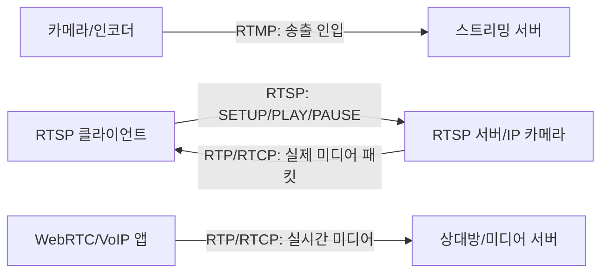

### 조금 더 정확히

**RTP**는 실시간 데이터의 end-to-end 전달을 위한 프로토콜입니다. 오디오/비디오 payload 타입, sequence number, timestamp, 전송 모니터링 같은 정보를 제공하지만, 자체적으로 지연 보장이나 QoS 보장을 하지는 않습니다. 그래서 손실이 일부 발생해도 실시간성을 우선하는 음성/영상 흐름에 잘 맞습니다.

**RTSP**는 미디어 스트림을 제어하는 프로토콜입니다. 클라이언트가 `DESCRIBE`, `SETUP`, `PLAY`, `PAUSE`, `TEARDOWN` 같은 방식으로 서버에게 “어떤 스트림을 어떤 방식으로 재생할지” 요청합니다. 실제 연속 미디어 데이터는 대개 RTSP 밖에서 RTP/RTCP로 전달됩니다.

**RTMP**는 오디오, 비디오, 데이터 메시지를 TCP 같은 신뢰성 있는 스트림 위에서 multiplexing하고 packetizing하는 프로토콜입니다. 과거 Flash 생태계에서 강했고, 지금도 라이브 플랫폼의 encoder ingest 구간에서 많이 남아 있습니다.

### 실무 선택 기준

| 상황 | 우선 고려 |
| --- | --- |
| IP 카메라 영상을 가져와야 함 | RTSP URL로 연결하고, 내부 media transport는 RTP인지 확인 |
| OBS/FFmpeg에서 방송 서버로 송출 | RTMP 또는 RTMPS ingest |
| 브라우저/앱 간 초저지연 통화 | RTP를 직접 쓰기보다 WebRTC 스택을 통해 RTP/SRTP 사용 |
| 자체 미디어 프로토콜 설계 | RTP/RTCP + 세션 제어 계층을 분리해 검토 |

### 근거 URL

- RFC 3550, RTP: A Transport Protocol for Real-Time Applications: https://www.rfc-editor.org/rfc/rfc3550
- RFC 7826, Real-Time Streaming Protocol Version 2.0: https://www.rfc-editor.org/rfc/rfc7826.html
- Adobe RTMP Specification HTML mirror: https://rtmp.veriskope.com/docs/spec/

### 사실 / 추정 / 검증필요

| 분류 | 내용 |
| --- | --- |
| 사실 | RTP는 RFC 3550에서 실시간 데이터 전송용 프로토콜로 정의됨 |
| 사실 | RTSP 2.0은 RFC 7826에서 실시간 데이터 전달의 setup/control 프로토콜로 정의됨 |
| 사실 | RTMP 명세는 TCP 같은 신뢰성 있는 스트림 전송 위에서 오디오/비디오/데이터 메시지를 multiplexing한다고 설명함 |
| 추정 | 사용자의 질문 의도는 구현 관점의 네트워크 프로토콜 비교로 판단함 |
| 검증필요 | 특정 제품이나 코드에서 어떤 프로토콜을 써야 하는지는 해당 장비/서버/SDK 지원 범위를 추가 확인해야 함 |

## 002. 240p~4K 해상도와 적정 비트레이트 계산

### 질문

> 240p 360p 480p 720p 1080p 4k 영상의 각각 해상도는?
> 각 영상별 1초 분량의 적절한 비트레이트는?
> 비트레이트가 산출되는 상세한 계산?

### 전제

아래 값은 **16:9, SDR, H.264, 8-bit, YUV 4:2:0, 30fps, 일반적인 움직임의 영상** 기준입니다.

YouTube 공식 업로드 권장값은 360p 이상에 대해 H.264, 4:2:0, VBR, SDR 기준 비트레이트를 제시합니다. 240p는 공식 업로드 표에 직접 값이 없어서, 360p의 bits-per-pixel 수준을 426x240에 맞춰 역산했습니다.

### 해상도와 권장 비트레이트

| 품질 | 16:9 해상도 | 픽셀 수/프레임 | 30fps 영상 비트레이트 | 1초당 영상 용량 | 60fps 참고 |
| --- | --- | ---: | ---: | ---: | ---: |
| 240p | 426x240 | 102,240 | 약 0.45 Mbps | 약 0.056 MB/s | 약 0.7 Mbps 추정 |
| 360p | 640x360 | 230,400 | 1 Mbps | 0.125 MB/s | 1.5 Mbps |
| 480p | 854x480 | 409,920 | 2.5 Mbps | 0.313 MB/s | 4 Mbps |
| 720p | 1280x720 | 921,600 | 5 Mbps | 0.625 MB/s | 7.5 Mbps |
| 1080p | 1920x1080 | 2,073,600 | 8 Mbps | 1 MB/s | 12 Mbps |
| 4K/UHD | 3840x2160 | 8,294,400 | 35~45 Mbps, 대표값 40 Mbps | 4.375~5.625 MB/s | 53~68 Mbps |

> `MB/s = Mbps / 8` 입니다. 예를 들어 1080p 8 Mbps는 `8 / 8 = 1 MB/s` 입니다.

### 비트레이트 산출 구조

무압축 영상 기준으로 먼저 계산한 다음, 코덱 압축률을 반영합니다.

#### 1단계: 프레임당 픽셀 수

$$
pixels = width \times height
$$

예: 1080p

$$
1920 \times 1080 = 2,073,600 \text{ pixels/frame}
$$

#### 2단계: 색상 채널/샘플링 고려

RGB 8-bit 무압축이면 픽셀당 24bit입니다.

$$
raw\_rgb\_bps = width \times height \times fps \times 3 \times 8
$$

하지만 H.264 같은 일반 동영상은 보통 YUV 4:2:0 8-bit를 사용합니다. 이 경우 픽셀당 평균 12bit입니다.

$$
raw\_yuv420\_bps = width \times height \times fps \times 12
$$

예: 1080p 30fps YUV 4:2:0

$$
1920 \times 1080 \times 30 \times 12
= 746,496,000 \text{ bps}
= 746.5 \text{ Mbps}
$$

#### 3단계: 압축률 반영

H.264 1080p 30fps의 권장 영상 비트레이트를 8 Mbps로 잡으면:

$$
compression\_ratio =
\frac{746.5}{8}
\approx 93.3:1
$$

즉, 무압축 YUV 4:2:0 기준 약 746.5 Mbps짜리 데이터를 H.264로 약 8 Mbps 수준까지 줄이는 셈입니다.

다른 표현으로는 `encoded bits per pixel per frame`을 사용합니다.

$$
encoded\_bpp =
\frac{target\_bps}{width \times height \times fps}
$$

예: 1080p 30fps, 8 Mbps

$$
\frac{8,000,000}{1920 \times 1080 \times 30}
\approx 0.129 \text{ bit/pixel/frame}
$$

### 계산 결과 표

| 품질 | 무압축 YUV 4:2:0 30fps | 목표 비트레이트 | encoded bpp | 압축률 |
| --- | ---: | ---: | ---: | ---: |
| 240p | 36.81 Mbps | 0.45 Mbps | 0.147 | 81.8:1 |
| 360p | 82.94 Mbps | 1 Mbps | 0.145 | 82.9:1 |
| 480p | 147.57 Mbps | 2.5 Mbps | 0.203 | 59.0:1 |
| 720p | 331.78 Mbps | 5 Mbps | 0.181 | 66.4:1 |
| 1080p | 746.50 Mbps | 8 Mbps | 0.129 | 93.3:1 |
| 4K | 2,985.98 Mbps | 40 Mbps | 0.161 | 74.6:1 |

### 오디오까지 포함한 총 비트레이트

영상 파일/스트림의 전체 비트레이트는 보통 아래처럼 계산합니다.

$$
total\_bitrate = video\_bitrate + audio\_bitrate + container\_overhead
$$

YouTube 업로드 권장값 기준 오디오는 stereo 384 kbps, 5.1ch 512 kbps입니다. 라이브 인코더에서는 stereo 128 kbps도 흔히 씁니다.

예: 1080p 30fps 업로드용

$$
8 \text{ Mbps} + 0.384 \text{ Mbps}
= 8.384 \text{ Mbps}
$$

### 주의할 점

비트레이트는 해상도만으로 결정되지 않습니다. 실제 적정값은 아래 요소에 따라 크게 달라집니다.

| 변수 | 영향 |
| --- | --- |
| FPS | 60fps는 30fps보다 더 많은 비트레이트 필요 |
| 코덱 | H.265/HEVC, AV1은 H.264보다 같은 품질에서 더 낮은 비트레이트 가능 |
| 화면 복잡도 | 게임, 스포츠, 노이즈 많은 영상은 더 높은 비트레이트 필요 |
| 인코딩 방식 | CBR은 라이브에 유리, VBR/CRF는 파일 품질-용량 균형에 유리 |
| 색상/비트 깊이 | HDR, 10-bit, 4:2:2는 더 많은 데이터 필요 |

### 근거 URL

- YouTube recommended upload encoding settings: https://support.google.com/youtube/answer/1722171
- YouTube live encoder settings, bitrates, and resolutions: https://support.google.com/youtube/answer/2853702

### 사실 / 추정 / 검증필요

| 분류 | 내용 |
| --- | --- |
| 사실 | YouTube 공식 업로드 권장값은 360p 1 Mbps, 480p 2.5 Mbps, 720p 5 Mbps, 1080p 8 Mbps, 2160p 35~45 Mbps를 제시함 |
| 사실 | YouTube 공식 업로드 권장 설정은 H.264, VBR, chroma subsampling 4:2:0을 권장함 |
| 추정 | 240p 0.45 Mbps는 360p의 encoded bpp를 426x240 해상도에 적용한 역산값 |
| 검증필요 | 특정 서비스의 실제 adaptive streaming ladder는 트래픽 비용, codec, device target에 맞춰 별도 튜닝 필요 |

## 003. TCP의 문제점과 QUIC의 해결 방식

### 질문

> tcp 의 문제점 소개
> quic 으로 해결한 방식 소개

### 핵심 결론

TCP 자체가 나쁜 프로토콜이라는 뜻은 아닙니다. TCP는 **신뢰성 있는 순서 보장 byte stream**이라는 강력한 추상화를 제공합니다. 문제는 현대 웹처럼 한 연결 안에 많은 독립 요청을 동시에 싣는 환경에서 이 추상화가 지연을 키울 수 있다는 점입니다.

QUIC은 UDP 위에 새 전송 계층을 만들고, 그 안에 **TLS, multiplexed stream, packet-level loss recovery, connection ID 기반 migration**을 넣어 TCP+TLS 조합의 병목을 줄였습니다.

### TCP의 대표 문제

| 문제 | 설명 | 체감 증상 |
| --- | --- | --- |
| 연결 설정 RTT | TCP 3-way handshake 후 TLS handshake가 추가됨 | 첫 요청 시작이 늦음 |
| Head-of-Line blocking | TCP는 하나의 순서 있는 byte stream이라 앞쪽 packet 손실이 뒤쪽 데이터를 막음 | HTTP/2처럼 multiplexing해도 packet loss 하나가 여러 요청을 멈춤 |
| 네트워크 변경에 약함 | 연결 식별이 IP/Port 4-tuple 중심 | Wi-Fi -> LTE 전환, NAT rebinding 때 연결이 끊기기 쉬움 |
| 커널 구현 의존 | TCP는 OS 커널 스택에 강하게 묶임 | 새 기능 배포와 실험이 느림 |
| 암호화가 외부 계층 | TCP 자체에는 TLS가 내장되지 않음 | TCP + TLS + HTTP 계층이 분리되어 handshake 비용이 커짐 |

### QUIC의 해결 방식

| TCP 쪽 한계 | QUIC의 방식 | 효과 |
| --- | --- | --- |
| TCP handshake + TLS handshake | QUIC transport handshake에 TLS 1.3 통합 | 초기 연결 지연 감소, 재연결 시 0-RTT 가능 |
| 연결 단위 byte stream HOL blocking | 하나의 QUIC connection 안에 여러 독립 stream 제공 | 손실된 packet에 관련된 stream만 대기, 다른 stream은 진행 |
| IP/Port 변경 시 연결 단절 | Connection ID로 연결 식별 | 네트워크 경로가 바뀌어도 같은 연결 유지 가능 |
| TCP 확장 배포가 느림 | UDP 위 user-space transport | 애플리케이션/라이브러리 업데이트로 빠르게 개선 가능 |
| TLS가 별도 계층 | QUIC packet 보호와 TLS 연동 | 대부분의 packet이 인증/암호화됨 |
| 손실 복구가 TCP byte stream 중심 | QUIC packet number, ACK range, stream별 흐름 제어 | 손실 감지/복구와 multiplexing의 상호작용 개선 |

### 구조 비교

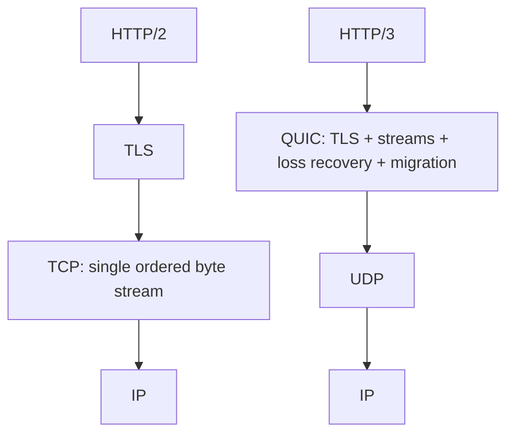

### Head-of-Line blocking 예시

TCP에서는 한 연결에 A, B, C 요청의 데이터가 섞여 있어도 TCP 계층은 이를 하나의 byte stream으로 봅니다. 앞쪽 packet 하나가 유실되면 뒤쪽 byte를 애플리케이션에 순서대로 넘기지 못합니다.

```text
TCP byte stream:
[A1][B1][C1][A2-loss][B2][C2]
                 ^
                 A2 재전송 전까지 뒤쪽 전달이 막힐 수 있음

QUIC streams:
Stream A: [A1][A2-loss] -> A만 대기
Stream B: [B1][B2]      -> 진행 가능
Stream C: [C1][C2]      -> 진행 가능
```

### QUIC도 만능은 아님

| 제약 | 설명 |
| --- | --- |
| UDP 차단 | 일부 기업망/방화벽은 UDP/443 또는 QUIC을 차단할 수 있음 |
| CPU 비용 | user-space 암호화/패킷 처리로 TCP보다 CPU 비용이 커질 수 있음 |
| 네트워크 장비 가시성 저하 | 많은 헤더가 암호화되어 중간 장비의 분석/최적화 방식이 달라짐 |
| 완전한 HOL 제거는 아님 | 같은 QUIC stream 안에서는 여전히 순서 보장이 필요함 |

### 근거 URL

- RFC 9293, Transmission Control Protocol: https://www.rfc-editor.org/rfc/rfc9293
- RFC 9000, QUIC Transport Protocol: https://www.rfc-editor.org/rfc/rfc9000
- RFC 9001, Using TLS to Secure QUIC: https://www.rfc-editor.org/rfc/rfc9001
- RFC 9002, QUIC Loss Detection and Congestion Control: https://www.rfc-editor.org/rfc/rfc9002
- RFC 9114, HTTP/3: https://www.rfc-editor.org/rfc/rfc9114

### 사실 / 추정 / 검증필요

| 분류 | 내용 |
| --- | --- |
| 사실 | RFC 9293은 TCP가 reliable, in-order, byte-stream service를 제공한다고 설명함 |
| 사실 | RFC 9000은 QUIC이 flow-controlled streams, low-latency connection establishment, network path migration을 제공한다고 설명함 |
| 사실 | RFC 9000은 QUIC이 여러 stream 사이의 head-of-line blocking을 피하는 장점을 명시함 |
| 사실 | RFC 9114는 HTTP/2의 multiplexing이 TCP 손실 복구에 보이지 않아 packet loss/reorder가 active transaction을 stall시킨다고 설명함 |
| 추정 | 사용자의 질문 의도는 웹/스트리밍/네트워크 구현 관점의 TCP vs QUIC 비교로 판단함 |
| 검증필요 | 실제 성능은 RTT, packet loss, 서버/클라이언트 구현, UDP 차단 여부에 따라 벤치마크 필요 |

## 004. SQL/RDBMS, NoSQL, Redis, Search, pgvector 선택 기준

### 질문

> sql rdbms 와 nosql 의 차이점 장단점
> firestore, dynamodb, postgressql, mysql, sqlite 장단점 특징 소개
> orm사용시 장단점
> redis 소개 장단점
> firestore의 약점을 보완하기 위해 redis나 elastic search 를 사용한다면?
> pgvector 의 소개 장단점

### 핵심 결론

DB 선택은 "어떤 데이터 모델이 더 멋진가"보다 **질문 패턴과 정합성 요구**가 먼저입니다.

| 요구사항 | 우선 후보 |
| --- | --- |
| 복잡한 관계, JOIN, 트랜잭션, 리포팅 | PostgreSQL, MySQL |
| 모바일/웹 실시간 동기화, 오프라인 지원, 서버리스 | Firestore |
| AWS 안에서 초대규모 key-value/document access pattern | DynamoDB |
| 로컬 앱, 임베디드, 테스트, 단일 파일 배포 | SQLite |
| 캐시, 세션, rate limit, 랭킹, 분산 락 보조 | Redis |
| 전문 검색, fuzzy search, relevance ranking, 로그/분석 | Elasticsearch |
| RAG/semantic search를 관계형 데이터와 같이 다룸 | PostgreSQL + pgvector |

### SQL RDBMS vs NoSQL

| 구분 | SQL/RDBMS | NoSQL |
| --- | --- | --- |
| 기본 모델 | 테이블, 행, 컬럼, 관계 | 문서, key-value, wide-column, graph 등 |
| 스키마 | 명시적 schema 중심 | 유연한 schema 또는 schemaless |
| 쿼리 | SQL, JOIN, aggregate 강함 | 제품별 API/query model |
| 정합성 | ACID 트랜잭션에 강함 | 제품별로 strong/eventual/transaction 지원 범위 다름 |
| 확장 방식 | 전통적으로 vertical scale + replication, 최근 managed scale-out | scale-out/partitioning을 전제로 설계된 제품 많음 |
| 데이터 설계 | 정규화 후 query | access pattern에 맞춰 denormalization |
| 강점 | 데이터 무결성, 복잡한 조회, 분석, 도구 생태계 | 대규모 분산, 유연한 모델, 서버리스/운영 단순성 |
| 약점 | 대규모 write scale-out과 운영 튜닝이 어려울 수 있음 | JOIN/복잡 조회/임의 ad-hoc query가 약하거나 비용 큼 |

### 제품별 특징과 장단점

| 제품 | 분류 | 장점 | 단점 | 잘 맞는 상황 |
| --- | --- | --- | --- | --- |
| Firestore | 서버리스 문서형 NoSQL | 실시간 listener, 오프라인 지원, Firebase SDK/Rules, 자동 확장 | Standard/Core query는 JOIN/전문검색/복잡 집계가 제한적, denormalization 필요, read/write 과금 설계 중요 | 모바일/웹 앱, 협업/채팅/피드, 빠른 MVP |
| DynamoDB | AWS 서버리스 key-value/document NoSQL | 단일 digit ms 지연, 글로벌 테이블, Streams, TTL, DAX, 운영 부담 낮음 | access pattern 선설계 필수, JOIN 없음, 잘못된 partition key는 hot partition 위험 | AWS 대규모 서비스, 장바구니, 세션, 게임/이벤트 상태 |
| PostgreSQL | 오픈소스 object-relational RDBMS | SQL, ACID, JSONB, 확장성, PostGIS/pgvector/FTS, 복잡 쿼리 강함 | 대규모 분산 write scale은 별도 설계 필요, 운영/튜닝 필요 | 기본 선택지, SaaS 백엔드, 금융/정산, 검색+벡터까지 한 DB에서 |
| MySQL | 오픈소스 RDBMS | 웹/커머스/OLTP 생태계 큼, InnoDB 안정성, 운영 경험 풍부 | PostgreSQL 대비 고급 타입/확장/복잡 SQL에서 선택지가 좁을 수 있음 | 전통 웹 서비스, WordPress/LAMP, 단순 OLTP |
| SQLite | 임베디드 RDBMS | 서버 없음, zero-config, 단일 파일, 테스트/로컬 배포 쉬움 | 다수 원격 클라이언트가 직접 붙는 client/server DB 용도에는 부적합 | 모바일/데스크톱 로컬 DB, CLI 도구, 테스트, edge |

### Firestore 세부 메모

Firestore는 "앱 개발 속도"가 매우 빠른 DB입니다. 문서/컬렉션 모델이 직관적이고, 클라이언트 SDK에서 실시간 listener와 offline persistence를 바로 쓸 수 있습니다.

하지만 Standard/Core query 기준으로는 다음 제약이 중요합니다.

| 약점 | 설명 | 일반적인 보완 |
| --- | --- | --- |
| 복잡한 JOIN 부재 | 문서 간 관계를 DB가 자동으로 결합하지 않음 | denormalization, Cloud Functions, Enterprise Pipeline subquery 검토 |
| 전문검색 부족 | Standard 문서에서는 text field full-text search를 외부 검색 서비스로 해결하라고 안내 | Elasticsearch, Algolia, Typesense, 또는 Enterprise Pipeline search 검토 |
| 집계/랭킹 비용 | count/aggregate가 있어도 대규모 leaderboard나 실시간 랭킹은 별도 구조가 효율적 | Redis sorted set, materialized counter |
| query shape 제약 | OR disjunction 수, array 조건, inequality/orderBy 조합 등 제약 | index 설계, query 분리, search service |
| 비용 예측 | 문서 read/write/delete 단위 과금 | access pattern별 read count 추정, cache |

2026년 현재는 Firestore Enterprise edition의 Pipeline operations가 강화되었습니다. 공식 Firebase 블로그는 2026-04-27에 Pipeline operations GA와 함께 full-text search, geospatial query, subquery 기반 JOIN, DML이 추가되었다고 설명합니다. 다만 full-text search/geospatial query는 새 기능이라 preview로 안내되어 있고, Enterprise 문서도 "Native mode with Core and Pipeline operations"를 preview로 설명합니다. 따라서 일반 Standard Firestore 설계에서는 여전히 외부 검색/캐시 보완 패턴을 고려하는 것이 안전합니다.

### ORM 사용 장단점

ORM은 객체와 관계형 DB 사이의 반복 코드를 줄여주는 도구입니다. SQLAlchemy는 Python 객체의 persistence를 자동화하는 ORM을 제공하고, Prisma는 type-safe client와 migration을 핵심 장점으로 내세웁니다.

| 장점 | 설명 |
| --- | --- |
| 생산성 | CRUD, relation mapping, migration, validation boilerplate 감소 |
| 타입 안정성 | Prisma, Drizzle 같은 도구는 query 결과 타입 추론과 자동완성 제공 |
| 보안 기본값 | parameter binding을 통해 SQL injection 위험 감소 |
| 일관성 | transaction/session/unit-of-work 패턴을 팀 표준으로 만들기 쉬움 |
| DB 교체 여지 | 완전하진 않지만 일부 query를 DB 독립적으로 작성 가능 |

| 단점 | 설명 |
| --- | --- |
| N+1 query | relation lazy loading을 잘못 쓰면 query 수가 폭증 |
| 숨겨진 SQL | 실제 실행 SQL을 모르면 index/lock/performance 문제를 놓침 |
| 복잡 쿼리 부적합 | window function, CTE, recursive query, DB-specific feature는 raw SQL이 더 명확 |
| 추상화 누수 | 결국 transaction isolation, lock, index, query planner를 이해해야 함 |
| migration drift | 운영 DB hotfix와 migration 파일이 어긋날 수 있음 |

실무 추천은 **ORM + query log + raw SQL escape hatch**입니다. 단순 CRUD는 ORM, 성능 민감/복잡 조회는 SQL 또는 query builder로 명시적으로 작성하는 방식이 가장 덜 위험합니다.

### Redis 소개와 장단점

Redis는 단순 key-value cache를 넘어 **in-memory data structure server**에 가깝습니다. 문자열, hash, list, set, sorted set, stream 같은 자료구조를 제공하고, 캐시/세션/메시지 브로커/streaming/rate limit/랭킹에 자주 쓰입니다.

| 장점 | 설명 |
| --- | --- |
| 매우 빠른 접근 | 대부분 데이터를 RAM에서 처리 |
| 풍부한 자료구조 | sorted set으로 leaderboard, set으로 중복 제거, stream으로 이벤트 처리 |
| TTL/eviction | 캐시와 임시 상태 관리에 적합 |
| atomic command | counter, rate limit, lock 보조에 유용 |
| persistence 선택 | RDB snapshot, AOF, RDB+AOF 조합 가능 |

| 단점 | 설명 |
| --- | --- |
| RAM 비용 | 데이터셋이 커지면 비용이 빠르게 증가 |
| 영속성 trade-off | RDB는 최근 write 손실 가능, AOF는 더 durable하지만 비용 증가 |
| cache invalidation | 원본 DB와 Redis 값 불일치 관리가 핵심 난제 |
| primary DB로 남용 위험 | 복잡한 관계/검색/분석에는 RDBMS나 검색엔진이 더 적합 |
| 운영 복잡도 | cluster, replication, eviction policy, memory fragmentation 고려 필요 |

### Firestore 약점을 Redis/Elasticsearch로 보완하는 구조

#### Redis로 보완하기 좋은 것

| Firestore 약점 | Redis 보완 |
| --- | --- |
| 같은 문서를 너무 자주 읽음 | cache-aside: `get cache -> miss면 Firestore -> Redis set with TTL` |
| 실시간 랭킹/leaderboard | sorted set |
| 카운터/좋아요/조회수 hot write | shard counter + Redis 임시 집계 후 Firestore 반영 |
| rate limit/session/presence | TTL key, atomic increment |
| 비싼 aggregation | materialized value cache |

Redis는 **정답 원장(source of truth)** 보다는 **속도 계층(speed layer)** 으로 두는 것이 안전합니다. 영구 데이터는 Firestore/PostgreSQL에 두고, Redis는 TTL과 재계산 가능성을 전제로 운영합니다.

#### Elasticsearch로 보완하기 좋은 것

| Firestore 약점 | Elasticsearch 보완 |
| --- | --- |
| 전문검색 | inverted index, analyzer, stemming, synonyms, fuzzy search |
| relevance ranking | BM25, custom score, hybrid search |
| 복잡한 필터+검색 | 검색엔진 query DSL로 처리 |
| 로그/분석성 검색 | near real-time search/analytics |
| 자동완성/오타 허용 | search-as-you-type, completion, fuzzy query |

권장 구조는 다음과 같습니다.

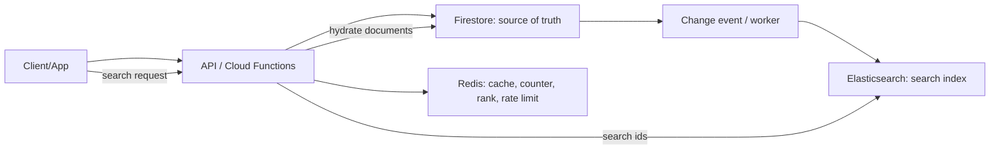

주의할 점은 **동기화 지연과 이중 저장소 운영**입니다. Firestore -> Elasticsearch sync가 늦으면 검색 결과가 stale해질 수 있고, 삭제/권한 변경도 search index에 반영해야 합니다. 검색 결과에는 Firestore document id를 저장하고, 최종 권한 검사는 Firestore/API 계층에서 다시 수행하는 편이 안전합니다.

### pgvector 소개와 장단점

pgvector는 PostgreSQL 안에서 embedding vector를 저장하고 similarity search를 수행하게 해주는 확장입니다. `vector`, `halfvec`, `bit`, `sparsevec` 타입을 제공하고, L2 distance, inner product, cosine distance 등을 지원합니다.

예시:

```sql
CREATE TABLE items (
  id bigserial PRIMARY KEY,
  title text,
  embedding vector(1536)
);

SELECT *
FROM items
ORDER BY embedding <=> '[0.1, 0.2, ...]'::vector
LIMIT 10;
```

| 장점 | 설명 |
| --- | --- |
| 데이터 통합 | user, document, permission, embedding을 PostgreSQL 한 곳에서 관리 |
| SQL 결합 | `WHERE org_id = ...` 같은 관계형 필터와 vector search 결합 |
| 트랜잭션/백업 | PostgreSQL의 ACID, backup, replication, monitoring 활용 |
| 인덱스 선택 | exact search, HNSW, IVFFlat 지원 |
| RAG MVP에 적합 | 별도 vector DB 없이 빠르게 시작 가능 |

| 단점 | 설명 |
| --- | --- |
| 대규모 ANN 전문성 | 초대규모 vector only workload는 전용 vector DB/검색엔진이 유리할 수 있음 |
| 인덱스 튜닝 필요 | HNSW/IVFFlat은 speed-recall-memory trade-off 조정 필요 |
| 메모리/빌드 비용 | HNSW는 성능이 좋지만 build time과 memory 사용량이 큼 |
| 차원 제한 | `vector`는 문서 기준 최대 2,000 dimensions, `halfvec`는 4,000 dimensions |
| 운영 영향 | 같은 PostgreSQL에 OLTP와 vector workload가 섞이면 리소스 격리 필요 |

### 선택 가이드

| 상황 | 추천 |
| --- | --- |
| 시작하는 SaaS 백엔드, 데이터 관계가 명확함 | PostgreSQL + ORM |
| Firebase 기반 모바일 앱, 실시간/오프라인이 핵심 | Firestore |
| Firestore 앱에 검색이 중요 | Firestore + Elasticsearch/Algolia/Typesense, 또는 Enterprise Pipeline Search 검토 |
| AWS serverless 초대규모 이벤트성 서비스 | DynamoDB |
| 로컬-first 앱/CLI/테스트 DB | SQLite |
| 읽기 부하와 랭킹/카운터가 문제 | Redis 추가 |
| RAG/문서 검색을 기존 relational 데이터와 같이 운영 | PostgreSQL + pgvector |
| 검색 품질/오타/동의어/랭킹이 제품 핵심 | Elasticsearch 또는 전문 search SaaS |

### 근거 URL

- Cloud Firestore data model: https://firebase.google.com/docs/firestore/data-model
- Cloud Firestore query limitations: https://cloud.google.com/firestore/docs/query-data/queries
- Cloud Firestore index overview: https://firebase.google.com/docs/firestore/query-data/index-overview
- Firestore full-text search solution note: https://firebase.google.com/docs/firestore/solutions/search
- Firestore Pipeline operations GA blog, 2026-04-27: https://firebase.blog/posts/2026/04/firestore-pipelines-ga
- Firestore Enterprise edition modes: https://firebase.google.com/docs/firestore/enterprise/overview-enterprise-edition-modes
- Amazon DynamoDB introduction: https://docs.aws.amazon.com/amazondynamodb/latest/developerguide/Introduction.html
- PostgreSQL about: https://www.postgresql.org/about/
- MySQL 8.4 Reference Manual: https://dev.mysql.com/doc/mysql/en/
- SQLite appropriate uses: https://www.sqlite.org/whentouse.html
- SQLite serverless: https://www.sqlite.org/serverless.html
- Redis data types: https://redis.io/docs/latest/develop/data-types/
- Redis persistence: https://redis.io/docs/latest/operate/oss_and_stack/management/persistence/
- Elasticsearch reference: https://www.elastic.co/guide/en/elasticsearch/reference/current/index.html
- Elasticsearch full-text search: https://www.elastic.co/guide/en/elasticsearch/reference/current/full-text-search.html
- pgvector README: https://github.com/pgvector/pgvector
- SQLAlchemy ORM: https://docs.sqlalchemy.org/20/orm/
- Prisma ORM: https://docs.prisma.io/docs/orm

### 사실 / 추정 / 검증필요

| 분류 | 내용 |
| --- | --- |
| 사실 | Firestore는 문서/컬렉션 기반 NoSQL DB이며, Standard/Core query는 index 기반 query 제약을 가진다 |
| 사실 | 2026-04-27 Firebase 공식 블로그는 Firestore Enterprise Pipeline에 full-text search, geospatial, subquery JOIN, DML 추가를 설명한다 |
| 사실 | DynamoDB 공식 문서는 JOIN 미지원과 denormalization 권장을 명시한다 |
| 사실 | SQLite 공식 문서는 SQLite가 client/server DB와 다른 문제를 풀며 local storage에 강하다고 설명한다 |
| 사실 | Redis 공식 문서는 Redis를 data structure server로 설명하고 RDB/AOF persistence trade-off를 명시한다 |
| 사실 | pgvector 공식 README는 exact/approximate nearest neighbor, HNSW/IVFFlat, vector dimension 제한을 설명한다 |
| 추정 | 사용자는 HhdStock 같은 앱/서비스 개발에서 어떤 DB를 조합할지 판단하려는 것으로 해석함 |
| 검증필요 | 실제 선택은 예상 QPS, read/write 비율, 검색 품질 요구, cloud provider, 팀 운영 역량으로 다시 좁혀야 함 |

## 005. 간단한 CNN/Transformer 모델 파라미터 수 계산

### 질문

> 간단한 cnn, transformer 모델을 상정하고 이의 파라미터 갯수를 계산하는 과정을 보이시오

### 핵심 공식

| 레이어 | 학습 파라미터 수 |
| --- | --- |
| Conv2D | `(kernel_h * kernel_w * in_channels * out_channels) + out_channels` |
| BatchNorm2D | `2 * channels`, 보통 gamma/beta만 trainable |
| Linear/Dense | `(in_features * out_features) + out_features` |
| Embedding | `vocab_size * hidden_dim` |
| LayerNorm | `2 * hidden_dim`, gamma/beta |
| Self-Attention | Q,K,V,O projection 기준 `4 * hidden_dim^2 + 4 * hidden_dim` |
| Transformer FFN | `hidden_dim * ffn_dim + ffn_dim + ffn_dim * hidden_dim + hidden_dim` |

Conv/Linear의 `+ out_channels`, `+ out_features`는 bias를 쓰는 경우입니다. `bias=False`라면 빼면 됩니다.

### Conv2D, BatchNorm2D, LayerNorm, Attention, FFN 상세

#### Conv2D 파라미터 계산 상세

Conv2D의 입력이 PyTorch 관례로 `N x C_in x H x W`라고 하겠습니다.

| 기호 | 의미 |
| --- | --- |
| `N` | batch size |
| `C_in` | 입력 채널 수. RGB 이미지는 보통 3 |
| `H, W` | 입력 feature map의 높이/너비 |
| `C_out` | 출력 채널 수, 즉 filter 개수 |
| `K_h, K_w` | convolution kernel 높이/너비 |

Conv2D는 출력 채널 하나를 만들기 위해 `C_in`개의 입력 채널을 모두 보는 filter bank를 하나 가집니다.

```text
출력 채널 1개를 위한 weight 수
= kernel_h * kernel_w * in_channels
```

출력 채널이 `C_out`개면 이런 filter bank가 `C_out`개 필요합니다.

```text
전체 weight 수
= kernel_h * kernel_w * in_channels * out_channels
```

여기에 bias를 쓰면, bias는 출력 픽셀마다 따로 있는 것이 아니라 **출력 채널마다 1개**입니다. 같은 output channel의 모든 위치에 같은 bias가 더해집니다.

```text
전체 bias 수
= out_channels
```

따라서 일반 Conv2D 파라미터 수는:

$$
K_h \times K_w \times C_{in} \times C_{out} + C_{out}
$$

예: `Conv2d(in_channels=3, out_channels=16, kernel_size=3, bias=True)`

$$
3 \times 3 \times 3 \times 16 = 432
$$

$$
bias = 16
$$

$$
total = 432 + 16 = 448
$$

중요한 점은 Conv2D 파라미터 수가 `H, W`에 직접 비례하지 않는다는 것입니다. 같은 kernel을 이미지 전체 위치에 공유하기 때문입니다. 그래서 `32x32` 이미지든 `224x224` 이미지든, 같은 `3x3, 3->16` conv라면 학습 파라미터 수는 448개입니다. 다만 연산량은 위치 수가 많아질수록 증가합니다.

`groups`가 있는 grouped convolution은 입력 채널을 그룹으로 나누므로 공식이 바뀝니다.

$$
K_h \times K_w \times \frac{C_{in}}{groups} \times C_{out} + C_{out}
$$

Depthwise convolution은 보통 `groups = C_in`, `C_out = C_in * multiplier` 형태라 파라미터가 크게 줄어듭니다.

#### BatchNorm2D 자체 설명과 파라미터 계산

BatchNorm2D는 Conv2D 뒤에서 자주 쓰는 정규화 레이어입니다. 입력 shape가 `N x C x H x W`일 때, **채널별로** 평균과 분산을 계산합니다.

Training 중에는 각 채널 `c`에 대해 batch와 공간 위치 전체에서 평균/분산을 계산합니다.

$$
\mu_c = mean(x_{:,c,:,:})
$$

$$
\sigma_c^2 = var(x_{:,c,:,:})
$$

그 다음 각 값을 정규화합니다.

$$
\hat{x}_{n,c,h,w} =
\frac{x_{n,c,h,w} - \mu_c}{\sqrt{\sigma_c^2 + \epsilon}}
$$

정규화만 하면 출력의 평균이 0, 분산이 1에 묶입니다. 그런데 모델이 필요하면 원래 scale/shift를 다시 배울 수 있어야 하므로 learnable affine parameter를 둡니다.

$$
y_{n,c,h,w} = \gamma_c \hat{x}_{n,c,h,w} + \beta_c
$$

여기서:

| 항목 | 개수 | trainable 여부 |
| --- | ---: | --- |
| `gamma` 또는 `weight` | `C` | trainable |
| `beta` 또는 `bias` | `C` | trainable |
| `running_mean` | `C` | trainable 아님, buffer |
| `running_var` | `C` | trainable 아님, buffer |

따라서 `affine=True`인 일반 BatchNorm2D의 학습 파라미터 수는:

$$
2 \times C
$$

예: `BatchNorm2d(num_features=16)`

$$
gamma = 16,\quad beta = 16
$$

$$
total = 32
$$

`running_mean`, `running_var`도 저장은 되지만 optimizer가 gradient로 학습하는 값이 아닙니다. 이 값들은 학습 중 batch 통계를 이동평균으로 누적해두었다가 inference/eval 모드에서 사용합니다.

```text
training mode:
현재 mini-batch의 mean/var로 정규화
running_mean/running_var 업데이트

eval mode:
저장된 running_mean/running_var로 정규화
gamma/beta는 그대로 사용
```

Conv 뒤에 BatchNorm이 바로 오면 Conv의 bias를 `False`로 두는 경우가 많습니다. Conv bias가 더해져도 BatchNorm의 평균 빼기 단계에서 상당 부분 상쇄되고, BatchNorm의 `beta`가 shift 역할을 다시 할 수 있기 때문입니다.

#### LayerNorm 자체 설명과 파라미터 계산

LayerNorm은 Transformer에서 매우 자주 쓰는 정규화입니다. BatchNorm과 가장 큰 차이는 **batch 방향으로 통계를 내지 않는다**는 점입니다.

Transformer에서 입력 shape를 `B x L x D`라고 하겠습니다.

| 기호 | 의미 |
| --- | --- |
| `B` | batch size |
| `L` | sequence length |
| `D` | hidden_dim, d_model |

`LayerNorm(normalized_shape=D)`는 각 sample의 각 token마다 마지막 차원 `D`개 feature를 기준으로 평균/분산을 계산합니다.

$$
\mu_{b,l} = mean(x_{b,l,:})
$$

$$
\sigma_{b,l}^2 = var(x_{b,l,:})
$$

정규화 후 gamma/beta를 적용합니다.

$$
y_{b,l,d} =
\gamma_d
\frac{x_{b,l,d} - \mu_{b,l}}{\sqrt{\sigma_{b,l}^2 + \epsilon}}
+ \beta_d
$$

`hidden_dim = D`이면:

| 항목 | 개수 |
| --- | ---: |
| `gamma` | `D` |
| `beta` | `D` |
| 총합 | `2 * D` |

예: `LayerNorm(512)`

$$
512 + 512 = 1,024
$$

LayerNorm은 BatchNorm과 달리 running mean/variance를 보통 두지 않습니다. training/eval 모두 현재 입력의 마지막 차원 통계로 정규화합니다. 그래서 batch size가 작거나 sequence length가 가변적인 Transformer 계열에서 쓰기 좋습니다.

주의: `LayerNorm(normalized_shape=(C,H,W))`처럼 여러 차원을 정규화 대상으로 잡으면 gamma/beta도 그 shape 전체만큼 생깁니다.

$$
params = 2 \times C \times H \times W
$$

#### Self-Attention의 Q, K, V, O projection 파라미터 계산

Transformer 입력을 `X`, shape를 `B x L x D`라고 하겠습니다.

| 기호 | 의미 |
| --- | --- |
| `B` | batch size |
| `L` | sequence length |
| `D` | hidden_dim, d_model |
| `H` | attention head 수 |
| `d_head` | head 하나의 차원, 보통 `D / H` |

Self-Attention은 같은 입력 `X`로부터 Query, Key, Value를 만듭니다.

$$
Q = XW_Q + b_Q
$$

$$
K = XW_K + b_K
$$

$$
V = XW_V + b_V
$$

가장 흔한 구현에서 각 projection은 `D -> D` 선형변환입니다.

| projection | weight shape | bias shape | 파라미터 수 |
| --- | --- | --- | ---: |
| Q | `D x D` | `D` | `D^2 + D` |
| K | `D x D` | `D` | `D^2 + D` |
| V | `D x D` | `D` | `D^2 + D` |

Q/K/V 합계:

$$
3D^2 + 3D
$$

Attention score와 weighted sum 자체는 학습 파라미터가 아닙니다.

$$
Attention(Q,K,V) =
softmax(\frac{QK^T}{\sqrt{d_{head}}})V
$$

Multi-head에서는 `D` 차원을 `H`개 head로 쪼갭니다.

$$
d_{head} = \frac{D}{H}
$$

head 수가 늘어도 보통 총 projection 크기는 `D -> D`로 유지됩니다. 즉, head마다 `D -> d_head` projection을 갖는다고 생각하면:

$$
H \times D \times d_{head}
= H \times D \times \frac{D}{H}
= D^2
$$

그래서 head 수가 직접 파라미터를 `H`배로 만들지는 않습니다.

각 head 결과를 concat하면 다시 `D`차원이 되고, 마지막에 output projection을 한 번 더 거칩니다.

$$
O = concat(head_1,\dots,head_H)W_O + b_O
$$

| projection | weight shape | bias shape | 파라미터 수 |
| --- | --- | --- | ---: |
| O | `D x D` | `D` | `D^2 + D` |

따라서 Q,K,V,O projection 전체는:

$$
(3D^2 + 3D) + (D^2 + D)
= 4D^2 + 4D
$$

예: `D = 512`, `num_heads = 8`

$$
4 \times 512^2 + 4 \times 512
= 1,048,576 + 2,048
= 1,050,624
$$

여기서 sequence length `L`은 파라미터 수에는 영향을 주지 않습니다. 대신 attention score matrix가 대략 `L x L`이라 연산량과 메모리 사용량에 큰 영향을 줍니다.

#### Transformer FFN 파라미터 계산

Transformer FFN은 position-wise feed-forward network입니다. 각 token 위치에 같은 MLP를 독립적으로 적용합니다.

입력 shape가 `B x L x D`이면:

```text
FFN:
Linear1: D -> D_ff
Activation: ReLU/GELU/SwiGLU 등
Linear2: D_ff -> D
```

기본 FFN 공식은 다음과 같습니다.

$$
FFN(x) = activation(xW_1 + b_1)W_2 + b_2
$$

첫 번째 Linear:

$$
W_1: D \times D_{ff},\quad b_1: D_{ff}
$$

$$
params_1 = D \times D_{ff} + D_{ff}
$$

두 번째 Linear:

$$
W_2: D_{ff} \times D,\quad b_2: D
$$

$$
params_2 = D_{ff} \times D + D
$$

전체:

$$
D \times D_{ff} + D_{ff} + D_{ff} \times D + D
$$

정리하면:

$$
2DD_{ff} + D_{ff} + D
$$

예: `D = 512`, `D_ff = 2048`

$$
512 \times 2048 + 2048 = 1,050,624
$$

$$
2048 \times 512 + 512 = 1,049,088
$$

$$
total = 2,099,712
$$

FFN도 sequence length `L`에 따라 파라미터가 늘지는 않습니다. 같은 Linear weight를 모든 token 위치에 공유하기 때문입니다. 하지만 연산량은 token 수 `L`에 비례해서 증가합니다.

요즘 LLM에서 쓰는 SwiGLU/GEGLU 같은 gated FFN은 첫 projection이 두 갈래가 되는 경우가 많아 vanilla FFN보다 파라미터 수가 달라집니다. 예를 들어 `D -> D_ff` 두 개와 `D_ff -> D` 하나를 쓰면 대략 `3DD_ff` 규모가 됩니다.

### 예제 1: 작은 CNN

전제:

- 입력 이미지: `32 x 32 x 3`
- 분류 클래스: `10`
- Conv는 `3x3`, padding으로 공간 크기 유지
- MaxPool은 `2x2`, 파라미터 없음
- bias 사용

모델:

```text
Input: 32x32x3
Conv1: 3x3, in=3, out=16
MaxPool: 2x2
Conv2: 3x3, in=16, out=32
MaxPool: 2x2
Flatten
FC1: 2048 -> 128
FC2: 128 -> 10
```

#### 출력 크기 흐름

| 단계 | 출력 shape | 파라미터 |
| --- | --- | ---: |
| Input | `32 x 32 x 3` | 0 |
| Conv1 | `32 x 32 x 16` | `3*3*3*16 + 16 = 448` |
| MaxPool | `16 x 16 x 16` | 0 |
| Conv2 | `16 x 16 x 32` | `3*3*16*32 + 32 = 4,640` |
| MaxPool | `8 x 8 x 32` | 0 |
| Flatten | `8*8*32 = 2,048` | 0 |
| FC1 | `128` | `2048*128 + 128 = 262,272` |
| FC2 | `10` | `128*10 + 10 = 1,290` |

총 파라미터:

$$
448 + 4,640 + 262,272 + 1,290 = 268,650
$$

만약 Conv 뒤에 BatchNorm을 붙이면:

$$
BN = 2 \times 16 + 2 \times 32 = 96
$$

그러면 trainable parameter는:

$$
268,650 + 96 = 268,746
$$

### 예제 2: 작은 Transformer Encoder

전제:

- Encoder-only Transformer
- `vocab_size = 30,000`
- `max_position = 512`
- `hidden_dim = d_model = 512`
- `num_heads = 8`
- `ffn_dim = 2048`
- `num_layers = 6`
- 분류 클래스 `10`
- token embedding과 output LM head는 연결하지 않고, 여기서는 classification head만 사용

중요한 점:

Multi-head attention에서 head 수가 8개여도 파라미터 수는 보통 `hidden_dim` 기준으로 계산합니다. 각 head의 차원이 `d_head = d_model / num_heads`로 쪼개질 뿐, Q/K/V 전체 projection의 총 크기는 여전히 `d_model x d_model`입니다.

#### Embedding

Token embedding:

$$
30,000 \times 512 = 15,360,000
$$

Position embedding:

$$
512 \times 512 = 262,144
$$

Embedding 합계:

$$
15,360,000 + 262,144 = 15,622,144
$$

#### Encoder layer 1개

Self-Attention의 Q, K, V, O projection:

$$
Q = 512 \times 512 + 512 = 262,656
$$

Q/K/V/O가 4개 있으므로:

$$
4 \times 262,656 = 1,050,624
$$

FFN:

$$
512 \times 2048 + 2048 = 1,050,624
$$

$$
2048 \times 512 + 512 = 1,049,088
$$

$$
FFN = 1,050,624 + 1,049,088 = 2,099,712
$$

LayerNorm 2개:

$$
2 \times (2 \times 512) = 2,048
$$

Encoder layer 1개 합계:

$$
1,050,624 + 2,099,712 + 2,048 = 3,152,384
$$

Encoder 6층:

$$
3,152,384 \times 6 = 18,914,304
$$

Classification head:

$$
512 \times 10 + 10 = 5,130
$$

전체 합계:

$$
15,622,144 + 18,914,304 + 5,130 = 34,541,578
$$

### Transformer 계산 요약표

| 구성 | 파라미터 수 |
| --- | ---: |
| Token embedding | 15,360,000 |
| Position embedding | 262,144 |
| Encoder layer 1개 | 3,152,384 |
| Encoder layer 6개 | 18,914,304 |
| Classification head | 5,130 |
| 총합 | 34,541,578 |

### 자주 헷갈리는 점

| 항목 | 설명 |
| --- | --- |
| Attention head 수 | head 수 자체가 파라미터를 곱절로 만들지는 않음. `d_model`을 여러 head로 나눌 뿐 |
| Activation/ReLU/GELU | 학습 파라미터 없음 |
| Dropout | 학습 파라미터 없음 |
| Pooling | 학습 파라미터 없음 |
| LayerNorm/BatchNorm | gamma/beta는 trainable, running mean/var는 보통 trainable parameter로 세지 않음 |
| LM head | 언어모델이면 `hidden_dim * vocab_size`가 추가될 수 있음. embedding tying을 쓰면 추가량이 줄어듦 |

### 근거

이 항목은 표준 딥러닝 레이어의 파라미터 계산식과 PyTorch 공식 문서의 parameter shape 설명을 기준으로 정리했습니다.

- PyTorch Conv2d: https://docs.pytorch.org/docs/stable/generated/torch.nn.Conv2d.html
- PyTorch BatchNorm2d: https://docs.pytorch.org/docs/stable/generated/torch.nn.BatchNorm2d.html
- PyTorch LayerNorm: https://docs.pytorch.org/docs/stable/generated/torch.nn.LayerNorm.html
- PyTorch MultiheadAttention: https://docs.pytorch.org/docs/stable/generated/torch.nn.MultiheadAttention.html
- PyTorch TransformerEncoderLayer: https://docs.pytorch.org/docs/stable/generated/torch.nn.TransformerEncoderLayer.html
- Attention Is All You Need: https://arxiv.org/abs/1706.03762

## 006. ARM과 Intel 명령어 차이, ARM 버전별 차이

### 질문

> arm, intel 명령어 차이점 장단덤
> arm 의 버전별 명령어 차이점 장단점

### 먼저 구분할 것

`ARM vs Intel`이라고 말할 때 보통은 아래 두 층위가 섞입니다.

| 층위 | 의미 |
| --- | --- |
| ISA | 명령어 집합. 예: Arm A64, x86-64 |
| Microarchitecture | 실제 CPU 구현. 예: Cortex-A78, Apple M-series, Intel Core, Xeon |

성능/전력은 ISA만으로 결정되지 않습니다. 같은 Arm ISA라도 Apple M-series와 저전력 Cortex-A 코어는 전혀 다르고, 같은 x86-64라도 Intel Atom 계열과 고성능 Core/Xeon 계열은 다릅니다.

### ARM vs Intel/x86 명령어 차이

| 구분 | ARM/AArch64 | Intel x86-64 |
| --- | --- | --- |
| 전통적 분류 | RISC 계열 | CISC 계열 |
| 명령어 길이 | A64는 고정 32-bit instruction | x86은 variable length instruction |
| 메모리 접근 | load/store 구조가 강함. 연산은 주로 register에서 수행 | 많은 산술/논리 명령이 memory operand를 직접 다룰 수 있음 |
| 레지스터 | AArch64는 31개 64-bit general-purpose register | x86-64는 16개 general-purpose register, APX 등 확장 흐름 존재 |
| 디코딩 | 고정 길이라 디코더 설계가 비교적 단순 | 가변 길이/legacy prefix 때문에 디코딩 복잡 |
| 호환성 | AArch32 호환은 구현/OS 정책에 따라 달라짐 | 긴 x86 backward compatibility가 강점 |
| SIMD/벡터 | Neon, SVE/SVE2, SME | SSE, AVX, AVX2, AVX-512, AVX10 |
| 생태계 | 모바일/임베디드/서버/Apple Silicon에서 강함 | PC/서버/워크스테이션 소프트웨어 호환성 강함 |

### 장단점

| 항목 | ARM 장점 | ARM 단점 |
| --- | --- | --- |
| 전력/면적 | 단순한 명령어 인코딩과 SoC 통합 생태계로 저전력 설계에 유리 | 고성능 구현은 결국 큰 코어/캐시/복잡한 예측기가 필요 |
| 명령어 디코딩 | A64 고정 32-bit라 decode가 단순 | 코드 밀도는 Thumb/T32를 제외하면 x86 가변 길이에 비해 불리할 수 있음 |
| 라이선스/제품화 | Arm IP 라이선스로 다양한 벤더가 SoC 설계 가능 | 플랫폼 파편화와 optional extension 차이 확인 필요 |
| 보안 확장 | PAC, BTI, MTE, RME 등 현대 보안 기능 흐름이 강함 | 구형 기기 호환성/지원 여부 확인 필요 |

| 항목 | Intel/x86 장점 | Intel/x86 단점 |
| --- | --- | --- |
| 호환성 | 기존 PC/서버 바이너리 생태계가 매우 큼 | legacy 유지 비용이 큼 |
| 고성능 | 고성능 단일 스레드, AVX 계열 벡터 연산, 서버 기능 강함 | 명령어 decode/전력/발열 부담이 커질 수 있음 |
| 개발/운영 | 툴, 드라이버, 운영 노하우, 가상화 생태계 성숙 | 모바일/초저전력 영역에서는 Arm 생태계가 더 강함 |
| ISA 확장 | AVX/AVX-512/AVX10/APX 등 고성능 확장 풍부 | CPU 세대별 지원 확장을 runtime dispatch로 확인해야 함 |

### ARM 명령어 집합 이름 정리

| 이름 | 의미 |
| --- | --- |
| AArch32 | 32-bit execution state |
| AArch64 | 64-bit execution state |
| A32 | 전통적 32-bit Arm instruction set |
| T32 | Thumb-2 instruction set. 16/32-bit 혼합 인코딩 |
| A64 | AArch64에서 쓰는 64-bit execution state용 instruction set. 명령어 길이는 고정 32-bit |

### ARM 버전별 큰 흐름

아래 표는 앱/서버 개발에서 자주 만나는 A-profile 중심 요약입니다.

| 버전 | 핵심 명령어/기능 변화 | 장점 | 단점/주의 |
| --- | --- | --- | --- |
| Armv6 계열 | 32-bit 중심, 제한적 SIMD/미디어 성격 기능 | 매우 오래된 임베디드/저전력 기기 호환 | 현대 앱/서버 기준 성능/보안/SIMD 부족 |
| Armv7-A | A32/T32, Thumb-2, VFP/NEON 선택적 활용 | 32-bit 모바일 시대의 주력, 코드 밀도와 성능 균형 | 4GB 주소 공간 한계, 64-bit 앱 불가, NEON은 구현별 확인 필요 |
| Armv8-A | AArch64/A64 도입, AArch32 호환 상태 제공 | 64-bit 주소 공간, 31개 GPR, 현대 OS/서버/모바일 기반 | 32-bit legacy와 64-bit 코드가 공존하면 ABI/배포 복잡 |
| Armv8.1-A | AArch64 atomic memory access, VHE, PAN | 멀티코어 동기화와 가상화/보안 개선 | 실제 CPU 지원 feature register 확인 필요 |
| Armv8.2-A | 52-bit address, FP16, RAS mandatory | 서버/AI/대용량 메모리/half precision에 유리 | 모든 소프트웨어가 자동 활용하는 것은 아님 |
| Armv8.3-A | Pointer Authentication, nested virtualization | ROP/JOP류 공격 완화, 가상화 개선 | PAC를 활용하려면 OS/compiler/toolchain 지원 필요 |
| Armv8.4-A | Secure virtualization, SHA3/SHA512, MPAM 등 | 서버 보안/가상화/암호화 워크로드 개선 | 기능별 optional/mandatory 여부 확인 필요 |
| Armv8.5-A | MTE, BTI | 메모리 안전성 버그 탐지와 indirect branch 보호 | MTE/BTI는 하드웨어, OS, compiler 옵션이 함께 필요 |
| Armv8.6-A | BF16, matrix multiply 계열 | ML 추론/학습성 연산 가속 | 대상 CPU가 지원해야 하며 fallback 필요 |
| Armv8.7-A / v9.2-A | 64-byte atomic load/store 등 accelerator 연동 기능 | 고성능 producer-consumer/accelerator queue에 유리 | 일반 앱에서는 직접 체감이 작을 수 있음 |
| Armv9-A | Armv8-A의 확장 흐름, SVE2/SME, MTE/PAC/BTI/RME 등 현대 기능 강화 | AI/HPC/보안/기밀컴퓨팅 방향 강화 | v9라고 모든 extension이 항상 동일하게 구현되는 것은 아님 |

Arm 공식 문서는 현재 A-profile 최신 버전을 Armv9.4-A와 Armv8.9-A로 안내합니다. Armv9-A는 Armv8-A의 단절이 아니라 "Armv8-A에 대한 확장 세트"로 설명됩니다.

### 실무에서 확인해야 할 것

컴파일/배포에서는 "CPU가 Arm이냐 Intel이냐"보다 아래를 확인해야 합니다.

| 확인 항목 | 예 |
| --- | --- |
| ABI | `x86_64`, `arm64`, `armeabi-v7a`, `aarch64` |
| ISA baseline | `armv8-a`, `armv8.2-a`, `x86-64-v2`, `x86-64-v3` |
| SIMD 지원 | Neon, SVE, AVX2, AVX-512 |
| OS 지원 | Windows on Arm, Linux aarch64, macOS arm64 |
| 런타임 dispatch | CPU feature detect 후 최적화 경로 선택 |

### 근거 URL

- Arm A-profile architecture: https://www.arm.com/architecture/cpu/a-profile
- Arm A64 Instruction Set Architecture guide: https://documentation-service.arm.com/static/68cd1a81cccf2a5517018d62
- Introducing the Arm architecture: https://developer.arm.com/-/media/Arm%20Developer%20Community/PDF/Learn%20the%20Architecture/Introducing%20the%20Arm%20architecture.pdf
- Understanding the Armv8.x extensions: https://developer.arm.com/-/media/Arm%20Developer%20Community/PDF/Learn%20the%20Architecture/Understanding%20the%20Armv8.x%20extensions.pdf
- Intel 64 and IA-32 Architectures Software Developer Manuals: https://www.intel.com/content/www/us/en/developer/articles/technical/intel-sdm.html
- Arm Memory Tagging Extension article: https://newsroom.arm.com/memory-safety-arm-memory-tagging-extension
- Arm PAC/BTI article: https://newsroom.arm.com/blog/pac-bti

### 사실 / 추정 / 검증필요

| 분류 | 내용 |
| --- | --- |
| 사실 | Arm 공식 문서는 Armv8-A가 AArch64/AArch32 실행 상태를 도입하고, AArch64가 A64 instruction set을 사용한다고 설명함 |
| 사실 | Arm 공식 문서는 A64가 고정 길이 32-bit instruction set이라고 설명함 |
| 사실 | Intel 공식 SDM은 Intel 64/IA-32의 instruction format과 instruction reference를 별도 volume에서 다룸 |
| 사실 | Arm 공식 문서는 최신 A-profile 버전을 Armv9.4-A와 Armv8.9-A로 안내함 |
| 추정 | 사용자의 질문 의도는 컴파일 타겟/성능/배포 관점의 ISA 비교로 판단함 |
| 검증필요 | 특정 CPU에서 어떤 명령을 쓸 수 있는지는 `lscpu`, `sysctl`, CPUID, HWCAP 등 runtime feature 확인 필요 |

## 007. Google Meet/WebRTC 멀티 참가자 대역폭 관리

### 질문

> 구글밋 같은 WebRTC 제품에서 멀티세션간 대역폭은 어떻게 관리되는가?
> 발화자에게 대역폭을 더 할당하는가?
> 내 목소리는 왜 나에게 다시 들리지는 않는것인가?
> 서울과 뉴욕 2개의 사무실에 5명씩 총 10명이 구글밋을 진행하는 상황이라면 대역폭 배분을 어떻게 하는 것인가?

### 핵심 결론

Google Meet 같은 대규모 WebRTC 회의 제품은 보통 **브라우저끼리 10명이 전부 직접 연결되는 mesh**가 아니라, 각 참가자가 Google의 media server/SFU 계층에 연결하고 서버가 필요한 미디어만 선택적으로 전달하는 구조로 보는 것이 맞습니다.

공식 문서가 Google Meet 내부 알고리즘을 세부 공개하지는 않지만, 공개 표준과 Google Meet 운영 문서로 확인 가능한 큰 원리는 다음과 같습니다.

- 각 참가자는 자기 uplink 상태에 맞춰 카메라 화질/프레임/비트레이트를 조절합니다.
- 각 참가자의 downlink는 보고 있는 레이아웃, active speaker, 화면공유, 네트워크 상태, 기기 성능에 따라 다르게 받습니다.
- 발화자/큰 타일/spotlight/화면공유는 더 높은 해상도 또는 우선순위를 받기 쉽습니다.
- 내 목소리는 보통 나에게 다시 전달하지 않습니다. 그리고 스피커 소리가 마이크로 다시 들어가는 것은 echo cancellation으로 줄입니다.

### P2P mesh와 SFU의 차이

10명이 모두 P2P mesh로 연결되면 각 참가자는 나머지 9명에게 자기 영상을 따로 보내야 합니다.

```text
P2P mesh:
각 참가자 uplink ~= 내 영상 9개 복제
각 참가자 downlink ~= 다른 사람 9명 수신
```

이 방식은 3~4명까지는 가능해도 10명 이상에서는 uplink, CPU, 배터리, NAT traversal이 부담됩니다.

Meet류 서비스는 일반적으로 아래처럼 동작한다고 이해하면 됩니다.

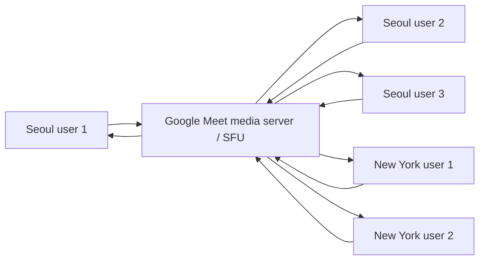

각 사용자는 **서버로 1회 송신**하고, 서버가 각 수신자에게 필요한 stream/layer만 골라 보냅니다.

### 대역폭은 누가 어떻게 조절하나

| 위치 | 역할 |
| --- | --- |
| 송신 클라이언트 | 카메라 영상을 네트워크 상태에 맞춰 bitrate/resolution/fps 조절 |
| 수신 클라이언트 | 현재 layout, 창 크기, CPU, downlink 상태에 맞춰 필요한 품질 요청/수신 |
| SFU/media server | 어떤 참가자의 어떤 품질 layer를 누구에게 보낼지 선택 |
| 네트워크 | Wi-Fi/AP/라우터/ISP 병목에서 packet loss, jitter, RTT가 발생하면 품질 저하 유발 |

WebRTC에서는 RTP/RTCP feedback, packet loss, RTT, jitter, congestion feedback, available bitrate 추정 등을 보고 bitrate를 조절합니다. Google Meet의 Meet Quality Tool도 packet loss, jitter, RTT, actual bitrate, available bitrate, network congestion 같은 값을 추적합니다.

### 발화자에게 대역폭을 더 할당하는가

대체로 **그렇다**고 보면 됩니다. 다만 "대역폭을 발화자 계정에 고정 배정한다"기보다, **수신자별 레이아웃에서 중요한 사람의 video layer를 더 높은 품질로 선택한다**에 가깝습니다.

RFC 8853의 simulcast 설명도 multiparty session에서 central node가 참가자별 view를 조절하고, 현재/이전 발화자를 forwarding 대상으로 고르는 active speaker selection이 흔하다고 설명합니다.

예:

| 참가자 상태 | 수신자에게 전달되는 경향 |
| --- | --- |
| 현재 발화자, 큰 타일 | 높은 해상도/높은 bitrate layer |
| 화면 공유 | 텍스트 가독성 때문에 우선순위 높음 |
| 작은 썸네일 | 낮은 해상도 layer |
| 화면 밖/숨김/네트워크 나쁨 | video pause 또는 매우 낮은 품질 |
| 오디오 | 모든 unmuted 참가자 오디오는 낮은 비트레이트로 유지하려는 경향 |

즉, **발화자에게 uplink를 더 준다**기보다는 **다른 사람들이 발화자의 고품질 stream을 더 자주 받는다**가 정확합니다. 발화자의 uplink 자체도 카메라 품질, network estimate, server 요청에 따라 올라갈 수 있습니다.

### 내 목소리는 왜 나에게 다시 들리지 않나

이유는 두 층입니다.

1. 애플리케이션 레벨에서 내 microphone track을 내 speaker에 재생하지 않습니다.
2. 서버/SFU도 보통 내 audio packet을 다시 나에게 forward하지 않습니다.

그래서 내 목소리는 원격 참가자에게만 갑니다. 다만 상대방 목소리가 내 스피커로 나오고 그 소리가 내 마이크로 다시 들어가면, 그건 상대방에게 echo로 들릴 수 있습니다. 이를 줄이려고 브라우저/OS/WebRTC stack은 echo cancellation, noise suppression, auto gain control을 사용합니다.

W3C Media Capture 문서의 `echoCancellation` 설명은 마이크 입력에서 재생 중인 소리를 제거하려는 처리를 echo cancellation이라고 설명합니다. `remote-only` 모드는 WebRTC `RTCPeerConnection`에서 온 원격 오디오를 제거하는 용도를 갖습니다.

### 서울 5명 + 뉴욕 5명 회의의 대역폭 계산

전제:

- 서울 사무실 5명, 뉴욕 사무실 5명
- 각자 노트북으로 같은 Google Meet에 참가
- 각 사용자는 Google media server에 직접 연결
- P2P mesh가 아니라 SFU 기반으로 추정

Google 공식 문서의 대규모 조직 평균값:

| 회의 타입 | 참가자당 outbound | 참가자당 inbound |
| --- | ---: | ---: |
| Video | 1 Mbps | 1.3 Mbps |
| Audio only | 12 Kbps | 18 Kbps |

대규모 조직 평균값으로 사무실별 계산:

| 사무실 | 참가자 수 | outbound 합계 | inbound 합계 |
| --- | ---: | ---: | ---: |
| 서울 | 5 | `5 * 1 = 5 Mbps` | `5 * 1.3 = 6.5 Mbps` |
| 뉴욕 | 5 | `5 * 1 = 5 Mbps` | `5 * 1.3 = 6.5 Mbps` |
| 전체 | 10 | `10 Mbps` | `13 Mbps` |

개인/소규모 기준 Google 공식값:

| 케이스 | outbound | inbound |
| --- | ---: | ---: |
| 1080p video | 최대 3.6 Mbps | 최대 3.6 Mbps |
| 720p video | 최대 1.7 Mbps | 최대 1.7 Mbps |
| Group meeting | 250 Kbps 이상 | 최대 4.0 Mbps |
| Audio only | 100 Kbps | 100 Kbps |

최대치에 가깝게 잡은 보수적 계산:

| 사무실 | 계산 | 필요 대역폭 |
| --- | --- | ---: |
| 서울 outbound | `5 * 1.7 Mbps` | 8.5 Mbps |
| 서울 inbound | `5 * 4.0 Mbps` | 20 Mbps |
| 뉴욕 outbound | `5 * 1.7 Mbps` | 8.5 Mbps |
| 뉴욕 inbound | `5 * 4.0 Mbps` | 20 Mbps |

하지만 실제로 항상 이 최대치를 쓰지는 않습니다. 이유는 다음과 같습니다.

- 모든 참가자의 영상을 720p로 동시에 받지 않음
- 작은 타일은 낮은 layer로 충분함
- 말하지 않는 참가자의 영상은 낮은 fps/bitrate가 될 수 있음
- 화면공유가 있으면 카메라보다 화면공유를 우선할 수 있음
- 네트워크가 나쁘면 Meet가 자동으로 video definition을 낮춤

### 같은 사무실 5명이 각자 노트북으로 들어갈 때 주의점

같은 회의실에 있는 5명이 각자 노트북으로 마이크/스피커를 켜면 음향 문제가 생기기 쉽습니다.

| 상황 | 문제 | 권장 |
| --- | --- | --- |
| 5명 모두 speaker on | 서로의 스피커 소리가 마이크에 재입력 | 헤드셋 사용 |
| 5명 모두 mic on | 같은 실제 발화가 여러 장치에서 들어감 | 한 장치만 mic on |
| 회의실 TV + 노트북 speaker | echo/feedback 가능 | 회의실 장비 하나만 audio 사용 |
| 같은 사무실 사람이 각자 참가 | 인터넷 대역폭은 5명분 사용 | 회의실 장비 1대 또는 companion mode 고려 |

서울 사무실 5명과 뉴욕 사무실 5명이 각각 한 회의실에 모여 있다면, 가장 효율적인 구성은 보통 **서울 회의실 장비 1대 + 뉴욕 회의실 장비 1대**입니다. 그러면 네트워크 관점에서는 10 endpoint가 아니라 2 endpoint 회의에 가까워져 대역폭과 음향 문제가 크게 줄어듭니다.

### 정리

| 질문 | 답 |
| --- | --- |
| 멀티 참가자 대역폭은 어떻게 관리? | 각 endpoint의 uplink/downlink 상태를 추정하고, SFU가 수신자별 stream/layer를 선택 |
| 발화자에게 더 할당? | 보통 active speaker/큰 타일/화면공유가 높은 품질을 받도록 우선순위가 올라감 |
| 내 목소리는 왜 안 들림? | 내 mic track을 로컬 speaker에 재생하지 않고, 서버도 보통 자기 audio를 다시 보내지 않음 |
| 서울 5명 + 뉴욕 5명은? | 각자 노트북이면 사무실별 평균 약 outbound 5 Mbps / inbound 6.5 Mbps, 보수적으로는 더 크게 잡음 |
| 같은 회의실이면? | 가능하면 회의실 장비 1대만 audio/video를 담당하게 하는 편이 좋음 |

### 근거 URL

- Google Meet network preparation and bandwidth requirements: https://support.google.com/a/answer/1279090
- Google Meet requirements and automatic quality adjustment: https://support.google.com/meet/answer/7317473
- Google Meet quality statistics: https://support.google.com/a/answer/9204857
- Google Meet Media API client metrics and WebRTC `getStats`: https://developers.google.com/workspace/meet/media-api/guides/metrics
- RFC 8853, Using Simulcast in SDP and RTP Sessions: https://www.rfc-editor.org/rfc/rfc8853
- RFC 8834, Media Transport and Use of RTP in WebRTC: https://www.rfc-editor.org/rfc/rfc8834
- RFC 8888, RTCP Feedback for Congestion Control: https://www.rfc-editor.org/rfc/rfc8888.html
- W3C Media Capture and Streams, `echoCancellation`: https://www.w3.org/TR/mediacapture-streams/

### 사실 / 추정 / 검증필요

| 분류 | 내용 |
| --- | --- |
| 사실 | Google Meet 공식 문서는 네트워크가 부족하면 video definition을 낮춘다고 설명함 |
| 사실 | Google Meet 공식 문서는 대규모 조직 평균 video 참가자당 outbound 1 Mbps, inbound 1.3 Mbps를 제시함 |
| 사실 | Google Meet Quality Tool은 packet loss, jitter, RTT, bitrate, available bitrate 등을 제공함 |
| 사실 | RFC 8853은 simulcast에서 중앙 노드가 참가자별 view를 조절하고 active speaker selection이 흔하다고 설명함 |
| 사실 | W3C Media Capture 문서는 echo cancellation을 마이크 입력에서 재생 중인 소리를 제거하려는 처리로 설명함 |
| 추정 | Google Meet은 내부 구현이 공개되지 않았으므로 세부 server/SFU layer 선택 정책은 WebRTC/SFU 표준 구조와 공식 bandwidth 문서에 기반한 추론임 |
| 검증필요 | 실제 사무실별 필요 대역폭은 회의 레이아웃, 화면공유, 카메라 해상도, Wi-Fi 품질, Meet 설정, 장비 성능으로 실측해야 함 |

## 008. Unity, Unreal Engine, NVIDIA Omniverse 비교

### 질문

> 유니티, 언리얼, nvidia 옴니버스의 소개, 차이점
> 그래픽스, 게임엔진, 물리환경, 렌더링, 성능, 품질, 개발생태계 면에 대한 비교

### 핵심 결론

Unity와 Unreal Engine은 **게임/인터랙티브 앱을 빌드해서 배포하는 런타임 엔진**입니다. NVIDIA Omniverse는 그 둘과 같은 의미의 게임엔진이라기보다 **OpenUSD, RTX, PhysX 기반의 산업용 3D/디지털 트윈/물리 AI 시뮬레이션 플랫폼 및 SDK/API 묶음**에 가깝습니다.

| 한 줄 선택 | 추천 |
| --- | --- |
| 모바일/인디/교육/2D/캐주얼/빠른 프로토타입 | Unity |
| AAA급 3D, 고품질 실시간 렌더링, 대규모 월드, 영화/버추얼 프로덕션 | Unreal Engine |
| 로봇/공장/자율주행/센서/디지털 트윈/산업 시뮬레이션, OpenUSD 파이프라인 | NVIDIA Omniverse |

### 제품 소개

| 제품 | 정체성 | 주 언어/개발 방식 | 대표 강점 |
| --- | --- | --- | --- |
| Unity | 2D/3D 게임 및 앱 개발 엔진 | C#, GameObject/Component, DOTS/ECS 선택 | 멀티플랫폼, 모바일, 빠른 개발, Asset Store, C# 생산성 |
| Unreal Engine | 고급 실시간 3D 제작/게임 엔진 | C++, Blueprint, Editor-first workflow | Lumen, Nanite, Chaos, AAA 그래픽스, 소스 코드 접근 |
| NVIDIA Omniverse | OpenUSD 기반 산업 시뮬레이션/디지털 트윈 플랫폼 | Python/C++/Kit/SDK/API, OpenUSD 중심 | RTX path tracing, PhysX, OpenUSD 상호운용, 로봇/센서/물리 AI |

### 큰 관계도

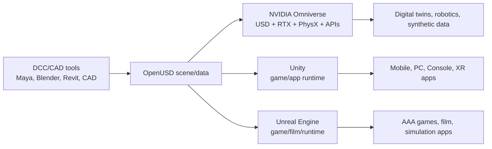

### 그래픽스 관점

| 비교 | Unity | Unreal Engine | NVIDIA Omniverse |
| --- | --- | --- | --- |
| 기본 방향 | 넓은 플랫폼 범위와 스타일 유연성 | 고품질 실시간 3D와 대형 월드 | 물리 기반 고충실도 시각화와 산업 데이터 |
| 렌더 파이프라인 | URP, HDRP, Built-in, Custom SRP | Deferred/Forward, Lumen, Nanite, Virtual Shadow Maps 등 | RTX Renderer, USD/MDL 기반 |
| 강한 영역 | 모바일, XR, 2D/3D 혼합, stylized graphics | photoreal, open world, high-end console/PC | CAD/공장/로봇/센서/대규모 scene 시각화 |
| 약한 영역 | 최고급 photoreal을 내려면 HDRP/툴링/커스텀 최적화 부담 | 모바일/저사양에서 UE5 고급 기능은 무거울 수 있음 | 일반 게임 플레이 제작 엔진으로는 부적합 |

Unity 공식 문서는 URP를 광범위한 플랫폼용 scalable graphics, HDRP를 high-end platform용 cutting-edge/high-fidelity graphics로 설명합니다. Unreal은 Nanite로 pixel-scale detail과 높은 object count를, Lumen으로 dynamic global illumination/reflection을 제공합니다. Omniverse RTX Renderer는 RTX GPU, USD, MDL 기반의 photoreal renderer이며 real-time 2.0과 interactive path tracing 모드를 제공합니다.

### 게임엔진 관점

| 비교 | Unity | Unreal Engine | NVIDIA Omniverse |
| --- | --- | --- | --- |
| 게임 런타임 | 매우 강함 | 매우 강함 | 주 목적 아님 |
| 에디터 워크플로 | 가볍고 빠른 편, C# 중심 | Editor 기능이 매우 풍부, Blueprint 강력 | Kit/Apps/SDK/API 중심 |
| 플랫폼 배포 | 모바일/PC/콘솔/XR/Web 등 폭넓음 | PC/콘솔/모바일/XR/영화/TV/건축 등 | 산업 앱/클라우드/워크스테이션/시뮬레이션 중심 |
| 초보 진입 | 상대적으로 쉬움 | 기능이 많아 초기 학습량 큼 | 게임 개발자보다 3D pipeline/시뮬레이션 개발자 대상 |
| 소스 코드 | 엔진 코어는 제한적 접근 | C++ 소스 접근 가능 | SDK/라이브러리/API 및 일부 GitHub/NGC 배포 |

### 물리환경 관점

| 비교 | Unity | Unreal Engine | NVIDIA Omniverse |
| --- | --- | --- | --- |
| 기본 물리 | Built-in 3D Physics는 NVIDIA PhysX 통합, 2D는 Box2D 계열 | Chaos Physics | NVIDIA PhysX, Warp, USD-native physics |
| 게임 물리 | Rigidbody, Collider, Joint 등 게임 친화적 | 파괴, vehicle, ragdoll, geometry collection 등 고급 게임/시네마 친화적 | 산업/로봇/센서/디지털 트윈 시뮬레이션 친화적 |
| 결정론/대규모 | DOTS/ECS, Unity Physics/Havok Physics 선택 | 네트워크/물리 결정론은 별도 설계 필요 | 시뮬레이션 정확도와 USD 데이터 중심 |
| 한계 | 기본 PhysX는 게임 물리용 근사. 과학/공학 정밀해석용은 아님 | Chaos도 게임/실시간 중심. 정밀 CAE 대체는 아님 | 실시간 앱/게임 로직 엔진으로 쓰기엔 무거운 워크플로 |

### 렌더링 품질과 성능

| 축 | Unity | Unreal Engine | Omniverse |
| --- | --- | --- | --- |
| 성능 철학 | 타깃 플랫폼별로 가볍게 조절 | high-end feature를 엔진이 강하게 제공 | NVIDIA GPU/RTX 가속을 전제로 고충실도 |
| 최고 품질 | HDRP + ray tracing/advanced lighting로 가능 | UE5 Lumen/Nanite/Virtual Shadow Maps로 매우 강함 | path tracing, multi-GPU, DLSS, sensor rendering 강함 |
| 모바일 | 매우 강함 | 가능하지만 UE5 고급 기능은 제한/튜닝 필요 | 일반 모바일 배포 엔진 아님 |
| 대규모 scene | DOTS/ECS/streaming으로 가능하나 설계 필요 | World Partition, Nanite, HLOD 등 강함 | OpenUSD 기반 대규모 산업 scene/협업에 강함 |
| 최적화 난이도 | 플랫폼별 수동 튜닝 많음 | 고급 기능은 강하지만 비용도 커서 프로파일링 필수 | RTX/데이터셋/클라우드/GPU 리소스 요구가 큼 |

### 개발 생태계

| 비교 | Unity | Unreal Engine | NVIDIA Omniverse |
| --- | --- | --- | --- |
| 언어 | C# 중심 | C++ + Blueprint | Python/C++/USD/Kit/API |
| 마켓/자산 | Asset Store 매우 큼 | Fab/Marketplace, Quixel/Megascans, MetaHuman 등 | OpenUSD ecosystem, connectors, NGC/GitHub assets |
| 팀 구성 | 소규모 팀/인디/모바일에 적합 | 테크니컬 아티스트, C++ 엔지니어, 대형 제작팀에 적합 | 시뮬레이션/로봇/데이터/산업 소프트웨어 팀에 적합 |
| 학습 자료 | 초보 친화 자료 풍부 | AAA/영화/대형 프로젝트 자료 풍부 | 산업/로봇/OpenUSD/RTX 중심 자료 |
| 라이선스 감각 | Unity 플랜/런타임 정책 확인 필요 | 게임은 매출 기준 royalty 구조 확인 필요 | 엔터프라이즈/SDK/API/클라우드/하드웨어 의존 확인 필요 |

### 장단점 요약

#### Unity

| 장점 | 단점 |
| --- | --- |
| C# 기반 생산성, 빠른 프로토타이핑 | 고급 렌더링은 URP/HDRP 선택과 asset 호환성 이슈가 있음 |
| 모바일/인디/교육/2D/XR 생태계 강함 | 대형 AAA급 3D 프로젝트는 엔진/툴 커스텀 부담이 커질 수 있음 |
| Asset Store와 학습 자료 풍부 | 프로젝트가 커지면 architecture와 performance discipline이 중요 |
| DOTS/ECS/Burst로 특정 대규모 시뮬레이션 최적화 가능 | DOTS는 학습 비용과 기존 GameObject workflow와의 혼합 난이도 있음 |

#### Unreal Engine

| 장점 | 단점 |
| --- | --- |
| 기본 그래픽 품질과 고급 렌더링 기능이 강함 | 초기 학습량과 에디터/빌드/툴체인 무게가 큼 |
| Nanite/Lumen/Chaos/World Partition 등 대형 3D 제작 기능이 잘 통합됨 | 모바일/저사양 타깃에서는 기능 제한과 최적화 부담 큼 |
| Blueprint로 디자이너/아티스트 협업이 좋고 C++ 소스 접근 가능 | C++ build iteration과 engine version migration 비용이 있을 수 있음 |
| 영화/버추얼 프로덕션/건축/자동차까지 생태계 확장 | 프로젝트 구조를 잘못 잡으면 복잡도가 빠르게 커짐 |

#### NVIDIA Omniverse

| 장점 | 단점 |
| --- | --- |
| OpenUSD 기반 데이터 상호운용과 산업 scene 통합에 강함 | 일반 게임 제작용 엔진으로 선택하기엔 부적합 |
| RTX path tracing, sensor rendering, PhysX 기반 시뮬레이션 강함 | NVIDIA GPU/드라이버/워크스테이션/클라우드 의존도가 큼 |
| 로봇, 자율주행, 공장 디지털 트윈, 합성데이터 생성에 적합 | Unity/Unreal 대비 대중적 게임 개발 커뮤니티는 작음 |
| Kit/SDK/API/microservice 방식으로 기존 산업 앱에 통합 가능 | Omniverse Launcher는 2025-10-01 deprecated되어 새 개발 흐름을 확인해야 함 |

### 선택 시나리오

| 프로젝트 | 추천 |
| --- | --- |
| 2D 모바일 게임, 캐주얼 게임, 빠른 MVP | Unity |
| 모바일 + WebGL + XR까지 폭넓게 배포 | Unity |
| AAA 3D 액션, 오픈월드, 고품질 PC/콘솔 게임 | Unreal Engine |
| 건축/영화/버추얼 프로덕션/실시간 시네마틱 | Unreal Engine |
| 공장 디지털 트윈, 로봇 시뮬레이션, 센서 데이터셋 생성 | Omniverse |
| CAD/3D DCC 데이터를 OpenUSD로 묶어 여러 툴과 협업 | Omniverse |
| Unity/Unreal 게임에서 산업 CAD 데이터를 일부 가져오고 싶음 | Unity/Unreal + USD/CAD 변환 파이프라인 |
| Omniverse scene을 앱으로 배포하고 싶음 | Omniverse Kit/Streaming/API 또는 Unreal/Unity 연동 검토 |

### 실무 판단 기준

| 질문 | Unity 쪽이면 | Unreal 쪽이면 | Omniverse 쪽이면 |
| --- | --- | --- | --- |
| 최종 산출물이 앱/게임인가? | 좋음 | 좋음 | 보통 아님 |
| 최고급 photoreal 품질이 핵심인가? | HDRP로 가능하지만 비용 있음 | 매우 적합 | 시뮬레이션/렌더링 품질에는 매우 적합 |
| 모바일 성능이 핵심인가? | 매우 적합 | 가능하나 기능 선별 필요 | 부적합 |
| CAD/공장/로봇/센서가 핵심인가? | 가능하나 직접 구축 많음 | 가능하나 직접 구축 많음 | 매우 적합 |
| 팀에 C# 개발자가 많은가? | 유리 | 보통 | 일부 Python/C++/USD 필요 |
| 팀에 C++/TA/렌더링 인력이 있는가? | 있으면 고급화 가능 | 매우 유리 | 매우 유리 |
| NVIDIA GPU 인프라를 전제로 할 수 있는가? | 선택 사항 | 선택 사항 | 사실상 핵심 전제 |

### 근거 URL

- Unity Engine official: https://unity.com/products/unity-engine
- Unity render pipelines: https://docs.unity.cn/6000.1/Documentation/Manual/render-pipelines.html
- Unity built-in 3D physics: https://docs.unity.cn/Manual/PhysicsOverview.html
- Unity ECS/DOTS: https://unity.com/ecs
- Unreal Engine official: https://www.unrealengine.com/
- Unreal Engine Nanite: https://dev.epicgames.com/documentation/unreal-engine/nanite-virtualized-geometry-in-unreal-engine
- Unreal Engine Lumen: https://dev.epicgames.com/documentation/en-us/unreal-engine/lumen-global-illumination-and-reflections-in-unreal-engine
- Unreal Engine Physics/Chaos: https://dev.epicgames.com/documentation/en-us/unreal-engine/physics-in-unreal-engine
- NVIDIA Omniverse official: https://www.nvidia.com/en-us/omniverse/
- NVIDIA Omniverse docs: https://docs.nvidia.com/omniverse/index.html
- Omniverse RTX Renderer: https://docs.omniverse.nvidia.com/materials-and-rendering/latest/rtx-renderer.html
- Omniverse Kit manual: https://docs.omniverse.nvidia.com/kit/docs/kit-manual/108.0.0/

### 사실 / 추정 / 검증필요

| 분류 | 내용 |
| --- | --- |
| 사실 | Unity 공식 문서는 Unity Engine을 2D/3D 경험을 다양한 플랫폼에 만들기 위한 엔진으로 설명함 |
| 사실 | Unity 문서는 URP를 광범위한 플랫폼용, HDRP를 high-end platform용 고충실도 렌더 파이프라인으로 설명함 |
| 사실 | Unity built-in 3D physics는 NVIDIA PhysX 통합이라고 문서화되어 있음 |
| 사실 | Unreal 공식 문서는 UE를 advanced real-time creation tool로 설명하고, UE 5.7이 2025-11-12 공개되었다고 안내함 |
| 사실 | Unreal Nanite 문서는 pixel-scale detail과 high object counts를 목표로 하는 virtualized geometry system이라고 설명함 |
| 사실 | Unreal Lumen 문서는 fully dynamic global illumination/reflections system이라고 설명함 |
| 사실 | NVIDIA Omniverse 공식 문서는 Omniverse를 industrial digital twins와 physical AI simulation apps 개발용 libraries/microservices/API 모음으로 설명함 |
| 사실 | NVIDIA Omniverse Launcher는 2025-10-01 deprecated되었다고 공식 FAQ에 명시됨 |
| 추정 | 사용자의 질문 의도는 게임/시뮬레이션/그래픽스 개발에서 어떤 플랫폼을 선택할지 판단하는 비교로 해석함 |
| 검증필요 | 실제 선택은 타깃 플랫폼, 팀 언어 역량, 그래픽 품질 목표, CAD/로봇/센서 연동 여부, 라이선스 비용으로 재검토해야 함 |

## 009. ACID 트랜잭션과 SOLID 디자인 원칙

### 질문

> acid 트랜젝션 설명
> solid 디자인 원칙 설명

### 핵심 결론

**ACID**는 데이터베이스 트랜잭션이 실패, 동시성, 장애 상황에서도 데이터를 안전하게 다루기 위한 4가지 보장입니다.

**SOLID**는 객체지향 설계에서 변경에 강하고 테스트하기 쉬운 코드를 만들기 위한 5가지 설계 원칙입니다.

| 구분 | 대상 | 목적 |
| --- | --- | --- |
| ACID | DB transaction | 데이터 정합성, 동시성 안전, 장애 복구 |
| SOLID | 객체지향 코드 설계 | 변경 비용 감소, 결합도 감소, 테스트 용이성 |

### ACID 트랜잭션

트랜잭션은 여러 DB 연산을 하나의 논리적 작업 단위로 묶는 것입니다. 예를 들어 계좌 이체는 `A 계좌 차감`과 `B 계좌 증가`가 모두 성공해야 의미가 있습니다.

```sql
BEGIN;

UPDATE accounts SET balance = balance - 10000 WHERE id = 'A';
UPDATE accounts SET balance = balance + 10000 WHERE id = 'B';

COMMIT;
```

중간에 실패하면:

```sql
ROLLBACK;
```

#### A: Atomicity, 원자성

원자성은 **전부 성공하거나 전부 실패**해야 한다는 뜻입니다.

| 상황 | 결과 |
| --- | --- |
| A 계좌 차감 성공, B 계좌 증가 성공 | `COMMIT` |
| A 계좌 차감 성공, B 계좌 증가 실패 | `ROLLBACK`, 둘 다 없던 일 |

원자성이 없으면 돈은 빠졌는데 상대 계좌에는 입금되지 않는 상태가 생길 수 있습니다.

#### C: Consistency, 일관성

일관성은 트랜잭션 전후에 DB가 정의된 규칙을 만족해야 한다는 뜻입니다.

예:

- 잔액은 음수가 될 수 없음
- 외래키가 깨지면 안 됨
- 주문 총액은 주문 항목 합계와 맞아야 함
- 계좌 이체 전후 전체 잔액 합은 같아야 함

주의할 점은, DB가 모든 비즈니스 일관성을 자동으로 보장하지는 않는다는 것입니다. 제약조건, 트리거, 애플리케이션 로직이 함께 맞아야 합니다.

#### I: Isolation, 격리성

격리성은 동시에 실행되는 트랜잭션들이 서로의 중간 상태를 함부로 보지 않도록 하는 성질입니다.

예:

```text
T1: A 계좌에서 10000원 차감
T2: A 계좌 잔액 조회
T1: B 계좌에 10000원 증가
```

격리 수준이 낮으면 T2가 T1의 중간 상태를 볼 수 있습니다. 그래서 DB는 보통 여러 isolation level을 제공합니다.

| 격리 수준 | 대략적 의미 | 성능/정합성 |
| --- | --- | --- |
| Read Uncommitted | 커밋 전 데이터도 볼 수 있음 | 빠르지만 위험 |
| Read Committed | 커밋된 데이터만 읽음 | 일반적 기본값 |
| Repeatable Read | 같은 트랜잭션 안의 반복 읽기 안정 | 더 강함 |
| Serializable | 동시 실행 결과가 직렬 실행과 같아야 함 | 가장 강하지만 비용 큼 |

#### D: Durability, 지속성

지속성은 트랜잭션이 `COMMIT`된 뒤에는 시스템 장애가 나도 결과가 보존되어야 한다는 뜻입니다.

DB는 보통 WAL, redo log, fsync, replication 같은 메커니즘으로 지속성을 구현합니다. 다만 실제 보장 수준은 DB 설정, 디스크, 클라우드 스토리지, replication 정책에 영향을 받습니다.

### ACID 예시: 주문 생성

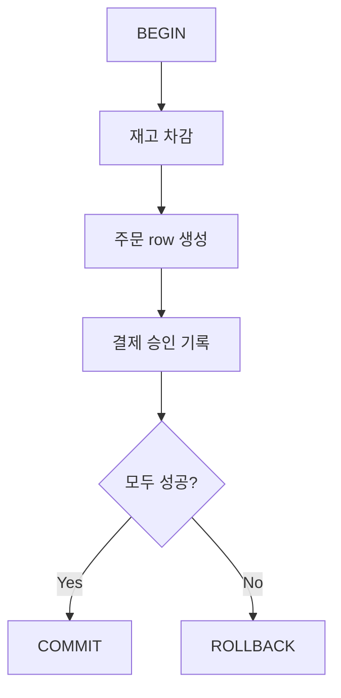

| ACID | 주문 예시 |
| --- | --- |
| Atomicity | 재고만 줄고 주문이 없는 상태를 막음 |
| Consistency | 재고 수량, 주문 상태, 결제 상태 규칙 유지 |
| Isolation | 동시에 두 명이 마지막 재고 1개를 중복 구매하지 못하게 함 |
| Durability | 주문 완료 후 서버 장애가 나도 주문 기록 유지 |

### SOLID 디자인 원칙

SOLID는 객체지향 설계에서 많이 쓰이는 5가지 원칙입니다. 무조건 클래스를 많이 쪼개라는 뜻이 아니라, **변경 이유와 의존 방향을 잘 관리하라**는 쪽에 가깝습니다.

| 원칙 | 이름 | 한 줄 요약 |
| --- | --- | --- |
| S | Single Responsibility Principle | 하나의 모듈은 하나의 변경 이유를 가져야 함 |
| O | Open/Closed Principle | 확장에는 열려 있고, 기존 코드 수정에는 닫혀 있어야 함 |
| L | Liskov Substitution Principle | 하위 타입은 상위 타입을 대체해도 프로그램이 깨지면 안 됨 |
| I | Interface Segregation Principle | 클라이언트가 쓰지 않는 메서드에 의존하게 만들지 말아야 함 |
| D | Dependency Inversion Principle | 구체 구현보다 추상화에 의존해야 함 |

#### S: Single Responsibility Principle

하나의 클래스/모듈이 너무 많은 책임을 가지면 변경 이유가 많아집니다.

나쁜 예:

```text
InvoiceService
- 주문 금액 계산
- PDF 생성
- 이메일 발송
- DB 저장
```

개선:

```text
InvoiceCalculator
InvoiceRepository
InvoicePdfRenderer
InvoiceMailer
```

핵심은 "기능 하나"가 아니라 **변경 이유 하나**입니다. 세금 정책 변경, PDF 양식 변경, 메일 발송 정책 변경은 서로 다른 변경 이유입니다.

#### O: Open/Closed Principle

새 기능을 추가할 때 기존 코드를 계속 고치는 구조는 회귀 버그가 늘어납니다.

나쁜 예:

```python
def pay(method, amount):
    if method == "card":
        ...
    elif method == "bank":
        ...
    elif method == "paypal":
        ...
```

개선 방향:

```python
class PaymentProvider:
    def pay(self, amount):
        raise NotImplementedError

class CardPayment(PaymentProvider):
    def pay(self, amount):
        ...

class BankPayment(PaymentProvider):
    def pay(self, amount):
        ...
```

새 결제 수단은 새 클래스로 추가하고, 기존 안정 코드는 덜 건드리는 식입니다.

#### L: Liskov Substitution Principle

상위 타입을 기대하는 코드에 하위 타입을 넣어도 정상 동작해야 합니다.

나쁜 예:

```text
Bird.fly()
Penguin extends Bird
Penguin.fly() -> 예외 발생
```

`Bird`를 받는 코드가 `fly()`를 믿고 호출하는데 `Penguin`이 들어오면 깨집니다.

개선:

```text
Bird
FlyingBird.fly()
Penguin extends Bird
Eagle extends FlyingBird
```

상속은 "비슷해 보임"이 아니라 "행동 계약을 지킬 수 있음"이 기준입니다.

#### I: Interface Segregation Principle

큰 인터페이스 하나에 모든 기능을 몰아넣으면 구현체가 쓰지도 않는 메서드를 억지로 구현해야 합니다.

나쁜 예:

```text
Machine
- print()
- scan()
- fax()
```

단순 프린터는 `scan`, `fax`를 지원하지 않는데 인터페이스 때문에 예외를 던지게 됩니다.

개선:

```text
Printer.print()
Scanner.scan()
Fax.fax()
```

클라이언트가 실제로 필요한 작은 인터페이스에만 의존하게 만드는 것이 목적입니다.

#### D: Dependency Inversion Principle

상위 정책 코드가 하위 구현 세부사항에 직접 의존하면 교체와 테스트가 어려워집니다.

나쁜 예:

```python
class OrderService:
    def __init__(self):
        self.sender = SmtpEmailSender()
```

개선:

```python
class OrderService:
    def __init__(self, sender):
        self.sender = sender
```

`OrderService`는 `SmtpEmailSender`라는 구체 구현이 아니라 `EmailSender` 역할/인터페이스에 의존합니다. 테스트에서는 fake sender를 넣고, 운영에서는 SMTP/SES/SendGrid 구현을 넣을 수 있습니다.

### ACID와 SOLID의 공통점과 차이

| 항목 | ACID | SOLID |
| --- | --- | --- |
| 다루는 위험 | 데이터 깨짐, 장애, 동시성 | 코드 변경 비용, 강한 결합, 테스트 어려움 |
| 적용 위치 | DB transaction boundary | class/module/service boundary |
| 너무 약하면 | 돈/주문/재고 같은 핵심 데이터 오류 | 수정할수록 버그 증가 |
| 너무 과하면 | lock 경합, 성능 저하 | 추상화 남발, 클래스/인터페이스 폭증 |
| 실무 감각 | 중요한 write에는 강하게 | 변하는 지점부터 점진적으로 |

### 실무 팁

| 상황 | 권장 |
| --- | --- |
| 결제, 주문, 포인트, 재고 | ACID 트랜잭션 강하게 사용 |
| 로그, 조회 캐시, 추천 이벤트 | eventual consistency 허용 가능 |
| SOLID 적용 | 처음부터 모든 곳에 추상화하지 말고 변경이 반복되는 지점에 적용 |
| 테스트 | ACID는 통합 테스트, SOLID는 단위 테스트 용이성으로 효과 확인 |
| 설계 냄새 | 트랜잭션이 너무 길면 lock 문제, SOLID가 너무 과하면 추상화 피로 |

### 근거 URL

- IBM, ACID properties of transactions: https://www.ibm.com/docs/en/cics-tx/11.1?topic=processing-acid-properties-transactions
- IBM, Properties of transactions: https://www.ibm.com/docs/en/SSNAQ8_11.1.0/concepts/c_trans.html
- PostgreSQL Transaction Processing: https://www.postgresql.org/docs/current/transactions.html
- PostgreSQL START TRANSACTION: https://www.postgresql.org/docs/current/sql-start-transaction.html
- SOLID Principles Wiki: https://principles-wiki.net/collections%3Asolid
- Robert C. Martin, Design Principles and Design Patterns mirror: https://blog.thedojo.mx/assets/pdfs/DesignPrinciplesAndPatterns.pdf

### 사실 / 추정 / 검증필요

| 분류 | 내용 |
| --- | --- |
| 사실 | IBM 문서는 ACID를 atomicity, consistency, isolation, durability의 4가지 트랜잭션 속성으로 설명함 |
| 사실 | IBM 문서는 consistency가 애플리케이션 책임도 포함한다고 설명함 |
| 사실 | PostgreSQL 문서는 `START TRANSACTION`, `COMMIT`, `ROLLBACK`으로 transaction block을 제어한다고 설명함 |
| 사실 | SOLID는 Single Responsibility, Open/Closed, Liskov Substitution, Interface Segregation, Dependency Inversion 원칙의 약어로 널리 설명됨 |
| 추정 | 사용자의 질문 의도는 백엔드/DB 설계와 객체지향 설계 원칙의 핵심 개념 정리로 판단함 |
| 검증필요 | 특정 프로젝트에서 ACID 격리 수준이나 SOLID 적용 범위는 도메인 위험도, DB 종류, 팀 코드 스타일에 맞춰 별도 결정해야 함 |

## 010. ABI와 ISA 차이점

### 질문

> abi 와 isa 차이점

### 핵심 결론

**ISA**는 CPU가 어떤 명령어를 이해하고 실행하는지에 대한 계약입니다.

**ABI**는 이미 컴파일된 바이너리들이 OS, 라이브러리, 다른 object file과 어떻게 맞물리는지에 대한 계약입니다.

| 구분 | 풀네임 | 한 줄 요약 |
| --- | --- | --- |
| ISA | Instruction Set Architecture | CPU와 기계어 사이의 계약 |
| ABI | Application Binary Interface | 컴파일된 바이너리와 실행 환경 사이의 계약 |

### 레이어로 보면

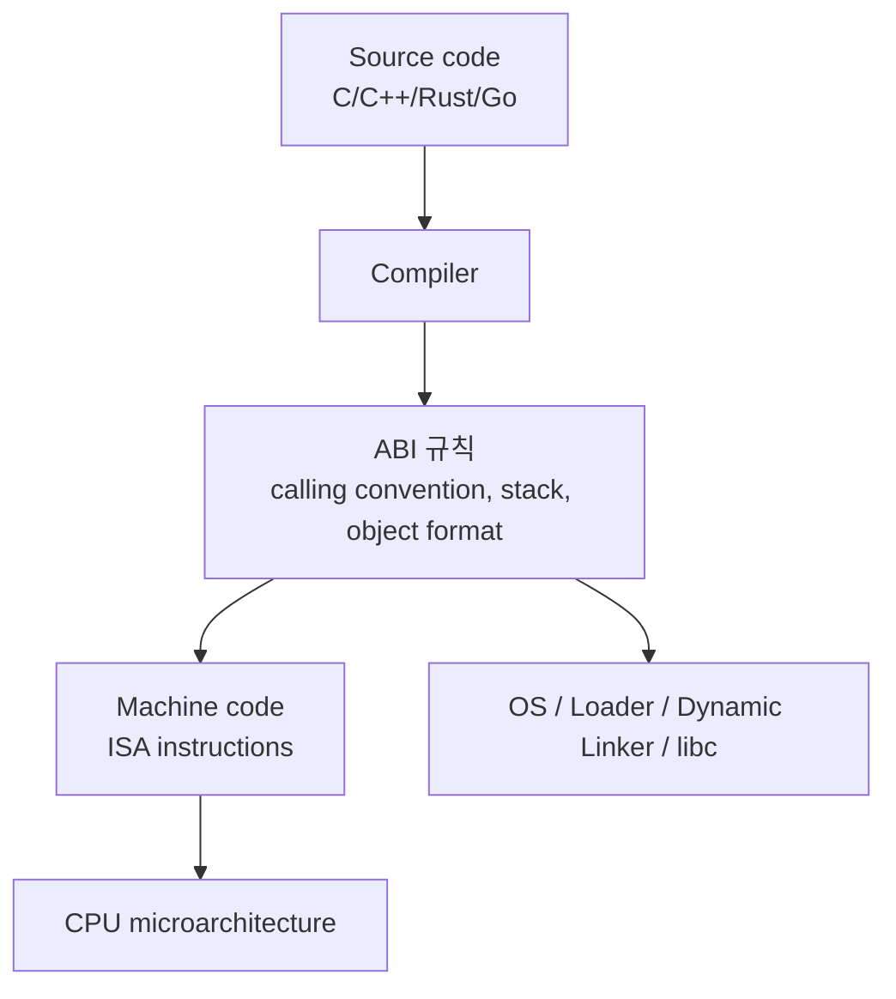

ISA는 `Machine code -> CPU` 쪽 계약이고, ABI는 `컴파일 산출물 -> OS/라이브러리/다른 바이너리` 쪽 계약입니다.

### ISA가 정하는 것

ISA는 CPU가 실행할 수 있는 명령어와 그 의미를 정의합니다.

| 항목 | 예 |
| --- | --- |
| 명령어 | `ADD`, `MOV`, `LDR`, `STR`, `JMP`, `CALL` |
| 레지스터 | Arm64의 `x0~x30`, x86-64의 `rax`, `rbx`, `rcx` 등 |
| 주소 지정 방식 | 메모리를 어떻게 읽고 쓸 수 있는가 |
| 메모리 모델 | load/store 순서와 atomic 동작 |
| 예외/인터럽트 모델 | trap, exception, privilege level |
| SIMD/벡터 명령 | NEON, SVE, SSE, AVX 등 |

예를 들어 `AArch64`, `x86-64`, `RISC-V RV64GC`는 ISA 계층의 이름입니다.

### ABI가 정하는 것

ABI는 같은 ISA 위에서 돌아가는 바이너리들이 서로 깨지지 않게 맞추는 규칙입니다.

| 항목 | 설명 |
| --- | --- |
| Calling convention | 함수 인자를 어떤 레지스터/스택에 놓을지 |
| Return value | 함수 반환값을 어디에 둘지 |
| Register preservation | caller-saved/callee-saved register 구분 |
| Stack alignment | 함수 호출 시 stack을 몇 byte 정렬할지 |
| Data layout | `int`, `long`, pointer 크기와 struct padding/alignment |
| Object file format | ELF, Mach-O, PE 등 |
| Dynamic linking | symbol, relocation, shared library 규칙 |
| Name mangling | C++ 함수 이름을 binary symbol로 표현하는 방식 |
| Syscall ABI | user space가 kernel을 호출하는 방식 |

예를 들어 같은 x86-64 ISA라도 OS마다 ABI가 다릅니다.

| 플랫폼 | ISA | ABI 예 |
| --- | --- | --- |
| Linux x86-64 | x86-64 | System V AMD64 ABI |
| Windows x64 | x86-64 | Microsoft x64 ABI |
| macOS arm64 | AArch64 | Apple arm64 ABI |
| Linux arm64 | AArch64 | AAPCS64 / ELF for AArch64 |

### 같은 ISA, 다른 ABI 예시

x86-64 CPU는 같아도 Linux와 Windows의 함수 호출 규칙은 다릅니다.

| 항목 | Linux x86-64, SysV ABI | Windows x64 ABI |
| --- | --- | --- |
| 첫 번째 정수 인자 | `rdi` | `rcx` |
| 두 번째 정수 인자 | `rsi` | `rdx` |
| 세 번째 정수 인자 | `rdx` | `r8` |
| 네 번째 정수 인자 | `rcx` | `r9` |

그래서 동일한 x86-64 기계어 명령어를 쓰더라도, 어떤 ABI를 가정하고 컴파일했는지에 따라 함수 호출이 맞거나 깨질 수 있습니다.

### 같은 ABI 계열, 다른 ISA 예시

반대로 "Linux ELF executable"이라는 큰 실행 환경은 비슷해도 ISA가 다르면 바이너리는 직접 실행되지 않습니다.

| 바이너리 | 실행 가능한 CPU |
| --- | --- |
| Linux `x86_64` ELF | x86-64 CPU |
| Linux `aarch64` ELF | Arm64 CPU |
| Linux `riscv64` ELF | RISC-V 64-bit CPU |

ELF라는 object/executable 형식은 공유할 수 있지만, 내부 machine instruction이 다르기 때문에 ISA가 다르면 native 실행은 불가능합니다. 에뮬레이터나 translation layer가 필요합니다.

### API, ABI, ISA 비교

| 구분 | 대상 | 깨지는 시점 |
| --- | --- | --- |
| API | 소스 코드 수준 인터페이스 | 컴파일할 때 |
| ABI | binary 수준 인터페이스 | 링크/로드/실행할 때 |
| ISA | CPU 명령어 수준 인터페이스 | CPU가 명령어를 decode/execute할 때 |

예:

```c
int add(int a, int b);
```

API 관점:

- 함수 이름이 `add`
- 인자 타입이 `int, int`
- 반환 타입이 `int`

ABI 관점:

- `a`, `b`를 어떤 레지스터에 넣는가
- 반환값을 어떤 레지스터에 넣는가
- stack은 몇 byte 정렬해야 하는가
- symbol 이름은 어떻게 저장되는가

ISA 관점:

- 실제로 `ADD`, `MOV`, `RET` 같은 어떤 machine instruction으로 표현되는가

### 왜 중요한가

| 상황 | 확인할 것 |
| --- | --- |
| C/C++ 라이브러리 배포 | ABI 호환성, compiler version, standard library ABI |
| Python/Rust/Node native extension | target triple, ABI, libc, architecture |
| Docker image 배포 | `linux/amd64` vs `linux/arm64` |
| iOS/Android 앱 | `arm64-v8a`, `armeabi-v7a`, simulator ABI |
| FFI/JNI/ctypes | calling convention, struct layout, alignment |
| Assembly 작성 | ISA 문서와 ABI calling convention 둘 다 필요 |

### 실무 감각

| 질문 | 답 |
| --- | --- |
| `arm64`와 `x86_64` 차이는? | 주로 ISA 차이 |
| Linux arm64와 macOS arm64 차이는? | ISA는 AArch64로 같지만 ABI/OS가 다름 |
| 같은 `.so`를 다른 Linux 배포판에서 못 쓰는 이유는? | ABI, libc, symbol version, dependency 차이 가능 |
| 같은 C header인데 binary가 안 맞는 이유는? | API는 같아도 ABI가 달라졌을 수 있음 |
| Rust/Python extension wheel에 `manylinux_x86_64`, `macosx_arm64`가 붙는 이유는? | OS ABI와 ISA를 함께 구분해야 하기 때문 |

### 근거 URL

- Arm CPU architecture overview: https://www.arm.com/architecture/cpu
- Arm A-profile architecture guide: https://www.arm.com/architecture/learn-the-architecture/a-profile
- Arm Application Binary Interface official docs: https://developer.arm.com/Architectures/ABI
- Arm ABI GitHub repository: https://github.com/ARM-software/abi-aa
- Apple Application Binary Interfaces: https://developer.apple.com/documentation/xcode/application-binary-interfaces
- RISC-V psABI: https://riscv-non-isa.github.io/riscv-elf-psabi-doc/
- System V ABI overview: https://wiki.osdev.org/System_V_ABI

### 사실 / 추정 / 검증필요

| 분류 | 내용 |
| --- | --- |
| 사실 | Arm 공식 문서는 CPU architecture가 instruction set, exception model, memory model 등을 정의한다고 설명함 |
| 사실 | Arm ABI 공식 저장소는 Arm Architecture용 ABI 문서의 공식 배포 위치로 안내됨 |
| 사실 | Apple ABI 문서는 assembly가 함수 호출, stack 관리 등의 ABI 규칙을 지켜야 한다고 설명함 |
| 사실 | RISC-V psABI는 ELF, DWARF, calling convention 등 processor-specific ABI를 다룸 |
| 추정 | 사용자의 질문 의도는 앞선 ARM/Intel ISA 비교에서 ABI와 ISA의 경계를 명확히 하려는 것으로 해석함 |
| 검증필요 | 특정 플랫폼의 정확한 ABI 규칙은 해당 OS/architecture의 ABI 문서를 별도 확인해야 함 |

## 011. 네트워크 진단 툴 사용법

### 질문

> 네트워크 툴 사용법
> netstat, ping, ifconfig, dip, traceroute, dig ...

### 핵심 결론

네트워크 문제는 OSI 계층을 따라 아래 순서로 보는 편이 좋습니다.

```text
1. 내 장비 IP/라우팅 확인: ip, ifconfig
2. 목적지까지 도달성 확인: ping
3. 경로 중 어디서 느린지/끊기는지 확인: traceroute, tracert, mtr
4. DNS 확인: dig, nslookup
5. 포트/소켓 확인: ss, netstat
6. 실제 TCP/HTTP 확인: nc, curl
7. 패킷 레벨 확인: tcpdump, Wireshark
```

`dip`는 일반적인 현대 네트워크 진단 명령으로는 잘 쓰이지 않습니다. 질문 맥락상 Linux의 `ip`를 의미한 것으로 보고 정리합니다.

### 주요 명령어 표

| 명령 | 목적 | 예시 |
| --- | --- | --- |
| `ping` | ICMP로 host 도달성/RTT/loss 확인 | `ping -c 4 google.com` |
| `traceroute` / `tracert` | 목적지까지 hop 경로 확인 | `traceroute google.com`, Windows는 `tracert google.com` |
| `dig` | DNS record 질의 | `dig example.com A`, `dig @8.8.8.8 example.com` |
| `ifconfig` | 네트워크 인터페이스 확인/설정, legacy | `ifconfig -a` |
| `ip` | Linux 현대 네트워크 관리 도구 | `ip addr`, `ip route`, `ip link` |
| `netstat` | 연결/포트/라우팅/통계 확인, legacy 성격 | `netstat -ano`, `netstat -tulpn` |
| `ss` | Linux에서 netstat 대체 성격의 socket 확인 | `ss -tulpn` |
| `curl` | HTTP/TLS/API 확인 | `curl -v https://example.com` |
| `nc` | TCP 포트 연결 확인 | `nc -vz host 443` |
| `tcpdump` | 패킷 캡처 | `sudo tcpdump -i any host 1.1.1.1` |

### 자주 쓰는 진단 흐름

#### 1. 내 IP와 라우팅 확인

```bash
ip addr
ip route
ip route get 8.8.8.8
```

`ip route get`은 특정 목적지로 갈 때 어떤 interface/source IP/gateway를 쓸지 확인할 때 유용합니다.

#### 2. 목적지 도달성 확인

```bash
ping -c 4 8.8.8.8
ping -c 4 google.com
```

IP로 ping은 되는데 domain으로 ping이 안 되면 DNS 문제일 가능성이 큽니다. 단, ICMP가 차단된 서버도 많아서 ping 실패가 곧 서비스 장애를 의미하지는 않습니다.

#### 3. DNS 확인

```bash
dig example.com A
dig example.com AAAA
dig example.com MX
dig +short example.com
dig @8.8.8.8 example.com
dig +trace example.com
```

`dig @resolver`는 특정 DNS resolver를 지정해 질의할 때 좋습니다. `+trace`는 root부터 authoritative DNS까지 추적합니다.

#### 4. 경로 확인

```bash
traceroute example.com
traceroute -T -p 443 example.com
```

중간 hop이 `* * *`로 나와도 반드시 장애는 아닙니다. 라우터가 TTL exceeded 응답을 제한하거나 ICMP를 막을 수 있습니다.

#### 5. 포트와 소켓 확인

Linux:

```bash
ss -tulpn
ss -tan state established
```

Windows:

```powershell
netstat -ano
netstat -ab
```

`LISTEN`은 프로세스가 해당 포트를 열었다는 뜻이지, 방화벽이 외부 접근을 허용한다는 뜻은 아닙니다.

### 근거 URL

- Microsoft netstat: https://learn.microsoft.com/en-us/windows-server/administration/windows-commands/netstat
- Linux `ip` man page: https://man7.org/linux/man-pages/man8/ip.8.html
- Linux `ping` man page: https://man7.org/linux/man-pages/man8/ping.8.html
- Linux `traceroute` man page: https://man7.org/linux/man-pages/man8/traceroute.8.html
- ISC BIND/dig documentation: https://downloads.isc.org/isc/bind9/9.20.11/doc/arm/html/manpages.html#dig-dns-lookup-utility

## 012. Android, iOS, Windows, Linux 특징과 장단점

### 질문

> android, ios, window, ios, linux의 특징, 장단점, 설계상 특징
> 특히 android 의 특징을 길게 설명

### 한눈에 비교

| OS | 핵심 정체성 | 장점 | 단점 |
| --- | --- | --- | --- |
| Android | Linux kernel 기반 모바일/임베디드 앱 플랫폼 | 개방적, 기기 다양성, Play 생태계, 커스텀 가능 | fragmentation, OEM/버전 차이, 백그라운드 제약, 보안 업데이트 편차 |
| iOS | Apple 하드웨어와 강하게 통합된 모바일 OS | 일관된 UX, 강한 보안/프라이버시, 장기 업데이트, 성능 최적화 | 폐쇄적, 배포/정책 제약, 플랫폼 커스터마이징 한계 |
| Windows | 데스크톱/기업/게임 중심 범용 OS | 소프트웨어 호환성, 드라이버/게임/기업 생태계 | 레거시 부담, 복잡한 설정, 보안 표면 넓음 |
| Linux | 오픈소스 Unix-like kernel/OS 생태계 | 서버/개발/임베디드 강함, 자유도, 자동화 | 데스크톱 앱/드라이버 편차, 배포판별 차이 |

### Android를 길게 설명

Android는 단순히 "Linux 폰"이 아닙니다. Linux kernel 위에 Android 전용 runtime, framework, security model, app component model을 올린 플랫폼입니다.

#### Android 아키텍처

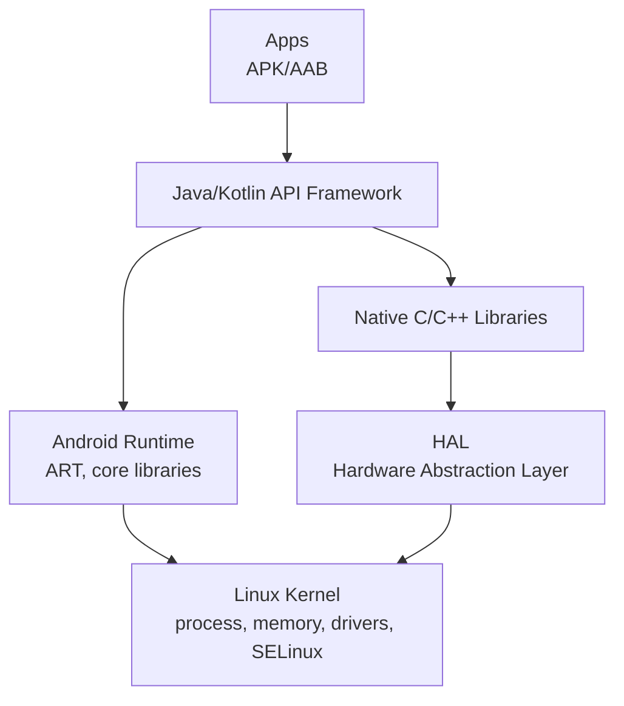

| 계층 | 역할 |
| --- | --- |
| Linux kernel | 프로세스, 메모리, 스케줄링, 네트워크, 드라이버, SELinux 기반 보안 |
| HAL | 카메라, 오디오, 센서, Bluetooth 같은 하드웨어 추상화 |
| Native libraries | libc, media, graphics, SQLite, SSL 등 C/C++ 기반 기능 |
| ART | DEX bytecode 실행, JIT/AOT, GC |
| Framework | Activity, Service, ContentProvider, View, Window, Notification 등 |
| Apps | Kotlin/Java/C++ 기반 APK/AAB |

#### Android 앱 모델

Android 앱은 하나의 `main()`에서 시작하는 전통 데스크톱 앱과 다릅니다. 시스템이 app component를 필요에 따라 생성/중단/재개합니다.

| 컴포넌트 | 역할 |
| --- | --- |
| Activity | 화면 하나 또는 사용자 interaction 진입점 |
| Service | 백그라운드 작업, foreground service 포함 |
| BroadcastReceiver | 시스템/앱 이벤트 수신 |
| ContentProvider | 앱 간 구조화된 데이터 공유 |
| Intent | 컴포넌트 간 작업 요청/라우팅 |

이 구조 덕분에 앱 간 연동이 유연하지만, lifecycle을 잘못 다루면 memory leak, background kill, state loss가 생깁니다.

#### Android 보안 모델

Android는 기본적으로 앱마다 별도 Linux UID를 주고 sandbox를 만듭니다.

| 보안 요소 | 설명 |
| --- | --- |
| App sandbox | 앱 데이터/프로세스를 기본적으로 다른 앱과 격리 |
| Permission | 카메라, 위치, 연락처 등 민감 권한을 명시적으로 요청 |
| SELinux | system service와 app domain을 정책으로 제한 |
| Verified Boot | 부팅 체인의 무결성 확인 |
| Scoped Storage | 외부 저장소 접근 범위 제한 |
| Play Protect / app signing | 배포/서명/검증 생태계 |

Android의 보안은 강하지만, 사용자가 권한을 과도하게 허용하거나 OEM 업데이트가 늦으면 위험이 커집니다.

#### Android의 장점

| 장점 | 설명 |
| --- | --- |
| 개방성 | AOSP 기반으로 OEM/칩셋/제품군 커스터마이징 가능 |
| 기기 다양성 | 폰, 태블릿, TV, Auto, Wear, embedded, foldable 등 |
| 개발 생태계 | Kotlin, Java, Jetpack, Compose, NDK, Play Console |
| 배포 유연성 | Play Store 외 enterprise/private distribution 가능 |
| 하드웨어 접근 | 카메라, 센서, BLE, NFC 등 모바일 하드웨어 활용 강함 |
| 가격대 다양성 | 저가~프리미엄 시장을 모두 커버 |

#### Android의 단점

| 단점 | 설명 |
| --- | --- |
| Fragmentation | OS 버전, 화면 크기, SoC, OEM behavior 차이 |
| 백그라운드 제약 | 배터리 최적화, Doze, foreground service 정책 대응 필요 |
| 성능 편차 | 기기 스펙/열/메모리/스토리지 품질 차이가 큼 |
| 업데이트 편차 | Pixel/주요 제조사와 저가형 기기의 보안 업데이트 차이 |
| 테스트 비용 | 다양한 화면/권한/OS 버전/제조사에서 QA 필요 |
| 정책 변화 | Play 정책, target SDK 요구사항, 권한 제한 변화 추적 필요 |

### iOS 특징

iOS는 Apple이 하드웨어, OS, SDK, App Store를 통합 관리합니다. Swift/SwiftUI/UIKit/Metal 생태계가 중심입니다.

| 장점 | 단점 |
| --- | --- |
| 기기 수가 제한되어 최적화와 QA가 상대적으로 쉬움 | App Store 심사와 정책 의존도가 큼 |
| 장기 업데이트와 보안/프라이버시 모델 강함 | 시스템 커스터마이징과 sideloading 자유도 낮음 |
| Metal, Core ML, Apple Silicon 최적화 | Apple 플랫폼 lock-in |

### Windows 특징

Windows는 데스크톱, 기업, 게임, 레거시 호환성 중심 OS입니다. user mode/kernel mode 분리, Win32, COM, .NET, UWP/WinUI 등 여러 세대의 API가 공존합니다.

| 장점 | 단점 |
| --- | --- |
| 기존 소프트웨어와 하드웨어 호환성 강함 | 레거시 유지로 복잡도 높음 |
| 게임/DirectX/드라이버 생태계 강함 | 보안 공격 표면이 넓고 설정이 복잡 |
| 기업 관리, AD, endpoint security 생태계 큼 | 업데이트/드라이버 이슈가 사용자 경험에 영향 |

### Linux 특징

Linux는 kernel이고, 실제 OS 경험은 배포판과 userland 조합으로 결정됩니다. 서버, 클라우드, 컨테이너, 임베디드에서 강합니다.

| 장점 | 단점 |
| --- | --- |
| 오픈소스, 자동화, 서버 운영에 강함 | 데스크톱 상용 앱/게임/드라이버는 경우에 따라 부족 |
| 패키지 관리, shell, 컨테이너 생태계 우수 | 배포판별 차이와 호환성 관리 필요 |
| 커스터마이징 자유도 높음 | 자유도가 높은 만큼 운영 책임도 큼 |

### 근거 URL

- Android platform architecture: https://developer.android.com/guide/platform
- Android security checklist: https://developer.android.com/guide/topics/security/security
- Android Binder IPC: https://source.android.com/docs/core/architecture/hidl/binder-ipc
- Apple iOS developer: https://developer.apple.com/ios/
- Apple UIKit overview: https://developer.apple.com/documentation/UIKit
- Microsoft Windows user mode/kernel mode: https://learn.microsoft.com/en-us/windows-hardware/drivers/gettingstarted/user-mode-and-kernel-mode
- Linux Kernel documentation: https://docs.kernel.org/

## 013. OpenGL, EGL, WGL 설명

### 질문

> openGL, EGL, WGL 설명

### 핵심 결론

OpenGL은 렌더링 API입니다. 하지만 OpenGL 자체는 "윈도우를 만들고, OS 화면에 붙이고, context를 생성하는 방법"까지 모두 정하지 않습니다. 그래서 플랫폼별 glue layer가 필요합니다.

| 이름 | 역할 |
| --- | --- |
| OpenGL | GPU로 2D/3D 그래픽을 그리는 API |
| EGL | OpenGL ES/OpenGL 같은 Khronos API와 native window system을 연결하는 interface |
| WGL | Windows에서 OpenGL context/surface를 만들고 GDI/window와 연결하는 Windows-specific OpenGL layer |

### 관계도

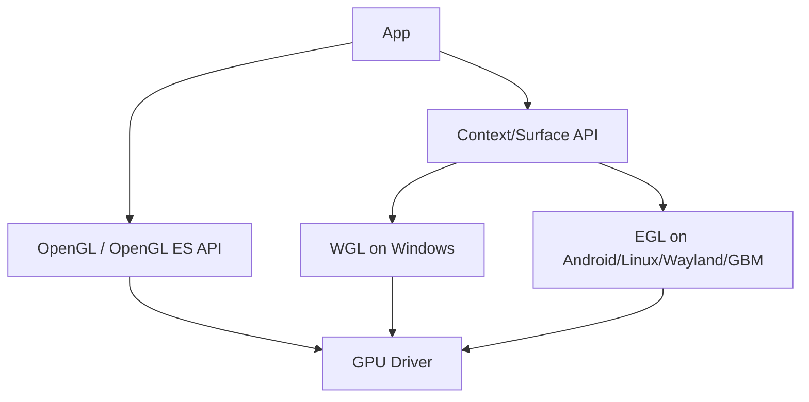

### OpenGL

OpenGL은 vertex, shader, texture, buffer, framebuffer 등을 통해 그래픽을 그리는 API입니다. Khronos의 OpenGL registry에 공식 specification과 extension이 있습니다.

주의할 점:

- OpenGL은 rendering API이지 windowing API가 아닙니다.
- context가 있어야 OpenGL 함수를 호출할 수 있습니다.
- Windows에서는 보통 WGL, Android에서는 EGL로 context를 만듭니다.

### EGL

EGL은 Khronos rendering API와 underlying native platform window system 사이의 interface입니다.

주요 역할:

| 역할 | 설명 |
| --- | --- |
| Display 연결 | native display와 EGL display 연결 |
| Config 선택 | color/depth/stencil buffer format 선택 |
| Surface 생성 | window surface, pbuffer, pixmap 등 |
| Context 생성 | OpenGL ES/OpenGL context 생성 |
| Swap | back buffer를 front buffer로 교체 |
| Sync/Interop | rendering synchronization, API interop |

Android OpenGL ES 개발에서 자주 보는 흐름:

```text
eglGetDisplay
eglInitialize
eglChooseConfig
eglCreateWindowSurface
eglCreateContext
eglMakeCurrent
glDraw...
eglSwapBuffers
```

### WGL

WGL은 Windows 전용 OpenGL windowing/context interface입니다.

주요 역할:

| 역할 | 설명 |
| --- | --- |
| Pixel format 선택 | `ChoosePixelFormat`, `SetPixelFormat` |
| Context 생성 | `wglCreateContext`, extension으로 modern context 생성 |
| Context current 설정 | `wglMakeCurrent` |
| Buffer swap | `SwapBuffers` |
| Extension 로딩 | `wglGetProcAddress` |

Windows에서 modern OpenGL context를 만들 때는 기본 WGL API만으로 부족해 `WGL_ARB_create_context` 같은 extension을 함께 사용합니다.

### 근거 URL

- Khronos OpenGL: https://www.khronos.org/opengl/
- Khronos OpenGL Registry: https://registry.khronos.org/OpenGL/
- Khronos EGL: https://www.khronos.org/egl
- Khronos OpenGL/WGL Registry: https://registry.khronos.org/opengl

## 014. GPU core와 Tensor Core 설명

### 질문

> gpu core, tensor 설명

### 핵심 결론

GPU core는 일반적인 병렬 연산을 수행하는 실행 유닛을 넓게 부르는 말이고, Tensor Core는 딥러닝에서 많이 쓰는 matrix multiply-accumulate를 빠르게 처리하는 특수 하드웨어입니다.

| 구분 | GPU core / CUDA core | Tensor Core |
| --- | --- | --- |
| 역할 | 범용 병렬 산술/로직 연산 | 행렬 곱/누산 특화 |
| 단위 | NVIDIA는 CUDA core, AMD는 stream processor 등으로 부름 | NVIDIA Tensor Core |
| 잘하는 일 | shader, vector math, 일반 CUDA kernel | FP16/BF16/TF32/FP8 등 mixed precision matrix multiply |
| 유연성 | 높음 | 낮지만 특정 연산에서 매우 빠름 |
| AI에서 | activation, elementwise op, indexing, custom kernel | GEMM, convolution lowering, attention matmul |

### GPU core

GPU는 CPU처럼 소수의 강한 core보다, 많은 실행 lane으로 같은 명령을 여러 데이터에 병렬 적용하는 데 강합니다. NVIDIA에서는 SM 안에 CUDA core, Tensor Core, load/store unit, special function unit 등이 들어갑니다.

CUDA core는 단순히 "CPU core"와 1:1 대응되는 개념이 아닙니다. GPU thread가 warp 단위로 묶여 실행되고, CUDA core는 그 warp의 산술 명령을 처리하는 실행 lane에 가깝습니다.

### Tensor Core

Tensor Core는 딥러닝의 핵심 연산인 matrix multiply-accumulate를 가속합니다.

$$
D = A \times B + C
$$

일반 CUDA core로도 행렬곱을 할 수 있지만, Tensor Core는 특정 shape/precision의 행렬 블록 연산을 훨씬 높은 throughput으로 처리하도록 설계되어 있습니다.

주의할 점:

- Tensor Core는 "AI tensor 객체를 저장하는 곳"이 아닙니다.
- Tensor Core는 GPU 안의 특수 연산 유닛입니다.
- PyTorch/TensorFlow의 tensor는 데이터 구조이고, NVIDIA Tensor Core는 하드웨어입니다.

### 근거 URL

- NVIDIA Tensor Cores: https://www.nvidia.com/en-us/data-center/tensor-cores/
- NVIDIA mixed precision training: https://docs.nvidia.com/deeplearning/performance/mixed-precision-training/index.html
- PyTorch tensor docs: https://docs.pytorch.org/docs/stable/tensors.html

## 015. AI에서 Tensor란 무엇인가

### 질문

> ai 에서 tensor 란?
> tensor와 일반 행렬과 일반 숫자와 차이점?

### 핵심 결론

AI 프레임워크에서 tensor는 보통 **동일 dtype을 가진 다차원 배열**입니다.

| 개념 | rank | 예 |
| --- | ---: | --- |
| Scalar | 0 | `3.14`, shape `[]` |
| Vector | 1 | `[1, 2, 3]`, shape `[3]` |
| Matrix | 2 | `[[1,2],[3,4]]`, shape `[2,2]` |
| Tensor | N | 이미지 batch `[N,C,H,W]`, 문장 embedding `[B,L,D]` |

수학적으로 tensor는 더 엄밀한 의미가 있지만, AI/딥러닝 실무에서는 대부분 `ndarray + dtype + shape + device + gradient` 정도로 이해하면 됩니다.

### 예시

이미지 한 장:

```text
RGB image = [C, H, W] = [3, 224, 224]
```

이미지 batch:

```text
batch = [N, C, H, W] = [32, 3, 224, 224]
```

Transformer 입력:

```text
tokens embedding = [B, L, D]
B = batch size
L = sequence length
D = hidden dimension
```

### Tensor와 행렬/숫자의 차이

| 항목 | 일반 숫자 | 행렬 | Tensor |
| --- | --- | --- | --- |
| 차원 | 0차원 | 2차원 | 0차원 이상 일반화 |
| shape | `[]` | `[rows, cols]` | `[d1, d2, ...]` |
| 예 | loss 값 | linear layer weight | batch image, activation, attention score |
| AI 의미 | scalar loss, learning rate | weight matrix | 모델의 모든 중간 데이터 표현 |

행렬은 rank-2 tensor입니다. 숫자는 rank-0 tensor로 볼 수 있습니다. 즉 tensor가 더 일반적인 개념입니다.

### 근거 URL

- TensorFlow Introduction to Tensors: https://www.tensorflow.org/guide/tensor
- TensorFlow `tf.Tensor`: https://www.tensorflow.org/api_docs/python/tf/Tensor
- PyTorch Tensor docs: https://docs.pytorch.org/docs/stable/tensors.html

## 016. Python 같은 인터프리터 언어가 일반적으로 느린 이유

### 질문

> python 같은 인터프리터 언어가 컴파일 언어에 비해서 일반적으로 느린이유?

### 핵심 결론

CPython은 소스 코드를 bytecode로 컴파일한 뒤, interpreter loop가 bytecode를 하나씩 해석해 실행합니다. C/C++/Rust/Go 같은 언어는 보통 더 많은 정보를 컴파일 시점에 알고 machine code로 최적화합니다.

Python이 느린 주된 이유는 "한 줄씩 읽어서"라기보다, **동적 타입과 객체 모델이 매 연산마다 많은 일을 하게 만들기 때문**입니다.

### 주요 이유

| 이유 | 설명 |
| --- | --- |
| Interpreter dispatch | bytecode 하나마다 fetch/decode/dispatch overhead |
| Dynamic typing | `a + b`가 int 덧셈인지, list concat인지, user-defined `__add__`인지 runtime에 확인 |
| Boxing/object overhead | 작은 정수도 Python object라 type/refcount/value metadata를 가짐 |
| Dictionary lookup | 변수, attribute, method lookup이 hash table 기반인 경우 많음 |
| Reference counting/GC | 객체 생명주기 관리 비용 |
| GIL | CPython에서는 한 interpreter에서 Python bytecode를 동시에 여러 thread가 실행하기 어려움 |
| 최적화 한계 | C처럼 aggressive inlining/vectorization/register allocation을 일반적으로 하기 어려움 |

### 예: `x + y`

C에서 `int x, y`라면 컴파일러는 거의 바로 machine add instruction으로 내릴 수 있습니다.

Python에서는:

```python
z = x + y
```

이 연산에 대해 runtime이 확인해야 하는 것:

- `x`, `y`가 어떤 객체인가
- `+`가 어떤 special method로 연결되는가
- overflow/큰 정수 처리는 어떻게 할 것인가
- 결과 객체를 새로 만들 것인가
- reference count를 어떻게 바꿀 것인가

이 유연성이 Python의 생산성을 만들지만, CPU-bound loop에서는 비용이 됩니다.

### 그래도 Python이 빠른 경우

| 상황 | 이유 |
| --- | --- |
| NumPy/PyTorch/TensorFlow | 무거운 연산이 C/C++/CUDA kernel로 내려감 |
| I/O-bound 서버 | 네트워크/디스크 대기 시간이 지배적 |
| PyPy/Numba/Cython | JIT 또는 native extension으로 hot path 최적화 |
| Multiprocessing | GIL을 process 단위로 우회 |

### 근거 URL

- Python executive summary: https://www.python.org/doc/essays/blurb/
- Python C API, GIL: https://docs.python.org/3/c-api/init.html#thread-state-and-the-global-interpreter-lock
- Python FAQ: https://docs.python.org/3/faq/general.html
- PyPy CPython differences: https://doc.pypy.org/en/latest/cpython_differences.html

## 017. WebGL 소개와 OpenGL 대비 한계

### 질문

> WebGL 소개, 특징, 장단점
> openGL을 windows나 android 에서 사용할때에 비해 webGL을 사용할때의 한계점

### 핵심 결론

WebGL은 브라우저의 HTML canvas에서 JavaScript로 GPU 가속 3D 그래픽을 사용할 수 있게 하는 Khronos 표준입니다. WebGL 1.0은 OpenGL ES 2.0, WebGL 2.0은 OpenGL ES 3.0 기반입니다.

| 구분 | Native OpenGL/OpenGL ES | WebGL |
| --- | --- | --- |
| 실행 환경 | OS native app | Browser sandbox |
| 언어 | C/C++/Java/Kotlin 등 | JavaScript/TypeScript/WASM |
| Context | WGL/EGL/GLX 등 직접 사용 | HTML canvas에서 browser가 관리 |
| 기능 범위 | 드라이버/OS/GL 버전에 따라 넓음 | WebGL 1/2 표준과 browser 보안 제약 |
| 배포 | 설치 필요 | URL로 배포 |
| 보안 | 앱 권한/OS sandbox에 의존 | 강한 browser sandbox와 검증 |

### WebGL 장점

| 장점 | 설명 |
| --- | --- |
| 설치 없음 | 브라우저에서 바로 실행 |
| 크로스플랫폼 | Windows/macOS/Linux/Android/iOS 브라우저에서 동일 코드 지향 |
| 웹 생태계 | HTML/CSS/JS, React, WebAssembly, three.js, Babylon.js와 결합 |
| 배포/업데이트 | 서버 코드 업데이트로 즉시 반영 |
| 접근성 | 링크 공유, iframe/embed, 교육/시각화에 좋음 |

### WebGL 단점

| 단점 | 설명 |
| --- | --- |
| 기능 제한 | OpenGL ES 기반이라 desktop OpenGL 4.x 기능을 그대로 못 씀 |
| 보안 검증 overhead | 잘못된 GPU 접근을 막기 위해 browser가 상태/리소스 검증 |
| 확장/드라이버 차이 | browser, GPU, OS마다 extension 지원 차이 |
| context loss | 브라우저가 GPU context를 잃을 수 있어 복구 코드 필요 |
| 파일/스레드/메모리 제약 | native app처럼 자유롭게 OS 자원 사용 불가 |
| 디버깅 난이도 | GPU driver, browser backend, JS/WASM 계층이 겹침 |
| compute 한계 | WebGL은 범용 GPU compute API가 아님. 현대 compute는 WebGPU 검토 |

### Windows/Android에서 native OpenGL을 쓸 때와 WebGL 한계

#### Windows native OpenGL 대비

| 항목 | Native OpenGL on Windows | WebGL |
| --- | --- | --- |
| Context 생성 | WGL로 직접 제어 | browser가 canvas context 생성 |
| GL 버전 | GPU driver가 지원하면 desktop OpenGL 기능 사용 가능 | WebGL 1/2 범위 |
| Extension | driver extension 직접 활용 가능 | WebGL extension으로 노출된 것만 |
| Native resource | file, thread, memory, OS window 자유도 높음 | browser sandbox 제한 |
| 성능 튜닝 | driver/API 호출 직접 제어 | browser validation/translation layer 영향 |

Windows 브라우저의 WebGL은 내부적으로 ANGLE 등을 통해 Direct3D/Vulkan/Metal/OpenGL backend로 변환될 수 있습니다. 앱 개발자는 WebGL API를 쓰지만 실제 GPU backend는 브라우저가 선택합니다.

#### Android OpenGL ES 대비

| 항목 | Native OpenGL ES on Android | WebGL on Android browser/WebView |
| --- | --- | --- |
| Context | EGL 직접 사용 | browser/WebView가 관리 |
| Lifecycle | Activity/Surface lifecycle 직접 대응 | browser tab/WebView lifecycle 영향 |
| Performance | native thread, NDK, direct buffer 등 활용 | JS/WASM/browser overhead |
| Feature | GLES 3.x/extension 활용 가능 | WebGL 1/2와 browser 지원 범위 |
| Device access | camera/sensor/file 권한과 native API 직접 결합 | Web API 권한 모델과 보안 제한 |

### 언제 WebGL을 쓰나

| 상황 | 추천 |
| --- | --- |
| 웹에서 3D 뷰어, 교육, 데이터 시각화 | WebGL/three.js |
| 설치 없이 고객에게 3D 모델 보여주기 | WebGL |
| 고성능 게임/복잡한 native integration | Native OpenGL/Vulkan/Metal/DirectX |
| 브라우저에서 최신 GPU compute/modern API 필요 | WebGPU 검토 |

### 근거 URL

- Khronos WebGL: https://www.khronos.org/webgl/
- WebGL 1.0 specification: https://registry.khronos.org/webgl/specs/latest/1.0/
- WebGL 2.0 specification: https://registry.khronos.org/webgl/specs/2.0/
- Khronos EGL: https://www.khronos.org/egl
- Khronos OpenGL: https://www.khronos.org/opengl/

## 018. Unity를 Desktop, Mobile, WebGL에서 사용할 때의 차이

### 질문

> 유니티를 windows/macos에서 사용할때, android/ios 에서 사용할때, webGL에서 사용할때
> 특징, 차이점, 한계 설명
> 특히 그래픽스, 멀티미디어 측면에서 설명

### 핵심 결론

Unity는 같은 프로젝트를 여러 플랫폼에 빌드할 수 있지만, 실제 그래픽스/멀티미디어 동작은 타깃 플랫폼의 그래픽 API, 파일/스레드/오디오/비디오 제한, 브라우저 sandbox에 크게 좌우됩니다.

| 타깃 | 그래픽스 백엔드 | 강점 | 한계 |
| --- | --- | --- | --- |
| Windows | Direct3D, Vulkan, OpenGL Core 등 | 성능/툴/드라이버/외부 라이브러리 강함 | GPU/driver 다양성, 배포 패키징 |
| macOS | Metal 중심 | Apple hardware 최적화, Retina/Metal 통합 | OpenGL deprecated, Apple 생태계 제약 |
| Android | Vulkan, OpenGL ES | 모바일 배포, 센서/카메라/AR, 기기 다양성 | SoC/OS/OEM fragmentation, 발열/배터리 |
| iOS | Metal 중심 | 하드웨어 일관성, 성능/전력 최적화 | App Store 정책, background/audio/video 제약 |
| WebGL | Browser WebGL/Web Audio | 설치 없는 웹 배포 | WebGL 기능 제한, memory/thread/file/audio 제약 |

### 그래픽스 차이

| 항목 | Desktop | Android/iOS | WebGL |
| --- | --- | --- | --- |
| 해상도/품질 | 고품질 post-processing, HDRP 가능 | URP 중심, 발열/배터리 고려 | 가벼운 URP/모바일급 shader 권장 |
| Graphics API | D3D/Metal/Vulkan/OpenGL | Android는 Vulkan/GLES, iOS는 Metal | WebGL 1/2 |
| Shader | 비교적 자유도 높음 | 모바일 GPU 제약, precision/variant 관리 중요 | WebGL/GLSL ES 제약, browser 호환성 고려 |
| Texture | 고해상도/다양한 format 가능 | ASTC/ETC 등 플랫폼 압축 중요 | 다운로드 크기와 메모리 제한이 큼 |
| Compute | 플랫폼별 compute shader 가능 | Android Vulkan/Metal 가능, 기기별 차이 | WebGL은 compute API가 아님 |
| 디버깅 | RenderDoc, PIX, Xcode, Nsight 등 | Android GPU Inspector, Xcode GPU tools | Browser devtools + 제한적 GPU 디버깅 |

### 멀티미디어 차이

| 항목 | Desktop | Android/iOS | WebGL |
| --- | --- | --- | --- |
| Audio | FMOD/Unity audio 기능 대부분 사용 | 모바일 audio focus, interruption, latency 관리 | Web Audio 기반 custom backend, 기본 기능 중심 |
| Video | 로컬/스트리밍/codec 선택 폭 넓음 | 하드웨어 decoder/OS codec 의존 | 브라우저 codec/CORS/autoplay 정책 영향 |
| Microphone | native permission 후 접근 | runtime permission, background 제한 | browser permission, HTTPS 필요 |
| Camera | native plugin/OS API 연동 쉬움 | 권한과 기기별 camera stack 차이 | WebRTC/getUserMedia 제약 |
| File I/O | 자유도 높음 | sandbox/storage 정책 | browser sandbox, IndexedDB/HTTP download 중심 |

Unity 공식 문서는 WebGL 빌드가 HTML5와 WebGL rendering API를 사용해 브라우저에서 Unity content를 실행하며, WebGL platform에는 OpenGL ES 기능 기반 제한이 있고 audio는 Web Audio API 기반 custom backend로 기본 기능만 지원한다고 설명합니다.

### 플랫폼별 선택 감각

| 목표 | 권장 |
| --- | --- |
| 고품질 PC/콘솔급 그래픽 | Windows/macOS native build |
| 모바일 게임/AR/센서 활용 | Android/iOS native build |
| 설치 없는 3D 뷰어/가벼운 인터랙션 | WebGL |
| 복잡한 영상/음성/실시간 통신 | native 우선, WebGL은 browser 제약 검토 |
| 긴 플레이타임/고부하 3D | WebGL보다 native 권장 |

### 근거 URL

- Unity Graphics API support: https://docs.unity.cn/Manual/GraphicsAPIs.html
- Android Unity graphics APIs: https://developer.android.com/games/engines/unity/start-in-unity
- Unity WebGL technical overview: https://docs.unity.cn/Manual/webgl-technical-overview.html
- Unity WebGL Vivox limitations: https://docs.unity.com/en-us/vivox-unity/developer-guide/vivox-webgl
- Unity Metal manual: https://docs.unity3d.com/Manual/Metal.html

## 019. TFLite, OpenCL, OpenGL, Core ML 설명

### 질문

> tflite, openCL, openGL, coreML 설명

### 핵심 결론

네 가지는 이름은 비슷해 보여도 역할이 다릅니다.

| 기술 | 역할 | 주 사용처 |
| --- | --- | --- |
| TensorFlow Lite | on-device ML inference toolkit | Android, iOS, embedded, IoT |
| OpenCL | heterogeneous parallel compute API | GPU/CPU/DSP compute |
| OpenGL | graphics rendering API | 2D/3D 렌더링 |
| Core ML | Apple on-device ML framework | iOS/macOS/watchOS/tvOS ML inference |

### TFLite

TensorFlow Lite는 모바일, 임베디드, IoT 기기에서 ML 모델을 실행하기 위한 도구 모음입니다.

| 장점 | 한계 |
| --- | --- |
| 모델 크기/지연시간/전력 최적화 | full TensorFlow와 op 지원 범위 차이 |
| Android/iOS/embedded 지원 | 복잡한 custom op은 변환/배포 난이도 있음 |
| quantization, delegate, metadata 지원 | 학습보다는 inference 중심 |
| NNAPI/GPU delegate 등 가속 가능 | 기기별 delegate 성능 편차 |

### OpenCL

OpenCL은 CPU, GPU, 기타 compute device를 대상으로 병렬 계산 kernel을 실행하기 위한 Khronos 표준입니다. 그래픽을 그리는 API가 아니라 compute API입니다.

| 장점 | 한계 |
| --- | --- |
| vendor-neutral heterogeneous compute | CUDA 대비 NVIDIA 생태계 최적화 약함 |
| CPU/GPU/DSP 등 다양한 device target | platform/driver 품질 편차 |
| graphics API에 억지로 계산을 매핑하지 않아도 됨 | low-level이라 개발 난이도 높음 |

### OpenGL

OpenGL은 2D/3D vector graphics 렌더링 API입니다. shader, texture, buffer, framebuffer 등을 이용해 화면을 그립니다.

| 장점 | 한계 |
| --- | --- |
| 오래되고 넓은 생태계 | modern low-level API인 Vulkan/Metal/D3D12 대비 제어력 낮음 |
| cross-platform 성격 | 플랫폼별 context 생성은 EGL/WGL/GLX 필요 |
| 학습 자료 풍부 | driver별 extension/호환성 이슈 |

### Core ML

Core ML은 Apple 기기에서 ML 모델을 on-device로 실행하기 위한 프레임워크입니다. Apple silicon, Neural Engine, GPU, CPU를 활용해 모델 실행을 최적화합니다.

| 장점 | 한계 |
| --- | --- |
| Apple platform에 강하게 최적화 | Apple 생태계 전용 |
| Xcode/Core ML Tools 통합 | backend 선택이 일부 opaque |
| privacy/latency에 유리한 on-device 실행 | 모델 변환과 op 호환성 확인 필요 |
| transformer/generative model 지원 강화 | Android와 공유하려면 별도 TFLite/ONNX 경로 필요 |

### 근거 URL

- TensorFlow Lite guide: https://www.tensorflow.org/lite/guide
- Khronos OpenCL specification: https://registry.khronos.org/OpenCL/specs/3.0-unified/html/OpenCL_API.html
- Khronos OpenCL: https://www.khronos.org/opencl/
- Khronos OpenGL: https://www.khronos.org/opengl/
- Apple Core ML overview: https://developer.apple.com/machine-learning/core-ml/
- Apple Core ML documentation: https://developer.apple.com/documentation/CoreML

## 020. MediaPipe 소개, 특징, 장단점, 한계

### 질문

> mediapipe 소개 특징 장단점 한계 설명

### 핵심 결론

MediaPipe는 Google의 **실시간 on-device perception/ML pipeline 프레임워크**입니다. 얼굴, 손, 포즈, gesture, object detection 같은 실시간 입력 처리를 graph pipeline으로 구성합니다.

### 구조

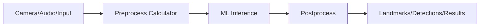

MediaPipe의 기본 단위는 graph, node/calculator, stream, packet입니다.

| 개념 | 의미 |
| --- | --- |
| Graph | 처리 파이프라인 전체 |
| Calculator | 실제 연산 node |
| Stream | packet 흐름 |
| Packet | timestamp가 붙은 데이터 단위 |
| Side packet | 모델/설정처럼 run 동안 고정되는 데이터 |

### 장점

| 장점 | 설명 |
| --- | --- |
| 실시간성 | 카메라/비디오 stream 처리에 적합 |
| on-device | 네트워크 없이 낮은 지연과 privacy 확보 |
| cross-platform | Android, iOS, Web, Python 등 지원 |
| ready-made Tasks | hand, face, pose, gesture 등 빠르게 사용 가능 |
| pipeline 재사용 | calculator graph로 복잡한 전처리/후처리 구성 |
| 가속 | CPU/GPU/TPU 가속 경로 활용 |

### 단점과 한계

| 한계 | 설명 |
| --- | --- |
| 커스텀 graph 난이도 | calculator/graph 개념을 이해해야 함 |
| 디버깅 난이도 | 실시간 stream, timestamp, sync 문제 추적 필요 |
| 모델 한계 | prebuilt task가 모든 도메인/환경을 커버하지 않음 |
| 정확도 한계 | 조명, occlusion, camera angle, motion blur에 취약 가능 |
| 플랫폼 편차 | Web/mobile/desktop별 delegate와 성능 차이 |
| 문서/버전 변화 | legacy Solutions와 Tasks API 흐름을 구분해야 함 |

### 언제 쓰면 좋은가

| 상황 | 추천 |
| --- | --- |
| 손/얼굴/포즈 landmark를 빠르게 붙이고 싶음 | MediaPipe Tasks |
| 실시간 카메라 기반 UX | MediaPipe |
| 완전 custom 모델과 pipeline 최적화 | MediaPipe Framework 또는 TFLite 직접 사용 |
| 서버 대규모 배치 분석 | MediaPipe보다 일반 ML serving/batch pipeline 검토 |

### 근거 URL

- MediaPipe Tasks: https://ai.google.dev/edge/mediapipe/solutions/tasks
- MediaPipe Framework concepts: https://developers.google.com/mediapipe/framework/framework_concepts/overview
- MediaPipe graphs: https://developers.google.com/mediapipe/framework/framework_concepts/graphs
- MediaPipe calculators: https://developers.google.com/mediapipe/framework/framework_concepts/calculators
- MediaPipe paper: https://arxiv.org/abs/1906.08172

## 021. NVIDIA Ray Tracing/RTX와 기존 shader 기반 렌더링 차이

### 질문

> nvidia lay tracing, rtx 와 기존의 쉐이더 기반 렌더링의 차이점

### 용어 정리

여기서 `lay tracing`은 `ray tracing`을 의미하는 것으로 보고 정리합니다.

또한 "기존 shader 기반 렌더링"은 보통 **rasterization + programmable shader pipeline**을 뜻합니다. Ray tracing도 ray generation, closest-hit, miss shader 같은 shader를 쓰므로, 정확히는 `rasterization 기반 렌더링`과 `ray tracing 기반 렌더링`의 차이입니다.

### Rasterization vs Ray Tracing

| 구분 | Rasterization | Ray Tracing |
| --- | --- | --- |
| 기본 발상 | 삼각형을 화면 픽셀로 투영 | 광선이 scene과 어디서 만나는지 추적 |
| 강점 | 매우 빠름, 게임 실시간 렌더링의 전통적 기반 | 반사, 그림자, 굴절, GI가 자연스러움 |
| 약점 | 조명/반사/그림자에 많은 fake/approximation 필요 | 계산량이 매우 큼 |
| 데이터 구조 | draw call, vertex/index buffer, depth buffer | BVH/acceleration structure |
| 대표 shader | vertex/pixel/fragment shader | ray generation, hit, miss shader |
| 성능 특성 | GPU에 잘 맞는 규칙적 병렬 처리 | ray divergence, memory access 비용 큼 |

### RTX란

RTX는 NVIDIA의 real-time ray tracing, AI upscaling/denoising, neural rendering 생태계를 묶어 부르는 브랜드/기술군입니다.

| 구성 | 역할 |
| --- | --- |
| RT Core | BVH traversal, ray-triangle intersection 같은 ray tracing 핵심 연산 가속 |
| Tensor Core | DLSS, denoising, AI reconstruction 등 가속 |
| CUDA/Shader Core | 일반 shading, compute, rasterization 작업 |
| DXR/Vulkan RT/OptiX | API/SDK 계층 |

### 왜 기존 rasterization만으로는 어려운가

Rasterization은 카메라에서 보이는 표면을 빠르게 그리는 데 매우 좋습니다. 하지만 빛이 반사되고, 굴절되고, 다른 물체에 가려지고, 여러 번 튕기는 현상은 직접 계산하기 어렵습니다.

그래서 전통 렌더링은 다음 기법을 많이 씁니다.

| 효과 | Rasterization 근사 |
| --- | --- |
| 그림자 | shadow map |
| 반사 | screen-space reflection, reflection probe |
| 간접광 | lightmap, light probe, SSAO |
| 투명/굴절 | sorting, screen-space trick |

Ray tracing은 광선을 직접 scene에 쏘기 때문에 이런 효과를 더 일관되게 다룰 수 있습니다. 대신 비싸서 real-time에서는 적은 sample + denoising + DLSS 같은 기법을 조합합니다.

### Hybrid Rendering

현대 게임은 대부분 완전한 path tracing만 쓰기보다 hybrid 방식입니다.

```text
Rasterization:
기본 geometry, visibility, 대부분의 material shading

Ray tracing:
reflection, shadow, ambient occlusion, global illumination 일부

AI:
denoising, upscaling, frame generation
```

### 근거 URL

- NVIDIA RTX technology: https://www.nvidia.com/en-us/technologies/rtx/
- NVIDIA ray tracing docs: https://docs.nvidia.com/ray-tracing/index.html
- NVIDIA RTX and DirectX Raytracing introduction: https://developer.nvidia.com/blog/introduction-nvidia-rtx-directx-raytracing/
- NVIDIA path tracing explanation: https://blogs.nvidia.com/blog/2022/03/23/what-is-path-tracing/
- NVIDIA Turing architecture ray tracing: https://developer.nvidia.com/blog/nvidia-turing-architecture-in-depth/

## 022. After Effects 2.5D Parallax 소개

### 질문

> after effect 2.5D parallelX 의 소개
> 종이인형으로 진행하는 인형극과 같은 느낌인데 3차원 무대에서 원근카메라로 촬영하는 기법

### 용어 정리

`parallelX`는 문맥상 **parallax**를 의미하는 것으로 해석했습니다.

After Effects의 **2.5D parallax**는 2D 이미지, 일러스트, 종이 인형 같은 평면 레이어들을 3D 공간의 서로 다른 깊이/Z축에 배치하고, 카메라를 움직여 원근감과 깊이감을 만드는 기법입니다.

완전한 3D 모델링은 아니지만, 카메라 이동에 따라 앞쪽 레이어는 빠르게 움직이고 뒤쪽 레이어는 천천히 움직이므로 입체적인 무대처럼 보입니다.

### 한 줄 비유

종이 인형극 무대를 여러 겹으로 세워두고, 실제 카메라가 그 무대 사이를 이동하면서 찍는 느낌입니다.

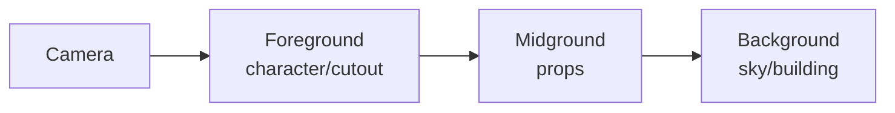

### 2.5D라고 부르는 이유

| 구분 | 설명 |
| --- | --- |
| 2D | 각 오브젝트 자체는 납작한 이미지/영상/shape layer |
| 3D | 레이어에 X/Y/Z 위치, 회전, 카메라, 조명을 적용 |
| 2.5D | 공간 배치는 3D지만 물체 자체는 두께와 뒷면/부피가 거의 없는 평면 |

즉, "평면들을 3D 무대에 세운 것"이므로 2D와 3D의 중간 같은 느낌이 납니다.

### 기본 원리

카메라가 옆으로 이동할 때 가까운 물체와 먼 물체의 화면상 이동량이 다르게 보이는 현상을 parallax라고 합니다.

| 깊이 | 카메라 이동 시 화면 변화 |
| --- | --- |
| 전경 | 크게/빠르게 움직임 |
| 중경 | 중간 정도 움직임 |
| 배경 | 작게/느리게 움직임 |

이 차이가 깊이감을 만듭니다.

### After Effects에서 만드는 기본 순서

1. Photoshop/Illustrator에서 캐릭터, 팔, 다리, 배경, 소품을 레이어별로 분리합니다.
2. After Effects로 가져온 뒤 각 레이어의 `3D Layer` 스위치를 켭니다.
3. 레이어를 Z축으로 배치합니다.
4. 가까운 레이어가 너무 커지거나 작아지면 Scale을 보정합니다.
5. `Layer > New > Camera`로 카메라를 만듭니다.
6. 카메라를 Null Object에 parent해서 dolly, pan, orbit을 제어합니다.
7. 필요하면 Light, Shadow, Depth of Field, Motion Blur를 추가합니다.
8. 캐릭터는 Puppet Pin, Duik, RubberHose, Joysticks 'n Sliders 같은 리깅 도구로 종이인형처럼 움직입니다.

### 무대 배치 예시

```text
Z = -1200  먼 배경 산/하늘
Z = -700   건물/숲
Z = -300   무대 소품
Z = 0      캐릭터 몸통
Z = 80     팔/손/전경 장식
Camera     Z = -1800 쪽에서 바라봄
```

After Effects에서는 카메라/좌표계 설정에 따라 감각이 달라질 수 있으므로, 중요한 것은 숫자 자체보다 **레이어 간 상대적 깊이 차이**입니다.

### 원근카메라 느낌을 만드는 요소

| 요소 | 효과 |
| --- | --- |
| Camera Position | 무대 안을 실제로 이동하는 느낌 |
| Point of Interest | 카메라가 바라보는 중심 |
| Focal Length | 넓은 렌즈는 과장된 원근, 망원은 압축된 원근 |
| Depth of Field | 특정 거리만 선명하게 만들어 실사 카메라 느낌 |
| Motion Blur | 카메라 이동과 종이인형 움직임을 자연스럽게 만듦 |
| Light/Shadow | 평면 레이어에도 무대 조명 같은 느낌 부여 |

### 종이인형극 느낌을 내는 디자인 포인트

| 연출 | 설명 |
| --- | --- |
| 레이어 절단면 유지 | 완벽한 3D보다 종이 오려 붙인 edge를 남기면 인형극 느낌 강화 |
| 관절 분리 | 머리, 몸통, 팔, 손, 다리를 별도 layer로 구성 |
| Anchor point 정리 | 어깨, 팔꿈치, 손목 등 실제 회전축에 anchor 배치 |
| 약간의 그림자 | 레이어 간 거리감이 생김 |
| 카메라 이동은 작게 | 너무 크게 돌면 평면성이 드러남 |
| 정면 위주 회전 | 옆으로 많이 돌리면 종이처럼 얇다는 사실이 노출됨 |

### 장점

| 장점 | 설명 |
| --- | --- |
| 제작 속도 | 3D 모델링 없이 입체감 있는 장면 제작 가능 |
| 스타일 | 동화책, 컷아웃 애니메이션, 종이극, 모션그래픽에 잘 맞음 |
| 수정 용이 | 2D asset을 고치면 바로 반영 가능 |
| 카메라 연출 | 줌/팬/dolly/orbit로 영상적인 느낌을 쉽게 추가 |
| 합성 친화 | After Effects의 text, shape, effects, masks와 잘 결합 |

### 한계

| 한계 | 설명 |
| --- | --- |
| 실제 부피 없음 | 측면에서 보면 레이어가 납작하게 보임 |
| 큰 카메라 회전 취약 | 카메라가 옆/뒤로 돌면 2D 꼼수가 드러남 |
| 깊이 가림 처리 제한 | 복잡한 교차/충돌/occlusion은 수작업 필요 |
| 그림자 품질 제한 | 3D 엔진의 물리 기반 조명과 다름 |
| 캐릭터 회전 한계 | 종이인형처럼 보이는 것은 장점이자 제약 |
| 대규모 scene 관리 | 레이어 수가 많아지면 precomp/continuous rasterization/collapse transform 관리가 복잡 |

### 2.5D Parallax와 진짜 3D의 차이

| 구분 | 2.5D Parallax | 진짜 3D |
| --- | --- | --- |
| 오브젝트 | 평면 이미지/shape/video layer | mesh, material, skeleton |
| 카메라 이동 | 제한적 이동에 강함 | 자유로운 이동 가능 |
| 제작 비용 | 낮음 | 높음 |
| 스타일 | 종이극, 팝업북, 컷아웃 | 실사/게임/제품 시각화 |
| 조명/그림자 | 제한적/합성 중심 | 물리 기반 조명 가능 |
| 적합한 장면 | 일러스트 기반 내러티브, 모션그래픽 | 카메라가 크게 도는 공간, 제품/캐릭터 3D |

### 근거 URL

- Adobe, Use 3D layers in After Effects: https://helpx.adobe.com/after-effects/using/3d-layers.html
- Adobe, Cameras, lights, and points of interest: https://helpx.adobe.com/after-effects/using/cameras-lights-points-interest.html
- Adobe Learn, Animate a camera: https://www.adobe.com/learn/after-effects/web/camera-animation
- Adobe Learn, Advanced 3D renderer: https://www.adobe.com/learn/after-effects/web/work-in-3d
- Adobe Blog, 3D and motion design upgrades in After Effects: https://blog.adobe.com/en/publish/2024/09/10/adobe-introduces-3d-motion-design-upgrades-adobe-after-effects

### 사실 / 추정 / 검증필요

| 분류 | 내용 |
| --- | --- |
| 사실 | Adobe 문서는 After Effects에서 레이어를 3D layer로 전환하고 카메라/조명과 함께 사용할 수 있다고 설명함 |
| 사실 | Adobe 문서는 3D layer가 Material Options를 통해 light/shadow와 상호작용할 수 있다고 설명함 |
| 사실 | Adobe Learn 문서는 one-node/two-node camera와 3D space camera animation을 안내함 |
| 추정 | 사용자가 말한 `parallelX`는 parallax 효과를 의미하는 것으로 해석함 |
| 추정 | 사용자가 묘사한 "종이인형극"은 2D cutout layer를 3D 공간에 배치하는 2.5D stage/camera workflow와 일치함 |
| 검증필요 | 실제 제작에서는 사용할 AE 버전, renderer, asset 해상도, 카메라 회전량, precomp 구조에 따라 세부 workflow가 달라짐 |

## 023. Android ART, DEX, JIT, AOT 설명

### 질문

> android 의 ART DEX JIT AOT 설명

### 핵심 결론

Android 앱의 Kotlin/Java 코드는 최종적으로 **DEX bytecode** 형태로 APK/AAB 안에 들어가고, 기기에서는 **ART(Android Runtime)** 가 이 DEX를 실행합니다.

ART는 실행 성능과 설치 시간, 저장공간, 배터리 사이의 균형을 맞추기 위해 **interpretation, JIT, AOT**를 섞어 사용합니다.

| 용어 | 뜻 | 한 줄 요약 |
| --- | --- | --- |
| DEX | Dalvik Executable | Android용 bytecode 파일 형식 |
| ART | Android Runtime | DEX를 실행하는 Android의 managed runtime |
| JIT | Just-In-Time compilation | 실행 중 자주 쓰는 코드를 native code로 컴파일 |
| AOT | Ahead-Of-Time compilation | 실행 전에 미리 native code로 컴파일 |
| dex2oat | DEX를 OAT/ODEX native artifact로 컴파일하는 도구/과정 | 설치/idle/background 컴파일에 관여 |
| Baseline Profile | 앱이 중요한 코드 경로를 미리 알려주는 profile | 첫 실행부터 AOT 최적화에 도움 |

### 전체 흐름

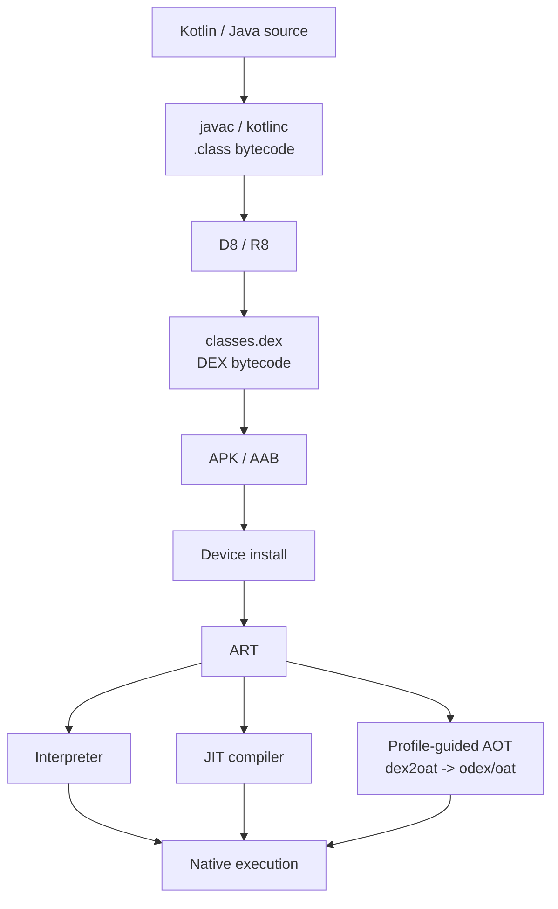

### DEX란

DEX는 Android가 실행하는 bytecode 포맷입니다. 일반 JVM의 `.class` bytecode와 다릅니다.

Android 빌드 도구인 D8/R8은 Java/Kotlin 컴파일 결과를 Android용 DEX bytecode로 바꿉니다.

| 항목 | 설명 |
| --- | --- |
| 파일 | 보통 `classes.dex`, method 수가 많으면 `classes2.dex` 등 multidex |
| 목적 | 모바일/저메모리 환경에 맞춘 bytecode 포맷 |
| 실행 | ART가 interpret/JIT/AOT 방식으로 실행 |
| 포함 위치 | APK/AAB 안에 포함 |

### ART란

ART는 Android Runtime입니다. Android 앱과 일부 system service가 사용하는 managed runtime입니다. ART는 DEX format과 DEX bytecode specification을 실행합니다.

ART는 Dalvik을 대체했습니다. Android 5.0부터 ART가 기본 runtime이 되었고, Android 7부터는 AOT만 고집하지 않고 JIT/AOT/interpretation을 섞는 구조가 중요해졌습니다.

ART가 담당하는 일:

| 역할 | 설명 |
| --- | --- |
| DEX 실행 | interpreter/JIT/AOT compiled code 실행 |
| GC | managed heap garbage collection |
| Class loading | class verification, loading, linking |
| JNI | native C/C++ 코드와 연결 |
| Debug/profile | profiling, stack trace, debugging |
| Compilation | dex2oat, JIT, profile-guided optimization |

### JIT란

JIT는 앱이 실행되는 동안 자주 호출되는 hot code path를 감지하고, 그 부분을 native machine code로 컴파일하는 방식입니다.

```text
앱 첫 실행
-> 우선 interpreter로 DEX 실행
-> ART가 어떤 method가 자주 실행되는지 profile 수집
-> hot method를 JIT로 native code 컴파일
-> 이후 같은 실행 중에는 native code 사용
```

장점:

| 장점 | 설명 |
| --- | --- |
| 설치가 빠름 | 모든 코드를 설치 시점에 컴파일하지 않아도 됨 |
| 실제 사용 패턴 반영 | 실제로 자주 쓰는 코드만 hot하게 최적화 |
| 저장공간 절약 | 전체 AOT보다 compiled artifact를 줄일 수 있음 |

단점:

| 단점 | 설명 |
| --- | --- |
| 첫 실행 warm-up | 처음에는 interpreter/JIT overhead가 있음 |
| 메모리 사용 | JIT code cache와 profiler 비용 |
| 예측 어려움 | 앱 실행 패턴에 따라 성능이 달라질 수 있음 |

### AOT란

AOT는 앱 실행 전에 DEX bytecode를 native machine code로 미리 컴파일하는 방식입니다.

Android에서는 `dex2oat`가 DEX를 OAT/ODEX artifact로 컴파일하는 핵심 경로입니다. `.odex`에는 APK method에 대한 AOT compiled code가 들어갈 수 있습니다.

장점:

| 장점 | 설명 |
| --- | --- |
| 실행 성능 | 실행 시점 컴파일 비용 감소 |
| startup 개선 | 중요한 코드가 미리 native화되어 있으면 시작이 빠름 |
| 배터리 | 실행 중 JIT 비용을 줄일 수 있음 |

단점:

| 단점 | 설명 |
| --- | --- |
| 설치 시간 증가 | 설치/업데이트 시 컴파일 비용 |
| 저장공간 증가 | compiled artifact 저장 필요 |
| 모든 코드 컴파일 낭비 | 거의 안 쓰는 코드까지 컴파일하면 비효율 |

### Android가 JIT와 AOT를 섞는 이유

Android 5의 ART는 AOT 중심이었습니다. 앱 설치 시점에 많이 컴파일하므로 runtime 성능은 좋아지지만, 설치 시간이 길고 저장공간을 더 씁니다.

Android 7부터는 다음 균형을 위해 hybrid 전략을 사용합니다.

| 목표 | 대응 |
| --- | --- |
| 설치 빨리 끝내기 | 모든 코드를 설치 시점에 AOT하지 않음 |
| 첫 실행은 적당히 빠르게 | interpreter + JIT 사용 |
| 반복 실행은 더 빠르게 | profile-guided AOT로 자주 쓰는 코드 미리 컴파일 |
| 저장공간 절약 | hot code 위주 컴파일 |
| 배터리 고려 | device idle/charging 때 background compilation |

공식 AOSP 문서는 Android 7부터 ART가 AOT compilation, JIT compilation, interpretation을 조합하여 사용하고, AOT compilation은 profile-guided일 수 있다고 설명합니다.

### Baseline Profile이 중요한 이유

Baseline Profile은 앱/라이브러리가 "이 코드 경로는 startup과 critical path에 중요하다"는 정보를 미리 제공하는 방식입니다.

Baseline Profile이 없으면 모든 앱 코드가 처음에는 interpreted/JIT 경로를 거치거나, device가 idle일 때 background로 odex에 기록될 수 있습니다. Baseline Profile을 제공하면 새 사용자와 업데이트 직후에도 중요한 코드가 AOT 최적화될 수 있어 startup과 jank 개선에 도움이 됩니다.

### 실행 시나리오

#### 앱 설치 직후

```text
APK 설치
-> DEX 존재
-> 일부 검증/최소 컴파일
-> baseline profile이 있으면 중요한 코드 AOT 가능
```

#### 앱 첫 실행

```text
ART가 DEX 실행
-> 미리 컴파일된 코드는 native로 실행
-> 나머지는 interpreter
-> hot code는 JIT 컴파일
-> profile 수집
```

#### 앱 반복 실행/기기 idle

```text
profile 기반으로 자주 쓰는 코드 파악
-> dex2oat background compilation
-> 다음 실행부터 더 많은 코드가 AOT artifact로 실행
```

### JIT/AOT/Interpreter 비교

| 방식 | 시점 | 장점 | 단점 |
| --- | --- | --- | --- |
| Interpreter | 실행 중 즉시 | 설치 빠름, 단순 | 느림 |
| JIT | 실행 중 hot code 발견 후 | 실제 사용 패턴 최적화 | warm-up, code cache 비용 |
| AOT | 실행 전 | 빠른 실행, startup 개선 | 설치/저장공간 비용 |
| Profile-guided AOT | 사용 profile 확보 후 또는 baseline profile 기반 | 중요한 코드만 미리 최적화 | profile 품질에 의존 |

### Android 개발자가 체감하는 포인트

| 상황 | 관련 개념 |
| --- | --- |
| 앱 첫 실행이 느림 | cold start, baseline profile, AOT 부족 |
| 반복 실행은 빨라짐 | JIT/profile-guided AOT 효과 |
| 업데이트 직후 느려짐 | compiled artifact/profile 재생성 영향 가능 |
| release 빌드는 빠른데 debug가 느림 | debug 설정, minify/optimization, JIT/AOT 조건 차이 |
| library 추가 후 startup 느림 | class loading, dex size, baseline profile, initialization 비용 |

### 근거 URL

- Android platform architecture, ART and DEX: https://developer.android.com/guide/platform
- AOSP, Android runtime and Dalvik: https://source.android.google.cn/docs/core/runtime?hl=en
- AOSP, Configure ART: https://source.android.com/docs/core/runtime/configure
- AOSP, Dalvik executable instruction formats: https://source.android.google.cn/docs/core/runtime/instruction-formats?hl=en
- Android Developers, Baseline Profiles overview: https://developer.android.com/topic/performance/baselineprofiles/overview
- AOSP, dex2oat source tree: https://android.googlesource.com/platform/art/+/master/dex2oat/

### 사실 / 추정 / 검증필요

| 분류 | 내용 |
| --- | --- |
| 사실 | Android Developers 문서는 ART가 DEX 파일을 실행하며, D8 같은 빌드 도구가 Java source를 DEX bytecode로 컴파일한다고 설명함 |
| 사실 | AOSP 문서는 ART가 DEX format과 DEX bytecode specification을 실행한다고 설명함 |
| 사실 | AOSP Configure ART 문서는 Android 7부터 ART가 AOT, JIT, interpretation을 조합하고 AOT가 profile-guided일 수 있다고 설명함 |
| 사실 | Baseline Profiles 공식 문서는 Baseline Profile이 ART가 지정된 코드 경로를 AOT 최적화하게 도와 새 사용자/업데이트에 성능 이점을 준다고 설명함 |
| 추정 | 사용자의 질문 의도는 Android 앱 실행 성능과 빌드/런타임 구조를 이해하려는 것으로 해석함 |
| 검증필요 | 특정 Android 버전/OEM에서의 컴파일 정책은 ART 설정, Play system update, device idle 조건, profile 상태에 따라 달라질 수 있음 |

## 024. Android APK와 AAB 차이점

### 질문

> 안드로이드의 apk aab 의 차이점
> aab 의 장단점
> aab 에 포함되는것 포함되지 않는것

### 핵심 결론

**APK는 Android 기기에 실제로 설치되는 패키지**입니다.

**AAB(Android App Bundle)는 Google Play 같은 스토어에 업로드하는 게시 포맷**입니다. AAB 자체가 기기에 그대로 설치되는 것이 아니라, Google Play나 `bundletool`이 AAB를 바탕으로 기기별 APK 또는 split APK set을 만들어 설치합니다.

| 구분 | APK | AAB |
| --- | --- | --- |
| 풀네임 | Android Package | Android App Bundle |
| 역할 | 설치/배포 가능한 앱 패키지 | 스토어 업로드용 게시 포맷 |
| 기기에 직접 설치 | 가능 | 직접 설치 불가. APK로 변환 필요 |
| 포함 방식 | 필요한 코드/리소스가 한 APK에 들어가거나 split APK로 구성 | 모든 모듈/기기별 리소스를 구조화해 포함 |
| 최적화 | 개발자가 ABI/density/language별 APK를 직접 나누어 관리 가능 | Play가 기기별 optimized APK 생성 |
| 서명 | 개발자가 APK를 직접 서명 | Play 배포 시 Play App Signing이 APK 서명 수행 |
| 사용처 | sideload, 사내 배포, 최종 설치 파일 | Google Play 업로드, bundletool 테스트, 동적 전달 |

### 설치 관점 흐름

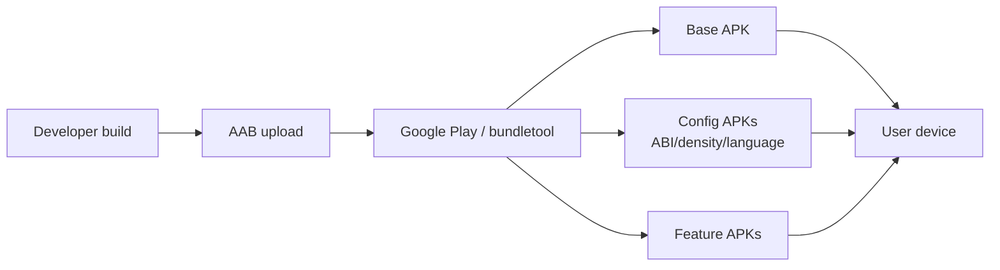

사용자는 AAB를 받는 것이 아니라, 자기 기기에 필요한 APK 조합을 받습니다.

### APK 안에 보통 들어가는 것

Android 공식 문서는 APK가 ZIP archive이며 앱을 구성하는 파일을 포함한다고 설명합니다.

| 항목 | 설명 |
| --- | --- |
| `AndroidManifest.xml` | 앱 이름, version, permission, component, feature requirement |
| `classes.dex` | ART/Dalvik이 이해하는 DEX bytecode |
| `resources.arsc` | 컴파일된 resource table |
| `res/` | 이미지, layout 등 resource 파일 |
| `assets/` | AssetManager로 읽는 raw asset |
| `lib/<abi>/` | ABI별 native `.so` 라이브러리 |
| `META-INF/` | APK signature 관련 파일 |

단일 APK라면 여러 ABI, 여러 화면 밀도, 여러 언어 리소스가 한 파일에 다 들어갈 수 있습니다. 그래서 설치/다운로드 크기가 커질 수 있습니다.

### AAB에 포함되는 것

AAB는 앱 코드를 모듈별로 구조화합니다.

| 항목 | 포함 여부 | 설명 |
| --- | --- | --- |
| `base/` | 포함 | 앱의 기본 모듈. base APK 생성의 원천 |
| feature module directory | 포함 가능 | 동적 기능 모듈. 예: `feature1/`, `camera_feature/` |
| asset pack directory | 포함 가능 | 대형 게임/그래픽 asset용 Play Asset Delivery |
| `manifest/` | 포함 | APK와 달리 module별 manifest를 별도 디렉터리에 저장 |
| `dex/` | 포함 | module별 DEX 파일 저장 |
| `res/` | 포함 | module별 Android resources |
| `lib/` | 포함 | ABI별 native library |
| `assets/` | 포함 | module별 asset |
| `root/` | 포함 가능 | APK root로 옮겨질 파일 |
| `BUNDLE-METADATA/` | 포함 가능 | tool/app store용 metadata |
| `*.pb` protocol buffer files | 포함 | `BundleConfig.pb`, `native.pb`, `resources.pb` 등 bundle/module metadata |

중요한 점은 AAB가 "기기 하나에 그대로 들어갈 최종 패키지"가 아니라, **여러 기기 구성을 위한 원재료와 메타데이터**를 담는다는 것입니다.

### AAB에 포함되지 않거나 최종 APK에 들어가지 않는 것

| 항목 | 설명 |
| --- | --- |
| 최종 기기별 APK 자체 | AAB 안에 완성된 모든 APK가 그대로 들어있는 것이 아니라, Play/bundletool이 생성 |
| 최종 APK signature | Play 배포에서는 APK 생성/서명을 Google Play가 수행 |
| 불필요한 device configuration | 특정 기기에는 맞지 않는 ABI/density/language 리소스가 최종 다운로드에서 제외됨 |
| `BUNDLE-METADATA/` 내용 | AAB에는 포함되지만 앱 APK에는 패키징되지 않음 |
| APK expansion `.obb` | Android App Bundle은 APK expansion file을 지원하지 않음 |
| Play Asset Delivery의 모든 asset을 항상 초기 설치 | delivery mode에 따라 install-time, fast-follow, on-demand로 나뉨 |
| on-demand feature module | install-time이 아니면 초기 설치 APK에 포함되지 않고 나중에 다운로드 |

### AAB 장점

| 장점 | 설명 |
| --- | --- |
| 다운로드 크기 감소 | 사용자 기기에 필요한 ABI/density/language만 받음 |
| 다중 APK 관리 감소 | 개발자가 여러 APK를 직접 빌드/서명/업로드하지 않아도 됨 |
| Dynamic Feature 지원 | 특정 기능을 필요할 때만 다운로드 가능 |
| Play Asset Delivery | 대형 게임 asset을 install-time/fast-follow/on-demand로 전달 |
| 언어/화면/ABI 최적화 | Google Play가 configuration APK를 자동 생성 |
| Play App Signing 연계 | 앱 서명 키 보호와 키 업그레이드 흐름 지원 |
| 설치 성공률 개선 가능 | 다운로드 크기가 줄면 저속망/저용량 기기에서 유리 |

### AAB 단점과 주의점

| 단점/주의 | 설명 |
| --- | --- |
| 직접 설치 불가 | `.aab`는 `adb install app.aab`처럼 바로 설치할 수 없음 |
| Play 의존성 | Google Play 배포에서는 Play가 APK 생성/서명을 담당 |
| sideload 복잡도 | 테스트/외부 배포는 `bundletool`로 APK set 또는 universal APK 생성 필요 |
| split APK 누락 위험 | base/config/feature APK 중 일부만 설치하면 앱이 실패할 수 있음 |
| Play App Signing 필요 | 새 Play 앱에서 AAB 사용 시 Play App Signing이 필요 |
| 디버깅 복잡도 | 실제 사용자 기기에 어떤 APK 조합이 내려갔는지 확인 필요 |
| 동적 모듈 설계 비용 | feature module 경계, base module 의존성 설계를 잘해야 함 |
| `.obb` 미지원 | 기존 OBB 기반 대형 asset 전략은 PAD/PFD로 전환 필요 |
| 비 Play 스토어 대응 | 다른 스토어가 AAB를 지원하지 않으면 APK도 별도 빌드해야 함 |

### Split APK 종류

AAB에서 생성되는 APK 조합은 대략 다음과 같습니다.

| 종류 | 설명 |
| --- | --- |
| Base APK | 앱 기본 기능. 전체 manifest 선언과 공통 코드/리소스 포함 |
| Configuration APK | ABI, 화면 density, language 같은 기기 구성별 코드/리소스 |
| Feature module APK | 동적 기능 모듈용 APK |
| Multi-APK | split APK를 지원하지 않는 구형 기기용 최적화 APK |
| Universal APK | bundletool로 만들 수 있는 테스트/공유용 단일 APK. 크기가 큼 |

### 예시

앱이 다음 리소스를 지원한다고 가정합니다.

```text
ABI: arm64-v8a, armeabi-v7a, x86_64
Density: mdpi, hdpi, xhdpi, xxhdpi
Language: ko, en, ja
Feature: camera feature, editor feature
```

단일 APK 방식이면 한 파일에 여러 ABI, density, language, feature 코드가 모두 들어갈 수 있습니다.

AAB 방식이면 `arm64-v8a`, `xxhdpi`, `ko`인 기기에는 그 조합에 필요한 APK만 내려갑니다. `x86_64` 라이브러리나 일본어 리소스, 아직 쓰지 않는 on-demand feature는 초기 설치에서 빠질 수 있습니다.

### APK/AAB 실무 명령

Android Studio:

```text
Build > Generate Signed Bundle / APK
```

bundletool로 AAB에서 APK set 생성:

```bash
bundletool build-apks \
  --bundle=app-release.aab \
  --output=app-release.apks
```

연결된 기기에 맞는 APK set 생성:

```bash
bundletool build-apks \
  --connected-device \
  --bundle=app-release.aab \
  --output=app-release.apks
```

APK set 설치:

```bash
bundletool install-apks --apks=app-release.apks
```

단일 universal APK 생성:

```bash
bundletool build-apks \
  --mode=universal \
  --bundle=app-release.aab \
  --output=app-universal.apks
```

### 선택 기준

| 상황 | 권장 |
| --- | --- |
| Google Play 새 앱 배포 | AAB |
| Google Play 최적화 다운로드 | AAB |
| 사내 테스트/수동 설치 | APK 또는 bundletool로 생성한 APK set |
| Play 외부 스토어가 AAB 미지원 | APK 별도 빌드 |
| 대형 게임 asset | AAB + Play Asset Delivery |
| 기능을 나중에 설치 | AAB + Play Feature Delivery |

### 근거 URL

- About Android App Bundles: https://developer.android.com/guide/app-bundle
- Android App Bundle format: https://developer.android.com/guide/app-bundle/app-bundle-format
- Reduce your app size, App Bundle and APK structure: https://developer.android.com/topic/performance/reduce-apk-size
- bundletool documentation: https://developer.android.com/tools/bundletool
- Android App Bundle FAQ: https://developer.android.com/guide/app-bundle/faq

### 사실 / 추정 / 검증필요

| 분류 | 내용 |
| --- | --- |
| 사실 | Android 공식 문서는 AAB가 앱의 compiled code와 resources를 포함하고 APK generation/signing을 Google Play로 지연하는 publishing format이라고 설명함 |
| 사실 | Google Play는 AAB에서 device configuration별 optimized APK를 생성해 사용자가 필요한 code/resources만 다운로드하게 한다고 설명함 |
| 사실 | AAB format 문서는 `base/`, feature module directory, asset pack, `BUNDLE-METADATA/`, `manifest/`, `dex/`, `res/`, `lib/`, `assets/`, `root/`, `*.pb` 파일을 설명함 |
| 사실 | `BUNDLE-METADATA/` 파일은 AAB에는 들어가지만 앱 APK에는 패키징되지 않는다고 문서화되어 있음 |
| 사실 | Android App Bundles는 APK expansion `.obb` 파일을 지원하지 않는다고 문서화되어 있음 |
| 추정 | 사용자의 질문 의도는 Android 배포 포맷과 Play 배포/사이드로드의 차이를 이해하려는 것으로 해석함 |
| 검증필요 | 실제 프로젝트에서는 사용 중인 스토어, Play App Signing 상태, asset 용량, dynamic feature 구조, Unity/Flutter/Native 빌드 설정을 별도 확인해야 함 |

## 025. Android Doze, Foreground Service, Background Service

### 질문

> 안드로이드에서
> doze 모드 foreground service, background service 설명

### 핵심 결론

Android는 배터리를 아끼기 위해 앱이 보이지 않는 상태에서 마음대로 계속 실행되는 것을 강하게 제한합니다.

| 개념 | 한 줄 설명 |
| --- | --- |
| Doze | 기기가 오래 idle 상태일 때 네트워크, wakelock, alarm, job/sync를 지연시키는 절전 모드 |
| App Standby | 사용자가 한동안 쓰지 않은 앱을 idle로 보고 background network/job/sync를 제한 |
| Background service | 사용자에게 보이지 않는 service. Android 8.0+에서 background 실행 제한이 큼 |
| Foreground service | 상태바 notification을 띄우고 사용자가 인지하는 작업을 지속하는 service |
| WorkManager/JobScheduler | 지연 가능하고 조건 기반인 background 작업에 권장되는 API |

짧게 말하면:

- **즉시 끝나는 화면 내부 작업**: coroutine/thread/asynchronous work
- **언젠가 해도 되는 백그라운드 작업**: WorkManager/JobScheduler
- **사용자가 지금 진행 중임을 알아야 하는 중단 불가 작업**: Foreground Service
- **계속 몰래 도는 background service**: 현대 Android에서는 피해야 함

### Doze 모드란

Doze는 기기가 전원에 연결되어 있지 않고, 화면이 꺼져 있고, 일정 시간 움직임이 없을 때 배터리 절약을 위해 들어가는 idle 모드입니다.

Doze에서 Android는 다음을 제한합니다.

| 제한 | 설명 |
| --- | --- |
| network access | 앱의 일반 네트워크 접근이 중단/지연될 수 있음 |
| wakelock | 앱이 잡은 wakelock을 무시 |
| AlarmManager | 일반 `setExact()`, `setWindow()` alarm을 maintenance window로 지연 |
| JobScheduler | job 실행 지연 |
| SyncAdapter | sync 지연 |
| Wi-Fi scan | 수행하지 않음 |

Doze는 완전 정지가 아니라, 주기적으로 **maintenance window**를 열어 밀린 작업을 일부 수행하게 합니다. 시간이 길어질수록 maintenance window 간격이 길어질 수 있습니다.

### Doze 대응 방식

| 요구 | 권장 |
| --- | --- |
| 일반 데이터 동기화 | WorkManager/JobScheduler |
| 꼭 특정 시점에 울려야 하는 alarm | `setExactAndAllowWhileIdle()` 또는 `setAndAllowWhileIdle()` |
| 사용자가 꼭 즉시 봐야 하는 메시지 | FCM high priority + user-visible notification |
| 실시간 소켓을 계속 유지 | 가능하면 FCM으로 대체 |
| Doze 면제 요청 | 핵심 기능이 깨질 때만, Play 정책 주의 |

Android 공식 문서는 `setAndAllowWhileIdle()`과 `setExactAndAllowWhileIdle()`도 앱당 9분에 한 번보다 더 자주 발동할 수 없다고 안내합니다.

### Background Service란

Background service는 사용자가 앱 화면을 보고 있지 않고, foreground service notification도 없는 상태에서 도는 service입니다.

Android 8.0(API 26)부터 background service는 강하게 제한됩니다. 앱이 idle 상태가 되면 background service 사용에 제한이 생기며, 많은 경우 `JobScheduler`나 `WorkManager`로 바꾸는 것이 권장됩니다.

| Android 버전/정책 | 영향 |
| --- | --- |
| Android 8.0+ | background service 제한, `startService()`가 허용되지 않는 상황에서 `IllegalStateException` 가능 |
| Android 8.0+ | foreground service를 시작할 때 `startForegroundService()` 사용 후 짧은 시간 안에 `startForeground()` 호출 필요 |
| Android 12+ | 앱이 background 상태이면 foreground service 시작도 기본적으로 금지, 예외 케이스만 허용 |
| Android 14+ | foreground service type과 type별 permission 선언 필요 |
| Android 15+ | 일부 foreground service type에 실행 시간 제한 추가 |

예전 방식:

```kotlin
startService(Intent(this, SyncService::class.java))
```

현대 Android에서는 주기적/지연 가능한 동기화라면 보통:

```kotlin
WorkManager.getInstance(context).enqueue(workRequest)
```

쪽을 먼저 검토합니다.

### Foreground Service란

Foreground service는 사용자가 앱을 직접 보고 있지 않아도, 사용자가 인지할 수 있는 중요한 작업을 계속 수행하기 위한 service입니다. 반드시 상태바 notification을 표시해야 합니다.

대표 예:

| 적합한 사용 | 설명 |
| --- | --- |
| 음악 재생 | 앱을 내려도 음악이 계속 재생 |
| 운동 기록 | 사용자가 시작한 러닝/자전거 기록 |
| 길찾기/navigation | 사용자가 진행 중인 이동 안내 |
| 통화/VoIP | 사용자가 참여 중인 통화 |
| 파일 업로드/다운로드 | 사용자가 시작했고 중단되면 안 되는 전송 |

부적합한 사용:

| 부적합 | 이유 |
| --- | --- |
| 앱이 죽지 않게 붙잡기 | Android 공식 문서도 idle 판정을 막기 위해 FGS를 쓰지 말라고 안내 |
| 조용한 주기 동기화 | WorkManager/JobScheduler가 적합 |
| 광고/추적/분석 | 사용자 인지성과 필요성이 낮음 |
| 낮은 중요도 notification을 띄우는 작업 | 다른 background work option 검토 |

### Foreground Service 시작 흐름

Android 8.0+에서 background service를 만든 뒤 나중에 foreground로 올리는 방식은 문제가 됩니다. 새 foreground service는 `startForegroundService()`로 시작하고, 생성 후 제한 시간 안에 `startForeground()`를 호출해 notification을 보여야 합니다.

```kotlin
ContextCompat.startForegroundService(
    context,
    Intent(context, UploadService::class.java)
)
```

Service 내부:

```kotlin
class UploadService : Service() {
    override fun onStartCommand(intent: Intent?, flags: Int, startId: Int): Int {
        startForeground(NOTIFICATION_ID, buildNotification())
        // 실제 업로드 작업 시작
        return START_NOT_STICKY
    }
}
```

Android 8.0 문서는 `startForegroundService()` 후 `startForeground()`를 5초 안에 호출하지 않으면 시스템이 service를 중지하고 ANR로 처리한다고 설명합니다.

### Android 12+ 백그라운드 시작 제한

Android 12(API 31)+를 target하는 앱은 앱이 background 상태일 때 foreground service를 마음대로 시작할 수 없습니다. 예외가 아니면 `ForegroundServiceStartNotAllowedException`이 발생합니다.

허용 예외의 대표 사례:

| 예외 | 설명 |
| --- | --- |
| 사용자가 notification/widget/activity 등 앱 UI와 상호작용 | 사용자 동작으로 시작된 작업 |
| high priority FCM 수신 | 시간 민감하고 사용자에게 notification을 보여야 하는 경우 |
| exact alarm으로 사용자 요청 작업 완료 | 사용자가 요청한 alarm 관련 작업 |
| geofencing/activity recognition 이벤트 | 위치/활동 이벤트 |
| reboot/package replaced 등 일부 broadcast | 버전별/타입별 추가 제한 있음 |
| companion device | companion 권한/역할 기반 |
| battery optimization off | 사용자가 최적화를 끈 경우 |

### Android 14+ foreground service type

Android 14를 target하면 foreground service type을 manifest에 선언해야 합니다.

예:

```xml
<uses-permission android:name="android.permission.FOREGROUND_SERVICE" />
<uses-permission android:name="android.permission.FOREGROUND_SERVICE_LOCATION" />

<service
    android:name=".RunTrackingService"
    android:foregroundServiceType="location"
    android:exported="false" />
```

대표 type:

| type | 예 |
| --- | --- |
| `camera` | background camera 사용이 필요한 사용자 인지 작업 |
| `connectedDevice` | BLE/USB/NFC 등 연결 장치 작업 |
| `dataSync` | 사용자 인지 데이터 전송 |
| `health` | 운동/건강 센서 |
| `location` | navigation, workout tracking |
| `mediaPlayback` | 음악/영상 재생 |
| `mediaProjection` | 화면 캡처/공유 |
| `microphone` | 녹음/통화 |
| `phoneCall` | 통화 |
| `remoteMessaging` | 다른 기기로 메시지 전달 |
| `shortService` | 짧게 끝나는 중요 작업 |

Android 14+에서는 type 누락 시 `MissingForegroundServiceTypeException`, type별 permission 누락 시 `SecurityException`이 날 수 있습니다.

### Android 15+ timeout

Android 15+를 target하면 일부 foreground service type은 background 상태에서 실행 시간 제한을 받습니다.

| type | 제한 |
| --- | --- |
| `dataSync` | 24시간 동안 총 6시간 |
| `mediaProcessing` | 24시간 동안 총 6시간 |
| `shortService` | 더 짧고 엄격한 제한 |

timeout이 오면 `Service.onTimeout(int, int)`가 호출되고, service가 곧 `stopSelf()`하지 않으면 crash로 이어질 수 있습니다.

### Background Service vs Foreground Service vs WorkManager

| 항목 | Background Service | Foreground Service | WorkManager |
| --- | --- | --- | --- |
| 사용자 인지 | 없음 | notification으로 인지 가능 | 보통 없음, long-running worker는 notification 가능 |
| 즉시성 | 현대 Android에서 제한 큼 | 사용자 인지 작업이면 즉시성 높음 | 지연 가능 작업에 적합 |
| Doze 영향 | 큼 | App Standby idle 판정에서는 foreground로 취급되지만, 남용 금지와 type/권한/timeout 제한 있음 |
| 적합 작업 | 앱 화면 안에서만 짧게 처리되는 내부 service 정도 | 음악, 운동, navigation, 통화, 사용자 시작 전송 | sync, upload retry, cleanup, periodic work |
| Play 정책 | 남용 시 위험 | type/사용자 영향 설명 필요 | 일반적으로 권장 |

### 실무 설계 가이드

| 원하는 것 | 권장 설계 |
| --- | --- |
| 앱 화면에서 버튼 누른 뒤 짧은 API 호출 | ViewModel coroutine / async work |
| 앱이 닫혀도 언젠가 동기화 | WorkManager |
| 충전 중/Wi-Fi에서 대용량 업로드 | WorkManager constraints |
| 사용자가 시작한 업로드를 중단 없이 진행 | Foreground service 또는 WorkManager long-running worker |
| 채팅 수신 | 자체 persistent socket보다 FCM 우선 |
| 알람/캘린더처럼 정확한 시간 | Exact alarm API, 권한/정책 확인 |
| 음악/운동/길찾기 | Foreground service |
| 항상 위치 추적 | background location permission + FGS type + Play 정책 + OEM 제약 모두 확인 |

### Doze 테스트 명령

공식 문서는 adb로 Doze와 App Standby를 강제로 테스트하는 방법을 안내합니다.

```bash
adb shell dumpsys deviceidle force-idle
adb shell dumpsys deviceidle unforce
adb shell dumpsys battery reset
```

App Standby 테스트:

```bash
adb shell dumpsys battery unplug
adb shell am set-inactive <packageName> true
adb shell am set-inactive <packageName> false
adb shell am get-inactive <packageName>
```

### 근거 URL

- Android Doze and App Standby: https://developer.android.com/training/monitoring-device-state/doze-standby
- Android Background execution limits: https://developer.android.com/about/versions/oreo/background.html
- Android Background tasks overview: https://developer.android.com/develop/background-work/background-tasks
- Android Services overview: https://developer.android.com/develop/background-work/services
- Android Foreground services overview: https://developer.android.com/develop/background-work/services/fgs
- Android restrictions on starting foreground services from background: https://developer.android.com/develop/background-work/services/fgs/restrictions-bg-start
- Android foreground service types required: https://developer.android.com/about/versions/14/changes/fgs-types-required
- Android foreground service timeout: https://developer.android.com/develop/background-work/services/fgs/timeout

### 사실 / 추정 / 검증필요

| 분류 | 내용 |
| --- | --- |
| 사실 | Android 공식 문서는 Doze에서 network access가 suspended되고 wakelock이 ignored되며 일반 AlarmManager alarm, jobs, syncs가 지연된다고 설명함 |
| 사실 | Android 8.0+ 공식 문서는 idle app의 background service 사용 제한과 JobScheduler 대체를 설명함 |
| 사실 | Android 8.0+에서는 `startForegroundService()` 후 제한 시간 안에 `startForeground()`로 notification을 표시해야 함 |
| 사실 | Android 12+ target app은 background 상태에서 foreground service 시작이 기본적으로 제한되며 예외가 아니면 `ForegroundServiceStartNotAllowedException`이 발생함 |
| 사실 | Android 14+ target app은 foreground service type과 관련 permission 선언이 필요함 |
| 사실 | Android 15+ target app은 `dataSync`, `mediaProcessing` foreground service가 background 상태에서 24시간당 6시간 제한을 받음 |
| 추정 | 사용자의 질문 의도는 장기 실행/백그라운드 작업 설계에서 어떤 API를 선택해야 하는지 이해하려는 것으로 해석함 |
| 검증필요 | 실제 동작은 Android 버전, targetSdk, OEM 배터리 정책, Play 정책, permission 상태, foreground service type에 따라 기기별 테스트 필요 |

## 026. Android SurfaceView, GLSurfaceView, TextureView 차이점

### 질문

> 안드로이드에서 SurfaceView, GLSurfaceView, TextureView 차이점

### 핵심 결론

세 클래스는 모두 "동영상, 카메라 preview, OpenGL 렌더링처럼 일반 View drawing과 다른 고성능 화면 출력"에 쓰이지만, 화면에 합성되는 방식이 다릅니다.

| 클래스 | 한 줄 요약 |
| --- | --- |
| `SurfaceView` | 별도 Surface/composition layer를 View hierarchy 안에 끼워 넣는 고성능 출력 View |
| `GLSurfaceView` | OpenGL ES 렌더링을 쉽게 하기 위해 SurfaceView 위에 EGL/context/render thread 관리를 얹은 helper View |
| `TextureView` | SurfaceTexture 내용을 일반 View처럼 View hierarchy 안에서 GPU로 합성하는 View |

짧게 선택하면:

- **동영상/카메라/게임처럼 성능과 배터리가 중요**하면 `SurfaceView`
- **OpenGL ES를 빠르게 붙이고 싶고 EGL/thread를 직접 관리하기 싫으면** `GLSurfaceView`
- **회전, 알파, scale, clip, View animation과 자연스럽게 섞어야 하면** `TextureView`

### 구조 차이

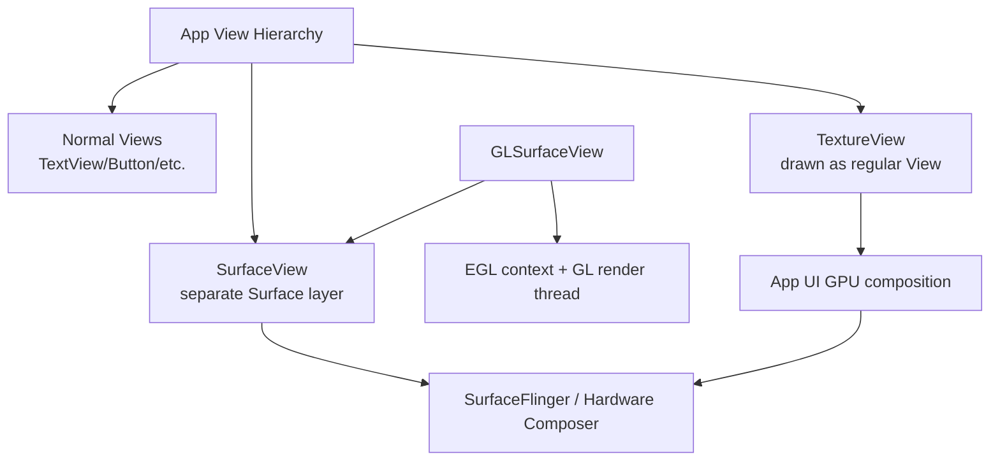

### SurfaceView

`SurfaceView`는 View hierarchy 안에 들어가지만, 실제 콘텐츠는 앱 UI buffer와 다른 **별도 Surface**에 그려집니다. 이 Surface는 `SurfaceFlinger`/Hardware Composer가 앱 UI layer와 함께 합성합니다.

장점:

| 장점 | 설명 |
| --- | --- |
| 성능 | media decoder, camera, OpenGL output을 별도 layer로 직접 합성할 수 있어 copy/composite 비용이 적음 |
| 배터리 | hardware overlay를 사용할 수 있으면 동영상 재생에서 효율적 |
| DRM/HDR | 공식 문서는 DRM protected video는 overlay plane에서만 표시 가능하므로 SurfaceView를 써야 한다고 설명 |
| 장시간 영상 | video player, camera preview, game rendering에 일반적으로 적합 |

단점:

| 단점 | 설명 |
| --- | --- |
| View transform 제약 | 과거 버전에서는 translate/scale/alpha/rotation 조합에서 artifact가 생기기 쉬웠음 |
| lifecycle 복잡성 | Activity lifecycle과 Surface lifecycle이 별도라 `surfaceCreated/Changed/Destroyed` 처리 필요 |
| overlay 제약 | SurfaceView 위에 UI를 얹으면 alpha-blended composite 비용이 생길 수 있음 |
| 여러 SurfaceView | 하드웨어 overlay 수 제한 때문에 여러 개를 많이 쓰면 비효율 가능 |

중요한 lifecycle:

```text
Activity: onCreate -> onResume
Surface:  surfaceCreated -> surfaceChanged

Back:
Activity: onPause
Surface:  surfaceDestroyed
```

하지만 화면 꺼짐 같은 상황에서는 `onPause()`만 오고 Surface가 유지될 수도 있습니다. 그래서 Surface 상태와 Activity 상태를 분리해서 생각해야 합니다.

### GLSurfaceView

`GLSurfaceView`는 `SurfaceView`의 subclass입니다. OpenGL ES를 쓰기 위해 필요한 EGL display/context/surface, render thread, Renderer callback, pause/resume 처리를 대신 관리해 줍니다.

공식 문서상 GLSurfaceView가 제공하는 기능:

| 기능 | 설명 |
| --- | --- |
| Surface 관리 | OpenGL이 그릴 dedicated surface 관리 |
| EGL 관리 | EGL display/context/surface 설정 |
| Renderer 위임 | `GLSurfaceView.Renderer`가 실제 GL 호출 수행 |
| Render thread | UI thread와 분리된 전용 렌더링 thread |
| render mode | continuous rendering 또는 `requestRender()` 기반 on-demand rendering |
| lifecycle helper | `onPause()`, `onResume()`로 GL thread/context 정리 |

기본 사용:

```kotlin
class MyGLView(context: Context) : GLSurfaceView(context) {
    init {
        setEGLContextClientVersion(2)
        setRenderer(MyRenderer())
        renderMode = RENDERMODE_CONTINUOUSLY
    }
}
```

```kotlin
class MyRenderer : GLSurfaceView.Renderer {
    override fun onSurfaceCreated(gl: GL10?, config: EGLConfig?) {
        // shader/program/texture 초기화
    }

    override fun onSurfaceChanged(gl: GL10?, width: Int, height: Int) {
        GLES20.glViewport(0, 0, width, height)
    }

    override fun onDrawFrame(gl: GL10?) {
        // draw
    }
}
```

장점:

| 장점 | 설명 |
| --- | --- |
| OpenGL 입문/일반 렌더링에 편함 | EGL/context/thread boilerplate 감소 |
| UI thread 분리 | Renderer가 별도 thread에서 호출됨 |
| pause/resume 처리 | Activity lifecycle에 맞춰 rendering thread와 EGL context 처리 |
| on-demand rendering | 정적 화면이면 `RENDERMODE_WHEN_DIRTY`로 전력 절약 가능 |

단점:

| 단점 | 설명 |
| --- | --- |
| 유연성 제한 | 복잡한 EGL 공유 context, multi-surface, custom swapchain에는 방해될 수 있음 |
| SurfaceView 제약 상속 | 별도 Surface 특성, View transform/overlay 고려 필요 |
| GL thread 통신 필요 | UI 이벤트를 GL thread에 안전하게 넘겨야 하며 `queueEvent()` 등을 사용 |
| Vulkan/modern graphics에는 부적합 | OpenGL ES helper이므로 Vulkan은 별도 Surface/ANativeWindow 흐름 필요 |

### TextureView

`TextureView`는 `SurfaceTexture`를 감싼 View입니다. 카메라 preview, video, OpenGL scene 같은 content stream을 표시할 수 있습니다. SurfaceView와 달리 별도 window/layer를 만들지 않고 일반 View처럼 동작합니다.

장점:

| 장점 | 설명 |
| --- | --- |
| View transform 친화 | alpha, rotation, scale, clipping, animation이 일반 View처럼 잘 맞음 |
| 복잡한 UI 합성 | RecyclerView item 안의 preview, 카드 회전, transition 등에 유리 |
| aspect ratio 처리 | `setTransform()` matrix로 scale/crop 조정이 쉬움 |
| SurfaceTexture 재사용 | orientation change 때 SurfaceTexture를 유지하는 패턴 가능 |

단점:

| 단점 | 설명 |
| --- | --- |
| 성능 비용 | 내부 surface 내용을 View로 copy/composite해야 해서 SurfaceView보다 느릴 수 있음 |
| hardware acceleration 필요 | software rendering에서는 아무것도 그리지 않음 |
| DRM 제한 | 공식 문서는 DRM protected video는 SurfaceView 필요하다고 설명 |
| producer 1개 | 카메라 preview에 쓰고 있으면 동시에 `lockCanvas()`로 그리는 식의 다중 producer 사용 불가 |
| GL stall 가능 | GLES producer/consumer thread 구성이 나쁘면 buffer swap stall/fail 가능 |

기본 lifecycle:

```kotlin
textureView.surfaceTextureListener = object : TextureView.SurfaceTextureListener {
    override fun onSurfaceTextureAvailable(st: SurfaceTexture, w: Int, h: Int) {
        val surface = Surface(st)
        // MediaPlayer / Camera / EGL target으로 전달
    }

    override fun onSurfaceTextureDestroyed(st: SurfaceTexture): Boolean {
        // true면 TextureView가 SurfaceTexture release
        // false면 앱이 직접 유지/해제 책임
        return true
    }

    override fun onSurfaceTextureSizeChanged(st: SurfaceTexture, w: Int, h: Int) {}
    override fun onSurfaceTextureUpdated(st: SurfaceTexture) {}
}
```

### 비교표

| 항목 | SurfaceView | GLSurfaceView | TextureView |
| --- | --- | --- | --- |
| 기반 | `View` + 별도 `Surface` | `SurfaceView` subclass | `View` + `SurfaceTexture` |
| 주요 목적 | video/camera/GL 등 고성능 surface 출력 | OpenGL ES 렌더링 편의 | View transform이 필요한 video/camera/GL 출력 |
| 합성 방식 | SurfaceFlinger가 별도 layer 합성 | SurfaceView와 동일 | 앱 UI hierarchy 안에서 GPU 합성 |
| 성능 | 보통 가장 좋음 | SurfaceView 수준, GL helper 비용 약간 | copy/composite 비용으로 상대적으로 불리 |
| alpha/rotation/clip | 최신 버전에서 개선됐지만 TextureView가 더 자연스러움 | SurfaceView 제약 상속 | 강함 |
| DRM video | 적합 | 일반적으로 video용은 아님 | 부적합 |
| HDR | SurfaceView가 유리 | GL content라 별도 고려 | 제한적 |
| OpenGL ES | 직접 EGL 설정 필요 | 가장 쉬움 | 가능하지만 EGL/thread 직접 관리 필요 |
| Render thread | 직접 관리 | 내장 GL thread | 직접 관리 |
| lifecycle | `SurfaceHolder.Callback` | `onPause/onResume` + Renderer | `SurfaceTextureListener` |
| 추천 용도 | video player, camera preview, game engine surface | OpenGL ES 앱/간단한 GL renderer | animation이 필요한 preview, UI와 섞이는 video/camera |

### 선택 기준

| 상황 | 추천 |
| --- | --- |
| 일반 동영상 플레이어 | `SurfaceView` |
| DRM protected video | `SurfaceView` |
| 카메라 preview를 가장 효율적으로 표시 | `SurfaceView` 또는 CameraX `PreviewView` 기본 선택에 맡김 |
| 카메라 preview를 회전/알파/클리핑/카드 UI에 넣음 | `TextureView` |
| OpenGL ES 샘플/게임/시각화 | `GLSurfaceView` |
| OpenGL ES + 복잡한 EGL 공유 context/multi surface | plain `SurfaceView` + 직접 EGL 관리 |
| ViewPager/RecyclerView 안에서 작은 video preview | `TextureView` 검토 |
| WebRTC/video conferencing local preview 여러 개 | 상황에 따라 `TextureView`, 성능 중요하면 `SurfaceView` |

### 실무에서 자주 겪는 문제

| 문제 | 원인/대응 |
| --- | --- |
| SurfaceView가 View transform과 어긋남 | 별도 Surface layer 특성. Android N 이후 개선됐지만 구버전 고려 |
| SurfaceView 위 overlay가 느림 | alpha-blended composite 비용 가능 |
| TextureView가 느림 | 내부 copy/composite 비용. 성능 중요하면 SurfaceView 검토 |
| TextureView가 안 보임 | hardware acceleration 꺼짐 가능 |
| GL thread에서 UI 접근 crash | GLSurfaceView Renderer는 별도 thread. UI 작업은 main thread로 전달 |
| orientation change 때 surface 재생성 | Surface lifecycle과 Activity lifecycle 분리 처리 |

### 근거 URL

- Android SurfaceView API: https://developer.android.com/reference/android/view/SurfaceView
- Android TextureView API: https://developer.android.com/reference/android/view/TextureView
- Android GLSurfaceView API: https://developer.android.com/reference/android/opengl/GLSurfaceView
- Android GLSurfaceView.Renderer API: https://developer.android.com/reference/android/opengl/GLSurfaceView.Renderer
- AOSP, SurfaceView and GLSurfaceView: https://source.android.com/docs/core/graphics/arch-sv-glsv
- AOSP, TextureView: https://source.android.com/docs/core/graphics/arch-tv
- Android OpenGL ES guide: https://developer.android.com/guide/topics/graphics/opengl.html

### 사실 / 추정 / 검증필요

| 분류 | 내용 |
| --- | --- |
| 사실 | Android API 문서는 SurfaceView가 View hierarchy 안의 dedicated drawing surface를 제공한다고 설명함 |
| 사실 | AOSP 문서는 SurfaceView가 별도 composition layer를 제공하고 SurfaceFlinger가 직접 합성해 extra work를 줄인다고 설명함 |
| 사실 | Android API 문서는 GLSurfaceView가 SurfaceView를 상속하고 dedicated surface에 OpenGL rendering을 표시한다고 설명함 |
| 사실 | Android API 문서는 GLSurfaceView가 EGL display/context와 render thread, Renderer callback을 관리한다고 설명함 |
| 사실 | Android API 문서는 TextureView가 camera preview, video, OpenGL scene 같은 content stream 표시가 가능하고 hardware accelerated window에서만 동작한다고 설명함 |
| 사실 | Android API 문서는 TextureView가 별도 window를 만들지 않아 alpha/rotation/clipping에 유리하지만 내부 copy 때문에 SurfaceView보다 느릴 수 있다고 설명함 |
| 사실 | Android API 문서는 DRM protected video는 SurfaceView로 구현해야 한다고 설명함 |
| 추정 | 사용자의 질문 의도는 Android에서 영상/카메라/GL 출력 View를 선택하려는 것으로 해석함 |
| 검증필요 | 실제 선택은 Android 버전, target device, camera/video/GL pipeline, UI transform 필요성, DRM/HDR 요구사항으로 실측해야 함 |

## 027. 카메라/라이브 스트리밍에서 프레임 timestamp가 0이 아닌 값부터 시작하는 경우

### 질문

> 멀티미디어에서 
> 카메라 촬영할때 혹은 라이브 스트리밍 rtmp 퍼블리시 할때
> 각 프레임의 타임스탬프가 0부터 시작하는 것으로 알고 있는데
> 0이 아닌값부터 시작할때가 있는가?

### 핵심 결론

있습니다.

다만 "timestamp가 0부터 시작한다"는 말은 보통 **파일/스트림 세션 내부의 presentation timeline을 0으로 정규화한다**는 뜻입니다. 카메라 센서가 주는 원본 timestamp나 RTP/RTMP/인코더 내부 timestamp는 0이 아닌 큰 값에서 시작할 수 있습니다.

| 계층 | timestamp 의미 | 0부터 시작? |
| --- | --- | --- |
| 카메라 센서/프레임 | 노출/프레임 생성 시각, monotonic clock/boottime 기반 | 보통 0 아님 |
| 인코더 입력 PTS | 앱이 인코더에 넘기는 presentation time | 앱 설계에 따라 다름 |
| MediaMuxer/파일 timeline | 파일 안의 sample presentation time | 보통 0 기반 권장, 하지만 non-zero 가능 |
| RTMP message timestamp | RTMP message/chunk stream의 media timestamp, ms 단위 | 관례상 0 기반이 안전하지만 spec상 임의 시작 가능 |
| FLV file tag timestamp | 첫 tag 기준 상대 timestamp | Adobe FLV spec은 첫 tag timestamp가 0이라고 설명 |
| RTP timestamp | media clock 기반 timestamp | 일반적으로 랜덤/임의 시작값 |

### 왜 0이 아닌 값이 나오나

#### 1. 카메라 timestamp는 "녹화 시작 후 경과시간"이 아닐 수 있음

Android Camera2의 `SENSOR_TIMESTAMP`는 nanoseconds 단위의 monotonic timestamp입니다. `SENSOR_INFO_TIMESTAMP_SOURCE`가 `REALTIME`이면 `elapsedRealtimeNanos()`와 같은 timebase로 센서 timestamp를 다룰 수 있습니다. `UNKNOWN`이면 같은 camera device 안에서 비교 가능한 monotonic timestamp지만 다른 time source와 직접 비교는 보장되지 않습니다.

즉, 첫 프레임 timestamp가 다음처럼 큰 값일 수 있습니다.

```text
cameraFrame.timestamp = 48,382,912,345,678 ns
```

이 값은 "촬영 시작 후 48,382초"라는 뜻이 아니라, 시스템 부팅 후 경과 시간 같은 monotonic timebase 위의 값일 수 있습니다.

RTMP로 보낼 때는 보통:

```kotlin
val firstNs = firstCameraTimestampNs
val rtmpTimestampMs = (cameraTimestampNs - firstNs) / 1_000_000
```

처럼 첫 프레임 기준으로 0부터 다시 맞춥니다.

#### 2. 인코더 PTS는 앱이 정한다

Android `MediaCodec`의 `presentationTimeUs`는 해당 buffer가 재생/표시되어야 하는 media time입니다. ByteBuffer 입력 방식이라면 앱이 `queueInputBuffer(..., presentationTimeUs, ...)`에 직접 넣습니다.

따라서 앱이 아래처럼 넣으면 0부터 시작합니다.

```text
0 us
33,333 us
66,666 us
...
```

하지만 카메라 timestamp를 그대로 microseconds로 바꿔 넣으면 다음처럼 시작할 수 있습니다.

```text
48,382,912,345 us
48,382,945,678 us
48,382,979,011 us
...
```

즉, 인코더는 "첫 값이 반드시 0이어야 한다"기보다, timeline이 일관되고 증가해야 제대로 동작합니다. 다만 muxer/streaming protocol/플레이어 호환성 때문에 0 기반 정규화를 하는 경우가 많습니다.

#### 3. RTMP spec 자체는 type-0 chunk timestamp를 absolute timestamp라고만 설명한다

RTMP chunk stream에서 type-0 chunk header의 timestamp는 해당 message의 absolute timestamp입니다. RTMP spec은 timestamp field, timestamp delta, extended timestamp를 설명하지만, publish session의 첫 media timestamp가 반드시 0이어야 한다고 강제하는 식으로 쓰지는 않습니다.

그래서 기술적으로는 첫 video message timestamp가 `12345 ms`일 수도 있습니다. 다만 실제 RTMP ingest server, player, recorder, transmuxer 호환성을 위해 라이브 publish에서는 보통 0 또는 0에 가까운 값부터 시작시키는 것이 안전합니다.

#### 4. RTSP/RTP를 RTMP로 relay하면 원본 timestamp가 0 기반이 아닐 수 있음

RTP timestamp는 media clock 위의 값이며, 보안/동기화 이유로 임의 초기값을 쓰는 경우가 많습니다. RTSP camera에서 받은 RTP timestamp를 그대로 RTMP timestamp로 옮기면 첫 값이 0이 아닐 수 있습니다.

relay/transmuxer는 보통 다음 작업을 합니다.

```text
input RTP timestamp: 3,291,442,120
first RTP timestamp: 3,291,442,120
relative timestamp: input - first
RTMP timestamp ms: relative / media_clock_rate * 1000
```

이 정규화를 하지 않으면 일부 서버/플레이어가 timestamp gap, 음성/영상 sync 문제, 비정상 duration을 겪을 수 있습니다.

#### 5. B-frame이 있으면 PTS/DTS가 분리된다

H.264/H.265에 B-frame이 있으면 display order와 decode order가 다릅니다.

| timestamp | 의미 |
| --- | --- |
| DTS | decoder가 frame을 decode해야 하는 순서 |
| PTS | 화면에 frame을 표시해야 하는 시간 |

RTMP/FLV의 H.264 video tag timestamp는 실무적으로 decode timeline에 가깝게 쓰이고, AVC video packet에는 composition time offset이 들어가 PTS를 표현합니다.

간단히:

```text
PTS = DTS + compositionTime
```

그래서 첫 DTS는 0이어도 첫 PTS가 0보다 크거나, 내부 계산상 음수 PTS 보정을 위해 전체 timeline을 밀어 non-zero로 시작시키는 muxer도 있습니다.

### 언제 0부터 시작해야 하나

| 상황 | 권장 |
| --- | --- |
| RTMP 라이브 publish | 세션 시작을 0ms로 정규화하는 것이 안전 |
| FLV 파일 저장 | 첫 tag timestamp는 0 기준으로 맞추는 것이 spec/호환성상 안전 |
| MP4 파일 저장 | 첫 sample을 0 기반으로 맞추는 것이 편하지만 edit list/baseMediaDecodeTime 등으로 non-zero 표현 가능 |
| 카메라+IMU 센서 fusion | 카메라 원본 monotonic timestamp를 유지해야 함 |
| 멀티 카메라 동기화 | 원본 timestamp timebase를 유지하고 나중에 공통 기준으로 정렬 |
| RTSP/RTP relay | input timestamp에서 first timestamp를 빼서 output protocol timeline으로 변환 |

### 실무 구현 패턴

#### 카메라 프레임 timestamp 정규화

```kotlin
var firstVideoNs: Long? = null

fun toVideoPtsUs(cameraTimestampNs: Long): Long {
    val first = firstVideoNs ?: cameraTimestampNs.also { firstVideoNs = it }
    return (cameraTimestampNs - first) / 1_000
}
```

#### RTMP timestamp 변환

```kotlin
val ptsUs = toVideoPtsUs(cameraTimestampNs)
val rtmpTimestampMs = ptsUs / 1000
```

#### Audio와 Video를 같은 기준에 맞추기

오디오와 비디오를 따로 0으로 만들면 A/V sync가 깨질 수 있습니다. 공통 시작 기준을 잡는 것이 좋습니다.

```text
sessionStartNs = min(firstVideoNs, firstAudioNs)

videoPtsUs = (videoFrameNs - sessionStartNs) / 1000
audioPtsUs = (audioFrameNs - sessionStartNs) / 1000
```

다만 오디오 API의 timestamp timebase와 카메라 timestamp timebase가 같은지 확인해야 합니다. 서로 다른 clock이면 직접 빼면 안 되고, 변환/동기화가 필요합니다.

### 0이 아닌 timestamp가 문제를 만드는 경우

| 증상 | 가능한 원인 |
| --- | --- |
| 스트림 시작 후 긴 검은 화면 | 첫 timestamp가 너무 큰 값이라 플레이어가 기다림 |
| 서버가 timestamp gap 경고 | 원본 timestamp를 정규화하지 않고 전달 |
| A/V sync 틀어짐 | audio/video가 서로 다른 기준으로 0 정렬됨 |
| duration이 이상하게 표시됨 | first PTS가 non-zero인데 container가 이를 duration 계산에 반영 |
| 녹화 파일 첫 부분이 비거나 잘림 | muxer가 edit list/offset을 다르게 처리 |
| RTMP reconnect 후 재생 이상 | 이전 세션 timestamp를 이어 보내거나 backward timestamp 발생 |

### 권장 결론

라이브 RTMP publish에서는 아래 원칙이 가장 안전합니다.

1. 카메라/오디오 원본 timestamp는 수집 단계에서 보존합니다.
2. publish session 시작 시 공통 기준 `sessionStart`를 잡습니다.
3. RTMP로 보낼 때는 `timestamp = now - sessionStart` 형태로 0 기반 상대 시간으로 보냅니다.
4. timestamp는 audio/video 모두 같은 timeline을 사용합니다.
5. RTMP timestamp는 ms 단위이므로 us/ns에서 변환할 때 rounding 누적 오차를 조심합니다.
6. B-frame을 쓰면 PTS/DTS/composition time 처리를 분리해서 봅니다.
7. reconnect는 새 publish session이면 0부터 다시 시작하는 것이 보통 안전합니다.

### 근거 URL

- Android CameraCharacteristics `SENSOR_INFO_TIMESTAMP_SOURCE`: https://developer.android.com/reference/android/hardware/camera2/CameraCharacteristics#SENSOR_INFO_TIMESTAMP_SOURCE
- Android Image timestamp / CameraX ImageInfo: https://developer.android.com/reference/androidx/camera/core/ImageInfo#getTimestamp()
- Android MediaCodec `presentationTimeUs`: https://developer.android.com/reference/android/media/MediaCodec.QueueRequest#setPresentationTimeUs(long)
- Android MediaMuxer: https://developer.android.com/reference/android/media/MediaMuxer
- Adobe RTMP Specification: https://rtmp.veriskope.com/docs/spec/
- Adobe Flash Video File Format Specification mirror: https://docslib.org/doc/3399949/adobe-flash-video-file-format-specification-10-1-2-01
- RTP specification, RFC 3550: https://www.rfc-editor.org/rfc/rfc3550

### 사실 / 추정 / 검증필요

| 분류 | 내용 |
| --- | --- |
| 사실 | Android Camera2의 sensor timestamp는 nanoseconds 단위이며 timestamp source에 따라 REALTIME 또는 UNKNOWN timebase를 가진다 |
| 사실 | Android MediaCodec의 `presentationTimeUs`는 buffer가 presented/rendered되어야 하는 media time으로 설명된다 |
| 사실 | RTMP spec은 type-0 chunk timestamp를 absolute timestamp로 설명하고 timestamp delta/extended timestamp를 정의한다 |
| 사실 | FLV file format specification은 timestamp가 첫 tag 기준 상대값이며 첫 tag timestamp가 0이라고 설명한다 |
| 사실 | RTP timestamp는 media-specific clock에 기반하며 RTP session의 initial timestamp는 랜덤이어야 한다고 RFC 3550이 설명한다 |
| 추정 | 사용자의 질문 의도는 카메라 capture timestamp를 RTMP publish timestamp로 매핑할 때 0 기반 보정이 필요한지 확인하려는 것으로 해석함 |
| 검증필요 | 실제 RTMP 서버/플랫폼별로 허용하는 timestamp 시작값, backward timestamp, reconnect 정책이 다를 수 있으므로 YouTube/Twitch/nginx-rtmp/SRS 등 대상별 테스트 필요 |

## 028. Android JNI에서 문자열, 숫자형, 구조체, class 객체를 주고받을 때 주의점

### 질문

> 안드로이드 jni로 문자열, 숫자형, 구조체, class객체들을 앱과 so 간 통신할때 주의할 점?

### 핵심 결론

JNI는 Java/Kotlin 세계와 C/C++ `.so` 세계를 잇는 강력한 통로지만, 타입/메모리/스레드/예외 규칙을 잘못 다루면 크래시가 매우 쉽게 납니다.

가장 중요한 원칙은 다음입니다.

| 원칙 | 설명 |
| --- | --- |
| JNI 호출 경계를 줄이기 | 작은 getter/setter를 수천 번 왕복하지 말고 batch로 전달 |
| `JNIEnv*`는 thread-local | 다른 thread에 저장해 재사용하면 안 됨 |
| 오래 보관할 Java 객체는 `GlobalRef` | `jobject`, `jclass`, `jstring` local ref를 native 전역에 저장하면 안 됨 |
| 문자열/배열 pointer는 반드시 Release | `GetStringUTFChars`, `GetByteArrayElements` 등은 짝이 되는 Release 필요 |
| 예외 발생 여부 확인 | Java method/field 호출 후 `ExceptionCheck()` 확인 |
| C++ exception을 JNI 경계 밖으로 던지지 않기 | native 내부에서 잡고 Java exception으로 변환 |
| 구조체는 직접 공유하지 않기 | ABI, padding, alignment, endian, lifecycle 문제가 있음 |
| class/method/field ID는 캐시하되 class ref는 GlobalRef | `jmethodID`, `jfieldID`는 class unload 전까지 유효하지만 `jclass` local ref는 아님 |

### JNI 타입 대응

| Java/Kotlin | JNI 타입 | C/C++ 쪽 주의 |
| --- | --- | --- |
| `boolean` | `jboolean` | `JNI_TRUE/JNI_FALSE`, C++ `bool`과 크기/표현 혼동 주의 |
| `byte` | `jbyte` | signed 8-bit |
| `char` | `jchar` | unsigned 16-bit UTF-16 code unit |
| `short` | `jshort` | 16-bit |
| `int` | `jint` | 32-bit |
| `long` | `jlong` | 64-bit, pointer 저장 시 `intptr_t` 경유 권장 |
| `float` | `jfloat` | 32-bit |
| `double` | `jdouble` | 64-bit |
| `String` | `jstring` | Modified UTF-8/UTF-16 변환 주의 |
| `byte[]` | `jbyteArray` | copy/pin 가능성, Release 필수 |
| `ByteBuffer` | `jobject` | DirectByteBuffer면 native pointer 접근 가능 |
| 객체 | `jobject` | local/global ref lifecycle 관리 |
| 클래스 | `jclass` | local ref를 캐시하면 안 됨. global ref로 변환 |

### 문자열 주의점

#### 1. `GetStringUTFChars`는 일반 UTF-8이 아니라 Modified UTF-8

JNI의 `GetStringUTFChars`는 Modified UTF-8을 반환합니다. 일반 UTF-8 라이브러리에 그대로 넘겨도 대부분 ASCII/한글은 문제가 없어 보일 수 있지만, `NUL`, surrogate pair 같은 edge case에서 차이가 생길 수 있습니다.

```cpp
extern "C"
JNIEXPORT void JNICALL
Java_com_example_NativeBridge_sendString(JNIEnv* env, jobject thiz, jstring text) {
    const char* chars = env->GetStringUTFChars(text, nullptr);
    if (chars == nullptr) {
        return; // OutOfMemoryError 등 exception pending 가능
    }

    // chars 사용

    env->ReleaseStringUTFChars(text, chars);
}
```

주의:

| 주의 | 설명 |
| --- | --- |
| Release 필수 | `GetStringUTFChars` 후 `ReleaseStringUTFChars` 호출 |
| NULL 확인 | OOM 등으로 `nullptr` 반환 가능 |
| 오래 보관 금지 | 반환 pointer를 Release 후 저장/사용하면 use-after-free |
| 일반 UTF-8 가정 주의 | JNI Modified UTF-8과 표준 UTF-8은 다름 |
| 긴 문자열 반복 변환 비용 | 자주 왕복하면 copy/encoding 비용 증가 |

#### 2. UTF-16이 필요하면 `GetStringChars`

Java/Kotlin `String`은 개념적으로 UTF-16 code unit 기반입니다. C++에서 UTF-16로 처리하는 것이 맞으면 `GetStringChars`를 씁니다.

```cpp
const jchar* utf16 = env->GetStringChars(text, nullptr);
jsize len = env->GetStringLength(text);
// utf16[0..len)
env->ReleaseStringChars(text, utf16);
```

#### 3. C 문자열을 Java String으로 만들 때

```cpp
jstring result = env->NewStringUTF("hello");
return result;
```

`NewStringUTF` 역시 Modified UTF-8 입력을 기대합니다. 임의 binary data를 `String`으로 보내지 말고 `byte[]`나 `ByteBuffer`를 쓰는 편이 안전합니다.

### 숫자형 주의점

숫자형은 단순해 보이지만, ABI와 부호/크기 혼동이 자주 납니다.

| 주의 | 설명 |
| --- | --- |
| C/C++ 기본 타입 대신 JNI 타입 사용 | `int` 대신 `jint`, `long` 대신 `jlong` |
| pointer를 `int`에 넣지 말 것 | 64-bit Android에서 pointer 잘림 |
| pointer handle은 `jlong` | `reinterpret_cast<jlong>(ptr)`보다 `intptr_t` 경유가 명확 |
| `jboolean`과 `bool` 혼동 주의 | JNI는 `unsigned char` 계열 |
| enum 값 범위 명시 | Java/Kotlin enum 객체를 넘길지 `int` code를 넘길지 결정 |
| overflow/단위 | timestamp ns/us/ms 변환 때 32-bit overflow 주의 |

native pointer handle 패턴:

```cpp
class NativeSession {
public:
    void start();
    void stop();
};

extern "C"
JNIEXPORT jlong JNICALL
Java_com_example_NativeBridge_nativeCreate(JNIEnv* env, jobject thiz) {
    auto* session = new NativeSession();
    return static_cast<jlong>(reinterpret_cast<intptr_t>(session));
}

extern "C"
JNIEXPORT void JNICALL
Java_com_example_NativeBridge_nativeDestroy(JNIEnv* env, jobject thiz, jlong handle) {
    auto* session = reinterpret_cast<NativeSession*>(static_cast<intptr_t>(handle));
    delete session;
}
```

Kotlin 쪽:

```kotlin
class NativeBridge {
    private var handle: Long = nativeCreate()

    external fun nativeCreate(): Long
    external fun nativeDestroy(handle: Long)

    fun close() {
        val h = handle
        if (h != 0L) {
            handle = 0
            nativeDestroy(h)
        }
    }
}
```

주의: handle은 권한 없는 포인터 노출이므로 외부 입력으로 받으면 안 됩니다. 멀티스레드에서 close/use가 동시에 일어나지 않게 소유권을 설계해야 합니다.

### 배열과 버퍼 주의점

#### Java primitive array

```cpp
jbyte* data = env->GetByteArrayElements(array, nullptr);
if (data == nullptr) return;
jsize len = env->GetArrayLength(array);

// data 사용

env->ReleaseByteArrayElements(array, data, JNI_ABORT);
```

Release mode:

| mode | 의미 |
| --- | --- |
| `0` | 변경 내용을 Java 배열에 copy back하고 release |
| `JNI_COMMIT` | copy back만 하고 release는 하지 않음 |
| `JNI_ABORT` | 변경 내용을 버리고 release |

읽기만 했다면 `JNI_ABORT`가 안전합니다.

#### Critical array

`GetPrimitiveArrayCritical`은 GC를 오래 막을 수 있어 매우 짧게 써야 합니다. 이 구간에서는 blocking I/O, JNI 재진입, 긴 계산을 피하는 것이 좋습니다.

#### DirectByteBuffer

대용량 binary data나 구조체 blob을 자주 주고받는다면 `DirectByteBuffer`가 좋을 수 있습니다.

Java/Kotlin:

```kotlin
val buffer = ByteBuffer.allocateDirect(size)
nativeFill(buffer)
```

C++:

```cpp
void* ptr = env->GetDirectBufferAddress(buffer);
jlong cap = env->GetDirectBufferCapacity(buffer);
```

주의:

| 주의 | 설명 |
| --- | --- |
| Direct buffer만 native address 접근 가능 | heap ByteBuffer는 `GetDirectBufferAddress`가 null 가능 |
| lifetime 관리 | Java buffer가 GC되지 않게 참조 유지 |
| byte order | 구조체/숫자 해석 시 `ByteOrder.nativeOrder()` 등 명시 |
| alignment | C++ struct로 cast하기 전 alignment 확인 |

### 구조체를 주고받을 때

Java/Kotlin에는 C struct와 같은 memory layout 보장이 없습니다. JNI로 구조체를 주고받는 방법은 여러 가지가 있습니다.

| 방식 | 장점 | 단점 |
| --- | --- | --- |
| Java/Kotlin data class 객체 | 읽기 쉬움, 타입 안전 | field access JNI 호출 비용, reflection 비슷한 코드 |
| primitive arrays | 단순하고 빠름 | 의미가 약함, index 실수 위험 |
| `ByteBuffer.allocateDirect` | 대용량/zero-copy에 가까움 | endian/alignment/format 직접 관리 |
| `jlong nativeHandle` | native 객체 수명 유지에 좋음 | 메모리 누수/use-after-free 위험 |
| protobuf/flatbuffers | schema 명확, 언어 독립 | serialize/deserialize 비용과 의존성 |

#### struct를 그대로 memcpy하지 말아야 하는 이유

```cpp
struct Foo {
    int32_t id;
    double value;
    bool enabled;
};
```

이 struct는 compiler, ABI, packing option에 따라 padding이 달라질 수 있습니다.

| 문제 | 설명 |
| --- | --- |
| padding | field 사이에 보이지 않는 byte가 들어감 |
| alignment | CPU/ABI별 정렬 요구사항 차이 |
| endian | 다중 플랫폼 binary format이면 byte order 명시 필요 |
| `bool` 크기 | C++ `bool` 표현을 wire format으로 쓰면 위험 |
| pointer 포함 | pointer 값은 다른 프로세스/실행에서 의미 없음 |
| versioning | field 추가/삭제 시 old/new 앱 호환성 문제 |

안전한 binary format 예:

```text
offset  size  type
0       4     int32 little-endian id
4       8     double little-endian value
12      1     uint8 enabled
13      3     reserved
```

이렇게 명시적으로 layout을 정하면 Java/Kotlin과 C++ 양쪽에서 같은 의미로 읽을 수 있습니다.

### class 객체와 field/method 접근 주의점

Java/Kotlin 객체를 native로 넘기면 `jobject`입니다. native에서 field/method를 접근하려면 `GetObjectClass`, `GetFieldID`, `GetMethodID`, `Get<Type>Field`, `Call<Type>Method`를 씁니다.

```cpp
jclass cls = env->GetObjectClass(obj);
jfieldID idField = env->GetFieldID(cls, "id", "I");
jint id = env->GetIntField(obj, idField);
env->DeleteLocalRef(cls);
```

문제는 이 작업을 매 frame/매 sample마다 반복하면 느립니다.

권장:

| 대상 | 캐시 방법 |
| --- | --- |
| `jclass` | `NewGlobalRef`로 global class ref 캐시 |
| `jmethodID` | static/global 변수에 캐시 가능 |
| `jfieldID` | static/global 변수에 캐시 가능 |
| `jobject` instance | 오래 보관하려면 `NewGlobalRef` |

`JNI_OnLoad`에서 캐시:

```cpp
static JavaVM* g_vm = nullptr;
static jclass g_eventClass = nullptr;
static jmethodID g_eventCtor = nullptr;

jint JNI_OnLoad(JavaVM* vm, void*) {
    g_vm = vm;
    JNIEnv* env = nullptr;
    if (vm->GetEnv(reinterpret_cast<void**>(&env), JNI_VERSION_1_6) != JNI_OK) {
        return JNI_ERR;
    }

    jclass local = env->FindClass("com/example/Event");
    if (local == nullptr) return JNI_ERR;

    g_eventClass = reinterpret_cast<jclass>(env->NewGlobalRef(local));
    env->DeleteLocalRef(local);

    g_eventCtor = env->GetMethodID(g_eventClass, "<init>", "(IJ)V");
    if (g_eventCtor == nullptr) return JNI_ERR;

    return JNI_VERSION_1_6;
}
```

주의:

| 주의 | 설명 |
| --- | --- |
| local `jclass` 저장 금지 | 함수가 끝나면 local ref는 유효하지 않음 |
| native thread의 `FindClass` 문제 | app class loader가 아니라 bootstrap class loader 기준으로 찾을 수 있음 |
| `JNI_OnLoad`에서 FindClass 캐시가 편함 | shared library를 load한 class loader context에서 resolve됨 |
| method signature 정확성 | `"(Ljava/lang/String;I)Z"` 같은 JNI signature 실수 많음 |
| Kotlin name mangling | companion/top-level/default arg/inline 등은 Java signature 확인 필요 |

### LocalRef / GlobalRef / WeakGlobalRef

JNI의 `jobject`류는 C++ raw pointer처럼 보이지만 실제로는 VM reference입니다.

| 참조 | 수명 | 사용 |
| --- | --- | --- |
| LocalRef | native method 반환 전까지, 또는 attached thread detach 전까지 | 일시적 객체 |
| GlobalRef | `DeleteGlobalRef` 호출 전까지 | native가 오래 보관할 객체 |
| WeakGlobalRef | GC 가능성을 허용하는 약한 전역 참조 | cache, optional callback target |

반복문에서 많은 객체를 만들면 local reference table overflow가 날 수 있습니다.

```cpp
for (int i = 0; i < count; ++i) {
    jstring s = env->NewStringUTF(items[i].c_str());
    env->CallVoidMethod(list, addMethod, s);
    env->DeleteLocalRef(s);
}
```

### 스레드 주의점

`JNIEnv*`는 thread-local입니다. 한 thread에서 받은 `JNIEnv*`를 다른 thread에서 쓰면 안 됩니다.

native C++ thread에서 Java를 호출하려면:

```cpp
JNIEnv* env = nullptr;
bool attached = false;

if (g_vm->GetEnv(reinterpret_cast<void**>(&env), JNI_VERSION_1_6) != JNI_OK) {
    if (g_vm->AttachCurrentThread(&env, nullptr) != JNI_OK) {
        return;
    }
    attached = true;
}

// env 사용

if (attached) {
    g_vm->DetachCurrentThread();
}
```

주의:

| 주의 | 설명 |
| --- | --- |
| `JavaVM*`는 전역 저장 가능 | `JNI_OnLoad`에서 저장 |
| `JNIEnv*`는 전역 저장 금지 | thread마다 다름 |
| attach한 native thread는 detach 필요 | thread 종료 전 `DetachCurrentThread` |
| callback object는 GlobalRef | Java listener를 native thread에서 호출하려면 global ref |
| Java callback thread | UI 작업은 main thread로 다시 post |

### 예외 처리 주의점

JNI에서 Java method/field/class lookup을 호출하면 Java exception이 pending 상태가 될 수 있습니다. pending exception이 있는 상태에서 대부분의 JNI 호출을 계속하면 문제가 생깁니다.

```cpp
env->CallVoidMethod(obj, method);
if (env->ExceptionCheck()) {
    env->ExceptionDescribe(); // debug only
    env->ExceptionClear();
    // native error path
    return;
}
```

C++ exception을 Java/Kotlin으로 그대로 던지면 안 됩니다. native 내부에서 잡고 Java exception으로 변환합니다.

```cpp
jclass ex = env->FindClass("java/lang/IllegalStateException");
env->ThrowNew(ex, "native session is closed");
env->DeleteLocalRef(ex);
```

### 성능 주의점

JNI boundary crossing 자체가 비용입니다. 특히 camera frame, audio sample, ML tensor, packet 처리처럼 초당 수십~수천 번 호출되는 경로에서 문제가 됩니다.

| 안 좋은 패턴 | 개선 |
| --- | --- |
| frame마다 Java object 여러 개 생성 | native struct/DirectByteBuffer/batch event 사용 |
| pixel/audio sample마다 JNI 호출 | buffer 단위로 전달 |
| 매번 `FindClass/GetMethodID` | `JNI_OnLoad`에서 캐시 |
| field 하나씩 getter 호출 | 필요한 값을 한 번에 전달 |
| 큰 array를 매번 copy | DirectByteBuffer, native-owned memory, reuse buffer |
| UI thread에서 heavy native call | worker thread 사용 |

### 추천 설계 패턴

#### 간단한 설정값

숫자/boolean/string 몇 개면 primitive 파라미터로 넘깁니다.

```kotlin
external fun configure(width: Int, height: Int, fps: Int, bitrate: Int, url: String)
```

#### 큰 binary data

`ByteArray`보다 재사용 가능한 `DirectByteBuffer`를 우선 검토합니다.

```kotlin
external fun encode(input: ByteBuffer, size: Int, ptsUs: Long)
```

#### native 객체

`jlong handle`로 native 객체를 소유하고 명시적으로 close합니다.

```kotlin
class NativeEncoder : Closeable {
    private var handle: Long = nativeCreate()
    external fun nativeCreate(): Long
    external fun nativeClose(handle: Long)
}
```

#### 이벤트 callback

Java listener를 native에 오래 보관할 때는 GlobalRef로 저장하고, release 함수에서 삭제합니다.

```cpp
listener_ = env->NewGlobalRef(listener);
...
env->DeleteGlobalRef(listener_);
```

### 체크리스트

| 항목 | 확인 |
| --- | --- |
| 문자열 | `GetStringUTFChars`/`GetStringChars` 후 Release 했는가 |
| encoding | Modified UTF-8과 일반 UTF-8 차이를 알고 있는가 |
| 숫자 | `jint/jlong` 등 JNI 고정 타입을 쓰는가 |
| 포인터 | native pointer를 `jlong`으로 안전하게 보관하는가 |
| 배열 | `Get*ArrayElements` 후 적절한 release mode로 Release 했는가 |
| 객체 | 오래 보관하는 `jobject/jclass`를 GlobalRef로 만들었는가 |
| local ref | 반복문에서 `DeleteLocalRef` 했는가 |
| class lookup | native thread에서 `FindClass` 문제를 피했는가 |
| thread | `JNIEnv*`를 다른 thread에서 쓰지 않는가 |
| attach | native-created thread를 attach/detach 하는가 |
| exception | JNI 호출 후 exception pending을 확인하는가 |
| performance | frame/sample마다 과도한 JNI 왕복을 하지 않는가 |
| lifecycle | Java 객체와 native 객체의 소유권/해제 순서가 명확한가 |

### 근거 URL

- Android NDK JNI tips: https://developer.android.com/ndk/guides/jni-tips
- Android performance JNI tips: https://developer.android.com/training/articles/perf-jni
- Oracle JNI specification, functions: https://docs.oracle.com/en/java/javase/17/docs/specs/jni/functions.html
- Android NDK concepts: https://developer.android.com/ndk/guides/concepts
- Android JNI wiki: https://github.com/android/ndk/wiki/JNI

### 사실 / 추정 / 검증필요

| 분류 | 내용 |
| --- | --- |
| 사실 | Android JNI tips는 JNI layer footprint를 줄이고 marshalling할 데이터를 최소화하라고 권장한다 |
| 사실 | Android JNI tips는 `JNIEnv`가 thread-local storage에 사용되므로 thread 간 공유할 수 없다고 설명한다 |
| 사실 | Android JNI tips는 native code에서 생성한 thread는 `AttachCurrentThread`로 attach해야 하고 종료 전 detach해야 한다고 설명한다 |
| 사실 | Android JNI tips는 `jclass`, `jmethodID`, `jfieldID` lookup 결과를 캐시하라고 권장하며, `jclass`는 global reference로 보관해야 한다 |
| 사실 | Android JNI tips는 local/global reference와 `DeleteLocalRef`, `DeleteGlobalRef` 사용을 설명한다 |
| 사실 | Oracle JNI spec은 string/array access 함수와 release 함수, field/method access 함수를 정의한다 |
| 추정 | 사용자의 질문 의도는 Android 앱과 native `.so` 사이에서 데이터 모델을 주고받을 때 안전한 설계를 알고 싶은 것으로 해석함 |
| 검증필요 | 실제 구현에서는 NDK 버전, minSdk, C++ 표준 라이브러리, ABI, Kotlin/Java signature, ProGuard/R8 난독화 설정을 함께 확인해야 함 |

## 사용자 질문 프롬프트

```text
이 세션에서 각종 개발관련 질문 답변을 주고 받을 예정입니다.
한개의 md 문서를 생성하고 이 문서를 이 세션의 대화 내용에 맞춰서 계속 추가하면서 재구성 해 주세요.

rtmp, rtsp, rtp 의 차이점?

240p 360p 480p 720p 1080p 4k 영상의 각각 해상도는?
각 영상별 1초 분량의 적절한 비트레이트는?
비트레이트가 산출되는 상세한 계산?
- 예를들면 해상도와 채널곱셈등 여기에 압축률 고려 이런식

tcp 의 문제점 소개
quic 으로 해결한 방식 소개

sql rdbms 와 nosql 의 차이점 장단점
firestore, dynamodb, postgressql, mysql, sqlite 장단점 특징 소개
orm사용시 장단점 
redis 소개 장단점 
firestore의 약점을 보완하기 위해 redis나 elastic search 를 사용한다면?
pgvector 의 소개 장단점

간단한 cnn, transformer 모델을 상정하고 이의 파라미터 갯수를 계산하는 과정을 보이시오

arm, intel 명령어 차이점 장단덤
arm 의 버전별 명령어 차이점 장단점

구글밋 같은 WebRTC 제품에서 멀티세션간 대역폭은 어떻게 관리되는가?
발화자에게 대역폭을 더 할당하는가?
내 목소리는 왜 나에게 다시 들리지는 않는것인가?
서울과 뉴욕 2개의 사무실에 5명씩 총 10명이 구글밋을 진행하는 상황이라면 대역폭 배분을 어떻게 하는 것인가?

유니티, 언리얼, nvidia 옴니버스의 소개, 차이점
그래픽스, 게임엔진, 물리환경, 렌더링, 성능, 품질, 개발생태계 면에 대한 비교

acid 트랜젝션 설명
solid 디자인 원칙 설명

Conv2D	(kernel_h * kernel_w * in_channels * out_channels) + out_channels 좀더 자세히 설명
BatchNorm2D	2 * channels, 보통 gamma/beta만 trainable 좀더 자세히 설명
BatchNorm2D	자체도 좀더 설명
LayerNorm | `2 * hidden_dim`, gamma/beta | 좀더 자세히 설명
LayerNorm 자체도 좀더 자세히 설명

| Self-Attention | Q,K,V,O projection 기준 `4 * hidden_dim^2 + 4 * hidden_dim` |
| Transformer FFN | `hidden_dim * ffn_dim + ffn_dim + ffn_dim * hidden_dim + hidden_dim` |

이것들도 좀더 자세히 설명

abi 와 isa 차이점

네트워크 툴 사용법
netstat, ping, ifconfig, dip, traceroute, dig ...

android, ios, window, ios, linux의 특징, 장단점, 설계상 특징
특히 android 의 특징을 길게 설명

openGL, EGL, WGL 설명

gpu core, tensor 설명

ai 에서 tensor 란?
tensor와 일반 행렬과 일반 숫자와 차이점?

python 같은 인터프리터 언어가 컴파일 언어에 비해서 일반적으로 느린이유?

WebGL 소개, 특징, 장단점
openGL을 windows나 android 에서 사용할때에 비해 webGL을 사용할때의 한계점

유니티를 windows/macos에서 사용할때, android/ios 에서 사용할때, webGL에서 사용할때
특징, 차이점, 한계 설명
특히 그래픽스, 멀티미디어 측면에서 설명

tflite, openCL, openGL, coreML 설명

mediapipe 소개 특징 장단점 한계 설명

nvidia lay tracing, rtx 와 기존의 쉐이더 기반 렌더링의 차이점

after effect 2.5D parallelX 의 소개
종이인형으로 진행하는 인형극과 같은 느낌인데 3차원 무대에서 원근카메라로 촬영하는 기법

android 의 ART DEX JIT AOT 설명

안드로이드의 apk aab 의 차이점 
aab 의 장단점
aab 에 포함되는것 포함되지 않는것

안드로이드에서
doze 모드 foreground service, background service 설명

안드로이드에서 SurfaceView, GLSurfaceView, TextureView 차이점

멀티미디어에서 
카메라 촬영할때 혹은 라이브 스트리밍 rtmp 퍼블리시 할때
각 프레임의 타임스탬프가 0부터 시작하는 것으로 알고 있는데
0이 아닌값부터 시작할때가 있는가?

안드로이드 jni로 문자열, 숫자형, 구조체, class객체들을 앱과 so 간 통신할때 주의할 점?
```

