################################################################################
# INIT
################################################################################
# CONDA_INIT
---
layout: post
title: 260602 기술 리서치 종합 정리
comments: true
tags:
- 기술리서치
- 종합정리
- 리서치
---

## 0. Executive Summary

이번 문서는 여러 기술 키워드를 “실무 설계 판단” 관점에서 묶어 정리한다. 핵심 축은 다음과 같다.

| 영역 | 핵심 질문 | 실무 결론 |
|---|---|---|
| 멀티테넌트 | 한 시스템에 여러 고객을 어떻게 안전하게 태울 것인가 | 격리는 스펙트럼이다. Pool, Bridge, Silo를 비용/보안/성능 기준으로 섞어야 한다. |
| Python 비동기 | 언제 `asyncio`를 쓰는가 | 네트워크 I/O, 스트리밍, 동시 API 호출에는 강력하지만 CPU-bound에는 별도 처리 필요 |
| Agent 프레임워크 | LangChain/LangGraph와 PydanticAI 중 무엇을 고를까 | 복잡한 상태/장기 실행은 LangGraph, 타입 안전한 Python 앱은 PydanticAI가 유리 |
| Vector DB | MongoDB/SQL DB에 벡터를 넣어도 되는가 | 운영 데이터와 함께 검색해야 하면 유리, 초대규모 ANN 최적화만 원하면 전용 DB도 검토 |
| RCPS | 보통주 전환이 재무/지분에 미치는 영향은 | 회계상 부채가 자본으로 바뀔 수 있고, 희석/전환조건/등기/정관 확인이 핵심 |
| 저지연 음성 | STT → LLM → TTS TTFT를 줄이는 법 | 스트리밍, endpointing, 작은 청크, 프롬프트 캐시, TTS WebSocket이 핵심 |
| GStreamer | 실시간 미디어 파이프라인을 어떻게 만든다 | 요소/패드/파이프라인 모델이 강력하지만 디버깅 난도와 플러그인 의존성이 있다 |
| Docker/AWS | 컨테이너를 어떻게 운영할까 | 로컬 재현성과 배포 단위로 좋고, AWS에서는 ECR/ECS/Fargate/EKS 선택지가 핵심 |
| 멀티플렉싱 | 하나의 연결에 여러 흐름을 태우는 의미는 | 지연과 연결 수를 줄이지만 흐름제어/우선순위/Head-of-Line 이슈를 이해해야 한다 |
| Fuzzy Search | 오타/부분일치/유사 문자열 검색을 어떻게 구현할까 | edit distance, trigram, autocomplete, typo tolerance를 목적별로 조합해야 한다 |
| L2 vs Cosine | 벡터 거리 지표를 어떻게 고를까 | 벡터 크기가 의미 있으면 L2, 방향/의미 유사도가 중요하면 cosine이 보통 더 적합하다 |

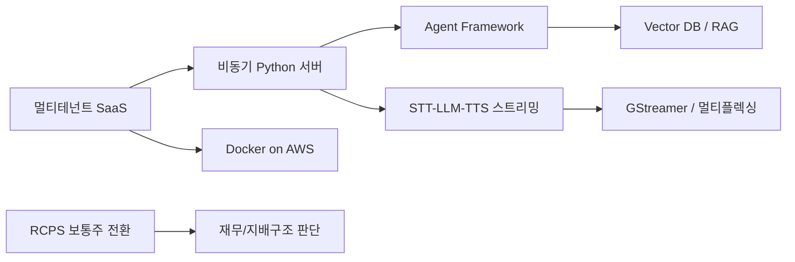

---

## 1. 멀티테넌트

### 1.1 소개

멀티테넌트는 하나의 소프트웨어/인프라가 여러 고객, 조직, 팀, 사용자 그룹을 동시에 서비스하는 구조다. 여기서 tenant는 단순 사용자 하나가 아니라 “격리와 과금, 권한, 데이터 경계가 필요한 단위”로 이해하는 것이 좋다.

Azure Architecture Center는 테넌트 격리를 완전 공유에서 완전 분리까지의 스펙트럼으로 설명한다. AWS SaaS 문서와 보안 블로그에서는 흔히 Pool, Bridge, Silo 모델을 사용한다.

### 1.2 핵심 모델

| 모델 | 구조 | 장점 | 단점 | 적합한 경우 |
|---|---|---|---|---|
| Pool | 모든 테넌트가 앱/DB/인프라를 공유하고 `tenant_id`로 논리 분리 | 비용 효율, 운영 단순 | 데이터 유출 위험, noisy neighbor | SMB SaaS, 낮은 보안 요구 |
| Bridge | 일부는 공유, 일부는 분리 | 비용과 격리 균형 | 설계 복잡 | 엔터프라이즈 등급별 서비스 |
| Silo | 테넌트별 전용 인프라 | 강한 격리, 커스터마이징 | 비용/운영 부담 | 금융/의료/대기업 전용 배포 |


### 1.3 설계 특징

- 모든 요청에는 신뢰 가능한 `tenant_id`가 있어야 한다.
- 인증의 subject와 tenant membership을 분리해서 검증해야 한다.
- DB Row Level Security, query filter, schema-per-tenant, database-per-tenant 중 하나를 선택한다.
- 캐시 키, 큐 메시지, 로그, 파일 경로에도 tenant 경계를 넣어야 한다.
- 운영 지표는 tenant별로 쪼개야 noisy neighbor를 찾을 수 있다.

### 1.4 장단점

| 구분 | 장점 | 단점 |
|---|---|---|
| 비용 | 인프라 공유로 단가 절감 | 고가 테넌트 요구를 맞추려면 예외 구조 증가 |
| 운영 | 배포/패치가 일괄 처리됨 | 장애가 다수 테넌트로 전파될 수 있음 |
| 보안 | 중앙 정책 적용 가능 | 애플리케이션 버그가 데이터 유출로 이어질 수 있음 |
| 성능 | 자원 활용률 증가 | 특정 테넌트 트래픽이 전체 성능을 흔들 수 있음 |

### 1.5 실용 패턴

```python
from dataclasses import dataclass

@dataclass(frozen=True)
class TenantContext:
    tenant_id: str
    user_id: str
    roles: set[str]

def build_query(ctx: TenantContext, symbol: str) -> dict:
    return {
        "tenant_id": ctx.tenant_id,
        "symbol": symbol,
    }
```

실무에서는 이 정도 코드만으로는 부족하다. DB 레벨 제약, API gateway, middleware, 로그 마스킹, 권한 테스트가 함께 들어가야 한다.

### 1.6 근거 URL

- Azure 멀티테넌트 격리 모델: https://learn.microsoft.com/en-us/azure/architecture/guide/multitenant/considerations/tenancy-models
- AWS SaaS Lens: https://docs.aws.amazon.com/wellarchitected/latest/saas-lens/saas-lens.html
- AWS 멀티테넌트 보안 모델: https://aws.amazon.com/blogs/security/security-practices-in-aws-multi-tenant-saas-environments/
- Kubernetes 멀티테넌시: https://kubernetes.io/docs/concepts/security/multi-tenancy/
- GKE 엔터프라이즈 멀티테넌시: https://docs.cloud.google.com/kubernetes-engine/docs/best-practices/enterprise-multitenancy

---

## 2. Python 비동기 프로그래밍

### 2.1 소개

Python 비동기 프로그래밍은 `async`/`await` 문법과 이벤트 루프를 사용해 I/O 대기 시간을 겹쳐 처리하는 방식이다. `asyncio`는 네트워크 서버, DB 클라이언트, 분산 큐, 스트리밍 처리의 기반으로 쓰인다.

```mermaid
sequenceDiagram
  participant App
  participant Loop as Event Loop
  participant API1
  participant API2
  App->>Loop: create_task(API1)
  App->>Loop: create_task(API2)
  Loop->>API1: request
  Loop->>API2: request
  API2-->>Loop: response
  API1-->>Loop: response
  Loop-->>App: gather results
```

### 2.2 특징

| 개념 | 설명 |
|---|---|
| coroutine | `async def`로 만든 실행 가능한 비동기 함수 |
| await | 대기 중 이벤트 루프에 제어권을 돌려주는 지점 |
| task | coroutine을 이벤트 루프에 스케줄링한 객체 |
| event loop | I/O 이벤트와 task 실행을 조율하는 루프 |
| gather | 여러 awaitable을 동시에 실행하고 결과 수집 |
| queue | producer/consumer 비동기 파이프라인 구성 |

### 2.3 장단점

| 장점 | 단점 |
|---|---|
| I/O-bound 처리량이 좋다 | CPU-bound 작업은 이벤트 루프를 막는다 |
| 스레드보다 메모리 비용이 낮다 | sync/async 라이브러리 혼용이 까다롭다 |
| 스트리밍 서버 구현에 적합하다 | cancellation, timeout, backpressure 설계가 필요하다 |
| WebSocket, SSE, LLM streaming과 잘 맞는다 | 디버깅 스택이 동기 코드보다 낯설다 |

### 2.4 간단 예제

```python
import asyncio

async def fetch_price(symbol: str) -> str:
    await asyncio.sleep(0.2)
    return f"{symbol}=100"

async def main() -> None:
    results = await asyncio.gather(
        fetch_price("AAPL"),
        fetch_price("MSFT"),
        fetch_price("NVDA"),
    )
    print(results)

asyncio.run(main())
```

### 2.5 실용 예제: 동시 요청 + timeout + 제한

```python
import asyncio
from collections.abc import Awaitable, Callable

async def bounded_map(
    items: list[str],
    worker: Callable[[str], Awaitable[str]],
    concurrency: int = 5,
    timeout: float = 2.0,
) -> list[str]:
    semaphore = asyncio.Semaphore(concurrency)

    async def run_one(item: str) -> str:
        async with semaphore:
            return await asyncio.wait_for(worker(item), timeout=timeout)

    return await asyncio.gather(*(run_one(item) for item in items))
```

이 패턴은 외부 API 호출, 종목별 데이터 수집, 멀티테넌트 배치 작업에 자주 쓴다.

### 2.6 근거 URL

- Python `asyncio` 공식 문서: https://docs.python.org/3.14/library/asyncio.html
- Python asyncio 개념 문서: https://docs.python.org/3/howto/a-conceptual-overview-of-asyncio.html
- Python event loop 문서: https://docs.python.org/3.15/library/asyncio-eventloop.html

---

## 3. LangChain, LangGraph

### 3.1 소개

LangChain은 LLM 애플리케이션과 agent를 빠르게 만들기 위한 고수준 프레임워크다. LangGraph는 장기 실행, 상태 저장, human-in-the-loop, streaming, durable execution에 초점을 맞춘 저수준 orchestration framework다.

LangChain v1 계열의 agent는 내부적으로 LangGraph 기반 runtime을 사용한다. 즉, 간단한 agent는 LangChain으로 시작하고, 상태 전이/복구/분기 제어가 커지면 LangGraph를 직접 쓰는 식의 흐름이 자연스럽다.

### 3.2 특징

| 항목 | LangChain | LangGraph |
|---|---|---|
| 추상화 수준 | 높음 | 낮음 |
| 주 용도 | agent 빠른 구성, model/tool 통합 | 상태 기반 agent/workflow orchestration |
| 상태 관리 | checkpointer 사용 가능 | 핵심 기능 |
| 스트리밍 | 지원 | 핵심 기능 |
| human-in-the-loop | middleware/graph 기반 | 핵심 기능 |
| 적합한 팀 | 빠른 PoC/서비스 앱 | 복잡한 agent platform |

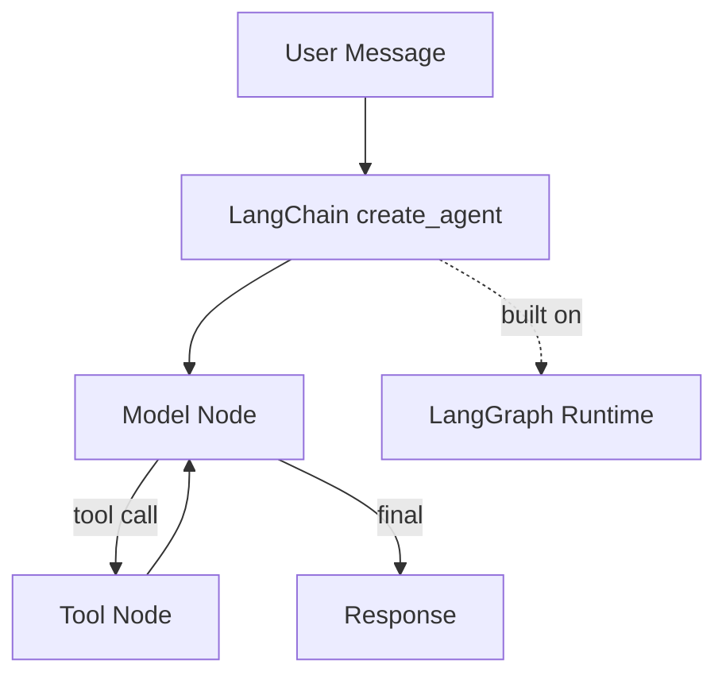

### 3.3 장단점

| 구분 | 장점 | 단점 |
|---|---|---|
| LangChain | 빠른 시작, provider/tool 통합, agent 기본 구조 제공 | 내부 추상화가 많아 디버깅이 어려울 수 있음 |
| LangGraph | 상태 전이 명확, durable execution, 재시작/체크포인트 유리 | 학습 곡선이 있고 boilerplate가 증가 |

### 3.4 LangChain 간단 예제

```python
from langchain.agents import create_agent

def get_weather(city: str) -> str:
    """Get weather for a given city."""
    return f"{city}: sunny"

agent = create_agent(
    model="openai:gpt-5-mini",
    tools=[get_weather],
    system_prompt="You are a concise assistant.",
)

result = agent.invoke({
    "messages": [{"role": "user", "content": "weather in Seoul?"}]
})
```

### 3.5 LangGraph 실용 예제: 간단 상태 그래프

```python
from typing import TypedDict
from langgraph.graph import StateGraph, START, END

class State(TypedDict):
    text: str
    route: str

def classify(state: State) -> State:
    route = "finance" if "stock" in state["text"].lower() else "general"
    return {"text": state["text"], "route": route}

def answer(state: State) -> State:
    return {"text": f"[{state['route']}] {state['text']}", "route": state["route"]}

graph = StateGraph(State)
graph.add_node("classify", classify)
graph.add_node("answer", answer)
graph.add_edge(START, "classify")
graph.add_edge("classify", "answer")
graph.add_edge("answer", END)
app = graph.compile()

print(app.invoke({"text": "stock news", "route": ""}))
```

### 3.6 근거 URL

- LangChain overview: https://docs.langchain.com/oss/python/langchain/overview
- LangChain agents: https://docs.langchain.com/oss/python/langchain/agents
- LangGraph overview: https://docs.langchain.com/oss/python/langgraph
- LangGraph persistence: https://langchain-5e9cc07a.mintlify.app/oss/javascript/langgraph/persistence

---

## 4. PydanticAI

### 4.1 소개

PydanticAI는 Pydantic 팀이 만든 Python agent framework다. FastAPI가 타입 힌트와 Pydantic validation으로 웹 API 개발 경험을 단순화한 것처럼, PydanticAI는 GenAI/agent 개발에서 타입, 의존성, structured output, tool validation을 중심에 둔다.

### 4.2 특징

| 특징 | 설명 |
|---|---|
| 타입 안전성 | agent dependency와 output type을 generic으로 표현 |
| structured output | Pydantic schema 기반 검증 |
| tool validation | tool 인자와 반환을 타입으로 관리 |
| dependency injection | `RunContext`로 API client, DB session, tenant context 주입 |
| model agnostic | OpenAI, Anthropic, Gemini, Bedrock, Ollama 등 다양한 provider 지원 |
| Python 친화성 | FastAPI/Pydantic 사용자에게 익숙한 구조 |

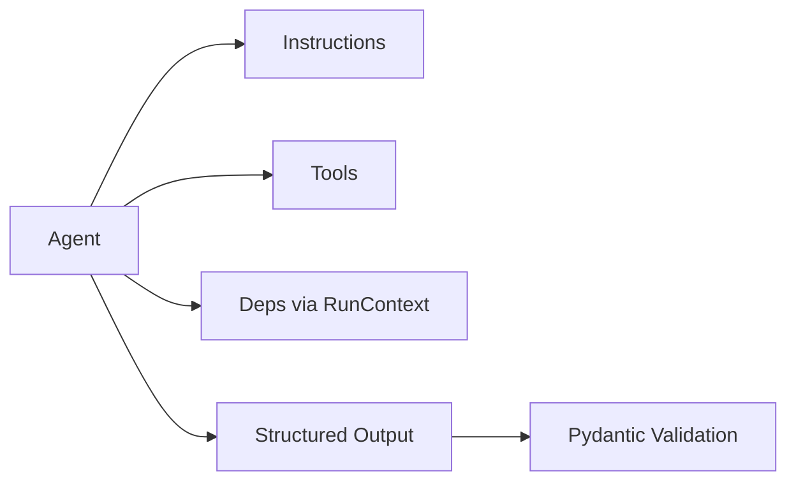

### 4.3 장단점

| 장점 | 단점 |
|---|---|
| 타입 기반 유지보수성이 좋다 | LangChain 생태계보다 통합 예제가 적을 수 있음 |
| structured output 검증이 자연스럽다 | 매우 복잡한 graph orchestration은 별도 설계 필요 |
| FastAPI와 잘 어울린다 | 팀이 Pydantic/typing에 익숙해야 효과가 크다 |
| dependency injection이 깔끔하다 | provider별 native 기능 차이는 직접 이해해야 한다 |

### 4.4 간단 예제

```python
from pydantic_ai import Agent

agent = Agent(
    "openai:gpt-5-mini",
    instructions="Answer in Korean. Be concise.",
)

result = agent.run_sync("PydanticAI가 뭐야?")
print(result.output)
```

### 4.5 실용 예제: 멀티테넌트 의존성 + structured output

```python
from dataclasses import dataclass
from pydantic import BaseModel
from pydantic_ai import Agent, RunContext

@dataclass
class Deps:
    tenant_id: str
    plan: str

class StockAnswer(BaseModel):
    summary: str
    risk_level: str
    tickers: list[str]

agent = Agent[Deps, StockAnswer](
    "openai:gpt-5-mini",
    deps_type=Deps,
    output_type=StockAnswer,
)

@agent.instructions
def add_tenant_policy(ctx: RunContext[Deps]) -> str:
    return f"Tenant={ctx.deps.tenant_id}, plan={ctx.deps.plan}. Respect tenant policy."

result = agent.run_sync(
    "NVDA와 MSFT를 짧게 비교해줘.",
    deps=Deps(tenant_id="tenant-a", plan="pro"),
)
print(result.output)
```

### 4.6 근거 URL

- PydanticAI overview: https://pydantic.dev/docs/ai/overview/
- PydanticAI agent: https://pydantic.dev/docs/ai/core-concepts/agent/
- PydanticAI output: https://pydantic.dev/docs/ai/core-concepts/output/
- PydanticAI dependencies: https://pydantic.dev/docs/ai/core-concepts/dependencies/
- PydanticAI graph: https://pydantic.dev/docs/ai/graph/graph/

---

## 5. LangChain/LangGraph vs PydanticAI 비교분석

### 5.1 핵심 비교

| 기준 | LangChain | LangGraph | PydanticAI |
|---|---|---|---|
| 주 포지션 | agent/app 프레임워크 | workflow/agent runtime | 타입 중심 Python agent |
| 강점 | 생태계, integrations, 빠른 PoC | 상태, 분기, 복구, durable execution | 타입, structured output, DI |
| 약점 | 추상화 복잡성 | 초기 설계 비용 | 상대적으로 작은 생태계 |
| 추천 | LLM 앱 빠른 개발 | 장기 실행/복잡 workflow | FastAPI/Python typed service |
| 멀티테넌트 | context/middleware로 구현 | graph state/config로 구현 | deps_type으로 깔끔하게 구현 |
| streaming | 지원 | 강함 | 지원 |

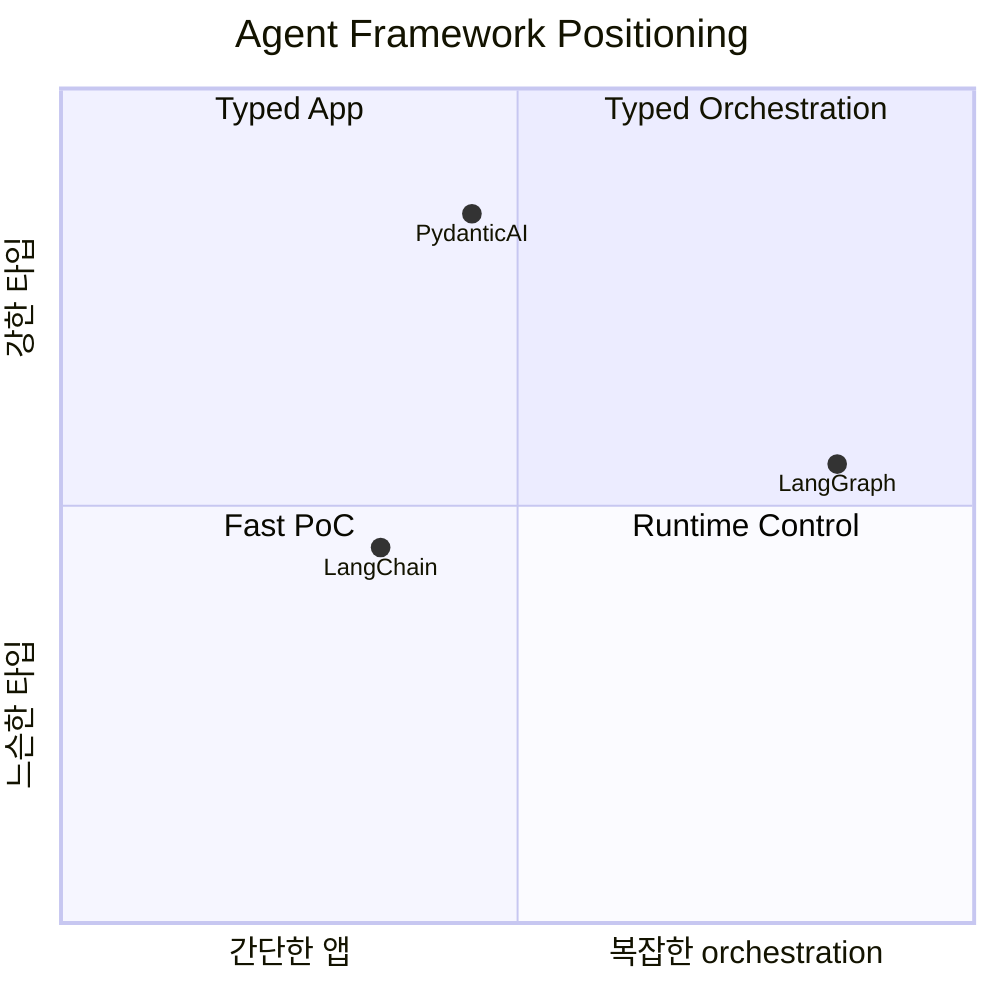

### 5.2 선택 가이드

| 상황 | 추천 |
|---|---|
| 빠르게 RAG chatbot을 만든다 | LangChain |
| agent가 여러 단계에서 멈추고 재개되어야 한다 | LangGraph |
| FastAPI 서비스 안에서 output schema가 중요하다 | PydanticAI |
| human approval, checkpoint, time travel debugging이 필요하다 | LangGraph |
| 멀티테넌트 context를 타입으로 강제하고 싶다 | PydanticAI |
| provider/tool integration이 가장 중요하다 | LangChain |

### 5.3 실무 조합

PydanticAI와 LangGraph는 경쟁만 하는 관계가 아니다. 예를 들어 LangGraph node 안에서 PydanticAI agent를 호출하면 “상태 orchestration은 LangGraph, typed agent는 PydanticAI”로 역할을 나눌 수 있다.

```python
def pydantic_agent_node(state: dict) -> dict:
    result = agent.run_sync(state["question"], deps=state["deps"])
    return {"answer": result.output.model_dump()}
```

---

## 6. VectorDB in MongoDB

### 6.1 소개

MongoDB Atlas Vector Search는 MongoDB 문서 컬렉션에 embedding vector를 저장하고, `$vectorSearch` aggregation stage로 semantic search를 수행하는 기능이다. 운영 데이터와 vector embedding을 같은 document model 안에서 다룰 수 있다는 점이 핵심이다.

### 6.2 특징

| 특징 | 설명 |
|---|---|
| 저장 방식 | 문서 필드에 dense vector 저장 |
| 검색 방식 | ANN/ENN vector search |
| 통합 검색 | vector search + full-text search + metadata filter |
| RAG 활용 | 문서/메타데이터/권한 필터를 함께 사용 |
| 버전 조건 | Atlas cluster MongoDB 6.0.11/7.0.2 이상 등 조건 존재 |

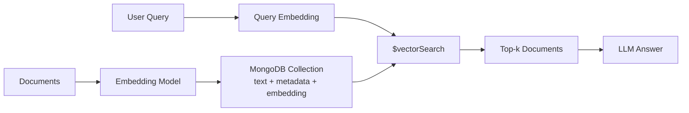

### 6.3 장단점

| 장점 | 단점 |
|---|---|
| 앱 데이터와 벡터를 한 DB에서 관리 | 전용 vector DB보다 세밀한 ANN 튜닝은 제한될 수 있음 |
| metadata filter와 함께 쓰기 좋음 | Atlas 기능 의존성이 있다 |
| RAG 구현 진입장벽이 낮음 | embedding 차원/인덱스 변경 시 재색인 필요 |
| JSON document model과 잘 맞음 | 초대규모/초저지연 검색은 벤치마크 필요 |

### 6.4 간단 예제

```javascript
db.articles.aggregate([
  {
    $vectorSearch: {
      index: "article_embedding_index",
      path: "embedding",
      queryVector: [0.12, 0.34, 0.56],
      numCandidates: 100,
      limit: 5
    }
  },
  {
    $project: {
      title: 1,
      score: { $meta: "vectorSearchScore" }
    }
  }
])
```

### 6.5 실용 예제: 멀티테넌트 RAG 검색

```javascript
db.knowledge.aggregate([
  {
    $vectorSearch: {
      index: "knowledge_vector_index",
      path: "embedding",
      queryVector: queryEmbedding,
      numCandidates: 200,
      limit: 8,
      filter: {
        tenant_id: "tenant-a",
        visibility: "internal"
      }
    }
  },
  {
    $project: {
      _id: 0,
      title: 1,
      content: 1,
      tenant_id: 1,
      score: { $meta: "vectorSearchScore" }
    }
  }
])
```

### 6.6 근거 URL

- MongoDB Vector Search overview: https://www.mongodb.com/docs/vector-search/
- MongoDB Vector Search index: https://www.mongodb.com/docs/vector-search/index/vector-search-type/
- MongoDB Vector Search getting started: https://www.mongodb.com/products/platform/atlas-vector-search/getting-started

---

## 7. VectorDB in other SQL DB

### 7.1 소개

SQL DB 안의 vector search는 “정형 데이터와 embedding을 같은 SQL 질의 체계에서 다루는 방식”이다. PostgreSQL `pgvector`, SQL Server `VECTOR`, Oracle AI Vector Search, MariaDB Vector, MySQL HeatWave Vector Store, DuckDB VSS 등이 대표적이다.

### 7.2 주요 선택지

| DB | 기능 | 인덱스/검색 | 실무 포인트 |
|---|---|---|---|
| PostgreSQL + pgvector | vector type, distance operator | HNSW, IVFFlat | 오픈소스, RAG 기본 선택지로 인기 |
| SQL Server 2025/Azure SQL | native `VECTOR` type | `VECTOR_DISTANCE` | Microsoft stack과 통합 |
| Oracle 23ai | native VECTOR, SQL vector search | vector indexes | 엔터프라이즈 보안/운영 데이터와 결합 |
| MariaDB 11.7 | `VECTOR(n)`, `VECTOR INDEX` | modified HNSW | 기존 MariaDB 앱에 적합 |
| MySQL HeatWave | in-database vector store | HeatWave GenAI | OCI/HeatWave 중심 |
| DuckDB VSS | `FLOAT[n]` ARRAY + HNSW | experimental VSS | 로컬 분석/임베디드 분석에 적합 |

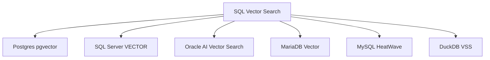

### 7.3 장단점

| 장점 | 단점 |
|---|---|
| 기존 트랜잭션/권한/백업 체계 재사용 | 전용 vector DB 대비 scale-out 검색 기능 제한 가능 |
| SQL filter와 vector distance 결합 | 인덱스별 recall/latency 튜닝 필요 |
| 데이터 이동 감소 | DB별 기능 성숙도가 다름 |
| 운영 단순화 | 대규모 embedding 업데이트 시 부하 관리 필요 |

### 7.4 PostgreSQL + pgvector 간단 예제

```sql
CREATE EXTENSION IF NOT EXISTS vector;

CREATE TABLE documents (
  id bigserial PRIMARY KEY,
  tenant_id text NOT NULL,
  content text NOT NULL,
  embedding vector(3) NOT NULL
);

CREATE INDEX ON documents
USING hnsw (embedding vector_cosine_ops);

SELECT id, content
FROM documents
WHERE tenant_id = 'tenant-a'
ORDER BY embedding <=> '[0.1,0.2,0.3]'
LIMIT 5;
```

### 7.5 실용 예제: hybrid SQL + vector

```sql
SELECT id, title, published_at
FROM articles
WHERE tenant_id = $1
  AND published_at >= now() - interval '90 days'
ORDER BY embedding <=> $2
LIMIT 10;
```

실무에서는 `tenant_id`, `published_at`, `category` 같은 정형 필터를 먼저 좁히고 vector search를 수행하는 구조가 비용과 품질 면에서 유리하다.

### 7.6 근거 URL

- pgvector GitHub: https://github.com/pgvector/pgvector
- SQL Server vector type: https://learn.microsoft.com/en-us/sql/t-sql/data-types/vector-data-type
- Oracle AI Vector Search: https://blogs.oracle.com/database/oracle-announces-general-availability-of-ai-vector-search-in-oracle-database-23ai
- MariaDB Vector: https://mariadb.com/docs/server/reference/sql-structure/vectors/vector-overview
- MySQL HeatWave Vector Store: https://dev.mysql.com/doc/heatwave/en/mys-hw-genai-vector-store-overview.html
- DuckDB VSS: https://duckdb.org/docs/current/core_extensions/vss.html

---

## 8. L2 Distance vs Cosine Distance

### 8.1 소개

L2 distance와 cosine distance는 vector search, embedding retrieval, clustering, recommendation에서 가장 자주 비교되는 거리 지표다. 둘 다 “가까운 벡터”를 찾지만, 무엇을 가깝다고 보는지가 다르다.

| 지표 | 무엇을 본다 | 직관 |
|---|---|---|
| L2 distance | 좌표 공간에서의 실제 거리 | 두 점이 공간에서 얼마나 떨어져 있는가 |
| Cosine distance | 벡터 방향의 차이 | 두 벡터가 같은 방향을 바라보는가 |

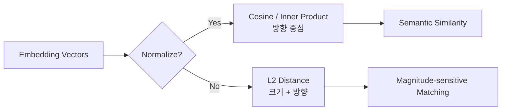

### 8.2 수식

두 벡터 $x, y$에 대해 L2 distance는 다음과 같다.

$$
d_{L2}(x,y) = ||x-y||_2 = \sqrt{\sum_i (x_i-y_i)^2}
$$

Cosine similarity와 cosine distance는 다음과 같다.

$$
\cos(x,y) = \frac{x \cdot y}{||x||_2 ||y||_2}
$$

$$
d_{cos}(x,y) = 1 - \cos(x,y)
$$

만약 두 벡터가 모두 unit vector로 정규화되어 $||x||_2 = ||y||_2 = 1$이면 다음 관계가 성립한다.

$$
||x-y||_2^2 = 2 - 2(x \cdot y) = 2(1-\cos(x,y)) = 2d_{cos}(x,y)
$$

즉, 정규화된 벡터에서는 L2 distance와 cosine distance가 같은 순위를 만들 수 있다. 반대로 정규화하지 않은 벡터에서는 L2가 벡터 크기의 영향을 강하게 받는다.

### 8.3 장단점

| 기준 | L2 distance | Cosine distance |
|---|---|---|
| 고려 요소 | 크기 + 방향 | 방향 중심 |
| 정규화 필요성 | 데이터 특성에 따라 선택 | 보통 정규화와 함께 사용 |
| 의미 검색 | embedding이 정규화되어 있으면 사용 가능 | 텍스트 embedding 검색에서 널리 사용 |
| 크기 정보 | 보존 | 대부분 무시 |
| 이상치 영향 | 큰 값/스케일에 민감 | 크기 차이에 둔감 |
| 해석 | 실제 좌표 거리 | 각도 기반 유사도 |

### 8.4 언제 L2를 쓰는가?

| 상황 | 이유 |
|---|---|
| 벡터의 크기 자체가 의미 있음 | 예: 센서값, 위치 좌표, 이미지 feature magnitude |
| feature scaling이 잘 되어 있음 | L2는 스케일 차이에 민감하므로 전처리가 중요 |
| clustering/nearest neighbor에서 실제 거리 의미가 필요 | 공간적 근접성이 중요한 문제 |
| embedding provider가 L2를 권장 | 모델 학습 목표와 metric을 맞추는 것이 우선 |

### 8.5 언제 cosine을 쓰는가?

| 상황 | 이유 |
|---|---|
| 텍스트 embedding semantic search | 문장 길이/벡터 크기보다 방향이 의미 유사도를 잘 반영하는 경우가 많음 |
| 문서 길이 차이가 큼 | 긴 문서와 짧은 문서의 크기 차이를 줄일 수 있음 |
| ranking에서 상대적 의미 유사도가 중요 | 질의와 문서가 같은 방향의 의미를 갖는지 판단 |
| vector DB에서 cosine index를 제공 | MongoDB Atlas Search, pgvector, Pinecone 등에서 흔히 지원 |

### 8.6 L2, cosine, inner product 관계

| 벡터 상태 | L2 vs cosine | 실무 해석 |
|---|---|---|
| 둘 다 unit-normalized | 순위가 단조 관계로 거의 동일 | cosine, L2, inner product 중 index/DB 성능이 좋은 것을 선택 가능 |
| 정규화되지 않음 | 결과가 달라질 수 있음 | 크기 정보가 ranking에 섞임 |
| embedding 모델이 이미 normalized output 제공 | cosine과 dot product가 유사하게 동작 | 모델 문서 확인 필요 |
| magnitude가 confidence를 담음 | cosine만 쓰면 정보 손실 가능 | L2 또는 inner product 검토 |

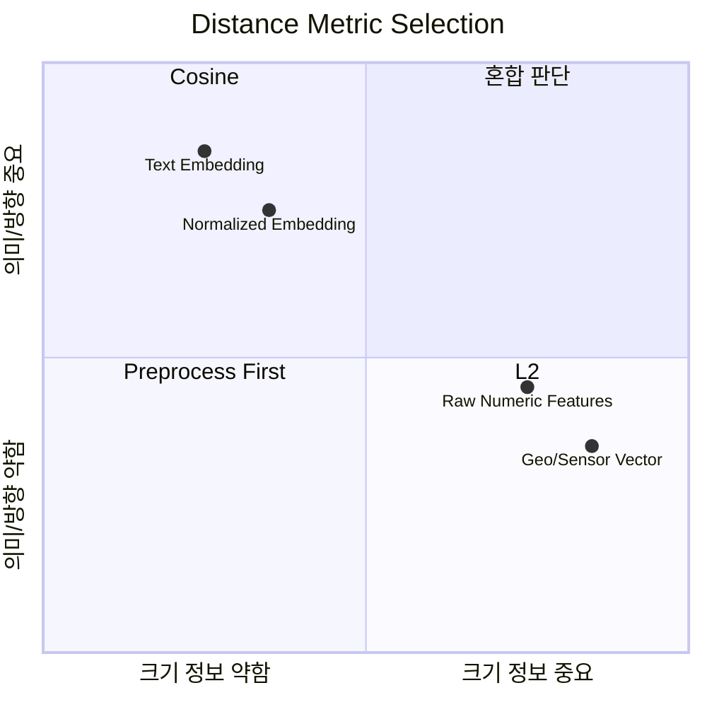

### 8.7 간단 예제: Python 계산

```python
import numpy as np
from sklearn.metrics.pairwise import cosine_distances, euclidean_distances

x = np.array([[3.0, 4.0]])
y = np.array([[6.0, 8.0]])
z = np.array([[4.0, 3.0]])

print("L2 x-y:", euclidean_distances(x, y)[0, 0])
print("Cosine x-y:", cosine_distances(x, y)[0, 0])
print("L2 x-z:", euclidean_distances(x, z)[0, 0])
print("Cosine x-z:", cosine_distances(x, z)[0, 0])
```

`x`와 `y`는 방향은 같지만 크기가 다르다. Cosine distance는 거의 0이지만, L2 distance는 크기 차이를 거리로 본다. 이 예제가 두 지표의 철학 차이를 가장 잘 보여준다.

### 8.8 실용 예제: pgvector metric 선택

```sql
-- L2 distance
SELECT id, content
FROM documents
ORDER BY embedding <-> '[0.1,0.2,0.3]'
LIMIT 5;

-- cosine distance
SELECT id, content
FROM documents
ORDER BY embedding <=> '[0.1,0.2,0.3]'
LIMIT 5;

-- negative inner product
SELECT id, content
FROM documents
ORDER BY embedding <#> '[0.1,0.2,0.3]'
LIMIT 5;
```

pgvector는 L2, inner product, cosine distance 연산자를 제공한다. 같은 데이터라도 어떤 연산자로 인덱스를 만들고 검색하느냐에 따라 결과와 성능이 달라질 수 있다.

### 8.9 MongoDB Atlas Vector Search 예시

```javascript
{
  "fields": [
    {
      "type": "vector",
      "path": "embedding",
      "numDimensions": 1536,
      "similarity": "cosine"
    }
  ]
}
```

MongoDB Atlas Vector Search는 vector index에서 `euclidean`, `cosine`, `dotProduct` 같은 similarity 설정을 사용한다. 텍스트 RAG에서는 보통 embedding 모델 권장 metric 또는 cosine/dotProduct 계열을 먼저 확인한다.

### 8.10 실무 선택 가이드

| 질문 | 권장 판단 |
|---|---|
| 모델 문서가 특정 metric을 권장하는가? | 그 metric을 우선 사용 |
| embedding이 unit-normalized인가? | cosine, dot product, L2 순위가 유사할 수 있음 |
| 벡터 크기가 의미를 갖는가? | L2 또는 inner product 검토 |
| 의미 기반 텍스트 검색인가? | cosine 또는 dot product 우선 |
| 정형 feature vector인가? | scale/standardization 후 L2 검토 |
| vector DB index가 특정 metric에 최적화되어 있는가? | DB의 index metric과 query metric을 일치 |

### 8.11 리스크/반례

| 리스크 | 설명 | 대응 |
|---|---|---|
| metric mismatch | 모델 학습 metric과 DB 검색 metric이 다름 | 모델 문서와 vector DB 설정 확인 |
| normalization 누락 | cosine을 기대했지만 L2로 크기 영향이 들어감 | 저장 전/검색 전 정규화 정책 고정 |
| mixed embeddings | 서로 다른 모델 embedding을 같은 index에 저장 | 모델별 index 분리 |
| recall 저하 | ANN index metric과 query metric 불일치 | index 재생성 및 offline recall 평가 |
| top-k 착시 | cosine score와 distance score 방향을 혼동 | score가 클수록 좋은지, 작을수록 좋은지 명시 |

### 8.12 근거 URL

- scikit-learn cosine distances: https://scikit-learn.org/stable/modules/generated/sklearn.metrics.pairwise.cosine_distances.html
- scikit-learn euclidean distances: https://scikit-learn.org/stable/modules/generated/sklearn.metrics.pairwise.euclidean_distances.html
- pgvector distance operators: https://github.com/pgvector/pgvector
- MongoDB Atlas Vector Search index fields: https://www.mongodb.com/docs/atlas/atlas-vector-search/vector-search-type/
- Pinecone vector similarity metrics: https://docs.pinecone.io/guides/indexes/understanding-indexes#similarity-metrics
- Qdrant distance metrics: https://qdrant.tech/documentation/concepts/search/

---

## 9. RCPS 보통주 전환

### 9.1 소개

RCPS는 Redeemable Convertible Preferred Shares, 즉 상환전환우선주다. 보통주에는 없는 상환권과 전환권을 포함하는 우선주 형태로, 스타트업/벤처 투자에서 자주 사용된다.

상환권은 일정 조건에서 회사에 투자금 상환을 청구할 수 있는 권리이고, 전환권은 우선주를 보통주 등 다른 종류주식으로 바꿀 수 있는 권리다.

> 주의: 이 장은 일반 리서치 요약이며 법률/세무/회계 자문이 아니다. 실제 전환은 정관, 투자계약서, 주주간계약, 회계기준, 등기 실무를 전문가와 확인해야 한다.

### 9.2 전환 관련 법적 체크

| 항목 | 체크포인트 |
|---|---|
| 정관 | 종류주식, 상환, 전환 조건 근거가 있는가 |
| 전환 조건 | 전환비율, 전환가액, 리픽싱, 전환청구기간 |
| 청구 절차 | 전환청구서, 주권/전자등록 절차 |
| 효력 발생 | 주주 청구 시 청구한 때 효력 발생 |
| 등기 | 전환으로 인한 변경등기 기한 확인 |
| 회계 | K-IFRS상 부채/자본 분류 영향 검토 |

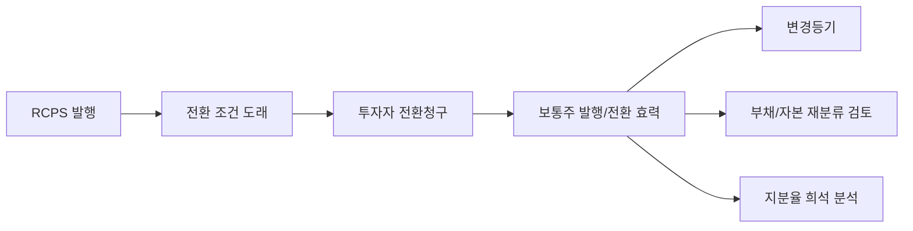

### 9.3 재무/지배구조 영향

| 영향 | 설명 |
|---|---|
| 자본구조 | RCPS가 부채로 인식되던 경우 보통주 전환 후 자본총계가 개선될 수 있음 |
| 지분율 | 보통주 수 증가로 기존 주주의 지분율 희석 가능 |
| 의결권 | 전환 후 보통주 의결권이 발생할 수 있음 |
| IPO | 상장 전 RCPS 정리가 재무 건전성/자본잠식 이슈 완화에 도움될 수 있음 |
| 투자자 수익 | 주가 상승/공모가 기대가 있으면 상환보다 전환을 선호할 수 있음 |

### 9.4 간단 계산 예시

전환 전 보통주가 1,000,000주이고, RCPS 100,000주가 1:1로 보통주 전환된다면:

$$
전환후총주식수 = 1,000,000 + 100,000 = 1,100,000
$$

기존 100,000주 보유자의 지분율은:

$$
전환전 = 100,000 / 1,000,000 = 10\%
$$

$$
전환후 = 100,000 / 1,100,000 \approx 9.09\%
$$

### 9.5 실무 체크리스트

| 단계 | 확인 사항 |
|---|---|
| 1 | 정관의 종류주식/상환/전환 조항 확인 |
| 2 | 투자계약서의 전환비율, 리픽싱, 자동전환 조건 확인 |
| 3 | 전환 후 cap table과 완전희석 지분율 산출 |
| 4 | K-IFRS/K-GAAP 회계처리 검토 |
| 5 | 변경등기 및 주주명부/전자등록 반영 |
| 6 | IPO/투자 라운드 영향 검토 |

### 9.6 근거 URL

- 상법 제345조~제350조 국가법령정보센터 PDF: https://www.law.go.kr/lbook/lbFileDownload.do?flExt=pdf&lbookConflSeq=37001&lbookSeq=44683
- 전환 절차 조문: https://law.go.kr/LSW/lsLawLinkInfo.do?chrClsCd=010202&lsJoLnkSeq=900424871
- NABO TIPS 평가 RCPS 설명: https://korea.nabo.go.kr/board/file/down.do?fid=33318010
- ZUZU RCPS 설명: https://zuzu.network/resource/guide/rcps/
- PwC M&A Guide Book 회계 영향: https://www.pwc.com/kr/ko/services/samilpwc_mna_guide-book.pdf

---

## 10. 저지연 파이프라인 최적화: STT → LLM → TTS

### 10.1 소개

음성 agent의 체감 품질은 전체 응답 완료 시간보다 Time To First Token 또는 Time To First Audio가 더 중요하다. 사용자는 첫 반응이 빠르면 전체 답변이 길어도 자연스럽게 느낀다.

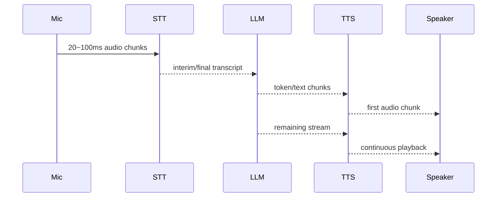

### 10.2 지연 요소

| 구간 | 주요 지연 | 최적화 |
|---|---|---|
| Capture | 오디오 프레임 크기, 브라우저/장치 버퍼 | 20~100ms chunk, 불필요한 resampling 제거 |
| STT | endpointing, final transcript 대기 | interim result 사용, endpointing 300~500ms 조정 |
| LLM | prompt prefill, tool call, 첫 token | 짧은 system prompt, prompt caching, streaming |
| TTS | 문장 chunk 대기, 음성 품질 모델 | WebSocket TTS, low-latency 모델, chunk schedule 조정 |
| Playback | jitter buffer, codec, network | opus/pcm 전략, prebuffer 최소화 |

### 10.3 TTFT/TTFA 최적화 원칙

| 원칙 | 설명 |
|---|---|
| Streaming first | STT, LLM, TTS 모두 streaming interface 사용 |
| Overlap | STT final을 기다리지 않고 안정적인 interim부터 LLM 준비 |
| Early response | “네, 확인해볼게요” 같은 짧은 preamble을 빠르게 생성 |
| Context pruning | RAG 결과/대화 history를 줄여 LLM prefill 감소 |
| Prompt caching | 고정 prefix를 앞에 두고 동적 데이터는 뒤에 배치 |
| Endpoint tuning | 너무 짧으면 중간 끊김, 너무 길면 반응 지연 |
| Backpressure | TTS가 느릴 때 LLM text buffer가 무한 증가하지 않도록 제한 |

### 10.4 실용 예제: 비동기 스트리밍 파이프라인 스케치

```python
import asyncio

async def stt_stream(audio_chunks):
    async for chunk in audio_chunks:
        # 실제 구현에서는 STT WebSocket으로 전송하고 interim/final 이벤트를 받는다.
        yield {"type": "interim", "text": "안녕하세요"}

async def llm_stream(text: str):
    for token in ["네, ", "도와드릴게요."]:
        await asyncio.sleep(0.03)
        yield token

async def tts_stream(text_chunks):
    async for text in text_chunks:
        # 실제 구현에서는 TTS WebSocket으로 text chunk를 보내고 audio bytes를 받는다.
        yield text.encode()

async def pipeline(audio_chunks):
    async for stt_event in stt_stream(audio_chunks):
        if stt_event["type"] in {"interim", "final"}:
            async def text_chunks():
                async for token in llm_stream(stt_event["text"]):
                    yield token

            async for audio in tts_stream(text_chunks()):
                yield audio
```

### 10.5 Realtime API vs Cascaded Pipeline

| 방식 | 장점 | 단점 | 적합한 경우 |
|---|---|---|---|
| Speech-to-speech Realtime | STT/TTS 중간 단계 제거, 낮은 지연 | provider 종속, 세밀한 파이프라인 제어 제한 | 자연 대화형 voice agent |
| Cascaded STT→LLM→TTS | 컴포넌트 교체/튜닝 쉬움 | 각 단계 지연 누적 | 도메인 STT/TTS, 규제/로그/제어 필요 |

### 10.6 근거 URL

- OpenAI Realtime API: https://developers.openai.com/api/docs/guides/realtime
- OpenAI realtime conversation: https://developers.openai.com/api/docs/guides/realtime-conversations
- OpenAI latency optimization: https://developers.openai.com/api/docs/guides/latency-optimization
- OpenAI prompt caching: https://developers.openai.com/api/docs/guides/prompt-caching
- Google Speech-to-Text best practices: https://docs.cloud.google.com/speech-to-text/docs/v1/best-practices
- Deepgram endpointing/interim results: https://developers.deepgram.com/docs/understand-endpointing-interim-results
- ElevenLabs latency optimization: https://elevenlabs.io/docs/eleven-api/guides/how-to/best-practices/latency-optimization
- ElevenLabs audio streaming: https://elevenlabs.io/docs/eleven-api/concepts/audio-streaming

---

## 11. GStreamer

### 11.1 소개

GStreamer는 오디오/비디오/임의 데이터 흐름을 처리하기 위한 멀티미디어 프레임워크다. 핵심은 source, filter, encoder, muxer, sink 같은 element를 pipeline으로 연결해 데이터 흐름을 구성하는 것이다.

GStreamer는 media player뿐 아니라 실시간 transcoding, camera capture, RTP/WebRTC pipeline, AI inference 전처리, STT/TTS audio bridge에도 사용할 수 있다.

### 11.2 특징

| 개념 | 설명 |
|---|---|
| Element | source, decoder, converter, sink 같은 처리 단위 |
| Pad | element 간 데이터가 드나드는 포트 |
| Pipeline | element들이 연결된 실행 그래프 |
| Bus | error, EOS, state change 같은 메시지 전달 채널 |
| Caps | media type/format/framerate/resolution 협상 정보 |
| Plugin | codec, muxer, demuxer, protocol 기능 확장 |

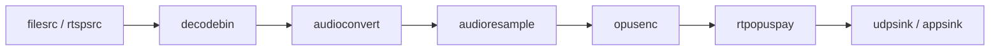

### 11.3 장단점

| 장점 | 단점 |
|---|---|
| 매우 유연한 media pipeline 구성 | caps negotiation/debugging이 어렵다 |
| 실시간/저지연 파이프라인에 적합 | 플랫폼별 플러그인 설치 차이가 크다 |
| C 기반 성능 + Python binding 사용 가능 | Python만으로 모든 세부 제어를 이해하기 어렵다 |
| codec/protocol plugin 생태계가 넓다 | pipeline 문자열이 커지면 유지보수 난도 증가 |

### 11.4 간단 예제 Python: 테스트 영상 출력

```python
#!/usr/bin/env python3
import sys
import gi

gi.require_version("Gst", "1.0")
from gi.repository import Gst

Gst.init(sys.argv[1:])

pipeline = Gst.parse_launch("videotestsrc pattern=smpte ! videoconvert ! autovideosink")
pipeline.set_state(Gst.State.PLAYING)

bus = pipeline.get_bus()
bus.timed_pop_filtered(Gst.CLOCK_TIME_NONE, Gst.MessageType.ERROR | Gst.MessageType.EOS)

pipeline.set_state(Gst.State.NULL)
```

### 11.5 실용 예제 Python: 마이크 PCM을 appsink로 받아 STT에 전달

```python
#!/usr/bin/env python3
import sys
import gi

gi.require_version("Gst", "1.0")
gi.require_version("GLib", "2.0")
from gi.repository import Gst, GLib

Gst.init(sys.argv[1:])

pipeline = Gst.parse_launch(
    "autoaudiosrc ! audioconvert ! audioresample "
    "! audio/x-raw,format=S16LE,rate=16000,channels=1 "
    "! appsink name=sink emit-signals=true sync=false max-buffers=10 drop=true"
)

appsink = pipeline.get_by_name("sink")

def on_sample(sink):
    sample = sink.emit("pull-sample")
    buffer = sample.get_buffer()
    ok, map_info = buffer.map(Gst.MapFlags.READ)
    if ok:
        pcm_bytes = bytes(map_info.data)
        # 여기에서 STT WebSocket으로 pcm_bytes를 전송한다.
        buffer.unmap(map_info)
    return Gst.FlowReturn.OK

appsink.connect("new-sample", on_sample)
pipeline.set_state(Gst.State.PLAYING)

loop = GLib.MainLoop()
try:
    loop.run()
finally:
    pipeline.set_state(Gst.State.NULL)
```

이 예제는 저지연 STT 파이프라인에서 유용하다. `max-buffers=10 drop=true`는 소비가 밀릴 때 latency가 계속 늘어나는 것을 막는 backpressure 전략이다.

### 11.6 근거 URL

- GStreamer 소개: https://gstreamer.freedesktop.org/documentation/application-development/introduction/gstreamer.html
- GStreamer basic tutorials: https://gstreamer.freedesktop.org/documentation/tutorials/basic/index.html
- GStreamer concepts tutorial: https://gstreamer.freedesktop.org/documentation/tutorials/basic/concepts.html
- GStreamer hello world Python: https://gstreamer.freedesktop.org/documentation/tutorials/basic/hello-world.html
- GStreamer dynamic pipeline/demuxer: https://gstreamer.freedesktop.org/documentation/tutorials/basic/dynamic-pipelines.html

---

## 12. Docker

### 12.1 소개

Docker는 애플리케이션과 실행 환경을 container image로 묶어 개발, 테스트, 배포를 일관되게 만드는 플랫폼이다. Docker container는 image의 실행 인스턴스이며, host OS kernel을 공유하면서 namespace/cgroup 등으로 격리된다.

### 12.2 특징

| 개념 | 설명 |
|---|---|
| Image | 실행 환경을 담은 read-only template |
| Container | image의 실행 인스턴스 |
| Dockerfile | image build recipe |
| Layer | Dockerfile instruction 결과로 쌓이는 변경 단위 |
| Registry | image 저장소, 예: Docker Hub, Amazon ECR |
| Compose | 여러 container service를 YAML로 정의하고 실행 |

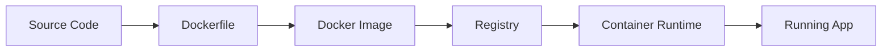

### 12.3 장단점

| 장점 | 단점 |
|---|---|
| 개발/운영 환경 차이를 줄인다 | kernel을 공유하므로 VM과 같은 보안 경계는 아님 |
| 배포 단위가 명확하다 | image 보안 취약점 관리 필요 |
| dependency를 image에 고정할 수 있다 | 잘못 만들면 image가 크고 느려진다 |
| CI/CD와 잘 맞는다 | 로그/상태/스토리지 설계를 따로 해야 한다 |

### 12.4 간단 예제

`app.py`

```python
from flask import Flask

app = Flask(__name__)

@app.get("/")
def home():
    return {"message": "hello docker"}
```

`Dockerfile`

```dockerfile
FROM python:3.12-slim

WORKDIR /app
RUN pip install --no-cache-dir flask
COPY app.py .

EXPOSE 8000
CMD ["flask", "--app", "app", "run", "--host", "0.0.0.0", "--port", "8000"]
```

```bash
docker build -t hello-docker:latest .
docker run --rm -p 8000:8000 hello-docker:latest
```

### 12.5 실용 예제: API + Redis Compose

```yaml
services:
  api:
    build: .
    ports:
      - "8000:8000"
    environment:
      REDIS_URL: redis://redis:6379/0
    depends_on:
      - redis

  redis:
    image: redis:7-alpine
    volumes:
      - redis-data:/data

volumes:
  redis-data:
```

```bash
docker compose up --build
docker compose logs -f api
docker compose down
```

### 12.6 Docker in AWS 사용 사례

| AWS 서비스 | Docker 사용 방식 | 적합한 경우 |
|---|---|---|
| Amazon ECR | Docker/OCI image registry | private image 저장, scan, lifecycle 정책 |
| Amazon ECS on Fargate | serverless container 실행 | 인프라 관리 최소화, 일반 API/worker |
| Amazon ECS on EC2 | EC2 cluster에 container 배치 | GPU/특수 instance/비용 최적화 |
| Amazon EKS | managed Kubernetes | Kubernetes 표준/복잡한 platform |
| AWS Lambda container image | image 기반 Lambda 배포 | 이벤트 기반 짧은 작업 |
| App Runner | container 기반 간단 웹 배포 | 운영 복잡도 낮은 웹/API |

### 12.7 AWS 주의사항

| 주의사항 | 설명 |
|---|---|
| `latest` tag 금지 | 운영에서는 git SHA, semver 등 immutable tag 권장 |
| SIGTERM 처리 | ECS는 task stop 시 SIGTERM 후 SIGKILL을 보냄 |
| stdout/stderr logging | 로그를 파일에 쓰기보다 runtime log driver로 넘김 |
| image scan | ECR scan on push, CVE 패치 루틴 필요 |
| secret 관리 | image에 secret을 굽지 말고 Secrets Manager/SSM 사용 |
| task role 분리 | execution role과 task role 권한을 분리 |
| Fargate/EC2 보안 경계 | Fargate는 task별 격리가 강하고, EC2 shared host는 추가 주의 |
| cold start/pull time | image size가 크면 task launch time 증가 |

### 12.8 근거 URL

- Docker overview: https://docs.docker.com/get-started/docker-overview/
- Dockerfile overview: https://docs.docker.com/build/concepts/dockerfile/
- Docker Compose model: https://docs.docker.com/compose/intro/compose-application-model/
- Docker build best practices: https://docs.docker.com/build/building/best-practices/
- Amazon ECR: https://docs.aws.amazon.com/AmazonECR/latest/userguide/what-is-ecr.html
- Amazon ECS: https://docs.aws.amazon.com/AmazonECS/latest/developerguide/Welcome.html
- Amazon ECS image best practices: https://docs.aws.amazon.com/AmazonECS/latest/developerguide/container-considerations.html
- Amazon ECS security: https://aws.amazon.com/blogs/security/security-considerations-for-running-containers-on-amazon-ecs/
- Amazon EKS: https://docs.aws.amazon.com/eks/latest/userguide/what-is-eks.html

---

## 13. 멀티플렉싱

### 13.1 소개

멀티플렉싱은 여러 독립적인 데이터 흐름을 하나의 물리적/논리적 연결 위에 함께 실어 보내는 기술이다. 네트워크에서는 하나의 TCP/QUIC 연결 위에 여러 stream을 태우는 방식으로 나타나고, 미디어에서는 여러 audio/video/subtitle stream을 하나의 container에 muxing하는 방식으로 나타난다.

### 13.2 네트워크 멀티플렉싱

| 프로토콜 | 멀티플렉싱 방식 | 특징 |
|---|---|---|
| HTTP/1.1 | 연결 여러 개 또는 pipelining | pipelining은 HOL blocking 문제 |
| HTTP/2 | 하나의 TCP 연결에 여러 stream frame interleaving | 연결 수 감소, TCP loss 시 전체 stream 영향 가능 |
| HTTP/3/QUIC | UDP 기반 QUIC connection 안에 여러 stream | stream 간 head-of-line blocking 완화 |
| WebSocket | 기본적으로 단일 message stream | application-level multiplexing은 별도 구현 |

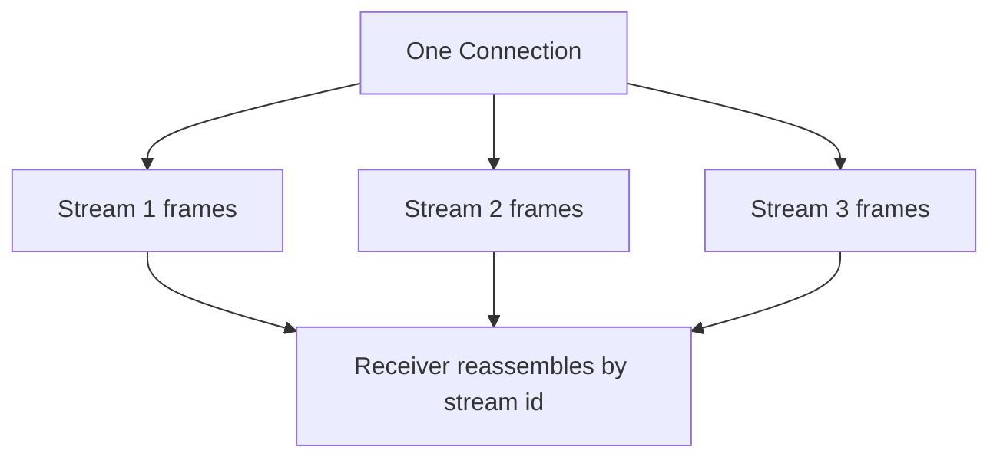

### 13.3 미디어 멀티플렉싱

미디어에서 multiplexing은 audio, video, metadata, subtitle을 하나의 container stream으로 합치는 작업이다. 반대로 demultiplexing은 container에서 각 stream을 분리한다.

| 용어 | 설명 | 예 |
|---|---|---|
| muxer | 여러 stream을 하나의 container로 합침 | `mp4mux`, `matroskamux`, `mpegtsmux` |
| demuxer | container를 stream별로 분리 | `qtdemux`, `matroskademux`, `tsdemux` |
| pad | demuxer가 stream별 output pad를 동적으로 생성 | audio pad, video pad |
| timestamp | stream 동기화 기준 | PTS/DTS |

### 13.4 장단점

| 장점 | 단점 |
|---|---|
| 연결 수와 handshake 비용 감소 | stream 간 flow control 설계 필요 |
| 작은 요청/응답의 지연 감소 | 우선순위 정책이 나쁘면 중요한 stream이 밀림 |
| 미디어 동기화에 유리 | container/codec 조합에 따라 latency 증가 |
| QUIC에서는 stream별 HOL blocking 완화 | 방화벽/프록시/관측 도구 호환성 고려 |

### 13.5 실용 예제: GStreamer mux/demux

```bash
# 비디오/오디오를 MPEG-TS로 muxing
gst-launch-1.0 \
  videotestsrc ! x264enc tune=zerolatency ! h264parse ! queue ! mux. \
  audiotestsrc ! audioconvert ! avenc_aac ! aacparse ! queue ! mux. \
  mpegtsmux name=mux ! filesink location=out.ts

# MPEG-TS demuxing
gst-launch-1.0 filesrc location=out.ts ! tsdemux name=demux \
  demux. ! queue ! decodebin ! autovideosink \
  demux. ! queue ! decodebin ! autoaudiosink
```

### 13.6 근거 URL

- HTTP/2 RFC 9113: https://www.ietf.org/rfc/rfc9113.html
- QUIC RFC 9000: https://www.ietf.org/rfc/rfc9000.html
- QUIC Working Group: https://quicwg.org/
- GStreamer dynamic pipelines/demuxer: https://gstreamer.freedesktop.org/documentation/tutorials/basic/dynamic-pipelines.html

---

## 14. 실시간 방송송출, 화상통화: VBR vs CBR

### 14.1 핵심 결론

실시간 방송송출과 화상통화는 둘 다 “실시간 영상”이지만 권장 rate control이 다르다.

| 사용 환경 | 더 권장되는 방식 | 이유 |
|---|---|---|
| YouTube/Twitch 같은 플랫폼으로 송출하는 live ingest | CBR | 플랫폼 ingest, transcoding, CDN 입력 안정성, 시청자 QoS 예측 가능성이 중요 |
| 전문 live encoding/CDN 배포 | CBR 또는 capped VBR/QVBR | 엄격한 호환성은 CBR, 대역폭 비용/품질 효율은 capped VBR/QVBR |
| WebRTC 화상통화 | Adaptive VBR/ABR | 네트워크 상태가 계속 변하므로 bitrate, 해상도, FPS를 동적으로 낮춰 지연/끊김을 줄여야 함 |
| 녹화/VOD 파일 인코딩 | VBR | 실시간 제약이 약하고 장면 복잡도에 맞춰 품질/용량 최적화 가능 |

짧게 말하면:

> 방송 플랫폼에 “밀어 넣는 송출”은 CBR이 기본값이고, 양방향 화상통화는 CBR보다 adaptive bitrate가 기본 전략이다.

### 14.2 왜 방송송출은 CBR이 자주 권장되는가?

YouTube Live 공식 encoder 설정은 bitrate encoding을 CBR로 안내한다. Twitch도 방송 가이드에서 CBR 사용을 권장한다. 이유는 단순히 “화질이 좋아서”가 아니라, 전체 서비스 품질이 더 예측 가능하기 때문이다.

| 이유 | 설명 |
|---|---|
| ingest 안정성 | 송출 bitrate가 갑자기 튀면 업로드 경로가 순간적으로 막혀 dropped frame이 늘 수 있음 |
| transcoding 안정성 | 플랫폼이 입력 stream을 여러 화질로 변환할 때 일정한 입력률이 유리 |
| CDN/버퍼 예측 | segment 크기와 네트워크 사용량을 예측하기 쉬움 |
| 운영 모니터링 | bitrate alarm, stream health, encoder 설정 검증이 쉬움 |
| 호환성 | 일부 장비/플랫폼은 variable bitrate burst를 잘 처리하지 못함 |

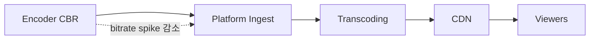

### 14.3 방송송출에서 VBR/QVBR이 유리한 예외

AWS Elemental Live 문서는 CBR이 지정 bitrate를 유지하지만 장면 복잡도에 따라 화질이 변한다고 설명한다. 반대로 VBR은 평균 bitrate와 최대 bitrate를 지정하고, QVBR은 품질 수준과 최대 bitrate를 지정한다. AWS 문서 기준으로는 장비/시청자가 variable bitrate를 처리할 수 있고 대역폭 비용이 중요하면 VBR/QVBR을 고려할 수 있다.

| 방식 | 특징 | 실무 판단 |
|---|---|---|
| CBR | bitrate 일정, 화질은 장면 복잡도에 따라 변동 | 플랫폼 ingest, 제한된 회선, 엄격한 송출 스펙 |
| VBR | 평균/최대 bitrate 지정, 복잡한 장면에서 spike 허용 | 관리형 live encoder, CDN 비용과 화질 균형 |
| QVBR | 목표 품질 + 최대 bitrate 지정 | AWS Elemental 계열에서 bandwidth 비용 절감 목적 |

실무적으로는 “VBR이 화질 효율은 좋지만, live ingest에는 burst를 막는 max bitrate와 buffer 설정이 필수”라고 보는 편이 안전하다.

### 14.4 왜 화상통화는 Adaptive VBR/ABR이 권장되는가?

화상통화는 방송송출과 다르게 지연 시간이 매우 짧아야 하고, 사용자 네트워크가 Wi-Fi, LTE/5G, 사내망, 해외망 등으로 계속 변한다. 이때 고정 CBR을 유지하면 네트워크가 나빠진 순간 큐가 쌓이고 latency가 커지거나 packet loss가 늘어난다.

WebRTC는 `RTCRtpSender.setParameters()`에서 `maxBitrate`, `maxFramerate`, `scaleResolutionDownBy` 같은 전송 제어를 제공한다. W3C/MDN 설명처럼 `maxBitrate`는 “상한”이지 항상 그 bitrate로 보내라는 뜻이 아니다. 실제 전송량은 transport/network 한계, codec, frame drop, resolution scaling에 따라 바뀐다.

| 화상통화 최적화 | 설명 |
|---|---|
| Congestion control | RTCP feedback 기반으로 가용 bandwidth를 추정 |
| Adaptive bitrate | 가용 bandwidth에 맞춰 bitrate를 올리거나 낮춤 |
| Frame dropping | bitrate가 부족하면 frame을 줄여 latency 증가를 막음 |
| Resolution scaling | 화면 크기를 낮춰 대역폭을 맞춤 |
| Simulcast/SVC | SFU가 수신자 네트워크별로 적절한 layer를 선택 |
| Audio priority | 영상보다 음성 연속성을 우선시 |

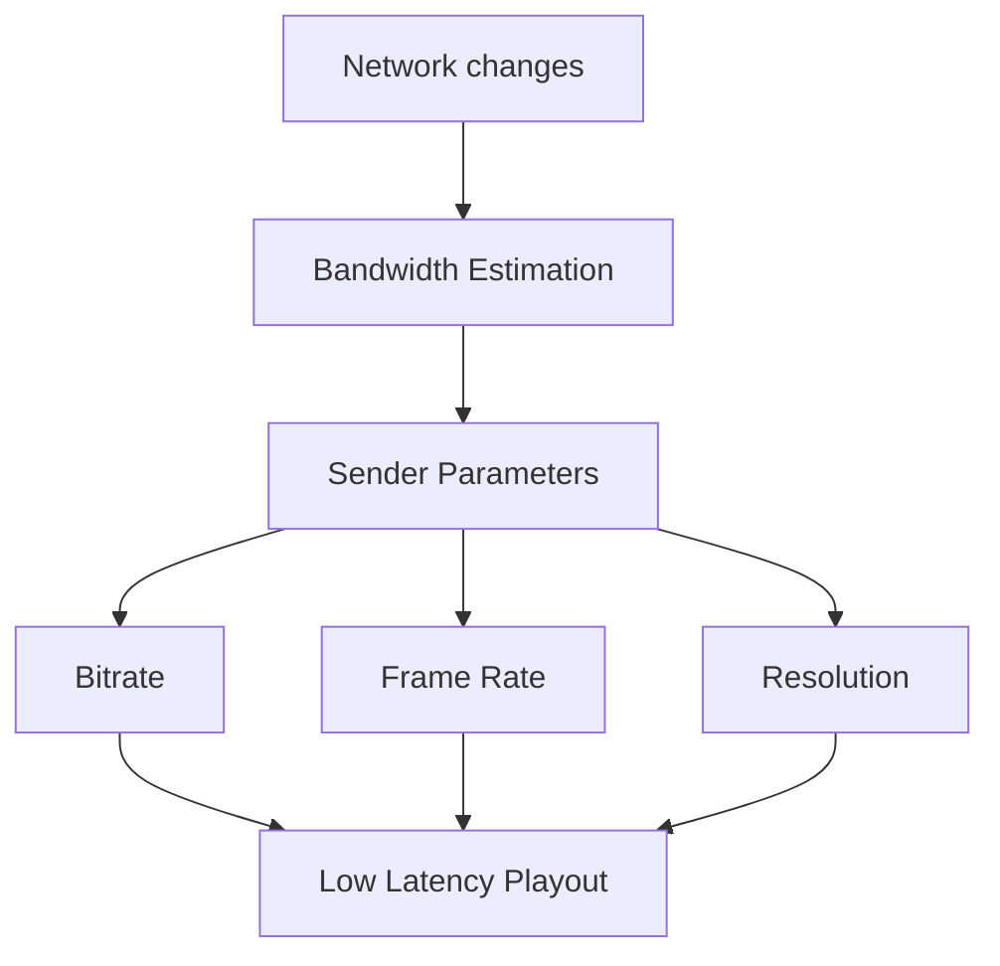

### 14.5 실무 권장안

| 목적 | 권장 설정 |
|---|---|
| YouTube/Twitch/RTMP 송출 | CBR, 고정 keyframe interval, 업로드 회선의 60~80% 이하 bitrate |
| 저지연 라이브 커머스/웨비나 | CBR 또는 capped VBR, segment/LL-HLS/WebRTC relay 지연 측정 필수 |
| 방송국/전문 인코더/CDN | 장비와 CDN이 허용하면 QVBR/VBR, 단 max bitrate/buffer 엄격 설정 |
| 1:1 화상통화 | WebRTC adaptive bitrate, audio 우선, `maxBitrate`는 상한으로 사용 |
| 다자 화상회의 | SFU + simulcast/SVC + 수신자별 downlink adaptation |
| 녹화 저장본 | VBR 또는 CRF/CQ 계열로 품질/용량 최적화 |

### 14.6 간단 예제: WebRTC 송신 bitrate 상한 설정

```javascript
async function setSenderLimit(sender, maxBitrateBps, maxFps) {
  const params = sender.getParameters();
  params.encodings ??= [{}];
  params.encodings[0].maxBitrate = maxBitrateBps;
  params.encodings[0].maxFramerate = maxFps;
  await sender.setParameters(params);
}
```

이 코드는 CBR을 강제하는 코드가 아니다. WebRTC encoder가 네트워크 상태에 따라 동적으로 움직이되, 지정한 상한을 넘지 않도록 제한하는 용도다.

### 14.7 근거 URL

- YouTube Live encoder settings: https://support.google.com/youtube/answer/2853702?hl=en
- Twitch broadcasting guidelines: https://help.twitch.tv/s/article/broadcasting-guidelines?language=en_US
- AWS Elemental Live QVBR/VBR/CBR: https://docs.aws.amazon.com/elemental-live/latest/ug/qvbr-and-rate-control-mode.html
- MDN `RTCRtpSender.setParameters()`: https://developer.mozilla.org/en-US/docs/Web/API/RTCRtpSender/setParameters
- W3C WebRTC `RTCRtpEncodingParameters`: https://w3c.github.io/webrtc-pc/
- WebRTC transport-wide congestion control: https://webrtc.googlesource.com/src/+/main/docs/native-code/rtp-hdrext/transport-wide-cc-02/README.md

---

## 15. Fuzzy Search

### 15.1 소개

Fuzzy Search는 사용자의 검색어가 정확히 일치하지 않아도 “비슷한 문자열”을 찾아주는 검색 방식이다. 예를 들어 `iphnoe`로 검색해도 `iphone`을 찾거나, `hundai`로 검색해도 `hyundai`를 찾게 만드는 기술이다.

실무에서는 fuzzy search라는 말을 넓게 쓰지만, 실제 구현은 여러 계열로 나뉜다.

| 계열 | 대표 방식 | 잘 맞는 문제 |
|---|---|---|
| Edit distance | Levenshtein, Damerau-Levenshtein | 오타, 누락, 삽입, 인접 문자 뒤바뀜 |
| Trigram similarity | 3글자 조각 유사도 | 짧은 이름/상품명/회사명 검색 |
| Autocomplete + fuzzy | edge n-gram + typo tolerance | 검색창 자동완성, search-as-you-type |
| Phonetic search | Soundex, Metaphone | 영어권 발음 유사 이름 |
| Semantic search | embedding/vector search | 의미가 비슷하지만 단어가 다른 검색 |

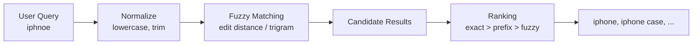

### 15.2 핵심 원리

가장 대표적인 기준은 edit distance다. 두 문자열을 같게 만들기 위해 필요한 최소 편집 횟수를 계산한다.

$$
d(a,b) = min(\text{insert}, \text{delete}, \text{substitute}, \text{transpose})
$$

예를 들어 `kitten`과 `sitting`의 Levenshtein distance는 3이다.

| 오타 유형 | 예 | 처리 방식 |
|---|---|---|
| substitution | `iphine` → `iphone` | 문자 1개 교체 |
| insertion | `iphoone` → `iphone` | 문자 1개 삭제 |
| deletion | `iphon` → `iphone` | 문자 1개 삽입 |
| transposition | `ipohne` → `iphone` | 인접 문자 교환 |

Elasticsearch/OpenSearch의 `fuzziness: AUTO`는 단어 길이에 따라 허용 edit distance를 정한다. 보통 짧은 단어는 정확히 맞추고, 긴 단어는 1~2회 오타를 허용한다.

### 15.3 장단점

| 장점 | 단점 |
|---|---|
| 오타가 있어도 검색 성공률이 올라간다 | 후보 확장이 많아지면 검색 비용이 커진다 |
| 고객명, 종목명, 상품명 검색 UX가 좋아진다 | 너무 관대하면 엉뚱한 결과가 상위에 뜬다 |
| 자동완성/검색어 추천과 잘 결합된다 | 한국어 형태소, 초성, 띄어쓰기 처리는 별도 설계 필요 |
| vector search보다 해석 가능성이 높다 | 의미 기반 검색은 잘 못한다 |

### 15.4 주요 구현 선택지

| 구현 | 특징 | 추천 상황 |
|---|---|---|
| Elasticsearch fuzzy/match | Levenshtein 기반, `fuzziness`, `prefix_length`, `max_expansions` 제어 | 대규모 전문 검색, relevance tuning |
| OpenSearch fuzzy/match | Elasticsearch와 유사한 DSL, Damerau-Levenshtein 거리 설명 | AWS/OpenSearch 기반 검색 |
| MongoDB Atlas Search | `autocomplete`/`text` operator에 `fuzzy` 옵션 | MongoDB 앱에서 검색 기능 확장 |
| PostgreSQL `pg_trgm` | trigram similarity와 GIN/GiST index | 기존 Postgres 앱의 이름/상품명 검색 |
| RapidFuzz | Python fuzzy string matching 라이브러리 | 작은 후보군 reranking, 데이터 정제, record matching |
| Fuse.js | 브라우저/Node.js lightweight fuzzy search | 프론트엔드 로컬 검색 |
| Meilisearch | typo tolerance가 기본 검색 랭킹에 통합 | 빠른 검색 UX, 운영 단순성 |

### 15.5 Fuzzy Search vs Vector Search

| 기준 | Fuzzy Search | Vector Search |
|---|---|---|
| 핵심 기준 | 문자열 형태 유사도 | 의미/문맥 유사도 |
| 예 | `samgsung` → `samsung` | `휴대폰` → `스마트폰` |
| 강점 | 오타, 이름, 코드, SKU | 자연어 질문, 문서 의미 검색 |
| 약점 | 동의어/의미 이해 약함 | 정확한 문자열/코드 검색 약함 |
| 실무 조합 | exact/prefix/fuzzy 후 semantic rerank | semantic 후보 후 keyword filter |

실무 검색 UX는 보통 하나만 쓰지 않는다. `exact match > prefix/autocomplete > fuzzy > semantic` 순으로 후보를 만들고, 업무 중요도에 맞춰 점수를 섞는다.

### 15.6 간단 예제: Python RapidFuzz

```python
from rapidfuzz import process, fuzz

choices = ["Samsung Electronics", "Hyundai Motor", "NVIDIA", "Microsoft"]

result = process.extract(
    "samsng electornics",
    choices,
    scorer=fuzz.WRatio,
    limit=3,
)

print(result)
```

RapidFuzz는 검색엔진이라기보다 문자열 유사도 계산/후보 재정렬에 가깝다. 대용량 전체 검색에는 DB index나 검색엔진으로 후보를 줄인 뒤 RapidFuzz로 reranking하는 구조가 더 안전하다.

### 15.7 실용 예제: PostgreSQL `pg_trgm`

```sql
CREATE EXTENSION IF NOT EXISTS pg_trgm;

CREATE TABLE companies (
  id bigserial PRIMARY KEY,
  name text NOT NULL
);

CREATE INDEX companies_name_trgm_idx
ON companies
USING gin (name gin_trgm_ops);

SELECT id, name, similarity(name, 'samsng') AS score
FROM companies
WHERE name % 'samsng'
ORDER BY score DESC
LIMIT 10;
```

`pg_trgm`은 문자열을 trigram으로 쪼개 유사도를 계산한다. `GIN`/`GiST` index를 함께 쓰면 Postgres 안에서 실용적인 fuzzy search를 만들 수 있다.

### 15.8 실용 예제: Elasticsearch fuzzy query

```json
{
  "query": {
    "match": {
      "company_name": {
        "query": "samsng",
        "fuzziness": "AUTO",
        "prefix_length": 1,
        "max_expansions": 50
      }
    }
  }
}
```

`prefix_length`는 앞부분 몇 글자를 반드시 정확히 맞출지 정한다. 이 값을 키우면 엉뚱한 후보와 비용을 줄일 수 있지만, 앞글자 오타에는 약해진다.

### 15.9 실용 예제: MongoDB Atlas Search autocomplete fuzzy

```javascript
db.products.aggregate([
  {
    $search: {
      autocomplete: {
        path: "name",
        query: "iphno",
        fuzzy: {
          maxEdits: 1,
          prefixLength: 1,
          maxExpansions: 256
        }
      }
    }
  },
  { $limit: 10 },
  { $project: { name: 1, score: { $meta: "searchScore" } } }
])
```

MongoDB Atlas Search의 `fuzzy.maxEdits`는 1 또는 2를 사용한다. 자동완성과 함께 쓸 때는 `prefixLength`와 `maxExpansions`가 품질과 비용을 좌우한다.

### 15.10 실무 설계 가이드

| 상황 | 추천 |
|---|---|
| 종목명/회사명/상품명 검색 | exact + prefix + fuzzy 조합 |
| 오타 허용 검색창 | autocomplete + fuzzy, exact match boost |
| 관리자 화면 빠른 검색 | Postgres `pg_trgm` 또는 MongoDB Atlas Search |
| 대규모 커머스 검색 | Elasticsearch/OpenSearch/Meilisearch |
| STT transcript 보정 | RapidFuzz 후보 매칭 + LLM 검증 |
| 코드/SKU/전화번호 | fuzzy를 약하게 하거나 비활성화, exact 우선 |
| 한국어 검색 | 형태소 분석, 초성 검색, 띄어쓰기 보정 별도 검토 |

### 15.11 리스크/반례

| 리스크 | 설명 | 대응 |
|---|---|---|
| 과도한 recall | 비슷하지만 틀린 결과가 너무 많이 나옴 | exact/prefix boost, threshold 조정 |
| 성능 저하 | fuzzy expansion이 커짐 | `max_expansions`, `prefix_length`, index 사용 |
| 짧은 검색어 오탐 | 2~3글자 query는 유사 후보가 너무 많음 | 짧은 query는 exact/prefix 중심 |
| 보안/권한 | 멀티테넌트에서 다른 tenant 후보 노출 위험 | tenant filter를 fuzzy 전에 강제 |
| 한글 처리 | 자모/초성/띄어쓰기 문제 | 한국어 analyzer 또는 별도 normalized field |

### 15.12 근거 URL

- Elasticsearch fuzzy query: https://www.elastic.co/docs/reference/query-languages/query-dsl/query-dsl-fuzzy-query
- Elasticsearch fuzziness common option: https://www.elastic.co/guide/en/elasticsearch/reference/8.19/common-options.html
- OpenSearch fuzzy query: https://docs.opensearch.org/latest/query-dsl/term/fuzzy/
- MongoDB Atlas Search autocomplete fuzzy: https://www.mongodb.com/docs/atlas/atlas-search/autocomplete/
- PostgreSQL `pg_trgm`: https://www.postgresql.org/docs/current/static/pgtrgm.html
- RapidFuzz documentation: https://rapidfuzz.github.io/RapidFuzz/
- Fuse.js fuzzy search: https://www.fusejs.io/fuzzy-search.html
- Meilisearch typo tolerance: https://www.meilisearch.com/docs/resources/internals/typo_tolerance

---

## 16. 종합 설계 제안

### 16.1 AI SaaS를 만든다면 추천 아키텍처

| 계층 | 추천 |
|---|---|
| API | FastAPI + `asyncio` |
| Tenant isolation | middleware tenant context + DB RLS/filter |
| Agent | 단순 agent는 PydanticAI 또는 LangChain |
| Workflow | 장기 실행/승인/복구는 LangGraph |
| Vector | 기존 MongoDB 중심이면 Atlas Vector Search, Postgres 중심이면 pgvector |
| Vector Metric | 텍스트 RAG는 cosine/dotProduct 우선, 크기 의미가 있으면 L2 검토 |
| Fuzzy Search | 이름/종목/상품 검색은 exact + prefix + fuzzy, 의미 검색은 vector와 결합 |
| Voice | 초저지연이면 Realtime API 또는 streaming STT→LLM→TTS |
| Media | audio bridge/transcoding은 GStreamer |
| Deploy | Docker image → ECR → ECS Fargate |
| Observability | tenant별 latency, TTFT, vector recall, tool failure, cost |

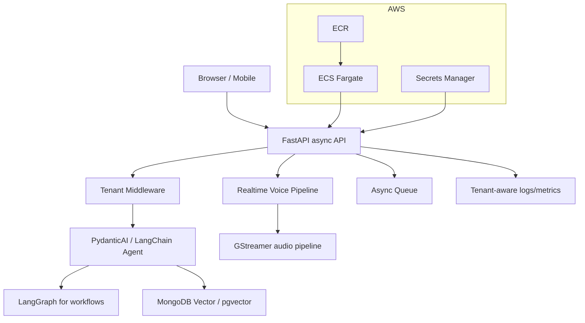

### 16.2 우선순위

| 우선순위 | 할 일 | 이유 |
|---|---|---|
| 1 | tenant context와 권한 경계 설계 | 나중에 고치기 가장 어렵다 |
| 2 | streaming-first API 설계 | 음성/LLM 체감 성능의 핵심 |
| 3 | vector DB를 기존 운영 DB와 맞춰 선택 | 운영 복잡도를 낮춘다 |
| 4 | embedding metric과 index metric 일치 | recall과 ranking 품질을 지키기 위함 |
| 5 | Docker image build/release 규칙 확정 | AWS 배포 안정성 |
| 6 | agent framework는 PoC 후 결정 | 실제 workflow 복잡도에 따라 갈린다 |
| 7 | fuzzy/vector 검색 역할 분리 | 오타 검색과 의미 검색을 혼동하지 않기 위함 |

---

## 17. 호환성 체크리스트

| 항목 | 확인 |
|---|---|
| 수식 렌더링 | `$...$`, `$$...$$` 형식 사용 |
| 코드블록 언어 태그 | `python`, `sql`, `javascript`, `json`, `dockerfile`, `yaml`, `bash`, `mermaid` 사용 |
| 표 깨짐 여부 | 모든 표는 단순 Markdown 표로 작성 |
| 다이어그램 렌더링 | Mermaid `flowchart`, `sequenceDiagram`, `quadrantChart` 사용 |
| Notion 호환성 | Mermaid 미지원 환경에서는 이미지로 변환 필요 |

---

## 18. 사실검증 메모

| 구분 | 검증 내용 | 판단 |
|---|---|---|
| 공식 문서 우선 | Python, LangChain, PydanticAI, MongoDB, Docker, AWS, GStreamer, RFC, YouTube, Twitch, WebRTC, Elasticsearch, OpenSearch, PostgreSQL, RapidFuzz, scikit-learn, pgvector, Pinecone, Qdrant 문서는 공식 문서 중심으로 확인 | 사실 |
| 법률/회계 | RCPS 조항은 국가법령정보센터 상법 원문과 PwC/NABO 자료로 교차 확인 | 사실 |
| 버전 민감도 | LangChain/PydanticAI, OpenAI Realtime, SQL Server/vector DB metric 기능은 빠르게 변할 수 있음 | 검증필요 |
| 실무 예제 | 예제 코드는 개념 전달용이며 실제 API key, provider 설정, 보안 설정은 생략 | 추정/검증필요 |
| 성능 수치 | TTFT/TTFA는 네트워크, region, 모델, endpoint 설정에 크게 의존 | 검증필요 |

## 19. 작성 시 사용한 사용자 질문 프롬프트

```text
아래 내용들을 자세히 조사후 md 파일로 정리해주세요

멀티테넌트

파이썬 비동기 프로그래밍
- 소개
- 장단점
- 특징
- 간단예제
- 실용예제

LangChain, LangGraph
- 소개, 특징, 장단점
- 간단예제, 실용예제

PydanticAI
- 소개, 특징, 장단점
- 간단예제, 실용예제

LangChain, LangGraph vs PydanticAI
- 비교분석

vectorDB in MongoDB
- 소개, 특징, 장단점
- 간단예제, 실용예제

vectorDB in other SQL DB
- 소개, 특징, 장단점
- 간단예제, 실용예제

rcps 보통주 전환

저지연 파이프라인 최적화
stt llm tts 전체파이프라인의 ttft 단축 및 스트리밍 응답 최적화

리서치 항목 추가
gstreamer
- 소개
- 장단점
- 특징
- 간단예제 python
- 실용예제 python

리서치 항목추가
docker
- 소개
- 장단점
- 특징
- 간단예제
- 실용예제
- in AWS 에서 사용 사례, 주의사항

리서치 항목 추가
멀티플렉싱

리서치 주제 추가
실시간 방송송출, 화상통화에서는 VBR or CBR 중 어느것이 더 권장 되는가?
그 이유는?

리서치 주제 추가
fuzzy search

주제 추가
L2 distance vs cosine distance
```
