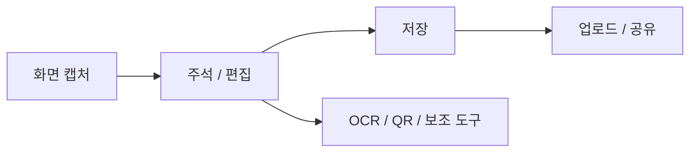

Windows에서 스크린샷을 자주 찍는다면 기본 캡처 도구만으로는 금방 아쉬움이 생깁니다. 캡처한 뒤 화살표를 넣고, 일부 정보를 가리고, 파일로 저장하고, 필요하면 링크로 공유하는 작업이 반복되기 때문입니다.

ShareX는 이 반복 작업을 한 번에 묶어 주는 무료 오픈소스 Windows 앱입니다. 단순 캡처 도구라기보다 `캡처 -> 편집 -> 저장 -> 공유 -> 자동화`를 직접 설계할 수 있는 파워유저형 생산성 도구에 가깝습니다.

---

## ShareX 한 줄 소개

ShareX 공식 사이트는 이 앱을 `Screen capture, file sharing and productivity tool`이라고 소개합니다. GitHub 저장소 설명도 비슷합니다. 사용자가 화면의 어떤 영역이든 단축키 하나로 캡처하거나 녹화할 수 있고, 이미지와 텍스트, 여러 파일 형식을 다양한 목적지로 업로드할 수 있는 앱입니다.

| 항목 | 내용 |
| --- | --- |
| 앱 이름 | ShareX |
| 플랫폼 | Windows |
| 가격 | 무료 |
| 라이선스 | GPL-3.0 |
| 개발 방식 | 오픈소스 |
| 주요 기능 | 화면 캡처, 화면 녹화, 이미지 편집, 파일 공유, OCR, 생산성 도구 |

공식 사이트 기준으로 ShareX는 광고가 없고, 가볍고, 오랫동안 활발히 개발되어 온 도구입니다. GitHub에서도 많은 사용자가 별을 준 공개 프로젝트입니다.



---

## 무엇을 할 수 있나

### 1. 다양한 화면 캡처

ShareX는 전체 화면, 활성 창, 모니터, 영역 지정, 마지막 영역, 사용자 지정 영역, 스크롤 캡처를 지원합니다. 일반적인 사각형 영역뿐 아니라 자유형 캡처도 사용할 수 있습니다.

특히 스크롤 캡처는 웹페이지나 긴 문서처럼 화면 밖으로 이어지는 내용을 여러 장 캡처한 뒤 하나로 합성합니다. 다만 공식 문서에서도 설명하듯이 고정 요소, 애니메이션, hover 효과가 있으면 정확도가 떨어질 수 있습니다.

### 2. 화면 녹화와 GIF 녹화

짧은 사용법 설명, 버그 재현 영상, UI 동작 공유에는 녹화 기능이 유용합니다. ShareX는 화면 녹화와 GIF 녹화를 모두 지원합니다. 개발자나 QA 담당자가 이슈를 설명할 때 텍스트보다 빠르게 상황을 전달할 수 있습니다.

### 3. 이미지 편집과 주석

캡처 후 바로 이미지 편집기를 열어 다음 작업을 할 수 있습니다.

| 도구 | 쓰임새 |
| --- | --- |
| Arrow / Line | 문제 지점 표시 |
| Text / Speech balloon | 설명 추가 |
| Step | 절차 번호 표시 |
| Blur / Pixelate | 개인정보 가리기 |
| Highlight | 중요한 영역 강조 |
| Crop | 필요한 부분만 잘라내기 |

블로그 글, 가이드 문서, 버그 리포트 이미지를 만들 때 이 기능들이 특히 편합니다.

### 4. OCR

ShareX에는 이미지 속 텍스트를 실제 텍스트로 변환하는 OCR 기능이 있습니다. 공식 OCR 문서에 따르면 OCR 언어는 Windows 언어 설정에서 추가할 수 있고, 해당 언어가 OCR 기능을 지원해야 ShareX에서 선택할 수 있습니다.

### 5. 업로드와 공유

ShareX의 강력한 부분은 캡처 후 작업과 업로드 후 작업을 자동화할 수 있다는 점입니다. 예를 들어 캡처 후 이미지를 저장하고, 클립보드에 복사하고, 특정 호스트에 업로드한 뒤 URL을 클립보드에 넣는 식의 흐름을 만들 수 있습니다.

다만 이 기능은 편리한 만큼 조심해야 합니다. 공식 개인정보 정책에 따르면 ShareX 앱 자체는 개인 식별 정보를 포함한 데이터를 수집하지 않는다고 설명합니다. 하지만 사용자가 선택하거나 설정한 서드파티 서비스로 이미지, 텍스트, 영상 등이 전송될 수 있습니다.

---

## 커스텀 업로더가 강력한 이유

ShareX의 커스텀 업로더는 자체 서버나 특정 API에 파일을 올리고 싶은 사용자를 위한 기능입니다. HTTP 메서드, 요청 URL, 파라미터, 헤더, 바디, 응답 파싱 방식을 지정할 수 있습니다.

| 설정 | 예시 |
| --- | --- |
| Request Method | GET, POST, PUT, PATCH, DELETE |
| Body | multipart/form-data, JSON, XML, Binary |
| Header | Authorization, API key |
| 응답 파싱 | JSONPath, XPath, Regex |
| 공유 파일 | `.sxcu` |

내부 QA 서버, 개인 이미지 호스팅, 사내 파일 공유 API와 연결할 때 유용합니다. 반대로 API key나 인증 헤더를 다루므로 설정 파일 공유에는 주의가 필요합니다.

---

## 함께 제공되는 생산성 도구

ShareX에는 캡처 외에도 자잘하지만 자주 필요한 도구가 많습니다.

| 도구 | 용도 |
| --- | --- |
| Color picker | 화면 색상 추출 |
| Ruler | 화면 거리 측정 |
| Pin to screen | 이미지를 화면 위에 고정 |
| Image combiner/splitter | 이미지 합치기/분할 |
| Video converter | 영상 변환 |
| QR code | QR 생성/스캔 |
| Hash checker | 파일 해시 검증 |
| Metadata | 파일 메타데이터 확인/제거 |
| Clipboard viewer | 클립보드 확인 |

이런 기능 때문에 ShareX는 캡처 앱이면서 동시에 개발자용 보조 도구 모음처럼 느껴집니다.

---

## 장점과 주의점

### 장점

| 장점 | 설명 |
| --- | --- |
| 무료 오픈소스 | GPL-3.0 라이선스의 공개 프로젝트 |
| 광고 없음 | 공식 사이트에서 광고 없음 강조 |
| 자동화 강함 | 캡처 후 작업, 업로드 후 작업, 단축키, 액션 설정 가능 |
| 기능 폭 넓음 | 캡처, 녹화, OCR, QR, 색상 추출, 편집 제공 |
| 파워유저 친화적 | 커스텀 업로더와 명령행 인자 지원 |

### 주의점

| 주의점 | 설명 |
| --- | --- |
| 설정이 많음 | 처음 쓰는 사용자는 복잡하게 느낄 수 있음 |
| 업로드 설정 주의 | 민감한 화면이 외부 서비스로 전송되지 않도록 확인 필요 |
| 스크롤 캡처 한계 | 동적 페이지에서는 합성이 실패할 수 있음 |
| Windows 중심 | macOS나 Linux에서는 다른 대체재 필요 |

---

## 추천 사용법

처음 설치했다면 모든 기능을 한 번에 쓰려고 하기보다 다음 순서로 익히는 것이 좋습니다.

1. 영역 캡처 단축키를 설정한다.
2. 캡처 후 자동 업로드가 꺼져 있는지 확인한다.
3. 이미지 편집기에서 화살표, 텍스트, 블러, 번호 표시를 익힌다.
4. 화면 녹화와 GIF 녹화를 테스트한다.
5. 필요할 때 OCR, QR, Pin to screen을 추가로 사용한다.
6. 자체 서버가 있을 때만 커스텀 업로더를 설정한다.

---

## 결론

ShareX는 Windows 기본 캡처 도구보다 훨씬 강력합니다. 특히 개발자, QA 담당자, 기술 블로거처럼 캡처와 공유를 반복하는 사람에게 잘 맞습니다.

다만 기능이 많은 만큼 처음에는 설정이 복잡할 수 있고, 업로드 자동화는 반드시 확인해야 합니다. 민감한 정보가 포함된 화면을 자주 다룬다면 `Blur`, `Pixelate`, 자동 업로드 비활성화 설정을 먼저 확인하는 것이 좋습니다.

---

## 참고자료

- ShareX 공식 사이트: https://getsharex.com/
- ShareX GitHub 저장소: https://github.com/ShareX/ShareX
- ShareX 변경 이력: https://getsharex.com/changelog
- ShareX OCR 문서: https://getsharex.com/docs/ocr
- ShareX 스크롤 캡처 문서: https://getsharex.com/docs/scrolling-screenshot
- ShareX 커스텀 업로더 문서: https://getsharex.com/docs/custom-uploader
- ShareX 개인정보 정책: https://getsharex.com/privacy-policy
- Microsoft Store 페이지: https://apps.microsoft.com/detail/9nblggh4z1sp

---

## 작성 프롬프트

```text
win app shareX 에 대한 소개

hhd-research
hhd-md
hhd-blog

자료조사후
hhddoc 에 md 파일 만들고 커밋푸시
블로그용 md 만들고 커밋푸시
```
