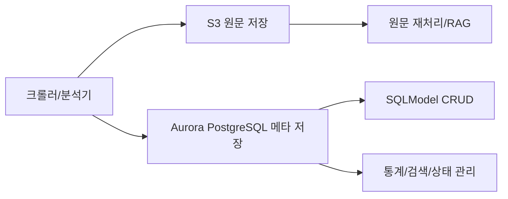
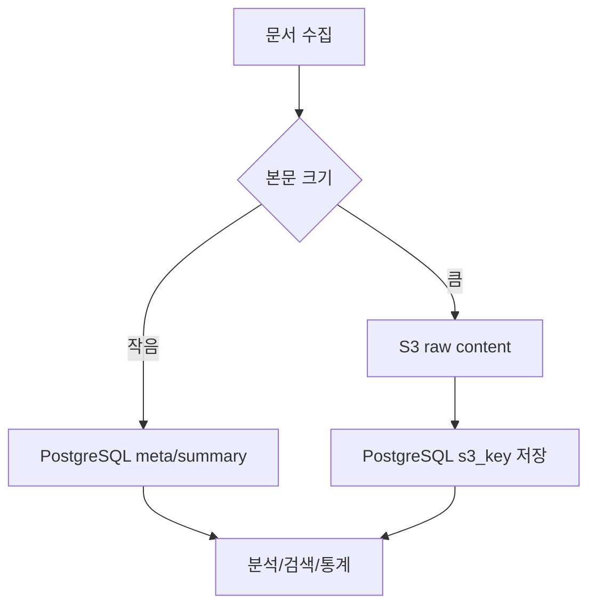
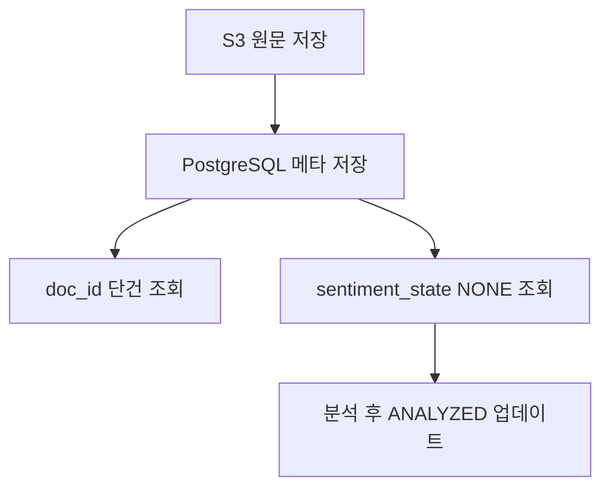

# HhdStock 문서처리 DB를 Firestore에서 Aurora PostgreSQL + S3로 전환하기

HhdStock 프로젝트는 뉴스, 공시, 리포트, PDF 본문을 수집하고 요약, 감정분석, 통계, 검색으로 확장하려는 구조다. 초기에는 Firestore가 빠르고 편하지만, 문서량이 커지고 분석 작업이 늘어나면 `Aurora PostgreSQL + S3 + SQLModel` 조합이 더 적합해진다.

## 결론

| 상황 | 추천 |
|---|---|
| 작은 문서, 단순 조회, 빠른 MVP | Firestore |
| 긴 본문, 대량 배치, 검색, 통계, RAG | Aurora PostgreSQL + S3 |
| 원문 HTML/PDF/text | S3 |
| 문서 메타, 분석 상태, 요약 | Aurora PostgreSQL |
| Python ORM | SQLModel 또는 SQLAlchemy 2.x |



## 왜 Firestore 단독 구조가 부담될 수 있나

현재 HhdStock의 `StockDoc` 성격 데이터는 다음과 같다.

| 데이터 | 특징 | Firestore 단독 사용 시 이슈 |
|---|---|---|
| 뉴스/공시/리포트 본문 | 길어질 수 있음 | 문서 1MiB 제한 |
| 감정분석 결과 | 배열/객체 구조 | 인덱스 fanout 가능 |
| 상태값 | `NONE`, `ANALYZING`, `ANALYZED` | 대량 상태 조회/갱신 비용 |
| 통계 | market/type/state count | 반복 read 비용 |
| 검색/RAG | 본문 기반 검색 필요 | 별도 검색 구조 필요 |

Firestore는 문서형 서버리스 DB로 운영이 쉽다. 하지만 이 프로젝트처럼 원문이 커지고, 배치 분석과 통계 쿼리가 많아지면 관계형 DB의 장점이 커진다.

## Aurora PostgreSQL은 Firestore처럼 확장되는가

완전히 같은 방식은 아니다. Firestore는 NoSQL 서버리스 DB이고, Aurora PostgreSQL은 PostgreSQL 호환 관계형 DB다. 다만 AWS에서 Firestore처럼 큰 확장성을 기대할 수 있는 PostgreSQL 계열 제품은 `Aurora PostgreSQL Serverless v2`가 가장 가깝다.

| 항목 | Firestore | Aurora PostgreSQL Serverless v2 |
|---|---|---|
| 확장 방식 | 서버리스 NoSQL | ACU 기반 compute 자동 확장 |
| 저장 용량 | 문서 DB | Aurora cluster volume 최대 256TiB |
| 쿼리 | 제한적 NoSQL 쿼리 | SQL, JOIN, 집계, JSONB, FTS |
| 운영 난이도 | 낮음 | 중간 이상 |
| 대량 문서 분석 | 비용 증가 가능 | 인덱스/쿼리 튜닝으로 대응 |

## ACU란 무엇인가

`ACU`는 `Aurora Capacity Unit`이다. Aurora Serverless v2에서 DB compute 용량을 나타내는 단위다.

| 설정 | 의미 |
|---|---|
| `MinCapacity=0` | idle 시 0 ACU까지 auto-pause 가능 |
| `MinCapacity=0.5` | 항상 최소 compute 유지 |
| `MaxCapacity=4` | dev/소규모 배치용 |
| `MaxCapacity=8~16` | 초기 운영용 |

비용 감각은 대략 다음과 같다.

$$
\text{Aurora compute cost} \approx \text{ACU-hour 단가} \times \text{평균 ACU} \times \text{사용 시간}
$$

Firestore는 read/write/delete 요청 수와 저장량이 핵심이고, Aurora는 ACU 시간, 스토리지, I/O, 백업이 핵심이다.

## JSONB란 무엇인가

`JSONB`는 PostgreSQL의 binary JSON 타입이다. Firestore의 map/object 같은 유연성을 PostgreSQL 안에서 얻을 수 있다.

```sql
create table stock_doc (
    id text primary key,
    meta jsonb not null default '{}',
    sentiment_list jsonb not null default '[]'
);
```

```sql
select *
from stock_doc
where meta->>'provider' = 'NAVER';
```

```sql
create index idx_stock_doc_meta_gin
on stock_doc using gin (meta);
```

HhdStock의 `meta`, `sentiment_list`는 PostgreSQL에서 `jsonb`로 옮기기 좋다. 다만 자주 조인하거나 집계해야 하는 분석 결과는 별도 테이블로 정규화하는 편이 낫다.

## 운영비용 비교

| 비용 항목 | Firestore | Aurora PostgreSQL + S3 |
|---|---|---|
| 소규모 MVP | 유리 | 상대적으로 부담 |
| 유휴 비용 | 낮음 | min ACU 설정에 따라 발생 |
| 대량 조회/배치 | read 비용 증가 가능 | ACU/I/O 비용 증가 |
| 긴 원문 저장 | 1MiB 제한 | S3로 저렴하게 분리 가능 |
| 통계/검색 | 제한적 | SQL/인덱스/FTS 활용 |
| 운영 부담 | 낮음 | 커넥션, VPC, 백업, 튜닝 필요 |

비용 최적화의 핵심은 긴 원문을 DB에 직접 넣지 않는 것이다. 원문은 S3, DB에는 `s3_bucket`, `s3_key`, `content_len`, `summary`, `sentiment_state`만 저장한다.



## AWS 구성 가이드

필수 리소스는 다음과 같다.

| 리소스 | 용도 |
|---|---|
| S3 Bucket | 원문 HTML/PDF/markdown/text 저장 |
| Aurora PostgreSQL Serverless v2 | 문서 메타, 상태, 요약, 감정분석 저장 |
| Secrets Manager | DB 계정/비밀번호 보관 |
| IAM Role/User | Python 앱의 S3 접근 권한 |
| RDS Proxy | 운영 환경 커넥션 풀링 |

한국 기준 리전은 `ap-northeast-2`가 자연스럽다.

### S3 key 설계

```text
stock-doc/raw/{market}/{type}/{provider}/{yyyy}/{mm}/{doc_id}.md
stock-doc/raw/KR/NEWS/NAVER/2026/06/KR_NEWS_NAVER_001_0001.md
stock-doc/raw/US/FILING/SEC/2026/06/US_FILING_SEC_0000320193.md
```

### Aurora 초기 설정

| 항목 | dev | prod 초기 |
|---|---:|---:|
| Engine | Aurora PostgreSQL | Aurora PostgreSQL |
| Instance class | Serverless v2 | Serverless v2 |
| Min ACU | 0 또는 0.5 | 0.5 또는 1 |
| Max ACU | 4 | 8~16 |
| Public access | 가능하면 NO | NO |
| Backup retention | 1~3일 | 7~14일 |

로컬 PC에서 직접 접속하려면 public access 또는 터널링이 필요하다. 운영에서는 같은 VPC의 EC2/ECS/Lambda, SSM tunnel, bastion, RDS Proxy 중 하나를 쓰는 편이 안전하다.

## PostgreSQL 스키마 예시

```sql
create table stock_doc (
    id text primary key,
    market text not null,
    type text not null,
    type_detail text not null default '',
    provider text not null default '',
    url text not null default '',
    title text not null default '',
    writer text not null default '',
    summary text not null default '',
    content_len integer not null default 0,
    content_s3_bucket text not null default '',
    content_s3_key text not null default '',
    sentiment_state text not null default 'NONE',
    sentiment_list jsonb not null default '[]',
    meta jsonb not null default '{}',
    dt_publish timestamptz null,
    dt_create timestamptz not null default now(),
    dt_update timestamptz not null default now()
);

create index idx_stock_doc_market_type_publish
on stock_doc (market, type, dt_publish desc);

create index idx_stock_doc_sentiment_state
on stock_doc (sentiment_state);

create index idx_stock_doc_meta_gin
on stock_doc using gin (meta);
```

RAG나 본문 검색을 확장하면 청크 테이블을 추가한다.

```sql
create table stock_doc_chunk (
    id bigserial primary key,
    stock_doc_id text not null references stock_doc(id) on delete cascade,
    chunk_index integer not null,
    content text not null,
    token_count integer not null default 0,
    meta jsonb not null default '{}',
    dt_create timestamptz not null default now(),
    unique (stock_doc_id, chunk_index)
);
```

## Python ORM은 SQLModel 추천

HhdStock은 이미 Pydantic 기반 DTO를 사용하고 있으므로 `SQLModel`이 잘 맞는다.

| ORM | 추천도 | 이유 |
|---|---:|---|
| SQLModel | 높음 | Pydantic + SQLAlchemy, DTO 친화적 |
| SQLAlchemy 2.x | 매우 높음 | 복잡한 쿼리/운영에 강함 |
| Django ORM | 조건부 | Django 프로젝트일 때 적합 |
| Tortoise ORM | 조건부 | async 친화적 |

설치 패키지는 다음과 같다.

```bash
pip install sqlmodel sqlalchemy psycopg[binary] boto3 python-dotenv
```

## SQLModel 모델 예제

```python
from datetime import datetime
from typing import Any

from sqlalchemy import Column
from sqlalchemy.dialects.postgresql import JSONB
from sqlmodel import Field, SQLModel


class StockDoc(SQLModel, table=True):
    __tablename__ = "stock_doc"

    id: str = Field(primary_key=True)
    market: str = Field(index=True)
    type: str = Field(index=True)
    provider: str = Field(default="", index=True)

    url: str = ""
    title: str = ""
    summary: str = ""

    content_len: int = 0
    content_s3_bucket: str = ""
    content_s3_key: str = ""

    sentiment_state: str = Field(default="NONE", index=True)
    sentiment_list: list[dict[str, Any]] = Field(
        default_factory=list,
        sa_column=Column(JSONB, nullable=False),
    )
    meta: dict[str, Any] = Field(
        default_factory=dict,
        sa_column=Column(JSONB, nullable=False),
    )

    dt_publish: datetime | None = None
    dt_create: datetime = Field(default_factory=datetime.utcnow)
    dt_update: datetime = Field(default_factory=datetime.utcnow)
```

## DB 연결 예제

```python
import os
from collections.abc import Generator

from sqlmodel import Session, SQLModel, create_engine


DATABASE_URL = os.environ["HHD_DB_URL"]

engine = create_engine(
    DATABASE_URL,
    pool_pre_ping=True,
    pool_size=5,
    max_overflow=10,
    echo=False,
)


def create_db_and_tables() -> None:
    SQLModel.metadata.create_all(engine)


def get_session() -> Generator[Session, None, None]:
    with Session(engine) as session:
        yield session
```

## S3 저장 예제

```python
import os

import boto3


AWS_REGION = os.environ.get("HHD_AWS_REGION", "ap-northeast-2")
S3_BUCKET = os.environ["HHD_S3_BUCKET"]

s3_client = boto3.client("s3", region_name=AWS_REGION)


def put_text_to_s3(*, key: str, text: str, content_type: str = "text/markdown") -> tuple[str, str]:
    s3_client.put_object(
        Bucket=S3_BUCKET,
        Key=key,
        Body=text.encode("utf-8"),
        ContentType=f"{content_type}; charset=utf-8",
    )

    return S3_BUCKET, key
```

## CRUD와 upsert 예제

```python
from datetime import datetime

from sqlalchemy.dialects.postgresql import insert
from sqlmodel import Session, select

from models import StockDoc


def get_stock_doc(session: Session, doc_id: str) -> StockDoc | None:
    return session.get(StockDoc, doc_id)


def list_pending_docs(session: Session, limit: int = 100) -> list[StockDoc]:
    stmt = (
        select(StockDoc)
        .where(StockDoc.sentiment_state == "NONE")
        .order_by(StockDoc.dt_publish.desc())
        .limit(limit)
    )
    return list(session.exec(stmt).all())


def update_analyzed_doc(
    session: Session,
    doc_id: str,
    *,
    summary: str,
    sentiment_list: list[dict],
) -> StockDoc | None:
    doc = session.get(StockDoc, doc_id)
    if doc is None:
        return None

    doc.summary = summary
    doc.sentiment_list = sentiment_list
    doc.sentiment_state = "ANALYZED"
    doc.dt_update = datetime.utcnow()

    session.add(doc)
    session.commit()
    session.refresh(doc)
    return doc


def upsert_stock_doc(session: Session, data: dict) -> StockDoc:
    now = datetime.utcnow()
    data["dt_update"] = now

    stmt = insert(StockDoc).values(**data)
    update_data = {key: value for key, value in data.items() if key not in {"id", "dt_create"}}

    stmt = stmt.on_conflict_do_update(
        index_elements=[StockDoc.id],
        set_=update_data,
    )

    session.exec(stmt)
    session.commit()

    doc = session.get(StockDoc, data["id"])
    if doc is None:
        raise RuntimeError(f"StockDoc upsert failed: {data['id']}")

    return doc
```

## 적용 순서

| 순서 | 작업 | 완료 기준 |
|---:|---|---|
| 1 | Aurora + S3 dev 환경 생성 | 접속/업로드 가능 |
| 2 | SQLModel 모델 추가 | `stock_doc` 생성 가능 |
| 3 | 신규 크롤링 결과 dual write | Firestore와 PostgreSQL 동시 저장 |
| 4 | 원문을 S3로 분리 | DB에는 S3 key만 저장 |
| 5 | 분석 batch PostgreSQL 전환 | `sentiment_state` 기반 queue 대체 |
| 6 | 웹 조회 API 전환 | Firestore 의존도 축소 |

최소 PoC는 다음 5개만 구현하면 된다.



## 참고 URL

| 주제 | URL |
|---|---|
| Aurora 개요 | https://docs.aws.amazon.com/AmazonRDS/latest/AuroraUserGuide/CHAP_AuroraOverview.html |
| Aurora Serverless v2 | https://docs.aws.amazon.com/AmazonRDS/latest/AuroraUserGuide/aurora-serverless-v2.how-it-works.html |
| Aurora Serverless v2 생성 | https://docs.aws.amazon.com/AmazonRDS/latest/AuroraUserGuide/aurora-serverless-v2.create.html |
| Aurora PostgreSQL 생성/접속 | https://docs.aws.amazon.com/AmazonRDS/latest/AuroraUserGuide/CHAP_GettingStartedAurora.CreatingConnecting.AuroraPostgreSQL.html |
| RDS Data API | https://docs.aws.amazon.com/AmazonRDS/latest/AuroraUserGuide/data-api.html |
| S3 bucket 생성 | https://docs.aws.amazon.com/AmazonS3/latest/userguide/create-bucket-overview.html |
| Firestore quota | https://cloud.google.com/firestore/native/docs/quotas |
| Firestore best practices | https://cloud.google.com/firestore/native/docs/best-practices |
| SQLModel session 예제 | https://sqlmodel.tiangolo.com/tutorial/fastapi/session-with-dependency/ |

## 마무리

Firestore는 초기 개발 속도와 운영 단순성 면에서 강하다. 하지만 HhdStock처럼 문서량이 많고, 원문 저장, 감정분석, 요약, 통계, 검색이 중요한 프로젝트는 PostgreSQL 쪽 장점이 빠르게 커진다. 현실적인 방향은 Firestore를 보조 저장소로 남기고, 문서처리 핵심 파이프라인은 `Aurora PostgreSQL + S3 + SQLModel`로 분리하는 것이다.
