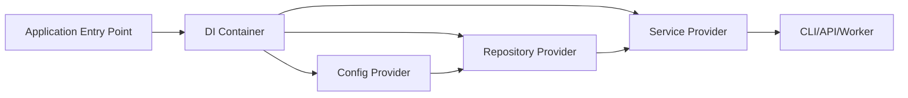
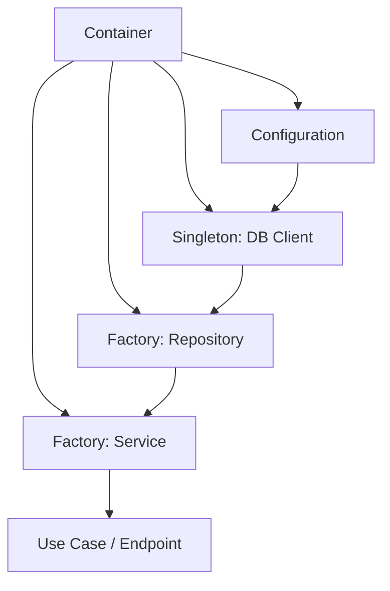
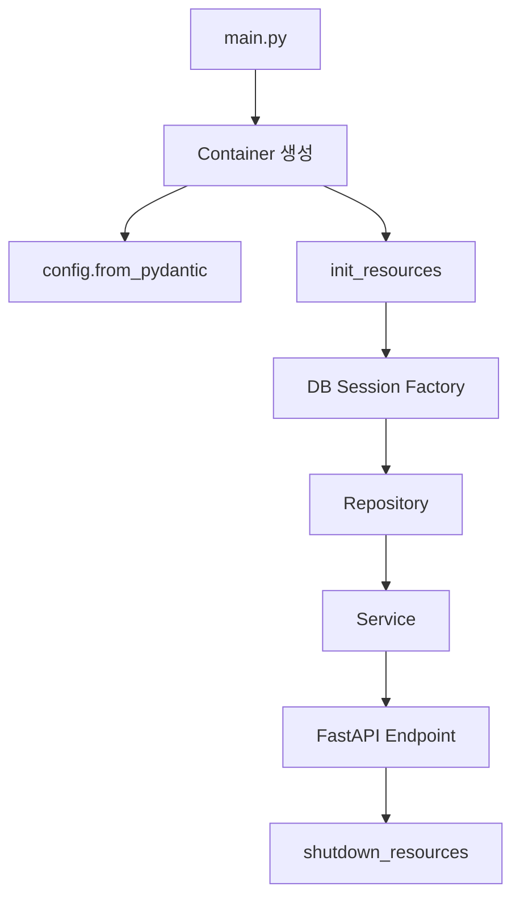

Python에서 DI(Dependency Injection)와 IoC(Inversion of Control)를 구현하는 방법은 크게 세 갈래다.

| 선택지 | 대표 도구 | 적합한 상황 | 결론 |
|---|---|---|---|
| 웹 프레임워크 내장 DI | FastAPI `Depends` | FastAPI API 서버 내부 의존성 | FastAPI 프로젝트만이면 가장 자연스럽다. |
| 범용 DI/IoC 컨테이너 | `dependency-injector` | CLI, 배치, 웹, 테스트, 설정, 리소스 생명주기 | 범용 솔루션 중 가장 추천한다. |
| 타입 기반 자동 wiring | `injector`, `lagom`, `punq`, `dishka` | 작은 앱, 명시적 타입 중심 설계, 최신 스코프 모델 | 요구에 따라 선택한다. |

결론부터 말하면 **Python 범용 DI/IoC 솔루션으로는 `dependency-injector`를 선택하는 것이 가장 안전하다.** 공식 문서가 풍부하고, Provider/Container/Wiring/Configuration/Resource/Override 기능이 모두 있고, Flask, Django, FastAPI, Aiohttp, Sanic 등과 통합 예제가 있다. GitHub 지표도 범용 DI 라이브러리 후보 중 가장 높았다.

단, “FastAPI 안에서만 라우터 의존성을 주입한다”는 문제라면 별도 컨테이너 없이 FastAPI의 `Depends`만 쓰는 것이 더 단순하다. `dependency-injector`는 애플리케이션 전역 조립, 테스트 대체, 설정 주입, 리소스 초기화/종료까지 필요할 때 진가가 있다.

## 용어 정리

| 용어 | 의미 | Python에서의 모습 |
|---|---|---|
| DI | 객체가 직접 의존 객체를 만들지 않고 외부에서 받는 설계 | `Service(repo=repo)` |
| IoC | 객체 생성과 연결의 제어권을 애플리케이션 코드 밖으로 넘기는 설계 | `container.service()` |
| Container | 의존성 생성 규칙을 모아둔 객체 | `Container` 클래스 |
| Provider | 객체 생성 방식의 선언 | `Factory`, `Singleton`, `Resource` |
| Wiring | 함수/메서드 파라미터에 컨테이너 값을 자동 주입 | `@inject`, `Provide[...]` |



DI의 핵심은 “비즈니스 객체가 구체 구현을 직접 선택하지 않게 하는 것”이다. 작은 스크립트에서는 과한 구조가 될 수 있지만, 테스트 대체와 운영 설정이 많아지는 순간 컨테이너가 조립 지점을 명확하게 만든다.

## 후보 라이브러리 비교

| 후보 | 유형 | 주요 특징 | 장점 | 단점 | GitHub stars |
|---|---|---|---|---|---:|
| FastAPI `Depends` | 웹 프레임워크 내장 DI | 라우트 함수 의존성, sub-dependency, yield dependency, OpenAPI 통합 | FastAPI에서는 표준에 가깝고 학습 비용이 낮다. | 범용 IoC 컨테이너는 아니다. CLI/배치/도메인 조립에는 한계가 있다. | 99,201 |
| `dependency-injector` | 범용 DI 프레임워크 | Provider, Container, Wiring, Override, Config, Resource, async, mypy | 기능이 가장 완성형이고 문서/예제가 풍부하다. 테스트 대체가 강하다. | Provider 문법 학습 비용이 있고 단순 앱에는 과하다. | 4,882 |
| `injector` | Guice 스타일 DI | Module, Binder, Scope, type 기반 주입 | 오래된 프로젝트이고 API가 비교적 명확하다. | 전역 자동 주입을 피하는 철학이라 명시적 사용이 필요하다. 생태계 규모는 `dependency-injector`보다 작다. | 1,528 |
| `dishka` | 최신 DI 프레임워크 | Scope, finalization, modular provider, framework integration | request/app 등 생명주기 설계가 좋고 최신 Python 웹앱에 잘 맞는다. | 상대적으로 신생 프로젝트라 장기 안정성 검증 기간은 짧다. | 1,188 |
| `punq` | 경량 IoC 컨테이너 | no global state, no decorators, 단순 register/resolve | 코드가 작고 이해하기 쉽다. Clean Architecture 예제에 잘 맞는다. | 설정, 리소스, wiring 등 대형 앱 기능은 부족하다. | 423 |
| `lagom` | 타입 기반 자동 wiring | zero config, type 기반, mypy, async, web integration | 타입 힌트만으로 빠르게 조립된다. | 자동 wiring은 편하지만 암묵성이 생길 수 있다. | 349 |
| `injectable` | 데코레이터 기반 DI | injectable decorator, qualifier, singleton, lazy, test mock | 사용법이 직관적이고 서비스 로케이터처럼 쓸 수 있다. | 데코레이터/자동 탐색은 코드 결합을 만들 수 있다. | 119 |
| `wired` | IoC/service locator | registry/container, pluggable app, caching | 플러그인형 시스템에 맞다. | 범용 DI 대중성은 낮다. | 18 |

GitHub stars는 2026-06-15 웹 조회 기준이다. FastAPI는 DI 라이브러리가 아니라 웹 프레임워크이므로 범용 DI 라이브러리 인기 비교에서는 별도로 봐야 한다.

## 후보별 소개와 판단

### FastAPI `Depends`

FastAPI 공식 문서는 FastAPI에 “강력하지만 직관적인 Dependency Injection system”이 있다고 설명한다. 라우터 함수가 필요한 값을 선언하면 FastAPI가 의존성을 호출하고 결과를 주입한다.

| 항목 | 내용 |
|---|---|
| 강점 | API 엔드포인트, 인증, DB 세션, 공통 파라미터, OpenAPI 문서화에 매우 강하다. |
| 약점 | FastAPI 외부의 CLI, 배치, 도메인 서비스 조립에는 범용 컨테이너만큼 적합하지 않다. |
| 추천 상황 | FastAPI 단일 앱에서 request 단위 의존성만 필요할 때 |

```python
from typing import Annotated

from fastapi import Depends, FastAPI

app = FastAPI()


def get_repository() -> "UserRepository":
    return UserRepository()


@app.get("/users/{user_id}")
def get_user(
    user_id: int,
    repo: Annotated["UserRepository", Depends(get_repository)],
):
    return repo.get(user_id)
```

### `dependency-injector`

공식 문서는 `dependency-injector`를 Python용 dependency injection framework라고 설명한다. 핵심 기능으로 `Factory`, `Singleton`, `Callable`, `Coroutine`, `Object`, `List`, `Dict`, `Configuration`, `Resource`, `Dependency`, `Selector` Provider, Provider overriding, 설정 로딩, 리소스 초기화/종료, 컨테이너, wiring, async injection, typing/mypy, Cython 기반 성능을 제시한다.

| 항목 | 내용 |
|---|---|
| 강점 | 앱 조립 지점이 선명하고 테스트에서 Provider override가 매우 편하다. 설정과 리소스 생명주기를 함께 다룰 수 있다. |
| 약점 | 작은 프로젝트에서는 컨테이너와 provider 선언이 장황할 수 있다. |
| 추천 상황 | 운영 앱, 테스트 대체, 설정 주입, 외부 API/DB 클라이언트 교체가 필요한 프로젝트 |



### `injector`

`injector`는 Guice에서 영감을 받은 Python DI 프레임워크다. 공식 문서는 Python이 keyword arguments와 mock이 쉬워 DI가 비교적 쉽지만, 큰 앱에서는 boilerplate를 줄이는 프레임워크가 도움된다고 설명한다. 핵심 철학은 단순성, 전역 상태 없음, 타입 체커 협력이다.

| 항목 | 내용 |
|---|---|
| 강점 | Module/Binder 기반 구조가 명확하고 타입 힌트와 잘 맞는다. |
| 약점 | Provider override, config, resource lifecycle 같은 운영 편의 기능은 `dependency-injector`보다 약하다. |
| 추천 상황 | Guice 스타일에 익숙하고 명시적 module 구성을 선호할 때 |

### `dishka`

`dishka`는 scope와 finalization을 강조하는 최신 DI 프레임워크다. 공식 문서는 app/request 등 다양한 lifespan을 정의할 수 있고, DB connection 같은 의존성의 종료 처리를 지원하며, 여러 웹 프레임워크 통합을 제공한다고 설명한다.

| 항목 | 내용 |
|---|---|
| 강점 | scope와 finalization 모델이 좋고, 현대 웹앱의 request lifecycle과 잘 맞는다. |
| 약점 | 신생 프로젝트라 조직 표준으로 선택할 때 장기 유지보수 추이를 봐야 한다. |
| 추천 상황 | request scope, app scope, resource cleanup이 중요한 최신 Python 웹앱 |

### `punq`

`punq`는 “이해할 수 있는 DI 라이브러리”를 목표로 한다. 공식 문서는 no global state, no decorators, no weird syntax, 작은 코드베이스와 100% test coverage를 강조한다.

| 항목 | 내용 |
|---|---|
| 강점 | 매우 단순하고 도메인 코드 침투가 적다. |
| 약점 | 대규모 앱을 위한 고급 provider, wiring, resource lifecycle은 부족하다. |
| 추천 상황 | Clean Architecture 샘플, 작은 서비스, 명시적 register/resolve 선호 |

### `lagom`

`lagom`은 “just enough” DI를 지향한다. 공식 문서는 type based auto wiring, zero configuration, mypy, async, web framework integration, runtime thread-safety를 강조한다.

| 항목 | 내용 |
|---|---|
| 강점 | 타입 힌트만 잘 있으면 설정이 거의 필요 없다. |
| 약점 | 자동 wiring은 편하지만 어떤 객체가 언제 만들어지는지 추적이 어려워질 수 있다. |
| 추천 상황 | 타입 힌트 중심 코드베이스, 빠른 프로토타입, 중간 규모 앱 |

### `injectable`

`injectable`은 데코레이터와 자동 discovery 중심의 DI 라이브러리다. qualifier, lazy injection, optional injection, singleton, factory, test mocking 등을 제공한다.

| 항목 | 내용 |
|---|---|
| 강점 | 데코레이터로 빠르게 붙일 수 있고 사용법이 직관적이다. |
| 약점 | 도메인 코드가 DI 프레임워크 데코레이터를 알게 되는 결합이 생길 수 있다. |
| 추천 상황 | 빠른 자동 discovery와 데코레이터 스타일을 선호할 때 |

### `wired`

`wired`는 pluggable application을 위한 IoC/service locator 성격이 강하다. registry와 container를 통해 서비스를 등록하고 찾는다.

| 항목 | 내용 |
|---|---|
| 강점 | 플러그인형 시스템, 구성 시간과 실행 시간 분리에 적합하다. |
| 약점 | 대중성과 범용 DI 기능 면에서는 제한적이다. |
| 추천 상황 | Pyramid 계열/플러그인형 확장 시스템 |

## 가장 인기 있는 범용 솔루션 선택

범용 DI/IoC 라이브러리 중에서는 `dependency-injector`를 선택한다.

| 판단 기준 | `dependency-injector` 평가 |
|---|---|
| 인기도 | 범용 DI 후보 중 GitHub stars가 가장 높다. |
| 문서 | 공식 문서가 상세하고 예제가 많다. |
| 기능 | Provider, Container, Wiring, Config, Resource, Override, async, typing을 모두 제공한다. |
| 테스트 | Provider override가 테스트/스테이징 대체에 직접적이다. |
| 프레임워크 통합 | FastAPI, Flask, Django, Aiohttp, Sanic 등 예제가 있다. |
| 운영성 | 설정 로딩과 리소스 초기화/종료를 컨테이너에 모을 수 있다. |

선택 기준을 수식처럼 단순화하면 다음과 같다.

$$
Score = Popularity + Documentation + FeatureCompleteness + Testability + FrameworkIntegration - Complexity
$$

이 기준에서 `dependency-injector`는 복잡도 비용이 있지만, 나머지 항목 점수가 높다. 특히 운영 앱에서는 복잡도보다 명시적 조립과 테스트 대체 가능성이 더 중요하다.

## `dependency-injector` 기본 구현

가장 작은 예제로 Repository와 Service를 조립해 보자.

```python
from dataclasses import dataclass
from typing import Protocol

from dependency_injector import containers, providers


class UserRepository(Protocol):
    def get_name(self, user_id: int) -> str:
        ...


class InMemoryUserRepository:
    def __init__(self, users: dict[int, str]) -> None:
        self._users = users

    def get_name(self, user_id: int) -> str:
        return self._users[user_id]


@dataclass
class UserService:
    repository: UserRepository

    def greeting(self, user_id: int) -> str:
        return f"Hello, {self.repository.get_name(user_id)}"


class Container(containers.DeclarativeContainer):
    config = providers.Configuration()

    user_repository = providers.Singleton(
        InMemoryUserRepository,
        users=config.users,
    )

    user_service = providers.Factory(
        UserService,
        repository=user_repository,
    )


def main() -> None:
    container = Container()
    container.config.users.from_value({1: "Alice", 2: "Bob"})

    service = container.user_service()
    print(service.greeting(1))


if __name__ == "__main__":
    main()
```

### 기본 구현 포인트

| 코드 | 의미 |
|---|---|
| `providers.Configuration()` | 설정값을 나중에 주입한다. |
| `providers.Singleton(...)` | 앱 전체에서 하나만 생성한다. DB client, API client에 적합하다. |
| `providers.Factory(...)` | 호출할 때마다 새 객체를 만든다. Service, UseCase에 적합하다. |
| `container.user_service()` | 컨테이너가 의존성 그래프를 따라 객체를 조립한다. |

## 테스트 대체 구현

`dependency-injector`의 실전 장점은 Provider override다. 외부 API, DB, 파일 시스템 같은 의존성을 테스트에서 쉽게 바꿀 수 있다.

```python
from unittest import mock


def test_user_service_greeting() -> None:
    container = Container()
    repository = mock.Mock()
    repository.get_name.return_value = "TestUser"

    with container.user_repository.override(repository):
        service = container.user_service()
        assert service.greeting(10) == "Hello, TestUser"
```

| 장점 | 설명 |
|---|---|
| 테스트 격리 | 실제 DB/API 없이 Service 테스트 가능 |
| 스테이징 대체 | 운영 API client를 stub client로 바꿀 수 있음 |
| 범위 제한 | `with provider.override(...)` 컨텍스트 안에서만 대체 가능 |

## 실용 구현: 설정, 리소스, FastAPI 통합

실무에서는 보통 다음 구조를 사용한다.

```text
app/
  containers.py
  settings.py
  db.py
  repositories.py
  services.py
  api.py
  main.py
```



### `settings.py`

```python
from pydantic_settings import BaseSettings, SettingsConfigDict


class Settings(BaseSettings):
    model_config = SettingsConfigDict(env_prefix="APP_")

    database_url: str = "sqlite:///./app.db"
    external_api_base_url: str = "https://api.example.com"
    external_api_timeout: float = 3.0
```

### `services.py`

```python
from dataclasses import dataclass
from typing import Protocol


class UserRepository(Protocol):
    def get_name(self, user_id: int) -> str:
        ...


class AuditClient(Protocol):
    def write_event(self, event_name: str, payload: dict) -> None:
        ...


@dataclass
class UserService:
    repository: UserRepository
    audit_client: AuditClient

    def get_profile_message(self, user_id: int) -> str:
        name = self.repository.get_name(user_id)
        self.audit_client.write_event("profile_read", {"user_id": user_id})
        return f"User profile: {name}"
```

### `repositories.py`

```python
class SqlUserRepository:
    def __init__(self, session_factory):
        self._session_factory = session_factory

    def get_name(self, user_id: int) -> str:
        with self._session_factory() as session:
            row = session.execute(
                "select name from users where id = :id",
                {"id": user_id},
            ).one()
            return row[0]
```

### `clients.py`

```python
import httpx


class HttpAuditClient:
    def __init__(self, base_url: str, timeout: float) -> None:
        self._client = httpx.Client(base_url=base_url, timeout=timeout)

    def write_event(self, event_name: str, payload: dict) -> None:
        self._client.post("/audit", json={"event": event_name, "payload": payload})

    def close(self) -> None:
        self._client.close()
```

### `containers.py`

```python
from contextlib import contextmanager

from dependency_injector import containers, providers
from sqlalchemy import create_engine
from sqlalchemy.orm import sessionmaker

from .clients import HttpAuditClient
from .repositories import SqlUserRepository
from .services import UserService


@contextmanager
def init_session_factory(database_url: str):
    engine = create_engine(database_url)
    session_factory = sessionmaker(bind=engine)
    try:
        yield session_factory
    finally:
        engine.dispose()


@contextmanager
def init_audit_client(base_url: str, timeout: float):
    client = HttpAuditClient(base_url=base_url, timeout=timeout)
    try:
        yield client
    finally:
        client.close()


class Container(containers.DeclarativeContainer):
    wiring_config = containers.WiringConfiguration(modules=[".api"])

    config = providers.Configuration()

    session_factory = providers.Resource(
        init_session_factory,
        database_url=config.database_url,
    )

    audit_client = providers.Resource(
        init_audit_client,
        base_url=config.external_api_base_url,
        timeout=config.external_api_timeout,
    )

    user_repository = providers.Factory(
        SqlUserRepository,
        session_factory=session_factory,
    )

    user_service = providers.Factory(
        UserService,
        repository=user_repository,
        audit_client=audit_client,
    )
```

### `api.py`

```python
from typing import Annotated

from dependency_injector.wiring import Provide, inject
from fastapi import APIRouter, Depends

from .containers import Container
from .services import UserService

router = APIRouter()


@router.get("/users/{user_id}")
@inject
def get_user(
    user_id: int,
    service: Annotated[UserService, Depends(Provide[Container.user_service])],
) -> dict[str, str]:
    return {"message": service.get_profile_message(user_id)}
```

### `main.py`

```python
from fastapi import FastAPI

from .api import router
from .containers import Container
from .settings import Settings


def create_app() -> FastAPI:
    container = Container()
    container.config.from_pydantic(Settings())
    container.init_resources()

    app = FastAPI()
    app.container = container
    app.include_router(router)

    @app.on_event("shutdown")
    def shutdown() -> None:
        container.shutdown_resources()

    return app


app = create_app()
```

### 실용 구현에서 중요한 규칙

| 규칙 | 이유 |
|---|---|
| 도메인 객체는 DI 라이브러리를 import하지 않는다. | 프레임워크 결합을 줄인다. |
| 컨테이너는 composition root에 둔다. | 객체 생성 규칙이 흩어지지 않는다. |
| DB/API client는 `Singleton` 또는 `Resource`로 관리한다. | 연결 비용과 종료 처리를 통제한다. |
| UseCase/Service는 `Factory`로 만든다. | 상태 공유 버그를 줄인다. |
| 테스트는 Provider override를 사용한다. | monkeypatch보다 의존성 대체 의도가 명확하다. |

## 선택 가이드

| 상황 | 추천 |
|---|---|
| FastAPI 라우터 내부 공통 의존성만 필요 | FastAPI `Depends` |
| CLI, 배치, API, worker가 같은 서비스 계층을 공유 | `dependency-injector` |
| request scope/finalization이 매우 중요 | `dishka` 검토 |
| 작은 Clean Architecture 예제 | `punq` |
| 타입 힌트 기반 자동 생성 선호 | `lagom` |
| Guice 스타일 module/binder 선호 | `injector` |
| 데코레이터 기반 자동 discovery 선호 | `injectable` |

## 최종 추천

Python에서 DI/IoC를 제대로 도입하려면 먼저 “DI 컨테이너가 필요한 규모인가?”를 확인해야 한다. 단순 스크립트와 작은 FastAPI 앱은 생성자 주입과 `Depends`만으로 충분하다.

하지만 다음 조건 중 2개 이상이면 `dependency-injector`를 쓰는 편이 좋다.

| 조건 | 이유 |
|---|---|
| 외부 API/DB/캐시 클라이언트가 많다. | Provider로 생성 규칙을 한 곳에 모을 수 있다. |
| 테스트에서 mock/stub 대체가 잦다. | `override()`가 강력하다. |
| dev/stage/prod 설정 차이가 크다. | `Configuration` provider가 편하다. |
| 앱 시작/종료 리소스 관리가 필요하다. | `Resource` provider가 적합하다. |
| CLI/API/worker가 같은 도메인 서비스를 공유한다. | Composition root를 재사용할 수 있다. |

최종 선택은 다음과 같다.

| 범주 | 선택 |
|---|---|
| 가장 인기 있는 웹 DI | FastAPI `Depends` |
| 가장 추천하는 범용 DI/IoC | `dependency-injector` |
| 최신 request scope 중심 대안 | `dishka` |
| 가장 단순한 경량 대안 | `punq` |

## 근거 URL

| 주제 | URL |
|---|---|
| Dependency Injector 공식 문서 | https://python-dependency-injector.ets-labs.org/ |
| Dependency Injector GitHub API | https://api.github.com/repos/ets-labs/python-dependency-injector |
| Dependency Injector FastAPI 예제 | https://python-dependency-injector.ets-labs.org/examples/fastapi.html |
| Dependency Injector Provider overriding | https://python-dependency-injector.ets-labs.org/providers/overriding.html |
| Dependency Injector Configuration provider | https://python-dependency-injector.ets-labs.org/providers/configuration.html |
| Dependency Injector Resource provider | https://python-dependency-injector.ets-labs.org/providers/resource.html |
| Dependency Injector Wiring | https://python-dependency-injector.ets-labs.org/wiring.html |
| Injector 공식 문서 | https://injector.readthedocs.io/en/latest/ |
| Injector GitHub API | https://api.github.com/repos/python-injector/injector |
| Punq 공식 문서 | https://punq.readthedocs.io/en/latest/ |
| Punq GitHub API | https://api.github.com/repos/bobthemighty/punq |
| Lagom 공식 문서 | https://lagom-di.readthedocs.io/en/latest/ |
| Lagom GitHub API | https://api.github.com/repos/meadsteve/lagom |
| Dishka 공식 문서 | https://dishka.readthedocs.io/en/stable/ |
| Dishka GitHub API | https://api.github.com/repos/reagento/dishka |
| Injectable 공식 문서 | https://injectable.readthedocs.io/en/latest/ |
| Injectable GitHub API | https://api.github.com/repos/roo-oliv/injectable |
| Wired 공식 문서 | https://wired.readthedocs.io/en/latest/ |
| Wired GitHub API | https://api.github.com/repos/mmerickel/wired |
| FastAPI Dependencies 문서 | https://fastapi.tiangolo.com/tutorial/dependencies/ |
| FastAPI GitHub API | https://api.github.com/repos/fastapi/fastapi |

## 사실검증 메모

| 검증 항목 | 확인 결과 |
|---|---|
| `dependency-injector` 기능 목록 | 공식 문서 첫 페이지에서 Provider, Overriding, Configuration, Resource, Container, Wiring, async, typing, Cython 성능 설명 확인 |
| FastAPI DI 성격 | 공식 문서에서 “powerful but intuitive Dependency Injection system” 설명 확인 |
| `injector` 철학 | 공식 문서에서 simplicity, no global state, static type checking 협력 확인 |
| `dishka` 특징 | 공식 문서에서 scope, finalization, modular provider, framework integration 확인 |
| `punq` 특징 | 공식 문서에서 no global state, no decorators, no weird syntax 확인 |
| GitHub stars | 각 GitHub API 응답의 `stargazers_count` 기준으로 확인 |

## 렌더링 호환성 체크리스트

| 항목 | 결과 |
|---|---|
| 수식 렌더링 | `$...$`, `$$...$$` 형식 사용 |
| 코드블록 언어 태그 | `python`, `text`, `mermaid` 사용 |
| 표 깨짐 | 단순 GitHub Markdown 표 사용 |
| 다이어그램 | Mermaid 사용. 렌더러가 Mermaid를 지원하지 않으면 코드블록으로 표시됨 |

## 사용자 요청 프롬프트

```text
hhd-md 
hhd-research 

think ultra hard

주제 : python 으로 DI IoC 를 구현할 수 있는 라이브러리 or 프레임워크 

다양한 소개, 특징, 장단점
그중 가장 인기 있는 솔루션 선택
그 솔루션의 기본구현, 실용구현

이후 md 파일을 hhddev에 저장, 커밋, 푸시
이후 hyundong 블로그에 md 파일 블로그글 생성, 저장, 커밋, 푸시
```
