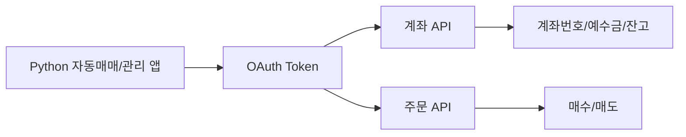
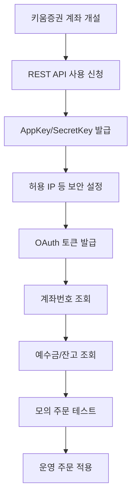
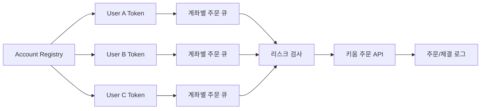

키움증권 REST Open API를 Python으로 사용할 때 필요한 내용을 정리했다. 목표는 단순 조회가 아니라 여러 명의 계좌를 관리하면서 계좌별 종목, 수량, 예수금 현황을 확인하고 매수/매도 액션까지 연결하는 구조를 잡는 것이다.

결론부터 말하면 단순 호출은 `requests`로도 가능하지만, 다계정 조회와 배치 운영까지 고려하면 `httpx.AsyncClient`와 `async/await` 구조가 더 적합하다. 운영 관점에서는 토큰, 계좌별 권한, 주문 중복, 미체결 확인, 법률 리스크를 반드시 별도로 설계해야 한다.

## 한눈에 보는 구조

| 목적 | 공식 TR | URL |
|---|---|---|
| 접근토큰 발급 | `au10001` | `/oauth2/token` |
| 계좌번호 조회 | `ka00001` | `/api/dostk/acnt` |
| 예수금 조회 | `kt00001` | `/api/dostk/acnt` |
| 평가잔고 조회 | `kt00018` | `/api/dostk/acnt` |
| 주식 매수 | `kt10000` | `/api/dostk/ordr` |
| 주식 매도 | `kt10001` | `/api/dostk/ordr` |

운영 도메인은 `https://api.kiwoom.com`, 모의투자 도메인은 `https://mockapi.kiwoom.com`이다. 공식 문서상 모의투자는 KRX만 지원 가능하다고 되어 있다.

## 왜 REST API인가

키움증권 API를 떠올리면 많은 사람이 Windows COM 기반 OpenAPI+를 먼저 떠올린다. REST API는 이와 다르게 HTTP `POST`와 JSON으로 요청하는 방식이다. 그래서 Python 서버, 배치 프로그램, 리눅스 환경, 클라우드 워커와 훨씬 잘 맞는다.



## 장점과 단점

| 구분 | 장점 | 단점 |
|---|---|---|
| 개발 | Python에서 `httpx` 기반 비동기 HTTP 요청으로 바로 연동 가능 | TR 필드명이 축약형이라 래퍼가 필요하다. |
| 운영 | 서버 자동화와 배치 처리에 적합 | 주문 재시도, 중복 주문 방지가 어렵다. |
| 다계정 | 사용자별 토큰을 분리하면 확장 가능 | 타인 계좌 관리에는 법률/권한 리스크가 있다. |
| 테스트 | 모의투자 도메인이 있다 | 운영과 완전히 같다고 가정하면 안 된다. |
| 보안 | 토큰과 IP 제한을 활용 가능 | 키 유출 시 계좌 조회/주문 위험이 있다. |

## 가입과 준비 절차

공식 서비스 이용안내에 따르면 키움 REST API는 키움증권 계좌 보유 고객에게 제공된다. 따라서 먼저 계좌가 필요하고, API 사용신청 후 `appkey`, `secretkey`를 발급받아야 한다.



여러 사람의 계좌를 관리한다면 각 사람별로 API 키와 토큰을 분리해야 한다. 하나의 토큰으로 여러 사람을 섞어 처리하는 구조는 보안과 감사 측면에서 좋지 않다.

## 기본 Python 예제

```python
import asyncio
import os

import httpx


BASE_URL = "https://api.kiwoom.com"


async def issue_token(client: httpx.AsyncClient, appkey: str, secretkey: str) -> dict:
    res = await client.post(
        f"{BASE_URL}/oauth2/token",
        json={
            "grant_type": "client_credentials",
            "appkey": appkey,
            "secretkey": secretkey,
        },
    )
    res.raise_for_status()
    return res.json()


async def call_api(
    client: httpx.AsyncClient,
    token: str,
    api_id: str,
    path: str,
    body: dict | None = None,
) -> dict:
    res = await client.post(
        f"{BASE_URL}{path}",
        headers={
            "authorization": f"Bearer {token}",
            "api-id": api_id,
            "Content-Type": "application/json;charset=UTF-8",
        },
        json=body or {},
    )
    res.raise_for_status()
    return res.json()


async def main() -> None:
    async with httpx.AsyncClient(timeout=10) as client:
        token_data = await issue_token(client, os.environ["KIWOOM_APPKEY"], os.environ["KIWOOM_SECRETKEY"])
        account = await call_api(client, token_data["token"], "ka00001", "/api/dostk/acnt")
        print(account)


if __name__ == "__main__":
    asyncio.run(main())
```

## 여러 계정으로 로그인하기

여러 명의 계좌를 관리하려면 계정별 프로필을 만든 뒤 각 프로필이 자기 토큰을 갖게 해야 한다.

```python
import asyncio
from dataclasses import dataclass
import os

import httpx


BASE_URL = "https://api.kiwoom.com"


@dataclass
class KiwoomAccountProfile:
    owner_id: str
    appkey: str
    secretkey: str
    token: str | None = None
    acct_no: str | None = None


class KiwoomRestClient:
    def __init__(self, http: httpx.AsyncClient, profile: KiwoomAccountProfile):
        self.http = http
        self.profile = profile

    async def issue_token(self) -> None:
        res = await self.http.post(
            f"{BASE_URL}/oauth2/token",
            json={
                "grant_type": "client_credentials",
                "appkey": self.profile.appkey,
                "secretkey": self.profile.secretkey,
            },
        )
        res.raise_for_status()
        self.profile.token = res.json()["token"]

    async def post(self, api_id: str, path: str, body: dict | None = None) -> dict:
        if not self.profile.token:
            await self.issue_token()

        res = await self.http.post(
            f"{BASE_URL}{path}",
            headers={
                "authorization": f"Bearer {self.profile.token}",
                "api-id": api_id,
                "Content-Type": "application/json;charset=UTF-8",
            },
            json=body or {},
        )
        res.raise_for_status()
        return res.json()

    async def fetch_account_no(self) -> str:
        data = await self.post("ka00001", "/api/dostk/acnt")
        self.profile.acct_no = data["acctNo"]
        return self.profile.acct_no

    async def fetch_cash(self) -> dict:
        return await self.post("kt00001", "/api/dostk/acnt", {"qry_tp": "3"})

    async def fetch_positions(self) -> dict:
        return await self.post("kt00018", "/api/dostk/acnt", {"qry_tp": "1", "dmst_stex_tp": "KRX"})

    async def buy(self, stock_code: str, qty: int, price: int | None = None) -> dict:
        return await self.post("kt10000", "/api/dostk/ordr", {
            "dmst_stex_tp": "KRX",
            "stk_cd": stock_code,
            "ord_qty": str(qty),
            "ord_uv": "" if price is None else str(price),
            "trde_tp": "3" if price is None else "0",
            "cond_uv": "",
        })

    async def sell(self, stock_code: str, qty: int, price: int | None = None) -> dict:
        return await self.post("kt10001", "/api/dostk/ordr", {
            "dmst_stex_tp": "KRX",
            "stk_cd": stock_code,
            "ord_qty": str(qty),
            "ord_uv": "" if price is None else str(price),
            "trde_tp": "3" if price is None else "0",
            "cond_uv": "",
        })


def load_profiles() -> list[KiwoomAccountProfile]:
    return [
        KiwoomAccountProfile("user_a", os.environ["KIWOOM_USER_A_APPKEY"], os.environ["KIWOOM_USER_A_SECRETKEY"]),
        KiwoomAccountProfile("user_b", os.environ["KIWOOM_USER_B_APPKEY"], os.environ["KIWOOM_USER_B_SECRETKEY"]),
    ]


async def print_account_summary(client: KiwoomRestClient) -> None:
    await client.issue_token()
    account_no, cash, positions = await asyncio.gather(
        client.fetch_account_no(),
        client.fetch_cash(),
        client.fetch_positions(),
    )
    print("owner:", client.profile.owner_id)
    print("account:", account_no)
    print("cash:", cash)
    print("positions:", positions)


async def main() -> None:
    async with httpx.AsyncClient(timeout=10) as http:
        clients = [KiwoomRestClient(http, profile) for profile in load_profiles()]
        await asyncio.gather(*(print_account_summary(client) for client in clients))


if __name__ == "__main__":
    asyncio.run(main())
```

## 운영 설계에서 중요한 부분



실제 운영에서는 다음 테이블이 필요하다.

| 테이블 | 역할 |
|---|---|
| `account_profiles` | 사용자별 계좌, 키 식별자, 사용 여부 저장 |
| `token_cache` | 접근토큰과 만료시각 저장 |
| `account_snapshots` | 계좌별 예수금, 보유 종목, 평가금액 저장 |
| `orders` | 주문 요청 원장 저장 |
| `executions` | 체결 결과 저장 |
| `risk_limits` | 계좌별 주문 한도, 종목 제한, 시장가 제한 저장 |

## 가장 조심해야 할 것

주문 API는 조회 API와 다르다. 조회는 `asyncio.gather`로 병렬화할 수 있지만, 주문은 재시도 한 번이 중복 주문이 될 수 있다. 따라서 주문 요청에는 반드시 내부 주문 ID를 부여하고, 계좌별 주문 큐와 락으로 순서를 통제해야 한다. 응답이 유실되면 무작정 재주문하지 말고 주문/체결 조회로 상태를 확인해야 한다.

또한 여러 명의 계좌를 대신 관리하는 것은 기술 문제가 아니라 권한과 법률 문제를 포함한다. 실제 서비스로 운영하려면 약관, 위임 범위, 투자일임/투자자문 해당 여부, 개인정보 처리 기준을 먼저 검토해야 한다.

## 참고 URL

| 내용 | URL |
|---|---|
| 키움 REST API 공식 홈 | https://openapi.kiwoom.com/ |
| API 가이드 | https://openapi.kiwoom.com/m/guide/apiguide |
| 서비스 이용안내 | https://openapi.kiwoom.com/m/intro/serviceInfo |
| 계좌번호 조회 | https://openapi.kiwoom.com/m/guide/apiguide?jobTpCode=08&apiId=ka00001 |
| 예수금 조회 | https://openapi.kiwoom.com/m/guide/apiguide?jobTpCode=08&apiId=kt00001 |
| 평가잔고 조회 | https://openapi.kiwoom.com/m/guide/apiguide?jobTpCode=08&apiId=kt00018 |
| 매수 주문 | https://openapi.kiwoom.com/m/guide/apiguide?jobTpCode=13&apiId=kt10000 |
| 매도 주문 | https://openapi.kiwoom.com/m/guide/apiguide?jobTpCode=13&apiId=kt10001 |

## 정리

키움 REST Open API는 Python 기반 계좌 조회와 주문 자동화에 충분히 실용적인 선택지다. 다만 다계정 운용을 목표로 한다면 API 호출 코드보다 계좌별 격리, 주문 원장, 체결 확인, 리스크 제한, 보안 저장소가 더 중요하다. 실전 구현은 먼저 모의투자에서 계좌 조회와 소액 주문 흐름을 끝까지 검증한 뒤 운영으로 옮기는 순서가 안전하다.
