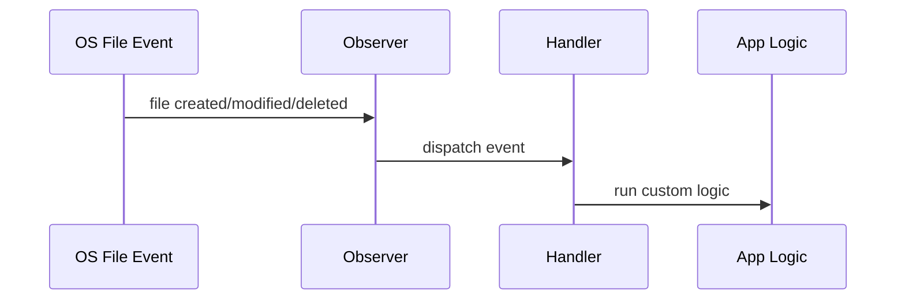
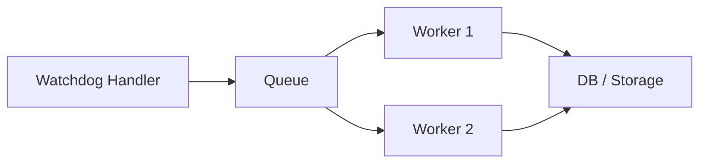

# Python watchdog 파일 감시 자동화

## 소개

`watchdog`은 Python에서 파일 시스템 이벤트를 감시하는 라이브러리다. 특정 폴더 안에서 파일이나 폴더가 생성, 수정, 삭제, 이동될 때 이벤트를 받아서 원하는 자동화 로직을 실행할 수 있다.

PyPI 기준 `watchdog`은 파일 시스템 이벤트 모니터링을 위한 Python API와 셸 유틸리티를 제공하며, Python 3.9 이상에서 동작한다.

```bash
pip install watchdog
```

| 이벤트 | 의미 | 예시 |
| --- | --- | --- |
| `created` | 파일 또는 폴더 생성 | 새 CSV 파일 업로드 |
| `modified` | 파일 또는 폴더 수정 | 로그 파일 내용 추가 |
| `deleted` | 파일 또는 폴더 삭제 | 임시 파일 제거 |
| `moved` | 파일 또는 폴더 이동/이름 변경 | 처리 완료 폴더로 이동 |


## 언제 쓰면 좋은가

| 사용 사례 | 설명 |
| --- | --- |
| 로그 파일 감시 | 새 로그가 생성되거나 수정되면 자동 분석 |
| CSV/Excel 자동 처리 | 특정 폴더에 데이터 파일이 들어오면 자동 파싱 |
| 이미지/영상 후처리 | 업로드 폴더에 파일이 들어오면 리사이즈/인코딩 |
| 개발 자동화 | 소스 파일 수정 시 테스트, 빌드, 린트 실행 |
| 백업/동기화 | 변경된 파일을 다른 위치로 복사 |
| ETL 파이프라인 | 파일 기반 데이터 수집 작업의 트리거로 사용 |

## 장점

| 장점 | 설명 |
| --- | --- |
| 실시간성 | 폴더를 계속 폴링하는 단순 루프보다 즉각적으로 반응하기 쉽다 |
| 이벤트 기반 구조 | 생성, 수정, 삭제, 이동 이벤트별로 코드를 분리할 수 있다 |
| 크로스 플랫폼 | Windows, Linux, macOS 등 여러 OS를 지원한다 |
| 코드가 단순함 | `Observer`와 `FileSystemEventHandler`만 이해하면 기본 사용이 가능하다 |
| 자동화에 적합 | 파일 기반 업무 자동화, 데이터 처리, 개발 도구 제작에 잘 맞는다 |

## 단점

| 단점 | 설명 | 대응 |
| --- | --- | --- |
| 중복 이벤트 | 파일 한 번 저장해도 수정 이벤트가 여러 번 발생할 수 있다 | 디바운스, 최근 처리 기록 사용 |
| 파일 복사 중 이벤트 | 큰 파일은 복사가 끝나기 전에 `created`가 먼저 올 수 있다 | 파일 크기 안정화 확인 |
| 대량 이벤트 폭주 | 많은 파일이 한 번에 들어오면 처리량이 밀릴 수 있다 | 큐, 배치 처리, 워커 분리 |
| 네트워크 드라이브 이슈 | CIFS/SMB 등에서 OS 이벤트가 불안정할 수 있다 | `PollingObserver` 사용 검토 |
| 상시 실행 필요 | 프로그램이 떠 있어야 감시가 유지된다 | systemd, Windows Service, Docker 등 사용 |
| 예외 처리 필요 | 핸들러 예외가 누적되면 처리가 멈추거나 누락될 수 있다 | 로깅, 실패 폴더, 재시도 구현 |

## 동작 구조

`watchdog`의 기본 구조는 간단하다.

| 구성요소 | 역할 |
| --- | --- |
| `Observer` | OS별 파일 시스템 감시자를 실행한다 |
| `FileSystemEventHandler` | 파일 이벤트를 받을 콜백 메서드를 정의한다 |
| `schedule` | 어떤 폴더를 어떤 핸들러로 감시할지 등록한다 |
| `start` | 감시를 시작한다 |
| `stop`, `join` | 감시 종료와 스레드 정리를 수행한다 |



## 간단 예제

특정 폴더에서 생성, 수정, 삭제, 이동 이벤트를 출력하는 가장 기본적인 예제다.

```python
from pathlib import Path
import time

from watchdog.events import FileSystemEventHandler
from watchdog.observers import Observer


class MyHandler(FileSystemEventHandler):
    def on_created(self, event):
        print(f"생성됨: {event.src_path}")

    def on_modified(self, event):
        print(f"수정됨: {event.src_path}")

    def on_deleted(self, event):
        print(f"삭제됨: {event.src_path}")

    def on_moved(self, event):
        print(f"이동됨: {event.src_path} -> {event.dest_path}")


def main():
    watch_path = Path("./watch_folder")
    watch_path.mkdir(exist_ok=True)

    event_handler = MyHandler()
    observer = Observer()
    observer.schedule(event_handler, str(watch_path), recursive=True)

    observer.start()
    print(f"감시 시작: {watch_path}")

    try:
        while True:
            time.sleep(1)
    except KeyboardInterrupt:
        observer.stop()

    observer.join()


if __name__ == "__main__":
    main()
```

실행:

```bash
python watch_basic.py
```

## 실용 예제: CSV 파일 자동 처리

상황은 다음과 같다.

| 폴더 | 역할 |
| --- | --- |
| `input` | 새 CSV 파일이 들어오는 폴더 |
| `processed` | 처리 성공 파일을 이동할 폴더 |
| `failed` | 처리 실패 파일을 이동할 폴더 |

핵심 실무 포인트는 파일이 완전히 복사된 뒤 읽어야 한다는 점이다. 그래서 파일 크기가 일정 시간 동안 변하지 않는지 확인하는 `wait_until_file_ready` 함수를 둔다.

```python
from pathlib import Path
import csv
import logging
import shutil
import time

from watchdog.events import FileSystemEventHandler
from watchdog.observers import Observer


INPUT_DIR = Path("./input")
PROCESSED_DIR = Path("./processed")
FAILED_DIR = Path("./failed")

logging.basicConfig(
    level=logging.INFO,
    format="%(asctime)s %(levelname)s %(message)s",
)


def wait_until_file_ready(file_path: Path, timeout: float = 10.0) -> bool:
    last_size = -1
    start_time = time.time()

    while time.time() - start_time < timeout:
        if not file_path.exists():
            return False

        current_size = file_path.stat().st_size

        if current_size == last_size:
            return True

        last_size = current_size
        time.sleep(0.5)

    return False


class CsvHandler(FileSystemEventHandler):
    def on_created(self, event):
        if event.is_directory:
            return

        file_path = Path(event.src_path)

        if file_path.suffix.lower() != ".csv":
            return

        logging.info("CSV 감지: %s", file_path)

        if not wait_until_file_ready(file_path):
            logging.warning("파일 준비 시간 초과: %s", file_path)
            self.move_to_failed(file_path)
            return

        try:
            self.process_csv(file_path)

            target_path = PROCESSED_DIR / file_path.name
            shutil.move(str(file_path), str(target_path))
            logging.info("처리 완료: %s", target_path)

        except Exception:
            logging.exception("처리 실패: %s", file_path)
            self.move_to_failed(file_path)

    def process_csv(self, file_path: Path) -> None:
        with file_path.open("r", encoding="utf-8-sig", newline="") as f:
            reader = csv.DictReader(f)

            for row in reader:
                logging.info("처리 데이터: %s", row)

    def move_to_failed(self, file_path: Path) -> None:
        if not file_path.exists():
            return

        target_path = FAILED_DIR / file_path.name
        shutil.move(str(file_path), str(target_path))
        logging.info("실패 폴더 이동: %s", target_path)


def main():
    INPUT_DIR.mkdir(exist_ok=True)
    PROCESSED_DIR.mkdir(exist_ok=True)
    FAILED_DIR.mkdir(exist_ok=True)

    observer = Observer()
    observer.schedule(CsvHandler(), str(INPUT_DIR), recursive=False)
    observer.start()

    logging.info("CSV 감시 시작: %s", INPUT_DIR)

    try:
        while True:
            time.sleep(1)
    except KeyboardInterrupt:
        logging.info("감시 종료")
        observer.stop()

    observer.join()


if __name__ == "__main__":
    main()
```

테스트용 CSV:

```csv
id,name,amount
1,Kim,10000
2,Lee,20000
```

## 실무 개선 패턴

### 1. 중복 이벤트 디바운스

파일 저장 방식에 따라 같은 파일에 대해 이벤트가 여러 번 들어올 수 있다. 최근 처리 시간을 기억해서 너무 짧은 간격의 이벤트를 무시할 수 있다.

```python
import time
from pathlib import Path


class Debouncer:
    def __init__(self, interval: float = 1.0):
        self.interval = interval
        self.last_seen: dict[Path, float] = {}

    def should_process(self, file_path: Path) -> bool:
        now = time.time()
        last = self.last_seen.get(file_path, 0)

        if now - last < self.interval:
            return False

        self.last_seen[file_path] = now
        return True
```

### 2. 네트워크 드라이브에서는 PollingObserver 검토

PyPI 문서에는 CIFS를 감시할 때 명시적으로 `PollingObserver`를 사용하라는 안내가 있다. 네트워크 드라이브나 특수 파일 시스템에서 이벤트 누락이 의심되면 아래처럼 바꿔볼 수 있다.

```python
from watchdog.observers.polling import PollingObserver as Observer
```

단, 폴링 방식은 주기적으로 디렉터리 스냅샷을 비교하므로 일반 OS 이벤트 기반 감시보다 느리고 비용이 클 수 있다.

### 3. 오래 실행되는 작업은 큐로 분리

핸들러 안에서 무거운 작업을 직접 수행하면 다음 이벤트 처리가 밀릴 수 있다. 실무에서는 `queue.Queue`에 작업을 넣고 워커 스레드나 별도 프로세스에서 처리하는 구조가 더 안전하다.



## 운영 체크리스트

| 항목 | 체크 내용 |
| --- | --- |
| 실행 방식 | 콘솔 실행이 아니라 서비스, systemd, Docker 등으로 상시 실행되는가 |
| 로그 | `print` 대신 `logging`을 사용하고 로그 파일/수집기를 연결했는가 |
| 예외 처리 | 실패 파일을 보존하고 재처리할 수 있는가 |
| 파일 준비 상태 | 큰 파일 복사 완료 전에 읽지 않도록 했는가 |
| 중복 이벤트 | 동일 파일을 여러 번 처리하지 않는가 |
| 종료 처리 | `KeyboardInterrupt`, `stop`, `join`으로 정상 종료되는가 |
| 성능 | 대량 파일 입력 시 큐/배치/워커 구조가 있는가 |

## 근거 URL

| 내용 | URL |
| --- | --- |
| PyPI watchdog | https://pypi.org/project/watchdog/ |
| watchdog 문서 | https://python-watchdog.readthedocs.io/ |
| watchdog GitHub | https://github.com/gorakhargosh/watchdog |

## 요약

`watchdog`은 Python에서 폴더나 파일 변화를 실시간으로 감시하고 자동 처리 로직을 실행할 때 쓰는 라이브러리다. 간단한 자동화에는 매우 편하지만, 실무에서는 중복 이벤트, 파일 복사 완료 여부, 예외 처리, 실패 파일 보존, 장시간 실행 방식을 반드시 고려해야 한다.
