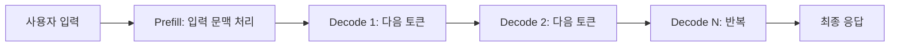
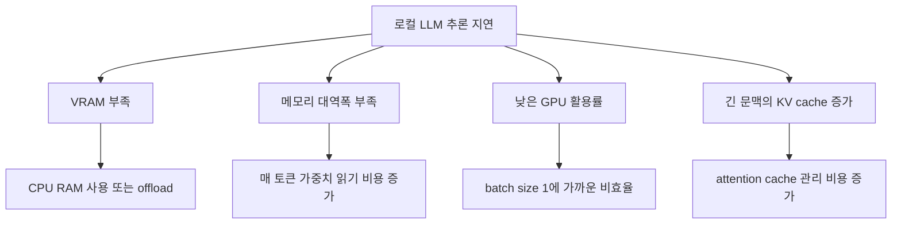
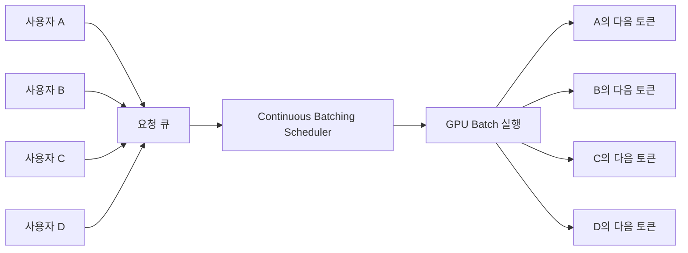
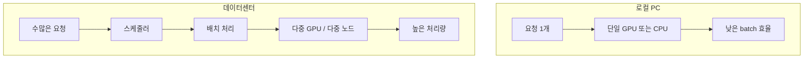

# LLM은 왜 로컬 PC에서 느리고, 데이터센터에서는 많은 사용자를 빠르게 처리할까?

GPT 같은 대형 언어 모델을 로컬 PC에 설치하면 실행 자체는 가능해도 답변 생성이 매우 느린 경우가 많습니다. 반대로 OpenAI 같은 대형 서비스는 수많은 사용자가 동시에 접속해도 꽤 빠른 속도로 응답합니다.

처음 보면 이상합니다. 데이터센터의 컴퓨팅 파워도 결국 사용자 수로 나누면, 한 세션에 돌아가는 자원은 작아져야 할 것처럼 보이기 때문입니다. 하지만 실제 LLM serving은 그렇게 단순하게 나눠지지 않습니다.

## 핵심 요약

| 질문 | 답 |
|---|---|
| 로컬 PC에서 왜 느린가? | 모델 크기, VRAM 부족, 낮은 메모리 대역폭, 낮은 배치 효율 때문이다. |
| 동접 1000명이면 1/1000로 느려져야 하나? | 아니다. 동접 수와 실제 동시 계산량은 다르고, 서버는 요청을 배치 처리한다. |
| 큰 클러스터의 장점은? | GPU 활용률, 병렬화, 캐시, 라우팅, 오토스케일링에서 이점이 생긴다. |

---

## 1. LLM 추론은 토큰을 하나씩 만든다

LLM 응답 생성은 대부분 다음 토큰을 반복해서 예측하는 구조입니다. 입력 전체를 한 번 처리한 뒤, 토큰을 하나 만들고, 그 토큰을 다시 문맥에 붙여 다음 토큰을 만듭니다.

그래서 체감 속도는 대체로 `tokens/s`와 강하게 연결됩니다.

$$
응답시간 \approx 입력처리시간 + \frac{출력토큰수}{초당토큰수}
$$

출력이 600토큰이고 로컬 모델이 초당 8토큰을 낸다면 출력에만 약 75초가 걸립니다. 서버가 초당 60토큰을 안정적으로 낸다면 같은 출력은 약 10초 수준으로 줄어듭니다.

---

## 2. 로컬 PC의 진짜 병목은 메모리인 경우가 많다

대형 LLM은 파라미터 수가 큽니다. FP16 기준으로 단순 계산하면 파라미터 하나가 2바이트를 차지합니다.

$$
모델크기_{FP16} \approx 파라미터수 \times 2\ bytes
$$

| 모델 규모 | FP16 가중치만의 대략 크기 | 로컬 실행 난점 |
|---:|---:|---|
| 7B | 약 14GB | 고급 소비자 GPU에서 가능하지만 여유가 작다. |
| 13B | 약 26GB | 일반 GPU VRAM을 자주 초과한다. |
| 70B | 약 140GB | 단일 소비자 PC에서는 매우 어렵다. |
| 수백B 이상 | 수백 GB 이상 | 다중 데이터센터 GPU 영역이다. |

실제 실행에는 가중치뿐 아니라 KV cache, 런타임 버퍼, attention 작업 공간도 필요합니다. 그래서 모델 파일이 간신히 VRAM에 들어가는 것과 빠르게 운영되는 것은 다릅니다.

NVIDIA의 GPU 성능 문서는 딥러닝 연산의 성능 한계가 메모리 대역폭, 수학 연산 대역폭, 지연시간 중 하나에 의해 제한될 수 있다고 설명합니다. 특히 batch size가 작은 linear layer는 메모리 제한을 받기 쉽습니다.

---

## 3. 동접 1000명은 GPU 1000등분이 아니다

서비스에서 중요한 것은 동접자 수 자체가 아니라 해당 순간의 총 토큰 처리량 요구량입니다.

| 개념 | 의미 |
|---|---|
| 동접자 수 | 세션이 살아 있는 사용자 수 |
| 활성 생성 수 | 지금 실제로 토큰을 생성 중인 요청 수 |
| 입력 토큰량 | prefill 단계에서 처리할 문맥 크기 |
| 출력 토큰량 | decode 단계에서 생성할 토큰 수 |
| 총 처리량 | 전체 시스템의 초당 처리 가능 토큰 수 |

$$
필요처리량 = 활성사용자수 \times 사용자당평균토큰생성률
$$

동접 1000명 중 실제 생성 중인 사용자가 200명이고, 각 사용자가 평균 20 tokens/s를 필요로 한다면 필요한 처리량은 4,000 tokens/s입니다.

$$
200 \times 20 = 4{,}000\ tokens/s
$$

데이터센터가 해당 모델에 대해 충분한 tokens/s 용량을 준비했다면, 동접 1000명이라는 숫자만으로 로컬 PC처럼 느려지지는 않습니다.

---

## 4. 대형 클러스터의 핵심은 배치 처리다

GPU는 작은 작업 하나보다 큰 행렬 연산을 묶어서 처리할 때 훨씬 효율적입니다. 로컬 PC에서 한 사용자의 요청 하나만 처리하면 batch size가 1에 가까워지고, GPU의 많은 실행 자원이 비게 됩니다.

LLM 서버는 여러 사용자의 요청을 모아 한 번에 처리합니다.

vLLM 문서는 빠른 LLM serving 요소로 PagedAttention, continuous batching, chunked prefill, prefix caching, speculative decoding, tensor/pipeline/data/expert/context parallelism 등을 제시합니다.

| 최적화 | 효과 |
|---|---|
| Continuous batching | 생성 중인 요청을 동적으로 묶어 GPU 활용률을 높인다. |
| PagedAttention | KV cache를 블록 단위로 관리해 메모리 낭비를 줄인다. |
| Prefix caching | 반복되는 앞부분 문맥을 재사용한다. |
| Tensor parallelism | 모델 행렬 연산을 여러 GPU에 나눈다. |
| Pipeline parallelism | 모델 레이어를 여러 GPU에 나눈다. |
| Speculative decoding | 작은 모델 또는 예측 토큰으로 생성 속도를 높일 수 있다. |

---

## 5. KV cache 관리가 동시성의 핵심이다

LLM은 이전 토큰의 attention key/value를 매번 다시 계산하지 않기 위해 GPU 메모리에 KV cache를 저장합니다. Hugging Face TGI 문서는 decoding 단계에서 이전 토큰의 attention key와 value가 GPU 메모리에 저장되며, 큰 모델과 긴 시퀀스에서는 KV cache가 많은 메모리를 차지할 수 있다고 설명합니다.

$$
KVCache \propto 배치크기 \times 문맥길이 \times 레이어수 \times Hidden차원
$$

| 상황 | 단순 구현 | 최적화 구현 |
|---|---|---|
| 긴 문맥 요청 | 큰 연속 메모리 필요 | 블록 단위 할당 |
| 여러 응답 후보 | KV cache 중복 증가 | 공유 가능한 prefix 블록 재사용 |
| 요청 종료 | 메모리 단편화 가능 | page/block 단위 반환 |
| 동시 요청 증가 | 배치 크기 제한 | 더 많은 batch 수용 |

데이터센터 추론 엔진은 KV cache를 더 촘촘하게 관리해 같은 GPU 메모리에 더 많은 요청을 수용하려고 합니다.

---

## 6. 로컬 PC와 데이터센터는 운영 단위가 다르다

| 항목 | 로컬 PC | 대형 데이터센터 |
|---|---|---|
| GPU | 소비자 GPU 또는 CPU 실행 | H100/B200급 데이터센터 GPU 다수 |
| 메모리 | 제한된 VRAM, 상대적으로 낮은 대역폭 | 대용량 HBM, 높은 대역폭 |
| 연결 | PCIe 중심 | NVLink, InfiniBand 등 고속 연결 |
| 요청 수 | 보통 1개 또는 소수 | 수많은 요청을 지속 스케줄링 |
| 배치 효율 | 낮음 | 높음 |
| 캐시 전략 | 단순하거나 제한적 | prefix/KV/page cache 최적화 |
| 확장 방식 | PC 한 대 한계 | GPU pool과 오토스케일링 |

로컬 PC는 한 사람이 한 모델을 돌리는 환경에 가깝습니다. 데이터센터는 수많은 요청을 하나의 큰 생산 라인에 올리는 환경에 가깝습니다.

---

## 마무리

대형 클러스터의 이점은 단순 산술 분배보다 큽니다. GPU는 충분히 큰 작업을 넣을수록 효율이 좋아지고, 다수 사용자의 요청은 오히려 배치 처리의 재료가 됩니다.

물론 사용자가 폭증해 전체 `tokens/s` 용량을 넘으면 지연은 증가합니다. 하지만 정상적으로 용량 계획이 된 LLM 서비스에서는 동접자 수가 곧바로 로컬 PC 수준의 느린 추론으로 이어지지 않습니다.

## 참고 자료

- NVIDIA Docs, GPU Performance Background User's Guide: https://docs.nvidia.com/deeplearning/performance/dl-performance-gpu-background/index.html
- vLLM Documentation: https://docs.vllm.ai/en/latest/
- Hugging Face TGI, PagedAttention: https://huggingface.co/docs/text-generation-inference/en/conceptual/paged_attention
- vLLM Blog, PagedAttention 소개: https://blog.vllm.ai/2023/06/20/vllm.html
- Anyscale Blog, Continuous batching 설명: https://www.anyscale.com/blog/continuous-batching-llm-inference
