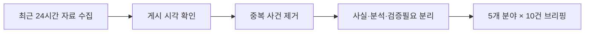

# 최근 24시간 뉴스 브리핑

랭킹뉴스, 경제뉴스, 증권뉴스, 커뮤니티 유머, IT뉴스를 최근 24시간 기준으로 다시 읽기 좋은 기사형 요약으로 정리했다. 각 항목은 핵심 사실과 해석상 주의점을 분리하고, 원문 링크와 게시 시각을 함께 남겼다.

원문 정리 문서: [hhddoc 뉴스 브리핑](https://hhd2002.gitlab.io/hhddoc/260707_0142_%EC%B5%9C%EA%B7%BC24%EC%8B%9C%EA%B0%84_%EB%89%B4%EC%8A%A4%EB%B8%8C%EB%A6%AC%ED%95%91/)

> 기준 시각: 2026-07-07 01:42 KST 
> 수집 범위: 2026-07-06 01:42~2026-07-07 01:42 KST 
> 구성: 랭킹·경제·증권·커뮤니티 유머·IT 각 10건

## 📌 읽는 법

| 표기 | 의미 |
|---|---|
| 사실 | 원문 기사, 공시, 기관 발표 또는 원문 게시물에서 확인 |
| 분석 | 기사에 소개된 전문가·업계 해석 |
| 검증필요 | 익명 취재, 기업 주장, 이미지·영상 세부처럼 추가 확인이 필요한 내용 |

뉴스 기사, 웹페이지, 커뮤니티, 블로그와 YouTube 검색 결과를 함께 살폈다. 최종 목록은 원문 URL과 게시 시각을 확인할 수 있는 자료를 우선했다. 같은 사건을 다룬 포털 재전송과 후속 기사는 하나로 묶었다. 커뮤니티 분야는 안전하고 가벼운 소재만 골랐다.

---

## 🏆 랭킹뉴스 10

| 번호 | 핵심 이슈 | 게시 시각 | 출처 |
|---:|---|---|---|
| 1 | 국정원 계엄 동조 정황 | 07-06 18:29 | 연합뉴스 |
| 2 | 정유 4사 유가 담합 기소 | 07-06 10:00 | 연합뉴스 |
| 3 | 장윤기 수사팀장 긴급체포 | 07-06 09:45 | 연합뉴스 |
| 4 | 이병태 부위원장 사퇴 | 07-06 22:28 | 한겨레 |
| 5 | 캐나다 잠수함 TKMS 보도 | 07-06 21:47 | 뉴시스 |
| 6 | 배재고 야구부 광주 사과 | 07-06 15:18 | 동아일보 |
| 7 | 노르웨이, 브라질 꺾고 8강 | 07-06 07:29 | 뉴시스 |
| 8 | 대통령 지지도 47.0% | 07-06 09:43 | 파이낸셜뉴스 |
| 9 | 감사원, 선관위 예산 감사 | 07-06 09:00 | 연합뉴스 |
| 10 | 청소년 사회적 시차 연구 | 07-06 06:03 | 연합뉴스 |

### 1. 특검 “국정원, 계엄 적극 동조 정황”

2차 종합특검은 국정원이 비상계엄 당시 적극 동조한 정황을 확인했다고 밝혔다. 특검이 언급한 핵심은 ‘안보 위해 세력’ 수백 명의 명단이다. 국정원 안보조사 부서는 긴급명령을 통한 대공수사권 행사 가능성을 검토한 것으로 조사됐다.

계엄사 합동수사본부에 보낼 인력도 선발한 것으로 파악됐다. 특검은 명단 작성의 지시 경로를 추적하고 있다. 조태용 당시 국정원장과 정무직 관계자의 관여 여부가 수사 대상이다.

현재 단계는 특검이 공개한 수사 내용이며 법원의 확정 판단은 아니다. 동아일보 후속 보도에서도 같은 특검 브리핑이 확인됐다. 향후 압수물 분석과 관련자 조사 결과가 혐의 입증의 관건이다.

원문은 [연합뉴스](https://www.yna.co.kr/view/AKR20260706107451004)이며 7월 6일 18시 29분에 송고됐다.

### 2. 검찰, 정유 4사 26조원대 유가 담합 기소

검찰은 국내 정유 4사를 공정거래법 위반 혐의로 기소했다. 대상은 HD현대오일뱅크, SK에너지, GS칼텍스, 에쓰오일이다. HD현대오일뱅크와 SK에너지는 전쟁 직후 가격 인상 시기와 폭을 조율한 혐의를 받는다.

검찰은 직접 담합 규모를 약 14조2천억원으로 추산했다. 전체 경쟁 제한 효과는 약 26조원으로 제시됐다. 전량구매계약 강제와 조사 방해 정황도 수사 결과에 포함됐다.

증거인멸과 정부 허위 보고 의혹도 함께 제기됐다. 이 수치는 검찰 추산이므로 재판 과정에서 다퉈질 수 있다. 전자신문도 같은 날 기소 내용을 후속 보도했다.

원문은 [연합뉴스](https://www.yna.co.kr/view/AKR20260706042600004)이며 7월 6일 10시에 송고됐다.

### 3. 장윤기 사건 담당 형사팀장 긴급체포

광주경찰청은 광산경찰서 소속 형사팀장 A 경감을 긴급체포했다. 적용된 혐의는 장윤기 사건 관련 증거인멸이다. A 경감은 피의자 SUV 압수수색 과정에서 일부 증거를 없앤 혐의를 받는다.

일부 주요 증거가 실물 보존 없이 가족에게 인계된 경위도 조사 대상이다. 경찰은 기존 감찰을 형사수사로 전환했다. 수사를 위해 22명 규모 전담팀도 구성했다.

긴급체포는 유죄 확정이 아니며 구체적 고의성은 추가 수사가 필요하다. 수사팀과 현직 경찰관 가족 사이의 정보 공유 의혹도 파장이 커졌다. 경찰은 증거 수집과 보존 절차 전반을 다시 확인하고 있다.

원문은 [연합뉴스](https://www.yna.co.kr/amp/view/AKR20260705018653054)이며 7월 6일 9시 45분에 송고됐다.

### 4. “5·18 성역” 논란 이병태 부위원장 사퇴

이병태 대통령 직속 규제합리화위원회 부위원장이 사퇴했다. 청와대는 그의 사의를 수용한다고 밝혔다. 이 부위원장은 배재고 논란과 관련해 “5·18이 성역이 됐다”고 주장했다.

해당 발언은 역사 왜곡과 표현의 자유 범위를 둘러싼 논쟁을 키웠다. 청와대는 먼저 경고 메시지를 전달했다. 이후 사안을 엄중하게 본다며 사퇴를 권고했다.

여권에서도 공개적인 사퇴 요구가 이어졌다. 이 부위원장은 표현의 자유를 강조하는 글을 추가로 올렸다. 최종적으로 발언 나흘 만에 부위원장직에서 물러났다.

원문은 [한겨레](https://www.hani.co.kr/arti/politics/politics_general/1266960.html)이며 7월 6일 22시 28분에 수정됐다.

### 5. 캐나다 잠수함 사업, 독일 TKMS 선정 보도

캐나다 매체는 신형 잠수함 건조 업체로 독일 TKMS가 선정됐다고 보도했다. 보도는 익명 소식통 두 명을 인용했다. 사업은 잠수함 12척 도입을 목표로 한다.

한국의 한화오션과 독일 TKMS가 최종 경쟁했다. 건조비는 200억~300억 캐나다달러로 추산됐다. 운영·유지비는 400억~500억 캐나다달러 규모로 거론됐다.

우선협상대상자가 정해져도 최종 계약까지 수년이 걸릴 수 있다. 한국 방산의 북미·나토 시장 확대 기대에는 부정적 소식이다. 검증필요: 기준 시각에는 캐나다 정부 공식 발표 전 익명 취재 보도 단계였다.

원문은 [뉴시스](https://www.newsis.com/view/NISX20260706_0003698051)이며 7월 6일 21시 47분에 등록됐다.

### 6. 배재고 야구부, 광주 찾아 공식 사과

배재고 야구부 선수와 감독, 교직원이 광주제일고를 방문했다. 이들은 경기 중 나온 5·18 비하성 응원에 대해 사과했다. 선수단은 피해 학생과 학부모, 광주시민에게 상처를 준 점을 인정했다.

주장 학생은 인성과 태도의 중요성을 깨달았다고 말했다. 감독도 문제성 응원을 즉시 막지 못한 지도 책임을 인정했다. 사과 후 선수단은 국립5·18민주묘지를 참배했다.

협회는 배재고에 전국대회 출전정지 6개월을 통보했다. 광주일고 측은 사과를 받아들이며 학생들을 격려했다. 이번 사건은 청소년의 역사 인식과 혐오 표현 교육 문제로도 이어졌다.

원문은 [동아일보](https://www.donga.com/news/Society/article/all/20260706/134244587/1)이며 7월 6일 15시 18분에 입력됐다.

### 7. 노르웨이, 브라질 꺾고 월드컵 8강

노르웨이는 2026 북중미 월드컵 16강에서 브라질을 2대1로 이겼다. 엘링 홀란이 후반에 두 골을 넣었다. 노르웨이는 28년 만의 본선 복귀 무대에서 8강에 올랐다.

이번 8강은 노르웨이의 월드컵 사상 최고 성적이다. 홀란은 대회 7골을 기록했다. 그는 메시, 음바페와 득점 공동 선두에 올랐다.

브라질은 36년 만에 월드컵 16강에서 탈락했다. 경기 전 전력 평가를 뒤집은 대회 대표 이변으로 꼽혔다. 승부는 홀란의 결정력과 노르웨이의 집중력에서 갈렸다.

원문은 [뉴시스](https://www.newsis.com/view/NISX20260706_0003696486)이며 7월 6일 7시 29분에 등록됐다.

### 8. 이재명 대통령 지지도 47.0%

리얼미터 조사에서 이재명 대통령 국정수행 긍정 평가는 47.0%였다. 전주보다 0.5%포인트 올랐다. 7주간 이어진 하락세가 소폭 반등으로 바뀌었다.

부정 평가는 49.2%였다. 부정 평가가 높았지만 차이는 오차범위 안이다. 조사는 성인 2,525명을 대상으로 진행됐다.

표본오차는 95% 신뢰수준에서 ±2.0%포인트다. 응답률은 4.0%로 공개됐다. 정당 지지도는 민주당 43.0%, 국민의힘 40.3%로 집계됐다.

원문은 [파이낸셜뉴스](https://www.fnnews.com/news/202607060943128257)이며 7월 6일 9시 43분에 입력됐다.

### 9. 감사원, 선관위 예산 감사 착수

감사원이 중앙선거관리위원회 예산 감사에 들어갔다. 서울·경기·부산 지역 선관위도 우선 감사 대상이다. 42명 규모 감사반이 7월 6일부터 24일까지 1단계 감사를 진행한다.

이후 8월에 2단계 감사가 이어질 예정이다. 점검 범위는 2022년 이후 선거 예산이다. 투표용지 인쇄와 계약, 수당, 수의계약 등 12개 항목을 살핀다.

6·3 지방선거 투표용지 부족 사태가 직접적인 배경이다. 감사원은 예산 편성과 집행의 적정성을 확인할 계획이다. 감사 결과에 따라 제도 개선이나 책임 조치가 뒤따를 수 있다.

원문은 [연합뉴스](https://www.yna.co.kr/amp/view/AKR20260705031800001)이며 7월 6일 9시에 송고됐다.

### 10. 청소년 ‘사회적 시차’와 자살 관련 행동의 연관성

연구진은 국내 중·고등학생 4만8,101명의 자료를 분석했다. 사용 자료는 2024년 청소년건강행태조사다. 전체의 53.5%가 평일과 주말 사이 1시간 이상 사회적 시차를 경험했다.

사회적 시차가 2시간 이상인 집단의 자살생각 경험률은 14.2%였다. 1시간 미만 집단의 자살생각 경험률은 11.2%였다. 자살 계획 경험률은 각각 5.5%와 3.9%였다.

자살 시도 경험률은 각각 3.2%와 2.0%였다. 사회적 시차가 클수록 위험 지표가 높아지는 연관성이 관찰됐다. 주의: 관찰연구이므로 수면 불일치가 원인이라고 단정할 수 없다.

원문은 [연합뉴스](https://www.yna.co.kr/view/AKR20260705024000530)이며 7월 6일 6시 3분에 송고됐다.

---

## 💰 경제뉴스 10

| 번호 | 핵심 이슈 | 게시 시각 | 출처 |
|---:|---|---|---|
| 1 | 외환시장 24시간 거래 | 07-06 16:50 | 뉴시스 |
| 2 | 광주 군공항 반도체 산단 | 07-06 14:50 | 뉴시스 |
| 3 | 한국 선박 수주 60% 증가 | 07-06 10:47 | 연합뉴스 |
| 4 | 동남권 경제 중동전쟁 여파 | 07-06 16:48 | 뉴시스 |
| 5 | 일본 맥주 수입 10만t | 07-06 13:53 | 뉴시스 |
| 6 | 홈플 협력사 3천억 보증 | 07-06 17:27 | 뉴시스 |
| 7 | 푸드테크 1,770억 지원 | 07-06 16:52 | 뉴시스 |
| 8 | LG 협력사 900억 지원 | 07-06 14:30 | 뉴시스 |
| 9 | 영동대로 지하공간 수주 | 07-06 17:19 | 뉴시스 |
| 10 | 청와대 집값 압력 진단 | 07-06 19:17 | 뉴시스 |

### 1. 외환시장, 주중 24시간 거래 시작

원·달러 현물시장이 주중 24시간 거래 체제로 전환됐다. 운영 시간은 월요일 6시부터 토요일 6시까지다. 종전에는 평일 9시부터 다음 날 2시까지 거래됐다.

새 체제는 미국 시간대의 환전 수요까지 국내 시장에서 처리하려는 조치다. 당국은 역외 차액결제선물환 수요의 국내 유입을 기대한다. 첫날 원·달러 환율은 4.7원 오른 1,530.3원에 마감했다.

거래시간 확대가 곧바로 환율 하락을 뜻하지는 않는다. 초기에는 유동성 분산과 야간 변동성도 점검해야 한다. 정책 효과는 외국인 거래 규모와 가격 안정성을 장기 관찰해야 판단할 수 있다.

원문은 [뉴시스](https://www.newsis.com/view/NISX20260706_0003697810)이며 7월 6일 16시 50분에 등록됐다.

### 2. 호남 반도체 산단, 광주 군공항 부지로

정부는 호남권 반도체 산업단지를 광주 군공항 부지에 조성하기로 했다. 삼성전자와 SK하이닉스가 모두 입주하는 방향이 제시됐다. 정부는 부지와 전력, 용수 문제를 동시에 해결한다는 계획이다.

필요한 전력은 6.3GW 규모로 언급됐다. 산업용수 수요는 하루 65만t 규모다. 대통령이 민관합동 점검회의를 매달 주재할 예정이다.

사업 추진을 위한 전담기구도 설치한다. 용인 반도체 클러스터의 토지보상과 기반시설 일정도 앞당길 방침이다. 실제 투자 규모와 착공 시점은 기업 결정과 인허가 진행을 더 확인해야 한다.

원문은 [뉴시스](https://www.newsis.com/view/NISX20260706_0003697505)이며 7월 6일 14시 50분에 등록됐다.

### 3. 한국 상반기 선박 수주 60% 증가

한국의 상반기 선박 수주량은 797만CGT였다. 수주 척수는 195척이다. 전년 같은 기간보다 60% 증가했다.

세계 시장 점유율은 19%로 집계됐다. 중국은 3,100만CGT를 수주해 72%를 차지했다. 6월만 보면 한국 점유율은 9%였다.

한국의 척당 평균 수주 규모는 3.8만CGT였다. 중국의 척당 평균은 2.6만CGT로 집계됐다. 한국 수주잔량은 3,881만CGT이고 세계 신조선가지수는 185.15였다.

원문은 [연합뉴스](https://www.yna.co.kr/view/AKR20260706044000003)이며 7월 6일 10시 47분에 송고됐다.

### 4. BNK “중동전쟁 여파로 동남권 경제 악화”

BNK경영연구원은 중동전쟁 여파가 동남권 경제를 압박한다고 분석했다. 5월 동남권 제조업 생산은 전년 대비 2.1% 감소했다. 석유화학과 정제 부진이 주요 원인으로 지목됐다.

수출물량은 22.0% 줄었다. 이는 64개월 만의 최대 감소폭이다. 취업자 증가는 6천 명에 그쳐 고용 둔화도 나타났다.

연구원은 지역 산업의 위험 구조를 ‘R.I.S.K’로 설명했다. 정유·석유화학 집중과 중동 원유 의존이 취약 요인이다. 항만과 물류의 지정학적 충격 노출도 위험을 키운다고 봤다.

원문은 [뉴시스](https://www.newsis.com/view/NISX20260706_0003697812)이며 7월 6일 16시 48분에 등록됐다.

### 5. 일본 맥주 수입량 첫 10만t 돌파

2025년 일본 맥주 수입량은 10만322t으로 집계됐다. 전년보다 22% 증가했다. 연간 수입량이 10만t을 넘은 것은 처음이다.

전체 수입맥주 물량은 24만442t이었다. 일본산 비중은 41.7%다. 일본산 맥주 수입은 2021년 6,912t까지 줄었다.

이후 2022년부터 회복세가 이어졌다. 전체 주류 소비 둔화와 일본 맥주 선호 회복이 동시에 나타난 셈이다. 수입량 증가는 판매액이나 국내 전체 맥주 점유율과는 다른 지표다.

원문은 [뉴시스](https://mobile.newsis.com/view_amp.html?ar_id=NISX20260706_0003697361)이며 7월 6일 13시 53분에 등록됐다.

### 6. 홈플러스 협력업체에 3천억원 긴급보증

금융당국은 홈플러스 협력업체를 위한 긴급 금융지원책을 내놨다. 지원 대상은 회생절차 폐지로 피해가 예상되는 중소·중견 협력사다. 특례보증 한도는 최대 3천억원이다.

기업당 보증한도는 3억원에서 5억원으로 늘어난다. 보증비율은 90%가 적용된다. 보증료율은 0.5%포인트 낮춘다.

은행권은 지난 1년4개월 동안 만기연장과 상환유예를 제공했다. 누적 지원 규모는 약 5조원으로 제시됐다. 긴급보증은 유동성 충격을 줄이지만 거래처 매출 손실 자체를 없애지는 못한다.

원문은 [뉴시스](https://www.newsis.com/view/NISX20260706_0003697896)이며 7월 6일 17시 27분에 등록됐다.

### 7. 푸드테크 기업에 1,770억원 금융지원

식품산업협회와 기술보증기금, 농협은행이 푸드테크 지원 협약을 맺었다. 총 지원 규모는 1,770억원이다. 특별출연 보증은 700억원 규모다.

특별출연 보증의 기업당 한도는 30억원이다. 초기 3년간 보증비율 100%가 적용된다. 별도 보증료 지원 협약은 1,070억원 규모다.

지원 대상은 푸드테크 기업의 운전·시설자금이다. 보증료는 2년 동안 0.7%포인트 지원한다. 금융 접근성을 높여 K푸드 관련 기술투자를 촉진하려는 목적이다.

원문은 [뉴시스](https://www.newsis.com/view/NISX20260706_0003697799)이며 7월 6일 16시 52분에 등록됐다.

### 8. LG 1·2·3차 협력사 상생협약

LG 7개 계열사가 1·2·3차 협력사와 상생협약을 맺었다. 1차 협력사에 대한 현금성 결제 비율 100%를 유지한다. 상생결제가 2차 이하 협력사로 이어지는 비율을 높일 계획이다.

목표 낙수율은 10% 이상이다. 2·3차 협력사 금융지원 규모는 900억원 이상이다. 복지 지원도 함께 확대한다.

기술개발과 생산성 향상 지원도 협약에 포함됐다. 공정거래위원회는 대기업과 하위 협력사 간 지원 확산을 강조했다. 실제 효과는 자금 집행액과 하위 협력사의 체감 개선으로 평가해야 한다.

원문은 [뉴시스](https://www.newsis.com/view/NISX20260706_0003697464)이며 7월 6일 14시 30분에 등록됐다.

### 9. DL이앤씨, 영동대로 지하공간 사업 수주

DL이앤씨는 영동대로 지하공간 복합개발 1공구 공사를 수주했다. 계약금액은 1,930억6,400만원이다. 이는 지난해 연결 매출의 2.61%에 해당한다.

사업지는 서울 봉은사역 일대다. 광역복합환승센터 137.65m 구간을 조성한다. 본선터널 80.35m도 공사 범위에 포함된다.

계약기간은 2028년 10월 31일까지다. 공사대금은 진행률에 따라 지급된다. 대형 지하공사 특성상 공정과 안전, 원가 관리가 수익성의 핵심이다.

원문은 [뉴시스](https://www.newsis.com/view/NISX20260706_0003697831)이며 7월 6일 17시 19분에 등록됐다.

### 10. 청와대 “부동산 가격 압력 심상치 않다”

김용범 청와대 정책실장은 부동산 가격 흐름이 심상치 않다고 진단했다. 그는 연말과 내년으로 갈수록 가격 압력이 커질 수 있다고 말했다. 경상수지 흑자가 시중 유동성을 늘리는 요인으로 제시됐다.

상장사 이익 증가도 수요 여력을 키운다고 설명했다. 현재 수요 압력은 1년 전보다 강하다는 판단이다. 정부는 3기 신도시와 수도권 6만호 공급을 추진 중이다.

추가 택지와 공급대책도 필요하다고 밝혔다. 장기임대와 LH 매입임대 방안도 재검토 중이다. 전월세 대책을 포함한 종합 처방이 예고됐다.

원문은 [뉴시스](https://www.newsis.com/view/NISX20260706_0003698000)이며 7월 6일 19시 17분에 등록됐다.

---

## 📈 증권뉴스 10

| 번호 | 핵심 이슈 | 게시 시각 | 출처 |
|---:|---|---|---|
| 1 | 코스피 8,051.33 마감 | 07-06 16:48 | 전자신문 |
| 2 | 반도체에서 금융·건설 순환 | 07-06 11:13 | 뉴시스 |
| 3 | 외국인 순매도와 복귀 조건 | 07-06 10:49 | 뉴시스 |
| 4 | 삼성전자 2분기 실적 기대 | 07-06 15:20 | 뉴시스 |
| 5 | SK하이닉스 나스닥 ADR | 07-06 18:58 | 뉴시스 |
| 6 | 단일종목 레버리지 ETF 논란 | 07-06 15:56 | 뉴시스 |
| 7 | 레몬헬스케어 코스닥 데뷔 | 07-06 09:36 | 뉴시스 |
| 8 | 네이버파이낸셜·두나무 연기 | 07-06 18:41 | 전자신문 |
| 9 | ACE K방산TOP5+ 상장 | 07-06 09:16 | 뉴시스 |
| 10 | 코스닥 ‘셀렉트’ 구상 | 07-06 16:00 | 전자신문 |

### 1. 코스피 8,051.33, 장중 변동성 확대

코스피는 전 거래일보다 37.01포인트 내린 8,051.33에 마감했다. 하락률은 0.46%다. 코스닥은 2.46% 내린 847.07로 마쳤다.

개인은 코스피에서 약 2조6,806억원을 순매수했다. 외국인은 약 1조3,088억원을 순매도했다. 기관도 약 1조4,675억원을 순매도했다.

삼성전자는 2.75% 오른 31만8천원에 마감했다. 삼성물산은 3.69% 오른 44만9,500원이었다. 다음 변수는 삼성전자 실적, FOMC 의사록, SK하이닉스 ADR 상장이다.

원문은 [전자신문](https://www.etnews.com/20260706000403)이며 7월 6일 16시 48분에 발행됐다.

### 2. 반도체 약세 속 금융·건설 강세

6월 29일부터 7월 3일까지 KRX 반도체지수는 8.25% 하락했다. KRX 삼성전자지수는 같은 기간 8.84% 내렸다. SK하이닉스지수도 9.28% 하락했다.

반면 KRX 은행지수는 13.71% 올랐다. 증권지수는 12.83% 상승했다. 건설지수도 10.12% 올랐다.

중형주지수는 4.55% 상승했다. 소형주와 초소형주도 각각 6.18%, 5.40% 올랐다. 분석은 구조적 순환매와 레버리지 상품발 착시라는 견해로 갈렸다.

원문은 [뉴시스](https://www.newsis.com/view/NISX20260706_0003697146)이며 7월 6일 11시 13분에 등록됐다.

### 3. 외국인 ‘셀 코리아’, 환율과 실적이 복귀 조건

연초부터 7월 3일까지 외국인의 코스피 순매도는 157조3,076억원으로 보도됐다. 기사에서는 반기 기준 사상 최대 규모라고 설명했다. 삼성전자 순매도는 85조7,564억원으로 집계됐다.

SK하이닉스 순매도는 69조3,668억원이었다. 두 반도체 대형주가 순매도의 대부분을 차지했다. 차익 실현이 배경 중 하나로 분석됐다.

대만 시장으로 글로벌 패시브 자금이 이동한 영향도 거론됐다. 증권가는 반도체 이익의 지속성을 외국인 복귀 조건으로 봤다. 원·달러 환율의 안정도 핵심 변수로 꼽혔다.

원문은 [뉴시스](https://www.newsis.com/view/NISX20260706_0003696772)이며 7월 6일 10시 49분에 등록됐다.

### 4. 삼성전자 2분기 실적 기대치 85조원대

에프앤가이드 기준 삼성전자 2분기 영업이익 컨센서스는 85조494억원으로 보도됐다. 전년 동기 대비 큰 폭의 증가가 예상됐다. 삼성증권 전망치는 86조원이다.

유진투자증권 전망치는 83조1천억원이다. 서버 D램 가격 상승이 실적 개선 요인으로 제시됐다. HBM4 선제 출하도 긍정 요인으로 거론됐다.

시장 기대를 크게 넘지 못하면 재료 소멸성 매도가 나올 수 있다. 반면 최근 주가 조정은 발표 후 안도 흐름을 만들 수도 있다. 이 수치는 증권사 전망이며 실제 잠정실적과 다를 수 있다.

원문은 [뉴시스](https://www.newsis.com/view/NISX20260706_0003697571)이며 7월 6일 15시 20분에 등록됐다.

### 5. SK하이닉스 나스닥 ADR 상장 임박

SK하이닉스는 7월 10일 나스닥 ADR 상장을 추진 중이다. 보도된 발행 규모는 약 290억달러다. 원화 환산액은 약 44조4,570억원으로 제시됐다.

성사되면 외국기업의 미국 최초 주식매각 중 최대 규모가 될 수 있다. 미국 정규장에서 거래할 수 있어 현지 투자자의 접근성이 높아진다. 거래 유동성 개선도 기대된다.

기사 기준 SK하이닉스 선행 PER은 6.2배다. 마이크론의 7배와 비교해 할인 상태라는 분석이 나왔다. 검증필요: 자금 유입 효과와 AI 투자 둔화 위험은 상장 후 확인해야 한다.

원문은 [뉴시스](https://www.newsis.com/view/NISX20260706_0003697971)이며 7월 6일 18시 58분에 등록됐다.

### 6. 단일종목 2배 레버리지 ETF 퇴출 논란

삼성전자와 SK하이닉스 단일종목 2배 레버리지 ETF의 위험성이 정치권에서 제기됐다. 안철수 의원은 상장폐지를 포함한 교정 방안을 주장했다. 관련 ETF 14개의 최근 한 달 수익률은 모두 마이너스였다.

지난달 거래대금은 212조원으로 집계됐다. 거래 규모와 순자산이 커 일반적인 상장폐지 요건과는 거리가 있다. ETF가 상장폐지돼도 펀드 자산이 즉시 사라지는 것은 아니다.

청산 후 순자산가치 기준 해지상환금이 지급된다. 거래소 규정에는 공익과 투자자 보호를 위한 상장폐지 조항이 있다. 다만 이 조항으로 ETF를 폐지한 선례는 확인되지 않았다고 보도됐다.

원문은 [뉴시스](https://www.newsis.com/view/NISX20260706_0003697630)이며 7월 6일 15시 56분에 등록됐다.

### 7. 레몬헬스케어, 코스닥 첫날 장 초반 급등

레몬헬스케어가 코스닥에 신규 상장했다. 오전 9시 22분 기준 주가는 1만5,500원이었다. 공모가 1만원보다 55% 높은 수준이다.

이 가격은 장 초반 수치이며 종가가 아니다. 회사는 진료 예약과 접수, 수납 서비스를 연결한다. 전자처방전과 실손보험 청구 기능도 제공한다.

대학병원과 종합병원용 의료정보 플랫폼을 공급해왔다. 의료 마이데이터와 개인건강기록 사업도 확대 중이다. 신규 상장주는 초기 유통물량에 따라 변동성이 클 수 있다.

원문은 [뉴시스](https://www.newsis.com/view/NISX20260706_0003696795)이며 7월 6일 9시 36분에 등록됐다.

### 8. 네이버파이낸셜·두나무 주식교환 연말로 연기

네이버파이낸셜과 두나무의 포괄적 주식교환 일정이 연기됐다. 새 주식교환일은 12월 31일이다. 주주총회 예정일은 11월 19일로 조정됐다.

공정거래위원회 기업결합 심사가 일정 변경의 배경이다. 금융당국 신고와 승인 절차도 남아 있다. 이번 변경은 3월 30일에 이어 두 번째 연기다.

최초 계획보다 6개월 넘게 늦어진 일정이다. 거래 목적은 두나무를 네이버파이낸셜의 완전자회사로 편입하는 것이다. 교환 후 IPO위원회 구성 계획은 있지만 상장 일정은 확정되지 않았다.

원문은 [전자신문](https://www.etnews.com/20260706000426)이며 7월 6일 18시 41분에 발행됐다.

### 9. ACE K방산TOP5+ ETF 신규 상장

한국투자신탁운용은 ACE K방산TOP5+ ETF를 7월 7일 상장한다. 상품은 KRX K-AI 방산 TOP5+ 지수를 추종한다. 상위 5개 종목 비중은 80%다.

나머지 5개 종목 비중은 20%다. 현대로템과 LIG디펜스앤에어로스페이스가 주요 후보로 제시됐다. 한화에어로스페이스, 한국항공우주, 한화시스템도 포함될 전망이다.

드론과 군사위성, AI 지휘통제 관련 기업도 후보군이다. 수출입은행은 국내 방산 수출이 2030년 약 340억달러로 늘 것으로 전망했다. 방산 집중형 상품이므로 정책과 수주, 지정학 변수에 민감하다.

원문은 [뉴시스](https://www.newsis.com/view/NISX20260706_0003696712)이며 7월 6일 9시 16분에 등록됐다.

### 10. 코스닥 우량 세그먼트 ‘셀렉트’ 구상

한국거래소가 코스닥 상위 세그먼트 ‘셀렉트’를 준비하고 있다. 거래소가 대상 기업을 먼저 지정하는 방식이 유력하다. 지정된 기업이 참여 여부를 선택하는 ‘선 지정·후 신청’ 구조다.

초기 기준의 일관성과 시장 신뢰 확보가 목적이다. 제도가 정착하면 자율 신청을 확대할 수 있다. 거래소는 편입 기준과 절차를 명확히 할 계획이다.

규제보다 성장 인센티브 중심으로 설계한다는 방침이다. 동시에 저시가총액·동전주 기업의 퇴출 기준도 강화됐다. 우량기업 육성과 부실기업 정리가 코스닥 신뢰 회복의 양축이다.

원문은 [전자신문](https://www.etnews.com/20260706000305)이며 7월 6일 16시에 발행됐다.

---

## 😂 커뮤니티 유머 10

| 번호 | 게시물 | 게시 시각 | 커뮤니티 |
|---:|---|---|---|
| 1 | 짜장면을 먹는 네팔 어린이 | 07-06 06:52 | 뽐뿌 |
| 2 | 중국에서 파는 계란빵 | 07-06 07:41 | 뽐뿌 |
| 3 | 스노클링 바닷속 촬영 | 07-06 08:11 | 뽐뿌 |
| 4 | 이연복 셰프 추천 디저트 | 07-06 09:04 | 뽐뿌 |
| 5 | 소지섭 투자 영화 리스트 | 07-06 10:06 | 뽐뿌 |
| 6 | 매일 40분 명상 반전 | 07-06 10:16 | 뽐뿌 |
| 7 | 무늬 독특한 고양이 | 07-06 10:26 | 뽐뿌 |
| 8 | 행복해지기 10초 전 | 07-06 11:28 | 뽐뿌 |
| 9 | 무한리필을 모르는 사장님 | 07-06 12:03 | 뽐뿌 |
| 10 | 세계의 기차역 | 07-06 12:38 | 뽐뿌 |

> 여러 커뮤니티를 검색했지만, 시간창과 원문 접근을 함께 확인할 수 있고 혐오·신상·선정성 위험이 낮은 게시물 10건이 모두 뽐뿌에서 선별됐다. 이미지·영상 전용 글은 캡션과 댓글 맥락만 요약했으며 세부 장면은 검증필요로 남겼다.

### 1. 짜장면을 먹는 네팔 어린이 반응

네팔 어린이가 짜장면을 마주한 순간을 담은 사진 게시물이다. 게시물은 사진 두 장으로 구성됐다. 본문 문구는 “오늘은 짜장면 이닷”이다.

아이의 큰 눈과 솔직한 표정이 웃음 포인트다. 댓글은 짜장면을 볼 때의 표정에 주목했다. 양파를 볼 때와의 차이가 재미있다는 반응도 나왔다.

귀엽고 사랑스럽다는 댓글이 이어졌다. 정치·혐오 요소가 없는 가벼운 반응형 콘텐츠다. 검증필요: 음식과 표정의 세부 묘사는 원본 이미지 육안 확인이 필요하다.

원문은 [뽐뿌](https://www.ppomppu.co.kr/zboard/view.php?id=humor&no=765735)이며 7월 6일 6시 52분에 게시됐다.

### 2. 중국에서 파는 계란빵

중국식 계란빵 조리 과정을 담은 짧은 영상 게시물이다. 고기와 달걀, 반죽을 단계별로 익히는 음식으로 소개됐다. 댓글은 완성품을 소시지 에그 맥머핀에 비유했다.

먹음직스럽다는 반응이 나왔다. 조리 과정이 지나치게 번거롭다는 의견도 있었다. 회전식 틀을 쓰면 더 효율적이겠다는 농담이 붙었다.

한국식 계란빵과 다른 조리법이 호기심을 만들었다. 짧은 음식 영상과 댓글의 현실적인 조언이 결합된 유머다. 검증필요: 정확한 재료와 조리 순서는 원본 영상을 직접 확인해야 한다.

원문은 [뽐뿌](https://www.ppomppu.co.kr/zboard/view.php?id=humor&no=765741)이며 7월 6일 7시 41분에 게시됐다.

### 3. 스노클링 바닷속 촬영

스노클링 중 촬영한 수중 사진을 여러 장 소개한 게시물이다. 댓글은 물속인데도 사진이 선명하다는 점을 주목했다. 수중에서는 광량이 부족해 촬영이 어렵다는 경험담이 나왔다.

색감과 분위기가 아름답다는 반응이 많았다. 국내 바다보다 동남아의 맑은 바다에서 재현하기 쉽다는 의견이 있었다. 사진을 보고 프리다이빙을 배우고 싶다는 댓글도 달렸다.

스쿠버다이빙에 대한 관심으로 이어진 반응도 있었다. 유머보다는 감탄과 여행 욕구를 자극하는 가벼운 화제글이다. 검증필요: 촬영 장소와 장비, 보정 여부는 원문에 명시되지 않았다.

원문은 [뽐뿌](https://www.ppomppu.co.kr/zboard/view.php?id=humor&no=765742)이며 7월 6일 8시 11분에 게시됐다.

### 4. 이연복 셰프가 추천한 디저트

이연복 셰프의 디저트 추천 장면을 담은 이미지 게시물이다. 셰프의 적극적인 추천이 제목의 핵심이다. 한 댓글 작성자는 중국 청두에서 직접 먹어봤다고 말했다.

그 이용자는 맛이 “예상 가능했다”고 평가했다. 전문가의 강한 추천과 이용자의 담담한 후기가 대비된다. 이 온도 차이가 게시물의 웃음 포인트다.

‘디저트’를 ‘다이어트’로 잘못 읽었다는 말장난도 나왔다. 방송 캡처형 콘텐츠로 보인다. 검증필요: 디저트 이름과 재료, 방송 출처는 이미지 확인이 필요하다.

원문은 [뽐뿌](https://www.ppomppu.co.kr/zboard/view.php?id=humor&no=765747)이며 7월 6일 9시 4분에 게시됐다.

### 5. 소지섭이 투자한 영화 리스트

배우 소지섭이 투자했다고 소개된 영화 목록 이미지 게시물이다. 댓글에서는 흥행성보다 작품성이 강한 작품을 고른다는 평가가 나왔다. 《그린 나이트》가 예시로 언급됐다.

《미드소마》와 《유전》도 댓글에 등장했다. 낯선 작품이 많다는 반응도 있었다. 반대로 명작에만 투자한다는 호평도 나왔다.

코로나 시기 다양한 영화를 극장에서 볼 수 있게 해줘 고맙다는 의견이 있었다. 배우의 취향을 영화 목록으로 추측하는 재미가 중심이다. 검증필요: ‘개인 투자’ 여부와 전체 목록은 배급·제작 크레딧 확인이 필요하다.

원문은 [뽐뿌](https://www.ppomppu.co.kr/zboard/view.php?id=humor&no=765752)이며 7월 6일 10시 6분에 게시됐다.

### 6. 매일 40분 명상이 인생을 바꾼다

게시물은 자기계발 조언처럼 시작하는 반전 유머다. 등장인물은 이웃이 매일 아침 40분씩 명상한다고 말한다. 명상 뒤 인생이 완전히 바뀌었다는 설명이 이어진다.

기대와 달리 첫 변화는 직장 지각이다. 지각이 반복돼 결국 해고됐다는 반전이 나온다. 이어 아내까지 떠났다는 식으로 상황이 더 커진다.

마지막의 “엄청난 변화죠”가 냉소적 결말이다. 긍정적인 자기계발 문구를 문자 그대로 비트는 구조다. 명상의 실제 효능을 다룬 정보글이 아니라 풍자 영상이다.

원문은 [뽐뿌](https://www.ppomppu.co.kr/zboard/view.php?id=humor&no=765754)이며 7월 6일 10시 16분에 게시됐다.

### 7. 평생 자신을 증명해야 하는 고양이

독특한 털무늬를 가진 고양이 사진 게시물이다. 무늬가 합성처럼 보인다는 점이 소재다. 제목은 고양이가 평생 진짜임을 증명해야 한다고 농담한다.

댓글에서는 이 고양이를 “문신묘”라고 불렀다. 실제 털무늬라는 설정이 웃음 포인트다. 귀엽다는 반응이 이어졌다.

신기하다는 감탄도 많았다. 한 장의 시각적 반전으로 소비되는 가벼운 동물 콘텐츠다. 검증필요: 무늬의 정확한 형태와 합성 여부는 원본 이미지 확인이 필요하다.

원문은 [뽐뿌](https://www.ppomppu.co.kr/zboard/view.php?id=humor&no=765756)이며 7월 6일 10시 26분에 게시됐다.

### 8. 행복해지기 10초 전 사진

행복한 일이 생기기 직전 순간을 포착했다는 이미지 게시물이다. 결과를 직접 보여주지 않는 제목형 유머다. 독자는 사진 뒤에 이어질 상황을 상상하게 된다.

댓글은 장면 속에 강아지가 숨어 있는 듯하다고 반응했다. 작은 요소를 찾는 관찰 재미가 있다. 전체 분위기가 좋다는 짧은 호평도 붙었다.

기대감 자체를 행복의 일부로 보는 제목이 인상적이다. 불쾌하거나 공격적인 요소가 없는 일상형 콘텐츠다. 검증필요: 인물과 강아지, 후속 상황은 원본 이미지 확인 전 단정할 수 없다.

원문은 [뽐뿌](https://www.ppomppu.co.kr/zboard/view.php?id=humor&no=765768)이며 7월 6일 11시 28분에 게시됐다.

### 9. 무한리필을 잘 모르는 사장님

식당의 무한리필 안내문을 촬영한 이미지 게시물이다. 안내문은 무한리필을 내세운 것으로 보인다. 동시에 실제 제공 횟수에는 제한을 둔 듯하다.

말의 의미와 운영 규칙이 충돌하는 점이 핵심이다. 댓글은 이를 “유한리필”이라고 바꿔 불렀다. 통신사의 ‘무료통화’ 표현과 비슷하다는 비유도 나왔다.

소비자가 기대하는 표현과 사업자의 조건 사이 간극을 풍자한다. 짧은 안내문 하나가 논리 퀴즈처럼 읽힌다. 검증필요: 제한 횟수와 메뉴, 매장명은 이미지 확인 전 적지 않는 편이 안전하다.

원문은 [뽐뿌](https://www.ppomppu.co.kr/zboard/view.php?id=humor&no=765771)이며 7월 6일 12시 3분에 게시됐다.

### 10. 세계의 기차역

세계 여러 도시의 대표 기차역 사진을 모은 게시물이다. 하이다르파샤역이 목록에 포함됐다. 서던크로스역과 오리엔트역도 소개됐다.

밀라노 첸트랄레역과 안트베르펜 중앙역도 등장한다. 마푸투 중앙역도 포함됐다. 차트라파티 시바지역과 암스테르담 중앙역도 이어진다.

이용자는 역별 건축 양식과 규모를 비교할 수 있다. 댓글에서는 뭄바이의 역이 아름답다는 반응이 나왔다. 일부 유명 역이 빠졌다는 의견도 있어 목록은 대표 사례로 봐야 한다.

원문은 [뽐뿌](https://www.ppomppu.co.kr/zboard/view.php?id=humor&no=765779)이며 7월 6일 12시 38분에 게시됐다.

---

## 💻 IT뉴스 10

| 번호 | 핵심 이슈 | 게시 시각 | 출처 |
|---:|---|---|---|
| 1 | KISA 랜섬웨어 복구 지원 | 07-06 17:30 | 전자신문 |
| 2 | 레인보우로보틱스·토요타 | 07-06 18:05 | 전자신문 |
| 3 | 국산 초저지연 AI 패브릭 | 07-06 17:00 | 전자신문 |
| 4 | 기업 AI ‘모델 믹싱’ | 07-06 14:58 | 전자신문 |
| 5 | 몰로코 CTV 광고 AI | 07-06 17:00 | 전자신문 |
| 6 | 양자 암호구조 해독 실증 | 07-06 17:13 | 전자신문 |
| 7 | SKT 통신시설 안전 강화 | 07-06 14:46 | 전자신문 |
| 8 | 시니어 AI 실증랩 | 07-06 15:02 | 전자신문 |
| 9 | SM그룹 업무환경 통합 | 07-06 09:01 | 전자신문 |
| 10 | NIA 공공 AI 우수사례 | 07-06 08:37 | 전자신문 |

### 1. KISA, 랜섬웨어 피해 파일 복구

KISA는 변종 랜섬웨어에 감염된 중소기업 두 곳의 파일을 복구했다. 한 기업은 6만9,191개 파일이 암호화됐다. 다른 기업은 45만4,320개 파일 피해를 입었다.

해커는 각각 4억원과 3억7천만원을 요구했다. 두 기업은 몸값을 지급하지 않았다. KISA는 경찰과 함께 악성코드 샘플을 분석했다.

암호학적 결함을 이용해 복호화키를 개발했다. 정부는 AI로 신·변종 코드 유사성을 찾는 체계를 구축할 계획이다. 피해 발생 시 임의 대응보다 KISA와 수사기관에 즉시 신고하는 것이 중요하다.

원문은 [전자신문](https://www.etnews.com/20260706000410)이며 7월 6일 17시 30분에 발행됐다.

### 2. 레인보우로보틱스, 토요타 로봇 공급 확대

레인보우로보틱스가 토요타에 공급한 이동형 휴머노이드가 누적 약 25대로 보도됐다. 제품명은 RB-Y1이다. 2024년 초도 공급은 5~6대였다.

약 2년 만에 공급 규모가 5배가량 늘어난 셈이다. 반복 구매는 현장 활용성에 대한 긍정 신호로 해석됐다. 완성차 업계는 인력난 대응을 위해 휴머노이드 도입을 확대하고 있다.

생산효율 향상도 주요 목적이다. 삼성전자는 레인보우로보틱스 인수 후 제조·물류 고객 기반을 넓히고 있다. 검증필요: 공급량과 도입 효과는 업계 취재 기반이며 계약 공시로 재확인할 필요가 있다.

원문은 [전자신문](https://www.etnews.com/20260703000206)이며 7월 6일 18시 5분에 발행됐다.

### 3. 망고부스트, 국산 AI 네트워크 국책사업 수주

망고부스트가 데이터센터 네트워크 인프라 국책사업을 수주했다. 과학기술정보통신부와 IITP가 지원하는 사업이다. 망고부스트는 총괄 및 1세부 주관기관을 맡는다.

사업 기간은 2030년 12월까지 4년9개월이다. 정부지원금은 144억원이다. 서울대, KAIST, 성균관대, 전자기술연구원 등 7곳이 참여한다.

참여 인력은 약 90명이다. 목표는 DPU와 스위치, 서버, 소프트웨어를 아우르는 국산 풀스택 개발이다. 초저지연·무손실 패브릭으로 GPU 간 병목과 전력 낭비를 줄이려 한다.

원문은 [전자신문](https://www.etnews.com/20260706000119)이며 7월 6일 17시에 발행됐다.

### 4. 기업 AI 비용 최적화, ‘모델 믹싱’ 부상

기업이 모든 작업에 최신 고가 AI 모델을 쓰는 방식을 재검토하고 있다. 새 전략은 작업 난도에 따라 여러 모델을 배치하는 ‘모델 믹싱’이다. 고도 추론에는 고성능 모델을 사용한다.

반복 작업에는 구형 또는 오픈소스 모델을 쓴다. 코인베이스 CEO는 12~18개월 안에 작업 80%가 더 저렴한 모델로 이동할 수 있다고 전망했다. 그가 제시한 비용 감소 폭은 최대 99%다.

모델 라우터 도입 기업 비중은 지난해 1%에서 올해 5%로 늘었다. 라우터는 요청별로 적절한 모델을 자동 선택한다. 비용 절감 전망은 기업 인터뷰와 업계 추정이므로 실제 운영지표 확인이 필요하다.

원문은 [전자신문](https://www.etnews.com/20260706000362)이며 7월 6일 14시 58분에 발행됐다.

### 5. 몰로코, AI 기반 CTV 광고 확대

몰로코는 AI 기반 커넥티드TV 광고로 북미 진출을 지원한다고 밝혔다. 회사는 280만개 이상의 앱 데이터를 분석한다. 30개 이상의 AI 모델과 알고리즘, 에이전트를 결합한다.

시스템은 광고 노출과 입찰을 자동 최적화한다. 회사는 CTV로 유입된 설치 이용자의 94%가 직전 48시간 모바일 광고 비노출자였다고 밝혔다. 예산 26%를 CTV에 배정한 캠페인에서 신규 설치 64%가 CTV에서 왔다고 설명했다.

데브시스터즈 사례에서는 도입 5개월차 누적 광고수익률 100% 이상을 제시했다. CTV가 모바일 광고와 다른 신규 이용자층을 찾을 수 있다는 주장이다. 검증필요: 성과 수치는 회사와 고객사 발표 기반으로 독립 검증 자료가 아니다.

원문은 [전자신문](https://www.etnews.com/20260706000343)이며 7월 6일 17시에 발행됐다.

### 6. 실제 양자컴퓨터에서 축소 암호구조 해독 실증

비드래프트는 실제 양자컴퓨터에서 대칭키 암호구조 해독을 실증했다고 밝혔다. 사용 장비는 IBM의 156큐빗 ‘ibm_kingston’이다. 대상은 Even-Mansour와 축소 Feistel 구조다.

연구진은 숨은 주기를 복원하는 Simon 알고리즘을 사용했다. N=5~10 조건을 시험했다. Feistel 구조는 6비트와 8비트 조건으로 실험했다.

서로 다른 두 번째 열쇠를 복원하는 자기검증 절차도 적용했다. 이는 실제 AES나 은행 암호를 깬 결과가 아니다. 검증필요: 축소 구조 개념증명이며 양자우월성 주장으로 확대하면 안 된다.

원문은 [전자신문](https://www.etnews.com/20260706000411)이며 7월 6일 17시 13분에 발행됐다.

### 7. SKT, 통신시설 작업 안전 강화

SK텔레콤은 올해 통신시설 1만곳의 안전장치를 추가 개선한다. 개선 완료 시 누적 대상은 15만6천곳이다. 전체 약 20만곳의 78%에 해당한다.

협력사 250곳을 대상으로 안전교육을 진행한다. 현장 컨설팅도 함께 제공한다. AI 기반 위험성 평가를 도입한다.

현장 안전 현황을 모아보는 통합 대시보드도 구축한다. 2028년까지 개선 시설을 17만6천곳으로 늘릴 계획이다. 실제 사고 감소 효과는 도입 후 안전지표로 평가해야 한다.

원문은 [전자신문](https://www.etnews.com/20260706000347)이며 7월 6일 14시 46분에 발행됐다.

### 8. 시니어 돌봄 AI 실증공간 ‘시니어랩’ 개관

미들턴은 인천 본사에 시니어 AI 실증공간을 열었다. 공간은 요양원과 요양병원, 실버타운 환경을 재현했다. 자체 GPU 서버를 사용한다.

온프레미스 AI로 외부 클라우드 의존을 줄였다. 개인정보의 외부 노출 위험도 낮추려는 설계다. 컴퓨터비전과 엣지 AI, 레이더, IoT를 통합한다.

멀티모달, LLM, 에이전트, RAG 기술도 적용한다. 낙상 감지와 비접촉 안전 모니터링을 시험한다. 실증 데이터로 돌봄 서비스의 정확도와 운영 효율을 높일 계획이다.

원문은 [전자신문](https://www.etnews.com/20260706000363)이며 7월 6일 15시 2분에 발행됐다.

### 9. SM그룹, 구글 기반 통합 업무환경 구축

SM그룹은 구글 워크스페이스 기반 업무환경을 고도화했다. 여기에 날리지큐브의 KCUBE ON을 추가 도입했다. 54개 계열사 중 38개사가 구글 워크스페이스를 사용한다.

대상 회사에 계정 프로비저닝을 적용했다. 조직도 앱도 함께 배포했다. 인사정보와 계정·권한 관리를 자동 연동한다.

계열사 간 협업 환경 통합이 목표다. G-Task는 구글 문서와 채팅, 일정, 업무 프로세스를 연결한다. 향후 제미나이 엔터프라이즈와 연계해 문서 요약과 사내 검색을 자동화할 계획이다.

원문은 [전자신문](https://www.etnews.com/20260706000040)이며 7월 6일 9시 1분에 발행됐다.

### 10. NIA 공공 AI 서비스 우수사례 선정

NIA는 AI 적용 서비스 우수사례 공모전에서 최우수 출품작으로 선정됐다. 한국표준협회 행사에서 AI 서비스 리더상도 받았다. 주요 사례 중 하나는 대전의 교통약자 이동지원 플랫폼이다.

이 서비스는 카카오T와 연계한다. 교통약자의 호출과 배차 불편을 줄이는 것이 목표다. 의료기관별 자원정보를 통합하는 실시간 플랫폼도 사례에 포함됐다.

이 플랫폼은 응급실 배정 지연을 줄이려 한다. 두 사업 모두 국민이 체감할 수 있는 공공 AI를 지향한다. NIA는 유사 서비스를 추가 발굴하고 확산할 계획이다.

원문은 [전자신문](https://www.etnews.com/20260706000014)이며 7월 6일 8시 37분에 발행됐다.

---

## 🔎 사실검증 메모

| 항목 | 확인 결과 |
|---|---|
| 시간 범위 | 50건 모두 원문 게시 시각이 기준창 안에 있음 |
| 중복 제거 | 같은 사건의 포털 전송·후속 보도는 대표 원문 1건으로 통합 |
| 시장 수치 | 기사 시점 또는 장중 수치인지 문장에 구분 |
| 기업 성과 | 광고·로봇·양자 실증 등은 회사 주장임을 표시 |
| 커뮤니티 | 이미지·영상 세부는 검증필요로 표시 |

강한 단정은 원문과 교차 보도를 우선 확인했다. 익명 소식통 보도인 캐나다 잠수함 사업은 공식 발표 전 단계로 남겼다. 삼성전자 실적과 방산 수출은 전망치이지 확정 실적이 아니다. 커뮤니티 재게시물은 최초 촬영·제작 시점과 AI 합성 여부를 확인하기 어려워 게시물 자체의 반응만 요약했다.

