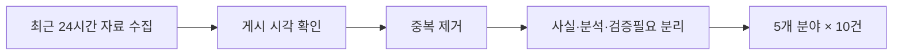

# 260707 최근 24시간 뉴스 브리핑

> 기준 시각: 2026-07-07 01:42 KST<br>
> 수집 범위: 2026-07-06 01:42~2026-07-07 01:42 KST<br>
> 구성: 랭킹·경제·증권·커뮤니티 유머·IT 각 10건



기사, 웹페이지, 커뮤니티, 블로그와 YouTube 검색 결과를 함께 살폈다. 원문 URL과 게시 시각을 확인할 수 있는 자료를 우선했고 같은 사건의 재전송 기사는 하나로 묶었다. 기업 발표와 시장 전망은 확정 사실과 구분했으며, 커뮤니티 이미지·영상의 세부 장면은 `검증필요`로 표시했다.

---

## 🏆 랭킹뉴스 10

| 번호 | 이슈 | 시각·출처 |
|---:|---|---|
| 1 | 국정원 계엄 동조 정황 | 18:29 연합뉴스 |
| 2 | 정유 4사 유가 담합 기소 | 10:00 연합뉴스 |
| 3 | 장윤기 수사팀장 체포 | 09:45 연합뉴스 |
| 4 | 이병태 부위원장 사퇴 | 22:28 한겨레 |
| 5 | 캐나다 잠수함 TKMS 보도 | 21:47 뉴시스 |
| 6 | 배재고 야구부 광주 사과 | 15:18 동아일보 |
| 7 | 노르웨이 월드컵 8강 | 07:29 뉴시스 |
| 8 | 대통령 지지도 47.0% | 09:43 파이낸셜뉴스 |
| 9 | 선관위 예산 감사 | 09:00 연합뉴스 |
| 10 | 청소년 사회적 시차 연구 | 06:03 연합뉴스 |

### 1. 국정원 계엄 동조 정황

특검은 국정원이 비상계엄에 적극 동조한 정황을 확인했다고 밝혔다. 핵심은 ‘안보 위해 세력’ 수백 명의 명단이다. 안보조사 부서는 긴급명령을 통한 대공수사권 행사 가능성을 검토한 것으로 조사됐다. 계엄사 합수부 파견 인력도 선발한 것으로 파악됐다. 특검은 명단 작성 지시 경로를 추적 중이다. 조태용 당시 원장과 정무직 관계자의 관여 여부가 수사 대상이다. 현재 내용은 특검 발표이며 법원 확정 판단은 아니다. 동아일보 후속 보도에서도 같은 브리핑이 확인됐다. 관련자 조사와 압수물 분석이 혐의 입증의 관건이다. 원문은 7월 6일 18시 29분 송고된 [연합뉴스 기사](https://www.yna.co.kr/view/AKR20260706107451004)다.

### 2. 정유 4사 26조원대 유가 담합 기소

검찰은 국내 정유 4사를 공정거래법 위반 혐의로 기소했다. 대상은 HD현대오일뱅크, SK에너지, GS칼텍스, 에쓰오일이다. HD현대오일뱅크와 SK에너지는 전쟁 직후 가격 인상 시기와 폭을 조율한 혐의를 받는다. 검찰은 직접 담합 규모를 약 14조2천억원으로 추산했다. 전체 경쟁 제한 효과는 약 26조원으로 제시됐다. 전량구매계약 강제와 조사 방해 정황도 포함됐다. 증거인멸과 정부 허위 보고 의혹도 제기됐다. 이 수치는 검찰 추산이므로 재판에서 다퉈질 수 있다. 전자신문도 같은 날 기소 내용을 보도했다. 원문은 7월 6일 10시 송고된 [연합뉴스 기사](https://www.yna.co.kr/view/AKR20260706042600004)다.

### 3. 장윤기 사건 담당 형사팀장 긴급체포

광주경찰청은 광산경찰서 소속 형사팀장 A 경감을 긴급체포했다. 적용 혐의는 장윤기 사건 관련 증거인멸이다. A 경감은 피의자 SUV 압수수색 중 일부 증거를 없앤 혐의를 받는다. 주요 증거가 실물 보존 없이 가족에게 인계된 경위도 조사 대상이다. 경찰은 기존 감찰을 형사수사로 전환했다. 22명 규모 전담팀도 구성했다. 긴급체포는 유죄 확정이 아니다. 구체적 고의성은 추가 수사가 필요하다. 경찰은 증거 수집·보존 절차 전반을 재확인하고 있다. 원문은 7월 6일 9시 45분 송고된 [연합뉴스 기사](https://www.yna.co.kr/amp/view/AKR20260705018653054)다.

### 4. “5·18 성역” 논란 이병태 부위원장 사퇴

이병태 규제합리화위원회 부위원장이 사퇴했다. 청와대는 그의 사의를 수용했다. 이 부위원장은 배재고 논란과 관련해 “5·18이 성역이 됐다”고 주장했다. 발언은 역사 왜곡과 표현의 자유 범위를 둘러싼 논쟁을 키웠다. 청와대는 먼저 경고 메시지를 전달했다. 이후 사안을 엄중하게 본다며 사퇴를 권고했다. 여권에서도 공개 사퇴 요구가 이어졌다. 이 부위원장은 표현의 자유를 강조하는 글을 추가로 올렸다. 최종적으로 발언 나흘 만에 물러났다. 원문은 7월 6일 22시 28분 수정된 [한겨레 기사](https://www.hani.co.kr/arti/politics/politics_general/1266960.html)다.

### 5. 캐나다 잠수함 사업, 독일 TKMS 선정 보도

캐나다 매체는 신형 잠수함 건조 업체로 독일 TKMS가 선정됐다고 보도했다. 보도는 익명 소식통 두 명을 인용했다. 사업은 잠수함 12척 도입을 목표로 한다. 한국 한화오션과 독일 TKMS가 경쟁했다. 건조비는 200억~300억 캐나다달러로 추산됐다. 운영·유지비는 400억~500억 캐나다달러로 거론됐다. 우선협상대상자가 정해져도 최종 계약까지 수년이 걸릴 수 있다. 한국 방산의 북미 시장 확대 기대에는 부정적 소식이다. 검증필요: 기준 시각에는 캐나다 정부 공식 발표 전이었다. 원문은 7월 6일 21시 47분 등록된 [뉴시스 기사](https://www.newsis.com/view/NISX20260706_0003698051)다.

### 6. 배재고 야구부, 광주 찾아 공식 사과

배재고 야구부 선수와 감독, 교직원이 광주제일고를 방문했다. 이들은 경기 중 나온 5·18 비하성 응원에 대해 사과했다. 선수단은 피해 학생과 시민에게 상처를 준 점을 인정했다. 주장 학생은 인성과 태도의 중요성을 깨달았다고 말했다. 감독도 응원을 제지하지 못한 지도 책임을 인정했다. 사과 후 국립5·18민주묘지를 참배했다. 협회는 전국대회 출전정지 6개월을 통보했다. 광주일고 측은 사과를 받아들이며 학생들을 격려했다. 사건은 청소년 역사·혐오표현 교육 문제로 이어졌다. 원문은 7월 6일 15시 18분 입력된 [동아일보 기사](https://www.donga.com/news/Society/article/all/20260706/134244587/1)다.

### 7. 노르웨이, 브라질 꺾고 월드컵 8강

노르웨이는 월드컵 16강에서 브라질을 2대1로 이겼다. 엘링 홀란이 후반 두 골을 넣었다. 노르웨이는 28년 만의 본선 복귀 무대에서 8강에 올랐다. 이번 8강은 노르웨이의 월드컵 사상 최고 성적이다. 홀란은 대회 7골을 기록했다. 그는 메시, 음바페와 득점 공동 선두에 올랐다. 브라질은 36년 만에 16강에서 탈락했다. 경기 전 전력 평가를 뒤집은 대표 이변이다. 승부는 홀란의 결정력에서 갈렸다. 원문은 7월 6일 7시 29분 등록된 [뉴시스 기사](https://www.newsis.com/view/NISX20260706_0003696486)다.

### 8. 이재명 대통령 지지도 47.0%

리얼미터 조사에서 대통령 국정수행 긍정 평가는 47.0%였다. 전주보다 0.5%포인트 올랐다. 7주간 이어진 하락세가 소폭 반등으로 바뀌었다. 부정 평가는 49.2%였다. 두 평가의 차이는 오차범위 안이다. 조사는 성인 2,525명을 대상으로 진행됐다. 표본오차는 95% 신뢰수준에서 ±2.0%포인트다. 응답률은 4.0%다. 정당 지지도는 민주당 43.0%, 국민의힘 40.3%였다. 원문은 7월 6일 9시 43분 입력된 [파이낸셜뉴스 기사](https://www.fnnews.com/news/202607060943128257)다.

### 9. 감사원, 선관위 예산 감사 착수

감사원이 중앙선관위 예산 감사에 들어갔다. 서울·경기·부산 선관위도 우선 감사 대상이다. 42명 감사반이 7월 24일까지 1단계 감사를 진행한다. 이후 8월에 2단계 감사가 이어진다. 점검 범위는 2022년 이후 선거 예산이다. 투표용지 인쇄와 계약, 수당, 수의계약 등 12개 항목을 살핀다. 6·3 지방선거 투표용지 부족 사태가 배경이다. 감사원은 예산 편성과 집행의 적정성을 확인한다. 결과에 따라 제도 개선이나 책임 조치가 뒤따를 수 있다. 원문은 7월 6일 9시 송고된 [연합뉴스 기사](https://www.yna.co.kr/amp/view/AKR20260705031800001)다.

### 10. 청소년 ‘사회적 시차’와 자살 관련 행동

연구진은 중·고등학생 4만8,101명의 자료를 분석했다. 자료는 2024년 청소년건강행태조사다. 전체의 53.5%가 1시간 이상 사회적 시차를 경험했다. 2시간 이상 집단의 자살생각 경험률은 14.2%였다. 1시간 미만 집단은 11.2%였다. 자살 계획은 각각 5.5%와 3.9%였다. 자살 시도는 각각 3.2%와 2.0%였다. 사회적 시차가 클수록 위험 지표가 높았다. 관찰연구이므로 인과관계로 단정할 수 없다. 원문은 7월 6일 6시 3분 송고된 [연합뉴스 기사](https://www.yna.co.kr/view/AKR20260705024000530)다.

---

## 💰 경제뉴스 10

| 번호 | 이슈 | 시각·출처 |
|---:|---|---|
| 1 | 외환시장 24시간 거래 | 16:50 뉴시스 |
| 2 | 광주 군공항 반도체 산단 | 14:50 뉴시스 |
| 3 | 한국 선박 수주 60% 증가 | 10:47 연합뉴스 |
| 4 | 동남권 경제 중동전쟁 여파 | 16:48 뉴시스 |
| 5 | 일본 맥주 수입 10만t | 13:53 뉴시스 |
| 6 | 홈플 협력사 3천억 보증 | 17:27 뉴시스 |
| 7 | 푸드테크 1,770억 지원 | 16:52 뉴시스 |
| 8 | LG 협력사 900억 지원 | 14:30 뉴시스 |
| 9 | 영동대로 지하공간 수주 | 17:19 뉴시스 |
| 10 | 청와대 집값 압력 진단 | 19:17 뉴시스 |

### 1. 외환시장 24시간 거래 시작

원·달러 현물시장이 주중 24시간 체제로 전환됐다. 운영 시간은 월요일 6시부터 토요일 6시까지다. 종전에는 평일 9시부터 다음 날 2시까지 거래됐다. 미국 시간대 환전 수요까지 국내에서 처리하려는 조치다. 당국은 역외 NDF 수요의 국내 유입을 기대한다. 첫날 환율은 4.7원 오른 1,530.3원에 마감했다. 거래시간 확대가 즉시 환율 하락을 뜻하지는 않는다. 초기에는 유동성 분산과 야간 변동성도 점검해야 한다. 효과는 외국인 거래와 가격 안정성을 장기 관찰해야 판단할 수 있다. 원문은 7월 6일 16시 50분 등록된 [뉴시스 기사](https://www.newsis.com/view/NISX20260706_0003697810)다.

### 2. 호남 반도체 산단, 광주 군공항 부지로

정부는 호남권 반도체 산단을 광주 군공항 부지에 조성하기로 했다. 삼성전자와 SK하이닉스가 모두 입주하는 방향이다. 부지와 전력, 용수 문제를 동시에 해결한다는 계획이다. 필요한 전력은 6.3GW 규모로 언급됐다. 산업용수 수요는 하루 65만t 규모다. 대통령이 민관합동 점검회의를 매달 주재한다. 전담기구도 설치한다. 용인 클러스터의 기반시설 일정도 앞당길 방침이다. 실제 투자와 착공 시점은 기업 결정과 인허가를 더 확인해야 한다. 원문은 7월 6일 14시 50분 등록된 [뉴시스 기사](https://www.newsis.com/view/NISX20260706_0003697505)다.

### 3. 한국 상반기 선박 수주 60% 증가

한국의 상반기 선박 수주량은 797만CGT였다. 수주 척수는 195척이다. 전년 동기보다 60% 증가했다. 세계 점유율은 19%다. 중국은 3,100만CGT로 72%를 차지했다. 6월 한국 점유율은 9%였다. 한국의 척당 평균 수주 규모는 3.8만CGT였다. 중국은 2.6만CGT였다. 한국 수주잔량은 3,881만CGT로 집계됐다. 원문은 7월 6일 10시 47분 송고된 [연합뉴스 기사](https://www.yna.co.kr/view/AKR20260706044000003)다.

### 4. 중동전쟁 여파로 동남권 경제 악화

BNK경영연구원은 중동전쟁이 동남권 경제를 압박한다고 분석했다. 5월 제조업 생산은 전년 대비 2.1% 감소했다. 석유화학과 정제 부진이 주요 원인이다. 수출물량은 22.0% 줄었다. 이는 64개월 만의 최대 감소폭이다. 취업자 증가는 6천 명에 그쳤다. 연구원은 위험 구조를 ‘R.I.S.K’로 설명했다. 정유·석유화학 집중과 중동 원유 의존이 취약 요인이다. 항만과 물류의 지정학적 노출도 위험을 키운다. 원문은 7월 6일 16시 48분 등록된 [뉴시스 기사](https://www.newsis.com/view/NISX20260706_0003697812)다.

### 5. 일본 맥주 수입량 첫 10만t 돌파

2025년 일본 맥주 수입량은 10만322t이다. 전년보다 22% 증가했다. 연간 10만t 돌파는 처음이다. 전체 수입맥주는 24만442t이었다. 일본산 비중은 41.7%다. 일본산 수입은 2021년 6,912t까지 줄었다. 2022년부터 회복세가 이어졌다. 전체 주류 소비 둔화와 일본 맥주 선호 회복이 동시에 나타났다. 수입량은 판매액이나 국내 전체 점유율과는 다른 지표다. 원문은 7월 6일 13시 53분 등록된 [뉴시스 기사](https://mobile.newsis.com/view_amp.html?ar_id=NISX20260706_0003697361)다.

### 6. 홈플러스 협력업체에 3천억원 긴급보증

금융당국은 홈플러스 협력업체 지원책을 내놨다. 대상은 회생절차 폐지로 피해가 예상되는 중소·중견 협력사다. 특례보증 한도는 최대 3천억원이다. 기업당 한도는 3억원에서 5억원으로 늘어난다. 보증비율은 90%다. 보증료율은 0.5%포인트 낮춘다. 은행권은 1년4개월 동안 만기연장과 상환유예를 제공했다. 누적 지원은 약 5조원이다. 보증은 유동성 충격을 줄이지만 매출 손실 자체를 없애지는 못한다. 원문은 7월 6일 17시 27분 등록된 [뉴시스 기사](https://www.newsis.com/view/NISX20260706_0003697896)다.

### 7. 푸드테크 기업에 1,770억원 금융지원

식품산업협회와 기보, 농협은행이 지원 협약을 맺었다. 총 규모는 1,770억원이다. 특별출연 보증은 700억원이다. 기업당 한도는 30억원이다. 초기 3년간 보증비율 100%가 적용된다. 별도 보증료 지원은 1,070억원이다. 대상은 운전·시설자금이다. 보증료는 2년간 0.7%포인트 지원한다. K푸드 관련 기술투자 촉진이 목적이다. 원문은 7월 6일 16시 52분 등록된 [뉴시스 기사](https://www.newsis.com/view/NISX20260706_0003697799)다.

### 8. LG 1·2·3차 협력사 상생협약

LG 7개 계열사가 협력사와 상생협약을 맺었다. 1차 협력사 현금성 결제 비율 100%를 유지한다. 상생결제의 하위 협력사 확산도 추진한다. 목표 낙수율은 10% 이상이다. 2·3차 협력사 금융지원은 900억원 이상이다. 복지 지원도 확대한다. 기술개발과 생산성 향상 지원도 포함됐다. 공정위는 하위 협력사까지 지원이 이어져야 한다고 강조했다. 효과는 실제 집행액과 체감 개선으로 평가해야 한다. 원문은 7월 6일 14시 30분 등록된 [뉴시스 기사](https://www.newsis.com/view/NISX20260706_0003697464)다.

### 9. DL이앤씨, 영동대로 지하공간 사업 수주

DL이앤씨는 영동대로 복합개발 1공구를 수주했다. 계약금액은 1,930억6,400만원이다. 지난해 연결 매출의 2.61%다. 사업지는 봉은사역 일대다. 광역복합환승센터 137.65m를 조성한다. 본선터널 80.35m도 포함된다. 계약기간은 2028년 10월 31일까지다. 공사대금은 진행률에 따라 지급된다. 공정과 안전, 원가 관리가 수익성의 핵심이다. 원문은 7월 6일 17시 19분 등록된 [뉴시스 기사](https://www.newsis.com/view/NISX20260706_0003697831)다.

### 10. 청와대 “부동산 가격 압력 심상치 않다”

김용범 정책실장은 집값 흐름이 심상치 않다고 진단했다. 연말과 내년으로 갈수록 압력이 커질 수 있다고 말했다. 경상수지 흑자가 유동성을 늘리는 요인이다. 상장사 이익 증가도 수요 여력을 키운다. 수요 압력은 1년 전보다 강하다는 판단이다. 정부는 3기 신도시와 수도권 6만호를 추진 중이다. 추가 택지와 공급대책도 필요하다고 밝혔다. 장기임대와 LH 매입임대도 검토한다. 전월세 대책을 포함한 종합 처방이 예고됐다. 원문은 7월 6일 19시 17분 등록된 [뉴시스 기사](https://www.newsis.com/view/NISX20260706_0003698000)다.

---

## 📈 증권뉴스 10

| 번호 | 이슈 | 시각·출처 |
|---:|---|---|
| 1 | 코스피 8,051.33 | 16:48 전자신문 |
| 2 | 금융·건설 순환매 | 11:13 뉴시스 |
| 3 | 외국인 순매도 | 10:49 뉴시스 |
| 4 | 삼성전자 실적 기대 | 15:20 뉴시스 |
| 5 | SK하이닉스 ADR | 18:58 뉴시스 |
| 6 | 레버리지 ETF 논란 | 15:56 뉴시스 |
| 7 | 레몬헬스케어 상장 | 09:36 뉴시스 |
| 8 | 네이버·두나무 연기 | 18:41 전자신문 |
| 9 | K방산 ETF 상장 | 09:16 뉴시스 |
| 10 | 코스닥 셀렉트 | 16:00 전자신문 |

### 1. 코스피 8,051.33 마감

코스피는 37.01포인트 내린 8,051.33에 마감했다. 하락률은 0.46%다. 코스닥은 2.46% 내린 847.07이었다. 개인은 약 2조6,806억원을 순매수했다. 외국인은 약 1조3,088억원을 순매도했다. 기관도 약 1조4,675억원을 팔았다. 삼성전자는 2.75% 올랐다. 삼성물산은 3.69% 상승했다. 다음 변수는 삼성전자 실적과 SK하이닉스 ADR 상장이다. 원문은 7월 6일 16시 48분 발행된 [전자신문 기사](https://www.etnews.com/20260706000403)다.

### 2. 반도체 약세 속 금융·건설 강세

KRX 반도체지수는 한 주간 8.25% 하락했다. 삼성전자지수는 8.84% 내렸다. SK하이닉스지수도 9.28% 하락했다. 반면 은행지수는 13.71% 올랐다. 증권지수는 12.83% 상승했다. 건설지수도 10.12% 올랐다. 중형주지수는 4.55% 상승했다. 소형주와 초소형주도 강세였다. 분석은 구조적 순환매와 레버리지 상품발 착시로 갈렸다. 원문은 7월 6일 11시 13분 등록된 [뉴시스 기사](https://www.newsis.com/view/NISX20260706_0003697146)다.

### 3. 외국인 ‘셀 코리아’

연초 이후 외국인 코스피 순매도는 157조3,076억원으로 보도됐다. 기사에서는 반기 기준 사상 최대라고 설명했다. 삼성전자 순매도는 85조7,564억원이다. SK하이닉스는 69조3,668억원이다. 두 종목이 대부분을 차지했다. 차익 실현이 배경으로 분석됐다. 대만으로 패시브 자금이 이동한 영향도 거론됐다. 반도체 이익 지속성이 복귀 조건이다. 환율 안정도 핵심 변수다. 원문은 7월 6일 10시 49분 등록된 [뉴시스 기사](https://www.newsis.com/view/NISX20260706_0003696772)다.

### 4. 삼성전자 2분기 실적 기대치

에프앤가이드 영업이익 컨센서스는 85조494억원으로 보도됐다. 삼성증권 전망은 86조원이다. 유진투자증권 전망은 83조1천억원이다. 서버 D램 가격 상승이 개선 요인이다. HBM4 선제 출하도 거론됐다. 기대를 넘지 못하면 재료 소멸 매도가 나올 수 있다. 최근 주가 조정은 발표 후 안도를 만들 수도 있다. 실적이 시장 투자심리의 핵심 변수다. 수치는 전망이며 실제 잠정실적과 다를 수 있다. 원문은 7월 6일 15시 20분 등록된 [뉴시스 기사](https://www.newsis.com/view/NISX20260706_0003697571)다.

### 5. SK하이닉스 나스닥 ADR 상장

SK하이닉스는 7월 10일 나스닥 ADR 상장을 추진한다. 보도된 발행 규모는 약 290억달러다. 원화로 약 44조4,570억원이다. 외국기업의 미국 최초 주식매각 중 최대가 될 수 있다. 미국 투자자 접근성이 높아진다. 거래 유동성 개선도 기대된다. 기사 기준 선행 PER은 6.2배다. 마이크론의 7배보다 낮다. 자금 유입 효과는 상장 후 확인해야 한다. 원문은 7월 6일 18시 58분 등록된 [뉴시스 기사](https://www.newsis.com/view/NISX20260706_0003697971)다.

### 6. 단일종목 2배 레버리지 ETF 논란

삼성전자·SK하이닉스 2배 ETF 위험성이 제기됐다. 안철수 의원은 상장폐지를 포함한 방안을 주장했다. 관련 ETF 14개의 한 달 수익률은 모두 마이너스였다. 지난달 거래대금은 212조원이다. 일반 상장폐지 요건과는 거리가 있다. 상장폐지돼도 펀드 자산이 즉시 사라지지는 않는다. 청산 후 해지상환금이 지급된다. 거래소에는 투자자 보호 조항이 있다. 이를 적용한 ETF 폐지 선례는 확인되지 않았다. 원문은 7월 6일 15시 56분 등록된 [뉴시스 기사](https://www.newsis.com/view/NISX20260706_0003697630)다.

### 7. 레몬헬스케어 코스닥 데뷔

레몬헬스케어가 코스닥에 상장했다. 오전 9시 22분 주가는 1만5,500원이었다. 공모가보다 55% 높았다. 이 가격은 종가가 아니다. 회사는 진료 예약·접수·수납을 연결한다. 전자처방전과 실손보험 청구도 제공한다. 병원용 의료정보 플랫폼을 공급해왔다. 의료 마이데이터 사업도 확대 중이다. 신규 상장주는 초기 변동성이 클 수 있다. 원문은 7월 6일 9시 36분 등록된 [뉴시스 기사](https://www.newsis.com/view/NISX20260706_0003696795)다.

### 8. 네이버파이낸셜·두나무 주식교환 연기

양사의 포괄적 주식교환이 연기됐다. 새 교환일은 12월 31일이다. 주주총회는 11월 19일 예정이다. 공정위 기업결합 심사가 배경이다. 금융당국 승인 절차도 남아 있다. 두 번째 연기다. 최초 계획보다 6개월 넘게 늦어졌다. 두나무를 네이버파이낸셜 완전자회사로 편입하는 거래다. IPO 일정은 확정되지 않았다. 원문은 7월 6일 18시 41분 발행된 [전자신문 기사](https://www.etnews.com/20260706000426)다.

### 9. ACE K방산TOP5+ ETF 상장

K방산 집중 ETF가 7월 7일 상장한다. KRX K-AI 방산 TOP5+를 추종한다. 상위 5종목 비중은 80%다. 나머지 5종목은 20%다. 현대로템과 LIG디펜스앤에어로스페이스가 후보로 제시됐다. 한화에어로스페이스와 한국항공우주도 포함될 전망이다. 드론·위성·AI 지휘통제 기업도 후보군이다. 방산 수출은 2030년 340억달러 전망이 나왔다. 상품은 지정학·수주 변수에 민감하다. 원문은 7월 6일 9시 16분 등록된 [뉴시스 기사](https://www.newsis.com/view/NISX20260706_0003696712)다.

### 10. 코스닥 우량 세그먼트 ‘셀렉트’

거래소가 코스닥 ‘셀렉트’를 준비한다. 대상 기업을 먼저 지정하는 방식이 유력하다. 기업이 참여 여부를 선택한다. 초기 기준의 일관성 확보가 목적이다. 정착 후 자율 신청을 확대할 수 있다. 편입 기준과 절차를 명확히 할 계획이다. 성장 인센티브 중심으로 설계한다. 부실기업 퇴출 기준도 강화됐다. 우량 육성과 부실 정리가 신뢰 회복의 양축이다. 원문은 7월 6일 16시 발행된 [전자신문 기사](https://www.etnews.com/20260706000305)다.

---

## 😂 커뮤니티 유머 10

| 번호 | 게시물 | 시각·커뮤니티 |
|---:|---|---|
| 1 | 짜장면 먹는 네팔 어린이 | 06:52 뽐뿌 |
| 2 | 중국 계란빵 | 07:41 뽐뿌 |
| 3 | 스노클링 수중 촬영 | 08:11 뽐뿌 |
| 4 | 이연복 추천 디저트 | 09:04 뽐뿌 |
| 5 | 소지섭 투자 영화 | 10:06 뽐뿌 |
| 6 | 40분 명상 반전 | 10:16 뽐뿌 |
| 7 | 독특한 고양이 | 10:26 뽐뿌 |
| 8 | 행복 10초 전 | 11:28 뽐뿌 |
| 9 | 유한 무한리필 | 12:03 뽐뿌 |
| 10 | 세계 기차역 | 12:38 뽐뿌 |

여러 커뮤니티를 검색했지만 시간창·원문 접근·안전성을 함께 확인한 10건은 모두 뽐뿌에서 선별됐다.

### 1. 짜장면을 먹는 네팔 어린이

네팔 어린이가 짜장면을 마주한 사진이다. 사진 두 장으로 구성됐다. 본문은 “오늘은 짜장면 이닷”이다. 아이의 큰 눈이 웃음 포인트다. 댓글은 짜장면을 볼 때 표정에 주목했다. 양파를 볼 때와 다르다는 반응도 있었다. 귀엽다는 댓글이 이어졌다. 가벼운 반응형 콘텐츠다. 세부 장면은 원본 이미지 육안 확인이 필요하다. 원문은 7월 6일 6시 52분 게시된 [뽐뿌 글](https://www.ppomppu.co.kr/zboard/view.php?id=humor&no=765735)이다.

### 2. 중국에서 파는 계란빵

중국식 계란빵 조리 영상이다. 고기와 달걀, 반죽을 단계별로 익힌다. 댓글은 소시지 에그 맥머핀에 비유했다. 먹음직스럽다는 반응이 나왔다. 과정이 번거롭다는 의견도 있었다. 회전식 틀을 쓰자는 농담이 붙었다. 한국식 계란빵과 다른 조리법이다. 음식 영상과 현실 조언이 결합된 유머다. 정확한 재료는 영상 확인이 필요하다. 원문은 7월 6일 7시 41분 게시된 [뽐뿌 글](https://www.ppomppu.co.kr/zboard/view.php?id=humor&no=765741)이다.

### 3. 스노클링 바닷속 촬영

수중 사진을 여러 장 소개한 글이다. 댓글은 선명한 결과물에 주목했다. 수중은 광량 부족으로 촬영이 어렵다는 경험담이 나왔다. 색감이 아름답다는 반응이 많았다. 동남아 바다에서 재현하기 쉽다는 의견이 있었다. 프리다이빙을 배우고 싶다는 댓글도 달렸다. 스쿠버다이빙 관심으로도 이어졌다. 감탄과 여행 욕구를 자극한다. 촬영 장소와 장비는 검증필요다. 원문은 7월 6일 8시 11분 게시된 [뽐뿌 글](https://www.ppomppu.co.kr/zboard/view.php?id=humor&no=765742)이다.

### 4. 이연복 셰프 추천 디저트

이연복 셰프의 디저트 추천 이미지다. 적극적인 추천이 제목의 핵심이다. 한 이용자는 청두에서 먹어봤다고 했다. 그는 “예상 가능한 맛”이라고 평가했다. 강한 추천과 담담한 후기가 대비된다. 이 온도 차이가 웃음 포인트다. ‘다이어트’로 잘못 읽었다는 말장난도 나왔다. 방송 캡처형 콘텐츠로 보인다. 디저트 이름과 방송 출처는 검증필요다. 원문은 7월 6일 9시 4분 게시된 [뽐뿌 글](https://www.ppomppu.co.kr/zboard/view.php?id=humor&no=765747)이다.

### 5. 소지섭 투자 영화 리스트

소지섭이 투자했다고 소개된 영화 목록이다. 작품성이 강한 영화를 고른다는 평가가 나왔다. 《그린 나이트》가 언급됐다. 《미드소마》와 《유전》도 등장했다. 낯선 작품이 많다는 반응도 있었다. 명작에만 투자한다는 호평도 나왔다. 다양한 영화를 극장에서 보게 해줘 고맙다는 의견이 있었다. 배우의 취향을 추측하는 재미가 중심이다. 개인 투자 여부는 크레딧 검증이 필요하다. 원문은 7월 6일 10시 6분 게시된 [뽐뿌 글](https://www.ppomppu.co.kr/zboard/view.php?id=humor&no=765752)이다.

### 6. 매일 40분 명상의 반전

자기계발 조언처럼 시작하는 유머다. 이웃이 매일 40분 명상한다고 말한다. 인생이 완전히 바뀌었다는 설명이 이어진다. 첫 변화는 직장 지각이다. 반복 지각으로 해고됐다는 반전이 나온다. 아내까지 떠났다는 식으로 커진다. “엄청난 변화죠”가 결말이다. 긍정 문구를 문자 그대로 비튼다. 명상의 효능을 설명하는 정보글은 아니다. 원문은 7월 6일 10시 16분 게시된 [뽐뿌 글](https://www.ppomppu.co.kr/zboard/view.php?id=humor&no=765754)이다.

### 7. 평생 자신을 증명해야 하는 고양이

독특한 털무늬의 고양이 사진이다. 무늬가 합성처럼 보이는 점이 소재다. 제목은 평생 진짜임을 증명해야 한다고 농담한다. 댓글은 “문신묘”라고 불렀다. 실제 무늬라는 설정이 웃음 포인트다. 귀엽다는 반응이 이어졌다. 신기하다는 감탄도 많았다. 가벼운 동물 콘텐츠다. 무늬와 합성 여부는 이미지 확인이 필요하다. 원문은 7월 6일 10시 26분 게시된 [뽐뿌 글](https://www.ppomppu.co.kr/zboard/view.php?id=humor&no=765756)이다.

### 8. 행복해지기 10초 전

행복한 일이 생기기 직전 순간의 사진이다. 결과를 보여주지 않는 제목형 유머다. 독자는 다음 상황을 상상한다. 댓글은 강아지가 숨어 있다고 반응했다. 작은 요소를 찾는 재미가 있다. 분위기가 좋다는 호평도 붙었다. 기대감 자체를 행복으로 본다. 공격적 요소가 없는 일상형 콘텐츠다. 인물과 후속 상황은 검증필요다. 원문은 7월 6일 11시 28분 게시된 [뽐뿌 글](https://www.ppomppu.co.kr/zboard/view.php?id=humor&no=765768)이다.

### 9. 무한리필을 잘 모르는 사장님

식당의 무한리필 안내문 사진이다. 안내문은 무한리필을 내세운다. 동시에 제공 횟수에는 제한을 둔 듯하다. 의미와 규칙의 충돌이 핵심이다. 댓글은 “유한리필”이라고 불렀다. 통신사의 ‘무료통화’와 비슷하다는 비유도 나왔다. 소비자 기대와 사업자 조건의 간극을 풍자한다. 안내문이 논리 퀴즈처럼 읽힌다. 제한 횟수와 매장명은 검증필요다. 원문은 7월 6일 12시 3분 게시된 [뽐뿌 글](https://www.ppomppu.co.kr/zboard/view.php?id=humor&no=765771)이다.

### 10. 세계의 기차역

세계 대표 기차역 사진 모음이다. 하이다르파샤역이 포함됐다. 서던크로스역과 오리엔트역도 소개됐다. 밀라노 첸트랄레역도 등장한다. 안트베르펜 중앙역도 있다. 마푸투와 차트라파티 시바지역도 이어진다. 역별 건축 양식을 비교할 수 있다. 뭄바이 역이 아름답다는 댓글이 나왔다. 빠진 유명 역이 있다는 의견도 있었다. 원문은 7월 6일 12시 38분 게시된 [뽐뿌 글](https://www.ppomppu.co.kr/zboard/view.php?id=humor&no=765779)이다.

---

## 💻 IT뉴스 10

| 번호 | 이슈 | 시각·출처 |
|---:|---|---|
| 1 | KISA 랜섬웨어 복구 | 17:30 전자신문 |
| 2 | 토요타 휴머노이드 | 18:05 전자신문 |
| 3 | 국산 AI 패브릭 | 17:00 전자신문 |
| 4 | AI 모델 믹싱 | 14:58 전자신문 |
| 5 | 몰로코 CTV 광고 | 17:00 전자신문 |
| 6 | 양자 암호 실증 | 17:13 전자신문 |
| 7 | SKT 시설 안전 | 14:46 전자신문 |
| 8 | 시니어 AI 랩 | 15:02 전자신문 |
| 9 | SM그룹 업무통합 | 09:01 전자신문 |
| 10 | NIA 공공 AI 사례 | 08:37 전자신문 |

### 1. KISA 랜섬웨어 피해 파일 복구

KISA는 중소기업 두 곳의 파일을 복구했다. 한 기업은 6만9,191개 파일이 암호화됐다. 다른 기업은 45만4,320개가 피해를 입었다. 해커는 각각 4억원과 3억7천만원을 요구했다. 기업은 몸값을 지급하지 않았다. KISA는 경찰과 악성코드를 분석했다. 암호학적 결함으로 복호화키를 개발했다. AI 기반 신·변종 분석 체계도 준비한다. 피해 시 KISA와 수사기관에 즉시 신고해야 한다. 원문은 7월 6일 17시 30분 발행된 [전자신문 기사](https://www.etnews.com/20260706000410)다.

### 2. 레인보우로보틱스, 토요타 공급 확대

토요타 공급 휴머노이드는 누적 약 25대로 보도됐다. 제품명은 RB-Y1이다. 2024년 초도 공급은 5~6대였다. 약 2년 만에 5배 늘었다. 반복 구매는 활용성의 긍정 신호다. 완성차 업계는 인력난 대응을 위해 도입을 확대한다. 생산효율 향상도 목적이다. 삼성전자는 제조·물류 고객을 넓히고 있다. 공급량은 업계 취재 기반이라 계약 공시 확인이 필요하다. 원문은 7월 6일 18시 5분 발행된 [전자신문 기사](https://www.etnews.com/20260703000206)다.

### 3. 국산 초저지연 AI 네트워크 사업

망고부스트가 AI 네트워크 국책사업을 수주했다. 과기정통부와 IITP가 지원한다. 회사는 총괄·1세부 주관기관이다. 기간은 2030년 12월까지다. 정부지원금은 144억원이다. 서울대와 KAIST 등 7곳이 참여한다. 참여 인력은 약 90명이다. 국산 AI 네트워크 풀스택 개발이 목표다. GPU 병목과 전력 낭비를 줄이려 한다. 원문은 7월 6일 17시 발행된 [전자신문 기사](https://www.etnews.com/20260706000119)다.

### 4. 기업 AI 비용 줄이는 ‘모델 믹싱’

기업이 고가 AI 모델 일변도를 재검토한다. 작업 난도에 따라 여러 모델을 배치한다. 고도 추론에는 고성능 모델을 쓴다. 반복 작업에는 저가·오픈소스 모델을 쓴다. 코인베이스 CEO는 작업 80%의 이동을 전망했다. 비용 감소 폭은 최대 99%로 제시됐다. 모델 라우터 도입률은 1%에서 5%로 늘었다. 라우터는 요청별 모델을 자동 선택한다. 절감 전망은 실제 운영지표로 검증해야 한다. 원문은 7월 6일 14시 58분 발행된 [전자신문 기사](https://www.etnews.com/20260706000362)다.

### 5. 몰로코 AI 기반 CTV 광고

몰로코는 AI CTV 광고로 북미 진출을 지원한다. 회사는 280만개 이상 앱 데이터를 분석한다. 30개 이상 모델과 에이전트를 결합한다. 광고 노출과 입찰을 자동 최적화한다. CTV 유입자의 94%가 모바일 광고 비노출자였다고 밝혔다. 예산 26%로 신규 설치 64%를 만들었다고 설명했다. 데브시스터즈는 누적 광고수익률 100% 이상을 제시했다. CTV가 신규 이용자층을 찾는다는 주장이다. 성과 수치는 회사 발표 기반이다. 원문은 7월 6일 17시 발행된 [전자신문 기사](https://www.etnews.com/20260706000343)다.

### 6. 실제 양자컴퓨터에서 축소 암호 해독

비드래프트는 양자컴퓨터에서 암호구조 해독을 실증했다. 장비는 IBM 156큐빗 ‘ibm_kingston’이다. 대상은 Even-Mansour와 축소 Feistel이다. Simon 알고리즘을 사용했다. N=5~10 조건을 시험했다. Feistel은 6비트와 8비트 조건이다. 자기검증 절차도 적용했다. 실제 AES를 깬 결과는 아니다. 축소 구조 개념증명으로 봐야 한다. 원문은 7월 6일 17시 13분 발행된 [전자신문 기사](https://www.etnews.com/20260706000411)다.

### 7. SKT 통신시설 작업 안전 강화

SKT는 통신시설 1만곳을 추가 개선한다. 완료 시 누적 15만6천곳이다. 전체 약 20만곳의 78%다. 협력사 250곳에 안전교육을 한다. 현장 컨설팅도 제공한다. AI 위험성 평가를 도입한다. 안전 현황 통합 대시보드도 구축한다. 2028년 목표는 17만6천곳이다. 사고 감소 효과는 도입 후 지표로 평가해야 한다. 원문은 7월 6일 14시 46분 발행된 [전자신문 기사](https://www.etnews.com/20260706000347)다.

### 8. 시니어 돌봄 AI 실증공간 개관

미들턴은 인천에 시니어 AI 실증공간을 열었다. 요양원·병원·실버타운 환경을 재현했다. 자체 GPU 서버를 사용한다. 온프레미스 AI로 클라우드 의존을 줄였다. 개인정보 노출 위험도 낮추려 한다. 비전과 엣지 AI, 레이더, IoT를 통합한다. LLM과 에이전트, RAG도 적용한다. 낙상 감지와 비접촉 모니터링을 시험한다. 실증 데이터로 정확도를 높일 계획이다. 원문은 7월 6일 15시 2분 발행된 [전자신문 기사](https://www.etnews.com/20260706000363)다.

### 9. SM그룹 구글 기반 업무환경 통합

SM그룹은 구글 기반 업무환경을 고도화했다. KCUBE ON을 추가 도입했다. 54개 계열사 중 38개사가 대상이다. 계정 프로비저닝을 적용했다. 조직도 앱도 배포했다. 인사정보와 권한 관리를 연동한다. 계열사 협업 통합이 목표다. G-Task는 문서·채팅·일정을 연결한다. 향후 제미나이와 문서 요약·검색을 자동화한다. 원문은 7월 6일 9시 1분 발행된 [전자신문 기사](https://www.etnews.com/20260706000040)다.

### 10. NIA 공공 AI 서비스 우수사례

NIA가 AI 서비스 우수사례로 선정됐다. 한국표준협회 AI 서비스 리더상도 받았다. 대전 교통약자 이동지원이 주요 사례다. 서비스는 카카오T와 연계한다. 호출과 배차 불편 감소가 목표다. 실시간 의료자원 플랫폼도 포함됐다. 응급실 배정 지연을 줄이려 한다. 두 사업 모두 체감형 공공 AI를 지향한다. NIA는 유사 서비스를 확산할 계획이다. 원문은 7월 6일 8시 37분 발행된 [전자신문 기사](https://www.etnews.com/20260706000014)다.

---

## 🔎 검증 메모

| 항목 | 결과 |
|---|---|
| 시간 범위 | 50건 모두 원문 게시 시각이 기준창 안에 있음 |
| 중복 제거 | 같은 사건의 재전송·후속 보도는 대표 원문으로 통합 |
| 시장 수치 | 장중 수치와 종가를 구분 |
| 기업 성과 | 광고·로봇·양자 실증은 회사 주장으로 표시 |
| 커뮤니티 | 이미지·영상 세부는 검증필요로 표시 |

익명 소식통 보도인 캐나다 잠수함 사업은 공식 발표 전 단계다. 삼성전자 실적과 방산 수출은 전망치이지 확정 실적이 아니다. 커뮤니티 재게시물은 최초 제작 시점과 AI 합성 여부를 확인하기 어려워 게시물 자체의 반응만 요약했다.

## 🧾 작성 요청

```text
최근 24시간 내 뉴스기사, 블로그, 웹페이지, 커뮤니티사이트, YouTube를 검색해
랭킹뉴스·경제뉴스·증권뉴스·커뮤니티유머·IT뉴스를 각 10개씩,
각 항목 약 10문장으로 작성하고 hhddoc 및 블로그 프로젝트에 저장해 주세요.
```
