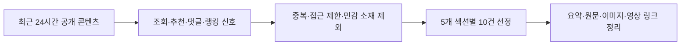

# 260711 최근 24시간 뉴스 브리핑 17시

확인 시각: 2026-07-11 17:09 KST

수집 범위: 2026-07-10 17:00부터 2026-07-11 17:00 KST까지 공개·노출된 콘텐츠

수집 기준: 네이버 뉴스 랭킹과 경제·IT 섹션, 네이버 금융 많이 본 뉴스, GeekNews 점수·댓글, 디시인사이드 실시간 베스트, FM코리아 포텐 조회·추천·댓글, YouTube 공개 메타데이터를 함께 확인했다.

웃긴대학은 직접 접근 시 403 또는 빈 HTML이 반환되어 이번 선정에서는 제외했고, FM코리아 일부 지표는 검색 인덱스와 접근 가능한 모바일 페이지 기준으로 남겼다.

YouTube는 공식 인기 탭을 안정적으로 가져오지 못해 비개인화 검색 결과와 조회수·좋아요·댓글 메타데이터를 보조 신호로 사용했다.

| 구분 | 건수 | 주요 신호 | 확인 방식 |
|---|---:|---|---|
| 랭킹뉴스 | 10 | 네이버 언론사별 많이 본 뉴스 | 2026-07-11 15~16시 집계 화면 |
| 경제뉴스 | 10 | 네이버 경제 랭킹·섹션 노출 | 2026-07-11 17:05 KST 확인 |
| 증권뉴스 | 10 | 네이버 금융 많이 본 뉴스 | 2026-07-11 17:05 KST 확인 |
| 커뮤니티유머 | 10 | FM코리아 포텐, 디시 실시간 베스트 | 조회·추천·댓글 지표 확인 |
| IT뉴스 | 10 | GeekNews 점수·댓글, 네이버 IT, YouTube | 2026-07-11 17:05~17:09 KST 확인 |



## 관련 이미지와 동영상


SK하이닉스 ADR 프리미엄과 나스닥 데뷔 이슈는 경제·증권·IT 영상에서 반복 노출됐다.

영상 링크: https://www.youtube.com/watch?v=E1jPyhxNXdE


포켓몬카드 리셀과 대기줄 뉴스는 소비·취미·재테크 심리가 섞인 랭킹뉴스로 반응이 컸다.


GeekNews에서는 대한민국 제도 체계도 프로젝트가 27점과 댓글 11개로 가장 강한 반응을 얻었다.


MBCNEWS의 SK하이닉스 ADR 영상은 업로드 당일 8만 회 이상 조회와 200개 이상 댓글이 확인됐다.


반도체 레버리지 ETF 제도 보완 영상도 투자자 댓글 반응이 강해 증권·IT 교차 이슈로 묶었다.

## 랭킹뉴스 10개

### 첫차 타도 못 사는 포켓몬카드 대기줄

뉴스1 많이 본 뉴스 1위권에서 확인된 소비·취미 이슈다.
희귀 포켓몬카드를 사기 위해 장맛비 속에서도 전날 밤부터 줄을 선 장면이 보도됐다.
정가보다 높은 리셀가와 수집 열풍이 맞물리면서 취미가 투자형 소비로 바뀐 모습을 보여준다.
단순 장난감 뉴스라기보다 한정판 상품, 리셀 시장, 대기 문화가 결합된 생활경제 콘텐츠로 읽힌다.
원문은 https://n.news.naver.com/article/421/0009053407?ntype=RANKING 에서 확인했다.


### 서울대 장학금과 미국 명문대를 거절한 KAIST 선택

뉴스1 많이 본 뉴스 2위권에 오른 교육·국제 이슈다.
베트남 졸업시험 전국 수석이 서울대 전액 장학금과 미국 명문대 선택지를 두고 KAIST 진학을 택했다.
삼성전자 장학금과 AI 분야 진로 계획이 함께 소개되며 한국 이공계 교육의 국제 경쟁력이 부각됐다.
독자 반응은 개인의 탁월한 선택뿐 아니라 한국 대학이 해외 우수 인재를 얼마나 끌어들일 수 있는지에 모였다.
원문은 https://n.news.naver.com/article/421/0009053364?ntype=RANKING 에서 확인했다.


### 치통 환자 치아 12개 발치 논란

뉴스1 많이 본 뉴스 3위권에서 확인된 해외 의료 사고 기사다.
중국의 한 치과가 치통을 호소한 60대 환자의 치아 12개를 발치하고 고가 임플란트를 진행해 논란이 됐다.
당국은 의료 과실을 인정하고 영업정지와 환불 명령을 내린 것으로 전해졌다.
의료 소비자 입장에서는 과잉진료, 동의 절차, 고령 환자 보호가 핵심 쟁점으로 남는다.
원문은 https://n.news.naver.com/article/421/0009053343?ntype=RANKING 에서 확인했다.


### 아내 지인 상대 성폭력 사건 국민참여재판

뉴스1 많이 본 뉴스 4위권에서 확인된 사회·법원 기사다.
배우자의 10년 지인을 상대로 성범죄를 저지른 혐의의 30대 남성이 국민참여재판 끝에 실형을 선고받았다.
재판부는 징역형과 취업 제한을 함께 명령하며 피해자 진술과 정황을 판단 근거로 삼았다.
랭킹 반응은 사건의 자극성보다 가까운 관계 안에서 벌어지는 범죄와 법적 책임에 대한 관심으로 해석된다.
원문은 https://n.news.naver.com/article/421/0009053426?ntype=RANKING 에서 확인했다.


### 장윤기 부친의 증거인멸 의혹 부인

뉴스1과 YTN 랭킹에 동시에 노출된 사회 사건 후속 보도다.
여고생 살해범 장윤기의 부친이 원룸 짐을 정리하려 했을 뿐 증거인멸 의도는 없었다고 진술했다.
현직 경찰 간부라는 신분 때문에 수사 공정성과 내부 대응 문제가 함께 쟁점화됐다.
후속 보도에서는 휴대전화 녹음 파일 확보 여부와 원룸 출입 경위가 중요한 확인 지점이다.
원문은 https://n.news.naver.com/article/421/0009053636?ntype=RANKING 에서 확인했다.


### 미국의 호르무즈 해협 개방 공개 요구

YTN 많이 본 뉴스 2위권에서 확인된 국제 안보 이슈다.
미국이 이란에 호르무즈 해협 통항 보장을 공개 성명으로 요구했다는 내용이 보도됐다.
호르무즈는 원유 수송의 핵심 경로라 갈등이 커지면 국제유가와 물류비에 바로 영향을 줄 수 있다.
한국 독자에게도 에너지 가격, 환율, 수입물가로 이어질 가능성이 있어 조회 반응이 컸다.
원문은 https://n.news.naver.com/article/052/0002378055?ntype=RANKING 에서 확인했다.


### 서울·경기 폭염경보 확대와 경산 39도 육박

YTN 많이 본 뉴스 3위권에서 확인된 날씨·생활 안전 이슈다.
장마가 잠시 물러난 뒤 서울과 경기 일부에 폭염경보가 확대됐고, 경북 경산은 비공식 38.8도까지 올랐다.
열돔과 고온다습한 남서풍이 겹치며 체감 더위가 커졌다는 설명이 붙었다.
폭염 뉴스는 전력 수요, 야외 노동, 취약계층 건강 위험과 바로 연결되기 때문에 생활 반응이 빠르다.
원문은 https://n.news.naver.com/article/052/0002378051?ntype=RANKING 에서 확인했다.


### SK하이닉스 나스닥 흥행과 코리아 디스카운트

YTN 많이 본 뉴스 4위권에서 확인된 경제·증권 결합 이슈다.
SK하이닉스 ADR이 나스닥 첫 거래에서 공모가 대비 13% 이상 오르며 강한 데뷔를 보였다.
AI 메모리 기대와 해외 투자자 접근성 확대가 코리아 디스카운트 완화 기대를 자극했다.
다만 거래량과 국내 본주 반영 여부를 더 봐야 한다는 신중론도 함께 제시됐다.
원문은 https://n.news.naver.com/article/052/0002378038?ntype=RANKING 에서 확인했다.


### 민주당의 장동혁 발언 비판

YTN 많이 본 뉴스 5위권에서 확인된 정치권 공방 기사다.
민주당은 장동혁 국민의힘 대표의 발언을 근거 없는 낙인찍기라고 비판했다.
제3자 추천 특검과 야당 단독 추천 논쟁이 맞물리며 정쟁의 소재가 확대됐다.
정치 뉴스 특성상 사실관계보다 프레임과 표현 수위에 댓글과 조회 반응이 몰릴 가능성이 크다.
원문은 https://n.news.naver.com/article/052/0002378021?ntype=RANKING 에서 확인했다.

### 경찰 조사와 장윤기 사건 후속 쟁점

YTN 랭킹에서는 장윤기 부친 조사와 경찰 내부 대응 관련 후속 보도가 별도 상위권에 올랐다.
수사팀은 증거인멸 의도와 자료 확보 여부를 확인하고 있고, 당사자는 의혹을 부인하는 구도다.
동일 사건이 여러 매체 랭킹에 반복 노출된 것은 시민 관심이 단순 사건을 넘어 경찰 신뢰 문제로 번졌기 때문이다.
후속 확인은 압수물 분석, 내부 보고 체계, 현직 경찰 간부의 실제 개입 여부가 중심이 될 전망이다.
원문은 https://n.news.naver.com/article/052/0002378060?ntype=RANKING 에서 확인했다.

## 경제뉴스 10개

### SK하이닉스 ADR 프리미엄과 월요일 주가 기대

헤럴드경제 많이 본 뉴스 1위권에서 확인된 경제·증권 핵심 이슈다.
SK하이닉스 ADR이 나스닥 첫날 국내 본주 환산가보다 약 16% 높게 거래되면서 국내 주가 반영 기대가 커졌다.
다만 ADR 프리미엄은 TSMC 사례처럼 장기간 따로 움직일 수 있어 단순 환산으로 주가를 예측하기는 어렵다.
AI 메모리 기대가 크지만 이벤트성 수급과 실제 실적 경로를 분리해서 봐야 한다.
원문은 https://n.news.naver.com/article/016/0002668871?ntype=RANKING 에서 확인했다.


### SK하이닉스의 내년 메모리 공급 부족 전망

서울경제 랭킹 상위권에서 확인된 반도체 산업 기사다.
SK하이닉스는 미국 내 메모리 생산시설 투자 가능성과 함께 내년 메모리 공급이 가장 어려울 수 있다고 내다봤다.
AI 수요가 빠르게 늘면서 HBM과 고성능 메모리 공급망이 전략 산업으로 재평가되고 있다.
미국 현지 생산 압박과 투자 비용은 기업 가치에 긍정과 부담을 동시에 줄 수 있다.
원문은 https://n.news.naver.com/article/011/0004640543?ntype=RANKING 에서 확인했다.


### 삼성 파운드리의 TSMC 병목 대안 부상

한국경제 랭킹 상위권에서 확인된 반도체 공급망 기사다.
TSMC의 AI 반도체 생산라인이 장기간 예약됐다는 분석 속에서 삼성전자 파운드리의 반등 가능성이 조명됐다.
빅테크가 공급망을 다변화하려는 수요는 삼성에게 수주 기회를 줄 수 있다.
다만 파운드리는 수율, 설계 생태계, 장기 고객 신뢰가 함께 맞아야 실제 실적 개선으로 이어진다.
원문은 https://n.news.naver.com/article/015/0005308856?ntype=RANKING 에서 확인했다.


### 20대 수입차 시장에서 BYD 약진

한국경제 많이 본 뉴스 1위권에서 확인된 자동차·소비 기사다.
BYD 돌핀과 씨라이언7이 20대 수입차 신규 등록 상위권에 오르며 중국 전기차의 국내 침투가 확인됐다.
기존 독일차 중심의 첫 수입차 구도가 가격 경쟁력과 전기차 상품성 중심으로 이동하는 흐름이다.
젊은 소비자는 브랜드 위상보다 초기 비용, 유지비, 첨단 기능을 더 강하게 볼 가능성이 있다.
원문은 https://n.news.naver.com/article/015/0005308851?ntype=RANKING 에서 확인했다.


### 코스피 7000선 초반 후퇴와 외국인 매도

블로터 많이 본 뉴스 1위권에서 확인된 시장 기사다.
코스피가 전주 대비 크게 밀리며 급등락 장세를 보였고, 개인 순매수와 외국인 순매도가 맞섰다.
개인은 5조원 넘게 사들였지만 외국인 매도 압력이 지수 변동성을 키운 것으로 정리됐다.
강세장에서도 외국인 수급이 흔들리면 대형주 중심의 조정이 빠르게 확산될 수 있다.
원문은 https://n.news.naver.com/article/293/0000087510?ntype=RANKING 에서 확인했다.


### 삼성전자 하루 1조 실적 뒤 남은 과제

이코노미스트 많이 본 뉴스 1위권에서 확인된 기업 실적 기사다.
삼성전자의 2분기 어닝 서프라이즈와 AI 반도체 수혜가 부각됐다.
동시에 파운드리 적자, 성과보상 부담, 대규모 투자 부담은 다음 분기 이후 확인해야 할 과제로 남았다.
반도체 랠리가 이어지려면 메모리 회복뿐 아니라 비메모리 경쟁력 개선도 필요하다.
원문은 https://n.news.naver.com/article/243/0000100309?ntype=RANKING 에서 확인했다.


### 미국 반도체 공장 인력난 리스크

아시아경제 많이 본 뉴스 1위권에서 확인된 글로벌 공급망 기사다.
미국 반도체 공장 증설 비용과 인력 부족 문제가 TSMC뿐 아니라 삼성전자와 SK하이닉스에도 부담이 될 수 있다는 내용이다.
미국 내 높은 인건비와 긴 건설 기간은 팹 투자 효율을 떨어뜨리는 변수로 제시됐다.
보조금과 규제 혜택이 있어도 숙련 인력과 운영 안정성이 없으면 생산 경쟁력은 제한될 수 있다.
원문은 https://n.news.naver.com/article/277/0005788506?ntype=RANKING 에서 확인했다.


### 반도체 레버리지 ETF 손실 회복 지연

세계일보 많이 본 뉴스 5위권에서 확인된 금융상품 기사다.
삼성전자와 SK하이닉스 단일종목 레버리지 ETF가 기초주가 반등에도 손실을 바로 회복하지 못할 수 있다는 점을 짚었다.
일일 수익률 2배 구조는 횡보와 변동성 구간에서 음의 복리 효과를 만들 수 있다.
투자자는 레버리지 상품을 장기 보유 수단이 아니라 짧은 방향성 매매 도구로 이해해야 한다.
원문은 https://n.news.naver.com/article/022/0004142181?ntype=RANKING 에서 확인했다.


### 테슬라 국내 FSD 구독제 전환

지디넷코리아 많이 본 뉴스 2위권에서 확인된 자동차·IT 경제 기사다.
테슬라코리아가 FSD 구매 방식을 일시불 904만3000원에서 월 15만원 구독제로 바꿀 예정이다.
기존 구매자는 유지되지만 신규 고객은 초기 비용보다 월 구독료를 기준으로 기능 사용 여부를 판단하게 된다.
소프트웨어 기능을 차량 가격과 분리해 파는 흐름은 자동차 산업의 수익 모델 변화를 보여준다.
원문은 https://n.news.naver.com/article/092/0002430141?ntype=RANKING 에서 확인했다.


### 지방 미분양 주택 세제 특례 연장 검토

매경이코노미 많이 본 뉴스 5위권에서 확인된 부동산 정책 기사다.
정부가 비수도권 준공 후 미분양주택 취득자 대상 양도세와 종부세 특례를 1년 연장하는 방안을 검토하고 있다.
수도권 보유세 강화 논의와 달리 지방 부동산 침체 대응은 세제 완화 기조가 이어질 가능성이 있다.
부동산 시장은 지역별 온도차가 커서 전국 평균보다 지방 미분양 재고와 거래량을 따로 봐야 한다.
원문은 https://n.news.naver.com/article/024/0000106807?ntype=RANKING 에서 확인했다.


## 증권뉴스 10개

### 이재용 억만장자 모임 포착과 삼성 파운드리 기대

네이버 금융 많이 본 뉴스 1위에서 확인된 종목·산업 기사다.
삼성전자 파운드리의 흑자 전환 가능성과 빅테크 수주 기대가 함께 다뤄졌다.
TSMC 대안으로 삼성전자가 부상할 수 있다는 기대는 반도체 주도주 투자심리를 자극한다.
다만 파운드리 경쟁력은 단기 이벤트보다 수율, 고객사 신뢰, 생산 안정성으로 검증된다.
원문은 https://n.news.naver.com/mnews/article/015/0005308856 에서 확인했다.


### 대학 자퇴 후 주식 올인 청년 수익률 170%

네이버 금융 많이 본 뉴스 2위에서 확인된 개인투자자 인터뷰 기사다.
23세 청년 투자자의 대회 성과와 종목 선택 방식이 소개되며 성공담형 콘텐츠로 소비됐다.
높은 수익률은 눈길을 끌지만 집중 투자와 시장 타이밍, 손실 가능성도 함께 봐야 한다.
독자는 모방 투자보다 리스크 관리, 자금 배분, 거래 기록 방식에 주목하는 편이 실용적이다.
원문은 https://n.news.naver.com/mnews/article/015/0005308837 에서 확인했다.


### 같은 SK하이닉스인데 미국에서 16% 더 비싼 ADR

네이버 금융 많이 본 뉴스 3위에서 확인된 반도체 주가 기사다.
SK하이닉스 ADR이 나스닥 첫 거래 후 국내 본주보다 높은 가격에 거래된 현상이 분석됐다.
ADR 프리미엄은 해외 투자자의 AI 반도체 선호와 한국 기업 재평가 기대가 섞인 결과로 볼 수 있다.
국내 주가가 곧바로 같은 폭으로 움직일지는 환율, 거래량, 차익거래 가능성을 함께 봐야 한다.
원문은 https://n.news.naver.com/mnews/article/003/0014060518 에서 확인했다.


### 내년 메모리 공급 부족과 미국 투자 가능성

네이버 금융 많이 본 뉴스 4위에서 확인된 SK하이닉스 기사다.
내년 메모리 공급이 가장 어려울 수 있다는 전망과 미국 생산시설 투자 가능성이 함께 제시됐다.
AI 인프라 수요가 유지되면 HBM과 고성능 DRAM 공급 능력이 주가의 핵심 변수가 된다.
투자자는 수요 전망뿐 아니라 설비투자 규모와 마진 훼손 가능성도 확인해야 한다.
원문은 https://n.news.naver.com/mnews/article/011/0004640543 에서 확인했다.


### 월요일 16% 상승 기대와 SK하이닉스 ADR 괴리

네이버 금융 많이 본 뉴스 6위에서 확인된 국내 주주 관심 기사다.
SK하이닉스 ADR 가격이 국내 본주 환산가를 웃돌면서 다음 거래일 국내 주가 상승 기대가 커졌다.
그러나 ADR과 본주는 거래 시장, 투자자층, 유동성 구조가 달라 괴리가 지속될 수 있다.
단기 기대감은 강하지만 과열 매수보다 장중 수급과 외국인 매매를 확인하는 것이 중요하다.
원문은 https://n.news.naver.com/mnews/article/016/0002668871 에서 확인했다.


### SK하이닉스 나스닥 성공과 삼성전자 상장 질문

네이버 금융 많이 본 뉴스 7위에서 확인된 한국경제TV 기사다.
나스닥 측은 SK하이닉스 ADR 상장을 성공 사례로 평가했고, 다른 한국 기업의 미국 증시 진입 가능성도 언급됐다.
미국 상장은 투자자 저변을 넓히지만 공시, 규제, 투자자 소통 부담도 함께 커진다.
국내 대형주의 해외 상장 흐름이 확대될지는 기업별 필요성과 시장 평가를 따로 봐야 한다.
원문은 https://n.news.naver.com/mnews/article/215/0001258369 에서 확인했다.


### 개인 투자자 대기자금 100조 위태

네이버 금융 많이 본 뉴스 8위에서 확인된 수급 기사다.
코스피 변동성이 커진 뒤 투자자 예탁금 감소와 개인 수급 변화가 나타났다는 내용이다.
대기자금이 줄면 지수 반등 시 매수 여력이 약해질 수 있고, 반대로 급락장에서는 방어력이 떨어질 수 있다.
강세장 판단에는 지수 레벨보다 예탁금, 신용잔고, 외국인 수급을 함께 확인해야 한다.
원문은 https://n.news.naver.com/mnews/article/014/0005546766 에서 확인했다.


### 코스닥 자금 이탈과 레버리지 손실

네이버 금융 많이 본 뉴스 9위에서 확인된 투자 위험 기사다.
코스닥 신용거래가 줄고 삼성전자·SK하이닉스 레버리지 ETF 거래가 늘어난 흐름이 보도됐다.
개인 자금이 단기 고위험 상품으로 이동하면 방향이 맞아도 변동성 때문에 손실 회복이 늦어질 수 있다.
레버리지 상품은 시장이 흔들릴수록 원금 손실 속도가 빨라질 수 있다는 점을 먼저 이해해야 한다.
원문은 https://n.news.naver.com/mnews/article/014/0005546747 에서 확인했다.


### ETF 수익률 대반전과 반도체 레버리지 관심

네이버 금융 랭킹 11위에서 확인된 ETF 시장 기사다.
국내 ETF 시장 성장과 최근 수익률 상위 ETF 흐름이 정리됐다.
삼성전자와 SK하이닉스 레버리지 ETF가 글로벌 투자자 관심까지 끌었다는 점이 특징이다.
ETF 선택에서는 수익률 표보다 기초지수, 레버리지 구조, 보수, 괴리율을 같이 봐야 한다.
원문은 https://n.news.naver.com/mnews/article/015/0005308848 에서 확인했다.


### 삼성전자·SK하이닉스·현대차 목표가 하향

네이버 금융 랭킹 13위에서 확인된 증권사 전망 기사다.
증권사들이 반도체와 자동차 주도주의 목표가를 낮춘 배경을 설명했다.
AI 투자 둔화와 실적 증가율 둔화 우려가 밸류에이션 조정 요인으로 제시됐다.
목표가 하향은 곧 매도 의견은 아니지만 기대치가 낮아지는 구간에서는 주가 변동성이 커질 수 있다.
원문은 https://n.news.naver.com/mnews/article/366/0001178392 에서 확인했다.


## 커뮤니티유머 10개

### 카페 프랜차이즈 창업이 폭발한다는 지역

FM코리아 포텐권에서 조회 약 32만 회, 추천 약 784개, 댓글 약 493개로 확인된 생활 이슈형 글이다.
특정 지역에서 카페 프랜차이즈 창업이 몰리는 현상을 커뮤니티식 제목으로 다뤘다.
상권 과열, 자영업 경쟁, 동네 변화가 한 번에 보이는 소재라 댓글 반응이 컸다.
본문 미디어는 직접 확인하지 못했지만 조회·추천·댓글 지표가 커 후보로 선정했다.
원문은 https://www.fmkorea.com/best/10069050088 에서 확인했다.

### 유인나를 개무시하는 이동욱

FM코리아 포텐권에서 조회 약 29만 회, 추천 약 809개, 댓글 약 216개로 확인된 연예 유머 글이다.
방송 또는 클립 맥락에서 배우 간 리액션을 과장된 제목으로 소비한 움짤형 게시물로 보인다.
연예인 짤은 짧은 장면과 제목만으로 상황을 바로 이해할 수 있어 확산 속도가 빠르다.
직접 미디어 URL은 확인하지 못했지만 추천수가 높아 가벼운 유머 후보로 남겼다.
원문은 https://www.fmkorea.com/best/10069411044 에서 확인했다.

### 김수현 커리어 최고점 영상

FM코리아 포텐권에서 조회 약 30만 회, 추천 약 345개, 댓글 약 232개로 확인된 영상형 글이다.
배우 김수현 관련 클립을 커리어 최고점이라는 표현으로 소비한 게시물이다.
스타의 특정 장면을 다시 공유하며 팬덤 반응과 밈 반응이 함께 붙은 것으로 보인다.
야간 시간대에 올라온 글이 다음 날까지 높은 조회를 유지했다는 점에서 화제성이 강했다.
원문은 https://www.fmkorea.com/best/10067818682 에서 확인했다.

### 해외에서 잘못 쓰고 있는 한국 물건

FM코리아 포텐권에서 조회 약 11만 회, 추천 약 314개, 댓글 약 138개로 확인된 생활 유머 글이다.
한국 물건이 해외에서 엉뚱하게 쓰이는 상황을 다룬 이미지형 콘텐츠로 보인다.
문화 차이와 오용 사례는 설명이 짧아도 웃음 포인트가 바로 전달되는 장점이 있다.
본문 이미지 직접 URL은 확인하지 못했지만 포텐 지표가 충분해 후보로 정리했다.
원문은 https://m.fmkorea.com/best/10068980688/10068982640 에서 확인했다.

### 서울역 보관함에 있던 현금 5억4천만 원

FM코리아 포텐권에서 조회 약 10만 회, 추천 약 320개, 댓글 약 91개로 확인된 사건형 이미지 글이다.
서울역 보관함에서 발견된 거액 현금이라는 제목이 강한 클릭 유인을 만들었다.
자극적인 소재지만 개인정보성 내용은 확인되지 않아 사건 반응 후보로만 정리했다.
커뮤니티에서는 실제 사건 여부, 출처, 돈의 주인을 두고 댓글이 붙기 쉬운 유형이다.
원문은 https://m.fmkorea.com/best/10066759013/10069890911 에서 확인했다.

### 망하기 전 물건을 뿌린다는 전국 홈플러스

디시인사이드 실시간 베스트에서 조회 약 2만 회, 추천 89개, 댓글 221개로 확인된 생활 이슈 글이다.
홈플러스 매장 할인과 진열 상황을 사진 중심으로 모은 게시물이다.
매장 재고, 할인, 폐점 분위기 같은 소재는 소비자 경험과 유통업 위기감을 동시에 건드린다.
경제뉴스의 홈플러스·유통 구조조정 흐름과도 이어지는 커뮤니티 반응으로 볼 수 있다.
원문은 https://gall.dcinside.com/board/view/?_dcbest=1&id=dcbest&no=444687&page=1 에서 확인했다.


### 시뮬레이션 우주론 같은 말이 나온 이유

디시인사이드 실시간 베스트에서 조회 약 1.7만 회, 추천 124개, 댓글 350개로 확인된 과학 밈 글이다.
이중슬릿 실험과 관측 문제를 게임 최적화 비유로 풀어낸 설명형 게시물이다.
과학 주제를 커뮤니티식 말투로 설명하면서 진지한 논쟁과 농담이 동시에 붙었다.
댓글 수가 많아 단순 유머보다 세계관, 과학 이해, 비유의 정확성을 두고 반응이 갈린 것으로 보인다.
원문은 https://gall.dcinside.com/board/view/?id=dcbest&no=444679 에서 확인했다.


### 펜타곤이 금요일에 공개한 UFO 파일

디시인사이드 실시간 베스트에서 조회 약 1.5만 회, 추천 75개, 댓글 209개로 확인된 영상·GIF형 글이다.
펜타곤 UFO 관련 영상과 이미지를 모아 AI 복원 비교까지 붙인 호기심형 콘텐츠다.
UFO 소재는 진실 여부보다 영상의 분위기와 해석 놀이가 댓글을 끌어낸다.
원문에는 GIF와 YouTube 쇼츠 링크가 함께 확인되어 이미지·동영상형 유머 후보로 적합하다.
원문은 https://gall.dcinside.com/board/view/?id=dcbest&no=444673 에서 확인했다.
영상은 https://youtube.com/shorts/OjOv29vJ528?si=-d634RvLcM54kNNB 에서 확인했다.

### 진짜 과일 1황을 알아보자

디시인사이드 실시간 베스트에서 조회 약 1.3만 회, 추천 60개, 댓글 222개로 확인된 취향 논쟁형 글이다.
포도를 최고의 과일로 주장하며 품종, 맛, 술, 식용유 활용까지 과장 섞어 설명했다.
과일 취향은 누구나 의견을 낼 수 있어 댓글 유입이 쉬운 소재다.
가벼운 생활 유머지만 설명형 글 구조를 갖춰 체류 시간도 길었을 가능성이 있다.
원문은 https://gall.dcinside.com/board/view/?id=dcbest&no=444663 에서 확인했다.


### 외국 게임회사가 만든 제2차 한국전쟁 설정

디시인사이드 실시간 베스트에서 조회 약 1.2만 회, 추천 40개, 댓글 187개로 확인된 게임 세계관 글이다.
외국 게임사가 상상한 제2차 한국전쟁 설정과 이미지를 공유한 게시물이다.
정치적 단정은 피하고 게임 세계관에 대한 국내 커뮤니티 반응으로 보는 편이 안전하다.
역사·군사 소재를 다루는 게임은 설정의 현실성, 민감성, 고증 여부로 댓글이 크게 붙는다.
원문은 https://gall.dcinside.com/board/view/?id=dcbest&no=444641 에서 확인했다.

## IT뉴스 10개

### 대한민국 제도 100개를 한 장씩 체계도로 만든 프로젝트

GeekNews에서 27점과 댓글 11개로 확인된 IT·지식정리 프로젝트다.
AI 리터러시를 AI 자체 학습보다 제도와 전문영역 이해를 돕는 도구로 쓰려는 실험이다.
복잡한 제도를 한 장의 체계도로 정리하면 학습자와 업무 담당자가 빠르게 구조를 파악할 수 있다.
추천과 댓글 반응이 가장 높아 개발자 커뮤니티의 정보 구조화 수요를 보여준다.
원문은 https://news.hada.io/topic?id=31313 에서 확인했다.

### HimitsuShell, 쉘 스크립트를 난독화 바이너리로 컴파일

GeekNews에서 확인된 보안·배포 도구 뉴스다.
쉘 스크립트를 배포할 때 소스 노출 문제를 줄이기 위해 난독화된 바이너리로 컴파일하는 도구가 소개됐다.
내장 쉘 인터프리터와 난독화 방식이 핵심이며, 운영 스크립트 배포 환경에서 관심을 받을 수 있다.
다만 난독화는 보안의 보조 수단일 뿐 권한 관리와 비밀값 분리가 더 중요하다.
원문은 https://news.hada.io/topic?id=31321 에서 확인했다.

### Lisp로 가는 길, 왜 Lisp인가

GeekNews에서 6점과 댓글 2개로 확인된 프로그래밍 언어 글이다.
Lisp의 본질을 괄호 문법이 아니라 언어 확장성과 REPL 중심 사고로 설명한다.
패키지, 심볼, 조건, 재시작 같은 개념을 배워야 Lisp의 장점이 보인다는 내용이다.
AI 코드 생성 시대에도 언어 설계와 사고방식 학습이 여전히 중요하다는 점에서 관심을 받았다.
원문은 https://news.hada.io/topic?id=31310 에서 확인했다.

### 양극성 LISP 프로그래머

GeekNews 최신글 상위권에서 확인된 개발자 문화 글이다.
Lisp가 기술적으로 뛰어나지만 주류화되지 못한 이유를 언어 자체보다 개발자 문화와 채택 요인에서 찾는다.
뛰어난 도구가 반드시 대중적 생태계로 이어지지는 않는다는 관점이 핵심이다.
개발 언어 선택은 기술 우수성뿐 아니라 사람, 문서, 교육, 커뮤니티 지속성에 좌우된다.
원문은 https://news.hada.io/topic?id=31319 에서 확인했다.

### Apple이 OpenAI를 상대로 제기한 영업비밀 소송

GeekNews에서 확인된 빅테크 법적 분쟁 뉴스다.
애플이 전 직원과 OpenAI/io Products를 상대로 영업비밀을 훔쳤다고 주장했다는 내용이다.
OpenAI의 하드웨어 진출과 빅테크 인재 이동 리스크가 함께 부각된다.
AI 하드웨어 경쟁이 본격화될수록 인력 이동, 특허, 영업비밀 분쟁은 더 자주 등장할 수 있다.
원문은 https://news.hada.io/topic?id=31318 에서 확인했다.

### fenic, 사람과 에이전트를 위한 시맨틱 데이터프레임

GeekNews에서 확인된 오픈소스 데이터 도구 뉴스다.
PySpark와 SQL 스타일 데이터프레임 연산에 LLM 기반 시맨틱 연산자를 결합한 프로젝트다.
에이전트가 데이터를 다룰 때 정형 연산과 자연어 판단을 같은 쿼리 모델 안에서 쓰려는 시도다.
실서비스 적용에는 비용, 재현성, 데이터 보안, 모델 출력 검증이 핵심 과제로 남는다.
원문은 https://news.hada.io/topic?id=31315 에서 확인했다.

### 새 아이폰은 얼마나 비싸질까

네이버 IT·과학 헤드라인에서 확인된 모바일 부품 원가 기사다.
아이폰18 프로 맥스 부품 원가가 전작보다 크게 오를 가능성을 다뤘다.
차세대 반도체와 메모리 가격 상승이 소비자 가격 인상으로 이어질 수 있다는 관점이다.
프리미엄 스마트폰 시장은 온디바이스 AI 기능을 차별화 포인트로 삼지만 가격 저항도 커지고 있다.
원문은 https://n.news.naver.com/mnews/article/050/0000108404 에서 확인했다.


### 삼성전자 하루 1조 실적과 반도체 과제

네이버 IT·과학 랭킹에서 확인된 삼성전자 실적 기사다.
삼성전자의 2분기 실적 서프라이즈와 반도체 경쟁력이 주요 내용이다.
파운드리, 성과보상, 투자 부담이 남아 있어 실적 개선이 곧바로 구조적 반등을 의미하지는 않는다.
IT 관점에서는 AI 반도체 수요가 메모리와 파운드리 양쪽에 어떻게 배분되는지가 중요하다.
원문은 https://n.news.naver.com/mnews/ranking/article/243/0000100309?ntype=RANKING 에서 확인했다.


### SK하이닉스 ADR 첫날 13% 상승 영상

MBCNEWS YouTube에서 업로드 당일 조회 8만 회 이상, 좋아요 756개, 댓글 226개로 확인된 반도체 영상이다.
SK하이닉스 ADR의 나스닥 상장 첫날 상승과 HBM 수요 확대를 다뤘다.
영상 콘텐츠에서는 숫자와 인터뷰가 함께 제시되어 투자자 관심을 빠르게 끌었다.
유튜브 인기 탭 직접 확인은 제한적이었지만 공개 메타데이터 기준으로 IT·반도체 후보에 넣었다.
영상은 https://www.youtube.com/watch?v=E1jPyhxNXdE 에서 확인했다.


### 레버리지 ETF 제도 보완 필요 영상

MBCNEWS YouTube에서 업로드 당일 조회 2만 회 이상, 좋아요 274개, 댓글 248개로 확인된 증권·IT 교차 영상이다.
삼성전자와 SK하이닉스 레버리지 ETF 논란과 제도 보완 필요성을 다뤘다.
반도체 종목이 금융상품화되면서 기술주 투자가 복잡한 파생 구조와 결합되는 흐름을 보여준다.
투자자 보호 논의는 상품 설명, 손실 가능성 고지, 판매 채널 책임으로 이어질 가능성이 크다.
영상은 https://www.youtube.com/watch?v=9YHpP97RuvM 에서 확인했다.


## 참고한 주요 출처

| 출처 | URL | 확인 내용 |
|---|---|---|
| 네이버 뉴스 랭킹 | https://news.naver.com/main/ranking/popularDay.naver | 언론사별 많이 본 뉴스 |
| 네이버 경제 | https://news.naver.com/section/101 | 경제 섹션 및 랭킹 기사 |
| 네이버 IT·과학 | https://news.naver.com/section/105 | IT 섹션 기사 |
| 네이버 금융 주요뉴스 | https://finance.naver.com/news/mainnews.naver | 금융 많이 본 뉴스 |
| GeekNews 최신글 | https://news.hada.io/new | 점수와 댓글 기준 IT 후보 |
| 디시인사이드 | https://www.dcinside.com/ | 실시간 베스트 랭킹 |
| FM코리아 | https://www.fmkorea.com/best | 포텐 조회·추천·댓글 후보 |
| 웃긴대학 | https://web.humoruniv.com/ | 접근 제한으로 제외 |
| YouTube | https://www.youtube.com/ | 공개 영상 메타데이터와 썸네일 |

## 호환성 체크

표는 GitHub Flavored Markdown 기본 표 문법만 사용했다.

Mermaid 다이어그램은 `mermaid` 코드블록으로 작성했다.

수식 블록은 사용하지 않았다.

외부 이미지는 원문 썸네일과 기사 이미지를 직접 링크했으며, 원문 서버 정책에 따라 표시가 제한될 수 있다.

일부 커뮤니티 이미지는 핫링크 차단이나 세션 정책으로 블로그에서 보이지 않을 수 있다.

## 사용자 프롬프트

```text
Automation: 매일 0800 최근 24시간 뉴스 브리핑
Automation ID: 08-24-6666c30e327f

최근 24시간 내의 높은조회수, 추천많은 컨텐츠 수집
- 뉴스기사, 블로그, 웹페이지, 커뮤니티사이트, 유투브 모두 검색
- 관련 이미지 적극 포함 지향
- 관련 동영상 적극 포함 지향
- 각 조회작업은 최대한 많이 서브에이전트 활용
- 소스사이트: 네이버 뉴스, GeekNews, 웃긴대학, 디시인사이드, FM코리아, YouTube
- 랭킹뉴스 10개, 경제뉴스 10개, 증권뉴스 10개, 커뮤니티유머 10개, IT뉴스 10개
- hhd-md
- hhddoc 프로젝트 커밋 푸시
- hhd-blog
- 블로그 프로젝트 커밋 푸시
```
