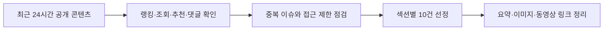

# 260711 최근 24시간 뉴스 브리핑

기준 시각: 2026-07-11 17:08 KST
수집 범위: 2026-07-10 08:00부터 2026-07-11 17:08 KST까지 공개·갱신된 인기 콘텐츠
구성: 랭킹뉴스, 경제뉴스, 증권뉴스, 커뮤니티유머, IT뉴스 각 10건

네이버 뉴스 언론사별 많이 본 뉴스, 네이버 경제·IT 섹션, 네이버 금융 많이 본 뉴스, GeekNews 날짜별 아카이브, 디시인사이드 실시간 베스트, FM코리아 검색 색인, YouTube 공개 조회 신호를 함께 확인했다.
네이버와 네이버 금융은 개별 조회수 숫자를 공개하지 않아 확인 시점의 랭킹·섹션 노출 순위를 인기 근거로 삼았다.
FM코리아와 웃긴대학 일부 원문은 보안·접근 제한이 있어 검색 결과에 노출된 조회·추천·댓글 수치와 접근 가능한 디시 원문을 함께 사용했다.
커뮤니티 항목은 혐오성·신상 노출·선정성이 강한 소재는 제외하고, 공개 반응이 큰 생활 유머·스포츠 밈·캡처형 글 위주로 정리했다.

| 구분 | 건수 | 주요 확인 기준 |
|---|---:|---|
| 랭킹뉴스 | 10 | 네이버 언론사별 많이 본 뉴스와 기사 게시 시각 |
| 경제뉴스 | 10 | 네이버 경제 섹션 노출과 주요 경제 이슈 |
| 증권뉴스 | 10 | 네이버 금융 많이 본 뉴스 순위 |
| 커뮤니티유머 | 10 | 디시 실시간 베스트, FM코리아 검색 색인 조회·추천 |
| IT뉴스 | 10 | GeekNews 점수·댓글, 네이버 IT 섹션, YouTube 조회·좋아요 |



## 랭킹뉴스 10개

### 장윤기 사건 논란과 추미애의 검찰개혁 발언

한국경제TV의 네이버 언론사별 많이 본 뉴스 1위로 확인된 정치·수사 이슈다.
추미애 지사는 장윤기 사건 관련 경찰 수사 논란을 검찰개혁 지연의 핑계로 삼아서는 안 된다고 말했다.
기사의 핵심은 경찰 유착 의혹과 수사·기소 분리 원칙을 별개 사안으로 봐야 한다는 주장이다.
장윤기 사건이 수사기관 신뢰 문제와 검찰개혁 논쟁을 동시에 자극하며 랭킹 상단에 올랐다.
원문은 [한국경제TV](https://n.news.naver.com/article/215/0001258381?ntype=RANKING)에서 확인했다.


### 도요타가 50년 근무 캘린더를 손보는 이유

한국경제TV 랭킹 2위권에서 확인된 해외 기업·노동 뉴스다.
도요타가 공휴일 대신 장기 연휴를 몰아 쉬는 기존 근무 캘린더 개편을 검토한다는 내용이다.
맞벌이와 육아 세대가 늘면서 가족 일정과 맞지 않는 근무 체계가 인재 확보의 부담으로 떠올랐다.
세계 1위 자동차 기업도 제조업 생산성만큼 직원 생활 리듬을 고려해야 하는 국면에 들어섰다.
원문은 [한국경제TV](https://n.news.naver.com/article/215/0001258359?ntype=RANKING)에서 확인했다.


### 미국의 호르무즈 개방 요구와 이란 핵시설 복구 정황

YTN 랭킹 상위권과 동영상 기사 표시가 함께 확인된 국제 뉴스다.
미국은 이란에 호르무즈 해협 상선 공격 중단과 해협 개방을 공개 성명으로 요구했다.
CNN 보도를 인용해 이란 핵시설 복구 정황도 함께 전해지며 중동 리스크가 다시 커졌다.
한국 독자에게는 유가, 환율, 물류비로 이어질 수 있는 지정학 뉴스라 관심이 높았다.
원문은 [YTN](https://n.news.naver.com/article/052/0002378055?ntype=RANKING)에서 확인했다.


### SK하이닉스 ADR의 역김치 프리미엄

뉴시스 언론사별 많이 본 뉴스 1위로 확인된 경제·증권 결합 이슈다.
SK하이닉스 ADR이 나스닥 첫 거래에서 국내 본주보다 약 16% 높은 가격에 거래됐다는 내용이다.
ADR과 본주 전환 제약, 해외 투자자 수요, 공급 비대칭성이 가격 차의 원인으로 거론됐다.
국내 투자자는 미국 가격이 월요일 국내 주가에 얼마나 반영될지에 민감하게 반응했다.
원문은 [뉴시스](https://n.news.naver.com/article/003/0014060518?ntype=RANKING)에서 확인했다.


### 흑백요리사 임성근 식당 가오픈 현장

뉴시스 랭킹 2위권에서 확인된 방송·생활문화 뉴스다.
전과 논란이 있었던 임성근 조리사의 파주 식당 가오픈 현장에 방문객이 몰렸다는 기사다.
방송 이미지, 가격, 논란 이후 실제 반응이 결합되며 단순 맛집 기사보다 큰 관심을 받았다.
대중은 유명인의 논란과 소비 행동이 실제 매장 흥행으로 이어지는지를 지켜보고 있다.
원문은 [뉴시스](https://n.news.naver.com/article/003/0014060459?ntype=RANKING)에서 확인했다.


### 미국 팹 건설에 발목 잡힌 TSMC와 한국 반도체

아시아경제 랭킹 1위권에서 확인된 반도체 산업 분석이다.
TSMC와 삼성전자, SK하이닉스가 미국 반도체 공장 확대 과정에서 인력 부족과 비용 부담을 겪는다는 내용이다.
미국 팹 건설은 대만보다 비용과 기간이 크게 늘 수 있어 보조금만으로 해결하기 어렵다.
반도체 공급망을 미국으로 옮기는 흐름은 기업 가치뿐 아니라 공사 인력과 운영비를 함께 흔든다.
원문은 [아시아경제](https://n.news.naver.com/article/277/0005788506?ntype=RANKING)에서 확인했다.


### 베트남 천재 여고생의 KAIST 선택

아시아경제 랭킹 2위권에 오른 교육·국제 뉴스다.
베트남 대입 전국 수석과 SAT 만점 기록을 가진 학생이 KAIST 진학을 택했다는 내용이다.
그는 한국의 산학협력, 치안, 베트남과의 협력 가능성을 유학 선택 이유로 들었다.
한국 대학의 국제 인재 유치 경쟁력과 과학기술 교육 브랜드가 함께 부각된 기사다.
원문은 [아시아경제](https://n.news.naver.com/article/277/0005788519?ntype=RANKING)에서 확인했다.


### 20대 수입차 시장에서 BYD가 뜬 이유

한국경제 언론사별 많이 본 뉴스 1위로 확인된 자동차·소비 뉴스다.
20대 수입차 등록 시장에서 BYD 전기차가 상위권에 진입하며 기존 독일 브랜드 선호가 흔들렸다는 분석이다.
전기차 선호, 가격 경쟁력, 중국 브랜드에 대한 거부감 완화가 함께 작용한 것으로 해석된다.
하차감보다 실속과 전동화 경험을 중시하는 젊은 소비자 흐름이 드러났다.
원문은 [한국경제](https://n.news.naver.com/article/015/0005308851?ntype=RANKING)에서 확인했다.


### 이재용의 억만장자 모임 포착과 삼성 파운드리 기회

한국경제 랭킹 2위권에서 확인된 반도체·재계 뉴스다.
삼성전자 파운드리가 TSMC의 생산 병목과 빅테크 공급망 분산 수요 속에서 기회를 얻을 수 있다는 분석이다.
TSMC AI 반도체 생산 라인이 장기간 예약된 상황이라 대체 생산 능력의 전략적 가치가 커졌다.
이재용 회장의 글로벌 네트워킹이 삼성 파운드리 수주 회복과 연결될 수 있을지 관심이 모였다.
원문은 [한국경제](https://n.news.naver.com/article/015/0005308856?ntype=RANKING)에서 확인했다.


### 경주월드 롤러코스터 급강하 직전 정지

KBS 언론사별 많이 본 뉴스 1위로 확인된 안전 이슈다.
경주월드 롤러코스터가 급강하 직전 멈췄고 탑승객들이 지상으로 대피했다는 내용이다.
업체는 선로 이물질로 인한 탈선 방지를 위해 안전장치가 작동한 것으로 보고 운행을 중단했다.
놀이기구 사고는 실제 인명 피해가 없어도 가족 단위 이용자의 불안과 시설 관리 문제를 크게 자극한다.
원문은 [KBS](https://n.news.naver.com/article/056/0012216232?ntype=RANKING)에서 확인했다.


## 경제뉴스 10개

### 이재용 포착과 TSMC 완판에 맞선 삼성 전략

네이버 랭킹 2026-07-11 기준 한국경제 1위로 확인된 반도체·재계 뉴스다.
TSMC 생산 병목과 점유율 집중이 빅테크의 공급망 다변화 수요를 키우고 있다는 내용이다.
기사에서는 삼성전자 파운드리가 첨단공정 대안으로 부상할 가능성을 짚었다.
이재용 회장의 글로벌 네트워킹이 삼성 파운드리 수주 회복과 연결될 수 있을지 관심이 모였다.
원문은 [한국경제](https://n.news.naver.com/article/015/0005308856)에서 확인했다.


### SK하이닉스 ADR 프리미엄과 월요일 본주 기대

네이버 랭킹 2026-07-11 기준 헤럴드경제 1위로 확인된 경제·증권 결합 기사다.
SK하이닉스 ADR이 미국 첫 거래에서 국내 본주 환산가보다 높게 거래된 점을 다뤘다.
다만 TSMC 사례처럼 ADR 프리미엄이 장기간 유지될 수 있어 국내 주가 반영은 단정하기 어렵다고 설명한다.
투자자는 미국 종가만 볼 것이 아니라 ADR과 본주 전환 조건, 유통 물량, 외국인 수급을 함께 봐야 한다.
원문은 [헤럴드경제](https://n.news.naver.com/article/016/0002668871)에서 확인했다.


### SK하이닉스 미국 상장에 주목한 외신

네이버 랭킹 2026-07-11 기준 디지털타임스 2위로 확인된 글로벌 반도체 뉴스다.
CNBC와 블룸버그 등 외신이 SK하이닉스 ADR 상장을 AI 메모리 산업 변화와 연결해 조명했다.
ADR은 공모가 대비 13.08% 상승 마감하며 한국 반도체 기업의 글로벌 투자자 접근성을 크게 키웠다.
경제적 의미는 단순 상장 이벤트보다 AI 데이터센터용 메모리 투자 사이클에 있다.
원문은 [디지털타임스](https://n.news.naver.com/article/029/0003036447)에서 확인했다.


### SK하이닉스 역김치 프리미엄

네이버 랭킹 2026-07-11 기준 뉴시스 2위로 확인된 시장 구조 이슈다.
SK하이닉스 ADR이 본주 대비 프리미엄을 형성한 배경으로 상호전환 제약과 시장 수급을 설명한다.
UBS의 ADR 매수와 본주 공매도 전략 언급처럼 가격 차를 활용하려는 거래 아이디어도 소개됐다.
같은 회사의 주식이라도 거래 시장과 전환 조건이 다르면 가격이 다르게 움직일 수 있다는 사례다.
원문은 [뉴시스](https://n.news.naver.com/article/003/0014060518)에서 확인했다.


### 마이크론 투자와 미국의 삼성·SK 압박

네이버 랭킹 2026-07-11 기준 디지털타임스 3위로 확인된 미국 반도체 투자 뉴스다.
마이크론의 2035년까지 미국 내 2500억달러 투자 계획과 미 상무장관의 삼성전자·SK하이닉스 투자 촉구 발언을 다뤘다.
AI 메모리 수요 확대는 기업에 기회지만, 미국 내 생산 확대 압박은 비용과 전략 선택의 부담으로 작용한다.
한국 반도체 기업은 보조금과 시장 접근성을 얻는 대신 현지 투자 규모를 계속 요구받을 가능성이 크다.
원문은 [디지털타임스](https://n.news.naver.com/article/029/0003036340)에서 확인했다.


### 주담대 3억 한도와 신혼집 실수요자 불안

네이버 랭킹 2026-07-11 기준 뉴시스 4위로 확인된 부동산·금융 뉴스다.
KB국민은행의 주택담보대출 한도 축소가 실수요자의 자금 계획에 미치는 영향을 다뤘다.
잔금 일정이 정해진 매수자에게 대출 한도 축소는 금리 인상보다 즉각적인 충격이 될 수 있다.
은행권 대출 축소 기조가 중저가 아파트 매수세 둔화로 이어질 수 있다는 전망도 제시됐다.
원문은 [뉴시스](https://n.news.naver.com/article/003/0014060431)에서 확인했다.


### 다주택자 자산 구조와 50대 대기업 직장인 사례

네이버 랭킹 2026-07-11 기준 파이낸셜뉴스 2위로 확인된 부동산 자산 기사다.
다주택자 소유 주택의 지역과 유형 특성을 주택산업연구원 자료로 분석했다.
기사에서는 다주택자 비중 감소와 지방·비아파트 보유 비중이 핵심 포인트로 제시됐다.
부동산 규제와 대출 환경이 바뀌면 보유 주택 수보다 자산의 위치와 유동성이 더 중요해진다.
원문은 [파이낸셜뉴스](https://n.news.naver.com/article/014/0005546765)에서 확인했다.


### 10억 들고 가도 방이 없는 전세 시장

네이버 랭킹 2026-07-11 기준 파이낸셜뉴스 4위로 확인된 전세 시장 뉴스다.
한국부동산원 통계 기준으로 광명, 성북, 동탄 등 전세가 상승률 상위 지역이 8%대에 진입했다고 전했다.
매매와 전세가 동반 상승하는 가운데 전세 상승 폭이 커지면 실수요자의 주거 이동 난도가 높아진다.
제목의 10억은 시장 체감 난도를 극적으로 보여주는 장치로 쓰였다.
원문은 [파이낸셜뉴스](https://n.news.naver.com/article/014/0005546738)에서 확인했다.


### 주식 올인 23살 청년의 수익률 170%

네이버 랭킹 2026-07-11 기준 한국경제 3위로 확인된 개인 투자자 인터뷰다.
한경·타임폴리오 투자대회 수상자의 투자 원칙과 성장주 투자 방식을 소개했다.
단기 수익보다 투자 원칙과 산업 사이클 판단을 강조한 내용이지만, 성공담은 재현 가능성을 보장하지 않는다.
강세장 인터뷰는 동기부여가 되지만 집중 투자, 운, 손실 가능성도 같이 읽어야 한다.
원문은 [한국경제](https://n.news.naver.com/article/015/0005308837)에서 확인했다.


### AI 투자 열풍에 지친 자금의 인도 증시 피난

네이버 랭킹 2026-07-10 기준 서울경제 4위로 확인된 해외 투자 뉴스다.
AI 관련주 변동성 부담이 커지며 인도 증시가 상대적 안정 투자처로 부각되고 있다는 내용이다.
기사에서는 코스피 등 AI 비중이 높은 시장과 비교해 니프티50의 변동성이 낮았다는 점을 근거로 제시했다.
투자자는 피난처라는 표현보다 환율, 밸류에이션, 인도 내수 성장 지속성을 함께 확인해야 한다.
원문은 [서울경제](https://n.news.naver.com/article/011/0004640178)에서 확인했다.


## 증권뉴스 10개

### 삼성 파운드리와 TSMC 병목을 보는 증권가

네이버 금융 많이 본 뉴스 1위로 확인된 반도체 투자 뉴스다.
삼성전자 파운드리가 TSMC의 AI 반도체 생산 병목 속에서 대안으로 부각될 수 있다는 분석이다.
유안타증권은 빅테크 공급망 분산 수요와 TSMC 예약 포화를 삼성전자의 기회로 해석했다.
투자자는 수주 기대감뿐 아니라 수율, 고객사 검증, 실제 매출 반영 시점을 함께 봐야 한다.
원문은 [한국경제](https://n.news.naver.com/mnews/article/015/0005308856)에서 확인했다.

### 주식 올인 23살 청년의 수익률 170%

네이버 금융 많이 본 뉴스 2위로 확인된 개인 투자자 인터뷰다.
한경·타임폴리오 KIW 주식투자대회 수상자가 단기 매매에서 성장주 투자로 전환한 과정을 소개했다.
신문, 리포트, 투자 강연을 반복 학습했다는 루틴은 흥미롭지만 성공담은 재현 가능성을 보장하지 않는다.
강세장 성공 사례는 동기부여가 되지만 집중 투자와 손실 위험도 함께 읽어야 한다.
원문은 [한국경제](https://n.news.naver.com/mnews/article/015/0005308837)에서 확인했다.


### SK하이닉스 ADR의 16% 역김치 프리미엄

네이버 금융 많이 본 뉴스 3위로 확인된 시장 구조 이슈다.
SK하이닉스 ADR이 공모가 대비 13% 넘게 올랐고 국내 본주보다 높은 가격에 거래됐다는 내용이다.
ADR과 본주 전환이 자유롭지 않으면 동일 기업 주식도 시장별 수급 차이로 가격 괴리가 생길 수 있다.
국내 투자자는 미국 종가를 그대로 국내 주가에 대입하기보다 전환 조건과 차익거래 가능성을 확인해야 한다.
원문은 [뉴시스](https://n.news.naver.com/mnews/article/003/0014060518)에서 확인했다.

### 내년 메모리 공급이 가장 어려울 것이라는 SK 전망

네이버 금융 많이 본 뉴스 4위로 확인된 반도체 공급 뉴스다.
최태원 SK그룹 회장이 미국 내 추가 메모리 생산시설 투자 가능성과 내년 공급 제약을 언급했다.
AI 데이터센터 수요가 빠르게 늘면 고성능 메모리 공급은 가격과 설비투자 모두를 끌어올릴 수 있다.
투자자에게는 호황 기대와 함께 대규모 투자 부담, 미국 현지 생산 압박이 동시에 변수다.
원문은 [서울경제](https://n.news.naver.com/mnews/article/011/0004640543)에서 확인했다.


### SK하이닉스 주주들의 월요일 기대와 TSMC PER 비교

네이버 금융 많이 본 뉴스 6위로 확인된 밸류에이션 기사다.
SK하이닉스 ADR 첫날 종가가 국내 환산가격보다 높아 국내 주가 상승 기대가 커졌다는 내용이다.
기사에서는 TSMC ADR 사례를 들어 미국 가격이 국내 본주에 그대로 반영된다고 단정하기 어렵다고 설명했다.
메모리와 파운드리는 사업 안정성이 달라 단순 PER 비교보다 이익 사이클과 고객 구조가 중요하다.
원문은 [헤럴드경제](https://n.news.naver.com/mnews/article/016/0002668871)에서 확인했다.

### 나스닥이 본 SK하이닉스 블록버스터 상장

네이버 금융 많이 본 뉴스 7위로 확인된 미국 상장 후속 기사다.
나스닥 사장은 SK하이닉스 ADR 상장을 블록버스터 사례로 평가하며 해외 기업의 미국 증시 관심을 언급했다.
삼성전자 미국 상장 가능성 질문에는 공개 전 거래에 대해 말하지 않는다는 취지로 답변을 피했다.
한국 대형주의 미국 시장 접근은 투자자 저변 확대와 국내 시장 유동성 분산을 동시에 낳을 수 있다.
원문은 [한국경제TV](https://n.news.naver.com/mnews/article/215/0001258369)에서 확인했다.

### 개인 투자자 대기자금 100조 위태

네이버 금융 많이 본 뉴스 8위로 확인된 수급 뉴스다.
코스피 변동성 확대 이후 투자자 예탁금이 5개월 만에 최저 수준으로 줄었다는 내용이다.
개인이 외국인 매물 일부를 받아냈지만 이후 순매도 전환과 자금 인출 가능성이 함께 거론됐다.
대기자금 축소는 반등장에서 매수 여력을 약하게 만들 수 있어 시장 체력 판단에 중요하다.
원문은 [파이낸셜뉴스](https://n.news.naver.com/mnews/article/014/0005546766)에서 확인했다.

### 코스닥 자금 이탈과 레버리지 손실

네이버 금융 많이 본 뉴스 9위로 확인된 개인 투자 위험 기사다.
코스닥 신용융자 잔고가 줄어드는 동안 삼성전자·SK하이닉스 단일종목 레버리지 ETF 거래가 늘었다.
중소형주에서 빠진 단기 자금이 대형 반도체 레버리지로 이동했지만 두 자릿수 손실 위험이 커졌다는 분석이다.
레버리지 상품은 방향뿐 아니라 보유 기간과 일별 변동성까지 맞아야 해 초보 투자자에게 특히 까다롭다.
원문은 [파이낸셜뉴스](https://n.news.naver.com/mnews/article/014/0005546747)에서 확인했다.

### 삼성전자 목표주가가 극과 극인 이유

네이버 금융 많이 본 뉴스 10위로 확인된 증권가 분석이다.
삼성전자 영업이익 전망은 비슷하지만 증권사별 목표주가가 크게 벌어진 배경을 다뤘다.
AI 메모리 수요 지속성, HBM 경쟁력, 중국 메모리 추격 여부를 어떻게 보느냐가 목표가 차이를 만들었다.
투자자는 목표주가 숫자보다 그 숫자를 만드는 가정과 리스크 민감도를 읽어야 한다.
원문은 [이코노미스트](https://n.news.naver.com/mnews/article/243/0000100284)에서 확인했다.

### 중국 반도체 ETF의 한 달 수익률 싹쓸이

네이버 금융 많이 본 뉴스 11위에서 확인된 ETF 뉴스다.
최근 한 달 국내 ETF 수익률 상위권을 중국 반도체 관련 ETF가 차지했다는 내용이다.
미국의 대중국 반도체 규제가 장기화될수록 중국 기술 자립 기대가 관련 밸류체인 투자 심리를 자극한다.
다만 테마 ETF는 정치·규제·환율·유동성 리스크가 겹치므로 단기 수익률만 보고 접근하기 어렵다.
원문은 [한국경제](https://n.news.naver.com/mnews/article/015/0005308848)에서 확인했다.

## 커뮤니티유머 10개

### 유인나 개무시하는 이동욱

FM코리아 검색 색인에서 조회 약 29만 회, 추천 약 809개, 댓글 약 216개로 확인된 포텐 글이다.
배우 관련 짧은 움짤성 유머로 보이며, 제목만으로 상황 반전과 리액션을 기대하게 만드는 형식이다.
원문은 보안 시스템 때문에 직접 본문과 미디어를 확인하지 못해 내용은 검색 색인 기반 추정으로 남긴다.
연예인 짤 유머는 설명이 짧고 공유성이 높아 커뮤니티에서 빠르게 확산되는 편이다.
원문은 [FM코리아](https://www.fmkorea.com/best/10069411044)에서 확인을 시도했다.

### 어미 '-노'를 즐겨 사용하는 유명인 밈

FM코리아 검색 색인에서 조회 약 31만 회, 추천 약 796개, 댓글 약 440개로 확인된 글이다.
특정 유명인의 말투를 인터넷 밈으로 소비한 게시물로 보이며, 언어 표현 논쟁이 댓글 반응을 키운 것으로 보인다.
원문은 보안 제한으로 열람하지 못했으므로 제목과 인기 수치 외 세부 내용은 추정이다.
민감한 정치·지역 해석은 제외하고, 커뮤니티 말투 밈이 크게 확산된 사례로만 정리했다.
원문은 [FM코리아](https://m.fmkorea.com/best/10068527730/10068540537)에서 확인을 시도했다.

### 프랑스 축구계의 아시아 축구 평가 논쟁

디시인사이드 실시간 베스트에서 조회 약 2.3만 회, 추천 673개, 댓글 650개로 확인된 축구 글이다.
프랑스 축구계가 아시아 축구의 전술보다 선수 개인 역량을 문제로 봤다는 캡처를 소개했다.
댓글 수가 매우 많아 축구 팬덤의 자존심, 전술론, 선수 육성 논쟁이 붙은 것으로 보인다.
스포츠 커뮤니티에서는 국가·대륙 비교 발언이 짧은 시간에 큰 논쟁을 만들기 쉽다.
원문은 [디시인사이드](https://gall.dcinside.com/board/view/?id=dcbest&no=444653&t=cv)에서 확인했다.

### 김재윤 병살 장면 GIF

디시인사이드 실시간 베스트에서 조회 약 1.6만 회, 추천 555개, 댓글 82개로 확인된 야구 글이다.
야구 경기의 병살 상황을 프레임 단위로 해석하며 놀리는 짧은 움짤형 게시물이다.
조회수 대비 추천 효율이 높아 특정 장면에 대한 팬덤 반응이 강하게 붙은 항목이다.
스포츠 움짤은 경기 맥락을 아는 사람에게 즉시 웃음과 탄식을 동시에 주는 형식이다.
원문은 [디시인사이드](https://gall.dcinside.com/board/view/?_dcbest=1&id=dcbest&no=444438&page=2)에서 확인했다.

### 한국 난임병원에만 있다는 기묘한 문화

디시인사이드 실시간 베스트에서 조회 약 3.8만 회, 추천 486개, 댓글 535개로 확인된 생활 논쟁 글이다.
난임병원 방문 에티켓과 병원 내 특정 문화에 대한 캡처가 중심인 게시물이다.
추천과 댓글이 모두 높아 단순 유머보다 경험담, 불편함, 세대·성별 관점이 섞인 반응이 컸다.
민감한 의료·가족 문제이므로 게시물 자체는 커뮤니티 반응으로만 보고 실제 판단은 조심해야 한다.
원문은 [디시인사이드](https://gall.dcinside.com/board/view/?_dcbest=1&id=dcbest&no=444528&page=2)에서 확인했다.

### 이강인 오피셜이 늦어지는 이유

FM코리아 검색 색인에서 조회 약 30만 회, 추천 약 458개, 댓글 약 197개로 확인된 축구 유머 글이다.
이적 오피셜 지연을 팬덤식 농담과 추정으로 풀어낸 게시물로 보인다.
원문은 보안 제한으로 직접 확인하지 못했으나 조회 규모가 커 축구 커뮤니티 화제 후보로 넣었다.
이적 시장 시기에는 확정 전 루머와 농담이 실제 뉴스만큼 빠르게 소비된다.
원문은 [FM코리아](https://www.fmkorea.com/best/10068928345)에서 확인을 시도했다.

### 첼시 콜 파머 프리미엄 얼음 사업 밈

FM코리아 검색 색인에서 조회 약 30만 회, 추천 약 386개, 댓글 약 375개로 확인된 축구 밈 글이다.
콜 파머의 별명과 이미지, 프리미엄 얼음이라는 농담을 결합한 움짤성 유머로 보인다.
원문 미디어는 보안 제한 때문에 확인하지 못했으므로 구체 장면은 추정으로 남긴다.
팬덤 밈은 선수 별명과 최근 경기 맥락이 결합될 때 조회수가 빠르게 올라간다.
원문은 [FM코리아](https://www.fmkorea.com/best/10068629438)에서 확인을 시도했다.

### 회사 남직원이 거슬린다는 X 캡처

디시인사이드 실시간 베스트에서 조회 약 3만 회, 추천 356개, 댓글 361개로 확인된 캡처형 글이다.
X 게시글을 바탕으로 직장 내 사소한 갈등과 말투를 커뮤니티식으로 재구성한 게시물이다.
짧은 멘트와 반응 캡처 중심이라 빠르게 읽히고 댓글에서 각자 경험담이 붙기 쉬운 형식이다.
직장 생활 유머는 실제 불편함과 과장된 표현이 섞일 때 반응이 커진다.
원문은 [디시인사이드](https://gall.dcinside.com/board/view/?_dcbest=1&id=dcbest&no=444466&page=2)에서 확인했다.

### 미쳐버린 크리스티아누 호날두 밈

디시인사이드 실시간 베스트에서 조회 약 1만 회, 추천 356개, 댓글 305개로 확인된 축구 밈이다.
호날두의 SNS나 월드컵 관련 반응을 조롱하는 이미지 게시물로 보인다.
게시 후 시간이 짧은데도 추천과 댓글이 빠르게 붙어 실시간 반응성이 강했다.
호날두처럼 글로벌 팬덤이 큰 선수는 작은 행동도 국내 축구 커뮤니티에서 빠르게 밈화된다.
원문은 [디시인사이드](https://gall.dcinside.com/board/view/?_dcbest=1&id=dcbest&no=444697&page=1)에서 확인했다.

### 아이돌 발언 논란 캡처

디시인사이드 실시간 베스트에서 조회 약 3.3만 회, 추천 351개, 댓글 721개로 확인된 논란성 글이다.
아이돌 발언 캡처를 두고 특정 인터넷 성향 논란이 붙은 게시물이다.
댓글 수가 매우 높아 사실 확인보다 해석과 반박이 강하게 충돌한 항목으로 보인다.
낙인성 이슈라 본문 판단은 배제하고, 커뮤니티 반응이 컸다는 사실만 기록한다.
원문은 [디시인사이드](https://gall.dcinside.com/board/view/?_dcbest=1&id=dcbest&no=444520&page=2)에서 확인했다.

## IT뉴스 10개

### 대한민국 제도 100개를 한 장씩 체계도로 만든 프로젝트

GeekNews에서 27점과 댓글 11개로 확인된 오늘의 주요 기술·시각화 프로젝트다.
작성자는 AI를 활용해 한국의 제도 100개를 한 장씩 체계도로 정리했다고 소개했다.
AI 리터러시를 모델 사용법이 아니라 행정·법령 같은 전문 영역 이해로 확장한다는 점이 흥미롭다.
시민이 복잡한 제도를 더 쉽게 읽는 도구로 AI를 쓰는 방향이라 생산성 도구 이상의 의미가 있다.
원문은 [GeekNews](https://news.hada.io/topic?id=31313)에서 확인했다.


### Lisp로 가는 길

GeekNews에서 6점과 댓글 2개로 확인된 프로그래밍 언어 글이다.
Lisp의 핵심을 괄호 문법이 아니라 매크로, REPL, 코드와 데이터의 동형성으로 설명한다.
언어를 문제에 맞게 확장하는 사고방식이 Lisp의 장점이라는 내용이 개발자 관심을 모았다.
AI 코드 생성 시대에도 언어 설계와 추상화 사고를 배우는 의미가 남아 있다는 점에서 읽을 만하다.
원문은 [GeekNews](https://news.hada.io/topic?id=31310)에서 확인했다.


### 게임업계와 첫 소통에 나선 콘진원장

네이버 IT·과학 섹션 상단 노출로 확인된 게임산업 정책 기사다.
김윤지 한국콘텐츠진흥원장이 게임업계 간담회를 열고 중소 게임사의 요구와 지원체계를 점검했다.
게임산업은 AI, 글로벌 퍼블리싱, 플랫폼 수수료, 규제 이슈가 겹쳐 정책 지원 방식이 중요해졌다.
콘텐츠 산업 뉴스지만 게임 개발 생태계와 연결되어 IT뉴스 후보로 선정했다.
원문은 [뉴시스](https://n.news.naver.com/mnews/article/003/0014058859)에서 확인했다.


### 크래프톤의 ICML 논문 10편 채택

네이버 IT·과학 섹션 상단에서 확인된 AI 연구 뉴스다.
크래프톤의 AI 연구 논문 10편이 세계 주요 AI 학회 ICML 메인 트랙에 채택됐다는 내용이다.
게임사가 월드모델, 멀티모달 LLM, 추론 같은 파운데이션 모델 연구에서 존재감을 보였다는 점이 핵심이다.
게임 개발사는 이제 콘텐츠 제작사이면서 동시에 AI 연구 조직으로 평가받는 국면에 들어섰다.
원문은 [파이낸셜뉴스](https://n.news.naver.com/mnews/article/014/0005546622)에서 확인했다.


### AI 비용 부담과 오픈소스 모델 이동

네이버 IT·과학 섹션에서 확인된 AI 운영비 뉴스다.
아마존 CTO가 AI 비용 부담이 커지면서 기업들이 저렴한 오픈소스 모델로 이동하고 있다고 말했다.
초기 AI 도입은 최고 성능 모델 중심이었지만, 실제 운영 단계에서는 비용과 지연시간이 더 큰 변수로 떠오른다.
기업은 폐쇄형 대형 모델과 오픈소스 모델을 업무별로 나눠 쓰는 하이브리드 전략을 검토하게 된다.
원문은 [이데일리](https://n.news.naver.com/mnews/article/018/0006327751)에서 확인했다.


### 서울 ICML과 빅테크 AI 인재 쟁탈전

네이버 IT·과학 섹션에서 확인된 AI 인재 시장 뉴스다.
서울에서 열린 ICML을 계기로 오픈AI, 아마존, 미스트랄AI, 알리바바 등 빅테크가 AI 인재 확보에 나섰다.
AI가 일자리를 줄인다는 담론과 별개로 핵심 연구자와 엔지니어 수요는 더 치열해졌다.
한국에서 열린 글로벌 학회가 연구 발표뿐 아니라 채용 경쟁의 장이 됐다는 점이 눈에 띈다.
원문은 [매일경제](https://n.news.naver.com/mnews/article/009/0005705996)에서 확인했다.


### SK하이닉스가 나스닥 첫날 마이크론 시총을 넘은 장면

네이버 IT·과학 섹션에서 확인된 반도체 뉴스다.
SK하이닉스 ADR이 나스닥 상장 첫날 강세를 보이며 마이크론 시가총액을 넘어섰다는 내용이다.
HBM과 AI 반도체 수요 기대가 메모리 기업의 글로벌 평가 기준을 바꾸고 있다.
반도체 뉴스지만 AI 인프라와 데이터센터 공급망의 핵심이라 IT 섹션에서도 크게 다뤄졌다.
원문은 [지디넷코리아](https://n.news.naver.com/mnews/article/092/0002430142)에서 확인했다.


### SK하이닉스 첫날 13% 상승을 다룬 MBC 영상

YouTube에서 조회 약 8.6만 회, 좋아요 756개, 댓글 225개로 확인된 반도체 뉴스 영상이다.
영상은 SK하이닉스의 나스닥 첫날 상승과 HBM 수요의 기하급수적 증가 전망을 다뤘다.
텍스트 기사보다 현장감과 숫자를 빠르게 전달해 주말 오전 조회가 크게 붙은 것으로 보인다.
AI 메모리 기대가 일반 뉴스 시청자에게도 강한 투자·산업 이슈로 소비됐다.
영상은 [MBCNEWS YouTube](https://www.youtube.com/watch?v=E1jPyhxNXdE)에서 확인했다.


### 맨해튼 태극기와 나스닥 종소리 영상

YouTube에서 조회 약 5.3만 회, 좋아요 956개, 댓글 139개로 확인된 현장 뉴스 영상이다.
SK하이닉스의 나스닥 데뷔 장면과 맨해튼 상공에 태극기가 걸린 상징적 장면을 묶었다.
상장 실적보다 한국 기업의 글로벌 자본시장 진입이라는 장면성이 강해 공유 가치가 높았다.
현장 영상은 같은 이슈라도 기사 요약과 다른 감정적 반응을 만든다.
영상은 [MBCNEWS YouTube](https://www.youtube.com/watch?v=1APenhkY60w)에서 확인했다.


### 최태원에게 서울·뉴욕 주가 차이를 물은 KBS 영상

YouTube에서 조회 약 4.3만 회, 좋아요 687개, 댓글 186개로 확인된 경제·IT 영상이다.
KBS는 SK하이닉스 미국 상장 첫날 최태원 회장 인터뷰와 서울·뉴욕 가격 차이 질문을 다뤘다.
ADR 프리미엄이 단순 호재인지, 국내 주가와 어떻게 연결되는지가 투자자 관심의 중심이었다.
반도체 기술 뉴스가 자본시장 구조와 직접 결합된 대표적인 사례다.
영상은 [KBS News YouTube](https://www.youtube.com/watch?v=TtqEMbHtNhk)에서 확인했다.


## 관련 동영상

| 제목 | 채널 | 인기 신호 | 링크 |
|---|---|---|---|
| 첫날 13% 상승, HBM 수요 기하급수적 급증 | MBCNEWS | 조회 약 8.6만, 좋아요 756 | [YouTube](https://www.youtube.com/watch?v=E1jPyhxNXdE) |
| 맨해튼 상공에 태극기, 나스닥 종소리 울린 순간 | MBCNEWS | 조회 약 5.3만, 좋아요 956 | [YouTube](https://www.youtube.com/watch?v=1APenhkY60w) |
| 미 상장 첫날 최태원에게 서울·뉴욕 주가 차이 질문 | KBS News | 조회 약 4.3만, 좋아요 687 | [YouTube](https://www.youtube.com/watch?v=TtqEMbHtNhk) |
| SK하이닉스 ADR 공모 청약 7배 | KBS News | 최근 SK하이닉스 상장 전후 이슈 영상 | [YouTube](https://www.youtube.com/watch?v=V61kP8hPtZg) |
| SK하이닉스 나스닥 상장과 40조 조달 전망 | KBS News | 최근 반도체 경제 영상 | [YouTube](https://www.youtube.com/watch?v=VBzUS1Q-PIM) |

## 출처와 제한

| 출처 | 확인 내용 | 제한 |
|---|---|---|
| 네이버 뉴스 | 언론사별 많이 본 뉴스, 경제·IT 섹션, 기사 이미지 | 개별 조회수 숫자는 공개되지 않아 랭킹 순위를 사용 |
| 네이버 금융 | 많이 본 뉴스 순위와 증권 기사 URL | 추천·댓글 수치가 공개 HTML에서 확인되지 않음 |
| GeekNews | 날짜별 아카이브, 점수, 댓글 수 | 점수와 댓글은 확인 시점 이후 변동 가능 |
| 디시인사이드 | 실시간 베스트 글, 조회·추천·댓글 | 일부 첨부 이미지는 외부 표시가 차단될 수 있음 |
| FM코리아 | 검색 색인의 조회·추천·댓글 | 보안 시스템으로 원문 본문과 미디어 확인 제한 |
| 웃긴대학 | 접근 시도 | HTTP 403/robots 제한으로 이번 후보 확정에서 제외 |
| YouTube | 조회수·좋아요·댓글과 썸네일 | 수치는 확인 시점 이후 변동 가능 |

## 호환성 체크

수식 블록은 사용하지 않았다.
코드블록은 Mermaid 한 개와 사용자 프롬프트 기록에만 사용했다.
표는 GitHub Flavored Markdown 기본 표 문법으로 작성했다.
외부 이미지는 원문 이미지와 썸네일을 직접 링크했으며, 원문 사이트 정책에 따라 블로그에서 표시가 제한될 수 있다.

## 사용자 프롬프트

```text
Automation: 매일 0800 최근 24시간 뉴스 브리핑
Automation ID: 08-24

최근 24시간 내의 높은조회수, 추천많은 컨텐츠 수집
- 시간 : 매일 0800 마다 반복
- 뉴스기사, 블로그, 웹페이지, 커뮤니티사이트, 유투브 모두 검색
  - 관련 이미지 적극 포함 지향
  - 관련 동영상 적극 포함 지향
  - 각 조회작업은 최대한 많이 서브에이전트 활용
- 소스사이트
  - https://news.naver.com/
  - https://news.hada.io/
  - https://web.humoruniv.com/
  - https://www.dcinside.com/
  - https://www.fmkorea.com/
  - https://www.youtube.com/
- 각 글은 5~10줄 정도로 작성
  - 문장앞에 dot이나 번호를 붙이지는 말것
  - 자연스러운 문장으로 작성
- 내용
  - 랭킹뉴스 10개
  - 경제뉴스 10개
  - 증권뉴스 10개
  - 커뮤니티유머 10개
  - IT뉴스 10개
- hhd-md
- hhddoc 프로젝트 커밋 푸시
- hhd-blog
- 블로그 프로젝트 커밋 푸시
```
