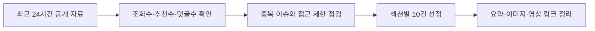

# 260711 최근 24시간 뉴스 브리핑

기준 시각: 2026-07-11 11:45 KST
수집 범위: 2026-07-10 08:00부터 2026-07-11 08:00 KST까지
구성: 랭킹뉴스, 경제뉴스, 증권뉴스, 커뮤니티유머, IT뉴스 각 10건

네이버 뉴스 랭킹과 경제·증권 섹션, GeekNews 날짜별 아카이브, 디시인사이드 실시간 베스트, FM코리아 검색 색인, YouTube 인기·검색 결과를 함께 확인했다.
네이버 랭킹은 2026-07-11 오전 집계 화면에서 최근 24시간 안에 게시된 항목을 우선 골랐고, 경제·증권은 2026-07-10 날짜 목록과 랭킹 반복 노출 이슈를 같이 반영했다.
GeekNews는 2026-07-10과 2026-07-11 아카이브의 점수와 댓글수를 기준으로 삼았다.
FM코리아와 웃긴대학 일부 페이지는 보안·접근 제한이 있어 검색 색인에 노출된 조회수·추천수와 접근 가능한 원문 링크를 함께 남겼다.
커뮤니티 항목은 혐오, 신상 노출, 선정성이 강한 소재를 제외하고 일반 유머·밈·화제성 게시물 위주로 정리했다.

| 구분 | 건수 | 확인 기준 |
|---|---:|---|
| 랭킹뉴스 | 10 | 네이버 언론사별 많이 본 뉴스, 최근 24시간 게시 |
| 경제뉴스 | 10 | 네이버 경제·산업·금융 섹션, 정책·기업·생활경제 |
| 증권뉴스 | 10 | 네이버 증권·랭킹, 시장·종목·가상자산 |
| 커뮤니티유머 | 10 | FM코리아 포텐, 디시 실시간 베스트, 조회·추천·댓글 |
| IT뉴스 | 10 | GeekNews 점수·댓글, 개발·AI·오픈소스 이슈 |



## 랭킹뉴스 10개

### 영국에서 항생제 내성 이질균 확산

서울신문 많이 본 뉴스 1위권에서 확인된 건강·해외 이슈다.
영국에서 성 접촉을 통해 전파되는 세균성 이질이 늘고, 항생제 내성까지 겹친다는 내용이 핵심이다.
단순 감염병 뉴스가 아니라 치료제 선택지가 줄어드는 공중보건 리스크로 읽힌다.
국내 독자에게는 해외 감염병 동향과 성병 예방, 항생제 내성 문제를 함께 환기시키는 기사다.
원문은 [서울신문](https://n.news.naver.com/article/081/0003660293?ntype=RANKING)에서 확인했다.


### 박나래 매니저 갑질 의혹 검찰 송치

JTBC 많이 본 뉴스 1위로 확인된 연예·사회 이슈다.
박나래 측은 의혹을 부인했지만 경찰은 일부 갑질 정황을 인정해 검찰에 넘겼다는 내용이다.
연예인 개인 논란을 넘어 매니저 노동환경과 연예계 고용 관행에 대한 관심으로 이어졌다.
커뮤니티에서도 사실관계와 사과·책임 범위를 두고 반응이 크게 갈렸다.
원문은 [JTBC](https://n.news.naver.com/article/437/0000500589?ntype=RANKING)에서 확인했다.


### 한국 청년의 주식 집착을 분석한 일본 보도

아시아경제 많이 본 뉴스 1위권에 오른 경제·사회 결합 기사다.
한국 청년층이 부동산 진입 장벽과 자산 격차 때문에 주식 투자에 몰린다는 일본 매체 분석을 소개했다.
기사의 관심 포인트는 주식 열풍 자체보다 청년층이 노동소득만으로 계층 이동을 기대하기 어려워졌다는 진단이다.
증권뉴스와 랭킹뉴스에 동시에 걸칠 만큼 투자 심리와 세대론이 강하게 결합된 이슈다.
원문은 [아시아경제](https://n.news.naver.com/article/277/0005788265?ntype=RANKING)에서 확인했다.


### 베트남 전국수석의 KAIST 선택

연합뉴스 많이 본 뉴스 1위로 확인된 교육·국제 이슈다.
베트남 대입 전국 수석 학생이 서울대 전액 장학금 대신 KAIST를 선택했다는 내용으로 큰 관심을 받았다.
한국을 안전하고 기회가 많은 나라로 본 점, 과학기술 분야 진로를 중시한 점이 기사 핵심이다.
한국 대학의 국제 인재 유치 경쟁력과 동남아 우수 인재 흐름을 같이 보여준다.
원문은 [연합뉴스](https://n.news.naver.com/article/001/0016188422?ntype=RANKING)에서 확인했다.


### 젤렌스키의 패트리엇 확보와 대러 공세

YTN 많이 본 뉴스 1위권에서 확인된 국제 안보 뉴스다.
우크라이나가 패트리엇 방공망을 확보하고 러시아를 상대로 공세를 강화한다는 흐름이 보도됐다.
미국 의회의 대러 제재 움직임과 맞물려 전쟁 장기화 국면의 압박 수단이 다시 주목받았다.
방공망 보강은 군사적 의미뿐 아니라 민간 시설 방어와 협상력에도 영향을 줄 수 있다.
원문은 [YTN](https://n.news.naver.com/article/052/0002377979?ntype=RANKING)에서 확인했다.


### 생닭 세척과 교차오염 위험

세계일보 많이 본 뉴스 1위권에서 확인된 생활 건강 기사다.
생닭을 씻는 과정에서 세균이 싱크대와 주변 조리도구로 퍼질 수 있다는 위생 경고가 핵심이다.
여름철 식중독 우려가 커지는 시기라 조리 습관을 바로 바꾸는 실용 정보로 소비됐다.
기사 자체는 생활정보지만 조회 랭킹 상위에 올라 식품 안전에 대한 관심을 보여준다.
원문은 [세계일보](https://n.news.naver.com/article/022/0004142180?ntype=RANKING)에서 확인했다.


### 이재명 대통령이 튀르키예 대통령에게 받은 권총 선물

한겨레 많이 본 뉴스 1위권에서 확인된 외교·정치 뉴스다.
이재명 대통령이 튀르키예 대통령에게 권총과 실탄을 선물받았다는 의전 내용이 보도됐다.
외교 선물 자체의 상징성과 국내 정치적 해석이 겹치며 랭킹에서 관심을 모았다.
기사의 실질 쟁점은 선물의 법적 처리와 외교 관례, 정상 간 상징물의 의미다.
원문은 [한겨레](https://n.news.naver.com/article/028/0002813652?ntype=RANKING)에서 확인했다.


### 코스트코 계산원의 높은 임금과 퇴직연금

한국경제 많이 본 뉴스 1위권에서 확인된 해외 기업·노동 이슈다.
미국 코스트코 계산원의 장기근속과 높은 시급, 퇴직연금 사례가 소개됐다.
단순 미담이 아니라 유통업 인력 유지, 임금 구조, 복지 설계가 기업 경쟁력과 연결된다는 메시지가 있다.
국내 유통업의 구조조정 뉴스와 대조되면서 독자 반응이 커졌다.
원문은 [한국경제](https://n.news.naver.com/article/015/0005308817?ntype=RANKING)에서 확인했다.


### 홈플러스 청산 위기 속 할인 대기줄

매일경제 많이 본 뉴스 1위권에서 확인된 유통·소비 뉴스다.
홈플러스 청산 가능성이 거론되는 가운데 일부 매장 할인 행사에 고객이 몰리며 긴 대기줄이 생겼다.
소비자는 할인 기회를 찾지만, 직원과 입점업체 입장에서는 고용·정산·운영 지속성이 더 큰 문제다.
대형 유통사의 구조조정이 생활 현장에서 어떻게 체감되는지를 보여주는 사례다.
원문은 [매일경제](https://n.news.naver.com/article/009/0005705916?ntype=RANKING)에서 확인했다.


### 서유럽 기록적 폭염과 초과 사망

서울경제 많이 본 뉴스 1위권에서 확인된 기후·국제 뉴스다.
서유럽의 폭염과 사망자 추정치가 보도되며 기후위기의 인명 피해가 다시 부각됐다.
거리에서 수영복 차림이 나올 정도의 더위라는 장면이 관심을 끌었지만, 핵심은 고령층과 취약계층 보호다.
한국도 폭염 대응과 전력 수요, 노동 안전 문제를 같이 봐야 하는 계절에 들어섰다.
원문은 [서울경제](https://n.news.naver.com/article/011/0004640431?ntype=RANKING)에서 확인했다.


## 경제뉴스 10개

### 직원이 사라진 홈플러스 매장 르포

헤럴드경제가 홈플러스 일부 매장에서 물품 보충과 화장실 청소 같은 기본 운영이 흔들리는 모습을 전했다.
청산 가능성과 인력 이탈이 맞물리면 할인 행사보다 매장 서비스 유지가 먼저 무너질 수 있다는 점이 보인다.
유통업 구조조정은 재무제표뿐 아니라 현장 노동, 소비자 불편, 협력사 회수 가능성으로 확산된다.
랭킹뉴스의 홈플러스 할인 대기줄 기사와 연결해서 보면 소비자 수요와 운영 능력이 반대로 움직이는 상황이다.
원문은 [헤럴드경제](https://n.news.naver.com/mnews/article/016/0002668830)에서 확인했다.


### SK하이닉스가 나스닥으로 간 이유

데일리안은 SK하이닉스의 나스닥 상장을 단순 상장 이벤트가 아니라 AI 자본시장 진입으로 해석했다.
AI 메모리 투자 경쟁이 커지면서 글로벌 투자자와 직접 연결되는 채널이 중요해졌다는 설명이다.
국내 반도체 기업이 미국 자본시장과 더 밀착하는 흐름은 향후 공장 투자와 공급망 협상에도 영향을 준다.
경제 섹션에서는 산업 전략, 증권 섹션에서는 자금 조달과 밸류에이션 이슈로 동시에 다뤄졌다.
원문은 [데일리안](https://n.news.naver.com/mnews/article/119/0003110306)에서 확인했다.


### 화물차 자율주행 고속도로 운행

KBS는 택배를 실은 자율주행 화물차가 고속도로를 달리는 실증 흐름을 보도했다.
승용차 자율주행보다 물류 자율주행은 운행 경로가 비교적 반복적이라 상용화 기대가 크다.
다만 사고 책임, 운전직 일자리, 야간 운행 안전성, 보험 제도는 계속 확인해야 할 부분이다.
물류비 절감과 배송 효율을 동시에 노리는 산업 뉴스로 경제적 파급력이 크다.
원문은 [KBS](https://n.news.naver.com/mnews/article/056/0012216109)에서 확인했다.


### 삼성전자 노조의 지역화폐 성과급 반발

문화일보는 삼성전자 노조가 성과급 일부를 지역화폐로 지급하는 방안에 반발했다고 전했다.
근로 대가를 어떤 형태로 지급할 수 있는지, 지역경제 활성화 정책이 민간 임금 체계에 들어올 수 있는지가 쟁점이다.
노조는 임직원 보상과 정책 목적을 분리해야 한다는 취지로 강하게 비판했다.
대기업 임금·복지 이슈가 정치권의 민생 정책과 충돌한 사례로 읽힌다.
원문은 [문화일보](https://n.news.naver.com/mnews/article/021/0002803924)에서 확인했다.


### iM뱅크의 모기지보험 가입 중단

헤럴드경제는 iM뱅크가 모기지보험 가입을 중단하며 대출 문턱이 더 높아졌다고 보도했다.
은행권 가계대출 관리가 수도권뿐 아니라 지방은행과 보증성 상품까지 넓어지는 흐름이다.
실수요자는 한도와 금리뿐 아니라 보험 가입 가능 여부까지 확인해야 하는 상황이 됐다.
부동산 거래 둔화와 금융권 리스크 관리가 동시에 진행되는 경제 뉴스다.
원문은 [헤럴드경제](https://n.news.naver.com/mnews/article/016/0002668815)에서 확인했다.


### 미국 디지털자산 법안과 한국 입법 과제

헤럴드경제는 미국의 지니어스법과 클래리티법을 짚으며 한국 디지털자산 규제 방향을 다뤘다.
가상자산을 투기 자산으로만 볼지, 결제·증권·스테이블코인 제도권으로 나눠 볼지가 핵심이다.
미국 입법 속도가 빨라질수록 국내 거래소와 핀테크, 은행권의 규제 불확실성도 커진다.
한국 입장에서는 투자자 보호와 산업 경쟁력 사이에서 구체적 기준을 정해야 하는 단계다.
원문은 [헤럴드경제](https://n.news.naver.com/mnews/article/016/0002668816)에서 확인했다.


### 바이비트 앱의 국내 구글플레이 미노출

뉴스1은 바이비트 앱이 국내 구글 플레이에서 사라졌다고 보도했다.
해외 거래소 차단이 실제 앱 유통 경로에서 진행되는지 시장이 민감하게 보는 사안이다.
국내 이용자 보호와 미신고 영업 제한이라는 정책 목적이 있지만, 기존 이용자의 자산 이전과 접근성 문제도 남는다.
디지털자산 규제 뉴스와 함께 보면 거래소 시장 재편 신호로 볼 수 있다.
원문은 [뉴스1](https://n.news.naver.com/mnews/article/421/0009053264)에서 확인했다.


### 중앙일보 워크아웃 개시

한국경제는 중앙일보의 워크아웃 개시를 보도했다.
언론사의 재무구조 개선 이슈는 광고시장 변화, 구독 기반 전환, 계열 지배구조와 연결된다.
채권단 동의와 자구계획 이행 여부가 향후 경영 정상화의 핵심이다.
미디어 산업도 제조업처럼 부채 조정과 사업 재편 압력을 받는다는 점에서 경제 뉴스로 의미가 있다.
원문은 [한국경제](https://n.news.naver.com/mnews/article/015/0005308769)에서 확인했다.


### 카카오뱅크의 몽골 M뱅크 투자

서울경제는 카카오뱅크가 몽골 M뱅크 투자와 AI 금융 협력을 본격화한다고 전했다.
국내 인터넷은행이 해외 디지털 금융 시장에서 성장 경로를 찾는 움직임이다.
몽골은 금융 인프라 고도화 수요가 있어 모바일 뱅킹과 신용평가 모델 적용 여지가 크다.
카카오뱅크 입장에서는 국내 대출 규제 의존도를 낮추고 플랫폼 역량을 수출하는 시험대가 된다.
원문은 [서울경제](https://n.news.naver.com/mnews/article/011/0004640421)에서 확인했다.


### 호남 재생에너지 계통제약과 배전망 ESS

부산일보는 호남 지역 재생에너지 계통제약을 배전망 ESS로 해소하려는 정책 방향을 다뤘다.
재생에너지 설비가 늘어도 송배전망이 받쳐주지 않으면 발전량을 제대로 쓰지 못한다.
ESS는 남는 전력을 저장해 계통 부담을 낮추는 현실적 대안이지만 비용과 안전성 검증이 중요하다.
데이터센터와 전력 수요가 늘어나는 흐름 속에서 전력망 투자는 핵심 경제 인프라 이슈다.
원문은 [부산일보](https://n.news.naver.com/mnews/article/082/0001389256)에서 확인했다.


## 증권뉴스 10개

### SK하이닉스 나스닥 입성과 미국 메모리 공장 검토

이데일리는 최태원 SK 회장이 SK하이닉스 나스닥 입성 현장에서 미국 메모리 공장 검토 가능성을 언급했다고 전했다.
AI 메모리 수요가 강한 상황에서 생산능력 확대와 현지 투자 조건이 핵심 변수로 떠올랐다.
나스닥 상장은 투자자 저변 확대와 자금 조달 측면에서 주가 재평가 기대를 만든다.
동시에 미국 투자 규모와 수익성, 보조금 조건은 향후 밸류에이션을 좌우할 수 있다.
원문은 [이데일리](https://n.news.naver.com/mnews/article/018/0006327458)에서 확인했다.


### HLB 간암 신약의 FDA 문턱 재좌절

서울경제는 HLB 간암 신약이 FDA 허가 문턱에서 다시 좌절됐다고 보도했다.
기사에서 언급된 핵심 사유는 중국 파트너사의 생산시설 문제로, 임상 효능 이슈와는 다른 리스크다.
바이오주는 허가 일정과 생산시설 검증이 주가에 직접 영향을 주기 때문에 변동성이 크다.
투자자는 신약 자체의 데이터뿐 아니라 CMC와 협력사 품질관리까지 함께 봐야 한다.
원문은 [서울경제](https://n.news.naver.com/mnews/article/011/0004640450)에서 확인했다.

### 호반의 한진칼 지분 추가 취득

서울경제는 호반이 한진칼 지분을 추가 취득해 조원태 회장 측과 지분 격차가 0.41%포인트까지 좁혀졌다고 보도했다.
한진칼은 항공 지배구조와 경영권 이슈가 주가에 큰 영향을 주는 대표 종목이다.
지분 경쟁 가능성이 부각되면 단기 주가에는 재료가 될 수 있지만, 실제 경영권 변화 여부는 별개다.
장기 투자자는 지분율 변화와 주주 간 합의 가능성을 같이 봐야 한다.
원문은 [서울경제](https://n.news.naver.com/mnews/article/011/0004640451)에서 확인했다.


### 코스피 장기 상승론과 반도체 버티기

뉴시스는 과거 코스피가 2200에서 9000까지 갈 줄 아무도 몰랐다는 식의 장기 상승론을 소개했다.
현재 시장에서는 삼성전자와 SK하이닉스를 버티는 전략이 언급될 만큼 반도체 대형주의 영향력이 크다.
강세장에서는 주도주 조정이 시장 전체 심리를 크게 흔드는 일이 반복된다.
다만 장기 낙관론은 금리, 환율, 실적 사이클과 함께 검증해야 한다.
원문은 [뉴시스](https://n.news.naver.com/mnews/article/003/0014060110)에서 확인했다.


### 금값 25% 이상 하락 경고

뉴시스는 금값이 25% 이상 하락할 수 있다는 분석을 전했다.
금은 안전자산이지만 금리, 달러, 실질수익률, 투자자 포지션 변화에 민감하다.
신규 투자자에게는 이미 오른 자산을 추격 매수하는 위험을 다시 생각하게 만드는 기사다.
주식 변동성이 커질 때 금으로 분산하려는 수요가 많지만, 분산 자산도 가격 리스크는 피할 수 없다.
원문은 [뉴시스](https://n.news.naver.com/mnews/article/003/0014060117)에서 확인했다.


### 비트코인 상승과 반도체 자금 유입 논리

뉴시스는 스트래티지 매도에도 비트코인이 오를 수 있다는 분석과 그 배경으로 반도체 관련 자금 흐름을 소개했다.
가상자산 시장은 ETF, 기관 자금, 기술주 위험선호와 동시에 움직이는 경우가 많다.
반도체 강세가 위험자산 선호를 자극하면 비트코인에도 간접적으로 수급이 붙을 수 있다는 논리다.
다만 가상자산은 단일 기업 매도보다 거시 유동성과 규제 뉴스에 더 크게 흔들릴 수 있다.
원문은 [뉴시스](https://n.news.naver.com/mnews/article/003/0014060125)에서 확인했다.


### 주도주 목표가 하향이 이어진 증권가

조선비즈 랭킹 기사에서는 삼성전자, SK하이닉스, 현대차 등 주도주의 목표가가 낮아지는 흐름을 다뤘다.
강세장에서도 애널리스트가 실적 눈높이를 낮추면 주가 상승 속도는 둔화될 수 있다.
특히 반도체와 자동차는 환율, 관세, 설비투자, 판매 믹스가 함께 영향을 준다.
투자자는 목표가 자체보다 하향의 이유와 실적 추정치 변화를 확인해야 한다.
원문은 [조선비즈](https://n.news.naver.com/article/366/0001178392?ntype=RANKING)에서 확인했다.


### 코스피·코스닥 동시 사이드카

조선비즈 랭킹 기사에서는 코스피와 코스닥에 사이드카가 동시에 발동될 만큼 변동성이 커졌다고 보도했다.
사이드카는 프로그램 매매 충격을 완화하기 위한 장치라 시장 과열과 급변을 동시에 보여준다.
투자자 입장에서는 방향성보다 변동성 관리가 우선되는 국면이다.
레버리지 상품이나 단일종목 ETF를 쓰는 투자자는 손익 변동폭이 예상보다 훨씬 커질 수 있다.
원문은 [조선비즈](https://n.news.naver.com/article/366/0001178250?ntype=RANKING)에서 확인했다.


### 키움증권의 삼성전자 목표가 하향

연합뉴스TV 랭킹 기사에서는 키움증권이 대세 상승장 이후 처음으로 삼성전자 목표가를 낮춘 보고서를 냈다고 전했다.
삼성전자는 시장 대표주라 목표가 조정 자체가 투자 심리에 크게 작용한다.
하향 보고서가 곧 장기 하락을 뜻하지는 않지만, 실적 회복 속도에 대한 눈높이는 낮아졌다는 신호다.
반도체 랠리에서 삼성전자와 SK하이닉스의 온도 차이가 더 뚜렷해지는 흐름이다.
원문은 [연합뉴스TV](https://n.news.naver.com/article/422/0000883147?ntype=RANKING)에서 확인했다.


### 뉴욕증시 상승과 SK하이닉스 나스닥 데뷔

뉴시스는 미국과 이란 긴장에도 뉴욕증시가 상승세로 출발했고 SK하이닉스가 나스닥에 입성했다고 보도했다.
지정학 리스크가 있어도 AI와 반도체 기대가 시장을 지탱하는 장면이다.
SK하이닉스 ADR 거래는 한국 반도체에 대한 해외 투자자 접근성을 높인다.
국내 투자자에게는 미국 시장에서의 가격 발견이 다음 거래일 국내 반도체주 흐름에 영향을 줄 수 있다.
원문은 [뉴시스](https://n.news.naver.com/mnews/article/003/0014060137)에서 확인했다.


## 커뮤니티유머 10개

### 비만을 부르는 습관

FM코리아 포텐권에서 조회 약 42만 회, 추천 약 590개, 댓글 약 588개로 확인된 생활 유머형 글이다.
제목은 건강 정보처럼 보이지만 커뮤니티에서는 생활습관 자조와 공감형 댓글이 붙으며 확산됐다.
식습관, 수면, 활동량처럼 누구나 찔리는 소재라 반응 장벽이 낮다.
직접 본문 이미지 URL은 접근 제한으로 확인하지 못했고, 원문 링크와 검색 색인 인기 신호를 기준으로 남겼다.
원문은 [FM코리아](https://m.fmkorea.com/best2/10066217151)에서 확인했다.

### 주말부터 이중열돔을 만나는 한반도

FM코리아 포텐권에서 조회 약 29만 회, 추천 약 563개, 댓글 약 604개로 확인된 날씨 밈성 글이다.
폭염 예보를 과장된 표현과 함께 공유하면서 날씨 공포와 유머가 같이 소비됐다.
폭염은 실제 생활 불편과 전력 수요로 이어지기 때문에 커뮤니티 반응도 빠르다.
본문 이미지 직접 URL은 확인하지 못했지만, 조회·댓글 규모가 커 커뮤니티유머 후보로 선정했다.
원문은 [FM코리아](https://m.fmkorea.com/best2/10067703488)에서 확인했다.

### 국제결혼의 단점

FM코리아 포텐권에서 조회 약 27만 회, 추천 약 540개, 댓글 약 316개로 확인된 이미지 유머 글이다.
국제결혼이라는 생활 소재를 짧은 이미지 캡처와 반전식 농담으로 소비한 것으로 보인다.
댓글 수가 많아 단순 웃음보다 경험담과 의견 교환이 붙은 게시물로 해석된다.
접근 제한 때문에 원문 이미지 파일은 확인하지 못했고, 제목과 인기 신호를 기준으로 정리했다.
원문은 [FM코리아](https://m.fmkorea.com/best2/10066367241)에서 확인했다.

### 어미 노를 쓰는 유명인 밈

FM코리아 포텐권에서 조회 약 25만 회, 추천 약 681개, 댓글 약 413개로 확인된 말투 밈 글이다.
특정 어미 사용이 지역 방언인지 인터넷 밈인지 논란이 되는 맥락을 유머로 다룬 게시물이다.
언어 표현은 정치적 해석과 지역성 논쟁으로 번지기 쉬워 댓글 반응도 크게 붙었다.
민감한 혐오 표현은 배제하고, 커뮤니티에서 말투 밈이 확산된 현상으로만 정리했다.
원문은 [FM코리아](https://m.fmkorea.com/best/10068527730)에서 확인했다.

### 첼시 콜 파머 프리미엄 얼음 사업 밈

FM코리아 포텐권에서 조회 약 21만 회, 추천 약 286개, 댓글 약 319개로 확인된 축구 밈 글이다.
축구 선수 콜 파머의 이미지와 농담을 결합해 스포츠 팬덤에서 빠르게 퍼진 것으로 보인다.
스포츠 커뮤니티의 유머는 짧은 짤과 선수 별명, 최근 경기 맥락이 결합될 때 반응이 크다.
움짤 게시물로 보이지만 직접 미디어 URL은 접근 제한 때문에 확인하지 못했다.
원문은 [FM코리아](https://www.fmkorea.com/best/10068629438)에서 확인했다.

### 옛날부터 노체를 써왔다는 기록들

FM코리아 포텐권에서 조회 약 14만 회, 추천 약 349개, 댓글 약 361개로 확인된 캡처형 밈 글이다.
말투 논쟁과 과거 기록을 결합해 현재 논란을 희화화하는 방식으로 소비됐다.
댓글이 추천수보다 많아 의견 충돌과 추가 사례 제보가 함께 붙었을 가능성이 높다.
민감한 정치 해석은 제외하고, 인터넷 언어 사용이 커뮤니티 소재가 된 점만 정리했다.
원문은 [FM코리아](https://www.fmkorea.com/best/10068608573)에서 확인했다.

### 개콘 역사상 기립박수를 받은 코너

디시인사이드 실시간 베스트에서 조회 약 2.2만 회, 추천 104개, 댓글 243개로 확인된 회상형 유머 글이다.
과거 개그콘서트의 유명 코너를 다시 꺼내며 세대 공감과 추억 반응을 이끌었다.
방송 클립이나 캡처가 붙는 유형은 댓글에서 각자 기억하는 장면을 덧붙이며 확산된다.
디시 원문에서는 첨부 이미지와 GIF가 있는 것으로 확인됐다.
원문은 [디시인사이드](https://gall.dcinside.com/board/view/?id=dcbest&no=444586)에서 확인했다.

### 중국인 입맛 맞추다 멘탈이 털린 셰프

디시인사이드 실시간 베스트에서 조회 약 1.9만 회, 추천 27개, 댓글 286개로 확인된 방송 캡처형 글이다.
정지선 셰프 관련 방송 장면을 커뮤니티식 반응으로 재구성한 게시물이다.
추천보다 댓글이 많은 편이라 음식 취향, 방송 연출, 국가별 입맛 차이를 두고 대화가 길어진 것으로 보인다.
본문에는 방송 캡처 이미지가 포함된 것으로 확인됐다.
원문은 [디시인사이드](https://gall.dcinside.com/board/view/?id=dcbest&no=444538)에서 확인했다.

### GPT 5.6 Sol의 포켓몬 파이어레드 클리어

디시인사이드 실시간 베스트에서 조회 약 1.2만 회, 추천 31개, 댓글 95개로 확인된 AI 밈 글이다.
AI 모델이 긴 시간 게임을 플레이해 클리어했다는 이야기가 기술 뉴스와 게임 커뮤니티 사이에서 소비됐다.
성능 자랑보다는 AI 에이전트가 게임 목표를 오래 유지할 수 있는지에 대한 흥미가 크다.
본문에는 X 링크와 이미지가 함께 확인됐다.
원문은 [디시인사이드](https://gall.dcinside.com/board/view/?id=dcbest&no=444562)에서 확인했다.

### 배 아파서 기절한 만화

디시인사이드 실시간 베스트에서 조회 약 7천 회, 추천 52개, 댓글 63개로 확인된 카툰형 유머 글이다.
짧은 일상 경험을 만화로 풀어 공감과 과장된 리액션을 유도한 게시물이다.
카툰형 게시물은 텍스트만 있는 글보다 이미지 공유성이 높아 커뮤니티 내 체류 시간이 길다.
원문에는 여러 장의 JPG 첨부가 있는 것으로 확인됐다.
원문은 [디시인사이드](https://gall.dcinside.com/board/view/?id=dcbest&no=444558)에서 확인했다.

## IT뉴스 10개

### 미첼 하시모토 인터뷰

GeekNews에서 16점과 댓글 5개로 확인된 개발자 인터뷰 글이다.
Vagrant, Terraform, Vault를 만든 미첼 하시모토가 Ghostty, Zig, 오픈소스 유지보수, 제품 품질 기준을 이야기한다.
개발자 도구는 기능만이 아니라 장기 유지보수와 사용 경험의 균형이 중요하다는 메시지가 강하다.
오픈소스 창업자와 도구 제작자에게 실무적인 관점이 많아 추천수가 높게 붙었다.
원문은 [GeekNews](https://news.hada.io/topic?id=31294)와 [인터뷰 원문](https://alexalejandre.com/programming/interview-with-mitchell-hashimoto/)에서 확인했다.


### LLM 번아웃이 온 것 같아요

GeekNews에서 15점과 댓글 4개로 확인된 AI 사용 경험 글이다.
Claude Code, Codex, ChatGPT, Gemini를 매일 쓰면서 AI 생성 텍스트를 읽는 시간이 늘어난 피로감을 다룬다.
AI 도구가 생산성을 올리는 동시에 읽기 부담과 판단 피로를 키운다는 점이 개발자들에게 공감을 얻었다.
자동화 자체보다 인간이 검토해야 할 정보량을 어떻게 줄일지가 핵심 질문으로 남는다.
원문은 [GeekNews](https://news.hada.io/topic?id=31286)와 [블로그 원문](https://www.alecscollon.com/blog/llm-burnout/)에서 확인했다.


### 로컬 TTS 모델 벤치마크 tts-bench

GeekNews에서 7점으로 확인된 오픈소스 도구 뉴스다.
로컬 TTS 모델 55종을 속도, 청취 품질, 객관 지표 관점에서 비교하는 벤치마크 프로젝트다.
음성 AI를 클라우드가 아니라 로컬에서 돌리려는 수요가 커지며 모델 비교 기준의 가치가 올라갔다.
실제 하드웨어별 성능을 비교할 수 있어 개인 개발자와 제품팀 모두에게 실용성이 있다.
원문은 [GeekNews](https://news.hada.io/topic?id=31283)와 [GitHub](https://github.com/5uck1ess/tts-bench)에서 확인했다.


### Bun의 Rust 재작성에 대한 Zig 창시자의 생각

GeekNews에서 6점과 댓글 3개로 확인된 개발 생태계 논쟁 글이다.
Zig 창시자 Andrew Kelley가 Bun의 Rust 재작성 이슈를 언어 성능 논쟁보다 재단과 회사 관계의 문제로 해석했다.
런타임과 툴체인의 언어 선택은 기술 판단뿐 아니라 커뮤니티 신뢰와 거버넌스 문제를 포함한다.
개발자 커뮤니티에서는 Zig, Rust, Bun을 둘러싼 장기 생태계 방향 논쟁으로 이어졌다.
원문은 [GeekNews](https://news.hada.io/topic?id=31282)와 [Andrew Kelley 글](https://andrewkelley.me/post/my-thoughts-bun-rust-rewrite.html)에서 확인했다.


### Microsoft의 AI 에이전트용 시각화 언어 Flint

GeekNews에서 5점과 댓글 1개로 확인된 AI 개발 도구 뉴스다.
Flint는 AI 에이전트가 사람이 편집 가능한 짧은 명세로 차트를 만들도록 돕는 시각화 중간 언어다.
LLM이 만든 차트를 사람이 검토하고 수정하려면 결과물보다 중간 표현이 중요해진다.
보고서 자동화, 데이터 분석 에이전트, 대시보드 생성에서 활용 가능성이 있다.
원문은 [GeekNews](https://news.hada.io/topic?id=31287)와 [Flint 공개 페이지](https://microsoft.github.io/flint-chart/#/)에서 확인했다.


### Lisp로 가는 길

GeekNews에서 4점과 댓글 2개로 확인된 프로그래밍 언어 글이다.
Lisp의 핵심을 괄호 문법이 아니라 언어를 문제에 맞게 확장하는 사고방식으로 설명한다.
REPL, 패키지, 심볼, 조건, 재시작 같은 개념을 배워야 Lisp의 장점이 보인다는 내용이다.
AI 코드 생성 시대에도 언어 설계와 사고방식 학습이 여전히 중요하다는 점에서 관심을 받았다.
원문은 [GeekNews](https://news.hada.io/topic?id=31310)와 [블로그 원문](https://scotto.me/blog/2026-07-09-why-lisp/)에서 확인했다.


### Linux 사용자의 Windows 11 한 달 사용기

GeekNews에서 3점과 댓글 8개로 확인된 운영체제 경험 글이다.
장기 Linux 사용자가 한 달간 Windows 11만으로 업무를 하며 설치, 드라이버, 절전, UI 일관성 문제를 기록했다.
점수보다 댓글이 많은 글이라 개인 경험을 둘러싼 반론과 공감이 활발했을 가능성이 높다.
개발 환경 선택은 성능보다 반복 사용에서 생기는 마찰이 더 크게 작용한다는 점을 보여준다.
원문은 [GeekNews](https://news.hada.io/topic?id=31278)와 [OSNews](https://www.osnews.com/story/145459/you-paid-me-a-long-time-linux-user-to-use-windows-11-exclusively-for-a-month-heres-how-it-went/)에서 확인했다.


### 느린 컴퓨터에서 GLM 5.2를 실행하는 colibri

GeekNews에서 2점과 댓글 1개로 확인된 로컬 LLM 프로젝트다.
GLM-5.2 744B MoE를 약 25GB RAM 소비자 머신에서 실행하려는 순수 C 엔진이라는 점이 눈에 띈다.
대형 모델을 전부 메모리에 올리지 않고 expert를 디스크에서 스트리밍하는 접근이 핵심이다.
속도와 실용성은 검증이 필요하지만, 로컬 추론의 한계를 밀어붙이는 실험으로 의미가 있다.
원문은 [GeekNews](https://news.hada.io/topic?id=31297)와 [GitHub](https://github.com/JustVugg/colibri)에서 확인했다.


### ChatGPT Work 소개

GeekNews에서 2점과 댓글 1개로 확인된 OpenAI 업무 에이전트 관련 글이다.
ChatGPT가 단순 질의응답을 넘어 앱, 파일, 브라우저를 오가며 업무 목표를 수행하는 방향을 소개한다.
업무 자동화의 핵심은 모델 성능뿐 아니라 권한, 파일 처리, 브라우저 조작, 결과 검증을 연결하는 데 있다.
Codex와 ChatGPT 업무형 에이전트의 경계가 점점 좁아지는 흐름으로 볼 수 있다.
원문은 [GeekNews](https://news.hada.io/topic?id=31281)와 [OpenAI](https://openai.com/index/chatgpt-for-your-most-ambitious-work/)에서 확인했다.


### GitHub를 떠나는 개발자들과 Codeberg·셀프호스팅

GeekNews에서 1점과 댓글 1개로 확인된 오픈소스 플랫폼 이슈다.
일부 오픈소스 프로젝트가 GitHub 대신 Codeberg나 셀프호스팅 대안을 택하는 이유를 정리했다.
대형 플랫폼의 장애, 정책 방향, AI 학습 데이터 우려, 독립성 문제가 이동 이유로 거론된다.
대부분의 프로젝트는 여전히 GitHub에 남겠지만, 핵심 인프라를 어디에 둘지 다시 생각하게 만드는 글이다.
원문은 [GeekNews](https://news.hada.io/topic?id=31305)와 [How-To Geek](https://www.howtogeek.com/why-developers-are-ditching-github-for-codeberg-and-self-hosting-alternatives/)에서 확인했다.


## 관련 동영상

| 제목 | 채널 | 인기 신호 | 링크 |
|---|---|---|---|
| RESCENE Pretty Girl Special Video | RESCENE | 한국 트렌딩 1위권, 조회 약 580만 | [YouTube](https://www.youtube.com/watch?v=qZlu2j2SiBA) |
| 호프 최종 예고편 분석과 시사회 후기 | 무비띵크 | 한국 트렌딩 5위권, 조회 약 21만 | [YouTube](https://www.youtube.com/watch?v=vpVtDC_ugLg) |
| YEONJUN Ice Cream Official MV | HYBE LABELS | 한국 트렌딩 10위권, 조회 80만 이상 | [YouTube](https://www.youtube.com/watch?v=ihvuwqlGHXs) |
| 장윤기 관계자 엄벌·SK하이닉스 나스닥 입성 | JTBC News | 뉴스 이슈 영상, 조회 약 4.5만 | [YouTube](https://www.youtube.com/watch?v=kIQnfegYGro) |
| SK하이닉스 미 ADR 상장과 메모리 주도권 | YTN | 경제·IT 뉴스 영상 | [YouTube](https://www.youtube.com/watch?v=6ahcMza87Z8) |


## 출처와 제한

| 출처 | 확인 내용 | 제한 |
|---|---|---|
| 네이버 뉴스 | 랭킹뉴스, 경제, 증권, 기사 메타 이미지 | 과거 08:00 정각 스냅샷은 제공되지 않아 확인 시각의 공개 랭킹을 사용 |
| GeekNews | 2026-07-10, 2026-07-11 아카이브 점수와 댓글 | 일부 원문은 외부 사이트라 GeekNews 요약과 원문 링크를 함께 남김 |
| 디시인사이드 | 메인 실시간 베스트와 개별 실베 글 | 일부 자극적·성인성 제목은 제외 |
| FM코리아 | 검색 색인의 포텐 조회수·추천수·댓글수 | 일부 본문과 미디어 파일은 보안 페이지로 직접 확인 제한 |
| 웃긴대학 | 접근 시도 | robots/접근 제한으로 이번 선정에서는 제외 |
| YouTube | 한국 인기·검색 결과와 썸네일 | 조회수는 확인 시점 이후 변동 가능 |

## 호환성 체크

수식 블록은 사용하지 않았다.
코드블록은 Mermaid 한 개만 사용했고, Notion/MkDocs에서 언어 태그를 `mermaid`로 인식할 수 있다.
표는 파이프 표준 Markdown 형식으로 작성했다.
외부 이미지는 원문 썸네일과 OG 이미지를 직접 링크했으므로 원문 사이트 정책에 따라 표시가 제한될 수 있다.

## 프롬프트

```text
Automation: 매일 0800 최근 24시간 뉴스 브리핑
Automation ID: 08-24

최근 24시간 내의 높은조회수, 추천많은 컨텐츠 수집
- 뉴스기사, 블로그, 웹페이지, 커뮤니티사이트, 유투브 모두 검색
- 소스사이트: 네이버 뉴스, GeekNews, 웃긴대학, 디시인사이드, FM코리아, YouTube
- 랭킹뉴스 10개, 경제뉴스 10개, 증권뉴스 10개, 커뮤니티유머 10개, IT뉴스 10개
- hhd-md, hhddoc 프로젝트 커밋 푸시
- hhd-blog, 블로그 프로젝트 커밋 푸시
```
