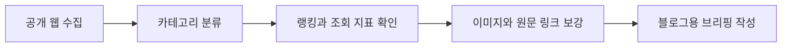

# 260712 최근 24시간 뉴스 브리핑

작성 기준 시각은 2026-07-12 17:09 KST입니다.
수집 범위는 최근 24시간 공개 웹에서 확인 가능한 네이버 뉴스 랭킹, 네이버 경제·금융, 네이버 IT/과학, GeekNews, 웃긴대학, 디시인사이드 실시간 베스트입니다.
FM코리아는 수집 시점에 보안 시스템 응답 HTTP 430으로 직접 목록 접근이 막혀 본문 수집에서 제외했습니다.
YouTube 인기 급상승 페이지는 공개 HTML은 확인했지만 영상 목록이 동적 데이터로 안정 추출되지 않아 이번 문서에는 직접 항목으로 포함하지 않았습니다.
이미지는 각 기사와 게시글의 공개 `og:image`, 썸네일, 또는 원문 페이지 이미지를 우선 연결했습니다.

| 구분 | 주요 출처 | 인기 판단 기준 |
|---|---|---|
| 랭킹뉴스 | 네이버 랭킹뉴스 | 랭킹 페이지 노출 순서와 기사 메타 |
| 경제뉴스 | 네이버 경제 섹션 | 섹션 상단 노출과 기사 메타 |
| 증권뉴스 | 네이버 금융 뉴스 | 금융 뉴스 목록과 많이 본 뉴스 링크 |
| 커뮤니티유머 | 웃긴대학, 디시 실시간베스트 | 추천자료, 조회수, 추천수, 댓글수 |
| IT뉴스 | GeekNews, 네이버 IT/과학 | 추천수, 댓글수, 섹션 상단 노출 |



## 랭킹뉴스 10개

### '초속 20m 강풍'에 제주공항 81편 결항·2편 회항
제주에 강풍특보가 내려지면서 제주국제공항 항공기 운항이 크게 흔들렸습니다.
국내선 80여 편 결항과 국제선 회항이 이어져 공항에는 체류객 지원 주의 단계가 발령됐습니다.
랭킹뉴스 상단에 올라온 이유는 휴가철 이동 수요와 기상 리스크가 동시에 겹친 생활 밀착 이슈였기 때문입니다.
관련 이미지는 공항 현장 사진으로 제공됐고, 원문은 네이버 랭킹뉴스에서 확인했습니다.
출처: [머니S](https://n.news.naver.com/article/417/0001151300?ntype=RANKING)  
이미지: https://imgnews.pstatic.net/image/417/2026/07/12/0001151300_001_20260712145707823.jpg?type=w800

### 대출규제 비껴간 '직장찬스' 사내대출 자율규제 시험대
은행권 대출 문턱이 높아지는 상황에서 일부 대기업 사내대출이 규제 사각지대로 거론됐습니다.
DSR과 LTV 같은 일반 대출 규제와 달리 사내복지 대출은 관리 기준이 상대적으로 느슨하다는 점이 쟁점입니다.
주택담보대출 규제가 강화되는 시점이라 형평성과 자율규제 논의가 함께 주목받았습니다.
금융 소비자와 직장인 모두에게 영향을 줄 수 있어 랭킹뉴스에서 높은 관심을 받았습니다.
출처: [머니S](https://n.news.naver.com/article/417/0001151289?ntype=RANKING)  
이미지: https://imgnews.pstatic.net/image/417/2026/07/12/0001151289_001_20260712090109432.jpg?type=w800

### 국민은행 주담대 6억에서 3억으로 축소
KB국민은행이 주택담보대출 한도를 낮추면서 실수요자의 불만과 불안이 커졌습니다.
내 집 마련을 준비하던 차주 입장에서는 자금 계획을 다시 짜야 하는 상황이 됐습니다.
중저가 아파트 시장의 매수세 위축 가능성도 함께 제기됐습니다.
가계대출 총량 관리가 실제 생활 금융으로 번지는 사례라 관심이 집중됐습니다.
출처: [머니S](https://n.news.naver.com/article/417/0001151285?ntype=RANKING)  
이미지: https://imgnews.pstatic.net/image/417/2026/07/12/0001151285_001_20260712065708306.jpg?type=w800

### '무섭노' 논란에 조국 전 대표 해명
걸그룹 리센느 멤버의 표현을 둘러싼 논란이 정치권 발언과 맞물리며 확대됐습니다.
조국 전 대표는 해당 그룹을 특정 성향으로 규정한 적은 없다고 해명했습니다.
온라인 표현의 지역성, 정치성, 팬덤 반응이 뒤섞이면서 문화 이슈가 정치 뉴스로 번졌습니다.
연예와 정치가 결합된 논란이라 랭킹뉴스에서 빠르게 확산됐습니다.
출처: [머니S](https://n.news.naver.com/article/417/0001151301?ntype=RANKING)  
이미지: https://imgnews.pstatic.net/image/417/2026/07/12/0001151301_001_20260712103814363.jpg?type=w800

### 정이한 자작극 의혹 둘러싼 보수 공방
정이한 전 개혁신당 부산시장 후보의 음료 피습 자작극 의혹이 보수 진영 내부 공방으로 이어졌습니다.
국민의힘과 한동훈 의원 측 발언에 대해 이준석 대표가 강하게 반박했습니다.
사건의 사실관계뿐 아니라 정당 간 책임론과 정치적 해석이 핵심 쟁점으로 떠올랐습니다.
부산시장 선거와 보수 재편 이슈가 맞물려 랭킹에서 높은 노출을 얻었습니다.
출처: [머니S](https://n.news.naver.com/article/417/0001151292?ntype=RANKING)  
이미지: https://imgnews.pstatic.net/image/417/2026/07/12/0001151292_001_20260712094909813.jpg?type=w800

### 선재 스님 음식과 성품 발언
부산국제어린이청소년영화제 강연에서 선재 스님이 음식과 지역별 성향을 연결한 발언이 기사화됐습니다.
강연은 먹는 음식과 몸, 마음의 관계를 설명하는 맥락에서 진행됐습니다.
다만 지역별 성격을 음식 간과 연결한 표현은 독자 반응을 부를 수 있는 소재였습니다.
건강, 음식, 지역 정서가 섞인 가벼운 화제성 뉴스로 랭킹에 올랐습니다.
출처: [조선일보](https://n.news.naver.com/article/023/0003987089?ntype=RANKING)  
이미지: https://imgnews.pstatic.net/image/023/2026/07/12/0003987089_001_20260712114711786.jpg?type=w800

### 안철수 의원의 한동훈 복당 반대
안철수 의원은 한동훈 의원의 국민의힘 복당에 반대한다는 입장을 공개적으로 밝혔습니다.
기존에는 가능성을 열어뒀지만 최근 정치 상황을 계기로 선을 그은 것으로 해석됩니다.
국민의힘 내부 구도와 무소속 한동훈 의원의 향후 행보가 다시 쟁점이 됐습니다.
보수 정치권 재편 가능성과 직접 연결돼 랭킹뉴스에서 주목받았습니다.
출처: [조선일보](https://n.news.naver.com/article/023/0003987097?ntype=RANKING)  
이미지: https://imgnews.pstatic.net/image/023/2026/07/12/0003987097_001_20260712120209862.jpg?type=w800

### 홍성 농장 네팔 노동자 사망
충남 홍성군의 한 농장에서 30대 네팔 노동자가 심정지 상태로 발견된 뒤 숨졌습니다.
경찰은 명확한 사인 확인을 위해 부검을 예정하고 있습니다.
폭염과 농업 현장 노동환경에 대한 사회적 관심이 큰 시점이라 사건의 파장이 커질 수 있습니다.
외국인 노동자 안전 문제와 지역 현장 사고가 맞물린 뉴스입니다.
출처: [조선일보](https://n.news.naver.com/article/023/0003987119?ntype=RANKING)  
이미지: https://imgnews.pstatic.net/image/023/2026/07/12/0003987119_001_20260712132307733.jpg?type=w800

### 메시 월드컵 20골 10어시스트 대기록
아르헨티나가 스위스를 연장전 끝에 꺾고 월드컵 4강에 올랐습니다.
메시는 월드컵 누적 20골 10어시스트라는 상징적인 기록을 세웠습니다.
준결승 상대가 잉글랜드로 정해지며 축구 팬들의 관심이 더 커졌습니다.
월드컵 대형 경기와 메시 기록이 결합돼 스포츠 랭킹 이슈가 됐습니다.
출처: [조선일보](https://n.news.naver.com/article/023/0003987120?ntype=RANKING)  
이미지: https://imgnews.pstatic.net/image/023/2026/07/12/0003987120_001_20260712151708756.jpg?type=w800

### 정청래 전 의원의 자기정치 반격
정청래 전 의원이 탈당과 무소속 출마를 두고 최악의 자기정치라고 비판했습니다.
김민석, 송영길 등과의 당권 경쟁 구도 속에서 선당후사와 정통성 논쟁이 커지고 있습니다.
전당대회를 앞둔 민주당 내부 노선 경쟁이 본격화되는 흐름으로 읽힙니다.
정치권 인물 간 직접 공방이라는 점에서 랭킹뉴스 관심을 끌었습니다.
출처: [조선일보](https://n.news.naver.com/article/023/0003987131?ntype=RANKING)  
이미지: https://imgnews.pstatic.net/image/023/2026/07/12/0003987131_001_20260712151908757.jpg?type=w800

## 경제뉴스 10개

### 5대 은행 가계대출 증가 여력 85% 소진
5대 시중은행이 상반기에만 올해 가계대출 증가 여력의 대부분을 사용한 것으로 집계됐습니다.
일부 은행은 이미 연간 목표치를 초과한 상태라 하반기 대출 문턱은 더 높아질 가능성이 큽니다.
부동산 매수자와 자영업자, 전세 수요자 모두에게 직접 영향을 줄 수 있는 뉴스입니다.
가계대출 총량관리의 실제 체감이 하반기 금융시장 핵심 변수로 떠올랐습니다.
출처: [매일경제](https://n.news.naver.com/mnews/article/009/0005706106)  
이미지: https://imgnews.pstatic.net/image/009/2026/07/12/0005706106_001_20260712130306483.jpg?type=w800

### SK하이닉스 나스닥 입성에 외신 주목
SK하이닉스가 ADR 방식으로 나스닥 시장에 입성하자 주요 외신과 월가가 큰 관심을 보였습니다.
AI 메모리와 HBM 경쟁력이 한국 반도체주의 글로벌 재평가로 이어질 수 있다는 기대가 나옵니다.
미국 시장에서의 가격 형성이 국내 주가에도 영향을 줄 수 있어 투자자 관심이 큽니다.
반도체와 환율, 외국인 수급이 연결되는 경제 이슈입니다.
출처: [아이뉴스24](https://n.news.naver.com/mnews/article/031/0001041444)  
이미지: https://imgnews.pstatic.net/image/031/2026/07/11/0001041444_001_20260711182209310.jpg?type=w800

### 삼성전자 용인 팹 2029년 조기 가동 추진
삼성전자가 용인 반도체 국가산단 첫 번째 팹 가동 시점을 2029년으로 앞당기는 방안을 추진 중입니다.
전력과 용수 같은 인프라 준비가 일정 단축의 핵심 조건으로 떠올랐습니다.
국가 반도체 클러스터 경쟁력과 지역 산업 파급효과가 함께 주목됩니다.
AI 반도체 공급망 경쟁이 치열해지는 가운데 장기 투자 뉴스로 의미가 큽니다.
출처: [YTN](https://n.news.naver.com/mnews/article/052/0002378263)  
이미지: https://imgnews.pstatic.net/image/052/2026/07/12/202607121102221855_t_20260712110819322.jpg?type=w800

### 미국 하이닉스 주가 한국보다 16% 높아
나스닥에서 거래된 SK하이닉스 ADR 가격이 국내 주가보다 높은 수준을 보였습니다.
가격 차이는 국내 주식의 재평가 기대와 차익거래 가능성을 동시에 불러왔습니다.
반도체 대표주의 글로벌 프리미엄이 국내 시장으로 얼마나 반영될지가 관전 포인트입니다.
개인투자자와 기관 모두 월요일 장세를 주목하게 만든 뉴스입니다.
출처: [부산일보](https://n.news.naver.com/mnews/article/082/0001389327)  
이미지: https://imgnews.pstatic.net/image/082/2026/07/12/0001389327_001_20260712150213921.jpg?type=w800

### 서울 빌라 경매 경쟁률 상승
서울 빌라 매매와 전월세 거래가 살아나면서 경매시장에도 응찰자가 몰리고 있습니다.
전세 물건 부족과 아파트 가격 부담이 빌라 수요로 일부 이동한 것으로 해석됩니다.
HUG가 대항력을 포기한 물건 등 권리관계가 비교적 정리된 경매가 관심을 받았습니다.
주거비 부담과 대체 주거 수요가 함께 반영된 부동산 뉴스입니다.
출처: [헤럴드경제](https://n.news.naver.com/mnews/article/016/0002669048)  
이미지: https://imgnews.pstatic.net/image/016/2026/07/12/0002669048_001_20260712132212388.jpg?type=w800

### 기업 여름휴가 평균 3.8일
올해 국내 기업의 평균 여름휴가 기간은 3.8일로 조사됐습니다.
휴가 시기는 8월 초순에 가장 집중될 전망입니다.
경기 부진 우려가 이어지면서 휴가비 지급 기업 비율은 다소 줄었습니다.
소비 경기와 기업 체감 경기를 동시에 보여주는 생활경제 지표입니다.
출처: [경기일보](https://n.news.naver.com/mnews/article/666/0000114877)  
이미지: https://imgnews.pstatic.net/image/666/2026/07/12/0000114877_001_20260712150310329.jpg?type=w800

### 여행자보험 보상 사각지대 주의
해외여행 증가와 함께 여행자보험 가입도 늘고 있지만 실제 보상 기준을 모르면 낭패를 볼 수 있습니다.
항공 지연, 안경 파손, 캐리어 손상 등은 약관과 특약 조건에 따라 보상 여부가 갈립니다.
휴가철 실수요자가 바로 참고할 수 있는 정보성 경제 뉴스입니다.
보험 상품의 가격보다 보장 범위를 먼저 확인해야 한다는 메시지가 핵심입니다.
출처: [서울경제](https://n.news.naver.com/mnews/article/011/0004640669)  
이미지: https://imgnews.pstatic.net/image/011/2026/07/12/0004640669_001_20260712135708079.jpg?type=w800

### 성형외과 뒷광고 공정위 제재
서울 강남과 서초의 성형외과 3곳이 광고성 수술 후기를 일반 체험담처럼 게시한 혐의로 제재를 받았습니다.
홍보모델이 수술비 할인을 받은 뒤 후기를 작성한 정황이 쟁점이 됐습니다.
의료 광고와 인플루언서 마케팅의 경계가 다시 논의되는 계기입니다.
소비자 신뢰와 플랫폼 후기 문화에 영향을 주는 경제·소비자 뉴스입니다.
출처: [매일경제](https://n.news.naver.com/mnews/article/009/0005706137)  
이미지: https://imgnews.pstatic.net/image/009/2026/07/12/0005706137_001_20260712144209437.png?type=w800

### KB금융 양종희 회장의 머니무브 대응
양종희 KB금융 회장은 머니무브를 위기가 아니라 자산관리 경쟁력을 높일 기회로 봤습니다.
그룹 업무 프로세스를 재점검하고 AI 기반 업무수행 체계를 강화하겠다는 방향도 제시했습니다.
예금, 투자, 연금 자금 이동이 금융권 경쟁 구도를 바꾸는 흐름입니다.
대형 금융지주의 전략 변화라는 점에서 경제 섹션 상단에 노출됐습니다.
출처: [뉴스1](https://n.news.naver.com/mnews/article/421/0009054344)  
이미지: https://imgnews.pstatic.net/image/421/2026/07/12/0009054344_001_20260712102111198.jpg?type=w800

### 상법 개정 1년, 기업 이사회 운영 변화
개정 상법 시행 1년을 맞아 상장사 다수가 이사회 운영 방식을 바꾼 것으로 조사됐습니다.
이사의 충실의무 확대는 지배구조 개선 효과와 경영 부담을 동시에 만들고 있습니다.
기업들은 의사결정 기록, 리스크 검토, 이사회 책임 범위를 더 신중히 다루게 됐습니다.
기업 경영과 주주권 변화가 만나는 구조적 경제 뉴스입니다.
출처: [연합뉴스](https://n.news.naver.com/mnews/article/001/0016189477)  
이미지: https://imgnews.pstatic.net/image/001/2026/07/12/AKR20260712010900003_01_i_P4_20260712120030082.jpg?type=w800

## 증권뉴스 10개

### 닛케이도 경계한 한국 증시 변수
네이버 금융 많이 본 뉴스에는 한국 관련 이슈가 일본 증시 변동성으로 연결됐다는 기사가 올랐습니다.
반도체, 환율, 수출 경쟁력은 한국과 일본 주식시장이 동시에 반응하는 재료입니다.
제목상으로는 한국발 요인이 닛케이 흐름에 부담을 줬다는 맥락으로 읽힙니다.
한일 증시의 업종 경쟁 관계를 볼 때 반도체와 장비주 수급을 함께 확인할 필요가 있습니다.
출처: [네이버 금융](https://finance.naver.com/news/news_read.naver?article_id=0005706186&office_id=009&mode=LSS3D&type=0&section_id=101&section_id2=258&section_id3=401)

### SK하이닉스 미국 상장 자금 265억달러
SK하이닉스의 미국 상장 관련 조달 규모가 265억달러로 언급되며 금융 뉴스 상단에 올랐습니다.
대규모 달러 자금은 기업 투자 여력뿐 아니라 외환시장 수급에도 영향을 줄 수 있습니다.
AI 메모리 투자 경쟁이 이어지는 상황에서 자금 조달 능력은 밸류에이션의 핵심 변수입니다.
반도체 대표주 투자자는 ADR 가격과 국내 보통주 괴리를 함께 봐야 합니다.
출처: [네이버 금융](https://finance.naver.com/news/news_read.naver?article_id=0001151322&office_id=417&mode=LSS3D&type=0&section_id=101&section_id2=258&section_id3=401)

### 이번 주 머니 캘린더
이번 주 주요 경제 일정과 증시 이벤트를 정리한 머니 캘린더가 금융 뉴스 목록에 올랐습니다.
투자자 입장에서는 CPI, 금리 결정, 주요 기업 실적, 공모 일정이 단기 변동성을 좌우합니다.
캘린더형 기사는 개별 종목보다 시장 전체의 리스크 관리에 유용합니다.
하반기 정책·실적 시즌이 겹치면서 일정 확인 수요가 커졌습니다.
출처: [네이버 금융](https://finance.naver.com/news/news_read.naver?article_id=0005706180&office_id=009&mode=LSS3D&type=0&section_id=101&section_id2=258&section_id3=401)

### 고점서 25% 밀린 코스피와 CPI 변수
코스피가 고점 대비 크게 밀린 상황에서 미국 CPI가 반등의 촉매가 될지 주목됩니다.
기사 제목은 CPI가 시장 예상에 부합하면 삼성전자, SK하이닉스, 조선주 반등 가능성을 거론합니다.
하락장에서는 금리 기대와 실적 기대가 동시에 맞아야 기술적 반등이 힘을 얻습니다.
단기 매매자는 지수보다 업종별 수급 회복 여부를 먼저 확인할 필요가 있습니다.
출처: [네이버 금융](https://finance.naver.com/news/news_read.naver?article_id=0003036604&office_id=029&mode=LSS3D&type=0&section_id=101&section_id2=258&section_id3=401)

### SNS 미담주와 3대 메가 수혜주
급락장 속에서도 SNS에서 확산된 미담주와 대형 정책·산업 수혜주가 투자자 관심을 받았습니다.
테마주는 단기간 수급을 모으지만 실적 검증 전에는 변동성이 커질 수 있습니다.
기사 제목은 급락장에서도 특정 서사가 강한 종목으로 자금이 몰리는 흐름을 보여줍니다.
추천수와 조회수가 높을수록 추격 매수 위험도 함께 커진다는 점을 봐야 합니다.
출처: [네이버 금융](https://finance.naver.com/news/news_read.naver?article_id=0016189796&office_id=001&mode=LSS3D&type=0&section_id=101&section_id2=258&section_id3=401)

### 삼전·닉스 레버리지 초단타 규제 논의
삼성전자와 SK하이닉스를 기초로 한 레버리지 상품의 초단타 거래가 문제로 제기됐습니다.
반도체 대표주 쏠림이 커질수록 파생·레버리지 상품의 변동성도 함께 커집니다.
거래 안정성과 투자자 보호를 위해 제도 개선 논의가 나올 수 있습니다.
개별주보다 상품 구조와 유동성 리스크를 이해하는 것이 중요합니다.
출처: [네이버 금융](https://finance.naver.com/news/news_read.naver?article_id=0002233934&office_id=138&mode=LSS3D&type=0&section_id=101&section_id2=258&section_id3=401)

### SK하이닉스 ADR 흥행과 액면분할 기대
SK하이닉스 ADR 흥행에 더해 액면분할 기대가 국내 주가 재료로 언급됐습니다.
액면분할은 기업 가치 자체를 바꾸지는 않지만 거래 접근성과 심리에는 영향을 줄 수 있습니다.
ADR 프리미엄이 국내 주가에 반영될지 여부가 단기 핵심입니다.
반도체 대표주 쏠림이 더 강해질 수 있어 수급 과열도 함께 봐야 합니다.
출처: [네이버 금융](https://finance.naver.com/news/news_read.naver?article_id=0005308972&office_id=015&mode=LSS3D&type=0&section_id=101&section_id2=258&section_id3=401)

### 스페이스X 상장 한 달과 국내 우주주
스페이스X 상장 이후 국내 우주 관련주의 재평가 기대가 금융 뉴스에 올랐습니다.
글로벌 우주 인프라 기업의 밸류에이션은 국내 위성, 발사체, 통신 장비주 기대를 자극합니다.
다만 해외 대장주와 국내 중소형 테마주의 실적 연결성은 따로 검증해야 합니다.
우주 테마는 뉴스 플로우가 빠른 만큼 거래량과 공시를 함께 확인해야 합니다.
출처: [네이버 금융](https://finance.naver.com/news/news_read.naver?article_id=0003110545&office_id=119&mode=LSS3D&type=0&section_id=101&section_id2=258&section_id3=401)

### SK하이닉스 나스닥 조달과 외환시장 효과
SK하이닉스가 나스닥에서 대규모 달러 자금을 조달하면 국내 외환시장 달러 공급 효과가 기대됩니다.
기업 자금 조달이 환율 안정 재료로 해석될 수 있다는 점이 투자자 관심을 끌었습니다.
반도체 투자 확대와 원화 환율 흐름이 동시에 연결되는 뉴스입니다.
주식시장에서는 기업 가치와 매크로 변수가 함께 작동할 가능성이 있습니다.
출처: [네이버 금융](https://finance.naver.com/news/news_read.naver?article_id=0000189993&office_id=654&mode=LSS3D&type=0&section_id=101&section_id2=258&section_id3=401)

### 중국 AI 기업 미니맥스 관련 뉴스
중국 AI 신흥기업 미니맥스 관련 소식이 네이버 금융 목록에 올랐습니다.
중국 AI 기업의 자금 조달과 상장 이슈는 국내 AI 소프트웨어·반도체 투자심리에도 영향을 줍니다.
미국과 중국의 AI 경쟁 구도가 강해질수록 관련 종목의 밸류에이션 민감도도 커집니다.
해외 AI 뉴스는 국내 테마주에 간접 재료로 작동할 수 있어 추적 가치가 있습니다.
출처: [네이버 금융](https://finance.naver.com/news/news_read.naver?article_id=0014061702&office_id=003&mode=LSS3D&type=0&section_id=101&section_id2=258&section_id3=401)

## 커뮤니티유머 10개

### 레딧에서 좋아요 8천개 이상 받은 아이돌 개인기
웃긴대학 추천자료에서 레딧 반응을 소재로 한 아이돌 개인기 영상 글이 상단에 올랐습니다.
해외 커뮤니티 반응과 국내 아이돌 콘텐츠가 결합돼 확산성이 컸습니다.
영상형 게시물이라 제목만으로도 클릭 유도가 강한 편입니다.
커뮤니티에서는 짧은 영상, 해외 반응, 아이돌 소재가 함께 붙을 때 조회가 빠르게 늘어납니다.
출처: [웃긴대학](https://web.humoruniv.com/board/humor/read.html?table=pds&st=day&page=0&number=1417355&from=best)

### 금수저 앞에서 기분이 묘해진 카페 사장
카페 사장과 손님의 경제적 배경 차이를 다룬 게시물이 추천자료에 올랐습니다.
일상 공간에서 느끼는 상대적 박탈감과 웃픈 상황이 공감을 부른 것으로 보입니다.
제목이 상황을 바로 보여주면서도 결말을 숨겨 클릭을 유도합니다.
웃긴대학의 공감형 생활 유머 흐름에 잘 맞는 글입니다.
출처: [웃긴대학](https://web.humoruniv.com/board/humor/read.html?table=pds&st=day&page=0&number=1417316&from=best)

### 김풍 작가가 걱정돼서 남긴 댓글
김풍 작가 관련 댓글을 소재로 한 게시물이 웃긴대학 추천 목록에 포함됐습니다.
유명인 반응과 댓글 맥락이 합쳐진 콘텐츠는 짧게 소비하기 좋아 커뮤니티에서 잘 퍼집니다.
댓글 하나를 중심으로 상황을 재구성하는 방식이라 캡처형 유머에 가깝습니다.
독자는 원문 댓글의 뉘앙스와 주변 반응을 확인하려고 클릭하게 됩니다.
출처: [웃긴대학](https://web.humoruniv.com/board/humor/read.html?table=pds&st=day&page=0&number=1417326&from=best)

### 97%가 찬성한다는 빨간 번호판
자동차 번호판 색상과 제도 논의를 소재로 한 게시물이 추천자료에 올랐습니다.
제목의 97%라는 숫자가 강한 찬반 구도를 만들어 반응을 끌어낸 것으로 보입니다.
생활 규제, 운전 문화, 공정성 논란은 댓글이 붙기 쉬운 주제입니다.
커뮤니티 유머이지만 제도 풍자와 여론 확인 성격도 함께 있습니다.
출처: [웃긴대학](https://web.humoruniv.com/board/humor/read.html?table=pds&st=day&page=0&number=1417075&from=best)

### 심각하다는 SRT 무임승차 근황
SRT 무임승차 문제를 다룬 글이 웃긴대학 추천자료에 포함됐습니다.
대중교통 질서와 요금 공정성은 댓글 논쟁이 붙기 쉬운 소재입니다.
제목은 심각하다는 표현으로 문제 제기 성격을 강조합니다.
단순 유머보다 사회 고발형 커뮤니티 글에 가까운 흐름입니다.
출처: [웃긴대학](https://web.humoruniv.com/board/humor/read.html?table=pds&st=day&page=0&number=1416913&from=best)

### 디시 카연 옆자리 여자애 마음편
디시 실시간베스트에서 카툰연재 계열 글이 2026-07-12 17:00 기준 조회수 2,397, 추천 32를 기록했습니다.
연재형 만화는 고정 독자와 신규 유입이 함께 붙기 쉬운 포맷입니다.
썸네일이 함께 노출돼 목록에서 시각적 클릭 유도가 강했습니다.
실시간베스트 최신 글로 올라와 짧은 시간 내 반응을 모은 항목입니다.
출처: [디시인사이드](https://gall.dcinside.com/board/view/?id=dcbest&no=444908&_dcbest=1&page=1)  
이미지: https://dccdn11.dcinside.co.kr/viewimage.php?id=29bed223f6c6&no=24b0d769e1d32ca73fe785fa11d028318f176c8dd1b3ddcdc44ef217ef7beef52e37a568658b3e3322b153aa976750ca3505eb8723a7b75d18dbecdfdf4fb565ce94dcf819ef1bc3aa685e8aec9ea7c0b3f369bd2599280ea2d4ad66b715fba1a5150f147b79bad9ee6131a206061ee43ecdb64904a65c28383b8b&29730727

### 디시 노스포 호프 시사회 반응
디시 실시간베스트에서 영화 시사회 반응 글이 2026-07-12 16:50 기준 조회수 2,363, 추천 21을 기록했습니다.
노스포일러를 강조한 제목이라 영화를 기다리는 이용자들이 부담 없이 클릭할 수 있습니다.
시사회 반응 정리는 영화 커뮤니티와 일반 유저 모두에게 소비성이 높습니다.
개봉 전 기대작의 초반 입소문을 확인하려는 수요가 반영됐습니다.
출처: [디시인사이드](https://gall.dcinside.com/board/view/?id=dcbest&no=444907&_dcbest=1&page=1)  
이미지: https://dccdn11.dcinside.co.kr/viewimage.php?id=29bed223f6c6&no=24b0d769e1d32ca73de785fa11d028311db29c13695a307ccacdd430f4f615e9ff3a815d4f705d7b85e21b98723cb1c9c247d4919cc8518856c7b6d56449bd338ed1d0f00c7fe30ac8741a78ab1eaa09e3e6556a3769ab577a7b&29730727

### 디시 실시간 맥그리거 부상 장면
디시 실시간베스트에서 맥그리거 부상 장면 글이 조회수 17,564, 추천 106으로 높은 반응을 보였습니다.
스포츠 스타의 돌발 부상 장면은 영상과 짧은 설명만으로도 확산성이 큽니다.
실시간 이슈성이 강해 다른 글보다 조회수가 빠르게 치솟았습니다.
격투기 팬덤과 일반 이슈 소비층이 동시에 반응한 항목입니다.
출처: [디시인사이드](https://gall.dcinside.com/board/view/?id=dcbest&no=444905&_dcbest=1&page=1)  
이미지: https://dccdn11.dcinside.co.kr/viewimage.php?id=29bed223f6c6&no=24b0d769e1d32ca73de785fa1bd62531de535045b081fc7000c7a813d8d2c229204018928019b9fd3b45e8d3468d5d64c110d9bbe5cc7a000fb08142fd4fbb07a127&29730727

### 디시 나라별 재사용 로켓 비교
디시 실시간베스트에서 나라별 재사용 로켓을 비교한 GIF 글이 조회수 4,398, 추천 23을 기록했습니다.
우주 개발 경쟁을 짧은 이미지 자료로 비교하는 포맷이라 정보성과 유머가 함께 있습니다.
스페이스X와 중국, 국가별 기술 경쟁에 대한 관심이 커진 상황과도 맞물립니다.
GIF 기반 비교 자료는 커뮤니티에서 저장과 재공유가 쉬운 콘텐츠입니다.
출처: [디시인사이드](https://gall.dcinside.com/board/view/?id=dcbest&no=444903&_dcbest=1&page=1)  
이미지: https://dccdn11.dcinside.co.kr/viewimage.php?id=29bed223f6c6&no=24b0d769e1d32ca73de785fa11d028311db29c13695a307ccacdd430f4f515f4eb1b07041594c5465b3236cf896442606bbe9928928c26323e48d83e6f0b1a8799f02055f3402e9b3cc56859bea1dcfe8d916b7f21b371f7397eeb83034ab78a96b90ee2e2&29730727

### 디시 라면 여러 개 끓일 때 싱거운 이유
디시 실시간베스트에서 백종원식 설명을 소재로 한 라면 글이 조회수 16,205, 추천 138을 기록했습니다.
누구나 겪어본 조리 경험을 간단한 원리로 설명하는 콘텐츠라 공감도가 높습니다.
생활 팁과 유머가 섞여 댓글 반응도 붙기 쉬운 형태입니다.
조회수와 추천수가 모두 높아 커뮤니티유머 섹션의 대표 인기 글로 볼 수 있습니다.
출처: [디시인사이드](https://gall.dcinside.com/board/view/?id=dcbest&no=444897&_dcbest=1&page=1)  
이미지: https://dccdn11.dcinside.co.kr/viewimage.php?id=29bed223f6c6&no=24b0d769e1d32ca73de785fa1bd62531de535045b081fc7000c7a813d8d2c229264f1598811df4b96510b08e4e815b6e286167c64c0dca6e901c40c277e36c66164ab47129e5d6a19f3b8d95&29730727

## IT뉴스 10개

### 대한민국 제도 100개를 한 장씩 체계도로 만든 프로젝트
GeekNews에서 49 points와 댓글 17개를 기록하며 가장 눈에 띄는 IT/지식 콘텐츠로 올랐습니다.
AI 리터러시를 기술 자체 학습이 아니라 다른 전문영역 이해를 돕는 방식으로 확장한 프로젝트입니다.
대한민국 제도를 시각 체계도로 정리했다는 점에서 공공 지식과 AI 활용이 만납니다.
직접 만든 결과물을 공유하는 Show GN 성격이라 개발자 커뮤니티 반응이 컸습니다.
출처: [GeekNews](https://news.hada.io/topic?id=31313)

### sem, Git 위의 시맨틱 버전 관리 도구
sem은 Git 변경을 줄 단위가 아니라 함수와 클래스 단위로 추적하려는 도구입니다.
어떤 함수, 메서드, 클래스가 추가·수정·삭제·이동됐는지 보여준다는 점이 핵심입니다.
AI가 코드를 많이 생성하는 환경에서는 의미 단위 변경 추적의 가치가 커집니다.
GeekNews에서 2026-07-12 오전에 올라와 개발 도구 관심층의 반응을 모았습니다.
출처: [GitHub](https://github.com/Ataraxy-Labs/sem)

### Ghost Font, 사람은 읽지만 AI는 읽기 어려운 글꼴
Ghost Font는 사람에게는 보이지만 AI가 개별 프레임에서 읽기 어려운 메시지 표현 방식을 제안합니다.
배경과 같은 점의 움직임으로 글자를 만드는 방식이라 영상 기반 인식의 약점을 겨냥합니다.
AI 감시, OCR, 워터마킹, 콘텐츠 보호 논의와 연결될 수 있는 흥미로운 실험입니다.
GeekNews에서 짧은 시간 내 댓글과 추천을 받으며 최신 AI 보안 소재로 떠올랐습니다.
출처: [Ghost Font](https://www.mixfont.com/ghost-font)

### 성공한 기업은 어떻게 눈이 멀어가는가
성공한 기업이 과거 성장 역량을 더 이상 식별하거나 보상하지 못하는 현상을 다룬 글입니다.
역량 실명이라는 개념을 통해 좋은 실적이 오히려 내부 학습을 방해할 수 있음을 설명합니다.
기술 기업의 조직 운영과 제품 판단에 적용하기 좋은 주제입니다.
GeekNews에서 2026-07-12 오전에 소개돼 스타트업과 조직문화 관심층이 반응했습니다.
출처: [Ian Reppel](https://ianreppel.org/how-successful-companies-go-blind/)

### 30 Papers, 일리야 서츠케버 추천 AI 논문 목록
일리야 서츠케버가 추천한 것으로 알려진 AI 핵심 논문 목록을 초보자가 따라가기 쉽게 정리한 사이트입니다.
GeekNews에서는 89 points를 기록한 고관심 콘텐츠로 계속 상위권에 남아 있습니다.
AI 연구 입문자에게 논문 큐레이션과 요약을 제공한다는 점이 강점입니다.
최신 24시간 글은 아니지만 인기 지표가 압도적으로 높아 IT 섹션 참고 항목으로 포함했습니다.
출처: [30 Papers](https://30papers.com/)

### GPT-5.6, Grok 4.5, Claude, Muse Spark 앱 제작 비교
12개 모델에 동일한 앱 4개를 만들게 한 결과를 비교한 글입니다.
레이캐스터 미로, 3D 루빅스 큐브, 계산기, Conway's Game of Life 같은 과제가 포함됐습니다.
모델별 복잡 과제 수행력과 결과 품질을 체감형으로 비교할 수 있다는 점이 주목됩니다.
AI 코딩 모델 선택과 평가에 관심 있는 개발자에게 유용한 콘텐츠입니다.
출처: [tryai.dev](https://www.tryai.dev/blog/gpt-5.6-build-off-12-models)

### Boko Haram의 프런티어 AI 활용 방식 보고서
나이지리아 북동부에서 전 Boko Haram 구성원을 인터뷰해 무장조직의 AI 활용 방식을 조사한 보고서입니다.
프런티어 AI가 사이버·선전·운영 영역에서 악용될 가능성을 다룹니다.
AI 안전과 테러 대응이라는 무거운 주제라 커뮤니티에서도 토론 가치가 큽니다.
기술 발전의 사회적 리스크를 보여주는 최신 IT·정책 뉴스입니다.
출처: [CASP](https://casp.ac/reports/ai-enabled-terrorism)

### 양극성 LISP 프로그래머
Lisp가 뛰어난 언어임에도 주류가 되지 못한 이유를 언어 자체보다 사용자 성향에서 찾는 에세이입니다.
프로그래밍 언어의 기술적 장점과 커뮤니티 문화가 어떻게 충돌하는지 보여줍니다.
개발자 사이에서 오래된 언어 논쟁을 다시 읽게 만드는 글입니다.
GeekNews에서 댓글 4개와 10 points를 기록하며 언어 철학 관심층에 반응을 얻었습니다.
출처: [Mark Tarver](https://www.marktarver.com/bipolar.html)

### Lisp로 가는 길, 왜 Lisp인가
Lisp의 핵심은 괄호 문법이 아니라 언어를 문제에 맞게 확장하는 사고방식이라는 글입니다.
REPL, 패키지, 심볼, 조건, 재시작 같은 요소를 익혀야 Lisp의 장점이 드러난다고 설명합니다.
AI 시대에도 프로그래밍 언어의 표현력과 사고 방식은 여전히 중요한 주제입니다.
GeekNews에서 11 points와 댓글 3개를 기록했습니다.
출처: [scotto.me](https://scotto.me/blog/2026-07-09-why-lisp/)

### 엔비디아코리아와 SK하이닉스 반도체 연구성과 교류
과학기술정보통신부 주관 행사에서 엔비디아코리아, SK하이닉스, 나노종합기술원 등이 연구성과를 교류합니다.
반도체 관련 주요 기업과 기관 800여 명이 모이는 대형 행사입니다.
AI 반도체 공급망과 국내 연구 생태계 협력이 핵심 배경입니다.
네이버 IT/과학 섹션 상단에 노출된 국내 기술 산업 뉴스입니다.
출처: [파이낸셜뉴스](https://n.news.naver.com/mnews/article/014/0005546880)  
이미지: https://imgnews.pstatic.net/image/014/2026/07/12/0005546880_001_20260712124809043.jpg?type=w800

## 수집 한계와 확인 메모

| 항목 | 확인 결과 |
|---|---|
| qmd | 이 세션에 qmd 도구가 노출되지 않아 공개 웹 fetch와 로컬 스크립트로 보완 |
| FM코리아 | HTTP 430 보안 시스템 응답으로 직접 수집 실패 |
| YouTube | 공개 페이지는 접근됐지만 인기 영상 목록이 동적 데이터라 안정 추출 실패 |
| 네이버 | 랭킹·섹션·금융 페이지 HTML과 기사 메타 태그 확인 |
| 커뮤니티 | 성인·혐오·개인정보성 제목은 가능한 한 제외하거나 순화 |

## 사용자 프롬프트

```text
Automation: 매일 0800 최근 24시간 뉴스 브리핑
Automation ID: 08-24
최근 24시간 내의 높은조회수, 추천많은 컨텐츠 수집
뉴스기사, 블로그, 웹페이지, 커뮤니티사이트, 유투브 모두 검색
소스사이트: 네이버 뉴스, GeekNews, 웃긴대학, 디시인사이드, FM코리아, YouTube
내용: 랭킹뉴스 10개, 경제뉴스 10개, 증권뉴스 10개, 커뮤니티유머 10개, IT뉴스 10개
hhd-md
hhddoc 프로젝트 커밋 푸시
hhd-blog
블로그 프로젝트 커밋 푸시
```

