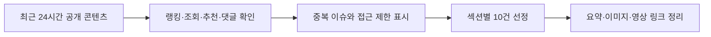

# 260712 최근 24시간 뉴스 브리핑

확인 시각: 2026-07-12 17:10 KST

수집 범위: 2026-07-11 17:03부터 2026-07-12 17:03 KST까지 공개되었거나 해당 기간에 랭킹·조회·추천 신호가 확인된 콘텐츠

수집 기준: 네이버 뉴스 랭킹과 경제·금융 기사, 네이버 금융 주요뉴스, GeekNews 점수·댓글, 웃긴대학 일간 인기, 디시인사이드 실시간 베스트, FM코리아 포텐 검색 지표, YouTube 검색 결과를 함께 확인했다.

네이버 랭킹은 전체 단일 1~10위가 아니라 언론사별 많이 본 뉴스 구조라서, 여러 언론사 랭킹 상위 후보를 섞어 중복과 섹션 편중을 줄였다.

FM코리아는 직접 접속 시 보안 페이지가 먼저 노출되어 검색 스니펫 기반 조회·추천·댓글 지표를 사용했고, 해당 항목에는 제한을 명시했다.

YouTube는 공개 검색 결과의 게시 시각과 조회 지표가 불안정한 항목이 있어, 확인 가능한 영상형 콘텐츠와 뉴스 영상 후보를 별도 섹션에 보조로 남겼다.

| 구분 | 건수 | 주요 확인 신호 | 대표 출처 |
|---|---:|---|---|
| 랭킹뉴스 | 10 | 네이버 언론사별 많이 본 뉴스 | 네이버 뉴스 |
| 경제뉴스 | 10 | 네이버 경제 섹션·랭킹 | 네이버 뉴스, 언론 원문 |
| 증권뉴스 | 10 | 네이버 금융 주요뉴스·시장 기사 | 네이버 금융, 연합뉴스, EBN |
| 커뮤니티유머 | 10 | 조회·추천·댓글 | 웃긴대학, 디시인사이드, FM코리아 |
| IT뉴스 | 10 | GeekNews 점수·댓글, 원문 게시시각 | GeekNews, TechCrunch |



## 랭킹뉴스 10개

### 국민연금 보험료 기준 상·하한 조정

매일경제 랭킹 상위권에서 확인된 생활경제 기사다.
7월부터 국민연금 보험료 산정 기준소득월액 상한액이 637만 원에서 659만 원으로, 하한액은 40만 원에서 41만 원으로 바뀐다.
고소득 직장인은 월급 실수령액 감소를 바로 체감할 수 있어 조회 반응이 컸다.
국민연금 개편 논쟁이 장기 이슈라 단순 고지성 기사인데도 생활비 관심과 결합해 랭킹에 올랐다.
원문은 [네이버 뉴스](https://n.news.naver.com/article/009/0005706102?ntype=RANKING)와 [매일경제](https://www.mk.co.kr/article/12096334)에서 확인했다.


### 서울 축의금 20만 원 논쟁

매일경제 랭킹 상위권에서 확인된 생활비·관계 비용 기사다.
서울 결혼식 축의금 기준을 두고 10만 원과 20만 원 사이의 체감 차이가 커졌다는 사례가 관심을 모았다.
KTX 이동비와 숙박비까지 더해지면 결혼식 참석 자체가 큰 지출이 되는 현실이 드러난다.
축의금은 정답이 없는 사회 관습이라 댓글과 커뮤니티 재확산이 쉬운 소재다.
원문은 [네이버 뉴스](https://n.news.naver.com/article/009/0005706139?ntype=RANKING)에서 확인했다.


### SK하이닉스와 삼성전자 주가 온도차

매일경제 랭킹 상위권에서 확인된 반도체·증시 기사다.
SK하이닉스가 나스닥 ADR 흥행으로 주목받으면서 삼성전자와의 상대 성과 비교가 다시 커졌다.
기사의 관심 포인트는 특정 종목 전망보다 반도체 주도주의 고점·저점 논쟁이다.
개인투자자에게는 월요일 장 시작 전 심리를 자극하는 재료로 소비됐다.
원문은 [네이버 뉴스](https://n.news.naver.com/article/009/0005706145?ntype=RANKING)에서 확인했다.


### 클롭 독일 대표팀 감독 부임설

매일경제 랭킹 상위권에 오른 스포츠 뉴스다.
손흥민을 놓친 일을 아쉬워했다는 과거 발언과 클롭의 독일 대표팀 감독 부임 가능성이 결합됐다.
월드컵 시즌의 감독 교체설은 축구 팬덤에서 빠르게 소비되는 소재다.
한국 독자에게는 손흥민 관련 언급이 붙어 해외 축구 뉴스 이상의 화제성을 만들었다.
원문은 [네이버 뉴스](https://n.news.naver.com/article/009/0005706123?ntype=RANKING)에서 확인했다.


### 업무 중 휴대폰 사용 과태료 법안

매일경제 랭킹 상위권에서 확인된 노동·입법 기사다.
업무 중 휴대폰 사용을 제한하는 법안이 특정 고위험 작업장 중심으로 발의되며 관심을 끌었다.
기사 제목만 보면 과잉 규제처럼 보이지만, 실제 쟁점은 안전사고 위험이 큰 장소에서의 집중 의무다.
노동 현장의 안전과 개인 자유가 충돌하는 사안이라 조회와 반응이 커졌다.
원문은 [네이버 뉴스](https://n.news.naver.com/article/009/0005706128?ntype=RANKING)에서 확인했다.


### 홈플러스 떨이 할인과 파산 우려

KBS 랭킹 상위권에서 확인된 유통 구조조정 뉴스다.
홈플러스 일부 매장에서 할인 판매가 이어지는 가운데, 파산을 막을 해법이 뚜렷하지 않다는 보도가 나왔다.
소비자는 할인 기회를 찾지만 직원·협력사·입점업체에는 고용과 정산 리스크가 남는다.
대형 유통사의 위기가 생활 현장 이미지로 전달되면서 랭킹 반응이 컸다.
원문은 [네이버 뉴스](https://n.news.naver.com/article/056/0012216371?ntype=RANKING)에서 확인했다.


### 조국 리센느 발언 논란

KBS 랭킹 상위권에서 확인된 정치·연예 결합 이슈다.
조국 전 대표가 걸그룹 리센느와 특정 커뮤니티 표현을 둘러싼 논란에 대해 해명했고, 국민의힘은 이를 비판했다.
정치인의 표현, 팬덤 반응, 온라인 문화 해석이 한꺼번에 얽힌 사안이다.
정치 뉴스지만 연예 이슈와 결합해 일반 랭킹에서도 강하게 노출됐다.
원문은 [네이버 뉴스](https://n.news.naver.com/article/056/0012216414?ntype=RANKING)에서 확인했다.


### 동해 해군 승조원 실종

KBS 랭킹 상위권에서 확인된 군 사고 속보성 기사다.
동해 거진 해상에서 임무 중이던 해군 함정 승조원 1명이 실종돼 수색이 진행됐다.
군 복무 중 발생한 실종 사고는 안전관리와 구조 대응에 대한 관심으로 이어진다.
세부 원인은 추가 확인이 필요하지만, 속보성 자체가 조회를 크게 끌었다.
원문은 [네이버 뉴스](https://n.news.naver.com/article/056/0012216411?ntype=RANKING)에서 확인했다.


### 호르무즈 해협 봉쇄와 미·이란 충돌

KBS와 여러 유튜브 뉴스 검색 결과에서 함께 확인된 국제 안보 이슈다.
이란의 호르무즈 해협 봉쇄 언급과 미국의 군사 대응 보도가 이어지며 유가와 물류 리스크가 커졌다.
호르무즈는 원유 수송 핵심 항로라 긴장이 높아지면 국내 물가와 환율에도 영향을 줄 수 있다.
국제 뉴스지만 경제 파급이 직접적이어서 일반 랭킹과 영상 검색에서 모두 강하게 잡혔다.
원문은 [네이버 뉴스](https://n.news.naver.com/article/056/0012216380?ntype=RANKING)와 [YouTube KBS 속보](https://www.youtube.com/watch?v=XbGovfVZFN4)에서 확인했다.


### 잉글랜드와 아르헨티나 월드컵 4강

KBS 랭킹 상위권에서 확인된 월드컵 기사다.
잉글랜드가 벨링엄의 멀티골을 앞세워 4강에 올랐고, 아르헨티나와 맞붙게 됐다.
월드컵 토너먼트는 경기 결과뿐 아니라 스타 선수와 대진표 자체가 강한 클릭 요인이다.
커뮤니티에서도 같은 날 축구 관련 밈이 다수 올라와 스포츠 화제성이 이어졌다.
원문은 [네이버 뉴스](https://n.news.naver.com/article/056/0012216379?ntype=RANKING)에서 확인했다.


## 경제뉴스 10개

### 하반기 은행 대출 셧다운 우려

머니투데이는 5대 은행이 올해 가계대출 증가 목표의 약 80%를 이미 소진했다고 전했다.
하반기에는 주택담보대출과 신용대출 모두 문턱이 더 높아질 가능성이 있다.
금융권은 총량 관리 압박을 받고, 실수요자는 한도와 승인 시점을 더 촘촘히 확인해야 한다.
대출 규제가 부동산 거래와 전세 수요로 번질 수 있어 경제 섹션의 핵심 이슈로 선정했다.
원문은 [네이버 뉴스](https://n.news.naver.com/mnews/article/008/0005384694)와 [머니투데이](https://www.mt.co.kr/finance/2026/07/12/2026071210474764347)에서 확인했다.


### 5대 금융지주 포용금융 11조 원 공급

머니투데이는 5대 금융지주가 상반기 포용금융으로 11조 원 이상을 공급했다고 보도했다.
서민, 취약계층, 소상공인 지원이 포함되지만 실제 체감 효과는 금리와 상환 조건에 달려 있다.
은행권의 사회적 책임 요구가 커지는 상황에서 실적과 공공성의 균형이 다시 쟁점이 됐다.
가계대출 조이기와 동시에 취약계층 지원이 확대되는 양면 흐름을 보여준다.
원문은 [네이버 뉴스](https://n.news.naver.com/mnews/article/008/0005384719)와 [머니투데이](https://www.mt.co.kr/finance/2026/07/12/2026071016105865609)에서 확인했다.


### 종부세와 양도세 손질 검토

부산일보는 정부가 초고가·비거주 주택 보유세 강화와 장기보유특별공제 거주요건 조정을 검토한다고 전했다.
정책 방향은 투기성 보유를 줄이고 실거주 장기 보유의 혜택 구조를 다시 설계하는 쪽에 가깝다.
세제 변화는 매물 출회, 전세 공급, 고가주택 수요에 영향을 줄 수 있다.
부동산 세금은 시장 심리에 곧바로 반영되기 때문에 경제뉴스 상위 후보로 적합하다.
원문은 [네이버 뉴스](https://n.news.naver.com/mnews/article/082/0001389347)와 [부산일보](https://www.busan.com/view/busan/view.php?code=2026071216444335694)에서 확인했다.


### 7월 가계대출 일주일 만에 1조 원 증가

문화일보는 5대 은행 가계대출 잔액이 7영업일 만에 1조 원 이상 늘었다고 보도했다.
주담대 한도 축소 전 대출을 받으려는 수요와 증시 빚투 가능성이 함께 거론됐다.
대출 증가 속도가 빠르면 은행권은 추가 제한 조치를 앞당길 수 있다.
실수요자와 투자자 모두 금리보다 승인 가능성 자체를 먼저 계산해야 하는 국면이다.
원문은 [네이버 뉴스](https://n.news.naver.com/mnews/article/021/0002804086)에서 확인했다.


### 주담대 3억 제한과 전셋값 우려

매일경제는 주택담보대출 한도 축소가 전세시장으로 수요를 밀어낼 수 있다는 우려를 전했다.
매수를 포기한 수요가 전세에 남으면 인기 지역 전셋값 상승 압력이 커질 수 있다.
대출 규제는 집값 안정 장치이면서 동시에 임대차 시장에는 다른 부담을 만들 수 있다.
가계대출 관리와 주거 안정이 동시에 맞물린 경제 이슈다.
원문은 [네이버 뉴스](https://n.news.naver.com/mnews/article/009/0005706174)에서 확인했다.


### 삼성전자 용인 반도체 공장 2029년 가동 추진

중앙일보는 삼성전자가 용인 반도체 클러스터 첫 공장 가동 목표를 2029년으로 앞당겨 추진한다고 전했다.
AI 반도체 수요와 글로벌 공급망 경쟁이 커지면서 국내 생산기지 속도가 중요해졌다.
대규모 팹 투자는 협력사, 전력망, 용수, 지역 일자리까지 함께 움직이는 산업 이슈다.
반도체는 증권 재료이기도 하지만 이번 항목은 실물 투자와 산업정책 관점에서 경제 섹션에 배치했다.
원문은 [네이버 뉴스](https://n.news.naver.com/mnews/article/025/0003536990)와 [중앙일보](https://www.joongang.co.kr/article/25444405)에서 확인했다.


### SK하이닉스 미국 상장 자금과 외환시장

SK하이닉스 나스닥 ADR 조달자금 265억 달러가 국내로 환전될 경우 외환시장 변수로 작용할 수 있다는 보도가 이어졌다.
대규모 달러 공급은 원·달러 환율 안정 기대를 만들지만 실제 환전 시점과 방식은 별도 확인이 필요하다.
기업 자본 조달이 외환시장과 거시경제로 연결되는 사례라 경제 섹션에서도 중요도가 높다.
증권 섹션에서는 주가 재평가, 경제 섹션에서는 달러 유입과 환율 효과로 나누어 보았다.
원문은 [네이버 뉴스](https://n.news.naver.com/mnews/article/417/0001151322)에서 확인했다.


### 미국 클래리티법과 가상자산 제도권 편입

디지털타임스는 미국 디지털자산 법안 논의가 하반기 규제 방향의 분수령이 될 수 있다고 전했다.
스테이블코인, 거래소, 토큰 분류 기준이 명확해지면 국내 제도 설계에도 압력이 생긴다.
가상자산 시장은 투기성 논란을 넘어 결제와 금융 인프라 영역으로 들어오는 중이다.
한국 거래소와 핀테크 기업도 미국 입법 속도에 따라 사업 전략을 조정해야 할 수 있다.
원문은 [네이버 뉴스](https://n.news.naver.com/mnews/article/029/0003036612)에서 확인했다.


### 경기북부 악성 미분양 비중 확대

세계일보는 경기도 준공 후 미분양 2714호 중 경기북부 비중이 58.7%라고 전했다.
의정부, 양주, 남양주 등 일부 지역의 미분양 부담이 상대적으로 크게 나타났다.
악성 미분양은 건설사 현금흐름과 지역 부동산 심리에 동시에 부담을 준다.
수도권 전체가 하나의 시장처럼 보이지만, 지역별 수요와 공급 차이는 크게 벌어지고 있다.
원문은 [네이버 뉴스](https://n.news.naver.com/mnews/article/022/0004142421)에서 확인했다.


### 국민연금 기준소득월액 변경의 생활경제 효과

국민연금 상·하한 조정은 랭킹뉴스와 경제뉴스에 동시에 걸친 이슈다.
보험료가 오르는 사람에게는 노후보장 강화보다 당장의 월급 감소가 먼저 체감된다.
기업 입장에서도 사용자 부담분이 함께 늘어 인건비 관리 항목이 된다.
제도 변경 폭은 작아 보여도 적용 대상이 넓기 때문에 생활경제 기사로 반복 노출됐다.
원문은 [네이버 뉴스](https://n.news.naver.com/mnews/article/009/0005706102)와 [매일경제](https://www.mk.co.kr/article/12096334)에서 확인했다.


## 증권뉴스 10개

### 반도체 주춤 속 연예·금융·통신주 약진

연합뉴스는 7월 들어 코스피와 반도체 대형주가 조정받는 사이 일부 업종이 상대적으로 강했다고 전했다.
삼성전자와 SK하이닉스가 크게 밀리면 지수는 약해지지만, 업종 순환매는 다른 기회를 만든다.
오락문화, 금융, 통신, 증권 업종의 상대 강세는 시장이 한 방향으로만 움직이지 않는다는 신호다.
투자자는 지수 레벨보다 주도 업종 변화와 수급 이동을 함께 봐야 한다.
원문은 [연합뉴스](https://www.yna.co.kr/amp/view/AKR20260711015900008)에서 확인했다.

### 통화긴축 재개 전망

연합뉴스는 전문가들이 7월 금통위에서 기준금리 0.25%포인트 인상 가능성을 높게 본다고 전했다.
추가 인상 시점으로는 8월이나 10월이 함께 거론됐다.
금리 인상은 은행주에는 긍정과 부정 요인이 섞이고, 성장주와 레버리지 투자에는 부담으로 작용할 수 있다.
증권시장 입장에서는 물가와 환율 안정 필요성이 유동성 기대보다 앞서는지 확인해야 한다.
원문은 [연합뉴스](https://www.yna.co.kr/view/AKR20260710147700002)에서 확인했다.


### 물가·금통위·TSMC 실적이 가를 코스피 방향

EBN은 이번 주 코스피 방향을 미국 CPI, 한국은행 금통위, TSMC·ASML 실적이 좌우할 수 있다고 정리했다.
반도체 투자심리는 국내 기업 실적만이 아니라 글로벌 장비·파운드리 실적과 함께 움직인다.
물가가 예상보다 높으면 금리 부담이 커지고, TSMC 실적이 좋으면 AI 수요 신뢰가 회복될 수 있다.
주간 증시 관전 포인트가 명확해 투자자 관심이 높은 기사다.
원문은 [EBN](https://www.ebn.co.kr/news/articleView.html?idxno=1715998)에서 확인했다.


### 반도체 소부장 선별 전략

EBN은 반도체 대형주 쏠림이 완화될 경우 EPS 성장 대비 저평가된 소재·부품·장비 종목을 볼 필요가 있다고 전했다.
대형주 급등 뒤에는 실적 연결성이 큰 중소형주로 관심이 이동하는 경우가 많다.
다만 소부장은 고객사 투자 사이클과 수주 가시성에 따라 변동성이 크다.
단순 테마보다 이익 추정치와 밸류에이션을 함께 보는 접근이 필요하다.
원문은 [EBN](https://www.ebn.co.kr/news/articleView.html?idxno=1715960)에서 확인했다.


### SK하이닉스 40조 원 실탄과 미국 공장 검토

EBN은 SK하이닉스가 ADR 상장으로 약 40조 원 규모의 자금을 확보했고, 미국 메모리 공장 검토 가능성도 언급됐다고 보도했다.
AI 메모리 수요가 유지된다면 공급능력 확대는 장기 성장 재료가 된다.
반대로 대규모 설비투자는 비용과 감가상각 부담을 키울 수 있어 주가에는 양면성이 있다.
이번 이슈는 자금 조달, 투자 계획, AI 수요 전망이 한꺼번에 묶인 증권 핵심 재료다.
원문은 [EBN](https://www.ebn.co.kr/news/articleView.html?idxno=1715999)에서 확인했다.


### SK하이닉스 ADR 16% 프리미엄

EBN은 SK하이닉스 ADR 첫날 종가가 국내 본주 환산가보다 약 16% 높았다고 전했다.
해외 투자자 접근성이 커지면 한국 반도체주에 대한 가격 발견 기능이 강화될 수 있다.
다만 ADR과 국내 본주는 거래 시간, 유동성, 투자자층이 달라 괴리가 바로 해소된다고 단정하기 어렵다.
월요일 국내장 기대감은 크지만 차익거래와 외국인 수급을 확인해야 한다.
원문은 [EBN](https://www.ebn.co.kr/news/articleView.html?idxno=1716012)에서 확인했다.


### SK하이닉스 달러 유입과 환율 안정 기대

EBN은 SK하이닉스 ADR 조달 265억 달러가 국내 환전으로 이어질 경우 외환시장 안정 재료가 될 수 있다고 분석했다.
대규모 달러 유입은 통화스와프급 효과라는 표현까지 붙으며 투자자 관심을 끌었다.
환율이 안정되면 외국인 수급과 수입물가에도 긍정적 영향을 줄 수 있다.
실제 효과는 환전 시점, 헤지 방식, 국내 투자 집행 규모에 따라 달라질 수 있다.
원문은 [EBN](https://www.ebn.co.kr/news/articleView.html?idxno=1716014)에서 확인했다.


### 중국 관광객 증가와 카지노주 기대

EBN은 1~5월 방한 중국인이 25% 늘면서 카지노주 실적 개선 기대가 커졌다고 전했다.
파라다이스와 롯데관광개발 같은 종목은 중국 관광 회복에 민감하게 반응한다.
카지노주는 매출 회복 속도뿐 아니라 항공편, 환율, 중국 소비심리까지 함께 영향을 받는다.
반도체 쏠림이 약해질 때 소비·관광 테마가 대안 업종으로 주목받는 흐름이다.
원문은 [EBN](https://www.ebn.co.kr/news/articleView.html?idxno=1716004)에서 확인했다.


### 스페이스X 상장 후 우주 ETF 부진

EBN은 스페이스X 상장 한 달 뒤 국내 우주 ETF 평균 수익률이 약세였고, 개인 순매도도 컸다고 보도했다.
기대감만으로 오른 테마형 ETF는 실제 편입 종목과 실적 연결성이 약하면 빠르게 조정받을 수 있다.
우주산업은 장기 성장성이 있지만 단기 자금 흐름은 금리와 위험선호에 크게 흔들린다.
테마 ETF 투자자는 이름보다 구성 종목과 순자산 변화를 먼저 확인해야 한다.
원문은 [EBN](https://www.ebn.co.kr/news/articleView.html?idxno=1716003)에서 확인했다.


### 상법 개정 후 투자 결정 지연 우려

서울경제는 대한상의 조사에서 상장사 일부가 법적 검토 강화로 투자와 사업재편 의사결정이 늦어질 수 있다고 답했다고 전했다.
이사회 책임과 주주 보호가 강화되면 거버넌스는 개선될 수 있지만 의사결정 비용은 늘어난다.
상장사 5곳 중 1곳이 투자 지연·보류 가능성을 언급한 점이 시장의 관심을 끌었다.
기업 지배구조 변화가 실제 투자와 주가 평가에 어떤 영향을 줄지 후속 확인이 필요하다.
원문은 [다음 유통 서울경제](https://v.daum.net/v/20260712133642754)에서 확인했다.


## 커뮤니티유머 10개

### 레딧에서 화제 된 아이돌 개인기 영상

웃긴대학 일간 인기에서 조회 약 4만9천 회, 추천 1173개로 확인된 영상형 글이다.
짧은 아이돌 개인기 영상이 해외 커뮤니티 반응과 함께 재공유되며 국내 유머 게시판에서도 확산됐다.
영상형 콘텐츠는 설명 없이도 바로 소비되기 때문에 추천 전환이 높게 나타난다.
댓글 수는 21개로 많지 않았지만 추천 수가 높아 가벼운 공유형 유머로 선정했다.
원문은 [웃긴대학](https://m.humoruniv.com/board/read.html?table=pds&st=day&pg=0&number=1417355)에서 확인했다.
<video controls preload="metadata" style="max-width: 100%; height: auto;">
  <source src="https://down.humoruniv.com/hwiparambbs/data/editor/pdswait/e_s2bee76002_e698005e9f9a84933f4bac1add6afa1fdd7d0af7.mp4" type="video/mp4">
  아이돌 개인기 영상은 HTML5 video를 지원하는 브라우저에서 재생할 수 있습니다.
</video>

### 금수저 앞에서 기분이 묘해진 카페 사장

웃긴대학 일간 인기에서 조회 약 6만3천 회, 추천 1030개로 확인된 이미지 글이다.
카페 사장이 손님이나 주변 인물을 통해 계층 차이를 체감하는 상황이 유머로 소비됐다.
자영업, 소비 수준, 금수저 소재는 현실감이 있어 공감과 씁쓸함이 같이 붙는다.
댓글도 44개가 달려 단순 웃음보다 경험담형 반응이 있었던 것으로 보인다.
원문은 [웃긴대학](https://m.humoruniv.com/board/read.html?table=pds&st=day&pg=0&number=1417316)에서 확인했다.


### 신체 반응 소재 영상 유머

웃긴대학 일간 인기에서 조회 약 4만1천 회, 추천 773개로 확인된 영상형 글이다.
신체 반응을 과장된 질문과 짧은 영상으로 풀어낸 전형적인 게시판 유머다.
소재가 다소 민망할 수 있어 공개 블로그에서는 제목을 순화해 정리했다.
영상 썸네일이 제공되어 동영상형 콘텐츠로 따로 남길 가치가 있다.
원문은 [웃긴대학](https://m.humoruniv.com/board/read.html?table=pds&st=day&pg=0&number=1417363)에서 확인했다.
<video controls preload="metadata" style="max-width: 100%; height: auto;">
  <source src="https://down.humoruniv.com/hwiparambbs/data/editor/pdswait/e_s5c63d2001_d233ed81fd7dc9563daf550e528ecdd97065b443.mp4" type="video/mp4">
  신체 반응 영상은 HTML5 video를 지원하는 브라우저에서 재생할 수 있습니다.
</video>

### 역사 소재 이미지 유머

웃긴대학 일간 인기에서 조회 약 4만3천 회, 추천 648개로 확인된 이미지 글이다.
역사적 인물과 자극적인 에피소드를 결합한 게시물이라 클릭 유인이 강했다.
원제에는 성인성 표현이 포함되어 있어 여기서는 역사 소재 이미지 유머로만 정리한다.
추천 수가 높지만 블로그 공개 문서에서는 선정성 맥락을 확장하지 않고 인기 신호만 남겼다.
원문은 [웃긴대학](https://m.humoruniv.com/board/read.html?table=pds&st=day&pg=0&number=1417372)에서 확인했다.


### 스위스 퇴장 선수 프로필 밈

디시인사이드 실시간 베스트에서 조회 약 2만6천 회, 추천 285개, 댓글 141개로 확인된 축구 밈이다.
아르헨티나 4강 진출 경기에서 퇴장당한 스위스 선수의 프로필 사진을 유머로 소비한 글이다.
월드컵 경기 직후에는 선수 표정, 프로필, 판정 장면이 빠르게 밈으로 변한다.
스포츠 뉴스와 커뮤니티 유머가 같은 날 강하게 연결된 사례다.
원문은 [디시인사이드](https://gall.dcinside.com/board/view/?id=dcbest&no=444887&_dcbest=1&page=1)에서 확인했다.


### 맥그리거 부상 장면 반응

디시인사이드 실시간 베스트에서 조회 약 1만7천 회, 추천 106개, 댓글 85개로 확인된 격투기 글이다.
실시간 부상 장면을 짧은 webp 이미지로 공유하며 스포츠 팬덤 반응이 붙었다.
부상 장면은 자극성이 있어 설명은 최소화하고, 스포츠 이슈 반응으로만 정리했다.
조회 대비 추천도 높아 영상·움짤형 콘텐츠의 확산성이 드러난다.
원문은 [디시인사이드](https://gall.dcinside.com/board/view/?id=dcbest&no=444905&_dcbest=1&page=1)에서 확인했다.


### 라면 여러 개 끓일 때 싱거운 이유

디시인사이드 실시간 베스트에서 조회 약 1만6천 회, 추천 138개, 댓글 270개로 확인된 생활 유머 글이다.
라면을 여러 개 끓일 때 맛이 달라지는 이유를 백종원식 설명과 밈으로 풀어낸 소재다.
누구나 경험한 조리 상황이라 댓글에서 각자 팁과 농담을 붙이기 쉽다.
댓글 수가 특히 높아 단순 이미지 소비보다 생활 논쟁형 글로 반응했다.
원문은 [디시인사이드](https://gall.dcinside.com/board/view/?id=dcbest&no=444897&_dcbest=1&page=1)에서 확인했다.

### GS25 신상 김밥 품절 사태

디시인사이드 실시간 베스트에서 조회 약 1만5천 회, 댓글 278개로 확인된 편의점 먹거리 글이다.
추천 수는 26개로 높지 않았지만 댓글 반응이 커서 논쟁형 후보로 선정했다.
편의점 신상은 맛, 가격, 재고, 바이럴 여부를 두고 빠르게 의견이 갈린다.
먹거리 트렌드가 커뮤니티에서 얼마나 빠르게 검증되는지 보여주는 사례다.
원문은 [디시인사이드](https://gall.dcinside.com/board/view/?id=dcbest&no=444890&_dcbest=1&page=1)에서 확인했다.

### FM코리아 스포츠 오피셜 밈

FM코리아 포텐 검색 지표에서 조회 약 47만5천 회, 추천 1138개, 댓글 662개로 확인된 대형 반응 글이다.
직접 열람은 보안 페이지로 막혀 제목과 세부 맥락을 확정하지 못했다.
스포츠 공식 발표나 경기 결과를 조롱형 밈으로 소비한 글로 추정된다.
지표가 매우 크기 때문에 포함하되, 선정 근거가 검색 스니펫 기반이라는 제한을 명확히 둔다.
원문은 [FM코리아](https://www.fmkorea.com/10073330902)에서 확인했다.

### 브라질 탈락 후 네이마르 근황 밈

FM코리아 포텐 검색 지표에서 조회 약 28만5천 회, 추천 473개, 댓글 156개로 확인된 축구 밈이다.
브라질 탈락 이후 네이마르의 근황을 다룬 게시물로 보인다.
월드컵 결과와 스타 선수의 표정·행동은 짧은 이미지와 함께 빠르게 퍼진다.
직접 미디어는 확인하지 못했지만 조회 규모가 커 커뮤니티 유머 후보로 남겼다.
원문은 [FM코리아](https://www.fmkorea.com/10073189938)에서 확인했다.

## IT뉴스 10개

### sem, Git 위의 시맨틱 변경 추적 도구

GeekNews에서 4점과 댓글 1개로 확인된 개발 도구 뉴스다.
sem은 줄 단위 diff 대신 함수, 메서드, 클래스 같은 코드 엔티티 단위 변경을 추적한다.
대규모 코드 리뷰에서는 어느 줄이 바뀌었는지보다 어떤 함수의 의미가 바뀌었는지가 더 중요할 때가 많다.
AI 코드 생성과 리팩터링이 늘어날수록 이런 시맨틱 버전 관리 도구의 필요성이 커질 수 있다.
원문은 [GeekNews](https://news.hada.io/topic?id=31339)와 [GitHub](https://github.com/Ataraxy-Labs/sem)에서 확인했다.

### Ghost Font, 사람은 읽지만 AI는 어려운 글꼴

GeekNews에서 3점과 댓글 1개로 확인된 AI·디자인 실험이다.
Ghost Font는 배경과 같은 점들의 움직임으로 글자를 만들어 사람이 영상으로는 읽지만 프레임 기반 AI 판독은 어렵게 만드는 방식이다.
OCR 회피나 AI 인식 한계를 실험하는 작업은 보안과 접근성 양쪽에서 논쟁을 만든다.
기술적으로 흥미롭지만 실제 활용에는 사용자 가독성과 악용 가능성을 함께 봐야 한다.
원문은 [GeekNews](https://news.hada.io/topic?id=31343)와 [Mixfont](https://www.mixfont.com/ghost-font)에서 확인했다.

### GPT-5.6, Grok 4.5, Claude, Muse Spark 앱 제작 비교

GeekNews에서 2점과 댓글 1개로 확인된 AI 모델 비교 글이다.
12개 모델에 레이캐스터 미로, 3D 루빅스 큐브, 계산기, Conway's Game of Life를 만들게 한 결과를 비교했다.
모델 성능은 정답률뿐 아니라 비용, 시간, 복잡한 UI 구현 유지력에서 차이가 난다.
AI 코딩 도구를 고를 때 단일 벤치마크보다 실제 앱 완성도를 보는 흐름이 강해지고 있다.
원문은 [GeekNews](https://news.hada.io/topic?id=31342)와 [tryai.dev](https://www.tryai.dev/blog/gpt-5.6-build-off-12-models)에서 확인했다.

### Boko Haram의 프런티어 AI 활용 조사

GeekNews에서 2점과 댓글 1개로 확인된 AI 안전·안보 보고서다.
전 구성원 인터뷰를 바탕으로 테러 조직이 AI를 작전, 물류, 무기 관련 문제 해결에 활용하는 방식을 분석했다.
프런티어 AI가 생산성 도구를 넘어 안보 리스크로 연결될 수 있다는 점이 핵심이다.
AI 안전 논의는 모델 성능만이 아니라 접근 통제, 감시, 현장 사용 패턴까지 포함해야 한다.
원문은 [GeekNews](https://news.hada.io/topic?id=31340)와 [CASP 보고서](https://casp.ac/reports/ai-enabled-terrorism)에서 확인했다.

### Android 앱을 웹페이지로 바꿔본 과정

GeekNews에서 1점과 댓글 1개로 확인된 웹 개발 글이다.
여행 앱의 트래픽과 JSON 구조를 분석해 같은 정보를 작은 정적 웹페이지로 재구성한 사례다.
앱이 실제로는 웹 데이터를 포장한 형태라면 사용자에게 더 가볍고 투명한 웹 대안이 가능하다.
개발자에게는 모바일 앱과 웹의 경계, 추적과 광고 삽입 문제를 다시 생각하게 하는 글이다.
원문은 [GeekNews](https://news.hada.io/topic?id=31338)와 [danq.me](https://danq.me/2026/07/09/your-app-could-have-been-a-webpage/)에서 확인했다.

### SpaceX의 Starlink 위성 10만 기 추가 추진

GeekNews에서 2점과 댓글 1개로 확인된 네트워크 인프라 뉴스다.
SpaceX는 3세대 Starlink 위성 10만 기 배치를 신청했고, 대역폭 100배와 20ms 미만 지연을 목표로 제시했다.
위성 인터넷은 소비자 서비스뿐 아니라 AI 장치, 정부, 기업 네트워크 인프라로 확장되고 있다.
규제 승인, 우주 쓰레기, 천문 관측 영향은 앞으로도 큰 쟁점으로 남는다.
원문은 [GeekNews](https://news.hada.io/topic?id=31334)와 [ZDNet](https://www.zdnet.com/home-and-office/networking/spacex-wants-to-launch-100000-more-starlink-satellites/)에서 확인했다.

### AI 2040 플랜 A

GeekNews에서 2점과 댓글 1개로 확인된 AI 거버넌스 글이다.
초지능 개발 속도를 늦추고 연구 투명성과 국제 합의를 강화해야 한다는 시나리오를 제시한다.
AI 경쟁이 국가와 기업의 속도전으로 흐르는 상황에서 감속과 합의가 가능한지 묻는 글이다.
기술 전망보다 제도 설계와 정치적 실행 가능성이 핵심 논점이다.
원문은 [GeekNews](https://news.hada.io/topic?id=31327)와 [AI 2040](https://ai-2040.com/)에서 확인했다.

### ChatGPT의 가족·가정 내 사용 확대

TechCrunch는 OpenAI가 가족, 보호자, 고령층 사용 맥락을 겨냥한 제품 역할을 강화하고 있다고 보도했다.
ChatGPT가 업무용 도구를 넘어 가정 내 조언, 교육, 돌봄 보조 영역으로 들어가는 흐름이다.
가족 단위 사용이 늘면 개인정보, 미성년자 보호, 신뢰 가능한 답변 경계가 더 중요해진다.
AI 서비스의 다음 성장 영역이 개인 계정에서 가정 단위 계정으로 넓어지는 신호로 볼 수 있다.
원문은 [TechCrunch](https://techcrunch.com/2026/07/11/openai-bets-on-families-as-chatgpt-goes-deeper-into-households/)에서 확인했다.


### 카메라 없는 스마트 글래스 Even G2

TechCrunch는 Even Realities의 G2 스마트 글래스가 카메라와 스피커 없이 생산성 기능에 집중한다고 평가했다.
번역, 텔레프롬프터, AI 보조처럼 기록보다 표시와 보조에 초점을 둔 접근이다.
카메라 없는 설계는 주변 사람의 프라이버시 우려를 줄이는 장점이 있다.
스마트 글래스 시장이 촬영 장치가 아니라 조용한 업무 보조 장치로도 갈 수 있음을 보여준다.
원문은 [TechCrunch](https://techcrunch.com/2026/07/11/smart-glasses-without-a-camera-even-realities-bets-productivity-beats-recording-everyone/)에서 확인했다.


### Reed Jobs와 AI 기반 암 치료 스타트업

TechCrunch는 Reed Jobs가 성보다 암 치료와 스타트업 빌딩 전략을 이야기하고 싶어 한다는 인터뷰를 실었다.
Yosemite는 AI 기반 신약 발견과 임상 설계 지원을 암 치료 영역에 연결하려는 전략을 갖고 있다.
의료 AI는 연구 속도를 높일 수 있지만 실제 임상 검증과 규제 통과가 핵심 관문이다.
기술 투자와 생명과학이 만나는 영역이라 장기적으로 관심이 이어질 가능성이 크다.
원문은 [TechCrunch](https://techcrunch.com/2026/07/11/reed-jobs-would-rather-talk-about-curing-cancer-than-his-last-name/)에서 확인했다.


## 관련 동영상

| 제목 | 출처 | 확인 신호 | 링크 |
|---|---|---|---|
| 호르무즈 해협 봉쇄 관련 KBS 속보 | YouTube | 2026-07-12 게시로 검색 확인 | [YouTube](https://www.youtube.com/watch?v=XbGovfVZFN4) |
| 호르무즈 상선 피격과 미국 대응 SBS 보도 | YouTube | 2026-07-12 게시로 검색 확인 | [YouTube](https://www.youtube.com/watch?v=jnAgH6HjdOY) |
| SK하이닉스 ADR 재평가 MBC 보도 | YouTube | 2026-07-12 게시, 조회 약 1만 회로 검색 확인 | [YouTube](https://www.youtube.com/watch?v=nXfv90Sdti8) |
| 웃긴대학 아이돌 개인기 영상 | 웃긴대학 | 조회 약 4만9천 회, 추천 1173개 | [Humoruniv](https://m.humoruniv.com/board/read.html?table=pds&st=day&pg=0&number=1417355) |
| 웃긴대학 신체 반응 영상 유머 | 웃긴대학 | 조회 약 4만1천 회, 추천 773개 | [Humoruniv](https://m.humoruniv.com/board/read.html?table=pds&st=day&pg=0&number=1417363) |


<iframe width="560" height="315" src="https://www.youtube.com/embed/XbGovfVZFN4" title="호르무즈 해협 봉쇄 관련 KBS 속보" frameborder="0" allow="accelerometer; autoplay; clipboard-write; encrypted-media; gyroscope; picture-in-picture; web-share" allowfullscreen></iframe>

<iframe width="560" height="315" src="https://www.youtube.com/embed/jnAgH6HjdOY" title="호르무즈 상선 피격과 미국 대응 SBS 보도" frameborder="0" allow="accelerometer; autoplay; clipboard-write; encrypted-media; gyroscope; picture-in-picture; web-share" allowfullscreen></iframe>

<iframe width="560" height="315" src="https://www.youtube.com/embed/nXfv90Sdti8" title="SK하이닉스 ADR 재평가 MBC 보도" frameborder="0" allow="accelerometer; autoplay; clipboard-write; encrypted-media; gyroscope; picture-in-picture; web-share" allowfullscreen></iframe>

## 출처와 제한

| 출처 | 확인 내용 | 제한 |
|---|---|---|
| 네이버 뉴스 | 랭킹뉴스, 경제 기사, 기사 이미지 | 랭킹은 언론사별 구조라 전체 단일 순위가 아님 |
| 네이버 금융 | 증권 주요뉴스와 많이 본 뉴스 후보 | 일부 원문은 제휴 페이지 또는 언론사 원문으로 대체 확인 |
| GeekNews | 2026-07-12 아카이브 점수·댓글 | 점수 규모가 작아 국내 개발자 커뮤니티 내 반응으로 해석 |
| 웃긴대학 | 일간 인기 게시물 조회·추천·댓글 | 일부 소재는 공개 블로그에 맞게 제목을 순화 |
| 디시인사이드 | 실시간 베스트 조회·추천·댓글 | 이미지 핫링크는 차단될 수 있음 |
| FM코리아 | 포텐 검색 지표 | 직접 열람 차단으로 일부 주제와 미디어는 불확실 |
| YouTube | 공개 검색 결과와 썸네일 | 조회수와 게시 시각은 확인 시점 이후 변동 가능 |

## 호환성 체크

수식 블록은 사용하지 않았다.

표는 GitHub Flavored Markdown 기본 표 문법만 사용했다.

Mermaid 다이어그램은 `mermaid` 코드블록으로 작성했다.

외부 이미지는 기사·커뮤니티·YouTube 썸네일 URL을 직접 링크했으며, 원문 서버 정책에 따라 블로그에서 표시가 제한될 수 있다.

커뮤니티 게시물 일부는 보안 페이지, 핫링크 차단, 삭제, 성인성 필터로 원문 접근이 바뀔 수 있다.

## 사용자 프롬프트

```text
Automation: 매일 0800 최근 24시간 뉴스 브리핑
Automation ID: 08-24-6666c30e327f

최근 24시간 내의 높은조회수, 추천많은 컨텐츠 수집
- 시간 : 매일 0800 마다 반복
- 뉴스기사, 블로그, 웹페이지, 커뮤니티사이트, 유투브 모두 검색
  - 관련 이미지 적극 포함 지향
  - 관련 동영상 적극 포함 지향
  - 각 조회작업은 최대한 많이 서브에이전트 활용
- 소스사이트
  - https://news.naver.com/
  - https://news.hada.io/
  - https://web.humoruniv.com/
  - https://www.dcinside.com/
  - https://www.fmkorea.com/
  - https://www.youtube.com/
- 각 글은 5~10줄 정도로 작성
  - 문장앞에 dot이나 번호를 붙이지는 말것
  - 자연스러운 문장으로 작성
- 내용
  - 랭킹뉴스 10개
  - 경제뉴스 10개
  - 증권뉴스 10개
  - 커뮤니티유머 10개
  - IT뉴스 10개
- hhd-md
- hhddoc 프로젝트 커밋 푸시
- hhd-blog
- 블로그 프로젝트 커밋 푸시
```
