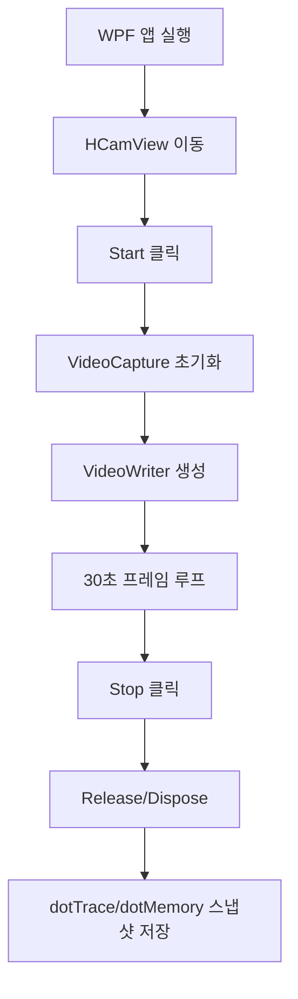

# WPF 웹캠 녹화 앱을 dotTrace와 dotMemory로 분석하기

2026년 7월 13일 기준으로 WPF 웹캠 프리뷰와 H.264 녹화 기능을 분석했다. 기능 자체보다 "왜 느린지"를 확인하는 일이 더 중요해질 때가 있다. 이번에는 `OpenCvSharp` 기반 웹캠 녹화 앱을 JetBrains `dotTrace`와 `dotMemory`로 분석했다.

## 분석한 문제

처음에는 `Start` 버튼을 누른 뒤 프리뷰가 뜨기까지 20초 이상 걸렸다. 이후 카메라 초기화 방식을 바꿔 1~2초 수준으로 줄였고, 이번에는 프로파일러로 실제 병목이 어디에 있는지 확인했다.

시나리오는 단순하다.

```text
HCamView 진입 -> Start -> 30초 녹화 -> Stop
```

## 사용한 도구

| 도구 | 용도 |
| --- | --- |
| dotTrace | CPU 시간, 호출 흐름, Hot Spot 확인 |
| dotMemory | 힙 스냅샷, 객체 잔존, 메모리 증가 확인 |
| Rider | 스냅샷 열람 및 디버깅 |
| OpenCvSharp | 웹캠 캡처와 H.264 녹화 |

참고 링크:

- dotTrace Command-Line Profiler: https://www.jetbrains.com/help/profiler/Performance_Profiling__Profiling_Using_the_Command_Line.html
- dotTrace CLI NuGet: https://www.nuget.org/packages/JetBrains.dotTrace.CommandLineTools.windows-x64/
- dotMemory Console NuGet: https://www.nuget.org/packages/JetBrains.dotMemory.Console.windows-x64/

## 왜 CLI를 썼나

Rider GUI에서도 `Profile` 메뉴로 dotTrace/dotMemory를 실행할 수 있다. 하지만 반복 측정에는 CLI가 더 편하다. 같은 실행 파일, 같은 시나리오, 같은 저장 위치로 스냅샷을 만들 수 있기 때문이다.

dotTrace 실행은 이런 형태다.

```powershell
dottrace.exe start `
  --profiling-type=Sampling `
  --save-to="profiler-snapshots\dottrace_sampling_260713_1728.dtp" `
  --service-input="profiler-snapshots\dottrace_service_input_260713_1728.txt" `
  --service-output=on `
  --work-dir="bin\Debug" `
  "bin\Debug\HhdWpfStudy.exe"
```

dotMemory는 시작 시점과 30초 타이머 스냅샷을 남겼다.

```powershell
dotMemory.exe start `
  --trigger-on-activation `
  --trigger-timer=30s `
  --trigger-max-snapshots=3 `
  --timeout=50s `
  --save-to-file="profiler-snapshots\dotmemory_workspace_260713_1728.dmw" `
  --overwrite `
  --saving-mode=always `
  "bin\Debug\HhdWpfStudy.exe"
```

## 실행 흐름



## dotTrace 결과

앱 로그는 다음처럼 정상 흐름을 보여줬다.

```text
17:16:57 BTN_START_CLICK
17:16:58 CAM_START width:1280 height:720
17:16:58 REC_FILE_CREATE
17:17:27 REC_STOP
17:17:27 RESOURCE_RELEASE
```

주요 측정값은 다음과 같다.

| 함수 | 시간 | 해석 |
| --- | ---: | --- |
| `_RunCamLoop()` | 27.2초 | 30초 녹화 중 루프 수행 |
| `_StartCam()` | 1.4초 | 카메라와 writer 초기화 |
| `VideoCapture..ctor` | 0.46초 | 카메라 open |
| `VideoCapture.Set` | 0.93초 | 1280x720, 30fps 설정 |
| `VideoCapture.Read` | 21.9초 | 대부분 프레임 대기 시간 |
| `VideoWriter.Write` | 4.4초 | H.264 인코딩/쓰기 비용 |
| `Dispatcher.Invoke` | 0.16초 | UI 프리뷰 갱신 비용 |

읽을 때 중요한 점은 `VideoCapture.Read`가 꼭 나쁜 병목은 아니라는 것이다. 웹캠에서 다음 프레임을 기다리는 시간이 포함되기 때문이다. 실제 개선 대상으로는 `VideoWriter.Write`, 프리뷰 변환, UI 갱신 빈도를 봐야 한다.

## dotMemory에서 봐야 할 것

dotMemory workspace는 `.dmw` 파일로 저장된다. Rider 또는 dotMemory UI에서 열어 Snapshot #1과 Snapshot #2를 비교하면 된다.

확인할 객체는 다음이다.

| 객체 | 확인 이유 |
| --- | --- |
| `HCamView` | 화면 전환 후 View가 남는지 확인 |
| `BitmapSource` | 프리뷰 이미지가 누적되는지 확인 |
| `OpenCvSharp.Mat` | native buffer 정리 확인 |
| `VideoCapture` | 카메라 핸들 해제 확인 |
| `VideoWriter` | writer 해제 확인 |
| `byte[]` | 이미지 변환 버퍼 증가 확인 |

## 개선 결론

1차 개선 포인트는 프리뷰 FPS 제한이다.

현재 구조는 매 프레임마다 다음 작업을 수행한다.

```text
Read -> Write -> ToBitmapSource -> Dispatcher.Invoke
```

녹화는 30fps로 유지하더라도, 프리뷰는 10~15fps만 갱신해도 충분하다. 이렇게 하면 `ToBitmapSource()` 호출과 WPF 이미지 교체 횟수를 줄일 수 있다.

2차 개선 포인트는 `Dispatcher.Invoke`를 `Dispatcher.BeginInvoke`로 바꾸는 것이다. 지금 측정값은 크지 않지만, 동기 호출은 캡처 루프가 UI 스레드를 기다리는 구조다. 프리뷰 프레임 드랍을 허용한다면 비동기 UI 갱신이 더 안전하다.

3차 개선은 캡처/인코딩/프리뷰 루프 분리다. 이건 코드량이 늘어나므로 나중에 적용하는 편이 좋다.

## 정리

프로파일러를 붙이기 전에는 "웹캠이 느린가?", "H.264 writer가 느린가?", "WPF UI가 막히는가?"를 감으로 판단하게 된다. dotTrace를 붙이면 어느 함수가 시간을 쓰는지 바로 분리된다. dotMemory는 Stop 이후 객체가 남는지 확인하는 데 유용하다.

이번 분석에서 얻은 결론은 간단하다.

```text
카메라 시작 지연은 해결됨
녹화 중 주요 비용은 Read 대기와 H.264 Write
다음 개선은 프리뷰 FPS 제한과 비동기 UI 갱신
```
