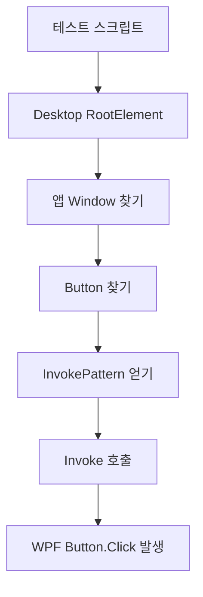

# WPF UI Automation으로 GUI 테스트 자동화하기

WPF 앱을 만들다 보면 버튼을 누르고, 화면을 전환하고, 파일이 생성되는지 확인하는 테스트가 필요하다. 사람이 직접 누르면 확실하지만 반복하기 어렵다. 이럴 때 Windows UI Automation을 쓰면 실제 사용자 동작에 가까운 GUI 테스트를 자동화할 수 있다.

## UI Automation이란

Microsoft UI Automation은 Windows UI 요소를 자동화 트리로 노출하는 접근성 프레임워크다. WPF 버튼, 텍스트박스, 체크박스, 창은 `AutomationElement`로 보이고, 각 컨트롤은 자신이 할 수 있는 동작을 `Control Pattern`으로 제공한다.

참고 자료:

- Microsoft UI Automation Overview: https://learn.microsoft.com/en-us/dotnet/framework/ui-automation/ui-automation-overview
- UI Automation Control Patterns: https://learn.microsoft.com/en-us/dotnet/framework/ui-automation/ui-automation-control-patterns-overview
- Find Element by PropertyCondition: https://learn.microsoft.com/en-us/dotnet/framework/ui-automation/find-a-ui-automation-element-based-on-a-property-condition
- Invoke a Control: https://learn.microsoft.com/en-us/dotnet/framework/ui-automation/invoke-a-control-using-ui-automation
- FlaUI: https://github.com/FlaUI/FlaUI

## 원리

사람이 버튼을 누르는 흐름을 자동화 코드로 바꾸면 다음과 같다.



핵심은 좌표 클릭이 아니라 컨트롤 의미를 찾아 동작시키는 것이다.

| 개념 | 설명 |
| --- | --- |
| `AutomationElement` | 자동화 트리의 UI 노드 |
| `NameProperty` | 화면에 보이는 이름, WPF Button의 Content가 노출되기도 함 |
| `AutomationIdProperty` | 테스트용 안정 식별자 |
| `InvokePattern` | 버튼 클릭 같은 실행 동작 |
| `ValuePattern` | 텍스트 입력/조회 |
| `TogglePattern` | 체크박스 토글 |

## 간단 예제: Start 버튼 누르기

아래 PowerShell은 실행 중인 `HhdWpfStudy` 창을 찾고 `Start` 버튼을 누른다.

```powershell
Add-Type -AssemblyName UIAutomationClient
Add-Type -AssemblyName UIAutomationTypes

$root = [System.Windows.Automation.AutomationElement]::RootElement

$winCond = New-Object System.Windows.Automation.PropertyCondition(
    [System.Windows.Automation.AutomationElement]::NameProperty,
    "HhdWpfStudy"
)

$win = $root.FindFirst(
    [System.Windows.Automation.TreeScope]::Children,
    $winCond
)

$btnCond = New-Object System.Windows.Automation.PropertyCondition(
    [System.Windows.Automation.AutomationElement]::NameProperty,
    "Start"
)

$btn = $win.FindFirst(
    [System.Windows.Automation.TreeScope]::Descendants,
    $btnCond
)

$pattern = $btn.GetCurrentPattern(
    [System.Windows.Automation.InvokePattern]::Pattern
)

$pattern.Invoke()
```

이 코드는 실제 마우스 좌표를 쓰지 않는다. 그래서 창 위치가 조금 달라져도 버튼을 찾을 수 있다.

## 실용 예제: 웹캠 녹화 앱 테스트

웹캠 녹화 앱에서는 다음을 자동화할 수 있다.

```text
앱 실행 -> HCamView 이동 -> Start -> 10초 대기 -> Stop -> 로그/파일 확인
```

```powershell
Add-Type -AssemblyName UIAutomationClient
Add-Type -AssemblyName UIAutomationTypes

$exe = "C:\Users\hhd20\project\HhdWpfStudy\bin\Release\HhdWpfStudy.exe"
$p = Start-Process -FilePath $exe -PassThru
Start-Sleep -Seconds 2

$root = [System.Windows.Automation.AutomationElement]::RootElement
$winCond = New-Object System.Windows.Automation.PropertyCondition(
    [System.Windows.Automation.AutomationElement]::NameProperty,
    "HhdWpfStudy"
)
$win = $root.FindFirst([System.Windows.Automation.TreeScope]::Children, $winCond)

function Invoke-Button($name) {
    $cond = New-Object System.Windows.Automation.PropertyCondition(
        [System.Windows.Automation.AutomationElement]::NameProperty,
        $name
    )
    $btn = $win.FindFirst([System.Windows.Automation.TreeScope]::Descendants, $cond)
    $pattern = $btn.GetCurrentPattern([System.Windows.Automation.InvokePattern]::Pattern)
    $pattern.Invoke()
}

Invoke-Button "HCamView"
Start-Sleep -Seconds 2

Invoke-Button "Start"
Start-Sleep -Seconds 10

Invoke-Button "Stop"
Start-Sleep -Seconds 3

Stop-Process -Id $p.Id -ErrorAction SilentlyContinue
```

테스트 후에는 UI 조작 성공만 보지 말고 로그와 파일도 확인해야 한다.

| 검증 | 예시 |
| --- | --- |
| 로그 | `CAM_START`, `REC_FILE_CREATE`, `REC_STOP`, `RESOURCE_RELEASE` |
| 출력 파일 | `.m4v` 파일 존재와 크기 |
| DLL | `openh264-1.8.0-win64.dll` 존재 |
| 프로세스 | 테스트 종료 후 프로세스 정리 |

## 더 안정적으로 만들기: AutomationId

버튼 텍스트로 찾는 방식은 쉽지만, 문구가 바뀌면 테스트가 깨진다. WPF 앱 코드에서 `AutomationProperties.AutomationId`를 지정하면 더 안정적이다.

```csharp
using System.Windows.Automation;

var btnStart = new Button
{
    Name = "btnStart",
    Content = "Start"
};

AutomationProperties.SetAutomationId(btnStart, "btnStart");
```

그러면 테스트에서는 표시 텍스트가 아니라 `AutomationId`로 찾을 수 있다.

```powershell
$cond = New-Object System.Windows.Automation.PropertyCondition(
    [System.Windows.Automation.AutomationElement]::AutomationIdProperty,
    "btnStart"
)
```

## FlaUI를 쓰면 더 테스트답게 쓸 수 있다

PowerShell은 빠른 진단에는 좋다. 하지만 테스트 케이스가 많아지면 FlaUI 같은 래퍼를 쓰는 편이 좋다.

```csharp
using FlaUI.Core;
using FlaUI.UIA3;

using var app = Application.Launch("HhdWpfStudy.exe");
using var automation = new UIA3Automation();

var window = app.GetMainWindow(automation);
window.FindFirstDescendant(cf => cf.ByText("HCamView")).AsButton().Invoke();
window.FindFirstDescendant(cf => cf.ByText("Start")).AsButton().Invoke();
Thread.Sleep(TimeSpan.FromSeconds(10));
window.FindFirstDescendant(cf => cf.ByText("Stop")).AsButton().Invoke();
```

선택 기준은 이렇다.

| 상황 | 추천 |
| --- | --- |
| 빠른 수동 보조 테스트 | PowerShell + UIAutomation |
| 반복 회귀 테스트 | FlaUI + xUnit/NUnit |
| 웹 브라우저 테스트 | Playwright |
| 좌표밖에 방법이 없는 앱 | 좌표/이미지 기반 자동화 |

## 주의할 점

Microsoft 문서는 `RootElement`에서 전체 descendants를 무작정 검색하지 말라고 경고한다. 데스크톱 전체를 순회하면 요소가 너무 많아 느려지거나 문제가 생길 수 있다. 먼저 앱 창을 찾고, 그 창 안에서만 버튼을 찾아야 한다.

또한 UI 스레드가 멈추면 UI Automation 호출도 느려진다. GUI 테스트가 느려졌다면 앱의 UI thread가 막힌 것인지도 의심해야 한다.

| 문제 | 원인 | 대응 |
| --- | --- | --- |
| 버튼을 못 찾음 | Name/AutomationId 없음 | AutomationId 지정 |
| 테스트가 느림 | UI thread block | 긴 작업 백그라운드 처리 |
| 커스텀 컨트롤이 안 보임 | AutomationPeer 미구현 | AutomationPeer 구현 검토 |
| 다른 PC에서 실패 | 해상도/권한/세션 차이 | 로그/타임아웃/환경 체크 추가 |

## 정리

LLM이 WPF GUI 테스트를 하는 것처럼 보이는 이유는 LLM이 직접 화면을 보는 것이 아니라, Windows UI Automation API를 호출하는 스크립트를 작성하고 실행하기 때문이다.

```text
LLM
  -> 테스트 절차 생성
  -> PowerShell/.NET UIAutomation 실행
  -> WPF 컨트롤 찾기
  -> InvokePattern.Invoke()
  -> 실제 Click 이벤트 발생
  -> 로그와 파일로 결과 검증
```

WPF 앱을 테스트하기 좋게 만들려면 주요 컨트롤에 `AutomationId`를 붙이고, UI 조작 결과를 로그/파일/프로세스 상태로 검증하는 습관을 들이는 것이 좋다.
